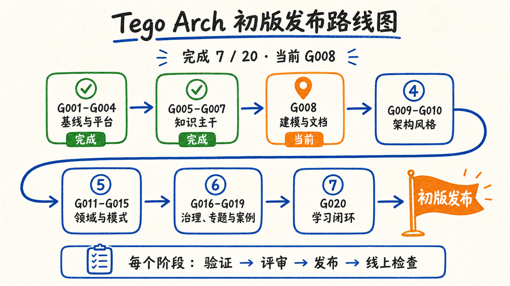
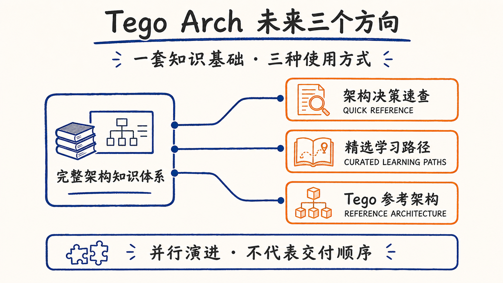

# Tego Arch 架构知识项目（Tego Arch）

面向有经验的高级工程师，用证据、权衡与真实案例训练从实现到架构决策的能力。

[在线阅读](https://sealday.github.io/tego-arch/) · [学习路径](https://sealday.github.io/tego-arch/paths) · [案例库](https://sealday.github.io/tego-arch/cases) · [术语规范](https://sealday.github.io/tego-arch/terminology) · [参与贡献](#参与贡献)

本项目不是架构名词或外部链接的重新排列。项目把架构基础、质量属性（Quality Attribute）、设计方法、原则、建模、模式、风格与真实案例内化为可独立阅读、可验证、可比较的中文知识体系，并明确区分事实、基于证据的推断、本站分析与未知项。

## 初版方向

初版以“完整”为目标：沿 20 个持久故事建立从内容治理到架构知识、生产实践、案例与练习的闭环。每个阶段都必须经过验证、独立评审、发布和线上检查。



路线图是 2026-08-05 生成的视觉快照，不是实时状态。最新的精确进度、当前故事和停止条件只在 [`docs/content-backlog.md`](docs/content-backlog.md) 维护。

## 适合谁

- 已有扎实开发经验，准备承担架构设计、技术决策或跨团队协作职责；
- 希望从业务目标和质量属性推导架构，而不是先选模式或产品；
- 需要系统训练边界、控制权、状态、失败恢复、安全、观测、成本与演化判断；
- 愿意回到标准、官方文档、论文、源码和一手工程材料核对结论。

如果你只需要框架功能清单、面试速记或可以直接复制的“最佳架构”，这里可能不适合你。

## 如何使用

1. 从[学习路径](https://sealday.github.io/tego-arch/paths)建立主线；
2. 用[真实案例](https://sealday.github.io/tego-arch/cases)观察控制、状态和故障边界；
3. 在原则、质量属性、方法、建模、模式与风格之间比较相邻选择；
4. 通过资料库回到一手来源，通过设计题检验自己的取舍。

## 未来三个方向

完整知识体系是共同基础。接下来将沿三个方向并行演进；它们代表不同的使用场景，不构成固定的交付顺序或发布日期。



### 架构决策速查（Architecture Decision Quick Reference）

把核心原则、决策检查项和常见失误模式整理成可快速查用的工作资料，服务方案设计、架构评审与故障复盘。

### 精选学习路径（Curated Learning Paths）

按经验阶段、角色与任务场景组织更短的学习序列，同时保留回到完整论证、真实案例和来源证据的入口。

### Tego 参考架构（Tego Reference Architecture）

持续公开该项目的架构决策、取舍依据、验证结果与演进路线，形成可审视、可讨论，但不鼓励直接复制的实践参考。

## 本地开发

要求 Node.js `>=24.0`。

```bash
npm ci
npm run start
```

提交前运行完整验证：

```bash
npm run verify
```

需要重新联网检查外部链接时，单独运行 `npm run check:links:live`。

## 参与贡献

欢迎贡献以下内容：

- 内容：概念、原则、质量属性、方法、建模、模式、风格、案例、反模式和设计题；
- 证据：来源补充、版本固定、错误纠正、失效链接和许可证边界；
- 图示：原创位图、文本图或可编辑矢量图；
- 工程：内容契约、生成器、验证、可访问性、性能和导航改进。

小型事实纠错、错别字、失效链接和局部测试修复可以直接提交拉取请求。新主题、页面结构变化、许可证变化、来源模型变化或跨页面重构，请先创建议题，写明读者问题、范围、来源候选和停止条件。

贡献时请遵守：

1. 从 [`docs/content-backlog.md`](docs/content-backlog.md) 读取活跃任务；历史规格与计划不恢复为活任务。
2. 优先使用标准、原作者、官方文档、论文、源码和一手工程材料；路线图和聚合索引只用于发现与学习。
3. 明确区分事实、基于证据的推断、厂商自述、本站分析和未知项。
4. 使用原创中文表达，不逐段翻译，不复制第三方图表或目录文案。
5. 遵守[术语规范](https://sealday.github.io/tego-arch/terminology)：受管术语首次出现使用 `中文（English，ACRONYM）`，后续使用规范中文或已登记写法。
6. 产品、项目、组织、协议和标准等专名保留官方拼写，并在首次出现时用中文说明其类别或意义；代码、命令、路径、字段名、文献原题和直接引文保持原样。
7. 新术语先登记到 [`data/terminology.json`](data/terminology.json)，再用于正文、表格或图示。
8. 把外部来源登记到 [`data/source-ledger.json`](data/source-ledger.json)，让正文引用、许可证和使用角色闭合。
9. 图示遵守 [项目插图技能](.codex/skills/illustrating-architecture-articles/SKILL.md) 的格式决策与集成规则。
10. 提交前运行 `npm run verify`，并完成拉取请求模板中的来源、版权与术语检查。

## 许可证与第三方材料

- 项目自有代码、构建脚本、测试、配置和工具代码：[代码许可证](LICENSE)。
- 项目自有中文文章与原创插图：[内容许可证](LICENSE-CONTENT.md)。
- 第三方来源、短引用、外部图片、商标和链接作品不被上述许可证重新授权，详见 [NOTICE.md](NOTICE.md) 与 [`data/source-ledger.json`](data/source-ledger.json)。
