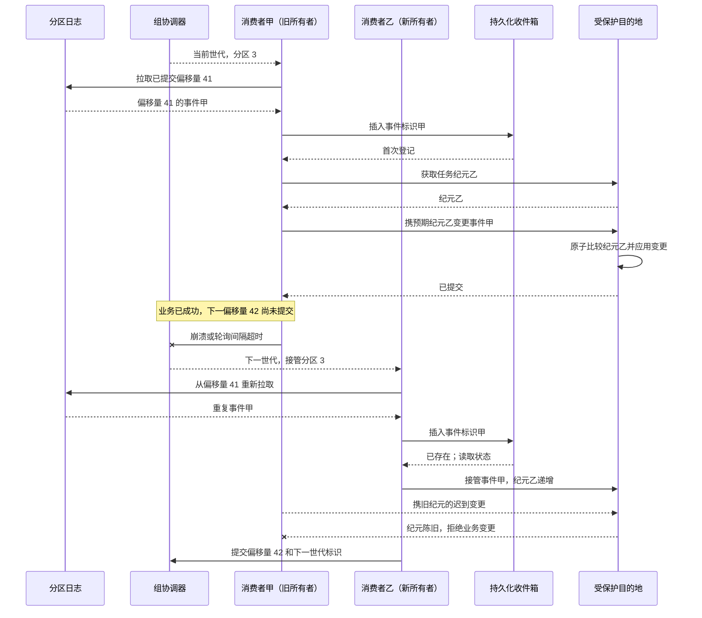

# 消费者组：用分区所有权组织可重放的智能体工作

再均衡把分区 3 从消费者甲转给消费者乙时，旧消费者发出的超文本传输协议（Hypertext Transfer Protocol，HTTP）请求可能仍在执行。Kafka 能阻止失去分配的成员继续用旧世代提交偏移量，却不会撤回这个请求，也不会替业务数据库选择哪次写入有效。

消费者组的可迁移价值，正是把“取数所有权”和“业务动作所有权”拆开。分区分配、偏移量与保留日志支撑接管和重放；收件箱、幂等键、租约、隔离栅栏与对账才负责处理在途工作的重叠。

**证据范围**：本文以 Kafka 4.3.1 文档和`apache/kafka@ebac341b28d4224c296ada31eb45122176e8b27b`为截面，重点讨论默认仍为`classic`的消费者组协议。必须先记住：分区内顺序不等于跨分区全局顺序；Kafka 事务也不等于任意数据库、邮件、支付和工具调用的通用事务。

## 学习问题

1. 分区、偏移量与保留日志如何共同定义恢复位置？
2. 经典模式再均衡转移分区时，为什么旧所有者的在途动作仍可能完成？
3. 位置、已提交偏移量与业务完成状态为何是三件事？
4. 分区密钥怎样交换局部顺序、并行度、公平性与热点风险？
5. 智能体平台如何用收件箱、隔离栅栏、背压和重放管住重复处理？

## 一页摘要

**已证实事实**：Kafka 主题分成分区，事件追加到其中一个分区。相同密钥的事件进入同一分区；消费者按主题内单个分区的写入顺序读取。该保证只在分区内成立，不提供跨分区的全局顺序。

同一`group.id`内，一个分区在当前分配中交给一个消费者。经典模式协议由代理节点协调器管理成员、世代和状态；被选为领导者的客户端执行分配器，再通过组同步让协调器保存并传播分配。

消费者位置是下一次`poll()`返回的位置，已提交偏移量是失败或再均衡后的恢复位置。业务动作成功而偏移量未提交时进程失败，接管者会从旧偏移量重读。这是至少一次的重复窗口。

**个人分析**：分区分配只决定谁能继续取数。长时智能体应先把事件耐久登记为工作项，再由具有独立租约和纪元的工作进程（worker）执行；最终目的地必须以幂等键或原子隔离栅栏拒绝旧所有者的迟到写。

| Kafka 边界| 它实际保证什么| 不能推出什么|
| --- | --- | --- |
| 分区内顺序| 同一分区按日志顺序读取| 跨分区的全局顺序|
| 一个分区对应一个组成员| 当前分配的取数所有者| 单任务锁、旧工作进程已停止|
| 已提交偏移量| 重启与再均衡的恢复游标| 前序副作用已成功且只发生一次|
| 保留日志、定位与重置| 保留范围内重放输入| 无限历史、确定性智能体输出|
| Kafka 事务| Kafka 输出与输入偏移量的原子边界| 任意外部系统的通用事务|

应保留的结论是：顺序域、取数所有权、恢复游标和业务事务各有边界，不能用“Kafka 已经恰好一次”把它们合并。

## 事实边界

**已证实事实**：消费者数量超过分区数量时，多出的成员不能增加该主题的分区并行度。成员崩溃、加入、离开或订阅出现新分区时会再均衡；心跳、`session.timeout.ms`和持续`poll()`共同维持经典模式组活性。

**已证实事实**：`max.poll.records`限制一次返回给应用的记录数，不限制底层拉取缓存。`pause`/`resume`只控制已分配分区的后续返回，不会让生产者停止写入。

**已证实事实**：生产者幂等性针对生产者的重试（Retry）写入，并受单个生产者会话边界限制。Kafka 事务可原子提交流输出与消费者偏移量，配合`read_committed`形成 Kafka 内部边界；任意外部系统仍需自己配合。

**基于证据的推断**：组世代能拒绝陈旧成员提交偏移量，却不能隔离栅栏已发送的业务请求。目标存储必须比较更高层所有权纪元，并在同一原子操作中决定是否应用业务变更。

**个人分析**：Kafka 偏移量不是完整审计快照。重放只恢复输入字节和顺序，不恢复模型、提示词、工具、知识、权限与外部世界的历史版本；这些版本需要独立账本。

  
证据：版本、协议与历史材料范围

  - **当前文档：** Kafka 4.3.1；消费者配置支持`classic`与`consumer`，默认仍为`classic`。
  - **新协议边界：** `consumer`协议自 Kafka 4.0 起正式可用，且不依赖经典模式的全局同步屏障；本文不把两套状态机混写。
  - **排除项：** 不把 Kafka 4.3 共享组的逐记录获取、交付尝试或拒绝语义倒推到消费者组。
  - **固定源码：** `apache/kafka@ebac341b28d4224c296ada31eb45122176e8b27b`。
  - **历史来源：** 原始工程团队于 2011 年发表的文章用于确认数据库研讨会论文；论文文档由研究机构网站托管。
  - **时间边界：** 来源访问与分析日期为2026-07-22。

## 架构图

先看稳定状态下的所有权：一个组内，分区如何分给消费者？图中每条分配线都只指向一个当前读取者。

这张图只说明当前分配的取数所有权。它不把分配解释成业务锁，也不证明外部副作用只发生一次。

再看成员关系变化后的状态转换：稳定消费如何经过撤销与重新分配，回到新的稳定状态？红色虚线单独标出旧所有者的在途动作，因为再均衡不会自动撤回已经发出的业务请求。

这个循环不是无缝切换承诺。新所有者恢复消费与旧工作仍可能完成可以同时成立，业务目的地仍需幂等或隔离栅栏。

下面跟踪所有权转移最危险的时间窗：业务动作已经提交，偏移量还没提交，再均衡又让新消费者接管。Kafka 世代与应用工作纪元故意画成两个变量，因为前者不会自动保护外部目的地。

若目的地不能把纪元比较和业务变更原子绑定，这个设计就不是真正的隔离栅栏。此时只能依赖幂等键、单写分派器、补偿与对账来降低重复副作用。

## 控制权与任务流

**说明性场景**：消费者甲在当前世代拥有分区 3。它从偏移量 41 读取任务甲，调用外部工具后尚未提交下一步偏移量 42；长调用使它超过 `max.poll.interval.ms`，组开始再均衡，消费者乙在下一世代接管分区 3。

消费者乙从已提交偏移量 41 再次读到任务甲。消费者甲并不会因此被 Kafka 强制终止，它发出的请求也可能迟到完成。若目的地只检查“请求来自合法消费者”，新旧消费者都可能造成副作用；若目标端原子比较工作纪元，只有当前纪元的变更生效。

这个场景是对官方至少一次与组所有权机制的说明性组合，不是一次真实事故。它揭示了恢复协议的分界：Kafka 负责重新交付，应用负责判定重复动作能否生效。

经典模式加入组收集成员协议与订阅，协调器选领导者和共同协议。领导者客户端运行分配器，组同步把成员到分区的映射交回代理节点，再由协调器传播。再均衡是分配转移，不是暂停所有在途业务的事务。

处理同一分区的并发任务时，只能提交连续完成前缀的下一偏移量。若43 已完成、42 仍失败，提交44 会跳过42；可以保持分区内串行，或维护无缺口完成水位。

长时智能体不应占住轮询活性。消费者可以校验模式、写持久化收件箱与工作账本，然后提交“已耐久登记”的偏移量；独立工作进程再以租约、截止时间、尝试、纪元和幂等键执行。若仍在消费者内处理，就限制`max.poll.records`、暂停繁忙分区，并继续及时轮询。

重放也需要独立所有权。临时定位可`seek`；批量回填应新建专用组，从明确时间或偏移量读取，不改写生产组游标。执行前核对日志启动偏移量、保留期余量、下游限额和副作用模式。

## 关键源码导读

最短阅读路径从经典模式组状态与加入和同步流程开始，再沿领导者分配、偏移量提交和拉取位置前进。这样可以直接回答：谁算分配、谁传播分配、偏移量证明了什么、记录何时推进本地位置。

**已证实事实**：`ClassicGroup`声明分配由客户端驱动；状态经过`EMPTY → PREPARING_REBALANCE → COMPLETING_REBALANCE → STABLE`。领导者客户端执行分配器，协调器保存并传播结果。

**已证实事实**：偏移量元数据管理器校验并生成偏移量协调器记录，但不调用用户数据库，也不检查智能体结果。客户端则从拉取缓冲区解析已分配分区的记录并推进下一步偏移量；提交与业务完成仍由应用负责。

  
证据：固定提交中的经典模式分配、偏移量与拉取源码接缝

  - [`KafkaApis.scala` 1389–1440](https://github.com/apache/kafka/blob/ebac341b28d4224c296ada31eb45122176e8b27b/core/src/main/scala/kafka/server/KafkaApis.scala#L1389-L1440)：加入组与组同步先检查组的`READ`权限；偏移量提交与拉取还会检查对应组与主题权限，再进入协调器或拉取后端。
  - [`ClassicGroup.java` 72–154](https://github.com/apache/kafka/blob/ebac341b28d4224c296ada31eb45122176e8b27b/group-coordinator/src/main/java/org/apache/kafka/coordinator/group/classic/ClassicGroup.java#L72-L154) 与 [`ClassicGroupState.java` 29–126](https://github.com/apache/kafka/blob/ebac341b28d4224c296ada31eb45122176e8b27b/group-coordinator/src/main/java/org/apache/kafka/coordinator/group/classic/ClassicGroupState.java#L29-L126)：成员、领导者、世代与状态迁移。
  - [`GroupMetadataManager.classicGroupJoin` 6822–6946](https://github.com/apache/kafka/blob/ebac341b28d4224c296ada31eb45122176e8b27b/group-coordinator/src/main/java/org/apache/kafka/coordinator/group/GroupMetadataManager.java#L6822-L6946) 与 [`prepareRebalance` 7648–7732](https://github.com/apache/kafka/blob/ebac341b28d4224c296ada31eb45122176e8b27b/group-coordinator/src/main/java/org/apache/kafka/coordinator/group/GroupMetadataManager.java#L7648-L7732)：加入、等待与世代推进。
  - [`ConsumerCoordinator.onLeaderElected` 655–715](https://github.com/apache/kafka/blob/ebac341b28d4224c296ada31eb45122176e8b27b/clients/src/main/java/org/apache/kafka/clients/consumer/internals/ConsumerCoordinator.java#L655-L715) 与 [`onJoinComplete` 379–474](https://github.com/apache/kafka/blob/ebac341b28d4224c296ada31eb45122176e8b27b/clients/src/main/java/org/apache/kafka/clients/consumer/internals/ConsumerCoordinator.java#L379-L474)：协作式路径先调用`onPartitionsRevoked`；分配路径先执行`subscriptions.assignFromSubscribed(...)`，再调用`onPartitionsAssigned`。
  - [`GroupMetadataManager` 7757–7833](https://github.com/apache/kafka/blob/ebac341b28d4224c296ada31eb45122176e8b27b/group-coordinator/src/main/java/org/apache/kafka/coordinator/group/GroupMetadataManager.java#L7757-L7833)：分配保存与传播。
  - [`OffsetMetadataManager.commitOffset` 620–693](https://github.com/apache/kafka/blob/ebac341b28d4224c296ada31eb45122176e8b27b/group-coordinator/src/main/java/org/apache/kafka/coordinator/group/OffsetMetadataManager.java#L620-L693)：提交者校验与协调器记录。
  - [`ClassicKafkaConsumer.pollForFetches` 700–771](https://github.com/apache/kafka/blob/ebac341b28d4224c296ada31eb45122176e8b27b/clients/src/main/java/org/apache/kafka/clients/consumer/internals/ClassicKafkaConsumer.java#L700-L771)、[`FetchCollector.collectFetch` 91–190](https://github.com/apache/kafka/blob/ebac341b28d4224c296ada31eb45122176e8b27b/clients/src/main/java/org/apache/kafka/clients/consumer/internals/FetchCollector.java#L91-L190) 与 [`CompletedFetch.fetchRecords` 257–329](https://github.com/apache/kafka/blob/ebac341b28d4224c296ada31eb45122176e8b27b/clients/src/main/java/org/apache/kafka/clients/consumer/internals/CompletedFetch.java#L257-L329)：轮询与拉取、分配检查、位置推进与有毒消息反序列化。
  - **证明边界：** 这些位置证明 Kafka 的组与偏移量控制流，不证明用户处理器或外部写具备恰好一次。

## 架构决策与权衡

分区密钥决定顺序域、热点和并行上限。增加分区后，同一密钥的未来映射可能变化，历史记录不会重分区；因此分区数量与密钥变化都是顺序协议迁移。

| 密钥| 获得的局部顺序| 优点| 代价与边界|
| --- | --- | --- | --- |
| `user_id` | 用户内事件| 偏好、权限、通知去重直观| 大用户热点，跨用户无序|
| `tenant_id` | 租户内事件| 租户审计与串行治理| 并行度低，高噪声邻居|
| `task_id` | 单任务计划与尝试与结果| 任务间并行、重放边界清楚| 跨任务政策需额外版本化|
| `conversation_id` | 会话内消息与派生任务| 适合聊天因果与人工轮次| 长会话热点，分叉与合并要显式|

默认可用`task_id`作为执行主题密钥，把对话、用户、租户保留为索引和策略字段。只有业务不变量要求会话严格串行时，才用`conversation_id`。任何选择都不提供跨分区全局顺序。

偏移量提交也取决于业务边界。外部数据库可用收件箱唯一约束，或把业务结果与恢复游标放在同库事务；Kafka 内部处理可用事务型生产者与`read_committed`。邮件、支付和工具调用仍需外部幂等、分派器或补偿。

有毒消息不能无限阻塞分区，也不能静默跳过。隔离区至少保存主题与分区与偏移量、原始数据或受控地址、模式、异常、尝试、租户与处置状态；若事件是同密钥后续不变量的前置条件，应暂停并升级。

## 生产化分析

分区数只给出一组的活跃消费者上限，不代表有效智能体并行度。按工作类型维护处理时长和并发预算；用`max.poll.records`控制暴露量，对下游拥塞分区`pause`。不要把轮询出来的记录无限堆入内存执行器。

滞后量是症状，不是业务完成量。结合`records-lag-max`、消费速率、轮询间隔、已分配分区、提交错误和再均衡指标，再看最旧事件时长、租约时长、工具时延、重复抑制、死信队列时长、租户积压与排空预计完成时间。

生产者用事务型发件箱避免“数据库已有事实，Kafka 无事件”。消费者在数据库事务中登记稳定`event_id`，业务成功后再提交偏移量。对于外部调用，继续传幂等性密钥并保存请求与结果哈希值；收件箱单独不能消除“外部成功、落库前崩溃”的重复窗口。

隔离栅栏必须由权威目的地原子执行。所有状态写带`(task_id, epoch)`；旧纪元影响零行后停止。若只能先读纪元再单独写，中间接管会形成检查与使用之间的竞态，这不是真隔离栅栏。

保留期应覆盖最长中断、检测、修复和重放窗口。业务审计另存事件标识、输入哈希值、模式、生产者、主题与分区与偏移量、模型与提示词与工具版本、尝试、纪元、结果、偏移量提交与人工决策。日志保留策略不能替代合规删除与密钥治理。

  
证据：保留期与偏移量恢复窗口的精确配置

  - **主题日志：** `retention.ms`与`retention.bytes`共同约束事件日志可重放窗口；达到任一边界都可能让旧记录离开可用范围。
  - **消费者偏移量：** `offsets.retention.minutes`约束组偏移量元数据保留期，不等同于主题日志保留。
  - **边界：** 重放能否进行要同时核对日志启动偏移量、主题保留期与组偏移量；这些配置都不能替代业务审计存储。

  
证据：消费者监控字段与 Kafka 事务接缝

  - **客户端指标：** `records-consumed-rate`、`time-between-poll-max`与`last-poll-seconds-ago`分别帮助判断吞吐和轮询活性。
  - **操作入口：** `kafka-consumer-groups.sh --describe`用于查看组分配、偏移量与滞后量；它不证明业务处理器已完成。
  - **提交接缝：** `commitAsync`保证提交请求与回调的调用顺序；应用仍不能在旧回调中回写倒退的业务水位。
  - **事务接缝：** 事务型生产者的`sendOffsetsToTransaction`把消费偏移量与 Kafka 输出纳入同一 Kafka 事务，不覆盖数据库、邮件、支付或任意工具调用。
  - **边界：** 这些字段与应用程序编程接口（Application Programming Interface，API）支持定位轮询、滞后量、提交与 Kafka 内部事务，不提供外部副作用恰好一次。

生产集群应启用传输层安全协议（Transport Layer Security，TLS）、简单认证与安全层与访问控制列表，限制生产者主题、消费者主题与组，以及偏移量重置、组删除、主题修改与死信队列重放权限。长期事件中不要放提供方密钥、访问令牌或完整敏感提示词。

**不可隐藏的非等价边界**：分区顺序不是全局顺序，分配不是业务锁，偏移量不是逐记录业务确认回执，Kafka 事务也不是跨任意外部系统的通用事务。智能体架构必须逐项补足，而不能用一个“恰好一次”标签覆盖。

## 可迁移经验

### 可直接复用的机制

1. 用稳定密钥把需要串行的不变量放进同一分区。
2. 用不同组分隔在线执行、审计、索引和回填。
3. 把已提交偏移量当恢复游标，保存下一步偏移量与业务结果引用。
4. 用滞后量与时长、轮询、再均衡、提交、死信队列和去重构建端到端信号。
5. 为重放预留保留期、专用组、限速、演练运行与对账。

### 只能有限类比的部分

1. 分区分配可类比工作所有权，但只控制取数。
2. 重放恢复输入流，不恢复模型的确定性内部状态。
3. 组故障转移接管未提交工作，新旧工作进程仍可能在外部重叠。
4. Kafka 事务精确覆盖 Kafka 偏移量与 Kafka 输出，不自动覆盖任意目的地。

[STY-09 Pipes and Filters](/styles/sty-09)继续解释处理步骤的组合、逐边界容量传播和阶段恢复；本案例仍只负责分区、偏移量、再均衡与消费者取数所有权，两者都不把重放提升为外部效果恰好一次。

### 不应照搬的部分

1. 不要为不需要的总顺序把大租户全放进一个分区。
2. 不要在轮询线程无界等待长时模型、工具或人工。
3. 不要先提交再执行高价值动作，也不要把自动提交当业务确认回执。
4. 不要把死信队列当垃圾桶后无条件推进同密钥后续状态。
5. 不要宣称 Kafka 提供全局顺序、处理器恰好一次或通用分布式事务。

## 来源

**官方文档与 API（已证实事实）**

- [Apache Kafka Introduction](https://kafka.apache.org/intro/) 与 [Kafka 4.3 Design](https://kafka.apache.org/43/design/design/)：主题、分区、密钥、位置、交付语义、事务与外部系统边界。
- [KafkaConsumer 4.3.1 Javadoc](https://kafka.apache.org/43/javadoc/org/apache/kafka/clients/consumer/KafkaConsumer.html) 与 [KafkaProducer 4.3.1 Javadoc](https://kafka.apache.org/43/javadoc/org/apache/kafka/clients/producer/KafkaProducer.html)：分配、提交、定位、暂停与恢复、生产者幂等性与事务。
- [Consumer Configs](https://kafka.apache.org/43/configuration/consumer-configs/) 与 [Consumer Rebalance Protocol](https://kafka.apache.org/43/operations/consumer-rebalance-protocol/)：经典模式与消费者协议、轮询与会话超时与新协议差异。
- [Topic Configs](https://kafka.apache.org/43/configuration/topic-configs/) 与 [Broker Configs](https://kafka.apache.org/43/configuration/broker-configs/)：日志保留期与偏移量保留期。
- [Basic Operations](https://kafka.apache.org/43/operations/basic-kafka-operations/)、[Monitoring](https://kafka.apache.org/43/operations/monitoring/) 与 [Security](https://kafka.apache.org/43/security/security-overview/)：组与偏移量与滞后量操作、指标及传输层安全协议与简单认证与安全层与访问控制列表。

**经典论文与原始工程资料（已证实事实）**

- 三位论文作者在 [Kafka: a Distributed Messaging System for Log Processing](https://www.microsoft.com/en-us/research/wp-content/uploads/2017/09/Kafka.pdf) 中说明了原始日志、分区、消费者组与显式偏移量设计。
- 原始工程团队的 [Open-sourcing Kafka](https://www.linkedin.com/blog/member/archive/open-source-linkedin-kafka)（2011-01-11）与 [Project Kafka reaches v0.6](https://www.linkedin.com/blog/engineering/open-source/project-kafka-distributed-publish-subscribe-messaging-system-reaches-v06)（2011-06-16）：公开背景、早期语义与论文链接。
- 原始设计者的 [The Log](https://www.linkedin.com/blog/engineering/distributed-systems/log-what-every-software-engineer-should-know-about-real-time-datas-unifying)（2013）：仅追加日志、分区内全序与分区间无全局顺序。

**固定源码（已证实事实）**

- [`apache/kafka@ebac341b28d4224c296ada31eb45122176e8b27b`](https://github.com/apache/kafka/tree/ebac341b28d4224c296ada31eb45122176e8b27b)：本文唯一源码截面。
- [`ClassicGroup` / `ClassicGroupState`](https://github.com/apache/kafka/blob/ebac341b28d4224c296ada31eb45122176e8b27b/group-coordinator/src/main/java/org/apache/kafka/coordinator/group/classic/ClassicGroup.java)：成员关系、世代、领导者与状态机。
- [`GroupMetadataManager`](https://github.com/apache/kafka/blob/ebac341b28d4224c296ada31eb45122176e8b27b/group-coordinator/src/main/java/org/apache/kafka/coordinator/group/GroupMetadataManager.java) 与 [`OffsetMetadataManager`](https://github.com/apache/kafka/blob/ebac341b28d4224c296ada31eb45122176e8b27b/group-coordinator/src/main/java/org/apache/kafka/coordinator/group/OffsetMetadataManager.java)：加入与再均衡与同步与分配与偏移量记录。
- [`ConsumerCoordinator`](https://github.com/apache/kafka/blob/ebac341b28d4224c296ada31eb45122176e8b27b/clients/src/main/java/org/apache/kafka/clients/consumer/internals/ConsumerCoordinator.java)：经典模式领导者分配器与回调。
- [`ClassicKafkaConsumer`](https://github.com/apache/kafka/blob/ebac341b28d4224c296ada31eb45122176e8b27b/clients/src/main/java/org/apache/kafka/clients/consumer/internals/ClassicKafkaConsumer.java)、[`FetchCollector`](https://github.com/apache/kafka/blob/ebac341b28d4224c296ada31eb45122176e8b27b/clients/src/main/java/org/apache/kafka/clients/consumer/internals/FetchCollector.java) 与 [`CompletedFetch`](https://github.com/apache/kafka/blob/ebac341b28d4224c296ada31eb45122176e8b27b/clients/src/main/java/org/apache/kafka/clients/consumer/internals/CompletedFetch.java)：轮询与拉取、位置与有毒消息接缝。
- [`KafkaApis.scala`](https://github.com/apache/kafka/blob/ebac341b28d4224c296ada31eb45122176e8b27b/core/src/main/scala/kafka/server/KafkaApis.scala)：代理节点 API、安全与后端入口。

**证据边界说明**：官方与固定源码支持 Kafka 机制；智能体任务、审批、工具调用、补偿、收件箱和业务隔离栅栏是本文迁移设计。访问与截断日期均为**2026-07-22**。
