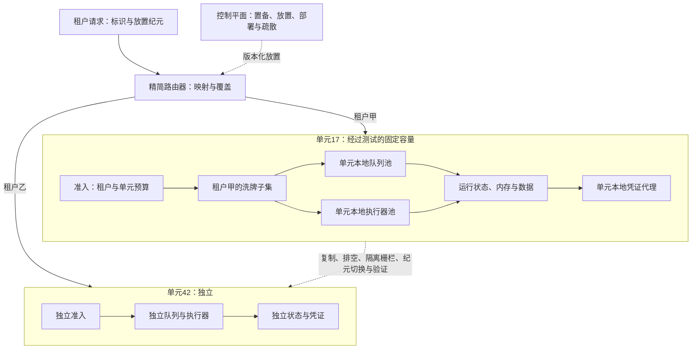

# 单元架构与洗牌分片：把失控智能体限制在可计算的故障半径内

一个租户触发有毒消息提示词、无界工具循环或异常上下文时，最坏结果不应是全平台模型额度、执行器和队列一起耗尽。单元架构先把完整工作负载切成固定容量的独立舱壁；洗牌分片再让单元内租户只接触共享池的一小组资源。

这两层处理不同故障。单元拥有应用逻辑、状态、容量和恢复边界；洗牌分片只降低共享资源的重叠。若所有单元仍共用一个不可分模型配额、数据库、凭证代理或全局重试（Retry）队列，组合数学不会创造隔离。

**证据范围与依赖边界**：AWS 当前指南支撑单元化与洗牌分片原则。`awslabs/route53-infima`已于**2024-06-06** 归档只读；本文只用固定提交`cabce497698e41d610a949e8a5e4a0528170382b`解释历史算法，不推荐把它作为新依赖，也不声称它代表亚马逊云域名系统服务（Amazon Route 53）当前实现。

## 学习问题

1. 为什么一个高噪声或故障租户不应消耗全系统故障预算？
2. 固定单元容量、薄路由与控制与数据平面分离怎样限制故障半径？
3. 单元与洗牌分片为什么不能互相替代或跨单元混用？
4. `1/C(n,k)`说明什么，又隐藏了哪些相关故障与部分重叠？
5. 发布、过载、疏散和租户迁移如何保持状态与所有权边界？

## 一页摘要

**已证实事实**：AWS 把单元定义为完整、独立的工作负载实例，每个单元服务整体工作负载的一个子集，并不与其他单元共享状态。路由器（Router）只把分区密钥映射到正确单元；控制平面负责置备、移动、迁移、更新、移除、部署与监控。

单元具有固定最大容量。达到上限后新增单元，而不是继续抬高单单元；这样最大负载可压测，单单元事故范围也可估计。单元越小，故障半径通常越小，但副本、缓冲、发布波次和运维对象更多。

洗牌分片在单元内把租户映射到`n`个资源中的`k`个。AWS 构建者资料库的 8 选 2 示例有`C(8,2)=28`个组合；普通四组二副本分片只有四个隔离组。该收益依赖租户能容忍分片内部分资源失败。

**个人分析**：智能体平台应同时扣减租户预算与单元预算。重试只能留在租户分片内，不能因“必须完成目标”逃到全设备群；达到水位后，系统先拒绝或降级新工作，保留查询、取消和事故控制容量。

| 边界| 隔离对象| 高噪声租户最多消耗| 仍需单独保证|
| --- | --- | --- | --- |
| 单元| 应用、状态、队列、执行、凭证与容量| 一个固定、已压测单元的预算| 薄路由、发布、备份、恢复|
| 租户| 配额、公平性、授权与审计| 自身预算和单元内小资源组合| 身份、数据访问控制列表、幂等|
| 运行| 模型、工具、截止时间与副作用| 一次运行的显式预算| 状态机、隔离栅栏、补偿|
| 洗牌分片| 单元内工作进程（worker）、队列与槽位重叠| 候选子集的容量| 健康检查、部分失败容忍|

结论不是“组合越多越安全”，而是把失败预算逐层封闭，并确保最宽的共享依赖也被纳入边界。

## 事实边界

**已证实事实**：单元路由器是跨单元的共享层，因此应薄、简单、可横向扩展。控制平面管理单元生命周期和放置；静态稳定性要求控制面故障时，路由器与单元数据面依靠已发布状态继续服务已有资源。

**已证实事实**：AWS 建议为所有映射方案保留覆盖表，以隔离特别重、受攻击或有合规要求的分区密钥。发布应逐单元或小组单元推进，首个单元可作金丝雀实例；发现异常就停止后续波次并回滚。

**已证实事实**：AWS 常见问题文档区分单元与洗牌分片。单元自包含且不共享状态；洗牌分片可用在一个单元内，不应跨单元选端点，尤其不能以此拆散有状态组件。

**已证实事实**：均匀、独立、无重复的固定大小集合，其完整重叠概率为`1/C(n,k)`；恰好重叠若干个的概率为`C(k,j)C(n-k,k-j)/C(n,k)`。这不是总体故障率或可用性承诺。

**基于证据的推断**：固定容量必须由准入控制执行。水位超限后仍接纳租户，或让运行无界重试，只会把“单元容量”变成仪表盘注释。

**个人分析**：动态模型推理不能修改单元上限、放置、凭证作用域或疏散门禁。容量与放置是确定性控制面协议；模型只能在单元内已批准的预算和资源集合中执行。

  
证据：当前 AWS 指南、历史源码与失效来源

  - **当前依据：** AWS 良好架构单元指南、AWS 解决方案引用架构、构建者资料库与架构博客。
  - **历史源码：** `awslabs/route53-infima@cabce497698e41d610a949e8a5e4a0528170382b`，提交日期2020-10-20。
  - **归档状态：** 代码托管站记录该仓库于2024-06-06 已归档且只读；最后提交早于归档近四年。
  - **失效来源：** 任务给定的规范性指南统一资源定位符（Uniform Resource Locator，URL）在2026-07-22 返回超文本传输协议（Hypertext Transfer Protocol，HTTP）状态码404；本文保留该地址作来源状态记录，不从失效页面造事实。
  - **时间边界：** 访问与分析日期为2026-07-22。
  - **证明边界：** 归档源码只解释公开历史思路，不是受维护依赖，也不能证明 AWS 当前内部实现。

## 架构图

先看高噪声租户的资源路径。请求只进入一个单元；单元准入同时检查租户与单元预算；洗牌放置只从该单元的池选择候选。控制面可以发布新放置，但已有请求不应每次同步依赖控制面。

图中没有从单元17 的洗牌子集指向单元42。若重试可逃到其他单元，有毒消息工作会再次共享全系统故障预算，单元边界也就失效。

## 控制权与任务流

**说明性场景**：租户甲的提示词让工具调用持续失败并重试。请求先由路由器稳定映射到单元17；单元准入同时扣减租户甲的模型、工具和写入预算以及单元17 的总预算，再允许运行进入该租户的队列与执行器子集。

当子集中一个端点失败，重试只在剩余候选内发生，并受截止时间、抖动（Jitter）与重试预算限制。租户甲耗尽自身预算后进入拒绝、降级或人工终态；单元17 达到软水位后停止低优先级新运行，但保留状态查询、取消和事故通道。单元42 不为租户甲借额度或执行资源。

该场景只组合了文档支持的单元、固定容量与洗牌分片机制，不是生产事故。它表达的架构判断是：高噪声租户的故障预算必须先被租户边界截断，再被单元边界截断。

租户创建属于控制面。它读取每个单元的`admission_state`、安全水位、版本、地域与合规标签与租户配置档案，写`{tenant_id, cell_id, placement_epoch}`。控制面短时不可用时，已有放置继续工作；新租户暂停注册，不随机进入默认单元。

路由器只验证身份、解析分区密钥、查询与计算单元并附加纪元。单元在关键写入核对自己仍拥有租户纪元；过期请求被拒绝、重定向或转为只读对账，不能让迁移两侧同时写。

单元内分配器以规范形式租户标识、算法版本与池纪元计算固定数量的候选。队列分派器和执行器调度器都只能使用相应子集。运行状态、内存、数据与凭证代理仍保持单元本地化。

  
证据：单元准入、放置与副作用合同字段

  - **准入预算：** `max_model_requests`、`max_tokens`、`max_tool_calls`、`max_external_writes`、`max_queue_age`、`deadline`与并发数必须由确定性准入原子扣减。
  - **放置：** `tenant_id`、`cell_id`、`placement_epoch`与`admission_state`共同说明请求应去哪里，以及当前单元是否仍有接纳权。
  - **副作用：** `run_id`、`operation_id`与`placement_epoch`要随外部写传递，并由目标端结合幂等或隔离栅栏语义校验。
  - **边界：** 这些字段把预算与迁移写成运行合同；模型不能修改字段上限，也不能把耗尽的预算换名后继续使用。

发布使用同一不可变产物，先到合成测试与金丝雀实例单元，再逐小组扩散。每波有观察期和自动停止条件；异常只回滚已触达单元。模式要保持前后兼容，直到回滚窗口关闭。

疏散先把源单元标记为`DRAINING`，停止新租户与运行，并为目标预留最坏负载余量。复制状态后排空或隔离栅栏旧执行者，提升放置纪元、切流、验证，再保留墓碑标记。只有路由切换而没有状态与隔离栅栏，不是迁移。

## 关键源码导读

这里只阅读 Route 53 Infima 项目（Infima）的历史固定提交，用来辨认三类设计：共享故障维度、无状态概率放置、有状态最大重叠搜索。它们不构成新系统的依赖选型。

**已证实事实**：`Lattice`描述可用区、软件版本和底层数据存储等故障维度。`SimpleSignatureShuffleSharder`以标识符与种子进行概率哈希；`StatefulSearchingShuffleSharder`通过外部`FragmentStore`记录片段并回溯，无法满足`maximumOverlap`时拒绝分配。

**个人分析**：固定无状态代码用消息摘要算法派生`java.util.Random`种子。现代实现至少应使用明确的带密钥哈希值或伪随机函数、规范形式标识符、密钥轮换、算法与池纪元，并完成分布与相关性测试。直接复制代码会把历史示例的技术选择带入新的安全边界。

  
证据：归档 Infima 项目固定提交中的算法源码接缝

  - [`Lattice.java` 18–32](https://github.com/awslabs/route53-infima/blob/cabce497698e41d610a949e8a5e4a0528170382b/src/main/java/com/amazonaws/services/route53/infima/Lattice.java#L18-L32)：共享故障维度建模；不证明自动发现真实依赖。
  - [`SimpleSignatureShuffleSharder.java` 18–57](https://github.com/awslabs/route53-infima/blob/cabce497698e41d610a949e8a5e4a0528170382b/src/main/java/com/amazonaws/services/route53/infima/SimpleSignatureShuffleSharder.java#L18-L57)与[81–157](https://github.com/awslabs/route53-infima/blob/cabce497698e41d610a949e8a5e4a0528170382b/src/main/java/com/amazonaws/services/route53/infima/SimpleSignatureShuffleSharder.java#L81-L157)：完整重叠直觉、种子、哈希值与维度格选取；不证明端点变化后分配稳定。
  - [`StatefulSearchingShuffleSharder.java` 30–33](https://github.com/awslabs/route53-infima/blob/cabce497698e41d610a949e8a5e4a0528170382b/src/main/java/com/amazonaws/services/route53/infima/StatefulSearchingShuffleSharder.java#L30-L33)：外部存储区与最大重叠契约；不证明并发分配已解决。
  - [`StatefulSearchingShuffleSharder.java` 69–124](https://github.com/awslabs/route53-infima/blob/cabce497698e41d610a949e8a5e4a0528170382b/src/main/java/com/amazonaws/services/route53/infima/StatefulSearchingShuffleSharder.java#L69-L124)：`FragmentStore`保存`maximumOverlap + 1`片段；找不到合法组合时需要显式`NoCapacity/NoShardAvailable`结果，不能假设存储区可用性和组合耗尽已经解决。
  - [`StatefulSearchingShuffleSharder.java` 127–210](https://github.com/awslabs/route53-infima/blob/cabce497698e41d610a949e8a5e4a0528170382b/src/main/java/com/amazonaws/services/route53/infima/StatefulSearchingShuffleSharder.java#L127-L210)：递归回溯与重叠检查；不证明大规模池有固定低延迟。
  - **依赖结论：** 仓库已归档；这些源码是历史证据，不是当前 AWS 实现或新依赖推荐。

## 架构决策与权衡

单元上限要由满载与故障压测共同确定。测试执行器子集丢失、提供方限流、队列变慢、内存恢复与凭证代理降级时，保留余量是否仍能服务关键租户。

| 决策| 较小单元| 较大单元| 判据|
| --- | --- | --- | --- |
| 故障半径| 受影响租户少| 受影响租户多| 可接受的最大受影响范围|
| 容量缓冲| 多份碎片化缓冲区| 利用率较高| 失去关键子集后仍满足服务等级目标|
| 可测试性| 易达到最大负载| 全尺寸测试昂贵| 预生产可复现上限|
| 运维对象| 单元与波次更多| 数量少、单次风险大| 自动化能否承受规模|
| 大租户| 专用单元或拆分| 容纳热点更容易| 避免制造跨单元事务|

洗牌分片的子集越小，完整重叠越少，但单端点故障占租户容量的比例更高；子集越大，局部冗余越多，却会扩大部分重叠与有毒消息工作的传播面。子集大小要同时满足失去一定数量端点后仍能服务，以及单租户最大并发不能压垮剩余端点。

| `n, k` | `C(n,k)` | 完整重叠| 至少共享1 个| 判断|
| --- | ---: | ---: | ---: | --- |
| `8,2` | 28 | 3.5714% | 46.4286% | 完全重叠低，不代表部分重叠少|
| `20,4` | 4,845 | 0.02064% | 62.4355% | 任意重叠仍很常见|
| `50,4` | 230,300 | 0.000434% | 29.1424% | 仍需实测权重与相关故障|

风险评审应报告完整、`J≥1`、`J≥k-f`和容量加权重叠。若端点共用一个数据库或提供方账户，执行器组合就不是主导故障域。

无状态的带密钥放置易重算，却只能统计约束分布；有状态搜索可限制已知组合重叠，却引入存储区、一致性、并发、耗尽和恢复问题。普通租户可用带密钥的确定性放置，高风险租户用覆盖或专用单元。

## 生产化分析

真正的单元要切断共享依赖，而不只是复制部署：

| 资源| 单元级边界| 租户与洗牌边界| 耗尽信号| 禁止捷径|
| --- | --- | --- | --- | --- |
| 模型配额| 独立账户、项目、密钥或可强制子额度| 租户令牌、请求与成本桶| 每分钟请求数与每分钟令牌数、429、费用斜率| 不可分全局配额|
| 执行器| 单元本地设备群与并发| 租户只进入指定子集| 活动数、排队数、内存耗尽、饱和度| 失败后逃到全设备群|
| 队列| 单元本地命名空间与容量| 租户只进入指定队列并接受公平调度| 深度、最旧时长、死信队列| 全局积压或重试队列|
| 内存与数据| 单元本地服务、存储区与恢复| 租户命名空间、访问控制列表、纪元| 输入输出时延、滞后量、访问控制列表拒绝| 跨单元可写数据库|
| 凭证| 单元本地代理节点与强制终止切换| 限定在租户与动作作用域内的短期令牌| 签发、拒绝、撤销时延| 全局管理员令牌|

每个单元发布机器可读`CellCapacitySpec`：硬上限、软水位、余量、资源单位、压测版本、降级模式和`NoCapacity`。未知容量按不可用处理，模型不能把令牌、工具调用或写入从一个预算维度折算到另一个维度。

过载时先停止新租户，再拒绝或降级低优先级运行，最后保留查询、取消、审批和事故通道。重试响应携带`retry_after`与抖动；路由器不把单元本地的`Overloaded`自动解释为“换单元”，否则粘性放置、数据局部性与隔离都会失效。

观测至少携带`cell_id`、`cell_version`、经过隐私（Privacy）处理的`tenant_id`、`placement_epoch`、`shard_algorithm_version`、`queue_shard_ids`、`executor_shard_ids`、`run_id`与预算类。先看单元本地仪表盘，再汇总设备群；全局平均会稀释单单元事故。

发布闸门逐波比较金丝雀实例与控制单元的成功率、百分之九十九分位时延、队列时长、预算耗尽、工具错误、数据时延、凭证拒绝与租户公平性。任何单单元回归都阻止下一波；回滚还要验证模式与放置兼容。

疏散演练覆盖路由器缓存陈旧、控制面不可用、目标容量不足、状态复制中断、旧执行器迟到写与凭证撤销延迟。成功必须证明无双所有者、外部副作用可对账、墓碑标记生效，且目标仍有余量。

安全设计使用服务端密钥生成的带密钥哈希值，避免攻击者挑密钥搜索重叠；轮换通过双读与迁移纪元完成。洗牌分片不替代认证、授权、输入验证、内容安全或分布式拒绝服务攻击防护。

**不可违反的边界**：运行不跨单元借配额、执行器、队列、内存、数据或凭证；重试不逃出租户分片；迁移不只有路由切换；归档 Infima 项目不得被写成当前 AWS 实现或新依赖建议。

## 可迁移经验

### 可直接复用的机制

1. 建立固定最大容量、可满载测试、可独立运行的单元，以新增单元扩展。
2. 用租户与工作空间等天然粒度放置，路由器只做映射，控制平面管生命周期。
3. 控制面故障时让已有放置静态稳定；新注册和迁移可以暂停。
4. 只在单元内对适合共享的执行器、队列、限流器或缓存槽位做洗牌分片。
5. 用组合公式与实测共同审计完整、部分、容量加权重叠和相关故障轴。
6. 逐单元金丝雀实例、分波发布、自动停止与回滚。
7. 把疏散做成复制、排空与隔离栅栏、纪元切换、验证、墓碑标记和清理协议。

### 只能有限类比的部分

1. AWS 的单元粒度、账户与 Route 53 参数属于特定服务；智能体平台需按模型、工具、数据和合规重选。
2. 洗牌分片最适合无状态或可部分降级工作进程；有状态组件仍需复制与迁移协议。
3. `1/C(n,k)`是理想完整重叠概率，真实系统还受权重、热点、相关故障与共享下游影响。
4. 每单元模型配额取决于供应商能否强制分割；共享全局账户必须被承认为跨单元故障域。
5. 固定容量是确定性设施合同；动态智能体只能在合同内选动作。

### 不应照搬的部分

1. 不要把洗牌分片当单元架构，也不要跨单元组成一个分片。
2. 不要只隔离执行器，却共享全局队列、数据库、内存、凭证代理或模型配额。
3. 不要用设备群平均指标替代单元本地遥测和水位。
4. 不要在过载时把粘性租户临时路由到任意单元。
5. 不要复制 Infima 项目的消息摘要算法、`java.util.Random`、回溯存储区或依赖；仓库已归档。
6. 不要用组合数量替代每租户配额、授权、发布闸门与恢复演练。

## 来源

**AWS 当前官方指南（已证实事实）**

- [What is a cell-based architecture?](https://docs.aws.amazon.com/wellarchitected/latest/reducing-scope-of-impact-with-cell-based-architecture/what-is-a-cell-based-architecture.html)、[Why use a cell-based architecture?](https://docs.aws.amazon.com/wellarchitected/latest/reducing-scope-of-impact-with-cell-based-architecture/why-to-use-a-cell-based-architecture.html)与[Cell sizing](https://docs.aws.amazon.com/wellarchitected/latest/reducing-scope-of-impact-with-cell-based-architecture/cell-sizing.html)：舱壁、分区密钥、独立单元、固定最大尺寸与横向扩展。
- [Control plane and data plane](https://docs.aws.amazon.com/wellarchitected/latest/reducing-scope-of-impact-with-cell-based-architecture/control-plane-and-data-plane.html)、[Cell routing](https://docs.aws.amazon.com/wellarchitected/latest/reducing-scope-of-impact-with-cell-based-architecture/cell-routing.html)：管理动作、静态稳定性与薄路由器。
- [Mapping warning](https://docs.aws.amazon.com/wellarchitected/latest/reducing-scope-of-impact-with-cell-based-architecture/a-warning-for-all-mapping-approaches.html)、[Migration](https://docs.aws.amazon.com/wellarchitected/latest/reducing-scope-of-impact-with-cell-based-architecture/cell-migration.html)、[Deployment](https://docs.aws.amazon.com/wellarchitected/latest/reducing-scope-of-impact-with-cell-based-architecture/cell-deployment.html)、[Observability](https://docs.aws.amazon.com/wellarchitected/latest/reducing-scope-of-impact-with-cell-based-architecture/cell-observability.html)：覆盖、迁移、逐单元发布与遥测。
- [FAQ: What about shuffle-sharding?](https://docs.aws.amazon.com/wellarchitected/latest/reducing-scope-of-impact-with-cell-based-architecture/faq.html)：单元与洗牌分片的差异及单元内使用边界。
- [Guidance for Cell-Based Architecture on AWS](https://docs.aws.amazon.com/solutions/cell-based-architecture-on-aws/)：固定独立单元、用户映射、每单元监控、金丝雀实例与再均衡器。
- 旧[Prescriptive Guidance URL](https://docs.aws.amazon.com/prescriptive-guidance/latest/cell-based-architecture/welcome.html)于2026-07-22 返回 HTTP 404；本文保留该状态，不从页面推导事实。

**构建者资料库与架构博客（已证实事实）**

- [Workload isolation using shuffle-sharding](https://aws.amazon.com/builders-library/workload-isolation-using-shuffle-sharding/)：普通分片、8 选 2 的 28 个组合、部分故障容忍能力与 Route 53 的 2048 选 4 案例；原地址当前重定向至构建者中心，[官方 PDF](https://d1.awsstatic.com/builderslibrary/pdfs/workload-isolation-using-shuffle-sharding.pdf)保留快照。
- [Shuffle Sharding: Massive and Magical Fault Isolation](https://aws.amazon.com/blogs/architecture/shuffle-sharding-massive-and-magical-fault-isolation/)（2014-04-14）：无状态与有状态洗牌分片与故障维度。本文采用`C(n,k)`，不沿用早期博客对8 选2 写出的56。

**归档源码（历史证据，不是推荐依赖）**

- [`awslabs/route53-infima@cabce497698e41d610a949e8a5e4a0528170382b`](https://github.com/awslabs/route53-infima/tree/cabce497698e41d610a949e8a5e4a0528170382b)：固定主分支，提交于2020-10-20；2024-06-06 已归档且只读。
- [`Lattice.java`](https://github.com/awslabs/route53-infima/blob/cabce497698e41d610a949e8a5e4a0528170382b/src/main/java/com/amazonaws/services/route53/infima/Lattice.java)、[`SimpleSignatureShuffleSharder.java`](https://github.com/awslabs/route53-infima/blob/cabce497698e41d610a949e8a5e4a0528170382b/src/main/java/com/amazonaws/services/route53/infima/SimpleSignatureShuffleSharder.java)与[`StatefulSearchingShuffleSharder.java`](https://github.com/awslabs/route53-infima/blob/cabce497698e41d610a949e8a5e4a0528170382b/src/main/java/com/amazonaws/services/route53/infima/StatefulSearchingShuffleSharder.java)：故障维度格、概率哈希、片段存储区、最大重叠与组合耗尽路径。

**证据边界说明**：访问与截断日期为**2026-07-22**。洗牌分片只降低指定共享资源的重叠风险，不提供单元独立、数据授权、配额、发布控制或副作用恢复的完整保证。
