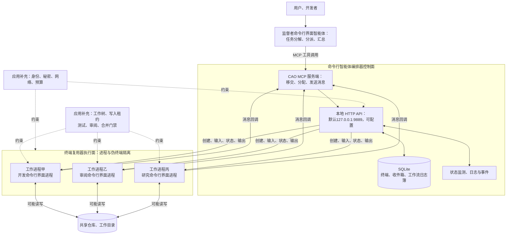
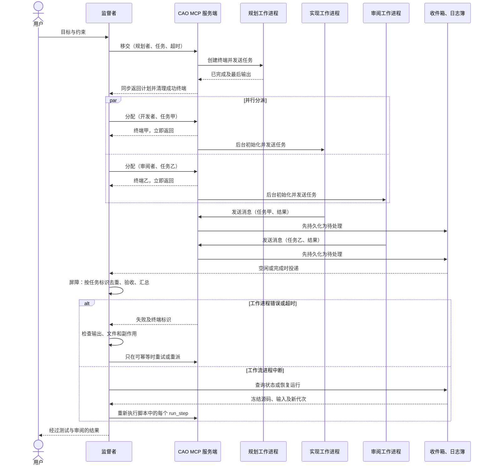

# AWS 命令行智能体编排器：以终端为执行边界的多进程编排

一个编码工作进程显示`COMPLETED`，只说明命令行界面停在某种终端状态。它不证明代码已通过测试、差异已获审阅、文件没有被另一工作进程覆盖，更不证明外部发布只执行了一次。

命令行界面智能体编排器（命令行智能体编排器）让已有人工智能编程命令行界面作为完整进程运行，由监督者通过`handoff`、`assign`和`send_message`协调。真正限制自治的不是“有监督者”这件事，而是可执行工作流、提供方工具权限、工作区隔离和操作员检查点是否形成闭环。

证据边界落在这份本地实现上：提交、文件和符号由证据卡核验。正文则沿着文件写入、凭证、取消、恢复和人工验收追踪命令行智能体编排器无法代替的控制。

## 学习问题

1. 命令行智能体编排器的监督者–工作进程拓扑把任务控制权、会话上下文与文件所有权分别放在哪里？
2. `handoff`、`assign`与`send_message`的同步、异步和回调语义有何不同，怎样组合成串行与并行协作？
3. 终端复用器隔离了哪些东西，又为什么没有自动隔离文件系统、Git 工作树、凭证和外部副作用？
4. 命令行智能体编排器怎样借助 MCP 暴露编排原语，并在本地 HTTP、MCP 客户端与服务端与真实命令行界面进程之间转换？
5. 终端状态、超时、取消、日志快照和工作流日志簿能恢复什么，不能恢复什么？
6. 面向生产使用时，怎样补齐安全边界、并发写控制、可观测性和业务幂等？

## 一页摘要

命令行智能体编排器先保留完整命令行界面，再在外部增加控制。每个工作进程有独立终端复用器与伪终端与上下文，但仍可能共享操作系统用户、仓库、凭证和网络。

**已证实事实**：监督者通过 MCP 与本地 HTTP 管理终端。`handoff`阻塞到工作进程完成、失败或超时；`assign`创建后立即返回；`send_message`先进入持久收件箱，再在接收端可接收时投递。

工作流脚本可冻结源码与输入、记录稳定运行与步骤标识、日志簿、生成隔离栅栏、取消和恢复。固定提交的恢复会重新执行每个`run_step`；已有日志簿记录不等于步骤结果重放。

工具限制由配置档案映射到提供方机制。部分提供方是硬限制，OpenAI 编码智能体（Codex）与编码智能体产品（Kimi）的固定版本为提示级软限制；命令行智能体编排器 MCP 工具也不能逐个阻断，`--yolo`会移除限制。

**基于证据的推断**：可执行脚本只能固定“调用哪些步骤”，不能证明副作用一次发生。操作员检查点应核对差异、测试、外部回执和权限，再决定继续、补偿或停止。

| 维度| 命令行智能体编排器已提供| 必须额外设计|
| --- | --- | --- |
| 控制| 监督者、三类原语、终端状态、工作流| 业务级任务契约、审批、优先级与公平调度|
| 执行| 多提供方命令行界面、独立终端复用器窗口、伪终端| 容器或虚拟机、资源配额、网络和凭证隔离|
| 协作| 同步移交、异步分配、收件箱消息| 去重回调、结果模式、屏障与部分失败策略|
| 文件| 可选择工作目录| 工作树与副本、写入租约、合并与冲突处理|
| 恢复| 日志、终端快照、工作流日志簿与恢复| 外部副作用去重、补偿、灾备与跨主机恢复|
| 安全| 配置档案工具限制、路径校验、启动确认、可选开放授权协议作用域门禁| 租户与终端所有权、细粒度 MCP 工具授权、伪终端强认证|

**个人分析**：命令行智能体编排器适合可信开发机上的多命令行界面工作台。进入共享或高风险环境前，还需 HTTP 身份、终端所有权、伪终端认证、工作树与容器、秘密代理、写租约和业务幂等账本。

## 事实边界

事实范围是本地 Python 语言服务、SQLite 数据库、终端复用器、MCP 与第三方命令行界面。仓库位于 `awslabs`，不意味着它是 AWS 托管服务，也不把完整命令行界面变成安全沙箱。

### 已证实事实

每个智能体是完整命令行界面进程。终端以八位十六进制值标识，状态包括 `UNKNOWN`、`IDLE`、`PROCESSING`、`COMPLETED`、`WAITING_USER_ANSWER` 和 `ERROR`。

`handoff`默认最长等待600 秒，区分终端错误与超时，并返回仍存活终端标识供检查。成功时提取最后输出并删除临时工作进程。

`assign` 先创建终端复用器和数据库记录，再后台初始化提供方；成功只代表已接受。`send_message` 先写入 SQLite 数据库中的收件箱，默认在接收端进入 `IDLE` 或 `COMPLETED` 后投递。

工作进程默认继承监督者当前工作目录，也可显式指定并经过路径校验。终端复用器隔离窗口、伪终端、环境和上下文，却不创建文件副本、工作树、容器、用户命名空间或网络沙箱。

配置档案的`allowedTools`覆盖角色，`--yolo`覆盖限制。固定版本的 Codex、Kimi 是软约束；MCP 编排工具不能逐个禁用。

工作流脚本先验证，再用预声明`run_id`启动。并发`run_step`必须有稳定`step_id`，用于状态、取消、生成隔离栅栏与未来重放接缝。

恢复从冻结脚本和输入重启，并提升生成拒绝旧运行器。固定路由没有调用已有的`lookup_replay`，所以所有`run_step`都会重跑。

固定`docs/workflows.md`声称已完成步骤会重放，只运行剩余步骤；这与同提交源码不一致。本文以源码“已预留, 尚未接入”为事实边界。

HTTP 默认绑定`127.0.0.1:9889`，开放授权协议未配置身份提供方时关闭。启用后验证 RSA SHA-256 签名算法（RSASSA-PKCS1-v1_5 using SHA-256，RS256）、签发方、受众和到期时间，并按`cao:read/write/admin`做路由门禁。

MCP 可用`CAO_AUTH_LOCAL_TOKEN`转发持有者令牌。伪终端网页套接字仍无令牌认证，只依靠环回或客户端网络地址允许列表。

删除单个终端可保存回滚缓冲区和元数据，恢复只创建普通命令行外壳并回放输出。它不恢复提供方、模型上下文；进程崩溃也不会自动生成快照。

命令行智能体编排器的 MCP 服务端最终调用本地 HTTP。MCP 的主机、客户端与服务端统一工具调用，不统一操作系统、命令行界面登录、文件或云凭证。

### 基于证据的推断

`CAO_TERMINAL_ID`是本地路由键，不是认证凭证。即使 HTTP 开放授权协议开启，调用方、租户与终端所有权与伪终端仍未形成端到端多租户边界。

终端复用器可降低上下文污染并让人工附接可见，不能阻止有命令行外壳权限的工作进程读取同一用户可访问的文件、环境变量或凭证。

`assign`后需要应用任务表记录已分派、已确认、运行中、回调、已验证和清理。终端状态不能替代交付验收。

收件箱的“待处理”和“已投递”是投递状态，不是恰好一次处理证明。回调需要稳定的 `task_id` 与幂等键。

工作流日志簿记录运行，仍不能证明文件或外部 API 效果是否生效。副作用必须进入有唯一约束的账本或可补偿操作。

### 个人分析与未知项

命令行智能体编排器不替团队定义 Git 分支、同文件互斥、秘密、网络出口、租户、服务等级目标、灾备、审批或费用。固定源码与注释还有演进痕迹，提供方权限必须以目标版本启动参数和运行测试判定。

<details className="evidence-card">
  <summary>证据：固定命令行智能体编排器、MCP 版本与产品边界</summary>

  - **来源截断：** `2026-07-20`
  - **命令行智能体编排器：** `awslabs/cli-agent-orchestrator@bae80071a17e001380367c461b32d64bc6b54433`
  - **MCP 上游：** `modelcontextprotocol/modelcontextprotocol@46fa5192d4969f51ecea9896f7211a67d147f803`
  - **提交：** `bae80071a17e001380367c461b32d64bc6b54433`、`46fa5192d4969f51ecea9896f7211a67d147f803`
  - **部署形态：** 本地 Python 语言、SQLite 数据库、终端复用器、MCP 与第三方编程命令行界面；不是 AWS 托管服务。
  - **边界：** 固定提交不支持外推后续状态机、提供方支持或权限强度。
</details>

## 架构图

下图先找两条没有被终端复用器隔开的路径：多个工作进程仍可写同一仓库，也可能共享用户凭证。它是固定版本的结构化重绘，不表示容器级安全隔离。



文字等价描述：

1. 用户只与监督者协作，监督者决定拆分、工作进程配置档案、同步或异步模式以及最终汇总。
2. 监督者调用会话内 MCP 服务端；MCP 服务端把操作转换为对本地命令行智能体编排器 HTTP API 的请求，API 管理 SQLite 状态、终端复用器终端和提供方生命周期。
3. 每个工作进程是独立命令行界面进程与伪终端，因此上下文和交互循环分开；工作进程仍可能以同一操作系统用户进入同一仓库。
4. 若多个工作进程都能写，应用必须另建工作树、目录副本或写入租约，并在合并前执行测试与审阅。图中的门禁和策略是生产化补充，不是命令行智能体编排器自动生成的组件。

下图展示三类原语怎样形成串行、并行与消息回调，以及失败时控制权停在哪里。



文字等价描述：

1. `handoff`适合串行关键路径：监督者必须先得到规划结果，才能继续分派。成功输出由调用返回，不要求工作进程再发回调。
2. `assign`适合扇出：调用先返回终端标识，工作进程后台初始化和执行。两个分配的接收顺序、完成顺序与回调顺序都不能当成业务顺序。
3. 工作进程使用`send_message`把结果放入收件箱；监督者结束当前回合、回到可接收状态后再获得消息。聚合器按`task_id`建屏障，而不是凭“收到两段自然语言”猜测完整性。
4. 错误、超时与工作流重启是不同故障。前两者要求检查活动终端和外部副作用；固定版本工作流恢复从冻结源码与输入重新驱动整个脚本，每个`run_step`都可能再次产生文件或外部副作用。生成隔离栅栏只阻止旧运行器继续驱动，不能提供副作用恰好一次。

## 控制权与任务流

**说明性场景｜监督者冻结一个工作流，先移交规划，再分配实现与审阅，最后由操作员决定是否合并。** 该场景只组合固定版本三类原语、日志簿、终端与收件箱机制，不代表真实项目或事故。

规划工作进程通过阻塞移交返回计划。监督者把任务拆成稳定`task_id`，为每项指定配置档案、写入作用域、截止时间和验收条件，再异步分配。

工作进程回调只进入 `result_received`。操作员检查点检查基础提交、已变更文件、测试、外部效果标识和权限；通过后才进入“已验证”或“已合并”，拒绝或不确定则保留现场并转人工。

工作流中断后，恢复会重跑所有 `run_step`。每步先查文件哈希值、Git 状态、日志簿与业务回执，再决定复用、补偿或重做；生成隔离栅栏只阻止旧运行器，不能阻止重复副作用。

### 监督者拥有什么

**已证实事实**：内置监督者配置档案的职责是调用编排 MCP 工具、读取上下文并选择工作进程。`handoff`与`assign`创建的工作进程会记录`caller_id`，`assign`默认还在任务文本中注入监督者终端标识和回调说明。

**个人分析**：监督者应拥有全局任务图、预算、截止时间、完成定义、工作进程名单与最终交付权；它不应亲自承担所有代码修改。工作进程应拥有一个边界清晰、可独立验收的子任务，并返回文件路径、提交、测试结果或结构化发现。没有明确交付物时，多个命令行界面只是在并行生成难以合并的文字。

### 三个原语的语义

| 原语| 返回时机| 结果通道| 适合| 主要风险|
| --- | --- | --- | --- | --- |
| `handoff` | 工作进程完成、失败或超时后| 工具结果中的最后输出| 必须阻塞的规划、审阅、生成| 占用调用周期；主机超时；失败后副作用不明|
| `assign` | 终端建立并开始后台初始化后| 工作进程后续`send_message` | 独立研究、并行实现与审阅| “已接受”被误判成“已完成”；遗留终端|
| `send_message` | 消息入队与尝试投递后| 接收端收件箱| 回调、补充指令、群体协作| 重复、延迟、接收后崩溃；顺序不可当业务事务|

**基于证据的推断**：`handoff`是调用栈式控制，`assign`是任务队列式控制，`send_message`是地址化消息控制。三者组合已足以表达常见拓扑，但命令行智能体编排器不会自动创建有向无环图屏障。监督者必须记录预期任务集合，例如`expected={research, implementation, review}`，只有每个唯一任务都达到验收状态才汇总。

### 串行与并行

串行流程可以连续`handoff`，也可以使用工作流脚本连续`run_step`。前一步输出应压缩成下一步明确输入，避免把完整终端回滚缓冲区当作隐式共享上下文。

并行流程应优先`assign`独立工作单元，或在工作流脚本中使用受限的执行器。固定版本官方指南要求并发`run_step`显式给出稳定`step_id`，并对输入排序，使恢复时项目到步骤的映射不随线程调度改变。

**个人分析**：代码库并行工作还需要选择一种文件策略：

- 只读扇出：所有工作进程可共享仓库，返回审阅结论，不写文件。
- 分区写入：每个工作进程只拥有不重叠目录，监督者在派发前写明写入作用域。
- 独立工作树：每个工作进程在单独的 Git 工作树与分支修改，随后由监督者合并。
- 单写者：研究和审阅工作进程只返回建议，唯一开发者工作进程落盘。

命令行智能体编排器只负责把工作进程放进指定工作目录；上述写入协议由使用者实现。

### 建议的应用级任务状态

终端状态是用户界面与进程状态，不足以表达业务验收。可在监督者侧增加一个小型状态机：

```text
planned -> dispatched -> acknowledged -> running
        -> result_received -> validated -> merged -> closed
                         \-> failed / timed_out / cancelled
```

每次状态转移至少记录`run_id`、`task_id`、`terminal_id`、`agent_profile`、`working_directory`、输入哈希值、允许写入范围、截止时间、尝试、结果哈希值和副作用引用。这样即使终端已被清理，也能解释“谁在什么版本上做了什么”。

### MCP 在架构中的位置

**已证实事实**：MCP 的标准边界是主机–客户端–服务端。命令行智能体编排器为会话内智能体暴露`cao-mcp-server`，提供编排工具；另有`cao-ops-mcp`供外部具备 MCP 能力的智能体管理会话。

两者最终都调用命令行智能体编排器默认位于`127.0.0.1:9889`、可由环境变量改址的 HTTP API，而工作进程本身仍由各提供方命令行界面启动。启用 HTTP 认证后，MCP 服务端可用`CAO_AUTH_LOCAL_TOKEN`为内部 HTTP 跳转添加持有者令牌凭证。

**基于证据的推断**：MCP 统一的是工具模式、调用和返回，不会自动统一操作系统用户、提供方登录、工作目录、Git 权限和云凭证。把工具暴露给智能体之前仍要做最小权限与信任判断；尤其固定版本无法逐个禁用命令行智能体编排器 MCP 工具，不能把 `allowedTools` 当成完整 MCP 授权层。

## 关键源码导读

源码阅读要验证三件事：原语何时返回、权限最终落到哪些启动参数、恢复会执行哪些步骤。最短路径是 MCP 服务端、智能体步骤、工具限制和工作流日志簿与脚本运行器。

阅读时同步维护四张表：原语与阻塞关系、终端与任务状态、配置档案与提供方参数、文件与外部副作用与幂等策略。只看说明文件（README）会漏掉失败路径。

<details className="evidence-card">
  <summary>证据：命令行智能体编排器控制、权限与恢复的完整阅读路径</summary>

1. 固定版本 [`README.md`](https://github.com/awslabs/cli-agent-orchestrator/blob/bae80071a17e001380367c461b32d64bc6b54433/README.md)：先理解命令行智能体编排器面向编码命令行界面、监督者–工作进程、终端复用器会话隔离和三类 MCP 原语。重点区分会话内 MCP 与运维 MCP。
2. [`CODEBASE.md`](https://github.com/awslabs/cli-agent-orchestrator/blob/bae80071a17e001380367c461b32d64bc6b54433/CODEBASE.md)：沿命令行界面、MCP、FastAPI 网络框架、服务、终端复用器、SQLite 数据库与提供方这条路径阅读。收件箱消息流程和移交流程给出比架构图更精确的调用链。
3. [`mcp_server/server.py`](https://github.com/awslabs/cli-agent-orchestrator/blob/bae80071a17e001380367c461b32d64bc6b54433/src/cli_agent_orchestrator/mcp_server/server.py)：阅读`_handoff_impl`、`_assign_impl`、`send_message`和子级工具解析。注意移交的单 HTTP 接缝、分配的延后初始化、回调注入和超时与错误区分。
4. [`services/agent_step.py`](https://github.com/awslabs/cli-agent-orchestrator/blob/bae80071a17e001380367c461b32d64bc6b54433/src/cli_agent_orchestrator/services/agent_step.py)：观察创建 → 就绪 → 输入 → 等待 → 提取 → 清理的规范形式步骤。重点看稳定空闲状态判断、`ERROR`/超时、`cancel_event`和失败时保留终端标识。
5. [`models/terminal.py`](https://github.com/awslabs/cli-agent-orchestrator/blob/bae80071a17e001380367c461b32d64bc6b54433/src/cli_agent_orchestrator/models/terminal.py) 与 [`docs/inbox-delivery.md`](https://github.com/awslabs/cli-agent-orchestrator/blob/bae80071a17e001380367c461b32d64bc6b54433/docs/inbox-delivery.md)：对照终端状态与收件箱的“待处理”和“已投递”状态，理解为什么接收端忙碌时消息等待，以及协调清扫仍不是恰好一次处理。
6. [`docs/working-directory.md`](https://github.com/awslabs/cli-agent-orchestrator/blob/bae80071a17e001380367c461b32d64bc6b54433/docs/working-directory.md)：阅读默认继承当前工作目录、显式目录和路径校验。然后回到架构图，明确它没有创建工作区副本。
7. [`docs/tool-restrictions.md`](https://github.com/awslabs/cli-agent-orchestrator/blob/bae80071a17e001380367c461b32d64bc6b54433/docs/tool-restrictions.md)：比较角色、允许工具、`--auto-approve`和`--yolo`，再看各提供方的硬性与软性强制执行与 MCP 工具限制。
8. [`docs/terminal-lifecycle.md`](https://github.com/awslabs/cli-agent-orchestrator/blob/bae80071a17e001380367c461b32d64bc6b54433/docs/terminal-lifecycle.md)：核对移交与分配的清理差异、快照保留和恢复限制。恢复是取证工具，不是智能体续接。
9. [`docs/workflows.md`](https://github.com/awslabs/cli-agent-orchestrator/blob/bae80071a17e001380367c461b32d64bc6b54433/docs/workflows.md)、[`services/workflow_journal.py`](https://github.com/awslabs/cli-agent-orchestrator/blob/bae80071a17e001380367c461b32d64bc6b54433/src/cli_agent_orchestrator/services/workflow_journal.py) 与 [`services/script_runner.py`](https://github.com/awslabs/cli-agent-orchestrator/blob/bae80071a17e001380367c461b32d64bc6b54433/src/cli_agent_orchestrator/services/script_runner.py)：理解验证、运行、状态、取消与恢复，以及冻结源码、输入和生成隔离栅栏。特别核对版本内文档漂移：文档描述已完成步骤重放，源码明确`lookup_replay`尚未接入，当前恢复会重新执行所有`run_step`。
10. [`docs/configuration.md`](https://github.com/awslabs/cli-agent-orchestrator/blob/bae80071a17e001380367c461b32d64bc6b54433/docs/configuration.md)、[`docs/mcp-apps.md`](https://github.com/awslabs/cli-agent-orchestrator/blob/bae80071a17e001380367c461b32d64bc6b54433/docs/mcp-apps.md) 与 [`security/auth.py`](https://github.com/awslabs/cli-agent-orchestrator/blob/bae80071a17e001380367c461b32d64bc6b54433/src/cli_agent_orchestrator/security/auth.py)：区分默认关闭的 HTTP 开放授权协议作用域强制执行、MCP → API 服务令牌与仍未认证的伪终端网页套接字。
  11. MCP 上游固定版本 [`modelcontextprotocol/modelcontextprotocol`](https://github.com/modelcontextprotocol/modelcontextprotocol/tree/46fa5192d4969f51ecea9896f7211a67d147f803) 与 [2025-06-18 架构规范](https://modelcontextprotocol.io/specification/2025-06-18/architecture)：最后把命令行智能体编排器的实现映射回主机与客户端与服务端、连接和能力协商，避免把一个 MCP 服务端的应用语义误当协议全局语义。

  - **权限符号：** `role`、`allowedTools`、`@cao-mcp-server`、`--yolo`；令牌校验字段为`iss`、`aud`、`exp`。
  - **工作流符号：** `cao_workflow`、`workflow_journal.py`、`script_runner.py`、`lookup_replay`。
  - **恢复命令：** `cao terminal restore`只回放快照到普通命令行外壳。
  - **边界：** 这些接缝证明固定版本行为，不证明配置档案等价于沙箱或日志簿等价于业务事务。
</details>

## 架构决策与权衡

选择命令行智能体编排器时不是只决定“用几个工作进程”，而是决定要保留完整命令行界面的哪些能力，并承担哪些进程、权限和恢复成本。

### 为什么保留完整命令行界面进程

| 选择| 收益| 代价|
| --- | --- | --- |
| 完整命令行界面与终端复用器| 保留提供方登录、伪终端、原生工具与人工附接；跨提供方混用| 状态识别依赖终端界面与提供方适配器；资源较重；恢复困难|
| 直接模型与智能体 API | 结构化事件和超时更易控制；更适合服务化| 需要重建工具、登录、上下文与提供方特性|
| 单进程内子智能体| 低启动开销，共享运行时状态| 隔离和人工观察较弱；框架绑定更强|

**个人分析**：当团队已经依赖多个成熟编码命令行界面时，命令行智能体编排器的进程级适配比重写智能体运行时更经济。若目标是高吞吐、多租户、无头服务或强一致业务流程，直接调用 API 或运行时通常更容易建立身份、配额和结构化恢复。

### 移交还是分配

选择`handoff`的信号：后续步骤依赖返回值、结果规模可控、预计耗时不超过调用链超时、失败时需要马上处理。选择`assign`的信号：任务彼此独立、需要扇出、监督者可以结束回合等待回调、应用已有任务注册表和清理机制。

不要用`handoff`模拟长时间批处理。官方工作流文档提醒 MCP 主机可能比命令行智能体编排器自身更早终止一个长阻塞工具调用；长流程应后台运行并用稳定运行标识查询。也不要把`assign`当无责任的发后即忘：它留下终端、回调与资源清理责任。

### 共享目录还是独立工作树

| 场景| 推荐目录策略| 理由|
| --- | --- | --- |
| 多工作进程只读分析| 共享只读仓库| 最少复制，冲突面小|
| 不同软件包的独立修改| 明确不重叠写入作用域| 简单，但仍有共享 Git 索引与构建缓存的风险|
| 同一代码库并行实现| 每工作进程独立工作树与分支| 隔离未提交修改，便于审阅合并|
| 高风险或不可信代码| 容器或虚拟机加临时凭证| 工作树不隔离进程、网络与秘密|

**个人分析**：工作目录参数只是寻址，不是隔离。即使不同工作进程使用不同子目录，`git`、构建系统或脚本仍可能向仓库根、全局缓存和用户目录写入。需要安全或强重现性时，应把执行根节点、凭证作用域和网络策略一起隔离。

这里分散在进程、工作目录、工具协议、凭证和恢复入口的责任，可归入[智能体运行框架（Agent Harness）](/concepts/agt-c-02)：它们共同形成运行与治理外壳。该对照不表示固定项目已经提供完整沙箱或恢复保证。

### 终端状态还是持久化工作流

临时一次性协作可直接用三类原语与终端状态；需要冻结源码与输入、可查询运行标识、生成隔离栅栏或取消与重启入口时，可使用工作流日志簿。但固定版本的脚本恢复会再次执行每个`run_step`，不能把它当作已完成步骤缓存。两者都不替代业务事务：日志簿记录运行状态，业务数据库记录外部事实与去重结果。

### 工具限制还是执行沙箱

配置档案工具限制适合减少误操作和表达角色意图。提供方原生拒绝机制比系统提示更强，但仍需验证覆盖范围；MCP 工具细粒度限制是固定版本已知缺口。处理不可信输入、真实凭证或生产写操作时，应把智能体放进独立操作系统与容器边界，并把实际权限落实到文件访问控制列表、短期凭证和网络策略，而不是只依靠提示词。

[长时编码智能体参考设计](/cases/long-running-coding-agent)把工作树隔离、检查点、测试反馈和批准门组合成一条作者设计的恢复链；它用于综合这些约束，不声称命令行智能体编排器已经实现该拓扑。

## 生产化分析

生产控制点必须能阻止工作进程继续行动或阻止结果进入仓库。仅能观察终端和生成报告，不足以形成操作员检查点。

### 安全边界

**已证实事实**：命令行智能体编排器服务端默认绑定 `127.0.0.1:9889`，主机和端口可由 `CAO_API_HOST` 与 `CAO_API_PORT` 修改。未配置身份提供方时，开放授权协议认证默认关闭，HTTP 请求获得完整作用域集合，因而安全姿态是“可信环回”，不是匿名公网服务。工作目录验证拒绝系统敏感路径，但允许用户主目录、外部卷和其他有效目录；`--yolo` 允许任意工具并跳过确认。

**已证实事实**：配置`AUTH0_DOMAIN`或`CAO_AUTH_JWKS_URI`后，内建 HTTP 认证会验证 RS256、签发方、受众与到期时间，并把令牌作用域映射为`cao:read`、`cao:write`、`cao:admin`。固定源码保证所有变更型路由需要`cao:write` / `cao:admin`，并让`/events`、`/events/history`等特定读端点至少需要`cao:read`；这不表示每一个 HTTP 读取都受读取作用域保护。

MCP 服务端可通过 `CAO_AUTH_LOCAL_TOKEN` 为内部 HTTP 调用转发持有者令牌。这个保护不覆盖伪终端网页套接字：该端点仍未认证，只接受默认环回或显式 `CAO_WS_ALLOWED_CLIENTS` 中的来源。

**个人分析**：共享机器或服务化部署至少补齐：

- 默认保持环回；如需改址或反向代理，先启用身份提供方、正确设置签发方与受众和最小作用域的`CAO_AUTH_LOCAL_TOKEN`，并测试所有 HTTP 路由门禁；
- 为每个会话与终端增加所有者与租户授权；不要把`cao:read/write/admin`三档作用域误当资源级所有权；
- 不把未认证伪终端网页套接字暴露给非可信网络；客户端网络地址允许列表不是用户身份认证，远程访问应另加受认证代理或隧道；
- 为 MCP 编排原语增加更细粒度授权，区分只发消息、创建工作进程、删除终端与运行工作流；
- 监督者和工作进程分开的短期凭证，按仓库、云账号、环境和操作作用域发放；
- 默认拒绝网络与生产写入，高风险工具经独立策略网关和人工审批；
- 提示词、终端回滚缓冲区、收件箱、日志簿、环境变量与日志的秘密脱敏、加密和保留策略；
- 提供方原生限制的启动参数审计，拒绝在敏感任务中使用仅软约束的配置档案。

### 并发写冲突

终端复用器隔离不防止两个工作进程同时写同一路径。典型冲突包括：同文件覆盖、一个工作进程格式化另一个工作进程的未提交代码、并发修改锁文件、共享构建目录、Git 索引锁、数据库迁移号冲突以及重复发布。

推荐把`task_id -> worktree -> branch -> write_scope`作为显式登记；每个工作进程只在自己的工作树修改，由监督者顺序执行变基、合并、测试和审阅。若必须共享目录，则使用单写者或文件租约，写前检查版本哈希值，写后记录变更清单。自然语言“不要碰别人的文件”只能作为提示，不能替代冲突检测。

### 取消与超时

**已证实事实**：移交有明确超时；智能体步骤区分超时与终端错误。工作流运行支持协作式取消，当前步骤等待可由取消事件打断并清理它创建的终端。长 MCP 工具调用还受主机自己的超时影响，主机放弃等待时服务端运行可能继续。

**基于证据的推断**：应有三层截止时间：用户请求总截止时间、每任务截止时间、提供方与工具截止时间。取消先停止继续派发，再请求终止活动终端，最后等待有限清理时间；若外部操作已经提交，则转入补偿而不是声称“已取消”。所有超时响应都返回`run_id` / `task_id` / `terminal_id`，让运维能查询真实状态。

### 崩溃恢复

恢复能力要按层拆开：

| 故障| 固定版本可用证据| 不能假设|
| --- | --- | --- |
| 移交工作进程错误与超时| 返回与保留终端标识，可读输出后清理| 自动安全重试、文件回滚|
| 已删除终端| 回滚缓冲区与快照元数据，可恢复普通命令行外壳| 恢复原命令行界面、模型上下文或任务|
| 命令行智能体编排器与会话进程崩溃| 可能仍有 SQLite 数据库、日志和终端复用器状态；工作流可查日志簿| 崩溃自动生成终端快照|
| 工作流运行器中断| 冻结源码与输入、日志簿状态、生成隔离栅栏；恢复重新启动脚本| 已完成步骤重放；每个`run_step`都会重新执行，副作用可能重复|
| 主机丢失| 取决于备份| 自动跨主机迁移与灾备|

**个人分析**：重试或恢复前先做协调：检查目标文件哈希值、Git 状态、外部 API 的幂等性密钥、收件箱回调和日志簿步骤。由于固定版本恢复会重跑所有 `run_step`，每一步都应先查询业务去重账本，再决定复用已有结果、执行补偿还是安全重做。无法判定时进入人工审核，不要让另一个工作进程盲目覆盖现场。

### 可观测性

命令行智能体编排器已有终端状态、回滚缓冲区、日志、收件箱、事件与工作流状态，但生产排障需要统一关联。建议每个日志、指标与追踪记录带 `run_id`、`task_id`、`terminal_id`、`caller_id`、提供方、配置档案、尝试、工作目录哈希值与提交摘要。

核心指标包括：终端启动时延、就绪等待、步骤执行时长、超时与错误率、收件箱待处理年龄、重复回调、活终端数、孤儿终端、恢复次数、令牌与费用、写冲突与人工接管次数。对终端内容做采样时必须先脱敏；回滚缓冲区是高价值调试材料，也是高敏感数据源。

### 幂等与交付验收

MCP 工具成功、终端`COMPLETED`或收件箱`DELIVERED`都不能证明业务副作用恰好一次。建议：

- 监督者为每个派发生成稳定`task_id`，重试与工作流恢复沿用同一业务幂等键并增加尝试；不能依赖日志簿自动跳过已完成步骤；
- 工作进程结果包含输入哈希值、基础提交、输出哈希值、已变更文件、测试与外部效果标识；
- 文件写入通过独立工作树与分支合并，外部 API 使用提供方支持的幂等性密钥；
- 每个可能产生副作用的`run_step`先查业务账本与回执；把“已提交效果”与“智能体返回文本”分开记录，使整个脚本重跑时能复用或补偿；
- 回调表对`(run_id, task_id, result_version)`建唯一约束；
- 监督者验证模式、测试、差异和来源后，才把任务标记为“已验证”或“已合并”；
- 无法回滚的操作放在最后一个审批门之后，并记录补偿负责人。

### 容量与成本

每个工作进程都是完整命令行界面与终端复用器进程，并可能加载自己的上下文和工具。扇出上限应同时考虑处理器、内存、伪终端与提供方稳定性、API 速率上限、模型并发和费用。队列需要有界并发和背压；“多开智能体”不保证线性加速，重型步骤可能争用机器和下游配额。

## 可迁移经验

迁移时要保留执行约束，而不是只复制监督者–工作进程名称。

### 可直接复用的机制

1. **分开建模三种原语。** `handoff`、`assign`、`send_message`分别对应调用栈、任务派发和消息协作。
2. **让状态机表达交付。** `PROCESSING` / `COMPLETED`是调度信号，`validated` / `merged`才是交付信号。
3. **给异步回调稳定身份和屏障。** 终端标识用于路由，任务标识用于去重、重试、汇总和审计。
4. **让监督者做最小权限协调。** 它负责计划和合并，高风险动作由窄工作进程、策略网关与操作员检查点执行。

### 只能有限类比的部分

1. **完整命令行界面是有效适配器。** 它保留登录、工具与交互，也带来进程编排、状态识别和资源成本。
2. **终端复用器提供进程与伪终端边界。** 提示词与上下文、文件系统、Git 版本控制、凭证、网络与副作用仍需分别隔离。
3. **日志簿提供恢复入口。** 冻结源码、输入和生成能稳定驱动者，不能提供已完成步骤重放。
4. **回滚缓冲区提供取证。** 它不能恢复模型内存；恢复仍要区分重做、接续、人工接管和补偿。

### 不应照搬的部分

1. **不要把工具白名单当沙箱。** 核对每个提供方的强制方式，把文件、秘密和网络权限下沉到执行环境。
2. **不要把工作目录当隔离。** 并行写使用独立工作树与分支、单写者或可验证写租约。
3. **不要从终端已完成推导业务完成。** 检查差异、测试、效果回执和审批后再合并。
4. **不要把恢复当安全重试。** 固定版本重跑全部`run_step`；每步先查账本，再决定复用、补偿或重做。

**说明性演练**：先只读`assign`两个审阅者，验证回调、屏障与清理；再引入独立工作树的开发者。最后制造超时、重复回调和命令行智能体编排器重启，检查任务注册表、日志簿与外部副作用能否一致解释现场。演练不应连接生产凭证或真实发布。

## 来源

以下来源均为官方或上游材料。代码托管平台链接固定到本文核对的提交，便于日后复现；网页规范可能继续演进。

[CAO 项目入口](https://github.com/awslabs/cli-agent-orchestrator)仅用于查看当前仓库导航与后续版本；本文的实现事实仍以以下固定提交链接为准。

推荐阅读顺序：

### 主要架构

1. [CAO 固定版本仓库](https://github.com/awslabs/cli-agent-orchestrator/tree/bae80071a17e001380367c461b32d64bc6b54433) 与 [README](https://github.com/awslabs/cli-agent-orchestrator/blob/bae80071a17e001380367c461b32d64bc6b54433/README.md)：建立产品边界、监督者–工作进程模式、三类原语与提供方范围。
2. [CODEBASE.md](https://github.com/awslabs/cli-agent-orchestrator/blob/bae80071a17e001380367c461b32d64bc6b54433/CODEBASE.md)：理解 MCP、命令行界面、FastAPI、服务、终端复用器、SQLite 数据库与提供方的分层及数据流。

### 源码

3. [MCP server 实现](https://github.com/awslabs/cli-agent-orchestrator/blob/bae80071a17e001380367c461b32d64bc6b54433/src/cli_agent_orchestrator/mcp_server/server.py) 与 [agent step 实现](https://github.com/awslabs/cli-agent-orchestrator/blob/bae80071a17e001380367c461b32d64bc6b54433/src/cli_agent_orchestrator/services/agent_step.py)：核对移交、分配与发送消息操作，以及终端状态、超时、错误、取消与清理的真实语义。
5. [Terminal Lifecycle](https://github.com/awslabs/cli-agent-orchestrator/blob/bae80071a17e001380367c461b32d64bc6b54433/docs/terminal-lifecycle.md)、[Workflows 文档](https://github.com/awslabs/cli-agent-orchestrator/blob/bae80071a17e001380367c461b32d64bc6b54433/docs/workflows.md)、[Workflow Journal 源码](https://github.com/awslabs/cli-agent-orchestrator/blob/bae80071a17e001380367c461b32d64bc6b54433/src/cli_agent_orchestrator/services/workflow_journal.py) 与 [Script Runner 源码](https://github.com/awslabs/cli-agent-orchestrator/blob/bae80071a17e001380367c461b32d64bc6b54433/src/cli_agent_orchestrator/services/script_runner.py)：区分快照取证、日志簿、生成隔离栅栏与真正的步骤重放；固定提交事实以源码中“已预留, 尚未接入”为准。
6. [Configuration](https://github.com/awslabs/cli-agent-orchestrator/blob/bae80071a17e001380367c461b32d64bc6b54433/docs/configuration.md)、[MCP Apps 安全说明](https://github.com/awslabs/cli-agent-orchestrator/blob/bae80071a17e001380367c461b32d64bc6b54433/docs/mcp-apps.md) 与 [OAuth 实现](https://github.com/awslabs/cli-agent-orchestrator/blob/bae80071a17e001380367c461b32d64bc6b54433/src/cli_agent_orchestrator/security/auth.py)：核对默认环回、默认关闭的认证、作用域、令牌验证、内部持有者令牌转发与伪终端网页套接字缺口。

### 补充说明

4. [Working Directory](https://github.com/awslabs/cli-agent-orchestrator/blob/bae80071a17e001380367c461b32d64bc6b54433/docs/working-directory.md)、[Tool Restrictions](https://github.com/awslabs/cli-agent-orchestrator/blob/bae80071a17e001380367c461b32d64bc6b54433/docs/tool-restrictions.md) 与 [Inbox Delivery](https://github.com/awslabs/cli-agent-orchestrator/blob/bae80071a17e001380367c461b32d64bc6b54433/docs/inbox-delivery.md)：分别核对路径、权限与消息可靠性边界。
7. [MCP 上游固定版本仓库](https://github.com/modelcontextprotocol/modelcontextprotocol/tree/46fa5192d4969f51ecea9896f7211a67d147f803)与 [MCP 2025-06-18 架构规范](https://modelcontextprotocol.io/specification/2025-06-18/architecture)：把命令行智能体编排器 MCP 服务端放回主机–客户端–服务端和能力协商的协议上下文。

证据标注规则：文中“已证实事实”来自以上固定源码或官方文档；“基于证据的推断”是对实现边界的工程推导；“个人分析”是面向生产落地的建议，不代表 AWS 实验室、命令行智能体编排器或 MCP 官方承诺。

命令行智能体编排器能把多个命令行界面变成可编排步骤，但真正的自治上限来自可执行权限、可复查状态和操作员的继续决定。三者缺一时，多开终端只会扩大未受控的写入面。
