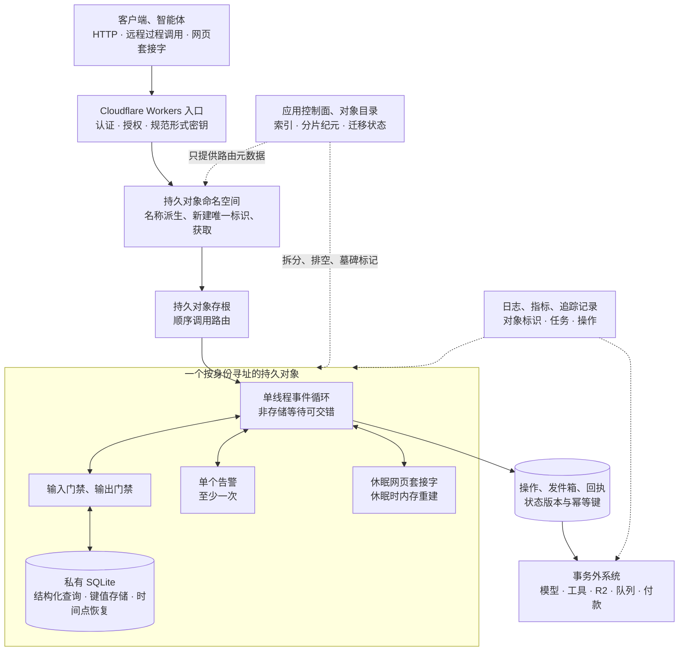

# 把边缘协调收敛到身份寻址的状态单元

本文讨论 Cloudflare 的托管能力与 workerd 的开源运行时边界。

把同一业务密钥的请求送到一个持久对象，可以把许多并发冲突收敛为一个对象内的串行判定。代价是这个密钥也定义了热点：一个房间、租户或任务若承载过多连接、外呼和状态，平台不会自动把同一标识拆成多个协调者。

Cloudflare 持久对象把全局可寻址身份、事件循环、私有持久存储、告警和长连接入口组合成一个状态单元。不同对象可并行扩展；同一对象只适合承载必须共同判定的最小状态。单线程不消除异步竞态，存储事务也不覆盖模型、工具或付款。

本文依据截至 2026-07-22 的官方文档和固定的 `workerd` 快照。开源 `workerd` 运行时能解释输入与输出门禁及本地持久对象存储，却不等于 Cloudflare 全球生产放置实现；托管环境的首次放置、故障迁移、复制和存储控制平面不能从本地源码反推。

## 学习问题

1. 标识、命名空间与存根如何把同一业务密钥路由到同一协调单元？
2. 每对象单线程保证什么，非存储`await`为什么仍会产生交错？
3. 输入与输出门禁与节点本地数据库事务的原子性在哪里停止？
4. 告警、休眠和对象重启要求怎样的幂等恢复？
5. 会话、任务、租户与实体密钥如何改变热点和重分片成本？
6. `workerd` 本地行为、位置提示与 Cloudflare 全球生产放置之间边界何在？

## 一页摘要

**已证实事实**：一个持久对象类对应一个命名空间，每个对象有自己的标识、活动实例和私有持久存储。`idFromName(name)`从稳定名称得到标识，`newUniqueId()`生成随机标识，`get(id)`返回存根；按名称获取`getByName(name)`是更短的等价入口。真正调用时才路由并惰性创建。存根是远程客户端，不是对象本身，失败后应重新获取。

单个对象固有单线程，但事件可在异步边界交错。异步存储默认受输入门禁保护，同步数据库操作不让出事件循环；`fetch()`等非存储输入输出会允许其他请求运行。因此“读状态 → 外呼 → 写状态”仍会竞态，长时间模型推理也不应放进`blockConcurrencyWhile()`。

SQLite 支撑的对象提供结构化查询语言、同步与异步键值存储、事务与时间点恢复。输入门禁控制存储等待期间的输入交错，输出门禁延迟写入后的外发消息，直到持久化写入确认。

若写入失败，排队的外发消息会被丢弃、对象重置、调用方收到错误。这能阻止“未持久化却已宣告成功”，但不会撤销写入前已发出的超文本传输协议请求，也不会把大语言模型、Cloudflare 对象存储服务（R2）、队列、付款或邮件纳入对象事务。

**基于证据的推断**：智能体平台可把会话、任务或实体密钥映射为一个协调对象。对象持有运行状态、审批版本、网页套接字与告警。告警至少执行一次，休眠会丢失普通内存。模型和工具又位于事务外，因此端到端恢复还需要操作标识、状态版本、发件箱与回执、重试预算和补偿。

| 关键决策| 推荐默认| 原因| 退出信号|
| --- | --- | --- | --- |
| 身份| 服务端派生规范形式密钥，`idFromName()` / `getByName()` | 无需另存随机标识映射，所有调用汇聚同对象| 密钥含敏感信息、可被租户碰撞或生命周期不稳定|
| 存储| 新命名空间使用 SQLite 数据库；同步结构化查询语言与键值存储放在短事务中| 当前官方推荐，支持结构化查询语言、同步键值存储与时间点恢复| 单对象接近容量与吞吐边界，或需要跨对象查询事务|
| 粒度| 选择最小“必须共同串行判定”的会话与任务与实体| 多对象横向并行，缩小热点与授权半径| 一个对象长期排队、过载、状态或连接持续增长|
| 外部副作用| 先登记操作与发件箱，再外呼，再对账落回执| 非存储等待会交错，持久对象事务不覆盖外部系统| 下游无幂等键且副作用不可补偿，需人工门禁|
| 长连接| 服务端休眠网页套接字、持久化与附件恢复| 空闲可休眠，连接仍保持| 需要传出网页套接字、强零断线承诺或超大连接态|

## 事实边界

本案例的证据截止日为**2026-07-22**。官方产品文档用于说明托管持久对象合同，固定`workerd`快照只用于解释公开运行时接缝。两者不能合并成“本地运行结果等于全球生产行为”的证据。

  
证据：运行时快照、存储版本与重试参数

- **固定快照：** `git ls-remote https://github.com/cloudflare/workerd.git HEAD`返回 [`14894eccbb339da199d772fcadd337b6d0902128`](https://github.com/cloudflare/workerd/tree/14894eccbb339da199d772fcadd337b6d0902128)。
- **提交信息：** `Release 2026-07-22`，时间为2026-07-22 00:59:49 协调世界时。说明文件（README）说明日期版本对应最大兼容日期。
- **新建命名空间：** 当前新`exports`命名空间只能选择 SQLite 后端。2026-07-09 变更日志的旧版 `migrations` 例外，仅允许已有键值存储支撑命名空间的账户继续用`new_classes`新建键值存储命名空间；已有键值存储命名空间继续受支持。
- **SQLite 合同：** 支持结构化查询语言、同步与异步键值存储与时间点恢复。`transactionSync()`仅 SQLite 可用且回调必须同步；SQLite 下`transaction()`的`txn`参数已废弃，直接使用`ctx.storage`。连续且无中间`await`的写会自动合并并原子提交。
- **告警：** 每对象同时只有一个已安排告警；处理器至少执行一次。未捕获异常从2 秒开始指数退避（Exponential Backoff），最多6 次重试。
- **边界：** 这些固定参数支持本文的版本与恢复分析，不承诺后续平台行为，也不证明有限重试后外部动作必然完成。

**已证实事实**：开源服务端运行时可用于自行托管和本地开发；该`workerd`运行时与 Cloudflare Workers 平台同源，但说明文件警告它不是安全加固沙箱。固定`workerd.capnp`说明本地持久对象当前位于单个运行时实例；跨集群分布仍未实现。

**边界。已证实事实**：源码能支持输入输出门禁、参与者缓存、SQLite、本地标识命名空间和事件循环方面的陈述。它不能证明托管服务怎样执行全球首次放置、故障迁移、复制、法域约束或负载调度。本文也不从本地磁盘布局反推生产存储实现。

**已证实事实**：官方数据位置当前称对象创建后不会改变位置；默认靠近首次`get()`的请求，`locationHint`只在该对象第一次`get()`时考虑，而且是尽力而为、不是保证。管辖域则是运行和持久化区域的约束，但 Cloudflare Workers 仍可从世界其他位置访问对象，且标识会因计费与调试在管辖域外记录。

位置、主机与内存生命周期不可混为一谈：对象仍会因更新、空闲或运行时决策被重启或换主机。

**已证实事实**：官方已知问题对“全局唯一”还给出重要限定：唯一性在新事件开始和访问存储时执行；一个长事件若从不再访问存储，遇到网络分区或软件更新时可能已经不是当前实例。若之后访问存储会得到异常。故障安全（Fail Safe）设计必须依赖持久检查点、幂等重试和新存根，而不是把某个内存实例永久当作所有者。

**个人分析**：持久对象标识应被视为路由身份，不是认证令牌、租户访问控制列表或永不变化的业务主键。外部应用程序编程接口（Application Programming Interface，API）仍要认证主体，服务端派生命名空间与密钥，并在对象内再次校验租户、资源与动作；日志可以记录标识或不可逆租户哈希值，但不要把用户可控名称直接当授权事实。

## 架构图

先检查图中的串行边界是否画得足够小：只有同一业务密钥的状态进入一个对象，模型、工具、队列和跨对象索引仍留在事务外。目录控制面可以帮助找对象，却不应成为每次数据请求都必须经过的全局热点。

文字等价描述：客户端不能直接把任意租户与资源字符串当作对象权限。Cloudflare Workers 入口先认证主体并生成规范形式密钥，再通过命名空间得到标识和存根；存根把调用路由到唯一协调单元。对象内的存储操作受输入与输出门禁约束，但外部模型和工具位于事务外。

应用控制面只保存索引、分片纪元与迁移状态，不进入每个数据请求的同步路径。热点拆分需要它显式迁移密钥，平台不会自动把一个对象切开。

### 视觉检查点：串行边界与外部恢复

先沿左到右检查最小串行边界。只有稳定业务密钥对应的对象状态进入持久对象；模型、工具和队列仍在事务外。

这张图回答“什么必须共同判定”。下一张图回答“外部调用返回时，旧结果还能不能写回”。

恢复正确性来自持久操作、版本复核和回执，不来自某个内存实例持续存活。

### 视觉检查点：热点拆分

单对象排队或连接持续增长时，平台不会自动把同一标识分裂。应用必须冻结迁移版本、创建更小的业务键并排空旧对象。

因此对象粒度既是并发控制选择，也是未来迁移成本的选择。

## 控制权与任务流

**说明性场景**：一个智能体任务在等待模型结果时收到取消请求，随后旧模型结果迟到。这个场景用已证实的事件交错和存储门禁机制说明恢复设计，不代表 Cloudflare 官方事故或生产测量。

1. **认证与密钥派生。** 入口验证用户与智能体令牌，读取可信租户、工作空间、会话、任务或实体标识，做规范化与长度限制，再组合版本化密钥，例如`v2:tenant-17:task-42`。不要直接采用查询字符串作为`idFromName()`输入，更不要把“知道名称与标识”当作已授权。

2. **选择标识策略。** 稳定且可重算的业务实体使用`idFromName()`或`getByName()`；不可预测的新会话可用`newUniqueId()`。“原子保存”只表示目录对象能在它自己的私有存储事务中保存标识字符串和目录记录，不会让目录对象与目标对象的首次初始化形成跨对象原子事务。目标对象的初始化必须以稳定回执或初始化密钥做幂等检查；调用超时或重试后，系统通过目录记录、目标对象回执和协调收敛。若把标识字符串返回给已认证客户端，也不能把它当授权凭证。标识只在原命名空间有效，`idFromString()`会拒绝其他命名空间生成的标识。

3. **取得并调用存根。** `get()` 立即返回客户端；真正发起远程过程调用或 HTTP 调用时才建立连接并惰性创建对象。按调用方和业务协议携带 `request_id` 与 `operation_id`，不要仅靠存根的单连接顺序代替跨调用方全局顺序。存根抛错后重建存根，再依据回执判断是否重试。

4. **对象内判定。** 同步 SQLite 数据库读写在当前事件循环内执行；异步键值存储默认通过输入门禁防止等待期间其他事件交错。连续且不含 `await` 的写入可自动合并；需要明确同步原子区时使用 `transactionSync()`，需要兼容异步存储 API 时使用 `transaction()`。

5. **外部调用。** 在调用大语言模型与工具前把`operation_id`、输入哈希值、状态版本、截止时间、尝试与`PENDING`写入对象存储；提交后再发外部请求。`await fetch()`会允许其他事件交错，返回时必须重新读取与检查版本和所有权，再把回执原子写回。若另一个请求已经取消或接管任务，迟到结果只作为候选记录，不覆盖当前状态。

6. **响应与输出门禁。** 存储写入后的响应或后续拉取默认等待写盘确认；失败会阻止外界看到“已提交”消息。但在写入前已经发出的副作用不会被撤销，设置`allowUnconfirmed`也会主动放弃默认可见性保护。高风险流程不使用它。

7. **告警与网页套接字。** 告警载荷与进度写入存储，处理器先按稳定操作密钥去重，再执行可重入步骤；`retryCount`只说明平台重试尝试，不证明外部动作未发生。网页套接字使用`acceptWebSocket()`进入休眠 API；必要的会话态写存储，小型连接态可用附件，唤醒构造器只重建缓存。

8. **故障恢复。** 对象没有关闭钩子，持续写检查点。遇到对象重置、过载、存根错误、告警重试或客户端重连时，先查询持久状态与外部回执；不能判断时转人工。客户端使用退避、截止时间和幂等键，禁止无界重试制造热点。

**基于证据的推断**：智能体任务持久对象先经历已创建、运行中与 waiting_external。外部结果返回后进入 result_received、已验证或已完成。异常分支包括 cancel_requested、失败与 manual_review。

每次转移都带单调`state_version`。外部工作进程（worker）回调必须匹配任务标识、操作标识、尝试和基础版本。

**个人分析**：不要在`blockConcurrencyWhile()`里等待模型或人类审批。它会把对象所有其他事件挡住，并受30 秒重置边界影响。更稳妥的是先提交`waiting_external`，释放事件循环，让取消、查询和其他合法更新继续处理；外部结果回来后做乐观版本检查。

## 关键源码导读

最短源码路径是输入与输出门禁、参与者缓存、SQLite 参与者存储与本地命名空间配置。它们证明存储等待、写入可见性、事务和本地标识的运行时关系；它们不公开 Cloudflare 托管控制面如何选择全球主机、复制或迁移数据。

本节固定在2026-07-22 运行时快照。这个发布范围约束本地运行时接缝，不扩展为托管平台实现承诺。

  
证据：输入与输出门禁、参与者存储与本地命名空间接缝

- **固定提交：** [`cloudflare/workerd@14894eccbb339da199d772fcadd337b6d0902128`](https://github.com/cloudflare/workerd/tree/14894eccbb339da199d772fcadd337b6d0902128)，提交题为`Release 2026-07-22`，时间为2026-07-22 00:59:49 协调世界时。

| 固定源码| 可观察事实| 可以支持的结论| 不能支持的结论|
| --- | --- | --- | --- |
| [`README.md`](https://github.com/cloudflare/workerd/blob/14894eccbb339da199d772fcadd337b6d0902128/README.md) | `workerd`与 Cloudflare Workers 同源，可自行托管与本地开发；版本号对应最大兼容日期；自身不是加固的沙箱| 本地运行、兼容日期和运行时安全边界| 托管 Cloudflare Workers 的全部防御、全球网络或服务等级目标|
| [`src/workerd/io/io-gate.h`](https://github.com/cloudflare/workerd/blob/14894eccbb339da199d772fcadd337b6d0902128/src/workerd/io/io-gate.h) | 输入门禁阻止存储未完成时其他传入操作；输出门禁阻止可观察未确认写的传出消息| 存储等待的门控与持久化写入可见性| 所有`await`都串行；外部系统加入存储事务|
| [`src/workerd/io/io-context.c++`](https://github.com/cloudflare/workerd/blob/14894eccbb339da199d772fcadd337b6d0902128/src/workerd/io/io-context.c%2B%2B) | 参与者上下文监控输入与输出门禁损坏；参与者请求共享一个输入输出上下文| 门禁故障会使当前参与者上下文不再安全| 失败后业务副作用自动补偿|
| [`src/workerd/io/actor-cache.h`](https://github.com/cloudflare/workerd/blob/14894eccbb339da199d772fcadd337b6d0902128/src/workerd/io/actor-cache.h) | 参与者缓存假定自己是底层存储唯一客户端；写先入缓存，并让输出门禁等待确认| 私有存储、写缓冲区与输出门禁的实现关系| 生产存储的复制拓扑、物理磁盘布局或跨对象事务|
| [`src/workerd/io/actor-sqlite.c++`](https://github.com/cloudflare/workerd/blob/14894eccbb339da199d772fcadd337b6d0902128/src/workerd/io/actor-sqlite.c%2B%2B) | SQLite 参与者存储维护隐式与显式事务、保存点与告警元数据| 本地 SQLite 事务和告警状态有运行时实现| Cloudflare 全球存储控制平面使用同一文件与提交协议|
| [`src/workerd/server/workerd.capnp`](https://github.com/cloudflare/workerd/blob/14894eccbb339da199d772fcadd337b6d0902128/src/workerd/server/workerd.capnp) | 命名空间`uniqueKey`参与标识派生；改类名称只要密钥稳定可保留存储；本地持久对象数据可驻留内存或本地磁盘；对象当前只在单运行时实例| 类、命名空间与标识在本地运行时的稳定连接，workerd 的本地范围| 自动跨集群放置、迁移、复制或生产一致性|

**边界：** 本卡只验证开源运行时合同。Cloudflare 全球生产放置、迁移、复制、服务等级目标与存储控制平面不在这些源码的证明范围内。

**已证实事实**：固定`workerd.capnp`说明持久对象标识与稳定命名空间`uniqueKey`关联。类名称变化不必破坏既有存储。Cloudflare 当前托管配置使用`exports`管理已置备命名空间。它会执行创建、删除、重命名或转移协调。

两个证据都说明类生命周期与单个对象标识不是同一概念，但本地`uniqueKey`不是用户在 Cloudflare 控制面手工操作的迁移 API。

**边界。个人分析**：源码审阅应停止在运行时契约。Cloudflare 如何选择生产主机、维护全球位置缓存、处理分区或移动底层数据，是公开`workerd`未给出的服务实现。命名空间转移同样不能从类名、本地 SQLite 文件名或输入输出门禁推导出来。

## 架构决策与权衡

最重要的设计不是“要不要持久对象”，而是**哪个密钥代表必须共享同一串行判定与私有存储的原子协调单元**。

| 对象粒度| 推荐密钥或标识| 适合状态| 热点与吞吐| 拆分、迁移与权限代价|
| --- | --- | --- | --- | --- |
| 每个会话或协作空间一个对象| `tenant:session`的`idFromName()`；不公开原始敏感字段| 对话、多人协作、连接集合、短期在线状态、会话检查点| 大房间或高频网页套接字消息集中到一个单线程对象；需批量消息| 按通道与主题子分片；跨房间查询外置；成员访问控制列表每次连接与消息复核|
| 每个任务或运行一个对象| `newUniqueId()` 配合受控目录，或使用稳定的`tenant:task` | 任务状态机、尝试、屏障、告警、操作回执| 大量独立任务天然并行；单个扇入巨大任务仍会排队| 子任务另建对象，父对象只聚合摘要；目录写入和删除策略必须幂等|
| 每个租户一个对象| 服务端规范形式租户标识| 配额、租户配置、全局租户协调、小型索引| 大租户所有会话与任务共享一个热点，并受 10 吉字节与每秒约 1,000 个请求等边界限制| 最难重分片；按租户桶与资源拆分，租户持久对象只作目录与控制平面|
| 每个实体或聚合一个对象| `tenant:type:entity` | 订单、设备、文档、账号等领域不变量 | 通常最贴近真正的冲突域，可水平扩展| 跨实体原子性不存在；需要长事务、发件箱、补偿和版本化引用|

**已证实事实**：官方限制给单对象约每秒 1,000 个请求的软性上限，实际吞吐取决于解析、存储和业务工作；过载后排队仍无法吸收时会返回过载错误。官方引用架构建议数据面按资源对象横向分片。控制面只做创建、列举、删除和索引，必要时自身也要分片。

**基于证据的推断**：热点对象不会因达到软性上限自动拆成两个保持同一标识的协调者。重分片必须由应用实施：冻结旧写或提升`shard_epoch`，创建目标对象并复制检查点，再切换目录。旧对象保留重定向或墓碑标记、拒绝旧纪元，最后排空清理。这个流程没有跨对象事务，迁移期间应保持双版本读兼容和单一写所有者。

**个人分析**：智能体平台通常采用两层键更稳妥：租户目录持久对象保存分片映射、预算摘要和迁移状态；每个会话与任务与实体持久对象承担高频数据面。目录不参与每条消息和每次模型令牌流，否则它会重新成为全租户瓶颈。跨对象聚合使用普通索引、队列或分析存储，不要扇入到一个“全球持久对象”。

**已证实事实**：当前类生命周期以`exports`为主，旧版`migrations`仍受支持但二者不可混用。重命名把已置备命名空间和数据移动到新类名称；删除永久删除命名空间与数据；存储后端创建后不可原地更换。

生命周期变更只能`wrangler deploy`，不能渐进发布，回滚也不能跨越该变更。普通代码更新仍可能让新的 Cloudflare Workers 暂时调用旧持久对象版本，API 要前后兼容。

**个人分析**：把模式与数据迁移与类生命周期分开。先发布兼容读写和可重复模式迁移，记录每对象模式版本与迁移回执；再执行类重命名与转移；最后移除旧接口。

回滚计划必须在生命周期变更前准备数据检查点和前向修复，因为平台禁止简单退回跨越该边界的旧版本。

## 生产化分析

生产控制应围绕对象粒度来组织：身份决定谁被路由到同一串行单元，容量决定这个单元何时成为热点，恢复协议决定迟到结果和外部副作用怎样对账。对象数量可以增长，并不意味着单个对象的吞吐会自动增长。

  
证据：生产控制、观测字段与故障处置

**来源锚点：** [Durable Objects limits](https://developers.cloudflare.com/durable-objects/platform/limits/) 与 [Metrics and analytics](https://developers.cloudflare.com/durable-objects/observability/metrics-and-analytics/) 提供平台容量和观测边界；表中的发件箱、分片纪元与人工升级属于应用设计。

| 生产维度| 最小控制| 关键观测| 故障处置|
| --- | --- | --- | --- |
| 身份与租户隔离| 入口认证；服务端规范形式密钥；租户与资源与动作访问控制列表在入口与对象双检；标识与名称不作持有者密钥| 允许与拒绝、租户哈希值、命名空间、对象标识与名称、参与者、策略版本| 拒绝客户端自报跨租户密钥；撤销连接；隔离错误命名空间与绑定|
| 热点与容量| 每对象保持原子判定；设置每对象准入、消息批量、队列与截止时间，以及外呼并发、令牌与工具预算| 每秒请求数、过载、队列时长、处理器、存储时延与字节数、网页套接字数和消息率| 背压与拒绝新工作；拆实体与桶；禁止重试逃到同一热点|
| 存储与事务| 新命名空间使用 SQLite；短同步事务；无`await`写合并；外部输入输出不进事务| 事务时延与回滚、SQLITE_FULL、时间点恢复书签、写入故障、输出门禁错误| 保持读与删能力；压缩、归档与拆分；从时间点恢复并用业务检查点验证|
| 异步交错| 存储依赖输入门禁；外部拉取前后检查状态版本；仅短初始化用`blockConcurrencyWhile()` | 版本冲突、陈旧结果、临界区重置与超时、允许并发使用| 迟到结果降为提案；重读重算；不要用长锁阻塞取消与查询|
| 告警与幂等| 单告警；稳定操作标识；状态检查；有限重试后显式重新调度与人工升级| 已调度时间、重试次数、是否重试、处理器时延、重复与回执、重试已耗尽| 查询外部真实结果；复用回执、补偿或人工；不能假设未执行|
| 网页套接字与休眠| 使用服务端休眠 API；重要状态写入存储；附件只存小型连接状态；客户端负责重新连接与恢复| 活动连接数、休眠连接数、消息大小与频率、唤醒与冷启动、附件版本、断开连接| 构造器重建缓存；按会话版本恢复；关闭后附件不可作为持久化记录|
| 部署与迁移| 前后兼容远程过程调用；模式版本；类 `exports` 三阶段安全重命名；分片纪元与墓碑标记| 代码、类与模式版本、协调、新旧 API 错误、旧纪元写入| 停止发布；前向修复；生命周期变更前备份，因回滚不能跨界|
| 故障恢复| 增量检查点、无关闭钩子假设；存根错误后重建；客户端有界退避| 对象重置与重启、存储异常、处理中时长、孤儿对象操作、重新连接| 先协调存储与发件箱与下游；无法判定转人工，禁止盲重放|
| 可观测性| 官方命名空间与每对象指标，加上 Cloudflare Workers 日志与追踪；统一任务、操作与版本字段| `$workers.durableObjectId`、调用、存储、子请求与网页套接字指标、成本、拒绝速率| 从热点对象下钻；保护个人身份信息；为控制与数据平面分开服务等级目标|

**边界：** 表中规范形式密钥、发件箱、分片纪元、人工升级和跨系统对账属于应用设计，不是持久对象自动提供的工作流（Workflow）能力。

**安全。已证实事实**：每个对象的已附加存储是私有的，其他对象不能直接访问。官方数据安全说明持久对象数据及其元数据会自动静态加密。Cloudflare Workers、Cloudflare 网络节点与对象之间的传输由传输层安全协议（Transport Layer Security，TLS）或安全套接层（Secure Sockets Layer，SSL）保护。

官方最佳实践把 Cloudflare Workers 放在认证、校验和响应格式层；这些平台能力不等于应用授权。

**安全。个人分析**：生产系统还应限制密钥长度与基数、远程过程调用载荷、网页套接字消息、结构化查询语言查询、外部连接和每主体成本。高风险工具凭证只在实际调用时按租户与动作发放。

**可靠性。已证实事实**：对象会因部署、空闲和运行时决策重启，没有关闭钩子。访问存储的处理中请求在关闭时可能被停止，以保持唯一性。休眠会丢内存，普通关闭也可能终止网页套接字。客户端必须支持重连、恢复令牌与状态版本与重复结果，不能把“连接曾经建立”当交付证明。

**可观测性。基于证据的推断**：官方图表允许按命名空间和单个标识与名称过滤。业务诊断还要记录租户、会话与任务、操作和状态版本。告警重试、分片纪元、存根尝试与下游回执也应进入诊断记录。聚合指标找趋势，每对象视图找热点，审计日志解释谁获准做了什么。

**非目标。个人分析**：持久对象不是自动智能体工作流引擎、模型沙箱、全局消息队列、向量数据库或跨对象的原子性、一致性、隔离性与持久性数据库。它也不自动提供恰好一次效果或再平衡。它提供的是身份寻址协调原语；任务编排、语义验证、资源授权、跨对象索引、重分片和补偿仍由应用设计。

## 可迁移经验

### 可直接复用的机制

- **按身份寻址的协调器**：把稳定、服务端派生的会话、任务与实体密钥映射到一个对象，所有需要共同串行判定的请求都经过同一存根目标。
- **私有持久状态与内存缓存**：状态真相在 SQLite 数据库与键值存储中，内存只加速当前实例；构造器、休眠和重置后可重建。
- **输入与输出门禁思维**：存储等待期间控制输入交错，持久化写入确认前控制外发可见性；在架构评审中分别问“谁能进来”和“谁能看见”。
- **告警作为每个实体的唤醒器**：把截止时间、租约检查、延迟重试和周期维护安排给对象自己的单告警，但处理器按至少一次设计。
- **休眠网页套接字**：会话与房间对象集中连接，空闲时丢内存但保持网络连接；用存储与附件恢复所需状态。
- **控制与数据平面分离**：目录对象管理资源与分片映射，数据对象直达实体；高频请求不经过全局目录协调者。
- **显式热点拆分**：监控单对象吞吐、队列、连接和存储，提前定义桶、主体与实体密钥，以及分片纪元和墓碑标记迁移协议。

### 只能有限类比的部分

- 智能体会话可类比聊天协作空间，任务可类比实体，但大语言模型推理时间、令牌成本、工具权限和不可逆副作用比普通消息更复杂；外部等待前后必须做版本与授权复核。
- 每对象单线程可类比单写入者边界，却只覆盖事件循环当前执行段和存储门禁；非存储等待允许交错，且故障时内存所有者会被替换。
- 输出门禁能阻止未确认存储写入的后续网络消息被观察，却不能回滚已发出的工具调用，也不证明下游恰好一次。发件箱与回执只是应用补充，不是持久对象自动生成的组件。
- 每个租户一个对象可简化配额与配置，但大租户会把全部会话和任务压到一个对象。通常只让租户持久对象管理目录与控制状态，细粒度对象承载数据面。
- `locationHint`可帮助首次放置靠近用户，不能作为特定城市、机房、延迟、容灾或合规承诺；合规约束应评估管辖域及完整数据流。
- 类重命名与转移迁移命名空间生命周期，不会替应用迁移业务密钥、拆热点对象或升级每个对象内的模式。

### 不应照搬的部分

- 不要把“单线程”简化为“无竞态”。`fetch()`、R2 和其他非存储输入输出都能让请求交错；长模型调用尤其需要状态版本和迟到结果处理。
- 不要把`transaction()`、`transactionSync()`、自动写入合并或输出门禁扩展成跨大语言模型、队列、付款、邮件或其他持久对象的事务。
- 不要建立一个全局或租户巨型对象承接所有请求，再期待平台自动扩容单对象。吞吐随工作量变化，热点必须从密钥设计和应用重分片解决。
- 不要允许客户端自由选择租户或对象名称，或把标识、存根、私有存储和平台加密误当应用访问控制列表。认证与资源授权必须显式执行。
- 不要依赖构造器、内存变量、网页套接字附件或关闭钩子保存唯一状态。重要进度持续写存储，连接关闭后附件也会消失。
- 不要把告警当恰好一次调度器。它至少执行一次、只有有限自动重试，外部效果需要稳定幂等键、回执、对账与人工升级。
- 不要用`workerd`解释 Cloudflare 生产全球放置、迁移、复制或存储控制平面。它是开源本地运行时与 Cloudflare Workers 引擎，固定源码明确仍是单运行时实例的对象模型。

## 来源

**Cloudflare Durable Objects 官方文档（已证实事实，访问与截断日期2026-07-22）**

- [Durable Objects overview](https://developers.cloudflare.com/durable-objects/) 与 [What are Durable Objects?](https://developers.cloudflare.com/durable-objects/concepts/what-are-durable-objects/)：身份寻址、单点协调、私有存储、网页套接字与告警的产品边界。
- [Namespace](https://developers.cloudflare.com/durable-objects/api/namespace/)、[ID](https://developers.cloudflare.com/durable-objects/api/id/) 与 [Stub](https://developers.cloudflare.com/durable-objects/api/stub/)：`idFromName`、`newUniqueId`、`idFromString`、`get/getByName`、懒创建、单连接顺序、存根故障与命名空间限制。
- [Rules of Durable Objects](https://developers.cloudflare.com/durable-objects/best-practices/rules-of-durable-objects/)、[State](https://developers.cloudflare.com/durable-objects/api/state/) 与 [Known issues](https://developers.cloudflare.com/durable-objects/platform/known-issues/)：单线程的异步交错、输入门禁、非存储输入输出竞态、`blockConcurrencyWhile`、全局唯一性限定与代码版本兼容。
- [SQLite-backed storage](https://developers.cloudflare.com/durable-objects/api/sqlite-storage-api/)：SQLite 数据库与旧版键值存储能力矩阵、同步与异步键值存储、时间点恢复、自动事务、`transaction/transactionSync`、写入合并、输出门禁与告警元数据。
- [Alarms](https://developers.cloudflare.com/durable-objects/api/alarms/)：单告警、至少一次、2 秒起指数退避、最多6 次重试、重试信息与有限重试边界。
- [WebSockets](https://developers.cloudflare.com/durable-objects/best-practices/websockets/) 与 [Lifecycle](https://developers.cloudflare.com/durable-objects/concepts/durable-object-lifecycle/)：服务端休眠、构造器重跑、内存丢失、附件、重启、关闭与无钩子恢复。
- [Data location](https://developers.cloudflare.com/durable-objects/reference/data-location/)：管辖域、首次`get()`、尽力而为`locationHint`、当前位置不动态变更及其非保证边界。
- [Data security](https://developers.cloudflare.com/durable-objects/reference/data-security/)：已附加存储的对象私有边界、全部数据及元数据的静态加密，以及 Cloudflare Workers、Cloudflare 网络节点与对象间的传输层安全协议或安全套接层保护。
- [Durable Object class exports](https://developers.cloudflare.com/durable-objects/reference/durable-objects-migrations/) 与 [Durable Objects changelog](https://developers.cloudflare.com/changelog/product/durable-objects/)：当前`exports`与旧版迁移、创建、删除、重命名与转移、存储后端不可变性、渐进部署和回滚限制；2026-07-09 条目限定了哪些账户仍可通过`new_classes`新建键值存储支撑命名空间。
- [Limits](https://developers.cloudflare.com/durable-objects/platform/limits/) 与 [Metrics and analytics](https://developers.cloudflare.com/durable-objects/observability/metrics-and-analytics/)：单对象软吞吐上限、过载、存储与处理器与网页套接字边界、命名空间与每对象指标与`$workers.durableObjectId`。

**Cloudflare 官方引用架构（已证实事实，访问与截断日期2026-07-22）**

- [Control and data plane architectural pattern for Durable Objects](https://developers.cloudflare.com/reference-architecture/diagrams/storage/durable-object-control-data-plane-pattern/)：控制对象管理资源元数据，资源对象直达数据面；按资源继续分片以避免单对象限制。

**Cloudflare 固定上游源码（已证实事实）**

- [`cloudflare/workerd@14894eccbb339da199d772fcadd337b6d0902128`](https://github.com/cloudflare/workerd/tree/14894eccbb339da199d772fcadd337b6d0902128)：2026-07-22 核对的最新提交，提交题为`Release 2026-07-22`，提交时间2026-07-22 00:59:49 协调世界时。
- [`README.md`](https://github.com/cloudflare/workerd/blob/14894eccbb339da199d772fcadd337b6d0902128/README.md)、[`io-gate.h`](https://github.com/cloudflare/workerd/blob/14894eccbb339da199d772fcadd337b6d0902128/src/workerd/io/io-gate.h)、[`actor-cache.h`](https://github.com/cloudflare/workerd/blob/14894eccbb339da199d772fcadd337b6d0902128/src/workerd/io/actor-cache.h)、[`actor-sqlite.c++`](https://github.com/cloudflare/workerd/blob/14894eccbb339da199d772fcadd337b6d0902128/src/workerd/io/actor-sqlite.c%2B%2B) 与 [`workerd.capnp`](https://github.com/cloudflare/workerd/blob/14894eccbb339da199d772fcadd337b6d0902128/src/workerd/server/workerd.capnp)：运行时定位、门禁、缓存、SQLite 数据库、命名空间唯一密钥、本地存储和单运行时边界。

**证据边界说明**：智能体会话与任务状态机、规范形式密钥和发件箱与回执是架构推断。分片纪元、租户目录与迁移墓碑标记也来自对官方原语的迁移分析。资源预算和人工升级不是 Cloudflare 对智能体平台的官方承诺。

Cloudflare 托管服务未公开的全球放置、迁移和存储控制平面不在结论范围内。2026-07-22 之后的文档和`workerd`变化也不在范围内。
