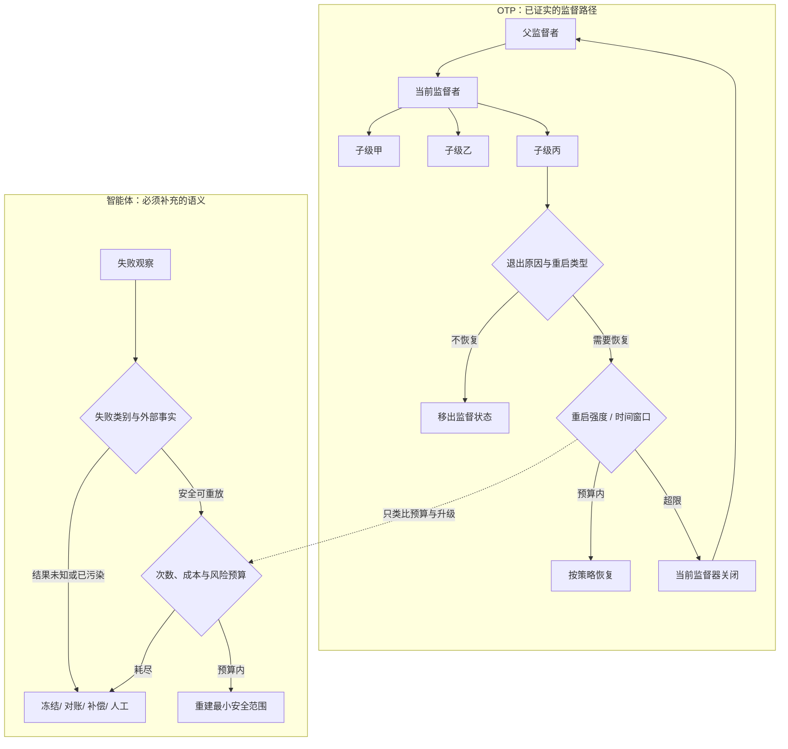

# 监督树：把失败恢复设计成层级控制协议

一个子级崩溃并不可怕。真正危险的是它被不断拉起、不断失败，而当前控制层始终不肯承认自己已经无法恢复。OTP 的答案不是“更努力地重试（Retry）”，而是给局部恢复设置窗口预算；预算耗尽后，当前监督者（Supervisor）连同自己的子树退出，把故障所有权交给父层。

这套机制值得迁移的部分，是执行、监督与升级的明确分工。它不意味着大语言模型智能体可以像字节码虚拟机进程一样廉价重建：智能体可能消耗昂贵模型额度，状态散落在持久存储，并且已经发送消息、付款或修改数据库。

**证据范围**：本文依据该平台29.0.3 版在线文档与上游固定提交`295c7737d1b25a270e3fc6fa2b7ec7ad4779cf17`。版本、源码入口与逐项接缝放入证据卡；机制、失败路径和迁移边界留在正文。

## 学习问题

1. 子级反复失败时，OTP 怎样从局部重启走到向上升级？
2. 重启类型、重启策略与重启强度分别拥有哪一个决定？
3. 启动顺序、关闭顺序和恢复范围怎样共同表达依赖？
4. 智能体平台怎样把崩溃、质量失败、工具失败和外部状态污染分开？
5. 为什么字节码虚拟机进程的重建语义不能直接套在有成本、有持久状态、有外部副作用的智能体上？

## 一页摘要

**已证实事实**：监督者启动、停止并监控工作进程（worker）或下级监督者。子进程规范定义启动函数、重启类型、关闭与子级类型；监督器标志定义策略、`intensity`和`period`。进程退出后，重启类型先决定是否恢复，预算再决定当前层是否仍有恢复权，策略最后决定重建一个、全部或依赖后缀。

一次重启超过局部窗口预算时，OTP 不会留在原地无限循环。当前监督者会终止子进程并以`shutdown`退出；父监督者随后决定重建这个子树，还是继续把失败向上交出。

**个人分析**：智能体系统可以复用“局部恢复有预算，预算耗尽就升级”的协议，却不能复用“重启等于恢复”的假设。外部写入结果未知时，应先对账；状态已污染时，应先冻结、补偿或交给人。

这张表回答三个容易混淆的配置分别控制什么：

| 决策| OTP 输入| 控制的问题| 智能体迁移所需补充|
| --- | --- | --- | --- |
| 是否重启| 退出原因与重启类型| 此类退出值不值得恢复吗| 质量、合规和业务终态分类|
| 重启多大范围| 策略与子进程顺序| 哪些兄弟共享不变量| 持久状态、依赖图与补偿边界|
| 还能否重启| `intensity` + `period` | 当前层是否仍有恢复权| 次数、费用、时限、配额与风险总预算|
| 预算耗尽后谁接手| 监督器退出| 哪一层拥有更大恢复范围| 结构化证据包与人工接管责任|

应保留的判断是：恢复类型、恢复范围和恢复预算是三个正交问题；把它们混成一个“最多重试三次”会隐藏故障所有权。

## 事实边界

**已证实事实**：普通静态子级按规范从左到右启动、从右到左终止。`one_for_one`只重启退出者；`one_for_all`先终止其余子级，再重启全部；`rest_for_one`终止退出子级之后启动的子级，并从退出位置向后重启。

**已证实事实**：`permanent`无论退出原因都重启；`transient`只在非`normal`、`shutdown`、`{shutdown, Term}`的退出后重启；`temporary`从不重启。`intensity`/`period`的默认值为1/5；最近`MaxT`秒内超过`MaxR`次重启时，监督者关闭子级并以`shutdown`退出。

**基于证据的推断**：`one_for_all`适合不能保留部分旧成员的协作组，`rest_for_one`适合有明确线性依赖的流水线。OTP 只执行声明的范围，不会自动识别共享状态或依赖图，所以策略正确性仍由设计者负责。

**个人分析**：进程正常退出不代表答案正确。幻觉、越权或格式正确但事实错误的结果，需要确定性规则、评估器或人工明确产出业务失败信号；OTP 监督者本身不理解模型置信度、外部事务或审批。

  
证据：固定版本与监督语义范围

  - **文档截面：** 29.0.3 版的`Supervisor Behaviour`与标准库`supervisor`页面。
  - **源码截面：** `erlang/otp@295c7737d1b25a270e3fc6fa2b7ec7ad4779cf17`，集中阅读`lib/stdlib/src/supervisor.erl`。
  - **时间边界：** 访问与来源截断日期均为2026-07-22；之后行为变化不在本文结论内。
  - **证明边界：** 这些证据证明OTP 的进程监督语义，不证明它原生支持跨节点长期工作流（Workflow）、分布式事务、模型质量判断或副作用补偿。

## 架构图

先看故障所有权如何移动：子级失败先交给当前监督者；只有“应重启且预算仍在”才进入局部策略；预算耗尽则整层退出。右侧是迁移到智能体平台后必须插入的语义闸门。

图中按默认`auto_shutdown=never`建模，因此“不恢复”只表示子级不再重启。关键边界是：OTP 升级的是进程失败，智能体升级事件还必须携带任务版本、状态快照、工具调用、外部资源、评估证据和预算消耗。

## 控制权与任务流

**说明性场景**：一个`rest_for_one`监督者依次启动会话子级、规划子级和发布子级。发布子级异常退出；它是`permanent`，因此当前监督者先把这次失败记入强度窗口，再重启发布子级。它重新启动后立即因同一配置错误退出，新的重启使窗口超限。

当前层此时不再尝试第三种“更聪明”的恢复。它终止自己的子级，并以`shutdown`退出。父监督者看见这个子树失败，可以从更大范围重建配置和整棵子树；如果父层预算也耗尽，失败继续上移。

这个场景只组合了官方支持的机制，没有声称发生过真实事故。它说明局部监督者的权力是有限的：它能按声明重建，却不能无限占有恢复权。

一次退出实际经过五个所有权检查：

1. 当前监督者用`Pid`找到子进程规范。
2. 重启类型与退出原因决定是否需要恢复。
3. `intensity`/`period`决定当前层是否仍有恢复权。
4. 策略与子进程顺序决定恢复范围。
5. 当前层退出后，父层接过更大范围的恢复或终止权。

启动和关闭也受同一所有权约束。先启动的基础子级最后关闭，后启动的消费者先停止；子级的`shutdown`可设为`brutal_kill`、毫秒超时或`infinity`。超时模式先发送`shutdown`，再以`kill`收尾；工作进程默认5000 毫秒，监督者默认`infinity`。

智能体平台对应的排空不能把“强杀计算”解释为“外部动作失败”。应先停止新工具调用与结果发布，再等待在途动作；超时后把未知写入标记为`unknown`并对账，不能立即重放。

## 关键源码导读

最短阅读路径只需要回答三件事：退出信号在哪里进入、重启预算在哪里记账、预算耗尽如何变成监督者退出。顺着`handle_info/2` → `restart_child/3` / `do_restart/3` → `restart/2` / `add_restart/1`即可看到完整控制流。

**已证实事实**：`handle_info({'EXIT', Pid, Reason}, State)`把退出交给`restart_child/3`；`do_restart/3`先按重启类型与原因分流；`restart/2`在执行策略前调用`add_restart/1`，超限时返回`shutdown`。重启启动失败会把子级标记为`restarting`并通过异步消息再试，控制权会还给`gen_server`，且每次再试仍受强度记账约束。

另一个实现边界是时间：强度窗口使用`erlang:monotonic_time(second)`，不是墙上时钟。智能体的持久化预算跨进程、跨机器、跨重启存在时，必须定义持久时间与单调时间的关系，不能照抄内存时间戳。

  
证据：固定提交中的源码控制流

  - [`supervisor.erl` 50–113](https://github.com/erlang/otp/blob/295c7737d1b25a270e3fc6fa2b7ec7ad4779cf17/lib/stdlib/src/supervisor.erl#L50-L113)：子级顺序、三种策略与重启强度契约。
  - [`init/1`、`init_children/2` 949–980](https://github.com/erlang/otp/blob/295c7737d1b25a270e3fc6fa2b7ec7ad4779cf17/lib/stdlib/src/supervisor.erl#L949-L980)与[`start_children/2` 993–1017](https://github.com/erlang/otp/blob/295c7737d1b25a270e3fc6fa2b7ec7ad4779cf17/lib/stdlib/src/supervisor.erl#L993-L1017)：`trap_exit`、部分启动失败清理、启动与终止顺序。
  - [`handle_info/2` 1275–1310](https://github.com/erlang/otp/blob/295c7737d1b25a270e3fc6fa2b7ec7ad4779cf17/lib/stdlib/src/supervisor.erl#L1275-L1310)与[`do_restart/3` 1418–1470](https://github.com/erlang/otp/blob/295c7737d1b25a270e3fc6fa2b7ec7ad4779cf17/lib/stdlib/src/supervisor.erl#L1418-L1470)：`EXIT`入口与重启类型分流。
  - [`restart/2` 及策略 1472–1562](https://github.com/erlang/otp/blob/295c7737d1b25a270e3fc6fa2b7ec7ad4779cf17/lib/stdlib/src/supervisor.erl#L1472-L1562)：先记账；超限时报告`reached_max_restart_intensity`并关闭，再区分一个、后缀或全部恢复。
  - [`terminate_children/2`、`shutdown/1` 1571–1657](https://github.com/erlang/otp/blob/295c7737d1b25a270e3fc6fa2b7ec7ad4779cf17/lib/stdlib/src/supervisor.erl#L1571-L1657)与[`add_restart/1` 2248–2290](https://github.com/erlang/otp/blob/295c7737d1b25a270e3fc6fa2b7ec7ad4779cf17/lib/stdlib/src/supervisor.erl#L2248-L2290)：超时关闭等待`DOWN`再强制终止；强度窗口使用单调时钟、裁剪过期记录，并明确处理`intensity = 0`。
  - **证明边界：** 这些接缝证明实现怎样维护进程恢复协议，不证明任一智能体业务恢复策略安全。

## 架构决策与权衡

**策略不是可靠性等级。** `one_for_all`范围最大，却会主动终止健康兄弟；`one_for_one`成本最小，却可能保留与新子级不兼容的旧状态；`rest_for_one`简洁地编码线性依赖，却不能表达一般有向无环图。选择依据是共享不变量，而不是“越大越稳”。

| 条件| OTP 选择| 代价| 智能体中的有限映射|
| --- | --- | --- | --- |
| 子级独立| `one_for_one` | 必须证明无隐式共享状态| 只重跑失败的检索分片|
| 协作组不能保留部分旧成员| `one_for_all` | 健康成员也重建| 未提交的协议阶段整体重建|
| 子进程顺序就是依赖顺序| `rest_for_one` | 顺序成为架构契约| 按版本化依赖图重建失败点后继|
| 不可逆副作用已发生| 三者都不直接适用| 需查证、冻结或补偿| 支付已提交但响应丢失|
| 进程正常、结果低质量| 三者都不自动触发| 需显式质量信号| 验收失败后进入业务恢复|

**预算必须从顶层分配。** OTP 文档警告多层监督者的可重启次数会相乘。智能体还会叠加模型回合、工具重试、工作流重启与人工退回；各层都“重试三次”会放大成本和风险。应以全局任务标识汇总令牌、金额、延迟、写入次数和供应商配额。

**人工接管是合法终态。** 可重建纯计算、只读工具和具备幂等键的写入可在预算内自动恢复。权限升级、外部状态未知、连续质量失败或高风险动作应进入有负责人、有截止时间、有证据包的人工队列，而不是无主死信箱。

## 生产化分析

生产设计首先要回答：同一名子级为何再次失败？至少区分运行时崩溃、模型质量失败、工具失败和外部状态污染。工具“超时”可能表示未执行，也可能表示已提交但响应丢失；分类必须携带证据与置信度。

自动恢复应同时满足：输入可重放、模型与提示与工具版本可固定、外部写可证明幂等或尚未发生、凭证仍有效、预算尚余、风险级别允许。任一条件未知时，先查询事实或升级。

OTP 子级可由`{M,F,A}`重新调用；智能体的可重建运行契约还要固定任务输入、模型参数、工具模式、知识快照、权限、检查点、已完成步骤与外部资源标识。敏感凭证只能通过短期引用重新获取，不能复制进升级证据包。

运行时退出原因不能直接充当业务终态。确定性验收至少区分`succeeded`、`retryable_failed`、`non_retryable_failed`与`needs_review`，再由控制层决定是否重建、冻结或升级。

升级事件则应记录`task_id`、失败类别、组件、尝试次数、首末时间、策略、预算消耗、输入与检查点版本、工具调用及幂等键、外部状态、评估证据、建议动作与所需审批。父层和人工必须基于同一组事实接管。

可观测性不能只看最终成功率。至少跟踪自动恢复成功率、恢复耗时、重启放大系数、重复副作用、未知外部状态停留时间、升级率、人工等待时间和每个成功任务的恢复成本。

演练应覆盖配置错误导致的连续崩溃、格式合法但事实错误、工具429、响应丢失、部分写入和监督者自身崩溃。门禁验证恢复范围、预算、关闭顺序、证据包和人工队列；新策略按任务版本灰度，不修改进行中任务的恢复语义。

**不可隐藏的非等价边界**：字节码虚拟机进程便宜、隔离并可由监督者从规格重建；大语言模型智能体往往昂贵、非确定、状态外置且能造成真实副作用。预算、幂等、权限、补偿和质量验收必须由确定性控制层执行，不能期待“重新启动后它会更谨慎”。

## 可迁移经验

### 可直接复用的机制

1. **监督与执行分离。** 控制层拥有生命周期、预算与升级，执行者只在授权范围内工作。
2. **恢复范围显式化。** 为单任务、协作组与依赖后缀分别定义策略。
3. **窗口化预算。** 同时约束突发量与长期失败速率，并从顶层统一核算多层消耗。
4. **层级升级。** 当前层预算耗尽时，把结构化证据交给拥有更大恢复范围的一层。
5. **有序启动与反向关闭。** 把依赖、排空和超时写进运行契约并测试。

### 只能有限类比的部分

1. **重启类型。** 可映射到业务终态，但不能只看进程退出原因。
2. **`rest_for_one`。** 后继失效思想可复用，线性顺序不能代替一般依赖图。
3. **子进程规范。** 可作为重建契约，但必须扩展版本、权限、预算、状态与副作用。
4. **监督器升级处理。** 可映射为上层编排或人工接管，但应成为持久化事件。
5. **关闭超时。** 可借鉴先优雅停止再强杀计算，不能借此推断外部命令已撤销。

### 不应照搬的部分

1. **不要把字节码虚拟机进程等同于大语言模型智能体。**
2. **不要把崩溃当成全部失败。** 质量、合规和业务错误经常正常返回。
3. **不要默认重放工具调用。** 响应丢失必须先对账或依赖幂等键。
4. **不要假设重启清空持久状态或撤销外部副作用。**
5. **不要逐层独立设置重试次数。** 预算会乘法放大。
6. **不要用进程树替代跨节点长期工作流、补偿与审批。**
7. **不要让人工接管成为没有负责人和服务等级协议的死信箱。**

## 来源

**官方架构与接口（已证实事实）**

- [Supervisor Behaviour — OTP Design Principles](https://www.erlang.org/doc/system/sup_princ.html)：监督原则、三种策略、最大重启强度、向上升级、子进程规范与停止顺序；在线页面核对版本为29.0.3。
- [`supervisor` — STDLIB](https://www.erlang.org/doc/apps/stdlib/supervisor.html)：监督器标志、重启类型、关闭语义、默认值与公开接口。

**固定源码（已证实事实）**

- [Erlang/OTP 上游固定提交](https://github.com/erlang/otp/tree/295c7737d1b25a270e3fc6fa2b7ec7ad4779cf17)：本文源码证据基线。
- [`lib/stdlib/src/supervisor.erl`](https://github.com/erlang/otp/blob/295c7737d1b25a270e3fc6fa2b7ec7ad4779cf17/lib/stdlib/src/supervisor.erl)：退出信号处理、重启类型、策略、重启强度、子级顺序与关闭实现。

**证据边界说明**：访问日期与来源截断日期均为**2026-07-22**。`已证实事实`只陈述文档或固定源码直接支持的行为；`基于证据的推断`解释依赖与故障域；`个人分析`给出智能体迁移所需的质量、幂等、补偿和人工接管机制。
