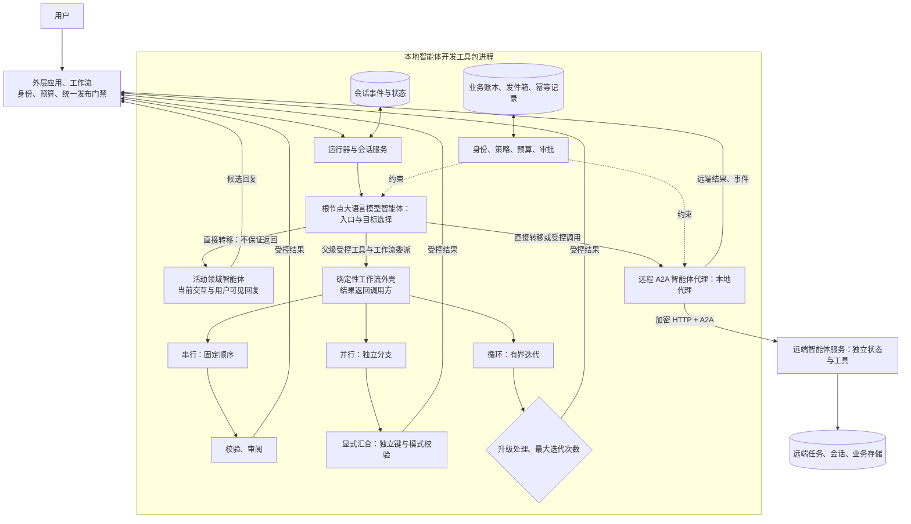
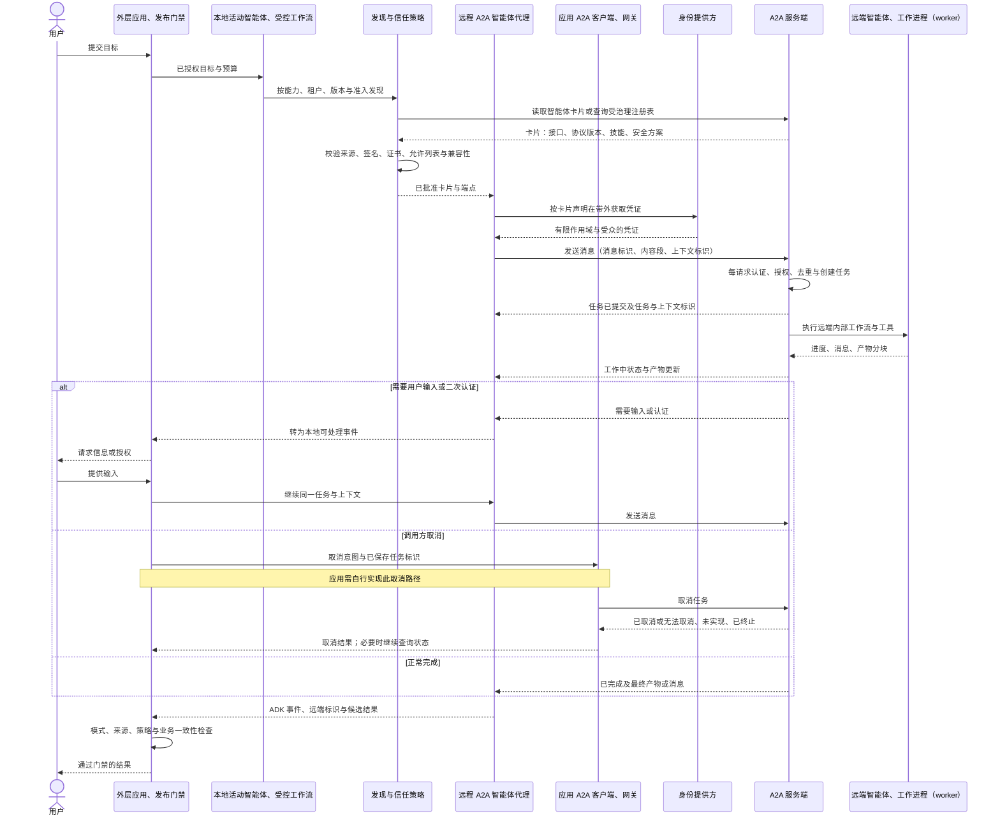

# Google ADK 与 A2A：从本地层级编排到跨系统智能体协作

把`RemoteA2aAgent`放进本地`sub_agents`列表，只统一了调用接口，没有把远端服务变成本地对象。网络、身份、版本、任务状态和部分失败仍然存在，只是被代理对象包在同一棵智能体树里。

因此要先拆开两类边界。本地智能体开发工具包用父子树、工作流和会话组织同一应用；A2A 用智能体卡片、消息、任务与产物连接独立系统。MCP 又位于工具与数据边界，不能替 A2A 持有远端智能体的任务生命周期。

**基于证据的推断**：因此超时关闭超文本传输协议（Hypertext Transfer Protocol，HTTP）连接、用户点击“停止”和远端副作用停止是三件不同的事。版本与源码入口由固定证据截面核验；沿着一次本地委派跨到远端服务时，正文持续追问信任、取消、工具副作用和人工对账由谁承担。

## 学习问题

1. 智能体开发工具包的父子智能体树怎样约束所有权，大语言模型驱动的`transfer_to_agent`又转移了什么、没有转移什么？
2. `SequentialAgent`、`ParallelAgent`、`LoopAgent`的确定性外壳与大语言模型动态路由应怎样组合，何时应直接采用新一代工作流与图？
3. `Session`、`state`、`InvocationContext`、`temp:`、`user:`与`app:`分别是什么作用域，本地共享上下文怎样避免并发写冲突？
4. 一个本地智能体开发工具包子智能体变成`RemoteA2aAgent`后，智能体卡片、消息、任务、产物和`contextId`怎样形成跨系统通信边界？
5. A2A 与 MCP 分别解决智能体之间和智能体或应用访问工具与数据的什么问题，为什么两者可以共存但不能互相提供信任或分布式事务？

## 一页摘要

先看调用是否跨越独立部署和所有权。若没有，函数、工具、本地子智能体或工作流已能表达控制；只有远端系统真正拥有自己的任务与演进节奏时，A2A 才增加价值。

**已证实事实**：本地`BaseAgent`以`sub_agents`形成单父树。`transfer_to_agent`让目标智能体成为当前交互的活动处理者并产生用户可见回复，不保证控制回到父智能体。只有工具、工作流或应用包装器形式的受控委派，才把结果返回调用方继续聚合。

会话保存本地事件与状态；无前缀、`user:`、`app:`和`temp:`对应不同作用域。持久性取决于会话服务，共享调用也不提供并发事务。

A2A 跨服务发送消息，远端可以直接答复，也可以创建有状态任务。智能体卡片声明接口、版本、能力、技能与安全方案；任务用状态和产物表达进度、等待输入与交付物。

**基于证据的推断**：本地层级与 A2A 联邦是两个治理层。直接转移把当前回复权交给目标智能体；父级受控委派才保留调用方聚合权。若系统需要统一发布门禁，它应位于外层应用或工作流，而不能假定根节点总会重新取得控制。远端服务仍拥有自己的任务、工具和恢复。

| 边界| 调用对象| 控制与状态所有者| 适合场景| 不自动保证|
| --- | --- | --- | --- | --- |
| 本地函数与工具| 确定性能力| 调用智能体或主机| 短操作、结构化输入输出、低开销| 领域推理、长任务协议|
| 直接`transfer_to_agent` | 同进程或远端代理智能体| 目标成为当前活动智能体，负责当前交互与可见回复| 用户应直接切换到领域处理者| 自动返回父智能体、统一聚合|
| 父级受控工具与工作流委派| 本地或远端能力| 调用方保留流程控制并接收结果| 比较、汇合、统一回答与门禁| 子智能体正确性、业务恰好一次|
| A2A 远端智能体| 独立智能体服务| 本地只持代理；远端持任务与内部实现| 跨进程、团队、语言、框架| 信任、可用性、全局事务、自动版本兼容|
| MCP 服务端| 工具、资源、提示词等能力| 主机管理客户端与上下文边界| 智能体与应用访问工具和数据| 对等智能体的任务协商与生命周期|

**个人分析**：同一进程先用函数、工具或本地子智能体，固定骨架用工作流。独立部署和互操作边界真实存在时才引入 A2A；工具与数据连接继续使用 MCP。

## 事实边界

事实必须分别落在本地运行时、A2A 协议和具体适配器三层。协议包含一项操作，不等于固定智能体开发工具包适配器已经实现；本地代理能挂进树，也不等于远端状态变成本地会话。

### 已证实事实

智能体开发工具包建议多数项目从单智能体开始。智能体名称在树中唯一，一个实例只有一个父级；描述参与委派选择。`disallow_transfer_to_parent`和`disallow_transfer_to_peers`只限制路径，不是授权系统。

串行共享调用上下文并按顺序运行。并行创建分支上下文，要求分支独立且结果顺序可能不稳定；循环必须以`max_iterations`或升级处理终止。

来源截断时，智能体开发工具包2.0 已用图与动态工作流取代模板工作流的推荐位置，Python 的三个模板类也有弃用标记。旧系统仍需理解其语义，新项目不能假设应用程序编程接口（Application Programming Interface，API）长期稳定。

会话以应用、用户、会话标识对话，保存事件和可序列化状态。状态应通过上下文或事件增量更新；直接修改读出的`Session.state`可能绕过追踪并丢失数据。

内存会话服务重启即丢失，数据库会话服务与托管会话服务提供持久化。持久会话仍不是业务事务、消息队列或灾备保证。

`RemoteA2aAgent`是本地代理，请求实际经过 A2A 客户端与网络。它解析智能体卡片，在智能体开发工具包事件与 A2A 消息与任务间转换，并把远端任务与上下文标识保存在事件元数据。

智能体卡片是结构化元数据，包含支持的接口、绑定与版本、能力、技能和安全方案。发现可用约定路径、受治理注册表或直接配置；规范没有统一的受治理注册表接口。

发送消息可返回消息或任务。`contextId`关联连续交互，`taskId`继续特定任务；消息表达回合，产物表达交付物，内容段承载文本、文件或结构化数据。

A2A 1 系列把规范形式模型、操作与两类远程过程调用及 HTTP 结构化数据绑定分层。客户端必须按智能体卡片选择兼容接口，不能假设统一路径和序列化。

取消任务只要求尝试取消。取消操作幂等，发送消息只可能借助`messageId`去重；推送通知至少一次，接收端必须处理重复。

固定版本的 Python 智能体开发工具包 A2A 执行器中，`cancel()`仍抛出`NotImplementedError`。协议包含取消，不等于这项适配器已实现端到端取消。

A2A 面向独立智能体协作，MCP 的主机、客户端与服务端面向工具、资源与提示词。两者互补，但安全与状态边界各自独立。

### 基于证据的推断

静态父子树是本地能力目录，动态转移是树上的控制指针变化。父智能体能转移到远端代理，不代表拥有远端状态、工具或内存。

共享调用上下文适合顺序传值，不是并行事务。并行应写独立密钥后确定性汇合；共享可变对象要依靠外部并发控制。

智能体卡片是自我声明，不是信任证明。客户端仍需验证来源、证书与签名、准入和撤销状态。

A2A 任务是远端协议状态机，不是跨系统长事务。任务已完成不能证明本地数据库、MCP 工具和第三方系统原子提交；业务仍需幂等、发件箱、补偿和人工对账。

### 个人分析与未知项

智能体开发工具包不替应用决定租户映射、卡片信任根、开放授权协议受众与作用域、数据驻留、远端服务等级目标、重试（Retry）预算、业务幂等或补偿。A2A 统一消息封装，不统一领域语义、质量标准和错误语义。

  
证据：固定智能体开发工具包、文档与 A2A 协议快照

  - **来源截断：** `2026-07-20`
  - **分支：** Python 智能体开发工具包核对时为`main`
  - **Python 智能体开发工具包：** `google/adk-python@be5828f317c7430411df29974cd9ccfa875e90de`
  - **智能体开发工具包文档：** `google/adk-docs@3e6ee758f2a642abf42b6a92682bb113e7fb0743`
  - **A2A：** `a2aproject/A2A@af112d9491c1fd4b2a568ac65755af4a62790490`
  - **边界：** 固定快照不支持外推后续发布、弃用状态、默认值或字段语义。

## 架构图

下面两张图故意不合并。本地图回答“谁能在同一应用里委派”，A2A 图回答“两个独立系统怎样交换任务”；它们是生产化组合，不是智能体开发工具包自动部署拓扑。

### 本地层级与确定性工作流

文字等价描述：

1. 外层应用完成身份、预算与发布策略检查，运行器再从会话服务装载会话并启动根`LlmAgent`。
2. 直接转移让目标智能体接管当前交互和用户可见回复，不保证返回根节点。父级受控工具与工作流委派才让调用方继续聚合；串行、并行与循环分别固定顺序、汇合和终止边界。
3. `RemoteA2aAgent`在本地仍是一个子节点，但它只是一段协议适配器；真正的远端智能体在另一服务中拥有自己的任务、会话、工具和存储。
4. 身份、授权、成本、审批与副作用幂等不能交给转移自动决定。统一发布门禁属于外层应用与工作流；远端实际行动还要再次授权，业务账本记录权威事实。

### 跨系统 A2A 请求与任务生命周期

文字等价描述：

1. 客户端从受治理注册表、可信配置或约定路径端点取得智能体卡片，并在模型看见候选之前检查来源、签名与证书、协议版本、绑定、媒体类型和安全策略；公开统一资源定位符（Uniform Resource Locator，URL）不能直接变成可信依赖。
2. 凭证在 A2A 载荷之外通过标准 HTTP 或开放授权协议等机制取得和发送。远端服务对每次请求重新认证，并按技能、数据和动作授权。
3. 客户端发送带唯一`messageId`的消息。远端可立即返回消息，或创建`taskId`与`contextId`并发送状态和产物更新。
4. `input-required`与`auth-required`是可继续的中断状态；已完成、失败、已取消、已拒绝是终态。图中的取消任务由应用自建、支持取消的 A2A 客户端与网关发出，不是固定版本`RemoteA2aAgent`的现成功能。该代理没有把本地取消意图端到端映射为协议操作，而固定版本智能体开发工具包服务端执行器的`cancel()`也可能未实现；即使服务实现了取消，调用者仍必须接受“无法取消或已经完成”的结果。
5. 远端结果进入外层应用与工作流后仍要经过模式、来源、策略和业务一致性检查。两侧分别持久化，图中没有全局提交点。

## 控制权与任务流

**说明性场景｜外层应用完成确定性校验，根节点随后把当前交互直接转移给远端智能体。** 该场景只组合智能体开发工具包树、会话和 A2A 消息与任务机制，不代表真实客户或生产事故。

外层应用先校验用户、预算和远端技能允许列表，再启动根节点。根节点调用`transfer_to_agent`后，`RemoteA2aAgent`成为当前交互的活动处理者；它产生用户可见回复，控制不保证自动回到根节点。

远端可以返回消息，也可以创建任务并进入工作中、需要输入或需要认证状态。此时本地会话只保存远端标识映射，任务的真实状态、内部工具与恢复策略仍归远端服务。

如果改用工具、工作流或应用包装器做父级受控委派，远端结果才返回调用方继续聚合。无论哪条路径，外层应用与工作流都要校验来源、模式和业务状态；用户取消等待不代表远端停止，缺少端到端取消时必须查询、补偿或转人工。

### 父子层级：所有权先于路由

**已证实事实**：父智能体构造`sub_agents`时，智能体开发工具包为每个子对象设置唯一`parent_agent`；已归属于另一个父对象的实例不能再次添加。`root_agent`通过父级链上溯，`find_agent()`从根向下查找。这个对象模型让可委派目标成为一个显式、可枚举的树，而不是任意网络目录。

**基于证据的推断**：一个节点只能有一个父对象，适合表达“谁配置它、哪些目标可达”。它不保证直接转移后回到父节点。需要父级聚合时，应把能力封装成工具、工作流或应用包装器；跨团队复用也可通过 A2A 建独立服务。

### 转移的实际含义

`transfer_to_agent`是大语言模型可调用的控制工具。运行时把后续执行交给树中命名智能体；父、子和对等方是否可达由树结构与`disallow_transfer_*`配置共同决定。它不会自动：

- 把本地用户令牌换成目标服务可用的凭证；
- 复制所有业务状态或持久化远端任务；
- 让目标智能体获得超出自己工具策略的权限；
- 保证目标最终会转移回来；
- 为跨服务副作用建立回滚事务。

**个人分析**：把转移看成“当前活动处理者指针”最安全。目标智能体接管当前交互和可见回复，父智能体不一定恢复；全局预算、统一发布和升级策略应由外层应用与工作流持有。高风险动作还必须在工具或服务边界确定性授权。

### 确定性工作流与大语言模型路由

| 机制| 下一步由谁决定| 确定的部分| 仍不确定的部分| 推荐约束|
| --- | --- | --- | --- | --- |
| 串行| 代码中的列表顺序| 调用先后| 每个大语言模型子步骤的内容与工具选择| 模式、每步超时、失败停止与跳过策略|
| 并行| 代码并发启动全部声明分支| 扇出集合| 完成顺序、内容、部分失败| 独立输入、并发上限、加入、稳定排序|
| 循环| 代码重复子序列| 每轮顺序| 评估器判断、迭代内容| `max_iterations`、总令牌与截止时间、无改进退出|
| 大语言模型转移| 模型选择允许目标| 候选集合与硬禁用路径| 选择、回转和调用次数| 路由评估、最大转移、回退|
| 代码路由器（Router）/ 图| 程序或结构化分类器| 可验证边与门禁| 局部分类与生成| 枚举校验、默认拒绝、版本化|

**个人分析**：优先采用“确定性骨架与局部大语言模型判断”。付款前审批、数据写入顺序、最大循环与跨域委派必须写进代码；开放式意图识别、候选生成和领域推理可以交给模型。来源截断时的新智能体开发工具包项目还应优先评估图与动态工作流，而不是继续扩大已弃用模板类的使用面。

### 本地共享上下文

串行的共享上下文让前一步通过`output_key`或状态写结果，后一步再读取。这种便捷只适用于有明确顺序的状态转换。并行分支应使用`research.result`、`risk.result`之类独立键，汇合后按模式读取；不要让多个分支原地追加同一列表，并期待稳定顺序。

推荐把状态拆成四类：

- `temp:`：当前调用的中间结果、分支完成标记，不跨下一轮；
- 会话无前缀：当前对话的任务进度、当前选择和恢复引用；
- `user:` / `app:`：确实需要跨会话的用户偏好或应用配置，写入前要明确租户和访问控制；
- 业务数据库：订单、支付、配额、幂等键、审批与审计等权威事实。

前两类是智能体运行上下文，最后一类才是业务记录。把订单状态只写进`session.state`会把对话便利机制误当成事务系统。

### 本地和远端是部署选择，不是能力等级

本地智能体更快、共享对象容易、版本一起发布，适合紧耦合模块。远端智能体可独立扩缩、跨语言与团队演进，并隐藏内部实现，但新增网络时延、认证、兼容矩阵、部分失败和治理成本。远端不比本地“更智能”，本地也不比远端“更可信”；信任来自身份、代码供应链、策略、运营记录和评估证据。

## 关键源码导读

源码阅读应先确认边界跨越的位置。最短路径是`base_agent.py`看本地树，`remote_a2a_agent.py`看代理转换，再到执行器与 A2A 规范核对远端任务和取消。

四个标识要始终分开：智能体开发工具包`session_id`表示本地对话，`invocation_id`表示一次本地请求，A2A `contextId`表示远端交互分组，`taskId`表示远端有状态工作。映射不等于身份或授权。

  
证据：本地智能体开发工具包到远端 A2A 的完整阅读路径

1. [`src/google/adk/agents/base_agent.py`](https://github.com/google/adk-python/blob/be5828f317c7430411df29974cd9ccfa875e90de/src/google/adk/agents/base_agent.py)：看`name`、`parent_agent`、`sub_agents`、唯一名称校验、单父约束、`root_agent`与`find_agent()`。这是本地层级所有权的事实入口。
2. [`src/google/adk/agents/llm_agent.py`](https://github.com/google/adk-python/blob/be5828f317c7430411df29974cd9ccfa875e90de/src/google/adk/agents/llm_agent.py)：看`disallow_transfer_to_parent`、`disallow_transfer_to_peers`、`_get_subagent_to_resume()`与根树查找。重点区分大语言模型路由与静态父子所有权。
3. [`sequential_agent.py`](https://github.com/google/adk-python/blob/be5828f317c7430411df29974cd9ccfa875e90de/src/google/adk/agents/sequential_agent.py)、[`parallel_agent.py`](https://github.com/google/adk-python/blob/be5828f317c7430411df29974cd9ccfa875e90de/src/google/adk/agents/parallel_agent.py)、[`loop_agent.py`](https://github.com/google/adk-python/blob/be5828f317c7430411df29974cd9ccfa875e90de/src/google/adk/agents/loop_agent.py)：对照顺序循环、分支上下文、`TaskGroup`合并、`max_iterations` / 升级处理与当前弃用注释。
4. [`docs/agents/workflow-agents`](https://github.com/google/adk-docs/tree/3e6ee758f2a642abf42b6a92682bb113e7fb0743/docs/agents/workflow-agents)：先读总览中的确定性定义和智能体开发工具包2.0 迁移提示，再读串行的共享调用、并行的独立分支、循环的终止条件。
5. [`docs/sessions/state.md`](https://github.com/google/adk-docs/blob/3e6ee758f2a642abf42b6a92682bb113e7fb0743/docs/sessions/state.md) 与 [`docs/sessions/session/index.md`](https://github.com/google/adk-docs/blob/3e6ee758f2a642abf42b6a92682bb113e7fb0743/docs/sessions/session/index.md)：理解事件历史、状态前缀、上下文更新方式与会话服务的持久化选择。
6. [`src/google/adk/agents/remote_a2a_agent.py`](https://github.com/google/adk-python/blob/be5828f317c7430411df29974cd9ccfa875e90de/src/google/adk/agents/remote_a2a_agent.py)：查看智能体卡片解析、智能体开发工具包与 A2A 之间的转换、`message_id` 生成，以及远端 `task_id` 与 `context_id` 如何写入事件元数据和无状态历史选项。
7. [`src/google/adk/a2a/utils/agent_to_a2a.py`](https://github.com/google/adk-python/blob/be5828f317c7430411df29974cd9ccfa875e90de/src/google/adk/a2a/utils/agent_to_a2a.py)：看`to_a2a()`如何组合网页服务框架、运行器、智能体卡片、任务存储区与推送配置存储区。注意默认运行器和存储区使用内存实现，只适合开发起点。
8. [`src/google/adk/a2a/executor/a2a_agent_executor_impl.py`](https://github.com/google/adk-python/blob/be5828f317c7430411df29974cd9ccfa875e90de/src/google/adk/a2a/executor/a2a_agent_executor_impl.py)：沿已提交 → 工作中 → 已完成与失败事件看协议映射，并核对`cancel()`当前未实现的边界。
9. [`specification/a2a.proto`](https://github.com/a2aproject/A2A/blob/af112d9491c1fd4b2a568ac65755af4a62790490/specification/a2a.proto) 与 [`docs/specification.md`](https://github.com/a2aproject/A2A/blob/af112d9491c1fd4b2a568ac65755af4a62790490/docs/specification.md)：前者是规范形式数据对象与请求与响应的规范源，后者解释操作、绑定、版本、幂等、任务状态和安全语义。
  10. [`docs/topics/agent-discovery.md`](https://github.com/a2aproject/A2A/blob/af112d9491c1fd4b2a568ac65755af4a62790490/docs/topics/agent-discovery.md)、[`life-of-a-task.md`](https://github.com/a2aproject/A2A/blob/af112d9491c1fd4b2a568ac65755af4a62790490/docs/topics/life-of-a-task.md)、[`a2a-and-mcp.md`](https://github.com/a2aproject/A2A/blob/af112d9491c1fd4b2a568ac65755af4a62790490/docs/topics/a2a-and-mcp.md)：最后建立发现、任务生命周期和协议分工的整体图。

  - **本地符号：** `BaseAgent.name`、`LlmAgent.description`、`Session.events`、`Session.state`、`app_name`、`SessionService`、`InMemorySessionService`、`DatabaseSessionService`、`VertexAiSessionService`。
  - **A2A 符号：** `/.well-known/agent-card.json`、`Send Message`、`NotImplementedError('Cancellation is not supported')`。
  - **仓库：** `google/adk-python`、`google/adk-docs`、`a2aproject/A2A`。
  - **边界：** 源码证明固定适配器的转换与限制，不证明远端服务可信、可用或具备业务事务。

## 架构决策与权衡

每项决策都先判断是否跨越独立所有权。层级、工作流和 A2A 不是能力等级，而是不同范围的控制合同。

### 层级还是扁平能力表

树结构让配置所有者和候选集清楚，也能用不同指令和工具隔离领域上下文；它不保证直接转移的返回路径。只有两三个稳定能力时，根智能体加普通工具或一个扁平路由器更简单；需要父级汇合时优先显式工具与工作流委派。

### 模板工作流还是新图与动态工作流

经典串行与并行与循环易读，适合解释和维护既有系统。当前智能体开发工具包2.0 已把更复杂的新工作推荐到图与动态工作流，说明拓扑演进、分支、恢复和组合需求超出了三个模板的表达力。迁移时要先锁定事件顺序、状态密钥、循环终止和恢复语义；不能只把类名机械替换。

### 本地还是 A2A

只有当独立部署、跨团队所有权、跨语言与框架或正式协议契约是真实需求时，A2A 的成本才合理。若组件同库同进程、需要纳秒与毫秒级调用、频繁共享可变上下文，A2A 会增加序列化、网络和运维负担。反过来，把独立供应商智能体当本地函数会掩盖身份、版本与故障边界。

### A2A 与 MCP 的清晰边界

**已证实事实**：A2A 处理智能体之间的协作：能力发现、对话消息、有状态任务、进度、产物、长运行和继续交互。MCP 处理应用与智能体访问工具和数据的上下文：主机管理客户端，服务端提供工具、资源与提示词，并通过能力协商保持连接隔离。

**个人分析**：判断标准不是“接口是否智能”，而是对方是否拥有自己的目标、状态和多轮协作责任。一个天气查询函数应是 MCP 工具；一个会澄清日期、协调供应商并维护预订任务的旅行服务更像 A2A 智能体。两者可以共存：智能体开发工具包智能体通过 A2A 委派给远端智能体，远端智能体再通过 MCP 使用数据库和工具。不要把 MCP 服务端自动称为对等方智能体，也不要把简单 API 包成 A2A 任务。

### 发现、信任与兼容

动态发现提升可替换性，但把错误或恶意智能体卡片纳入模型候选会扩大攻击面。生产注册表应做供应商准入、卡片签名与来源校验、版本与绑定允许列表、技能级授权、健康与评估门禁。缓存卡片时使用 HTTP 缓存与实体标签，并为撤销和紧急下线保留短路机制。

A2A 版本兼容应在连接前完成：读取`supportedInterfaces`，选择双方支持的绑定与`protocolVersion`，验证所需能力（流式传输、推送通知、扩展卡片等），再校验输入与输出媒体类型和应用模式。协议兼容只证明消息封装可交换；领域字段仍需独立模式版本与契约测试。

## 生产化分析

生产化必须在本地和远端各设一套门禁。任何一个协议标识都只能关联任务，不能替代认证、授权或副作用去重。

### 安全、认证与信任边界

- 只允许使用传输层安全协议（Transport Layer Security，TLS）保护的 HTTP；验证服务端身份。跨组织高敏场景可叠加双向传输层安全（mutual TLS，mTLS）、网络策略与 API 网关。
- 智能体卡片声明安全方案，但凭证通过带外流程获取并放在标准请求头中。服务端必须每请求认证；认证成功后仍要按租户、技能、资源和动作授权。
- A2A 载荷不应被当成身份来源。`user_id`、`session_id`、`contextId`和`taskId`都是关联标识，不是访问凭证。
- 公开卡片只披露必要技能；敏感细节使用受认证的扩展卡片或受治理注册表。签名必须锚定到外部信任根与撤销机制。
- 远端智能体是不透明执行边界。客户端必须把其文本、结构化数据、文件 URL 和产物都当作不可信输入，做模式、媒体类型、大小、恶意内容和引用地址校验。
- MCP 连接也保持独立安全边界。远端智能体通过 MCP 获得工具并不意味着 A2A 调用者继承该工具权限；远端必须在实际工具调用处再次授权。

### 取消、重试、幂等与事务

**已证实事实**：A2A 取消任务只要求服务尝试取消，取消可能不受支持或任务已终止；发送消息仅可以通过`messageId`去重。固定版本`RemoteA2aAgent`没有把本地取消意图映射到 A2A 取消任务的端到端客户端路径，智能体开发工具包服务端执行器的`cancel()`还直接抛出`NotImplementedError`。

这一取消边界不会因为任务已进入 A2A 而消失。需要取消时，应用必须自建支持该操作的 A2A 客户端与网关，并在接入时验证远端实现。

生产建议：

1. 为每个业务动作生成稳定`operation_id`，并在 A2A 消息元数据与结构化内容段与远端业务数据库中传播；传输重试复用相同`messageId`，业务重试复用相同`operation_id`。
2. 只有网络错误、明确可重试状态和未产生外部副作用的阶段才自动重试；使用指数退避（Exponential Backoff）、抖动（Jitter）、总截止时间和重试预算。
3. 通过应用自建客户端与网关发出取消后，继续轮询或订阅直到得到明确终态；若本地适配器或远端执行器不支持取消，标记为“本地停止等待，远端可能继续”，并触发对账。
4. 推送通知按至少一次投递设计。A2A 1.0 没有内建通用的事件标识或事件版本字段；若要用`taskId + event_id/version`去重，`event_id`或单调`version`必须由应用写入元数据。产物分块可用协议内建`artifactId`配合元数据中应用自定义的`chunk_sequence`去重和排序，并结合`append`与`lastChunk`判断拼接语义。
5. 跨本地状态、A2A 任务、MCP 工具与业务工具的操作使用长事务、发件箱、补偿和人工修复队列。不要声称 A2A 提供全局恰好一次或两阶段提交。

### 可观测性与评估

智能体开发工具包事件的 `invocation_id` 可关联一次本地交互，A2A 提供 `taskId` 与 `contextId`，HTTP 可传播万维网联盟标准的追踪上下文。建议在本地根节点、远程 A2A 智能体代理、A2A 网关、远端执行器、MCP 工具与业务工具跨度中统一记录：

| 维度| 最小字段与指标| 目的|
| --- | --- | --- |
| 关联| 追踪记录标识、智能体开发工具包会话与调用、A2A 上下文与任务、消息标识、operation_id | 跨边界重建一次任务|
| 路由| 候选卡片与版本、选择原因、转移次数、回退| 检测误路由与循环|
| 可靠性| 各任务状态时长、重试与取消结果、重复通知、部分失败| 验证恢复与幂等设计|
| 成本时延| 本地与远端模型令牌、网络、队列、工具跨度中位数、百分之九十五分位数与百分之九十九分位数| 找出联邦协作真实成本|
| 安全| 卡片校验、认证失败、技能拒绝、敏感数据策略、产物拒绝| 证明策略在边界执行|
| 质量| 任务成功、工具轨迹、最终回答、产物模式、人工纠正| 区分“协议成功”和“任务成功” |

智能体开发工具包官方评估支持工具轨迹、引用响应、评分准则、依据充分性、安全和多轮轨迹等判据。

A2A 场景还应加入契约与对抗数据集：新旧卡片版本、错误媒体类型、重复消息、乱序产物、长时间处于工作中状态、需要输入后恢复、取消竞态、远端返回提示词注入，以及远端已完成但业务账本未提交。

### 典型生产失败模式

| 失败模式| 表现| 遏制方式|
| --- | --- | --- |
| 树内误转移| 错专家、来回转移、最终答案责任不明| 限定候选、禁用不必要父级与对等方路径、最大转移、路由评估|
| 并行状态冲突| 丢写、覆盖、结果乱序| 独立密钥、不可变事件、显式加入、稳定排序、外部并发控制|
| 循环无界| 令牌、成本和延迟持续增长| `max_iterations`、截止时间、预算、无改进退出和人工升级|
| 内存服务误入生产| 重启丢会话与任务与产物| 持久化会话服务、任务存储、产物存储与恢复演练|
| 智能体卡片被污染或过期| 请求发往恶意端点、版本不匹配| 可信注册表、签名与证书、允许列表、实体标签、生存时间、撤销|
| A2A 模式漂移| 解析失败、字段枚举变化、绑定路径不匹配| 固定版本、能力协商、消费者契约测试、双版本迁移窗口|
| 网络超时后盲重试| 重复下单或重复远端任务| 稳定消息标识加业务操作标识、先读取或列举任务、幂等业务写|
| 取消被误认为完成| 用户界面已停止但远端继续执行| 区分请求与确认与终态；能力检查；对账和补偿|
| 产物注入或外链攻击| 恶意文件、服务端请求伪造、超大载荷| 媒体类型与大小与哈希校验、URL 允许列表、隔离扫描、最小权限下载|
| 只看 HTTP 200 | 协议成功但任务失败或结果错误| 校验任务状态、产物模式、业务账本和质量评估|
| 远端级联故障| 一个智能体拖垮父流程和下游| 舱壁、并发上限、熔断器、部分结果与降级策略|

### 发布门禁

上线前至少验证：本地树中名称和所有权唯一；每条直接转移有允许矩阵并接受“不自动返回”，父级聚合改用显式受控委派；统一发布门禁位于外层应用与工作流。其余还包括截止时间、状态作用域、卡片准入与兼容、副作用补偿、取消实测、跨协议追踪记录和对抗契约测试。

## 可迁移经验

迁移时先决定控制是否仍在一个运行时内，再决定是否需要协议联邦。

### 可直接复用的机制

1. **先画控制权。** 标出谁选下一步、谁拥有最终答案、谁能执行副作用、失败回到哪里。
2. **分开直接转移与父级受控委派。** 前者转移当前交互与可见回复，后者把结果返回调用方聚合。
3. **把确定性放在可证明处。** 顺序、审批、预算、并发、循环终止和统一发布由外层应用与工作流控制。
4. **发现先过信任门。** 智能体卡片进入模型候选前，经过注册表、签名与证书、允许列表、评估与撤销检查。

### 只能有限类比的部分

1. **共享调用方便传值。** 顺序步骤可用状态，并行仍需独立输出、显式汇合和外部一致性。
2. **远程 A2A 智能体代理统一本地 API。** 它不会消除远端身份、延迟、失败、版本与数据治理。
3. **A2A 与 MCP 可以叠加。** A2A 连接独立智能体，MCP 连接工具与资源与上下文；两套权限分别执行。
4. **协议成功、任务成功与业务成功分层。** 消息封装可解析、任务已完成和业务唯一提交是三个检查点。

### 不应照搬的部分

1. **不要把智能体卡片当信任证明。** 能发现只说明可寻址，不能证明供应商、端点或技能已获准。
2. **不要把取消请求当远端终止。** 固定适配器可能不支持取消；继续查询，对账副作用，必要时补偿或人工处理。
3. **不要声称 A2A 提供全局事务。** 重试复用标识，通知去重，副作用使用幂等键、发件箱、长事务和补偿。
4. **不要跨过不必要的边界。** 单智能体、普通工具或同进程工作流能满足时，不引入多层树、注册表和远端任务。

实用选择顺序是：普通函数 → MCP 或本地工具 → 单智能体 → 本地子智能体 → 确定性工作流 → A2A 远端智能体。只有上一层无法满足所有权、上下文、扩缩、互操作或治理需求时，才进入下一层。

## 来源

### 官方阅读顺序

以下 Google ADK 多智能体文档与协议资料构成官方阅读顺序。

1. [ADK Agents 总览](https://adk.dev/agents/)：先确认单智能体默认起点和升级工作流的条件。
2. [ADK Template workflow agents](https://adk.dev/agents/workflow-agents/)：理解串行与并行与循环的确定性外壳与智能体开发工具包2.0 迁移提示。
3. [ADK Session state](https://adk.dev/sessions/state/) 与 [Session](https://adk.dev/sessions/session/)：建立本地会话、调用和持久化边界。
4. [ADK A2A introduction](https://adk.dev/a2a/intro/)：先判断本地智能体与远端 A2A 智能体的适用条件。
5. [ADK consuming](https://adk.dev/a2a/quickstart-consuming/) 与 [exposing](https://adk.dev/a2a/quickstart-exposing/)：追踪`RemoteA2aAgent`、智能体卡片、客户端代理与服务端执行器。
6. [A2A 规范](https://a2a-protocol.org/latest/specification/)：核对智能体卡片、消息与任务与产物、操作、绑定、幂等、安全和版本语义。
7. [A2A discovery](https://a2a-protocol.org/latest/topics/agent-discovery/)、[task lifecycle](https://a2a-protocol.org/latest/topics/life-of-a-task/) 与 [A2A/MCP comparison](https://a2a-protocol.org/latest/topics/a2a-and-mcp/)：补齐发现、长任务和协议分工。
8. [MCP Architecture（2025-06-18 版）](https://modelcontextprotocol.io/specification/2025-06-18/architecture)：只用于界定主机、客户端、服务端、工具、资源与上下文边界，不用来声称该项目的 A2A 实现行为。
9. [ADK observability](https://adk.dev/observability/traces/) 与 [evaluation](https://adk.dev/evaluate/)：把运行轨迹与质量验证连接起来。

### 固定版本证据

- [google/adk-python @ `be5828f317c7430411df29974cd9ccfa875e90de`](https://github.com/google/adk-python/tree/be5828f317c7430411df29974cd9ccfa875e90de)
- [google/adk-docs @ `3e6ee758f2a642abf42b6a92682bb113e7fb0743`](https://github.com/google/adk-docs/tree/3e6ee758f2a642abf42b6a92682bb113e7fb0743)
- [a2aproject/A2A @ `af112d9491c1fd4b2a568ac65755af4a62790490`](https://github.com/a2aproject/A2A/tree/af112d9491c1fd4b2a568ac65755af4a62790490)

### 证据说明

- **已证实事实**只使用上述 ADK、A2A 项目与 MCP 官方规范和源码。
- **基于证据的推断**把可复查实现行为连接到生产架构结论，并明确不确定性。
- **个人分析**是迁移、选型和运维建议，不代表相关项目或协议规范的官方保证。
- 访问日期与来源截断日期均为**2026-07-20**。A2A、MCP 的规范，以及智能体开发工具包与 A2A 的适配实现持续演进；生产采用前必须重新核对正式发布、目标语言实现、智能体卡片、协议版本、绑定和具体适配器的支持矩阵。

本地编排决定一棵树怎样行动，A2A 只决定两套系统怎样互相描述任务。把这条边界保留下来，才知道何处校验权限、何处等待终态，以及哪一侧负责修复副作用。
