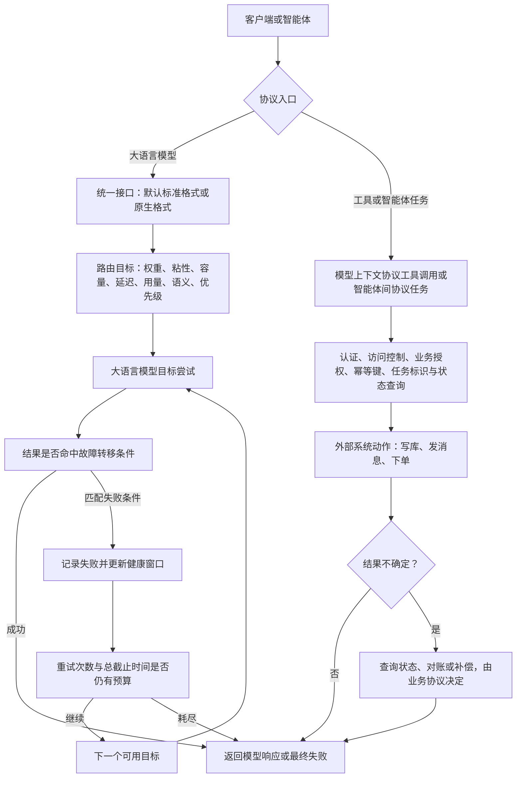

# 人工智能网关：把模型路由与副作用恢复分成两条控制链

一次模型请求超时后，换到另一个提供方也许只是多付一笔推理费；一次订票工具超时后，透明重放却可能订出两张票。两者都经过人工智能网关，不代表它们拥有相同的重试语义。

更可迁移的视角是先确定路由目标，再分类失败，最后把“可重复的模型推理”与“可能产生外部副作用的工具或智能体（Agent）任务”拆成两条恢复链。网关能选择目标、执行故障转移、隔离不健康目标并提供观测，但不能替业务协议推断一次写操作是否已经生效。

**证据范围**：本文以2026-07-23 为截断日期，官方文档源码固定到`Kong/developer.konghq.com@f144a33`。重点版本边界是网关3.10+ 的跨格式回退与新增路由能力、3.13+ 的人工智能负载均衡健康与断路器；这两项智能体协议仅用于说明协议边界，不反向回填到旧版本。

## 学习问题

1. 提供方无关的应用程序编程接口（Application Programming Interface，API）与原生提供方格式分别解耦了什么？
2. 七种路由算法优化的目标为何不能互相替代？
3. `failover_criteria`、`retries`、回退与优先级各自控制哪一步？
4. 3.13+ 的健康与断路器状态如何改变后续请求，而不是撤销已发生的调用？
5. 观测数据怎样区分目标选择、尝试次数、模型费用与最终结果？
6. 为什么模型上下文协议（Model Context Protocol，MCP）工具调用和智能体间协议（Agent2Agent Protocol，A2A）任务不能继承模型推理的透明重试策略？

## 一页摘要

**已证实事实**：人工智能代理高级模式（AI Proxy Advanced）可在一个插件配置中代理多个提供方与模型，并用负载均衡算法选择目标。默认 OpenAI 公司定义的格式会在网关内转换请求和响应；网关3.10+ 也可设置原生`llm_format`，此时保留对应提供方的原生格式，而不是提供跨提供方的统一载荷。

路由算法表达的是目标函数。权重轮询分配比例，一致性哈希保持粘性，最少连接偏向剩余容量，最低延迟偏向近期更快的目标。最低用量依据令牌或成本，语义路由匹配提示与模型描述，优先级则把正常路径与分层回退写成显式顺序。

失败处理是第二个决策。默认`failover_criteria`只有`error`与`timeout`；若要让429、5xx 或非幂等请求进入故障转移，必须显式配置。增加条件会提升恢复机会，也会增加重复推理、额外费用、尾延迟以及“不知道上游是否已处理”的不确定性。

下表回答每层控制能够承诺什么：

| 控制层| 主要输入| 直接决定| 不能承诺|
| --- | --- | --- | --- |
| 接口格式层| 路由类型、`llm_format` | 是否转换提供方请求与响应| 不保证不同模型语义等价|
| 路由算法| 权重、哈希、连接、延迟、用量、语义、优先级| 首个候选目标| 不判断业务副作用|
| 故障转移| 失败类别、超时、重试次数| 是否继续尝试目标| 不证明前一次未被处理|
| 断路器| 失败计数与时间窗| 暂时排除目标| 不撤销已产生的调用或费用|
| 观测层| 日志、指标、追踪记录| 还原提供方、模型、延迟、令牌、成本| 不自动建立端到端幂等|
| 模型上下文协议与智能体间协议业务层| 工具调用、任务标识、业务幂等键| 业务恢复与对账| 不应透明继承大语言模型重试|

核心判断是：高可用不是把`retries`调大，而是让每一种失败只触发它有权触发的恢复动作。

## 事实边界

**已证实事实**：人工智能代理高级模式插件最低版本为网关3.8，并属于人工智能网关企业版、需要人工智能许可证。本文讨论的跨不同接口格式回退、优先级以及按成本统计的最低用量策略以3.10+ 为边界；最少连接、人工智能负载均衡健康与断路器与语义路由同描述目标的回退以3.13+ 为边界。

默认的提供方无关路径采用标准化接口格式。3.10+ 原生格式模式会跳过载荷转换，并且只支持该格式对应的提供方与接口；因此“统一入口”不等于任意原生软件开发工具包（Software Development Kit，SDK）请求都能在不同提供方之间无损切换。

`failover_criteria`默认是连接错误和超时。官方配置允许加入403、404、429、500、502、503、504、无效响应头和非幂等条件；最后一项明确改变写请求的重试资格，必须按重复执行风险单独批准。

**个人分析**：模型对话请求通常没有传统数据库写入，但它仍可能计费、占用配额、生成不同答案或触发提供方侧日志。网关超时只说明没有按时获得响应，不证明提供方未执行；所以模型故障转移也需要尝试上限、总截止时间和重复费用观测。

  
证据：网关3.10+ 与3.13+ 的能力边界

  - **3.10+：** [AI 负载均衡文档](https://developer.konghq.com/ai-gateway/load-balancing/) 标出跨不同接口格式回退、优先级与最低用量的成本策略；[AI Proxy Advanced](https://developer.konghq.com/plugins/ai-proxy-advanced/) 说明原生`llm_format`从3.10+ 可用。
  - **3.13+：** 同一负载均衡文档标出最少连接、健康与断路器，以及语义路由中相同描述目标的回退行为。
  - **固定文档源码：** [`app/ai-gateway/load-balancing.md@f144a33`](https://github.com/Kong/developer.konghq.com/blob/f144a33379d5b599efaacf92642a2f9b41018fd6/app/ai-gateway/load-balancing.md)。
  - **证明边界：** 这些锚点证明文档在固定日期声明的最低版本，不证明所有3.10 系列和3.13 系列补丁都没有已知缺陷；生产部署仍应核对目标补丁版本的变更日志。

  
证据：高级模式插件与商业授权边界

  - **插件边界：** [AI Proxy Advanced 插件页](https://developer.konghq.com/plugins/ai-proxy-advanced/) 标注 `AI License Required`、最低网关 3.8，并明确插件仅属于人工智能网关企业版产品。
  - **能力边界：** 多提供方与模型目标与本文讨论的人工智能模型负载均衡由人工智能代理高级模式提供；基础 [AI Proxy](https://developer.konghq.com/plugins/ai-proxy/) 面向单个配置目标。
  - **官方仓库：** [`Kong/developer.konghq.com@f144a33`](https://github.com/Kong/developer.konghq.com/tree/f144a33379d5b599efaacf92642a2f9b41018fd6) 固定本文使用的公开文档源码。
  - **证明边界：** 公开文档和源码可验证产品声明，不能替代商业合同、订阅版本或法律意见；上线前须由组织确认有效授权。

## 架构图

先看一次请求在哪些位置改变控制所有者。重点检查客户端意图、网关策略与提供方执行是否落在不同层，以及业务恢复为何没有被画成模型响应之后的自动步骤。

图中的结论是：网关可以选择大语言模型目标并按失败分类调整选路，但不能替业务判断外部副作用是否安全重放。下面的 Mermaid 图表工具保留精确拓扑，并把大语言模型推理与两种智能体协议动作分开。

这张图的结论是：断路器影响下一次选路，不能回滚当前目标；业务对账处理“不知道是否成功”，不能被另一个目标的模型响应替代。

## 控制权与任务流

**说明性场景**：一个智能体先请求模型生成差旅方案，再调用 MCP 工具创建预订。模型路由使用优先级：主组为低成本模型，备用组为容量更充足的模型；`failover_criteria`允许连接错误、超时和429，重试次数与总截止时间均受限。

先检查一次上游失败如何进入分类、预算判断和下一目标，以及预算耗尽时是否有明确的失败出口。

这条路径只允许受次数和总截止时间约束的恢复；它不表示无限循环，也不证明第一次尝试没有执行或计费。

第一次推理在读取响应头前超时。该失败匹配条件，网关记录一次失败并选择仍可用的目标；若主组还有健康目标，优先级仍在主组内选择，只有该组不可用时才进入备用组。第二个模型返回成功，但两次尝试都可能已经计费，结果也不保证逐字一致。

智能体随后调用`create_booking`。人工智能模型上下文协议代理可以把工具调用映射为超文本传输协议（Hypertext Transfer Protocol，HTTP）请求，也能通过身份认证与访问控制列表控制发现和调用；它不因此获得“创建预订可透明重放”的业务知识。若上游在写入后断连，智能体应携带稳定幂等键查询既有结果，或进入对账与补偿流程，而不是让大语言模型故障转移策略重发工具调用。

如果请求改为智能体间协议的`message/send`，3.14+ 代理可记录任务标识、状态、延迟并重写智能体卡片的统一资源定位符（Uniform Resource Locator，URL），但官方明确它不管理任务状态，也不改变路由。恢复者应使用该协议的任务标识与状态接口判断继续、取消或重新提交。

该场景只组合官方文档支持的机制，不代表真实事故或生产指标。它揭示的架构边界是：模型目标的尝试历史属于网关，工具效果和智能体任务的事实状态属于外部系统。

## 关键源码导读

本文无法用公开`Kong/kong`仓库验证人工智能代理高级模式的商业插件内部实现。因此最短可靠路径是固定官方文档源码：先读算法与失败状态机，再读配置模式，最后读两种智能体协议的职责。公开材料足以验证配置契约，不足以推导未公开实现细节。

**已证实事实**：配置参考把`retries`定义为代理失败后的重试次数，默认值为5；故障转移条件默认是连接错误和超时。

`max_fails`默认为0，即关闭断路器。启用后，失败是否计数受故障转移条件影响，但403/404 不计入失败，连接错误、超时与无效头总会计入。

这组字段形成三个不同时间尺度：超时约束单次输入输出等待，重试限制一次客户端请求内的再次尝试，`max_fails`与`fail_timeout`改变跨请求目标可用性。把三者压成一个“重试策略”会隐藏控制状态和排障入口。

  
证据：失败分类与断路器配置契约

  - **配置参考：** [AI Proxy Advanced Configuration Reference](https://developer.konghq.com/plugins/ai-proxy-advanced/reference/) 列出`retries`、三类超时、`failover_criteria`、`max_fails`与`fail_timeout`的默认值、范围和允许值。
  - **行为说明：** [Load balancing with AI Proxy Advanced](https://developer.konghq.com/ai-gateway/load-balancing/) 解释默认错误与超时、重试与回退流程、失败总数而非连续失败的计数方式，以及所有目标不健康时返回 HTTP 500。
  - **兼容性：** [Data Plane version compatibility](https://developer.konghq.com/gateway/data-plane-version-compatibility/) 把3.10 以下使用`balancer.failover_criteria`标为不受支持。
  - **证明边界：** 配置契约证明声明行为和默认值，不证明特定提供方在半开连接、流式中断或自定义驱动下的所有边缘时序。

模型上下文协议的最短阅读路径是插件运行位置与转换流程。官方文档明确它处于该协议的客户端与服务端之间，不属于大语言模型请求流程，并禁止在同一服务与路由与其他人工智能插件共同配置；转换模式把工具调用映射为 HTTP 请求后再包装响应。

智能体间协议的最短阅读路径是透明代理声明。插件观测结构化数据、远程过程调用、表述性状态传递、任务状态和服务器推送事件，但不聚合响应、不管理任务状态、不修改普通请求路由。这证明协议可观测性不是工作流（Workflow）编排权。

## 架构决策与权衡

**决策问题一：选择 API 抽象层**

**已证实事实**：默认标准格式会转换提供方请求与响应；原生`llm_format`保留对应供应商的原生格式，并绑定该格式支持的提供方与接口。

**基于证据的推断**：标准格式让客户端与提供方 API 解耦，便于跨提供方回退；代价是只能使用网关支持映射的能力。原生格式保留供应商特性，却重新绑定对应提供方，迁移面和回退兼容性都要单独验证。

**决策问题二：按业务目标选择算法**

**已证实事实**：权重轮询表达计划比例，一致性哈希提供会话或缓存粘性，最少连接反映在途容量。最低延迟策略优化响应速度，最低用量策略依据令牌或成本，语义路由选择领域能力，优先级表达确定的服务层级。

**决策问题三：确定哪些失败进入重试**

**已证实事实**：`failover_criteria`默认包含连接错误和超时，也可显式加入 HTTP 状态码与非幂等条件；`retries`决定代理失败后的再次尝试次数。

**基于证据的推断**：这些目标可能冲突。最低延迟不等于最低成本，最低用量不等于最好质量，粘性也会牺牲全局均衡；生产配置应为主目标与降级目标分别设验收条件。

连接错误和读取响应头超时属于传输不确定性；429 常表示容量或配额；500/502/503/504 代表不同上游失败。把它们全部加入故障转移可能提高成功率，却会放大调用、费用和尾延迟。

**决策问题四：组合优先级与断路器**

**已证实事实**：优先级给出组间顺序，断路器把近期失败的目标暂时移出候选集。所有目标同时不健康时，文档声明请求失败为 HTTP 500，而不是绕过健康状态继续发送。

**个人分析**：组合两者的代价是每个数据平面的观测窗口、失败阈值和恢复探测都需要验证。模型推理与工具执行还应建立不同重试入口：模型层可以接受受限的重复生成；工具层只有在端到端幂等键、状态查询或补偿协议存在时才能恢复。网关不应替业务拥有这项判断。

## 生产化分析

**个人分析**：失败预算应同时限制尝试次数与墙钟时间。`retries`、连接与读与写超时、客户端截止时间必须联合计算，否则多个慢目标会把一次请求拖成长尾；流式响应已经向客户端发送字节后，还要验证是否具备再次尝试的合法边界。

**已证实事实**：3.13+ 的断路器按总失败数而非连续失败数计数。超时窗口内夹着一次成功不会清零；只有最后失败后的`fail_timeout`已过，随后一次成功才会清零并恢复健康。

**基于证据的推断**：断路器验收不能套用“成功一次立即闭合”的常见假设，而应覆盖上述窗口与清零条件。

**已证实事实**：人工智能日志可包含提供方、请求与响应模型、令牌、延迟与成本；启用载荷日志还会把正文带入日志或追踪记录。官方监控指南说明人工智能指标默认关闭，以避免高基数与性能问题；启用需要监控插件的`ai_metrics`和人工智能代理高级模式的`log_statistics`。

人工智能 A2A 代理3.14+ 是透明观测与控制层，可以记录任务标识与状态，但不拥有任务状态。

**个人分析**：观测应能回答四个问题：客户端请求是什么、算法选择了哪个目标、每次尝试为何结束、最终返回和累计成本是什么。载荷日志需要脱敏、访问控制与保留策略；指标只能证明网关观察到的流量，提供方账单仍需独立对账。

  
证据：大语言模型、MCP 与 A2A 的观测字段

  - **大语言模型日志：** [AI Gateway audit log reference](https://developer.konghq.com/ai-gateway/ai-audit-log-reference/) 列出请求与响应模型、提供方、令牌、成本、大语言模型时延与可选载荷字段。
  - **大语言模型指标：** [Monitor AI LLM metrics](https://developer.konghq.com/ai-gateway/monitor-ai-llm-metrics/) 说明人工智能指标默认关闭、启用条件与高基数风险。
  - **协议指标：** [Gen AI OpenTelemetry metrics](https://developer.konghq.com/ai-gateway/ai-otel-metrics/) 区分生成式人工智能与两种智能体协议的指标开关；智能体间协议日志还包含任务状态、任务标识、首字节时间和服务器推送事件数。
  - **证明边界：** 这些字段支持网关侧诊断与计费对账，不证明上游提供方或工具系统已采用相同请求标识，也不自动建立恰好一次。

最后检查路由成功之后仍有哪些问题留在网关边界之外：调用授权、重复费用，以及外部动作是否已经生效。

路由韧性不能抹去这些边界。认证与访问控制列表决定谁能调用，尝试观测帮助核对重复费用；幂等键、状态查询与补偿流程才处理可能重复的业务副作用。

[路由与模型分派](/patterns/agt-p-05)把策略门、候选健康、选择结果和回退责任整理为通用分发合同；本案例中的网关机制只验证流量路由接缝，不证明任务语义或恢复结果正确。

**个人分析**：MCP 工具应按副作用等级分组。纯查询可在确定未返回结果时有限重试；带幂等键的写入先查状态再重放；无法去重的支付、消息、资源创建等动作进入人工或补偿流程。访问控制列表解决谁能调用，不解决调用是否能重复。

[生产事故响应智能体参考设计](/cases/production-incident-response-agent)把路由之后的只读诊断、人工批准、变更执行和恢复验证分成不同权威；它用于综合边界，不表示 Kong AI Gateway 实现了该事故响应拓扑。

A2A 生产链必须保留任务标识、上下文标识与状态变化。重试`message/send`前应先查询或关联既有任务，取消也必须由智能体与业务端确认结果。

## 可迁移经验

### 可直接复用的机制

1. 把 API 格式适配、目标选择、失败分类、再次尝试和跨请求健康状态拆成独立控制层。
2. 为路由算法写明唯一主目标，并用另外的机制处理成本、容量、延迟或粘性冲突。
3. 默认只让窄失败集合触发故障转移；扩大集合时记录理由、重复成本与最坏墙钟时间。
4. 用优先级表达服务层级，用断路器隔离近期失败目标，不把二者混为同一种回退。
5. 为每次客户端请求保留尝试级提供方、模型、原因、延迟、令牌和费用关联。
6. 把工具幂等键、A2A 任务标识、状态查询和补偿协议放在网关路由之外显式设计。

### 只能有限类比的部分

1. 大语言模型生成通常可接受语义不同的第二次答案；外部工具写入可能要求严格去重或顺序。
2. 与提供方无关的 API 解耦载荷形状，不保证模型质量、参数、内容政策与错误语义等价。
3. 最少连接观察在途请求，不能直接代表令牌工作量、图形处理器队列或提供方配额。
4. 最低时延策略的指数加权移动平均值是历史观测，不是未来请求的延迟保证，也不适合所有长连接。
5. 断路器隔离目标的近期失败，不能替代区域级容灾、提供方账户隔离或账单核对。
6. MCP、A2A 可复用网关的认证、限流和观测，但各自的状态与恢复协议仍属于上游系统。

### 不应照搬的部分

1. 不要把所有429 和5xx 无条件加入故障转移，也不要把默认`retries: 5`当成生产推荐值。
2. 不要在未证明重复安全时启用`non_idempotent`，尤其不能透明重放支付、消息、资源创建或审批。
3. 不要把模型成功响应当作先前超时尝试未计费、未记录或未生成的证明。
4. 不要宣称最低延迟、最低用量、语义匹配和最高优先级能由一个算法同时优化。
5. 不要把3.10+ 的跨格式回退与原生`llm_format`混为“任意提供方原生 API 可互换”。
6. 不要把3.13+ 健康与断路器能力写成3.8 插件基线，也不要忽略`max_fails: 0`默认关闭。
7. 不要把 MCP 访问控制列表或 A2A 透明代理解释为端到端幂等、任务编排或恰好一次。
8. 不要在缺少有效人工智能网关企业版授权时把人工智能代理高级模式当作开源基础插件部署。

## 来源

**官方架构与产品文档（已证实事实）**

- [Kong AI Gateway](https://developer.konghq.com/ai-gateway/)：统一接口、提供方无关路由、治理与观测能力。访问与截断日期：2026-07-23。
- [Load balancing with AI Proxy Advanced](https://developer.konghq.com/ai-gateway/load-balancing/)：七种算法、重试与回退、版本兼容与3.13+ 断路器。访问与截断日期：2026-07-23。
- [AI Proxy Advanced](https://developer.konghq.com/plugins/ai-proxy-advanced/) 及其[配置参考](https://developer.konghq.com/plugins/ai-proxy-advanced/reference/)：格式转换、原生格式、商业许可、字段默认值与失败条件。访问与截断日期：2026-07-23。
- [Data Plane version compatibility](https://developer.konghq.com/gateway/data-plane-version-compatibility/)：3.10 以下对`failover_criteria`与成本令牌策略的兼容告警。访问与截断日期：2026-07-23。

**官方协议与观测文档（已证实事实）**

- [AI Gateway audit log reference](https://developer.konghq.com/ai-gateway/ai-audit-log-reference/) 与 [Monitor AI LLM metrics](https://developer.konghq.com/ai-gateway/monitor-ai-llm-metrics/)：大语言模型日志、令牌与费用与延迟字段、指标启用与高基数边界。访问与截断日期：2026-07-23。
- [AI MCP Proxy](https://developer.konghq.com/plugins/ai-mcp-proxy/)：3.12+ 请求链、超文本传输协议转换、3.13+ 访问控制列表与不属于大语言模型请求流程的边界。访问与截断日期：2026-07-23。
- [AI A2A Proxy](https://developer.konghq.com/plugins/ai-a2a-proxy/)：3.14+ 透明代理、智能体卡片重写、任务观测与不管理任务状态的边界。访问与截断日期：2026-07-23。

**固定官方文档源码（已证实事实）**

- [`Kong/developer.konghq.com@f144a33`](https://github.com/Kong/developer.konghq.com/tree/f144a33379d5b599efaacf92642a2f9b41018fd6)：本文在2026-07-23 使用的不可变文档源码锚点。
- [`app/ai-gateway/load-balancing.md`](https://github.com/Kong/developer.konghq.com/blob/f144a33379d5b599efaacf92642a2f9b41018fd6/app/ai-gateway/load-balancing.md)：算法、失败处理、版本兼容和断路器说明的固定入口。
- [`app/_kong_plugins/ai-mcp-proxy/index.md`](https://github.com/Kong/developer.konghq.com/blob/f144a33379d5b599efaacf92642a2f9b41018fd6/app/_kong_plugins/ai-mcp-proxy/index.md)：MCP 插件运行位置、转换模式、访问控制列表与支持范围。
- [`app/_kong_plugins/ai-a2a-proxy/index.md`](https://github.com/Kong/developer.konghq.com/blob/f144a33379d5b599efaacf92642a2f9b41018fd6/app/_kong_plugins/ai-a2a-proxy/index.md)：A2A 透明代理、观测阶段与任务状态边界。

**证据边界说明**：`已证实事实`来自该产品的官方文档及其固定官方仓库；`基于证据的推断`用于从机制推出适用性、目标冲突与失败分类；`个人分析`用于提出重试预算、观测治理和两种智能体协议的恢复建议。本文没有虚构客户、事故、指标、源码实现或生产保证，也不把模型故障转移扩展成工具或智能体任务的透明重放。
