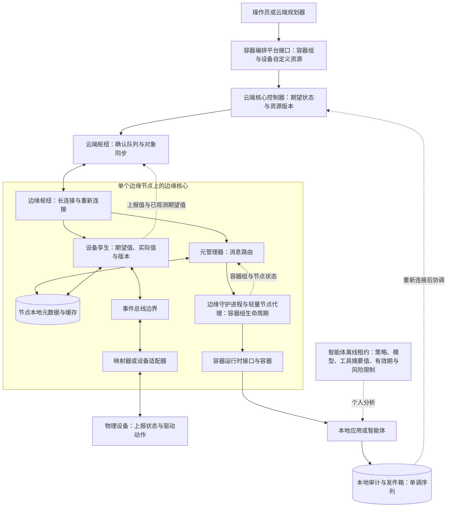

# 云边自治：在断网边界上划分规划权与执行权

云边连接消失时，真正的问题不是“进程还能不能跑”，而是边缘还被授权做什么。KubeEdge 能让已下发工作负载和节点局部状态继续工作，却不会把云端控制权完整复制到现场；新凭证、跨节点协调、集中审批和未缓存依赖仍可能停住。

KubeEdge 把容器编排平台期望和设备配置留在云端规划，把已下发工作负载、局部元数据、设备交互和运行健康留在边缘执行。恢复连接后，云端枢纽与边缘枢纽通过资源版本、确认消息、状态上报和同步控制器继续协调，而不是简单让最后到达的状态覆盖一切。

本文依据 KubeEdge 文档固定在 v1.20.0。迁移到物理智能体时，云边智能体离线自治必须有明确授权、风险预算、过期和回滚边界；离线权限租约、审计发件箱、反回滚和人工接管均标为应用设计，不冒充平台内建能力。

## 学习问题

1. 云端核心、云端枢纽、边缘枢纽与边缘核心分别拥有规划、传输和本地执行链中的哪一段？
2. 元管理器的 SQLite 数据库元数据能支撑哪些断网行为，为什么它不是容器编排平台 API 服务端或完整权威数据库？
3. 边缘守护进程如何从本地容器组元数据恢复并经容器运行时接口管理工作负载，设备孪生又如何把期望状态与上报值映射为期望值与实际值？
4. 云端枢纽的确认回执、对象同步资源版本、边缘枢纽重连和本地状态上报如何协作，哪些消息仍可能重复、迟到或丢失？
5. 物理智能体的离线权限租约应怎样绑定策略、模型、工具、设备身份、时钟和风险等级？
6. 重连后怎样防止旧边缘结果覆盖新云端意图，并在冲突、回滚或无法判断时转人工？

## 一页摘要

**已证实事实**：云端核心以容器编排平台接口与控制器形成规划入口，云端枢纽承担云边消息中介。边缘枢纽通过网页套接字或快速互联网连接协议路由资源更新并上报节点、容器组和设备状态；读写或保活失败后，它关闭旧客户端、发布已断开状态并重连。

**已证实事实**：元管理器把节点元数据写入 SQLite 数据库，边缘守护进程启动时查询本地容器组并经容器运行时接口管理容器。断网后只可使用此前已同步且仍适用的容器组、配置映射、机密对象等数据。SQLite 数据库是节点局部缓存，不是容器编排平台 API 服务端，也不承诺跨节点事务或任意离线创建资源。

**已证实事实**：设备自定义资源定义用`desired`表达云端意图，以`reported`表达设备报告，并用`observedDesired`表示映射器已观察到的期望；边缘核心内部仍使用`expected/actual`。云端枢纽确认回执只证明需确认资源已在元管理器落地，否定确认回执消息可丢；设备孪生也没有完整离线发件箱。重连不等于恰好一次或语义冲突自动解决。

**基于证据的推断**：智能体平台可把云端定义为策略与模型与工具包签发者，把边缘定义为受租约约束的执行者。每个离线动作绑定`lease_id`、策略和制品版本、设备身份、风险与预算；结果进入仅追加审计记录与发件箱。重连后先对账再接单，迟到结果不能直接覆盖新意图。

| 关键决策| 推荐默认| 边界与退出信号|
| --- | --- | --- |
| 云边权威| 云端签发期望、策略与版本；边缘只执行已缓存且未过期的授权| 需要新资源、新机密对象、跨节点协调或集中审批时暂停|
| 离线工作负载| 维持已有容器组、探针、重启与本地设备闭环| 镜像与卷与配置未准备、依赖云 API 或资源压力失控时降级|
| 设备状态| 期望状态与上报值分离，命令与观测带版本和时间| 上报值未证明命令唯一执行；危险设备动作需外部安全联锁|
| 重连| 版本比较、确认回执、状态快照、发件箱协调| 冲突不可自动判定、效果不可逆或审计缺口时人工接管|
| 缓存定位| SQLite 数据库是节点局部元数据与缓存| 不作全局真相、审计总账或跨节点事务数据库|

## 事实边界

本文于**2026-07-22** 选择稳定发布 **KubeEdge v1.20.0**。架构与组件语义只采用发布-1.20 文档和同一标签的源码，不把默认官网或后续分支语义倒灌到结论中。

  
证据：v1.20.0 标签、提交与文档截断

- **固定标签：** [`v1.20.0`](https://github.com/kubeedge/kubeedge/releases/tag/v1.20.0)。
- **完整提交：** `git ls-remote`与本地精确拉取均解析为 [`bae61505d4919c404665f70347ad0646aaa98958`](https://github.com/kubeedge/kubeedge/tree/bae61505d4919c404665f70347ad0646aaa98958)。
- **提交信息：** 2025-01-21 12:40:26 协调世界时，更新 v1.20.0 版本；官方发布博客同样记录 v1.20 于2025-01-21 发布。
- **文档范围：** 只使用 [`release-1-20.docs.kubeedge.io`](https://release-1-20.docs.kubeedge.io/docs/)；默认官网和`release-1.20`分支后续修复不在本文范围。
- **边界：** 这些锚点固定版本语义，不证明迁移设计中的智能体租约、发件箱或反回滚是 KubeEdge API。

**已证实事实**：v1.20 设备 API 源码明确区分 `desired`、`reported` 与 `observedDesired`；边缘核心内部设备孪生仍沿用 `expected/actual` 命名。本文在谈容器编排平台自定义资源定义时使用期望状态与上报值，在谈边缘核心内部消息和 SQLite 数据库时使用期望值与实际值，避免把两个层次误写成同一字段。

**边界。已证实事实**：云端枢纽分派器的确认回执说明只覆盖需要确认的资源消息，并以元管理器成功存储为确认点；否定确认回执路径允许丢失，设备孪生成功点尚有待实现。由此不能承诺任意云边消息、设备命令或物理副作用恰好一次，也不能把孪生版本当作通用事务序号。

**个人分析**：本案例把“离线智能体权限租约、模型与工具包、风险分级、审计发件箱、人工接管和反回滚”作为迁移设计。这些都不是 KubeEdge v1.20.0 开箱即用的 API；实现者必须另建签名、持久化、设备安全和治理机制。

## 架构图

先看规划权与执行权在哪里分开：云端持有期望状态和版本，边缘只持有运行现有工作负载、读取节点缓存与驱动本地设备所需的状态。断网并不会把这条边界消除，只会迫使系统依据预先授权进入降级模式。

文字等价描述：云端操作员通过容器编排平台接口修改容器组或设备自定义资源定义；云端核心控制器产生面向节点的期望状态，云端枢纽经长连接把消息送到边缘枢纽。

边缘核心内元管理器持久化节点局部元数据，边缘守护进程经容器运行时接口运行容器；设备孪生保存期望值与实际值，事件总线或设备管理接口边界把它交给映射器，映射器才与物理设备交互。

断网时云边虚线被切断，已运行应用只可依据未过期权限租约和本地缓存执行，并写本地发件箱。重连后先上报和协调，不直接把离线结果当成云端新真相。

## 控制权与任务流

**说明性场景**：一个边缘智能体在断网期间依据未过期租约执行低风险设备调整，同时云端产生了新的期望状态。场景只用于追踪已证实的云边机制和明确标注的应用层恢复设计，不是 KubeEdge 官方事故。

1. **云端规划。** 容器编排平台 API 保存容器组、设备和相关期望；边缘控制器与设备控制器根据目标节点与资源版本生成下行消息。设备`spec.properties[].desired`是设备控制意图，`status.twins[].reported`是观测结果，两者不能互换。

2. **云端枢纽下发。** 云端枢纽把消息按节点标识放入节点队列。需要确认回执的资源消息必须带资源版本；边缘核心成功存入元管理器后确认，超时会重试。集群对象同步资源（ClusterObjectSync）保存成功点，同步控制器周期比较云端对象版本，形成后续协调。

3. **边缘枢纽接收。** 边缘枢纽从长连接收取消息并按组路由到元管理器、设备孪生或事件总线。读、写或心跳错误会触发断开；连接状态广播给元数据、孪生和总线组，随后等待恰好两个心跳周期再重连。因此恢复延迟受心跳配置约束，不能把断线重连视为即时切换。

4. **元数据落地。** 元管理器先把插入、更新、删除与响应写入节点本地数据库，再通知边缘守护进程或设备孪生。边缘守护进程查询容器组、配置映射、机密对象等时，在线且资源类型要求远端查询才会请求云端；断网或不需远端时读取本地数据库。

5. **工作负载执行。** 边缘守护进程启动后从元管理器查询本地容器组列表，向轻量节点代理提交`SET`，并通过容器运行时接口管理容器、探针和容器组生命周期。它能维持已有工作负载，不代表能在离线时完成新的调度、镜像拉取、存储挂载、机密对象获取或跨节点编排。

6. **设备闭环。** 云端期望状态下发后，边缘核心内部转换为设备孪生期望值；映射器接收并对物理设备执行，采集实际值，再上报为自定义资源定义上报值，并回写已观测期望值表明本轮已观察的期望。设备孪生数据库保存当前孪生与版本并生成差量，但物理效果是否发生仍要由映射器、设备回执与安全传感器验证。

7. **断网继续。** 边缘枢纽标记已断开后，本地边缘守护进程、容器运行时接口、设备孪生、映射器和应用进程可以继续运行；本地查询使用已有元数据。云端新意图到不了现场，边缘新状态也暂时上不去。任何依赖云 API、在线授权、远程机密对象或跨站点共识的动作必须失败关闭或进入降级模式。

8. **重连协调。** 边缘枢纽新建连接并广播已连接；需要确认回执的资源继续按版本同步。边缘守护进程与轻量节点代理周期生成容器组状态，并经元管理器上报云端。设备孪生从已断开变为已连接时会请求成员关系详情；后续显式孪生同步或新的设备报告可更新云端上报值与已观测期望值，但断网期间被跳过的所有发云消息不会自动变成完整重放日志。重复和迟到消息必须按资源与孪生与业务版本判定，不能按到达顺序覆盖。

9. **冲突处理。** 若断网期间云端期望状态已改变，而边缘发件箱记录了旧授权下的结果，先保留两者：云端意图是当前规划候选，边缘记录是已发生事实候选。可逆低风险动作按策略重算；不可逆或无法证明的动作冻结并转人工，禁止盲重放。

**基于证据的推断**：对于智能体，云端下发的不是一条无限期“自主运行”开关，而是一个可验证包：`lease_id`、`policy_version`、`model_digest`、`tool_digest`、`device_set`、`risk_ceiling`、`not_before`、`expires_at`、`max_offline_duration`、预算和撤销纪元。边缘只接受签名有效、版本不降级、设备身份匹配且仍在时间窗内的包。

**个人分析**：每次本地动作先写仅追加审计记录与发件箱，再调用工具或设备，随后追加回执，不原地改写历史。记录至少包含单调序号、启动标识、墙钟时钟、单调时钟已用时间、输入与输出哈希值、策略判定、模型与工具版本、设备证书指纹、效果分类与操作者。

这个发件箱是应用设计，不应假装成元管理器缓存或设备孪生孪生表。

## 关键源码导读

最短源码路径沿一条消息走：边缘枢纽处理连接，云端枢纽分派器和同步控制器确认可重试资源，元管理器与边缘守护进程负责节点缓存与容器组恢复，设备 API 与设备孪生区分期望和观测。它能证明基础同步与恢复接缝，不能证明物理副作用恰好一次。

本节只解释 KubeEdge v1.20.0 固定快照。发布范围决定组件、字段与重连语义，后续分支修复不倒灌到本文结论。

  
证据：连接、资源同步、本地缓存与设备状态源码

- **固定提交：** [`kubeedge/kubeedge@bae61505d4919c404665f70347ad0646aaa98958`](https://github.com/kubeedge/kubeedge/tree/bae61505d4919c404665f70347ad0646aaa98958)，标签`v1.20.0`。

| 固定源码| 可观察事实| 支持的结论| 不支持的结论|
| --- | --- | --- | --- |
| [`edgehub.go`](https://github.com/kubeedge/kubeedge/blob/bae61505d4919c404665f70347ad0646aaa98958/edge/pkg/edgehub/edgehub.go) 与 [`process.go`](https://github.com/kubeedge/kubeedge/blob/bae61505d4919c404665f70347ad0646aaa98958/edge/pkg/edgehub/process.go) | 客户端初始化后广播已连接；读写与保活错误触发重新连接；断开广播给元数据、孪生和总线组| 连接状态显式化与自动重连| 断网消息零丢失、零重复或语义冲突自动解决|
| [`certmanager.go`](https://github.com/kubeedge/kubeedge/blob/bae61505d4919c404665f70347ad0646aaa98958/edge/pkg/edgehub/certificate/certmanager.go) | 本地加载 X.509 密钥对；缺失时以令牌申请；可在证书生命周期约70%–90% 抖动窗口轮换并重连| 节点证书和轮换有实现接缝| 业务设备身份、智能体工具凭证或离线撤销自动覆盖|
| [`message_dispatcher.go`](https://github.com/kubeedge/kubeedge/blob/bae61505d4919c404665f70347ad0646aaa98958/cloud/pkg/cloudhub/dispatcher/message_dispatcher.go) 与 [`node_session.go`](https://github.com/kubeedge/kubeedge/blob/bae61505d4919c404665f70347ad0646aaa98958/cloud/pkg/cloudhub/session/node_session.go) | 确认回执在元管理器存储后返回；超时重试；否定确认回执可丢；资源版本成功点写对象同步| 资源消息可确认、去除旧版本并重试| 所有消息与设备效果恰好一次，或队列本身是业务审计日志|
| [`synccontroller.go`](https://github.com/kubeedge/kubeedge/blob/bae61505d4919c404665f70347ad0646aaa98958/cloud/pkg/synccontroller/synccontroller.go) | 周期比较对象同步中已下发版本与容器编排平台当前对象，生成同步事件| 重连后的资源收敛有版本化控制循环| 多资源原子事务或应用级冲突自动合并|
| [`metamanager/process.go`](https://github.com/kubeedge/kubeedge/blob/bae61505d4919c404665f70347ad0646aaa98958/edge/pkg/metamanager/process.go) 与 [`dao/meta.go`](https://github.com/kubeedge/kubeedge/blob/bae61505d4919c404665f70347ad0646aaa98958/edge/pkg/metamanager/dao/meta.go) | 元数据以密钥与类型和值写入节点本地数据库；在线时部分查询走云端，否则查本地| 节点局部元数据与缓存支撑恢复和离线读| 容器编排平台全量权威副本、任意离线写或跨节点事务|
| [`edged.go`](https://github.com/kubeedge/kubeedge/blob/bae61505d4919c404665f70347ad0646aaa98958/edge/pkg/edged/edged.go) | 启动时查询本地容器组列表并向轻量节点代理提交；容器编排客户端桥接指向元数据客户端| 已同步容器组可从本地元数据恢复并由容器运行时接口管理| 未缓存依赖、云端调度或任意控制命令离线可用|
| [`device_instance_types.go`](https://github.com/kubeedge/kubeedge/blob/bae61505d4919c404665f70347ad0646aaa98958/staging/src/github.com/kubeedge/api/apis/devices/v1beta1/device_instance_types.go) | `desired`在规范属性；`reported/observedDesired`在状态；注释明确映射器执行设备命令| 云端意图、映射器观察和设备报告分离| 上报值等于命令只执行一次，或设备孪生直接驱动物理设备|
| [`twin.go`](https://github.com/kubeedge/kubeedge/blob/bae61505d4919c404665f70347ad0646aaa98958/edge/pkg/devicetwin/dtmanager/twin.go)、[`communicate.go`](https://github.com/kubeedge/kubeedge/blob/bae61505d4919c404665f70347ad0646aaa98958/edge/pkg/devicetwin/dtmanager/communicate.go) 与 [`types.go`](https://github.com/kubeedge/kubeedge/blob/bae61505d4919c404665f70347ad0646aaa98958/edge/pkg/devicetwin/dttype/types.go) | 期望值与实际值有云端与边缘端版本；更新写入 SQLite 数据库事务，失败时从 SQLite 数据库恢复上下文；断网跳过发云，重连请求成员关系详情| 孪生有局部版本、持久化恢复和连接生命周期反应| 孪生是不可变事务日志、通用发件箱、全量离线重放或物理副作用证明|
| [`downstream.go`](https://github.com/kubeedge/kubeedge/blob/bae61505d4919c404665f70347ad0646aaa98958/cloud/pkg/devicecontroller/controller/downstream.go) 与 [`upstream.go`](https://github.com/kubeedge/kubeedge/blob/bae61505d4919c404665f70347ad0646aaa98958/cloud/pkg/devicecontroller/controller/upstream.go) | 规范变化下发设备消息；实际值映射上报值，期望值映射已观测期望值并补丁状态| 期望状态下行、上报值上行的完整控制链| 业务安全、设备联锁和冲突政策由设备控制器自动决定|

**边界：** 本卡证明连接、节点元数据、资源版本和孪生数据流，不证明设备动作唯一执行，也不证明智能体离线授权、审计或业务冲突裁决。

## 架构决策与权衡

**个人分析**：KubeEdge 给出了通信、缓存和期望状态与上报值原语；智能体离线权限必须在它们之上另加一个明确的权限主体租约。推荐采用以下签名合同：

| 租约字段| 必需控制| 拒绝条件|
| --- | --- | --- |
| 身份与范围| `tenant/site/node/agent/device_set`，绑定节点证书和设备证书指纹| 节点、设备或租户不匹配；证书无效或已知撤销|
| 策略| 不可变`policy_version`、签名者、撤销纪元、允许与禁止动作| 未知签名者、旧纪元、策略缺失或版本回退|
| 模型与工具| 模型与工具摘要值、提示词与模式版本、工具允许列表和参数约束| 本地制品摘要值不符、工具超范围、模式不兼容|
| 时间| `not_before/expires_at/max_offline_duration`，同时记录墙钟与单调时钟已用时间| 时钟回拨超阈值、启动后无可信时间锚、任一截止已过|
| 风险与预算| 风险上限、次数、能耗、令牌、速率、并发和累计物理位移与温度等预算| 单次或累计预算超限；观测与联锁不可用|
| 恢复| 取代、最低已接受版本版本、回滚目标、恢复规程| 包降到最低版本以下；回滚目标未签名或状态不兼容|

**基于证据的推断**：时钟不能只信任设备墙钟。在线时保存签名时间锚和本地单调起点；离线时以“签名截止时间”和“自最后在线起单调经过时长”两者更早者过期。重启导致单调纪元变化、实时时钟明显倒退或时间不确定时，高风险租约立即失效，低风险只进入更窄的保守模式。

| 风险级别| 离线允许| 离线禁止| 过期行为|
| --- | --- | --- | --- |
| 零级观察| 读取本地传感器、健康检查、缓存推理、写审计| 修改设备、外发敏感数据、改变安全配置| 可保留只读与本地告警|
| 一级可逆局部| 限速启停非关键任务、调整可回滚参数、重启已批准容器| 新增权限、下载未知制品、跨设备协调| 停止新动作，维持安全状态|
| 二级受控物理| 在硬联锁、双重传感器、幅度与次数预算内执行签名动作| 越过安全包络、禁用联锁、无人批准的批量动作| 立即进入设备定义的故障安全（Fail Safe）|
| 三级不可逆与高影响| 无；只允许完成已进入的安全停止序列| 固件刷写、密钥轮换、永久删除、付款、危险运动、策略自修改| 冻结、告警、等待人工或云端批准|

**个人分析**：回滚也必须受策略控制。包包含单调`security_epoch`与`minimum_accepted_version`；边缘保存最高已接受值和签名回执。普通回滚只能切到预先批准、模式兼容、漏洞状态可接受的版本，不能覆盖更高安全纪元。若旧模型与工具会误读新状态，先排空任务并运行显式状态迁移；无法安全降级时采用前向修复，而不是强制回滚。

**个人分析**：重连协调按四步执行：上传仅追加发件箱与本地状态快照；下载当前云端策略、模型、工具与期望状态；按`operation_id + device + base_version`去重并分类为已接受、陈旧、冲突或效果未知；最后才开放新任务。云端期望状态与已发生物理事实冲突时不能“最后写入者胜”，应由设备安全规则决定补偿、保持、隔离或人工接管。

## 生产化分析

生产设计的首要检查是：网络断开、租约过期或本地状态不可信时，边缘是否会自动缩权。节点身份、设备身份、策略版本、物理安全包络和审计容量必须分别可观测；“容器组仍在运行”不是继续执行高风险动作的充分条件。

  
证据：离线权限、设备安全与重连恢复清单

| 生产维度| 最小控制| 关键观测| 故障与恢复|
| --- | --- | --- | --- |
| 安全与设备身份| 边缘枢纽双向传输层安全；每设备独立身份与证书；租约绑定站点与节点与设备；工具调用点再授权| 证书指纹、签发方、到期、拒绝原因、异常设备切换| 隔离未知设备；撤销纪元；无法在线查撤销时缩短高风险离线期|
| 证书与密钥轮换| KubeEdge 节点证书按配置轮换；设备与智能体密钥独立轮换；私钥硬件保护| 生效时间、证书失效时间、轮换失败、重连次数、旧密钥使用| 提前轮换并保留短重叠窗；禁止永久回退到旧密钥|
| 离线权限| 签名租约、风险上限、动作允许列表、显式拒绝、可信时间锚| 剩余租期、离线时长、时钟偏移、预算消耗| 到期故障安全；时间不确定降权；三级动作永不离线授权|
| 模型与工具与策略版本| 内容摘要值、兼容矩阵、最小版本、双槽制品、签名清单| 当前与目标与上次良好版本、加载与评估结果、反回滚拒绝| 先金丝雀实例后切换；失败回上次良好；安全纪元禁止降级|
| 本地元数据| 节点本地数据库完整性检查、容量上限、备份与重建路径；缓存与权威标签分开| 数据库大小、时延与错误、资源版本、缓存时长、未命中| 损坏时停止依赖该状态的动作；从云端重建，不伪造全量真相|
| 设备执行安全| 映射器允许列表、参数包络、速率与幅度限额、硬联锁、双传感器确认| 命令与回执、期望状态与上报值差异、联锁状态、设备健康| 立即停止与隔离；未知效果转人工；不可盲重放命令|
| 资源限额| 处理器、内存、磁盘与进程标识配额，容器和模型并发，以及令牌、能耗、网络与发件箱配额| 压力、内存耗尽、磁盘占满、队列时长、拒绝率、发件箱水位| 背压与任务降级；保留安全控制与审计写入预算|
| 本地审计与发件箱| 仅追加、哈希值链、单调序号、启动标识、加密、幂等操作标识| 缺号、哈希值不匹配、未确认时长、未知效果数| 停止高风险动作；分批上传；云端回执后再归档|
| 重连协调| 确认回执、资源版本与智能体基础版本；先对账后接单；限制重放速率| 重新连接时长、重复、陈旧、冲突、同步滞后量| 冲突隔离；补偿或人工；对账完成前保持离线风险上限|
| 可观测性| 云边分开服务等级目标；本地持久指标与日志与追踪记录；统一节点与任务与设备与租约与版本| 心跳、连接状态、容器组与孪生同步、动作延迟、拒绝和人工接管| 断网缓冲并控制基数；恢复后有界上传，避免挤占控制通道|
| 故障恢复| 已同步容器组本地恢复；安全状态机；数据库与发件箱恢复演练；灾难运行手册| 重启、容器运行时接口与映射器错误、损坏、恢复点、演练结果| 优先物理安全；重建缓存；核对实际设备后恢复自动化|

**边界：** 表中的租约、设备级身份、哈希链发件箱、模型与工具摘要值、风险分级和人工接管是应用层治理，不是 KubeEdge v1.20.0 内建 API。

**安全。已证实事实**：v1.20 边缘枢纽证书管理器加载节点 X.509 证书与密钥，首次缺失时用令牌获取证书颁发机构与边缘证书，开启轮换后在证书生命周期约70%–90% 的抖动点申请新证书，并让边缘枢纽重连使用新材料。这是节点到云端核心的身份链，不是每台物理设备或每个智能体工具的自动身份。

**安全。个人分析**：设备身份应独立于节点身份，最好由安全元件保护私钥；映射器建立会话时验证设备证书或硬件标识，并把设备指纹写入每条命令回执。

工具凭证按动作即时派生、短期有效且不进入模型提示词、节点本地数据库元数据或普通日志。断网撤销天然有传播延迟，所以高风险证书和租约必须更短，并配本地拒绝列表与纪元。

**容量与恢复。个人分析**：磁盘接近满载时，优先保留安全事件、租约、发件箱和最小运行元数据，停止模型缓存扩张与低价值遥测。恢复测试要覆盖云端枢纽不可达、边缘核心重启、节点本地数据库损坏、容器运行时接口重启、映射器断连、设备上报值停滞、证书轮换失败和发件箱重复上传；“容器组还在跑”不等于物理流程安全。

**可观测性。基于证据的推断**：KubeEdge 的连接、资源版本、容器组状态和孪生版本只能说明基础同步状态。

智能体还要记录`lease_id/policy/model/tool/security_epoch`、离线时长、风险类、操作标识、设备回执、基础与结果版本、时钟不确定性和人工接管原因，才能解释为什么一个离线动作被允许以及重连后如何裁决。

## 可迁移经验

### 可直接复用的机制

- **规划权与执行权分层**：云端管理期望状态、策略和版本；边缘保存足够的本地元数据并运行既有执行器，不让短暂网络中断直接停止现场。
- **节点局部缓存**：按节点持久化真正需要的工作负载与设备元数据，启动从本地恢复；每条记录带来源、资源版本和新鲜度，而不是复制完整云数据库。
- **连接状态显式广播**：通信模块把已连接与已断开作为本地输入，查询、同步和动作策略据此切换，不靠超时猜测所有组件状态。
- **期望状态与上报值分离**：命令意图、执行器已观察意图和设备真实报告分别存储；差异触发协调，不把发送成功当执行成功。
- **确认回执与版本化协调**：确认落点、资源版本、重试和周期比较组合使用；重复处理要求幂等，迟到消息要求版本门禁。
- **离线权限租约**：把允许动作、风险上限、模型与工具摘要值、时钟和预算放进短期签名包，过期自动缩权。
- **本地审计发件箱**：离线动作先持久记录再执行，重连后按操作标识、基础版本与设备回执对账。

### 只能有限类比的部分

- 元管理器的 SQLite 数据库能支撑节点元数据和缓存查询；智能体发件箱需要仅追加、哈希值链、保留期和审计访问控制，不能直接把同一表当合规总账。
- KubeEdge 资源版本与设备孪生云端与边缘端版本能帮助同步；智能体的不可逆工具效果还需业务操作标识、下游幂等键和真实回执。
- 边缘守护进程可维持容器组生命周期；模型推理、工具调用和物理动作还受制品、能耗、传感器、安全联锁和现场设备状态约束。
- 设备期望状态与上报值适合状态收敛；多步机器人任务、资金操作或安全审批不是一个孪生属性能表达的事务。
- 云端枢纽确认回执证明消息在边缘核心的特定落点被处理，不证明映射器已操作设备，更不证明物理世界达到期望状态。
- 节点证书轮换保护云边连接；设备、用户、智能体和工具仍需各自身份、最小权限和撤销机制。

### 不应照搬的部分

- 不要把“断网自治”写成边缘可执行任意控制操作。只有已授权、资源已准备、可观察且在风险预算内的动作才可继续。
- 不要把 SQLite 数据库缓存写成容器编排平台 API 服务端、全局数据库或跨节点权威状态；缓存缺失、陈旧或损坏必须显式暴露。
- 不要把设备孪生当事务日志、工作流历史或恰好一次命令总线；期望值与实际值与版本只覆盖孪生数据模型。
- 不要在重连时按最后到达覆盖。云端新期望状态与边缘已发生事实可能同时有效，必须按版本、效果和安全规则协调。
- 不要让离线智能体自行扩大租约、修改策略与模型与工具摘要值、跳过设备联锁或延长过期时间。
- 不要用软件回滚绕过安全纪元。旧版本若含已知漏洞或不兼容新状态，应前向修复、隔离或人工恢复。
- 不要把容器存活当业务安全或物理安全证明；必须同时观察设备上报值、联锁、资源压力、发件箱和人工接管状态。

## 来源

**KubeEdge v1.20 官方文档（已证实事实，访问与截断日期2026-07-22）**

- [v1.20 Why KubeEdge](https://release-1-20.docs.kubeedge.io/docs/) 与 [v1.20 release blog](https://release-1-20.docs.kubeedge.io/blog/release-v1.20)：组件总览、边缘端自治定位、稳定发布日期和 v1.20 边界。
- [CloudHub](https://release-1-20.docs.kubeedge.io/docs/architecture/cloud/cloudhub/) 与 [EdgeHub](https://release-1-20.docs.kubeedge.io/docs/architecture/edge/edgehub/)：网页套接字与快速用户数据报互联网连接协议（Quick UDP Internet Connections，QUIC）、云边路由、保活、连接状态和上下行职责。
- [MetaManager](https://release-1-20.docs.kubeedge.io/docs/architecture/edge/metamanager/) 与 [Edged](https://release-1-20.docs.kubeedge.io/docs/architecture/edge/edged/)：SQLite 数据库元数据、插入与更新与删除与查询、容器组生命周期、容器运行时接口、机密对象与配置映射缓存。
- [DeviceTwin](https://release-1-20.docs.kubeedge.io/docs/architecture/edge/devicetwin/) 与 [Device Controller](https://release-1-20.docs.kubeedge.io/docs/architecture/cloud/device_controller/)：设备元数据与状态、期望值与实际值、云边同步和设备自定义资源定义控制链。

**KubeEdge v1.20.0 固定源码（已证实事实）**

- [`kubeedge/kubeedge@bae61505d4919c404665f70347ad0646aaa98958`](https://github.com/kubeedge/kubeedge/tree/bae61505d4919c404665f70347ad0646aaa98958)：标签`v1.20.0`对应完整提交摘要；访问日期2026-07-22。
- [`edgehub.go`](https://github.com/kubeedge/kubeedge/blob/bae61505d4919c404665f70347ad0646aaa98958/edge/pkg/edgehub/edgehub.go)、[`edgehub/process.go`](https://github.com/kubeedge/kubeedge/blob/bae61505d4919c404665f70347ad0646aaa98958/edge/pkg/edgehub/process.go) 与 [`certmanager.go`](https://github.com/kubeedge/kubeedge/blob/bae61505d4919c404665f70347ad0646aaa98958/edge/pkg/edgehub/certificate/certmanager.go)：连接循环、状态广播、重连、限流、节点证书申请与轮换。
- [`message_dispatcher.go`](https://github.com/kubeedge/kubeedge/blob/bae61505d4919c404665f70347ad0646aaa98958/cloud/pkg/cloudhub/dispatcher/message_dispatcher.go)、[`node_session.go`](https://github.com/kubeedge/kubeedge/blob/bae61505d4919c404665f70347ad0646aaa98958/cloud/pkg/cloudhub/session/node_session.go) 与 [`synccontroller.go`](https://github.com/kubeedge/kubeedge/blob/bae61505d4919c404665f70347ad0646aaa98958/cloud/pkg/synccontroller/synccontroller.go)：确认回执与否定确认回执、重试、对象同步成功点和资源版本协调。
- [`metamanager/process.go`](https://github.com/kubeedge/kubeedge/blob/bae61505d4919c404665f70347ad0646aaa98958/edge/pkg/metamanager/process.go)、[`dao/meta.go`](https://github.com/kubeedge/kubeedge/blob/bae61505d4919c404665f70347ad0646aaa98958/edge/pkg/metamanager/dao/meta.go) 与 [`edged.go`](https://github.com/kubeedge/kubeedge/blob/bae61505d4919c404665f70347ad0646aaa98958/edge/pkg/edged/edged.go)：本地元数据写入与查询、在线远端查询条件、启动容器组恢复和轻量节点代理与容器运行时接口接缝。
- [`device_instance_types.go`](https://github.com/kubeedge/kubeedge/blob/bae61505d4919c404665f70347ad0646aaa98958/staging/src/github.com/kubeedge/api/apis/devices/v1beta1/device_instance_types.go)、[`twin.go`](https://github.com/kubeedge/kubeedge/blob/bae61505d4919c404665f70347ad0646aaa98958/edge/pkg/devicetwin/dtmanager/twin.go)、[`communicate.go`](https://github.com/kubeedge/kubeedge/blob/bae61505d4919c404665f70347ad0646aaa98958/edge/pkg/devicetwin/dtmanager/communicate.go)、[`types.go`](https://github.com/kubeedge/kubeedge/blob/bae61505d4919c404665f70347ad0646aaa98958/edge/pkg/devicetwin/dttype/types.go)、[`downstream.go`](https://github.com/kubeedge/kubeedge/blob/bae61505d4919c404665f70347ad0646aaa98958/cloud/pkg/devicecontroller/controller/downstream.go) 与 [`upstream.go`](https://github.com/kubeedge/kubeedge/blob/bae61505d4919c404665f70347ad0646aaa98958/cloud/pkg/devicecontroller/controller/upstream.go)：期望状态与上报值与已观测期望值、期望值与实际值、版本、连接生命周期与云边设备状态映射。

**证据边界说明**：离线权限主体租约、风险分级、模型与工具包、双时钟过期、仅追加审计记录与发件箱、设备级凭证、人工接管、业务冲突规则和反回滚保护，均是依据 KubeEdge v1.20.0 机制形成的“基于证据的推断”或“个人分析”，不是 KubeEdge 官方功能承诺。默认官网及 v1.20.0 之后的组件和语义不在本文结论范围内。
