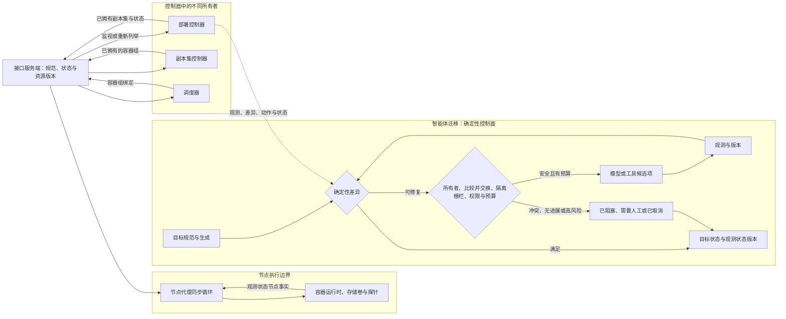

# 协调循环：让智能体围绕期望状态持续收敛

当期望状态已经更新，控制器看到的却仍是旧缓存，下游对象又被另一个控制器修改时，一条“照着事件执行命令”的流水线很容易做错事。容器编排平台的做法是把事件降格为提醒：重新读取目标与事实，计算自己拥有的差异，只提交带版本条件的动作，然后等待下一次观察。

这套架构依赖多个控制器持续收敛，却不允许它们含糊地共享所有权。对象所有者、字段管理者、资源版本、候选实例租约分别解决不同冲突；任何一项都不能替代其他项。

**证据范围**：本文依据容器编排平台 v1.36 在线文档和上游固定提交`39c618b5c30ced3969862e0b4b5acce7a7f8cecb`。迁移时最重要的非等价边界是：确定性协调能对同一目标重算差异；非确定模型可能每轮改变计划、成本与副作用，不能被放进无界循环。

## 学习问题

1. 期望状态与观测状态分叉时，控制器怎样重新建立事实而不是重放旧命令？
2. `spec`、`status`与`observedGeneration`为什么必须分开？
3. 多个控制器如何划分对象、字段、版本与实例级所有权？
4. 部署控制器与节点代理为什么共享收敛思想，却不是同一种循环模板？
5. 智能体平台如何给非确定动作增加幂等、预算、无进展与人工终态？

## 一页摘要

**已证实事实**：容器编排平台对象记录意图。`spec`表达期望状态，系统组件更新`status`表达观察；控制器持续让当前状态更接近期望状态。系统使用多个各自管理一部分状态的控制器，而不是一个全知循环。

事件并不携带必须原样执行的业务命令。部署控制器把`namespace/name`入队，工作进程（worker）再从通知器缓存读取该控制器当前观察到的部署和相关对象。写入时，应用程序编程接口（Application Programming Interface，API）服务端以`resourceVersion`检测过期更新；控制器随后从新事件、延迟调度或错误重排再次观察。

**个人分析**：智能体平台可以复用“目标版本、当前事实、所有者和条件写”的协议。模型只能提出候选动作或生成内容；差异、权限、预算、收敛和终态必须由可重放的确定性控制面判定。

下表说明一次协调在哪里吸收分叉：

| 阶段| 读取或写入| 分叉时的处理| 智能体迁移边界|
| --- | --- | --- | --- |
| 观测| 最新目标、已拥有对象、外部事实| 缓存失效则重新列举，风险点新鲜读取| 观测带版本、来源、时间与生存时间|
| 差异| 当前事实对版本化期望| 只计算本所有者负责的不变量| 同输入与策略得到确定结果|
| 动作| 创建、更新、删除或外部动作| 比较并交换冲突后重新观察| 幂等键、隔离栅栏、授权与副作用闸门|
| 状态| 观测摘要与目标生成| 旧状态不冒充新目标已满足| 写`observed_goal_version`与证据|
| 重新入队| 对象键，而不是旧动作| 以后重新观察| 有界成本、无进展出口与人工接管|

关键判断是：重新入队表示“未来再看一次”，不表示“把上一次工具调用再做一次”。

## 事实边界

**已证实事实**：API 监视让客户端从某个`resourceVersion`的状态继续接收变化。版本超出保留窗口时会出现`410 Gone`，客户端需重建本地状态；过期更新则以`409 Conflict`拒绝，避免已丢失更新。

所有者引用描述依赖对象的对象级控制关系。服务器端应用的`managedFields`记录字段管理者；应用修改他人拥有且值不同的字段时默认冲突，但普通更新不因受管字段冲突自动失败。因此字段所有权不是授权，也不是隔离栅栏。

控制面可用租约协调高可用候选实例，但固定源码不保证任意时刻只有一个客户端自认领导者，也不提供隔离栅栏。租约不能替代资源版本、基于角色的访问控制与准入或写入目标校验的单调纪元。

**基于证据的推断**：`status.observedGeneration`是时间边界。状态看似健康，也可能只对应旧规范；没有观测状态版本，系统就无法区分“当前目标已满足”和“上一版目标曾满足”。

**个人分析**：容器编排平台不判断报告是否真实、谈判是否合规或开放式规划是否足够好。智能体平台必须自行提供稳定验收器、人工批准和副作用协议，不能把字段变化误称为语义收敛。

  
证据：版本截面与实现样本边界

  - **文档截面：** 容器编排平台 v1.36 架构、对象、API、所有者、服务器端应用与租约文档。
  - **源码截面：** `kubernetes/kubernetes@39c618b5c30ced3969862e0b4b5acce7a7f8cecb`。
  - **样本：** 部署控制器代表控制器管理者内的一条具体路径；节点代理代表节点上的多通道同步循环。
  - **时间边界：** 访问与来源截断日期为2026-07-22。
  - **证明边界：** 本文不宣称所有内置或第三方控制器拥有相同事件源、队列、重试（Retry）次数、状态或收敛证明。

## 架构图

先看多个所有者如何围绕同一 API 状态协作。部署控制器管部署到副本集的差异；副本集控制器继续声明容器组；调度器负责放置；节点代理在节点上协调运行时。它们共享资源状态，但不共享一个模糊的“全局写权限”。

模型位于动作候选节点，而不是差异或权限节点。否则同一状态可能因重新采样得到不同“差异”，控制循环便失去稳定目标。

### 视觉检查点：所有者与确定性判定

多个所有者不是共享一个全局写权限。它们通过带版本的 API 状态连接，每一层只声明自己的资源、字段和观测结果。

协调的稳定性来自重新观察和确定性差异，而不是事件顺序。冲突、预算不足或高风险动作必须回到观察或进入人工状态。

因此模型可以提出动作候选，却不应拥有差异、版本门禁或最终状态判定。

## 控制权与任务流

**说明性场景**：部署的规范从生成7 更新到8。部署控制器收到事件并把键入队，但读取缓存时仍可能看到旧对象；与此同时副本集状态继续变化，另一个管理者也可能申请修改某个字段。

工作进程不执行事件里的旧命令。它从当前可见状态重建部署与已拥有的副本集，按删除、暂停、扩缩容或滚动发布分支处理。高风险所有者接纳前，源码还会绕过普通缓存新鲜读取部署的唯一标识与删除时间戳。

若写入碰到`409 Conflict`，正确动作是重新观察生成、所有者与下游事实，再计算差异。若状态已正确反映生成8，则空操作；若只反映生成7，即使数值看似健康，也不能宣布当前目标收敛。

该场景是对已证实机制的组合说明，不是生产事故记录。它表明事件顺序与缓存新鲜度都不是正确性的根基；版本化目标、当前事实、所有权和条件写才是。

部署控制器的工作进程成功时`Forget`；错误时按该实现的限速策略最多重排15 次，之后记录并从队列丢弃。新的对象事件仍可能再次入队。这个15 次上限属于该控制器，不是容器编排平台的全局安全预算。

节点代理走另一条路径。配置、容器生命周期事件、周期同步、探针和设备事件进入`syncLoopIteration`，再分发给各容器组的工作进程；`SyncPod`的源码契约称其可重入，瞬时错误后由后续调用继续取得进展。多个通道同时就绪时没有顺序保证，所以正确性必须来自当前事实与处理器，而不是“事件甲必须先于事件乙”。

智能体中的所有者也要分层。任务所有者负责最终不变量，产物所有者负责子资源，字段管理者只管理明确字段；动作能力决定谁能调用外部工具。实例租约仅降低重复工作概率，每次状态迁移和外部写仍需目标端校验隔离栅栏纪元。

## 关键源码导读

最短路径先读部署控制器的入队、工作进程与同步，再读状态与身份校验。最后用节点代理和领导者选举检查两个边界：并非所有协调都是同一种工作队列，租约也不是隔离栅栏。

**已证实事实**：部署控制器对相同密钥不并发调用处理器；工作进程从键重读对象，成功后`Forget`，错误限速重排。副本集已存在时，同步还会核对所有者唯一标识与容器组模板；`AlreadyExists`本身不等于语义成功。

`syncDeploymentStatus`在状态无变化时空操作，变化时更新`ObservedGeneration`。部署回滚分支明确不是可重入，会等待后续入队完成清理。这提醒读者，协调框架不会自动让每个动作幂等。

  
证据：固定提交中的控制器、节点代理与租约接缝

  - [`deployment_controller.go` 53–116](https://github.com/kubernetes/kubernetes/blob/39c618b5c30ced3969862e0b4b5acce7a7f8cecb/pkg/controller/deployment/deployment_controller.go#L53-L116)：`maxRetries = 15`、列表查询器与限速队列。
  - [`deployment_controller.go` 123–165](https://github.com/kubernetes/kubernetes/blob/39c618b5c30ced3969862e0b4b5acce7a7f8cecb/pkg/controller/deployment/deployment_controller.go#L123-L165)：部署、副本集与容器组通知器处理器。
  - [`deployment_controller.go` 399–427](https://github.com/kubernetes/kubernetes/blob/39c618b5c30ced3969862e0b4b5acce7a7f8cecb/pkg/controller/deployment/deployment_controller.go#L399-L427)：立即入队、`AddRateLimited`与`AddAfter`三条重排接缝。
  - [`deployment_controller.go` 479–519](https://github.com/kubernetes/kubernetes/blob/39c618b5c30ced3969862e0b4b5acce7a7f8cecb/pkg/controller/deployment/deployment_controller.go#L479-L519)：同密钥串行及成功与错误路径。
  - [`deployment_controller.go` 521–548](https://github.com/kubernetes/kubernetes/blob/39c618b5c30ced3969862e0b4b5acce7a7f8cecb/pkg/controller/deployment/deployment_controller.go#L521-L548)：所有者接纳前的新鲜读取。
  - [`deployment_controller.go` 572–659](https://github.com/kubernetes/kubernetes/blob/39c618b5c30ced3969862e0b4b5acce7a7f8cecb/pkg/controller/deployment/deployment_controller.go#L572-L659)：`syncDeployment`重读部署、重建`ownerReferences`约束下的已拥有状态，并暴露非可重入回滚边界。
  - [`sync.go` 220–299](https://github.com/kubernetes/kubernetes/blob/39c618b5c30ced3969862e0b4b5acce7a7f8cecb/pkg/controller/deployment/sync.go#L220-L299)与[`sync.go` 478–531](https://github.com/kubernetes/kubernetes/blob/39c618b5c30ced3969862e0b4b5acce7a7f8cecb/pkg/controller/deployment/sync.go#L478-L531)：副本集身份校验、冲突状态、状态空操作，以及`calculateStatus`写入`ObservedGeneration`的接缝。
  - [`kubelet.go` 2018–2067](https://github.com/kubernetes/kubernetes/blob/39c618b5c30ced3969862e0b4b5acce7a7f8cecb/pkg/kubelet/kubelet.go#L2018-L2067)：可重入`SyncPod`。
  - [`kubelet.go` 2680–2725](https://github.com/kubernetes/kubernetes/blob/39c618b5c30ced3969862e0b4b5acce7a7f8cecb/pkg/kubelet/kubelet.go#L2680-L2725)：多配置源与运行时100ms 到5s 退避。
  - [`kubelet.go` 2728–2877](https://github.com/kubernetes/kubernetes/blob/39c618b5c30ced3969862e0b4b5acce7a7f8cecb/pkg/kubelet/kubelet.go#L2728-L2877)：多事件通道与无处理顺序保证。
  - [`leaderelection.go` 17–48](https://github.com/kubernetes/kubernetes/blob/39c618b5c30ced3969862e0b4b5acce7a7f8cecb/staging/src/k8s.io/client-go/tools/leaderelection/leaderelection.go#L17-L48)：不保证单领导者，且不提供隔离栅栏。
  - **证明边界：** 这些接缝证明具体控制流及其限制，不证明任意外部动作或模型步骤可安全重入。

## 架构决策与权衡

声明式协调适合目标可表达、事实可观察、动作可验证、重复执行安全，且存在可判定距离函数的任务。目标若不断被模型重写、真实状态不可查询、动作无法去重，循环只会把不确定性放大为振荡。

| 条件| 控制方式| 保障| 不满足时的出口|
| --- | --- | --- | --- |
| 纯计算产物可由模式、测试、引用校验| 自动协调| 内容哈希值、版本化验收| 连续无进展后换策略或人工|
| 只读检索可按来源标识去重| 有界自动协调| 查询预算、截止点、缓存新鲜度| 证据冲突时标记未知|
| 写 API 支持幂等性密钥| 自动动作与事后观察| 操作标识、读取后写入、比较并交换| 结果未知时冻结并对账|
| 非幂等写但存在补偿| 审批后动作| 长事务记录、补偿条件、明确所有者| 补偿失败升级|
| 付款、公开发布、权限提升、真实设备| 禁止模型循环自行重试| 单次授权、双人审批、超时| 人工继续、撤销或终止|
| 开放式偏好没有稳定验收器| 交互式协作| 人类选择、版本冻结| 保持草稿，不伪造收敛|

对象所有权与字段所有权不能混用。一个控制器管理依赖对象生命周期，和多个工作流（Workflow）分管同一对象字段，是两份不同契约。低风险派生字段可以在版本核对后转交；目标、审批和副作用字段不应被自动强制抢占。

事件驱动降低延迟，周期扫描修复漏事件与断监视，但清理器只能重新入队资源键。乐观并发允许不同字段合法并行，代价是冲突后必须重读；全局锁看似简单，却扩大故障域并降低自治边界。

## 生产化分析

生产前先定义`distance(current, desired)`和终态。一次协调可以因等待外部条件或顺序守卫而空操作；有界窗口内既未缩短距离，也未进入可解释等待，就应判定无进展。终态至少包括已收敛、已阻塞、已降级、需要人工与已取消。

竞争控制器的典型症状是所有者反复切换与值往返。检测到控制器甲写入一个值、控制器乙又写入另一个值时，停止自动写入，冻结冲突字段，由策略所有者选择唯一权威或拆分目标。不要期待反复覆盖自然选出赢家。

每次观测应携带来源版本、采集时间、生存时间与来源；提交动作时带期望值目标生成和外部版本。冲突后重读、重算，不能盲目重放上次工具调用。

自动动作需要稳定操作标识。规范合同是`operation_id = hash(goal_id, generation, logical_step_id, canonical_action_intent)`；同一逻辑动作重试复用标识，不同动作使用稳定步骤标识与规范化意图区分。外部系统支持时把它作为幂等性密钥；不支持时查结果登记表。超时结果是`Unknown`，不是自动可重试的`Failed`。

预算要在顶层原子扣减模型调用、工具调用、令牌、费用、截止时间、外部写与无进展轮数。部署的15 次和节点代理的5 秒上限只描述各自实现；它们不能直接授权昂贵模型重采样。

  
证据：智能体协调的版本、退避与顶层预算字段

  - **状态提交：** 用比较并交换提交`observed_version → new_status`，并携带期望值目标生成与外部版本。
  - **分层退避：** 网络瞬时失败使用指数退避（Exponential Backoff）和抖动（Jitter）；供应商限流遵守`Retry-After`；外部结果不确定时冻结写入，而不是延时后盲重放。
  - **顶层预算：** 原子扣减`max_model_calls`、`max_tool_calls`、`max_tokens`、`max_cost`、`deadline`、`max_external_writes`与`max_no_progress_rounds`；子目标只能领取剩余额度。
  - **边界：** 这些字段是迁移设计，不是容器编排平台 API 原生字段；其作用是防止每层控制器各自重置预算。

人工接管包应包含目标生成、最后可靠观测、动作与操作标识、外部资源、冲突字段、累计预算和建议选项。接管前递增隔离栅栏纪元，并要求所有目标端校验；撤销租约只能降低并发概率。

**不可违反的非等价边界**：确定性协调在固定目标和策略下重算差异；非确定模型可能改变答案、工具选择和成本。模型不能拥有完成定义、预算扣减、权限判断或无限重新入队权。

最低指标包括协调次数、错误次数、重新入队率、丢弃率、队列深度、最旧时长和距离。还要记录观测状态生成滞后量、所有者冲突、空操作比率与未知操作。每次收敛费用和人工队列年龄用于判断退出条件。指标要发现分叉与振荡，不能把“循环仍在运行”误报成健康。

## 可迁移经验

### 可直接复用的机制

1. 用`GoalSpec`保存版本化目标和验收条件，用`GoalStatus`保存观测状态版本、条件、证据与预算。
2. 事件只携带资源身份；工作进程开始时重读目标与事实。
3. 同一密钥局部串行，跨实例用租约协调候选者，目标端另用隔离栅栏与比较并交换拒绝旧写。
4. 动作使用操作标识、读取后写入、结果身份校验与冲突后重新观察。
5. 分开对象所有者、字段管理者、实例领导者与动作能力。
6. 为错误、无进展、冲突、预算耗尽和高风险动作设置人工终态。

### 只能有限类比的部分

1. `spec/status`适合结构化资源；开放式知识工作仍需验证器、来源策略与人工判断。
2. 通知器、监视与`resourceVersion`由容器编排平台 API 提供；自建平台必须选择自己的存储区、事件日志、比较并交换与重新列举。
3. 部署的15 次重试和节点代理的退避只属于相应路径。
4. `SyncPod`的可重入性建立在明确运行时 API 上；多工具智能体没有检查点、幂等与补偿时不具备同等语义。
5. 所有者引用与字段管理者不会自动解决组织责任和审批服务等级协议。

### 不应照搬的部分

1. 不要把长期控制器解释成单个智能体目标可无限调用模型。
2. 不要把事件载荷当命令，也不要依赖消息顺序。
3. 不要让多个智能体争写同一字段，再期待最终一致性选出正确值。
4. 不要把进程成功、超文本传输协议（Hypertext Transfer Protocol，HTTP）状态码200 或模型自评当成收敛。
5. 不要直接重放超时的非幂等操作；先标记`Unknown`并对账。
6. 不要用容器编排平台自愈叙事为无界、非确定的大语言模型协调循环背书。

## 来源

**官方架构与 API（已证实事实）**

- [Controllers](https://kubernetes.io/docs/concepts/architecture/controller/)、[Cluster Architecture](https://kubernetes.io/docs/concepts/architecture/)与[Objects](https://kubernetes.io/docs/concepts/overview/working-with-objects/)：控制循环、组件分工、`spec`和`status`。访问与截断日期：2026-07-22；站点版本 v1.36。
- [Kubernetes API Concepts](https://kubernetes.io/docs/reference/using-api/api-concepts/)：列表与监视、`resourceVersion`、`410 Gone`与`409 Conflict`。
- [Owners and Dependents](https://kubernetes.io/docs/concepts/overview/working-with-objects/owners-dependents/)、[Server-Side Apply](https://kubernetes.io/docs/reference/using-api/server-side-apply/)与[Leases](https://kubernetes.io/docs/concepts/architecture/leases/)：对象、字段与候选实例的不同所有权边界。

**固定上游源码（已证实事实）**

- [`kubernetes/kubernetes@39c618b5c30ced3969862e0b4b5acce7a7f8cecb`](https://github.com/kubernetes/kubernetes/tree/39c618b5c30ced3969862e0b4b5acce7a7f8cecb)：2026-07-22 解析的上游最新提交。
- [`deployment_controller.go`](https://github.com/kubernetes/kubernetes/blob/39c618b5c30ced3969862e0b4b5acce7a7f8cecb/pkg/controller/deployment/deployment_controller.go)与[`sync.go`](https://github.com/kubernetes/kubernetes/blob/39c618b5c30ced3969862e0b4b5acce7a7f8cecb/pkg/controller/deployment/sync.go)：通知器、队列、工作进程、所有者接纳、副本集与状态。
- [`kubelet.go`](https://github.com/kubernetes/kubernetes/blob/39c618b5c30ced3969862e0b4b5acce7a7f8cecb/pkg/kubelet/kubelet.go)：多通道同步循环、运行时退避、事件顺序边界与`SyncPod`。
- [`leaderelection.go`](https://github.com/kubernetes/kubernetes/blob/39c618b5c30ced3969862e0b4b5acce7a7f8cecb/staging/src/k8s.io/client-go/tools/leaderelection/leaderelection.go)：非隔离栅栏边界与时钟偏斜率与可用性权衡。

**证据边界说明**：`已证实事实`可由官方文档或固定提交定位；`基于证据的推断`从机制推导设计含义；`个人分析`是智能体迁移决策。容器编排平台没有声称协调自动解决大语言模型质量、令牌成本、人工审批或不可逆副作用。
