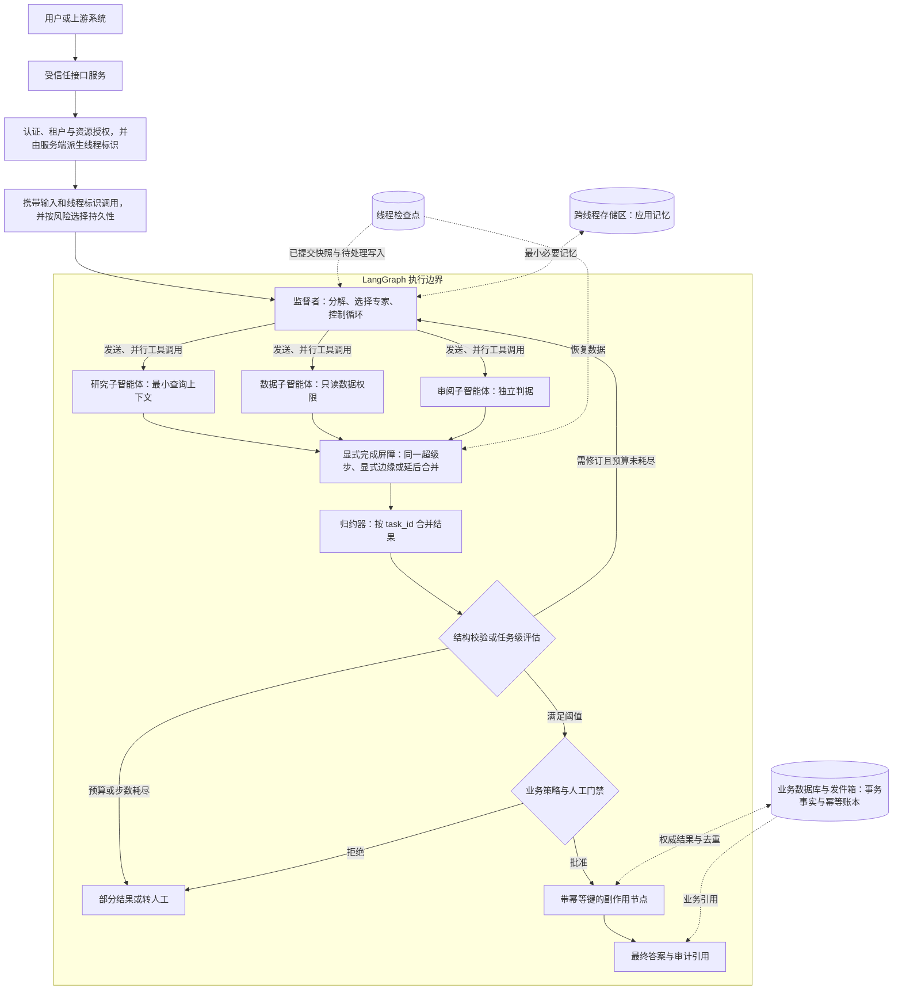
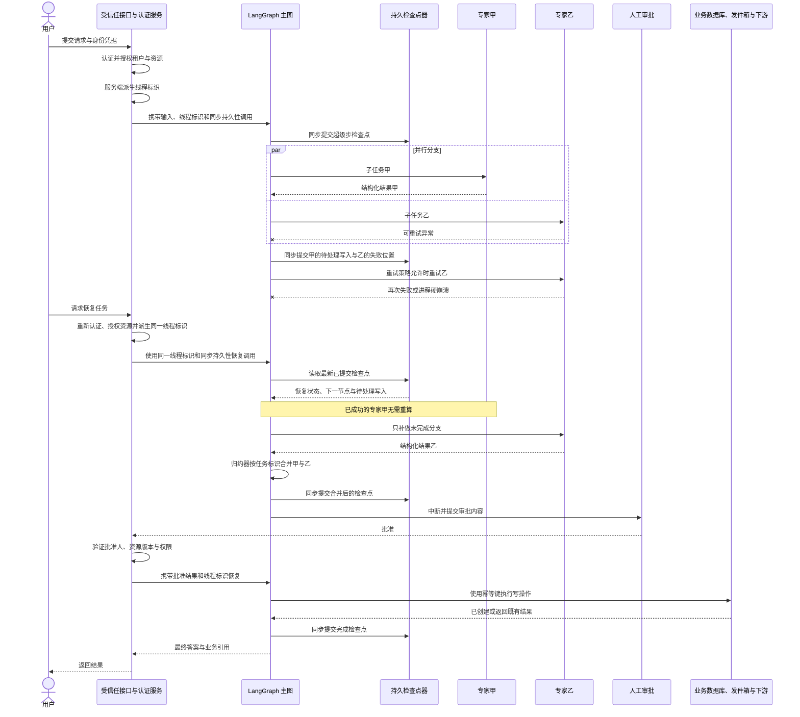

# 显式状态图：用监督者构建可恢复的多智能体编排

监督者可以在模型上下文里记住“下一步找谁”，但进程退出后，这句话不足以恢复并行分支、人工审批和已发生的工具写入。LangGraph 的价值，是把这些控制事实拆成状态密钥、边缘端、归约器、检查点和路由策略。

模型仍可动态选择专家，图则显式保存任务进度、分支合并和暂停位置。恢复的关键不再是重新拼出一段相似对话，而是从已提交状态判断哪些节点可以重跑、哪些结果可复用、哪些副作用必须先对账。

LangGraph 官方来源只负责界定状态、边缘端、归并器和检查点的行为。授权、耐久窗口、外部副作用和人工升级仍由正文展开，因为这些边界决定图能否安全恢复。

## 学习问题

1. 监督者、子智能体、路由器与确定性工作流节点分别拥有什么控制权，哪些职责不应互相渗透？
2. 并行分支同时写图状态时，为什么必须显式定义归并器，怎样避免重复、乱序和覆盖？
3. `thread_id`、检查点、存储区和子图状态各自标识或保存什么，哪些数据并不会自动共享？
4. 节点失败、进程退出或人工中断后，LangGraph 能恢复到哪里，副作用为何仍需幂等键或补偿？
5. 什么时候应该使用工作流图、路由器或监督者，什么时候单智能体加普通工具更简单可靠？

## 一页摘要

先问一项控制事实能否被直接检查：当前计划、已完成分支、重试次数、批准结果和预算如果只在消息历史里，就很难可靠恢复。

**已证实事实**：`StateGraph`以状态、节点、边缘端表达运行。同一超级步的节点可并行，每个状态密钥通过自己的归并器接收更新；检查点组件按`thread_id`保存图状态，并支持中断、检查、重放和失败恢复。

**已证实事实**：监督者模式不等于`langgraph-supervisor`包。官方子智能体文档说明该包已不再积极维护，新项目优先直接把子智能体作为工具；本文只把固定仓库快照作为既有`create_supervisor`、移交和历史输出实现的参考。

监督者通过工具调用子智能体，决定传入什么并综合结果；路由器通常只做一次分类或分解。图可用`Command`做路由、用`Send`扇出任务，但扇入、去重、顺序和停止条件仍要由状态模式与策略明确定义。

**基于证据的推断**：耐久编排的实质，是把“已完成什么、下一步是什么、哪些结果可复用”从自然语言记忆提升为运行时状态。监督者保留开放式分解，显式图固定审批、并发、重试和恢复边界。

| 选择| 下一步由谁决定| 主要状态所有者| 适合场景| 首要风险|
| --- | --- | --- | --- | --- |
| 单智能体与工具| 单个智能体循环| 单一消息历史| 工具较少、任务边界简单| 上下文膨胀、工具权限过宽|
| 路由器| 分类规则或一次模型调用| 路由器输入与综合状态；可有或无历史| 垂直领域清晰、一次性并行检索| 分类错误、分支结果合并不稳定|
| 监督者把子智能体作为工具| 主智能体跨轮动态决定| 主智能体维护对话；子智能体默认每次干净调用| 多跳委派、主智能体统一最终答案| 循环、上下文漏传、调用成本放大|
| 自定义状态图| 节点、边缘、`Command`与局部模型共同决定| 显式状态与检查点| 长任务、审批、恢复、复杂扇出与扇入| 状态模式、归并器和迁移复杂度|

**个人分析**：类别明确且一次分发就结束时用路由器；需要跨轮动态委派时用监督者；阶段、并发和门禁必须恢复时才使用状态图。图能显式控制流，却不会自动让模型正确、工具安全或副作用恰好一次。

## 事实边界

LangGraph 保证的是图执行与已配置持久化语义，不是业务事务。判断恢复能力前，必须同时说清状态合并规则、检查点提交时机和外部副作用去重。

### 已证实事实

状态是应用快照，节点读取状态并返回局部更新，边缘端决定下一步。节点既可以调用大语言模型，也可以只是普通代码。

图按离散超级步执行。同一步的节点可并行，`Send(node, state)`可为动态任务创建不同输入。每个状态密钥有独立归并器；没有归并器时新值覆盖旧值，并行写同一不可合并密钥会触发`INVALID_CONCURRENT_GRAPH_UPDATE`。

归约器以已积累值和新更新为输入。`add_messages`除了追加消息，还会按消息标识更新已有消息；普通列表拼接没有自动去重或稳定顺序保证。

监督者通过工具调用子智能体，主智能体保留用户对话并决定输入与结果压缩。默认子智能体无跨调用历史；显式续接与持久化可以改变这项隔离。

普通工具包装器内调用的子图不能被 LangGraph 静态发现，`get_state(subgraphs=True)`不会自动返回其内部状态。需要检查嵌套状态时，应把子图作为自定义图节点。

检查点器保存单个线程的图快照，存储区保存图外且可跨线程的应用记忆。`thread_id`只负责寻址检查点，不包含用户或租户授权。

`interrupt()`持久化暂停位置，用相同`thread_id`和`Command(resume=...)`恢复。检查点位于超级步边界，节点恢复时从函数开头重执行，而不是从任意代码行继续。

持久性有`sync`、默认`async`和`exit`三种提交时机。`sync`等持久化完成再开始下一步骤；`async`允许后台写与下一步骤并行；`exit`只在图退出时保存。

并行分支失败时，已成功节点的待处理写入可以保存并复用，但只限已按所选持久性提交的写入。`RetryPolicy`控制节点重试；超时和错误处理器需要`langgraph>=1.2`，并受当前仅支持特定语言、超时只支持异步节点等限制。

### 基于证据的推断

上下文所有权应分四层：主对话由监督者管，子任务工作集由调用参数或子图状态管，跨线程记忆由存储区管，事务事实与去重由业务数据库或发件箱管。全部塞进`messages`会破坏隔离并放大令牌。

检查点使计算可重放，不使外部世界回滚。节点先写外部系统、后在检查点前失败时，恢复会从节点开头重跑；应用仍需幂等键、结果查询、去重记录或补偿。

归约器是业务一致性规则，不只是类型标注。并行结果应携带`task_id`、来源、序号和版本，再按业务键归并。

`async`在硬崩溃时存在最近未提交写入窗口，`exit`在正常退出前没有中间恢复点。配置检查点组件不等于每个最新写入都已耐久。

### 个人分析与未知项

LangGraph 不替应用决定租户隔离、工具权限、检查点保留、加密、数据驻留、恢复点目标（Recovery Point Objective，RPO）、恢复时间目标（Recovery Time Objective，RTO）、幂等、补偿、令牌预算或质量阈值。图也不能证明模型一定走正确分支；路由、停止、工具选择和综合质量仍要评估。

<details className="evidence-card">
  <summary>证据：固定版本、监督者包状态与适用范围</summary>

  - **来源截断：** `2026-07-20`
  - **分支：** 两个仓库核对时均为`main`
  - **LangGraph：** `langchain-ai/langgraph@49ae27c2ae983cfb92091b0dea9f7bc37a716479`
  - **监督者参考实现：** `langchain-ai/langgraph-supervisor-py@88859b34017ac3569bbd4a3092c7e77593a0a960`
  - **维护边界：** 官方子智能体文档说明`langgraph-supervisor`包已不再积极维护，新项目优先直接采用“子智能体作为工具”模式；固定仓库只用于核对既有`create_supervisor`、移交、历史输出和多层实现。
  - **边界：** 固定提交与当日文档不支持外推后续 API 或推荐模式。
</details>

## 架构图

读图时先区分三类状态：主图检查点、跨线程存储区和外部业务账本。它们分别负责执行恢复、应用记忆和权威副作用，不能合成一个“持久化层”。

下图是基于官方原语的实现选择，不是框架模板。受信任服务先授权并派生`thread_id`；图中的屏障也必须落实为真实同步语义，多条箭头本身不提供通用加入。



文字等价描述：

1. 受信任 API 在图外认证调用者、授权其访问目标租户与资源，并从服务端映射或派生`thread_id`；只有完成这些检查后才可调用`invoke()`、加载检查点或恢复线程。图内输入节点不是这个安全门。
2. 应用按恢复要求选择持久性；最近一步必须经受硬崩溃时使用`sync`，能接受小型最近写入窗口时才使用默认`async`。
3. 监督者读取主图显式状态，只为当前任务选择必要子智能体；每个子智能体收到独立、最小化输入，而不是默认复制完整会话。
4. 可独立的子任务并行执行。若分支属于同一超级步，可在该步完成后汇合；也可用`add_edge([分支...], "reduce")`建显式分组屏障。非等长或分别激活的路径需要完成计数、命名屏障或`defer=True`等设计，不能依赖图上多条箭头。
5. 屏障完成后，归并器以`task_id`为业务键合并结果；聚合状态与检查点属于主图，跨线程存储区只保存应用记忆。
6. 聚合结果经过结构校验、任务级评估和预算与步数上限。外部写操作在门禁后执行，以业务数据库与发件箱与幂等账本作为事务事实与去重权威；检查点不承担业务账本职责。

## 控制权与任务流

**说明性场景｜监督者并行委派研究、数据与审阅任务，其中一支失败后恢复。** 该场景只组合官方状态、归并器、待处理写入、中断与恢复语义；它不代表真实部署，也不声称检查点能回滚外部副作用。

主图先为每个子任务写入稳定`task_id`、批次和预算，监督者再选择子智能体。分支返回结构化结果，不直接改写其他分支或最终发布状态。

同一超级步的并行更新通过归并器合并。失败分支重试时，已提交的成功待处理写入可以复用；但追加归并器仍可能接收重复结果，所以业务键与版本优先级必须显式。

完成屏障确认本批任务到齐后，图才进入评估或人工审批。恢复审批时，受信任服务重新验证用户、资源版本和权限；写操作携带业务幂等键，并由外部账本决定是否已发生。

### 监督者与子智能体的职责边界

**已证实事实**：官方子智能体模式由主智能体选择子智能体、构造输入、调用工具并综合返回值。子智能体不直接接管主对话；主智能体可以在同一轮发起多个工具调用以并行执行。名称与描述是主智能体决定是否调用子智能体的重要提示界面。

**个人分析**：监督者应拥有任务分解、候选专家选择、停止与升级决定和最终叙述；子智能体应拥有窄领域内的推理和工具使用。监督者不应绕过领域权限直接调用高风险工具，子智能体也不应自行改变全局预算、租户、最终发布或其他分支状态。推荐让子智能体返回结构化信封：`task_id`、`status`、`facts`、`evidence_refs`、`uncertainties`、`usage`，由主图而非自然语言约定负责合并。

### 显式状态与归并器

一个并行监督者的最小状态不应只有`messages`。可把可恢复控制信息与展示文本分离：

```python
class OrchestrationState(TypedDict):
    messages: Annotated[list[AnyMessage], add_messages]
    task_id: str
    plan: list[Subtask]
    results: Annotated[list[AgentResult], merge_by_task_id]
    attempts: dict[str, int]
    approvals: dict[str, ApprovalDecision]
    budget: BudgetState
    final_answer: str | None
```

这里`merge_by_task_id`是实现选择，不是内置保证。它应对同一任务的重试结果做幂等插入或更新，明确版本优先级，并在输入相同的情况下产生确定结果。`operator.add`适合演示累积，但生产中可能把重试结果再次追加。若并行结果展示顺序重要，分支应写入`{task_id, ordinal, value}`，扇入后显式排序；官方文档明确提醒并行超级步更新顺序可能不稳定。

### 扇出与扇入的重复风险

- 静态并行可从一个节点添加多条出边；动态任务数可让路由节点返回多个`Send`。
- 对同一超级步中同时激活的并行节点，后继扇入会在该步的分支完成后运行；静态分支也可用`add_edge(["research", "data", "review"], "reduce")`表达分组屏障。
- “多条边指向同一个节点”不是所有拓扑的通用加入保证。非等长分支、循环中不同批次或分别激活的分支可能在不同超级步到达；这类扇入需要显式完成计数与批次标识、命名屏障，或把聚合节点设为`defer=True`，使其等所有待处理任务完成后再运行。
- 若同一超级步的一个分支失败，该超级步不会提交完整聚合状态；成功分支的任务级待处理写入是否能在硬崩溃后复用，还取决于相应写入是否已经按持久性模式持久提交。
- 有检查点组件时，成功分支的待处理写入能被保存，恢复时不必重做；这减少重复计算，不等于外部副作用事务化。
- 同一键缺少归并器会产生并发更新错误；使用简单追加归并器又会带来重复和非稳定顺序。正确做法是先定义业务合并契约，再选择归并器。
- 并发必须有`max_concurrency`、每节点截止时间、总体截止时间、扇出数量和令牌与费用上限。否则“并行降低时延”会变成下游限流、尾时延和费用峰值。

### 路由器与智能体式监督者

**已证实事实**：官方路由器指南把路由器定义为专用路由步骤，常通过一次规则或模型分类把输入发给专家；它通常不维护持续对话，也不做跨轮多跳编排。监督者是一个完整主智能体，维护上下文，并根据不断变化的对话动态决定调用哪个子智能体。路由器可无状态，也可自行实现历史；官方提醒有状态路由器尤其在切换专家与并行调用时需要自定义历史管理。

**个人分析**：若请求可映射到稳定枚举，路由器的结构化分类更易测试和预算；若任务需要“研究后发现缺口，再调用数据专家，再让审阅者反驳”，监督者的多跳自治更合适。常见组合是：确定性外层路由器先选安全域，域内监督者再做开放式委派。不要用监督者替代访问控制，也不要让路由器的类别标签兼任长期会话状态。

### 上下文隔离：共享什么，不共享什么

| 数据| 默认与官方语义| 推荐生产边界|
| --- | --- | --- |
| 主对话历史| 由主智能体维护| 只保留用户可见事实、已确认决定与必要摘要|
| 子智能体输入| 由工具包装器构造；可只传查询，也可显式传更多上下文| 按任务白名单投影，去除无关秘密与指令|
| 子智能体内部历史| 默认每次调用新鲜；可显式启用续接| 仅在领域连续性确有价值时持久化，并使用独立命名空间|
| 父与子图共享键| 子图作为节点时可共享同名状态通道；包装器可映射不同模式| 接口化映射，禁止把整个父状态作为通用字典透传|
| `thread_id`与检查点| `thread_id`寻址单个线程的图状态；框架不替应用授权| 受信任服务先认证并授权租户与资源，再从服务端派生标识，之后才可`invoke` / `get_state` / 恢复；设置保留与删除策略|
| 存储区| 图状态之外、可跨线程访问的应用定义记忆| 按租户、用户、用途与敏感度授权；图节点只取最小必要记忆，不把它当事务账本|
| 业务数据库、发件箱与幂等账本| 不属于 LangGraph 存储区的自动语义；保存外部世界的权威事实| 使用唯一约束、事务、幂等键、发件箱与收件箱与审计，处理重复执行和下游交付|

特别注意：输入与输出模式限制节点看到什么和`invoke`返回什么，但官方图 API 文档说明“私有”状态通道在默认值流式传输中仍可能出现。它不是安全隔离边界；需要限制流的`output_keys`，并在遥测出口再次做脱敏和授权。

## 关键源码导读

源码阅读要验证四项合同：状态密钥如何合并、节点可以产生什么副作用、边缘端怎样停止、检查点何时提交。只看拓扑会漏掉恢复正确性。

最短路径从图 API 与`StateGraph`开始，再到持久化和`BaseCheckpointSaver`。只有使用中断、节点重试或旧监督者包时，才继续核对对应文档与固定实现。

<details className="evidence-card">
  <summary>证据：状态、持久化与监督者的完整阅读路径</summary>

  本卡中的说明文件（README）均来自固定仓库。

  1. [Subagents](https://docs.langchain.com/oss/python/langchain/multi-agent/subagents)与[Router](https://docs.langchain.com/oss/python/langchain/multi-agent/router)：主对话、上下文隔离、一次分类和多路`Send`。
  2. [Graph API](https://docs.langchain.com/oss/python/langgraph/graph-api)、[Use the Graph API](https://docs.langchain.com/oss/python/langgraph/use-graph-api)与[`StateGraph`](https://github.com/langchain-ai/langgraph/blob/49ae27c2ae983cfb92091b0dea9f7bc37a716479/libs/langgraph/langgraph/graph/state.py)：模式、`MessagesState`、每个密钥的归约器、`stream`、超级步、`Send`、`Command`与重执行。源码注释把节点输出写作`Partial<State>`，归约器签名写作`(Value, Value) -> Value`。
  3. [Persistence](https://docs.langchain.com/oss/python/langgraph/persistence)、[Thinking in LangGraph](https://docs.langchain.com/oss/python/langgraph/thinking-in-langgraph)与[`BaseCheckpointSaver`](https://github.com/langchain-ai/langgraph/blob/49ae27c2ae983cfb92091b0dea9f7bc37a716479/libs/checkpoint/langgraph/checkpoint/base/__init__.py)：线程、存储区、待处理写入与持久性。
  4. [Interrupts](https://docs.langchain.com/oss/python/langgraph/interrupts)：`interrupt()`、`Command(resume=...)`、节点重跑和副作用幂等。
  5. [Fault tolerance](https://docs.langchain.com/oss/python/langgraph/fault-tolerance)：`RetryPolicy`、失败分类，以及`langgraph>=1.2`的超时与错误处理器限制。
  6. [`langgraph` README](https://github.com/langchain-ai/langgraph/blob/49ae27c2ae983cfb92091b0dea9f7bc37a716479/README.md)：持久化执行、人在回路、内存与生态边界。
  7. [`langgraph-supervisor-py` README](https://github.com/langchain-ai/langgraph-supervisor-py/blob/88859b34017ac3569bbd4a3092c7e77593a0a960/README.md)、[`supervisor.py`](https://github.com/langchain-ai/langgraph-supervisor-py/blob/88859b34017ac3569bbd4a3092c7e77593a0a960/langgraph_supervisor/supervisor.py)与[`handoff.py`](https://github.com/langchain-ai/langgraph-supervisor-py/blob/88859b34017ac3569bbd4a3092c7e77593a0a960/langgraph_supervisor/handoff.py)：旧包的`output_mode`、移交工具与`Command.PARENT`。

  - **边界：** 旧监督者仓库是实现参考，不是当前框架唯一语义或新项目推荐入口。
</details>

## 架构决策与权衡

选择模式时先问控制状态是否需要跨进程恢复。只有分类需要显式时用路由器；任务计划持续变化时用监督者；审批、并发和恢复点必须可查时再引入持久化图。

### 工作流图、监督者、路由器还是单智能体

| 信号| 优先选择| 原因|
| --- | --- | --- |
| 少量工具、单轮或短对话、无复杂审批| 单智能体| 最少模型调用与状态面|
| 领域分类稳定、一次分发后综合| 路由器| 路径短，分类可离线评估|
| 任务分解随中间结果变化、需要多跳专家协作| 监督者| 主智能体能基于新证据继续委派|
| 长运行、需暂停恢复、并行汇合、固定合规顺序| 自定义状态图| 状态、节点、门禁和恢复点显式|
| 同时存在严格外壳与开放式子任务| 图包裹监督者| 代码管边界，模型管局部不确定性|

**个人分析**：不要把每个函数都升级成智能体。确定性查询、格式校验、权限检查、扣费与写库更适合普通节点或工具；智能体适合需要独立提示、工具集和探索循环的任务。子智能体数量增加后，主智能体必须读取更多工具描述与返回值，路由和综合成本也会增长。

### 检查点器、存储区与业务数据库

检查点组件解决“这个线程的图执行到哪”；存储区解决“跨线程想记住什么”；业务数据库、发件箱与幂等账本解决“外部世界的权威事实、事务提交与去重结果是什么”。三者是独立边界，不能在图或部署图中合并成一个泛化的“持久化层”：

- 不要把检查点当订单、付款或审批的权威账本；其模式服务运行恢复，而非业务交易完整性。
- 不要用存储区绕开业务数据库的唯一约束、事务与审计。
- 不要在检查点中无限累积完整文档、工具响应和秘密；长线程需要保留、压缩与删除策略。
- 生产使用持久检查点组件；`InMemorySaver`只在进程内保存，进程重启会丢失。

### 图 API 还是函数式 API

图 API 适合需要显式共享状态、可视拓扑、条件边和扇入的系统；函数式 API 适合保留普通控制流并用`@entrypoint`与`@task`增加耐久性。**基于证据的推断**：多智能体监督者若要审计每个专家状态与并行合并，图 API 通常更直观；若只是一个长函数中若干可缓存 API 调用，函数式 API 可能更轻。两者都要求重执行安全。

### 自治、确定性与版本迁移

模型路由提高开放任务适应性，也带来路径方差；静态边与代码门禁更可预测，却需要显式维护新分支。恢复中的线程会反序列化既有状态，并按当前编译图继续，因此状态键、节点名、归并器语义和中断与任务顺序都是兼容性表面。发布时应固定图与提示词与模型与工具模式版本，先对历史检查点做兼容测试，再灰度恢复长线程。

## 生产化分析

生产验证要从一次失败后的可解释状态开始：最新提交到哪里、哪条分支可复用、哪个节点会从头重跑、外部世界是否已经改变。

### 持久化恢复序列

下图继续前述说明性场景，聚焦并行分支失败后的恢复。它把检查点、待处理写入、重试与恢复、中断与应用幂等放在同一时序中。

“硬崩溃后保留最近写入”明确假设持久化后端和成功的`durability="sync"`提交。业务授权、去重和事务提交都不是 LangGraph 自动保证。



文字等价描述：

1. 受信任服务先认证调用者、授权其访问租户与资源，并在服务端映射出`thread_id`；用户不能用任意标识触发检查点读取。
2. 服务以`durability="sync"`启动图，检查点组件在允许下一步骤前同步提交写入。两个专家并行执行；专家甲成功、专家乙失败时，专家甲已提交的待处理写入可复用，专家乙按受限策略重试。
3. 硬崩溃后，服务再次完成认证与资源授权，再以同一服务端派生的`thread_id`调用图；图从最新已提交检查点恢复，只补做未完成的专家乙。
4. 完成屏障确认本批分支到齐后，归并器按业务任务键合并两条结果并同步生成新检查点，然后`interrupt()`等待人工审批。
5. 审批恢复前再次验证批准人、对象版本与权限。外部写操作带应用级幂等键，并由业务数据库与发件箱与幂等账本判定是否已处理；最后同步保存图完成状态并返回业务引用。

### 持久性模式与硬崩溃窗口

| 模式| 官方提交语义| 硬崩溃含义| 适用取舍|
| --- | --- | --- | --- |
| `sync` | 变更持久化完成后才开始下一步骤| 已确认提交的最新检查点与写入可作为恢复依据| 需要最新写入存活、审批或高价值长任务；代价是每步等待存储输入输出|
| `async`（默认） | 后台持久化与下一步骤并行| 若进程或主机在后台写完成前硬崩溃，最近未提交写入存在丢失窗口| 可接受少量重算或最近进度回退，优先吞吐与较低步骤延迟|
| `exit` | 只在图退出时持久化| 正常退出前的系统故障没有中间进度可恢复| 短、可完全重算且不依赖中间恢复的运行|

**已证实事实**是三种模式的提交时机。**基于证据的推断**是对应的硬崩溃窗口：只有已经成功提交到持久化后端的写入才可能在进程与主机丢失后恢复；选择`sync`也不会把节点外部副作用纳入检查点事务。

### 生产失败模式与遏制

| 失败模式| 后果| 框架相关机制| 应用必须补齐|
| --- | --- | --- | --- |
| 复用错误`thread_id` | 串话、覆盖另一会话进度| 检查点按线程读取，但不做业务授权| 任何检查点查询前先认证并授权资源，再由服务端派生限定在租户作用域内的标识|
| 内存检查点组件随进程退出| 所有恢复点丢失| `InMemorySaver`仅进程内| 持久化后端、备份、容量与 RPO 测试|
| `async`写入尚未完成即硬崩溃| 最近检查点与待处理写入回退或丢失| 默认持久性后台提交| 高价值流程使用`sync`；监控提交延迟并测试断电窗口|
| `exit`模式在正常退出前系统失败| 中间进度没有持久恢复点| 仅退出时持久化| 只用于短、可全量重算的运行|
| 并行分支写同一无归并器键| `INVALID_CONCURRENT_GRAPH_UPDATE` | 每个密钥对应一个归并器| 设计合并契约与并发测试|
| 非等长分支仅用多条箭头汇合| 归并器可能过早或分批触发| 同超级步加入、分组边缘端、`defer` | 设计批次标识、完成屏障或延后聚合|
| 追加归并器遇到重试| 重复结果、顺序漂移| 待处理写入可减少重算| task_id 去重、版本优先、显式排序|
| 节点在检查点前完成外部写入后崩溃| 重跑产生重复副作用| 节点从函数开头重跑| 幂等键、插入或更新、发件箱与收件箱或补偿|
| 监督者不停调用专家| 令牌、时延和费用失控| 递归上限与路由状态| 总步数、调用数、扇出、截止时间与费用预算|
| 子智能体包装器对图不可见| 无法检查嵌套中断状态| 工具内子图非静态发现| 改为自定义图节点或显式上报状态|
| 检查点与状态模式不兼容| 历史线程恢复失败或语义改变| 以当前图读取保存状态| 模式版本、迁移器、历史恢复回归测试|
| 工具或模型暂时失败| 整体任务失败或重复重试| `RetryPolicy`、待处理写入| 异常分类、退避、熔断、降级与人工队列|
| 检查点无限增长| 存储与读取延迟上升| 可查询与管理状态| 保留、归档、摘要、删除和用户数据请求流程|

### 可观测性与评估

至少为每次运行记录`tenant_id`、`task_id`、`thread_id`、`run_id`、`checkpoint_id`、图与提示词与模型与工具版本、节点开始与结束、路由决定、重试次数和中断原因。子智能体令牌与时延与费用、归并器输入摘要和最终状态也要进入同一关联链。

LangGraph 提供流的更新、值、消息、检查点、任务与调试等观察面，并可接入配套追踪平台；这提供执行证据，不等于质量结论。

评估应分层：路由器看分类精确率、召回率与拒答；监督者看正确专家选择、无效循环、计划完成率；子智能体看领域正确性与引用；扇入看覆盖、矛盾处理和重复率；系统看端到端完成率、人工升级率、中位数和百分之九十五分位时延、每成功任务费用和恢复成功率。上线前用故障注入覆盖“并行一支失败”“中断后进程重启”“恢复前代码升级”“副作用响应丢失”等场景。

### 安全与隐私

- 任何`invoke`、`get_state`、`get_state_history`、`update_state`或`Command(resume=...)`之前，受信任 API 都必须认证调用者、授权目标租户与资源，并从服务端映射或派生`thread_id`。图节点、模型提示和用户提交的标识都不是认证授权边界。
- 主图、检查点、存储区、流与追踪记录都可能含提示、工具结果和个人数据；分别实施加密、最小权限、租户过滤、保留和审计。
- 业务数据库、发件箱与幂等账本另有事务、访问控制和审计要求；不要因存储区可跨线程访问就把它提升为业务事实来源。
- 子智能体工具描述是能力暴露面。主智能体只能看到当前用户被授权的子智能体；子智能体内部工具还要再次鉴权，不能依赖提示词声明权限。
- 对共享状态使用输入与输出模式不能替代脱敏；私有通道也可能通过流式传输暴露。
- 中断载荷只放审批所需摘要与不可变业务引用，不放长期凭证；恢复时重新验证批准人、租户、对象版本与策略。
- 检查点反序列化与历史图恢复是信任边界。限制允许的类型与版本，防止把不受信任复杂对象当作普通状态载荷。

### 成本与容量边界

多智能体成本近似为主智能体规划与综合、每个子智能体的模型与工具调用、失败重试、评估和状态存储之和。并行能降低墙钟时延，却不会降低令牌总量，还可能抬高峰值并发。

`sync`持久性会把每步检查点提交时延放进关键路径；应只在最新写入生存要求值得这项开销时使用，并以真实后端测量百分之九十五和百分之九十九分位时延。

生产预算应同时限制每次运行的监督者回合、子智能体调用数、`Send`数、`max_concurrency`、每节点令牌、重试次数、总截止时间、检查点大小与保留期。把“部分结果和明确缺口”定义为合法降级，通常比无界自动修复更可靠。

## 可迁移经验

迁移这套架构时，先迁移状态与策略，而不是先复制智能体名单。

### 可直接复用的机制

1. **先定义状态所有权。** 主对话、子任务、线程检查点、跨线程存储区与业务账本各有所有者。
2. **把归并器当并发合同。** 为并行密钥定义结合、去重、顺序和版本规则，并测试交换顺序、重复输入与恢复重放。
3. **把确定性边界放在模型外。** 进入图、读取检查点或恢复前完成身份与资源授权；预算、审批、模式和发布门禁由代码执行。
4. **把历史检查点纳入发布测试。** 用旧状态恢复新图，验证节点名、模式、归并器、中断与任务顺序和工具契约。

### 只能有限类比的部分

1. **路由器、监督者与图是能力选择。** 单智能体到持久化图不是线性成熟度阶梯，只为已验证需求加层次。
2. **归约器能合并状态，不能创造业务一致性。** 简单追加可消除并发写错误，却不提供去重和稳定顺序。
3. **检查点能重放计算。** 它可以减少已成功分支的重复计算，但不能回滚或事务化外部工具。
4. **持久性是窗口选择。** `sync`、默认`async`与`exit`分别交换提交等待、最近进度窗口和重算成本。

### 不应照搬的部分

1. **不要把`thread_id`当授权凭证。** 任何调用、状态查询或恢复前，由受信任服务重新授权并派生标识。
2. **不要复制完整上下文给子智能体。** 只传任务所需输入，返回结构化摘要；持久历史只用于明确的领域连续性。
3. **不要把检查点当恰好一次。** 外部写仍使用幂等键、唯一约束、发件箱与收件箱、结果查询或补偿。
4. **不要无限恢复。** 数据损坏、权限变化、长期下游故障或预算耗尽时，返回部分结果、转人工或安全失败。

## 来源

以下均为官方文档或上游仓库；无二手博客。建议按此顺序阅读：

### 主要架构

1. [Subagents](https://docs.langchain.com/oss/python/langchain/multi-agent/subagents)：监督者与子智能体的控制权、上下文工程、并行与检查点模式。
2. [Router](https://docs.langchain.com/oss/python/langchain/multi-agent/router)：路由器的一次性分类、多路并行、综合与有状态变体；用于和监督者对照。
3. [Graph API](https://docs.langchain.com/oss/python/langgraph/graph-api)与[Use the Graph API](https://docs.langchain.com/oss/python/langgraph/use-graph-api)：状态、节点、边缘端、超级步、归并器、`Send`、`Command`、重执行与并行扇入。
4. [Persistence](https://docs.langchain.com/oss/python/langgraph/persistence)与[Thinking in LangGraph](https://docs.langchain.com/oss/python/langgraph/thinking-in-langgraph)：检查点组件与存储区的范围、`thread_id`、待处理写入，以及`sync`、默认`async`、`exit`持久性的提交时机与取舍。

### 源码

7. [`langgraph` 固定仓库快照](https://github.com/langchain-ai/langgraph/tree/49ae27c2ae983cfb92091b0dea9f7bc37a716479)：说明文件、图 API 与检查点组件接口的上游实现，提交`49ae27c2ae983cfb92091b0dea9f7bc37a716479`。
8. [Subagents 的迁移说明](https://docs.langchain.com/oss/python/langchain/multi-agent/subagents)与[`langgraph-supervisor-py` 固定仓库快照](https://github.com/langchain-ai/langgraph-supervisor-py/tree/88859b34017ac3569bbd4a3092c7e77593a0a960)：官方说明该包已不再积极维护，新项目优先直接工具与子智能体模式；固定仓库只作为移交、历史管理与既有实现参考，提交`88859b34017ac3569bbd4a3092c7e77593a0a960`。

### 补充说明

5. [Interrupts](https://docs.langchain.com/oss/python/langgraph/interrupts)：暂停与恢复、`Command(resume=...)`、节点重执行与副作用幂等规则。
6. [Fault tolerance](https://docs.langchain.com/oss/python/langgraph/fault-tolerance)：`RetryPolicy`与失败处理；节点超时和错误处理器要求`langgraph>=1.2`，并有仅支持特定语言、超时仅支持异步节点等限制。

来源访问日期与截断日期：**2026-07-20**。事实陈述限定于上述固定提交与当日官方文档；文中的生产拓扑、`merge_by_task_id`、租户标识、业务账本设计、持久性选择、幂等键、指标阈值和部署策略均属于明确标注的实现建议或分析，不是 LangGraph 框架自动保证。

一个可恢复的监督者不是“会继续对话的模型”，而是一组可以回答所有者、版本、下一步和效果状态的状态转换。只有这些字段在失败后仍可验证，图上的自治才有可靠的恢复边界。
