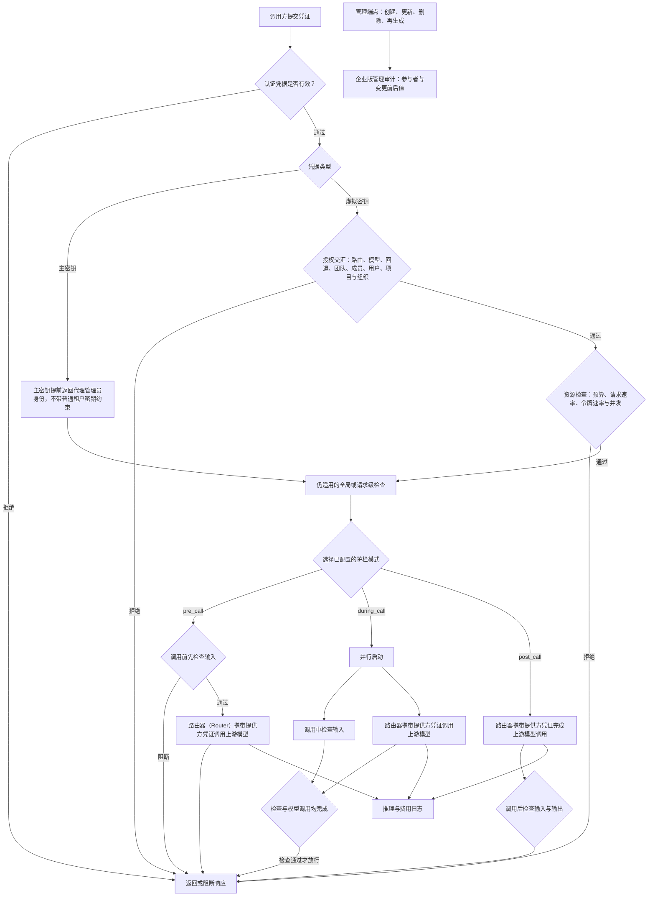

# 虚拟密钥：把模型网关变成权限与预算的交汇点

虚拟密钥隐藏了上游供应商凭据，却不会自动带来最小权限。该网关中，主密钥可作为代理管理员调用大语言模型路由；普通密钥的模型列表为空时又表示不限制模型。一个看似“未配置”的字段，可能扩大而不是收紧访问面。

更可迁移的视角是把模型网关看成多个拒绝门的交汇点：身份、模型、路由、预算、速率和内容策略都必须在请求生命周期的正确时刻生效。任何一层的空值语义、异步记账或例外授权，都可能改变最终边界。

**证据范围**：本文以2026-07-23 为来源截断日期，机制判断固定到`BerriAI/litellm@v1.92.0`（提交`b3086cc`）。该版本晚于认证路径漏洞的修复下限`1.83.7`；在线文档若描述更晚行为，本文不据此回填到固定版本。

## 学习问题

1. 虚拟密钥、团队、用户、项目与组织的权限怎样共同约束一次请求？
2. 为什么主密钥和空模型列表都是需要显式治理的高权限状态？
3. 多级预算与每分钟请求数与每分钟令牌数限制能阻止什么，又不能承诺怎样的并发一致性？
4. `pre_call`、`during_call`与`post_call`护栏分别在哪个时刻拥有阻断权？
5. 管理审计与推理日志为什么必须分轨保留？
6. 开源版与企业版的许可边界如何改变控制面的选型？

## 一页摘要

**已证实事实**：该代理用虚拟密钥承载模型列表、预算、速率、有效期、团队和用户等上下文，再用网关持有的供应商凭据发起上游调用。请求因而无需获得真实提供方密钥，但代理本身成为凭据与策略的集中信任边界。

**基于证据的推断**：固定版本会分别检查团队、团队成员、用户、项目、组织、密钥和全局代理的适用规则。请求因此可理解为必须穿过所有适用拒绝门的“权限交集”；但访问组等显式授权例外可能扩展访问，不能用简单集合公式替代源码与配置审查。

**已证实事实**：主密钥是重要例外。固定认证路径匹配它后直接返回`PROXY_ADMIN`身份，不附带普通虚拟密钥的模型、团队和密钥预算上下文；该身份可以调用大语言模型路由，官方预算文档还明确代理管理员不受速率限制。

**个人分析**：把主密钥只用于控制面而不进入推理面，是部署建议，不是该网关的内建保证。

**基于证据的推断**：预算是后验计费数据驱动的准入控制，不是财务交易式的硬预授权。并发请求可能在相近的旧快照上同时通过检查；官方文档和固定源码没有给出跨实例、跨层级的零超支或线性一致性保证。

下表回答每个控制真正拥有哪一种权力：

| 控制| 决定什么| 关键状态| 不能替代|
| --- | --- | --- | --- |
| 主密钥| 管理代理，也可授权大语言模型路由| 提前返回的代理管理员身份| 不应作为日常租户凭据；普通密钥限制不适用|
| 虚拟密钥与层级权限| 请求可走哪些模型与路由| 密钥、团队、成员、用户、项目、组织| 上游供应商授权|
| 预算与每分钟请求数与每分钟令牌数| 当前观察下是否继续接收流量| 消耗、窗口、计数器| 强一致预付费账本|
| 护栏| 在指定时序检查或修改内容| 调用前、调用中、调用后、仅记录| 身份认证与模型授权|
| 管理审计| 谁改变了密钥、团队、用户或模型| 变更前后值、参与者、动作| 每次推理的输入输出记录|
| 推理日志| 一次模型调用发生了什么| 调用标识、输入输出、异常、费用| 配置变更责任链|

核心判断是：虚拟密钥不是一张轻量应用程序编程接口（Application Programming Interface，API）密钥，而是多级治理状态的索引。生产设计必须为默认值、更新传播、日志敏感度和失败时序分别建立测试。

## 事实边界

**已证实事实**：官方文档把主密钥定义为代理管理员密钥，并用于生成其他密钥。固定认证路径对凭据做常量时间比较，匹配后构造`PROXY_ADMIN`对象，并在查询普通密钥数据库记录之前返回；因此它也能授权大语言模型路由，而不会继承普通虚拟密钥的模型与预算字段。

该提前返回不等于所有后续检查都消失，固定包装器仍有全局或请求级检查。关键风险是普通租户密钥的模型、团队、密钥预算与速率限制不适用于主密钥；官方文档也明确代理管理员不受速率限制。控制面与推理面隔离必须由网络、凭据分发和调用策略额外建立。

固定源码还明确写出：密钥的模型列表为空表示可调用全部模型。模型列表聚合逻辑在密钥为空时退回团队列表，团队也为空时退回代理模型列表。

因此，“空列表”不是默认拒绝。若团队返回`models: []`，密钥也未指定模型，调用面可能扩展到代理已配置模型。最小权限部署应明确写入允许模型，并把空值检查放进密钥与团队创建策略和配置审计。

模型权限也不是单一列表。固定版本先执行团队、团队成员、用户、项目等适用检查，再执行密钥级模型与回退模型检查；组织还承担角色与预算检查。访问组可以在特定所有权条件下授予资源，所以“权限交集”应读作多个门共同生效，而不是假设所有列表机械求交。

**已证实事实**：官方安全公告列出的受影响范围是1.81.16 至1.83.7 之前。攻击者可把构造的`Authorization`请求头发到任意大语言模型API 路由，经代理错误处理路径触发API 密钥校验中的结构化查询语言注入；`1.83.7`将调用者输入改为查询参数，公告建议升级到该版本或更高。

这条边界不能缩写成“老版本认证较弱”。它是认证失败路径可在未认证请求下触达数据库查询的具体问题；仅保护管理端点不足以覆盖。公告给出的临时缓解是`general_settings.disable_error_logs: true`，但这不等于补丁，也不应替代升级。

  
证据：固定版本与认证路径修复边界

  - **固定版本：** [`v1.92.0 / b3086ccd74553565c9a39716e72303ae985555f9`](https://github.com/BerriAI/litellm/tree/b3086ccd74553565c9a39716e72303ae985555f9)。
  - **官方公告：** [`GHSA-r75f-5x8p-qvmc`](https://github.com/BerriAI/litellm/security/advisories/GHSA-r75f-5x8p-qvmc)列出受影响版本`>=1.81.16,<1.83.7`、修复版本`>=1.83.7`、大语言模型路由上的触发路径与临时缓解。
  - **版本判断：** `v1.92.0`位于修复范围之后，并提供稳定标签与不可变提交，适合作为本文源码锚点。
  - **证明边界：** 版本号证明本文不落在该公告的受影响区间，不证明此版本不存在其他漏洞。

## 架构图

先看控制顺序：身份、模型权限和预算是在路由之前生效，还是等选定上游模型后才补做？

图中的关键关系是策略先于路由，且供应商凭据留在代理一侧；它不表示所有请求都会通过，也不证明预算已被原子预留。下图继续保留护栏时序、主密钥分支与日志流等精确拓扑。

这条流的关键不是检查数量，而是模式分叉发生在上游调用之前。`pre_call`、`during_call`和`post_call`是可选时序，不是串行必经节点；只有同步的前置门能阻止内容与费用进入提供方。

## 控制权与任务流

**说明性场景**：租户团队`research`的一把虚拟密钥被泄露。团队和密钥都只显式允许`safe-chat`，密钥配有每分钟请求数、每分钟令牌数和周期预算，默认护栏以`pre_call`运行；代理独占保存上游提供方密钥。

攻击者先请求未授权模型`premium-reasoner`。模型授权门应在路由前拒绝，因此不会靠回退换到另一个未授权模型。固定版本还会校验请求可达的回退模型名，避免调用者借覆盖路由设置穿过密钥允许列表。

攻击者改为并发调用已授权的`safe-chat`。每分钟请求数与每分钟令牌数或并发门可以先拒绝一部分流量，多级预算检查也会在所见消耗达到上限后拒绝后续请求。但已经并行通过的请求可能产生在途费用；本文没有证据把这些检查解释为跨副本原子扣款或严格不超支。

这里要检查的是：预算与每分钟请求数与每分钟令牌数门挡住了哪些请求，又有哪些费用已经进入在途状态？

因此，这些门可以基于当时可见状态拒绝后续请求，却不能据此承诺跨实例零超支。若业务需要财务级硬上限，还需额外的调用前原子预留、调用后结算与失败释放。

其中一条请求携带敏感内容，`pre_call`护栏在上游调用前阻断，因此提供方不会因该请求收到正文。若运维改用`during_call`，护栏虽会在响应返回前完成，但模型调用已并行启动；若改用`post_call`，检查发生在模型返回之后。这两种时序都不能承诺避免上游披露或调用费用。

管理员随后阻断或删除泄露密钥，并创建替代密钥。这是本地授权恢复，不是规避上游风控：不得通过更换虚拟密钥、提供方密钥、账号或回退来绕过供应商撤权、限流、封禁或使用政策。若提供方凭据本身疑似泄露，应在供应商侧撤销并按合规流程轮换，而非只替换租户密钥。

该场景只组合文档与固定源码支持的控制，不是事故记录。它说明终止泄露需要同时处理认证状态、在途请求、费用对账、提供方凭据暴露范围和管理变更证据。

## 关键源码导读

最短源码路径先读集中认证包装器，再读通用检查和模型检查，最后读预算记账与请求处理。这样能分清“请求前看见什么”“哪些规则并行检查”以及“调用后何时更新费用”。

**已证实事实**：固定版本先在普通密钥数据库查询之前识别主密钥，并提前返回`PROXY_ADMIN`对象。普通虚拟密钥则由认证包装器进入`common_checks`，并另行执行密钥与回退模型访问检查；多个预算作用域的读取使用`asyncio.gather`并行等待。

**基于证据的推断**：这证明多个适用预算门都会运行，也证明它们读取不同计数器密钥；但不能据此推导跨作用域存在一个原子事务，或并发请求会按总费用严格串行。生产验收应把“最终拒绝”和“绝不越线”当成两个不同指标。

  
证据：权限门、空模型语义与多级预算源码

  - [`litellm/proxy/auth/user_api_key_auth.py`](https://github.com/BerriAI/litellm/blob/b3086ccd74553565c9a39716e72303ae985555f9/litellm/proxy/auth/user_api_key_auth.py)：主密钥匹配后的`PROXY_ADMIN`提前返回，以及普通密钥模型与回退检查。
  - [`litellm/proxy/auth/auth_checks.py`](https://github.com/BerriAI/litellm/blob/b3086ccd74553565c9a39716e72303ae985555f9/litellm/proxy/auth/auth_checks.py)：团队、成员、用户、项目、组织、预算和对象权限门；预算作用域并行读取。
  - [`litellm/proxy/auth/model_checks.py`](https://github.com/BerriAI/litellm/blob/b3086ccd74553565c9a39716e72303ae985555f9/litellm/proxy/auth/model_checks.py)：密钥列表为空时退回团队，团队也为空时退回代理模型列表。
  - [`litellm/proxy/_types.py`](https://github.com/BerriAI/litellm/blob/b3086ccd74553565c9a39716e72303ae985555f9/litellm/proxy/_types.py)：`UserAPIKeyAuth.models`注释明确空列表允许全部模型。
  - **证明边界：** 这些文件证明固定版本的控制流与默认语义，不证明分布式预算的线性一致性或所有扩展认证插件都保持相同语义。

护栏的最短阅读重点是事件钩子，而不是供应商清单。官方文档明确：`pre_call`在大语言模型调用前检查输入；`during_call`与大语言模型调用并行，但在护栏完成前不返回；`post_call`在大语言模型调用后检查输入与输出。

因此，护栏选型必须从不可逆动作倒推。数据不得离开网关时只能依赖可靠的前置阻断；只要求“不把违规响应交给终端用户”时，响应侧检查才足够。流式响应还需验证缓冲、断流和客户端已接收片段的具体行为。

## 架构决策与权衡

**已证实事实**：该代理用虚拟密钥承载模型访问、预算、速率和组织上下文，并由代理持有提供方凭证。固定认证与授权路径会组合密钥、成员、团队、项目和组织等对象层级，并执行预算、每分钟请求数、每分钟令牌数与并发限制。官方护栏文档区分调用前、并行和调用后三种检查时序；管理审计与普通模型调用日志也面向不同事件。

模型专属虚拟密钥预算与预算回退还受产品许可约束。官方文档把`model_max_budget`标为企业版专属；预算回退在1.92 系列起依赖该预算，当模型超限时改写到仍有预算的授权模型。它们不能被当作基础开源版预算的默认能力。

**个人分析**：基于上述机制，可以把本节的取舍归纳为五个架构决策；“第一个”到“第五个”是本文的分析框架，不是该网关官方给出的决策编号。

第一个决策是用虚拟密钥隔离租户与提供方凭证。租户密钥可撤销、限权、限额，供应商凭据留在代理配置、环境变量或秘密管理器；代价是代理一旦失陷，可能同时暴露多租户流量和上游凭据。

再比较两条凭据路径：调用方只持有虚拟密钥时，哪些治理门仍在路径上；调用方直接持有提供方凭证时，又绕过了什么？

虚拟密钥路径把权限、预算与供应商凭据保管集中到代理，但这不等于上游供应商授权。直接凭据会绕过网关治理；轮换虚拟密钥、提供方密钥、账号或回退也不得被用来规避供应商撤权、限流、封禁或使用政策。

第二个决策是把授权拆为多个对象层级。团队负责共享边界，成员与密钥进一步收窄，项目和组织表达额外治理；代价是空值、继承、哨兵值与访问组例外提高了可解释性成本。策略变更前必须计算有效权限，而不能只查看密钥行。

第三个决策是用预算、每分钟请求数、每分钟令牌数和并发限制组合资源治理。速率限制约束短窗口压力，预算约束累计成本；代价是每层都有计数、窗口、缓存与重置状态。若业务要求财务级硬上限，应在调用前做原子预留、调用后结算与失败释放，而不是仅依赖异步消耗更新。

第四个决策是按副作用选择护栏时序。前置检查增加调用延迟但能阻止上游接触内容；并行检查降低部分等待却已经启动调用；后置检查能看见输出但费用和披露已发生。没有一个时序同时免费获得最低延迟、完整上下文和零副作用。

第五个决策是分离管理审计与推理日志。审计回答“谁在何时改变了什么治理对象”，推理日志回答“哪次模型调用输入输出、异常和费用如何”；二者的字段、访问者、保留期与敏感度不同，不能互相替代。

## 生产化分析

**已证实事实**：该网关不会内建阻止主密钥调用推理路由，官方文档也明确代理管理员不受普通速率限制。

**个人分析**：主密钥应只进入受控管理面，保存在秘密管理器中，不分发给应用。管理面网络隔离、最小管理员集合、轮换和告警都属于部署责任。

密钥与团队创建应执行默认拒绝校验：拒绝意外的`models: []`，或要求调用者明确选择“全部代理模型”。同时测试别名、访问组、`all-team-models`、`all-proxy-models`和回退，使用户界面展示、API 返回与请求时有效权限一致。

**基于证据的推断**：预算检查读取多个作用域的计数器，而证据不支持跨作用域原子预留。生产测试因此应覆盖同一密钥高并发、同一团队多密钥、多代理副本与调用中取消，还应覆盖缓存故障、内存数据库与持久数据库切换和窗口重置。观察值至少包括准入时消耗、最终费用、超限后仍在途的请求和各层拒绝原因；没有这些数据时，最大超支量仍是未知。

**个人分析**：护栏测试要按时序断言副作用：前置阻断时提供方未收到调用；并行阻断时客户端未获响应但提供方可能已收到输入；后置阻断时费用与上游处理已经发生。还要验证护栏服务超时、不可用、误报时采用失败开放还是失败关闭。

**已证实事实**：官方管理审计记录密钥、团队、用户、模型的创建、更新、删除、再生成及操作者和前后值，并要求企业版许可证。普通日志与回调路径面向模型输入、输出、异常与调用标识。

**个人分析**：管理审计与推理日志应采用独立访问控制；推理日志还需按数据分类配置消息裁剪、脱敏和保留期。

  
证据：管理审计、推理日志与许可边界

  - **管理审计：** [Audit Logs](https://docs.litellm.ai/docs/proxy/multiple_admins)列出审计实体、动作、`changed_by`、哈希密钥、更新前后的值，并明确要求企业版许可证。
  - **推理日志：** [Logging](https://docs.litellm.ai/docs/proxy/logging)说明记录代理输入、输出和异常，并为每次请求生成`call_id`。
  - **产品能力：** [Budgets, Rate Limits](https://docs.litellm.ai/docs/proxy/users#virtual-key-model-specific)把虚拟密钥的`model_max_budget`标为企业版专属；[Budget Fallbacks](https://docs.litellm.ai/docs/proxy/budget_fallbacks)说明它在1.92 系列起依赖每个模型的预算。
  - **运行时门：** [`validate_model_max_budget`](https://github.com/BerriAI/litellm/blob/b3086ccd74553565c9a39716e72303ae985555f9/litellm/proxy/management_endpoints/key_management_endpoints.py#L6325-L6354)在非高级套餐用户设置非空模型预算时拒绝。
  - **代码许可：** [仓库根 LICENSE](https://github.com/BerriAI/litellm/blob/b3086ccd74553565c9a39716e72303ae985555f9/LICENSE)说明`enterprise/`外代码采用宽松开源许可；[`enterprise/LICENSE.md`](https://github.com/BerriAI/litellm/blob/b3086ccd74553565c9a39716e72303ae985555f9/enterprise/LICENSE.md)规定该目录的软件许可。
  - **证明边界：** 源码位于哪个目录只说明代码文件许可，不能单独决定产品功能授权。企业版标签、运行时高级套餐门禁、实际合同与版本功能清单才共同约束使用；本文不构成法律意见。

**个人分析**：升级还要把安全公告当成路由面问题验证。所有大语言模型API 路由都应在恶意或无效授权输入下稳定失败，数据库查询使用参数化路径，错误日志配置不应成为唯一防线。固定到不可变镜像摘要，并对依赖与镜像签名执行供应链校验。

## 可迁移经验

### 可直接复用的机制

1. 用短期、可撤销的租户凭据映射集中保管的上游凭据，避免把提供方密钥分发给工作负载。
2. 把身份、模型、路由、预算、速率和内容策略设计成独立拒绝门，并记录每次拒绝的具体层级。
3. 对密钥、团队、成员、项目和组织分别保存政策，再提供可解释的有效权限视图。
4. 让回退目标重新通过同一授权与预算检查，不允许路由器扩大调用者权限。
5. 按不可逆副作用选择护栏时序，并为超时与服务故障定义失败开放或失败关闭。
6. 把管理变更审计与推理调用日志分轨保存，分别设置访问控制、脱敏与保留策略。

### 只能有限类比的部分

1. 模型调用的成本可在响应后估算；智能体（Agent）工具还可能产生数据库写入、支付、消息发送等非模型副作用。
2. 每分钟请求数与每分钟令牌数适合模型流量，不能直接表达工具并发、队列占用、事务锁或外部业务配额。
3. 模型允许列表可用名称描述；智能体能力还需参数模式、数据域、对象权限与批准状态。
4. `post_call`可阻断模型输出交付，却不能补偿已经执行的工具动作或撤回上游已接收的数据。
5. 访问组能简化批量授权，但所有权例外会削弱纯交集模型，必须单独审计。
6. 模型专属密钥预算与预算回退的迁移思路可复用，但该实现是高级套餐与企业版产品能力，不能从开源代码的可见性推导生产授权。

### 不应照搬的部分

1. 不要把空模型列表当“无权限”，也不要把未设置预算解释为零预算。
2. 不要把主密钥放进应用配置、客户端或常规推理路径。
3. 不要把多级预算检查宣称为跨副本、跨层级的强一致硬上限。
4. 不要用`during_call`或`post_call`声称敏感输入从未发送给提供方。
5. 不要用推理日志替代管理审计，也不要默认记录完整提示词与响应。
6. 不要以换虚拟密钥、提供方密钥、账号、来源或回退的方式规避上游风控、撤权、封禁、限流或政策。
7. 不要用源码目录位置判断产品授权，也不要在缺少有效企业版权利时启用模型专属虚拟密钥预算、预算回退或其他高级套餐功能。

## 来源

**官方产品说明（已证实事实）**

{/* terminology-exempt: unknown-english-term | reason: 受保护的官方产品文档链接标签必须保持 Virtual Keys 原文 */}
- [Virtual Keys](https://docs.litellm.ai/docs/proxy/virtual_keys)：主密钥、虚拟密钥、消耗跟踪、默认与上界参数。访问与截断日期：2026-07-23。
- [Budgets, Rate Limits](https://docs.litellm.ai/docs/proxy/users)：预算层级、代理管理员速率限制例外，以及企业版专属模型虚拟密钥预算。访问与截断日期：2026-07-23。
- [Budget Fallbacks](https://docs.litellm.ai/docs/proxy/budget_fallbacks)：1.92 系列起基于`model_max_budget`的密钥级预算回退。访问与截断日期：2026-07-23。
- [Guardrails Quick Start](https://docs.litellm.ai/docs/proxy/guardrails/quick_start)：`pre_call`、`during_call`、`post_call`与企业版专属控制。访问与截断日期：2026-07-23。
- [Audit Logs](https://docs.litellm.ai/docs/proxy/multiple_admins)：管理对象变更、操作者、前后值与企业版要求。访问与截断日期：2026-07-23。
- [Logging](https://docs.litellm.ai/docs/proxy/logging)：模型调用输入、输出、异常、调用标识与回调。访问与截断日期：2026-07-23。

**固定上游源码（已证实事实）**

- [`BerriAI/litellm@b3086cc`](https://github.com/BerriAI/litellm/tree/b3086ccd74553565c9a39716e72303ae985555f9)：`v1.92.0`的不可变源码锚点。
- [`user_api_key_auth.py`](https://github.com/BerriAI/litellm/blob/b3086ccd74553565c9a39716e72303ae985555f9/litellm/proxy/auth/user_api_key_auth.py)、[`auth_checks.py`](https://github.com/BerriAI/litellm/blob/b3086ccd74553565c9a39716e72303ae985555f9/litellm/proxy/auth/auth_checks.py)与[`model_checks.py`](https://github.com/BerriAI/litellm/blob/b3086ccd74553565c9a39716e72303ae985555f9/litellm/proxy/auth/model_checks.py)：主密钥提前返回、普通密钥授权、空列表继承和多级预算检查。
- [`key_management_endpoints.py`](https://github.com/BerriAI/litellm/blob/b3086ccd74553565c9a39716e72303ae985555f9/litellm/proxy/management_endpoints/key_management_endpoints.py)：`model_max_budget`的企业版与高级套餐运行时校验。
{/* terminology-exempt: unknown-english-term | reason: 受保护的官方仓库许可证链接标签必须保持 LICENSE 原文 */}
- [根 LICENSE](https://github.com/BerriAI/litellm/blob/b3086ccd74553565c9a39716e72303ae985555f9/LICENSE)与[`enterprise/LICENSE.md`](https://github.com/BerriAI/litellm/blob/b3086ccd74553565c9a39716e72303ae985555f9/enterprise/LICENSE.md)：宽松开源许可与企业版目录许可边界。

**官方安全公告（已证实事实）**

- [`GHSA-r75f-5x8p-qvmc`](https://github.com/BerriAI/litellm/security/advisories/GHSA-r75f-5x8p-qvmc)：代理API 密钥校验结构化查询语言注入、认证错误路径、受影响范围、`1.83.7`修复与临时缓解。

**证据边界说明**：`已证实事实`可由官方文档、固定源码或官方安全公告定位；`个人分析`用于解释并发、运维和迁移风险。本文没有虚构客户、事故、指标或生产保证，也不把本地凭据轮换与回退解释成规避供应商控制的手段。
