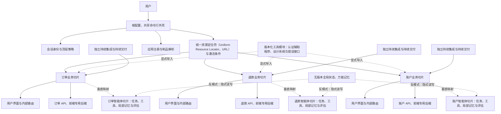
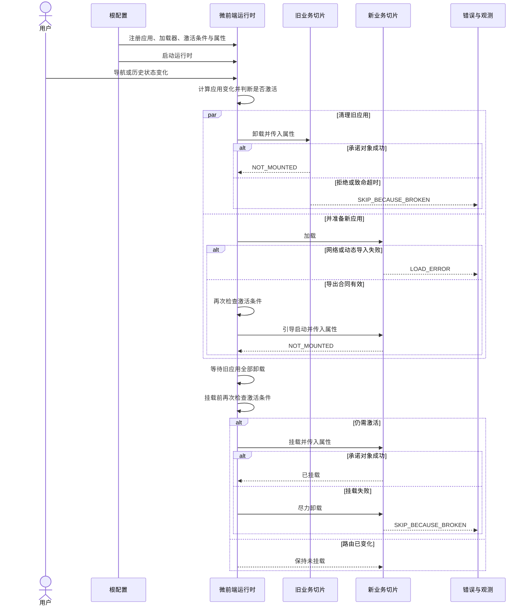

# 微前端：用垂直业务切片约束跨团队所有权

微前端最难处理的不是“多个框架怎样显示在同一页”，而是独立交付怎样不被隐藏共享状态重新绑成锁步发布。只要一个字段、一个全局存储区或一次命令行外壳改动仍要求所有团队同时协调，运行时拆分就只是把单体搬进浏览器。

该工程文章给出的微前端定义和 single-spa 的运行时契约提供了同一个尺度：先按用户价值划出团队能端到端负责的垂直切片，再决定是否需要运行时组合。微前端解决的是组织独立交付，不是任意拆分组件。一个团队、一个优先级和一个发布节奏时，模块化单体通常更合适。

本文以截至2026-07-22 的官方文档和 single-spa 6.0.3 固定提交为证据范围，并把它有限类比到多智能体所有权。源码路径、版本和完整验证入口收进证据卡；折叠这些卡片，仍可看清控制权、状态、失败与恢复边界。

## 学习问题

1. 为什么微前端首先解决多团队独立交付，而不是框架混搭或组件拆分？
2. 垂直业务切片如何约束用户界面、领域逻辑、运行责任和发布权限？
3. 根配置、激活条件与生命周期分别控制什么，失败后谁有权重试（Retry）？
4. 共享状态、依赖和通信怎样把独立制品重新变成分布式单体？
5. 将业务切片类比为智能体、工具与记忆所有权时，哪里必须停止类比？
6. 什么时候模块化单体比运行时拆分更简单、更安全？

## 一页摘要

**已证实事实**：该工程文章将微前端定义为把可独立交付的前端应用组合成整体，主要收益是自治团队、独立部署和增量演进。团队应围绕垂直业务能力组成，从构想到生产持续拥有一块用户价值，而不是按样式、表单或验证等水平技术能力分工。

**已证实事实**：single-spa 的根配置注册应用、提供激活条件并启动生命周期。`activeWhen`根据当前位置判断应用是否活跃；`start()`之前只能加载，启动后才会引导启动、挂载或卸载。应用必须提供`mount`与`unmount`；缺失的`bootstrap`或`unload`会被标准化为成功的空操作，因此“没有可选钩子”不会被误判成生命周期失败。

**基于证据的推断**：根配置更接近一个确定性的组合控制面，而不是业务超级应用。它应持有“哪些切片可被发现、何时激活、挂载到哪里、通用身份与错误策略是什么”等少量系统职责，不应吸收订单、客户或风控规则。业务团队如果每次改动都要修改命令行外壳、请求中央团队排期或等待统一发布，名义上的微前端没有产生组织自治。

**个人分析**：映射到多智能体系统时，一个切片应拥有完整业务结果，包括领域任务、专用工具、局部记忆、评估、服务等级目标和发布权限。共享编排命令行外壳只做身份、顶层意图路由、预算与策略门禁、结果装配；无版本全局记忆、万能工具网关和同步发布列车会重新制造全局协调。

| 架构对象| 明确所有者| 对外合同| 不应拥有|
| --- | --- | --- | --- |
| 根配置与共享命令行外壳| 平台或产品集成团队| 注册清单、激活规则、挂载槽位、顶层导航、错误与观测钩子| 领域决策、领域数据库写入、各切片内部路由|
| 垂直业务切片| 单一业务团队| 生命周期、公开入口、版本化事件或应用程序编程接口（Application Programming Interface，API）、服务等级目标| 其他切片的文档对象模型、私有状态和发布流程|
| 共享依赖与工具模块| 明确的平台维护者| 最小稳定接口、兼容矩阵、升级与回滚策略| 无边界的全局业务状态、任意跨域写入|
| 智能体业务切片| 单一领域团队| 任务信封、工具权限、状态模式、评估与结果契约| 其他智能体的私有记忆、凭证和内部推理步骤|

结论很直接：**微前端的组织目的，是让多个团队在同一产品中以较少协调完成独立交付。** 如果只有一个小团队、一个统一优先级和一个发布节奏，模块化单体通常拥有更低的运行时、测试、安全和治理成本；此时不应拆成微前端，更不应把单个智能体系统机械拆成一组远程服务。

## 事实边界

**已证实事实**：single-spa 把微前端分为应用、数据包与工具模块。应用按路由声明式激活；数据包命令式嵌入且不拥有路由；工具模块暴露公共脚本接口。三者共享同一浏览器进程、主线程和文档对象模型，并不具备后端微服务的隔离。

**已证实事实**：官方建议让一个微前端只修改自己拥有的文档对象模型区域，跨微前端尽量少通信。首选机制是显式模块导入；每个微前端应以单一入口控制公开接口。路由型应用通常不需要频繁共享用户界面状态。官方尤其警告不要让所有微前端依赖一个全局状态库，因为状态形状与动作会迫使调用方同时考虑前后兼容，破坏独立部署。

**已证实事实**：共享依赖是一项选择性优化，不是默认边界。single-spa 推荐对体积较大的界面库考虑单实例共享，对较小依赖可接受重复打包，以便各应用独立升级；其文档明确指出，把一切都设为共享依赖会要求所有使用方同时升级。认证与授权、样式系统、API 辅助程序和全局错误处理可以做成工具模块，但这些模块也需要公共接口与独立维护责任。

**基于证据的推断**：运行时组合隔离的是代码库、流水线和责任，不自动隔离处理器、内存、文档对象模型、浏览器存储或网络会话。失控应用仍可阻塞主线程、覆盖全局样式或读取同源令牌。“独立部署”不能被误写成“安全沙箱”；更强隔离需要内嵌页面、不同来源、内容安全策略或后端授权边界。

**个人分析**：本文不把 single-spa 当成完整平台。它不替项目决定业务边界、认证协议、数据一致性、制品签名、导入映射发布原子性、跨应用契约版本、端到端测试、灰度路由、服务等级目标或事故响应。它提供注册、激活与生命周期状态机；生产系统仍必须围绕这些接缝建立发布与治理机制。

**个人分析**：将微前端迁移到多智能体只能做结构类比。前端`mount`成功通常意味着文档对象模型已建立，而智能体的“激活”可能启动非确定推理、调用外部系统并产生不可逆副作用。智能体的`unmount`不能只停止展示；还要处理租约、在途工具调用、幂等键、检查点、补偿与审计。因此下文把生命周期当作所有权协议，不把浏览器状态机照搬成工作流（Workflow）引擎。

## 架构图

下图将 single-spa 的运行时组合与多智能体所有权放在同一张边界图中。实线表示运行时控制流，虚线表示受契约约束的类比，不表示二者具有相同故障模型。

**已证实事实**：single-spa 的根配置只需要共享页面标记与注册应用的脚本语言；官方称其存在目的只是启动应用。应用各自拥有子路由，该框架是依据 URL 激活它们的顶层路由器（Router）。`activeWhen`可为函数、路径前缀或组合数组，导航事件与历史 API 变更会触发重新计算。

**基于证据的推断**：实际产品可以有常驻导航、登录页和多个同时激活的应用，但共享命令行外壳应保持“薄”。它可决定槽位和系统级失败降级，却不应直接导入所有业务内部模块，也不应通过巨型`customProps`把可变领域对象广播给每个应用。否则根配置会成为编译、测试和组织瓶颈。

**个人分析**：智能体版命令行外壳可以维护能力注册、身份、租户、预算、顶层任务路由和最终结果装配，但每个切片要有独立工具允许列表、领域状态存储与评估。全局状态若只是带版本的不可变用户身份快照，可能是合理公共上下文；若任何智能体都能写入共享“事实”并期待其他智能体立即按特定字段解释，它就是跨边界数据库，所有团队会被迫锁步升级。

## 控制权与任务流

**说明性场景**：用户从订单页切到退款页，又在退款制品加载时返回订单页。这个场景没有声称发生过真实事故，只用 single-spa 已证实的状态机追踪一次控制权交接。

注册后，single-spa 依据状态与`shouldBeActive`把应用分为待加载、待挂载、待卸载或待卸载。新应用的负载与引导启动可与旧应用卸载并行，但必须等旧应用全部完成清理后才挂载；引导启动前和挂载前还会复核激活条件。因此，迟到的退款应用不会仅凭最初一次导航判断覆盖已经恢复的订单页。

**已证实事实**：生命周期函数可以是函数数组，single-spa 会按顺序等待前一个承诺对象后再调用下一个；函数若不返回类承诺对象对象会失败。`mount`失败时源码先把状态临时设为`MOUNTED`，尽力执行`unmount`清理，然后进入`SKIP_BECAUSE_BROKEN`。`unmount`会先处理子数据包，即使子数据包清理失败仍尝试清理父应用。`unload`只有显式调用`unloadApplication`后才运行；成功会删除缓存的生命周期函数并回到`NOT_LOADED`，下次重新加载与引导启动。

**个人分析**：这组状态转换给智能体平台的启示不是函数命名，而是“控制权必须可观察”。智能体切片至少应暴露`registered`、`ready`、`active`、`draining`、`inactive`、`load-error`与`broken`等可查询状态；激活前验证任务与权限，停用时拒绝新工作并等待或转移在途任务。一次推理失败不应与制品加载失败混成同一重试策略：前者可能需要业务补偿，后者可能只需回滚制品解析。

## 关键源码导读

阅读源码只需先抓住三条接缝：注册时校验合同，重新路由决定交接顺序，生命周期函数落实状态转换。它们共同证明 single-spa 是带错误状态的路由驱动状态机；它们不证明页面具有事务回滚，也不证明任一应用失败后会自动切到备用实现。

本节只解释 single-spa 6.0.3 固定快照。该版本范围影响状态机与默认超时结论；快照之后的实现不在本文范围内。

  
证据：注册、路由与生命周期源码接缝

- **固定提交：** [`297483c11265050542d7ef107d14c44936c51883`](https://github.com/single-spa/single-spa/tree/297483c11265050542d7ef107d14c44936c51883)，仓库`package.json`为6.0.3；该提交本身只更新资助配置。

| 源码接缝| 已证实行为| 合同或错误语义| 智能体类比提醒|
| --- | --- | --- | --- |
| [`applications/apps.js`](https://github.com/single-spa/single-spa/blob/297483c11265050542d7ef107d14c44936c51883/src/applications/apps.js) | `registerApplication`校验并标准化输入，以`NOT_LOADED`加入注册表后触发重新路由；同名注册直接抛错| 名称、加载对象、激活函数、`customProps`均有边界校验；未调用`start`五秒后给出警告| 能力注册必须拒绝重名、非法入口和无效策略，不能靠运行时猜测|
| [`applications/app.helpers.js`](https://github.com/single-spa/single-spa/blob/297483c11265050542d7ef107d14c44936c51883/src/applications/app.helpers.js) 与 [`applications/apps.js`](https://github.com/single-spa/single-spa/blob/297483c11265050542d7ef107d14c44936c51883/src/applications/apps.js) | `shouldBeActive`调用`activeWhen(location)`；异常则报告并进入`SKIP_BECAUSE_BROKEN`；`getAppChanges`按状态分桶| `LOAD_ERROR`在满足激活且经过至少200ms 后可再次尝试负载；损坏应用不再被激活| 路由谓词必须纯且可审计；策略代码异常不能默认放行|
| [`navigation/reroute.js`](https://github.com/single-spa/single-spa/blob/297483c11265050542d7ef107d14c44936c51883/src/navigation/reroute.js) | 启动前只加载；启动后编排卸载、加载、引导启动和挂载；挂载等待旧应用全部卸载| 同时发生的重新路由排队；加载与清理可并行，挂载前两次复核激活条件| 任务切换需要排空屏障与迟到结果检查，不能只在接单时鉴权|
| [`lifecycles/load.js`](https://github.com/single-spa/single-spa/blob/297483c11265050542d7ef107d14c44936c51883/src/lifecycles/load.js) | 要求加载函数返回承诺对象；验证`mount`、`unmount`及可选`bootstrap`的导出形式，并展平函数数组| 用户合同错误进入`SKIP_BECAUSE_BROKEN`；加载承诺对象拒绝进入`LOAD_ERROR`并记录时间| 区分“制品暂不可达”与“能力合同无效”，两者恢复和告警不同|
| [`lifecycles/bootstrap.js`](https://github.com/single-spa/single-spa/blob/297483c11265050542d7ef107d14c44936c51883/src/lifecycles/bootstrap.js) 与 [`lifecycles/mount.js`](https://github.com/single-spa/single-spa/blob/297483c11265050542d7ef107d14c44936c51883/src/lifecycles/mount.js) | 引导启动仅从`NOT_BOOTSTRAPPED`进入，成功后为`NOT_MOUNTED`；挂载仅从`NOT_MOUNTED`进入，成功后为`MOUNTED` | 引导启动失败进入损坏；挂载失败先尽力卸载，再进入损坏| 一次性初始化与每次激活要分开；失败清理必须幂等且不掩盖原错误|
| [`lifecycles/unmount.js`](https://github.com/single-spa/single-spa/blob/297483c11265050542d7ef107d14c44936c51883/src/lifecycles/unmount.js) 与 [`lifecycles/unload.js`](https://github.com/single-spa/single-spa/blob/297483c11265050542d7ef107d14c44936c51883/src/lifecycles/unload.js) | 卸载只处理`MOUNTED`，先清子数据包再清父；卸载只在被请求且已卸载或处于`LOAD_ERROR`时执行| 清理失败进入损坏；卸载无论成功或错误都会移除缓存生命周期，成功回到`NOT_LOADED` | 智能体停用先处理子任务和租约；卸载制品不等于撤销已发生的外部副作用|
| [`lifecycles/lifecycle.helpers.js`](https://github.com/single-spa/single-spa/blob/297483c11265050542d7ef107d14c44936c51883/src/lifecycles/lifecycle.helpers.js)、[`applications/timeouts.js`](https://github.com/single-spa/single-spa/blob/297483c11265050542d7ef107d14c44936c51883/src/applications/timeouts.js) 与 [`applications/app-errors.js`](https://github.com/single-spa/single-spa/blob/297483c11265050542d7ef107d14c44936c51883/src/applications/app-errors.js) | 生命周期数组串行执行；默认时限会周期告警，只有`dieOnTimeout`为真才拒绝承诺对象；错误带应用名并先记录失败前状态，再切换新状态| 默认引导启动4000ms，其他主要生命周期3000ms，且默认不因超时终止等待| 生产策略必须显式选择超时后告警、隔离、取消或熔断；默认无限等待不等于恢复|

**边界：** 这些锚点支持注册校验、状态分桶、清理屏障、失败分类和超时语义，不证明业务效果或智能体副作用可以照搬浏览器生命周期。

**基于证据的推断**：状态检查使重复调用趋于无操作，重新路由队列避免多个导航同时改写生命周期。生产命令行外壳仍要定义错误边界、占位用户界面、重试、回滚与用户可见降级。

**个人分析**：对智能体平台，最值得移植的是注册合同、激活谓词、明确状态、清理屏障和错误分类。不能移植轻量超时语义：工具调用可能产生计费、发信、付款或数据修改。超时后必须用幂等键、状态查询或补偿确认结果。

## 架构决策与权衡

| 决策| 适用条件| 收益| 主要代价与退出信号|
| --- | --- | --- | --- |
| 模块化前端单体| 一个小团队、一个产品优先级、一个发布节奏| 本地重构、原子测试、统一依赖和低运维成本| 团队互相阻塞、发布队列持续增长且业务边界稳定时再评估拆分|
| 微前端与运行时组合| 多个稳定业务域由不同团队独立负责，确有独立发布需求| 缩小变更与发布半径，允许局部技术演进| 组合、网络、契约、安全、观测与端到端测试复杂度增加|
| 构建时包组合| 只需要代码模块化，不要求独立上线| 依赖去重简单，类型和测试集成直接| 任一切片发布都需重编译整体；若目标是团队自治，应避免锁步发布|
| 共享大型依赖| 体积收益显著，兼容策略成熟| 降低重复下载和内存占用| 版本约束变成全局合同；频繁协调升级时应允许局部复制|
| 跨切片公共状态| 仅限稳定、最小、只读或版本化上下文| 减少重复获取身份与环境信息| 可变全局存储区、隐式动作或任意写入会制造分布式单体|
| 智能体垂直切片| 领域任务、工具权限、状态和服务等级目标均可由一个团队闭环| 所有权清晰，可独立评估、发布和回滚| 若仍共享万能记忆、统一提示词或中央工具实现，就只是表面拆分|

**已证实事实**：该工程文章反对把独立代码库重新汇入一个必须整体编译发布的容器，因为这会在发布阶段重建耦合；同时也承认微前端会造成重复依赖、环境差异与运维治理复杂度。single-spa 推荐的导入映射与浏览器内模块支持独立制品解析，但共享依赖版本仍需要集中管理。

**个人分析**：选择边界的第一问不应是“能否拆”，而是“谁需要不等待别人就把什么用户价值送到生产”。若答案始终是同一个团队、同一批准人和同一发布窗口，拆分只会把函数调用变成运行时协议。即使未来团队可能扩大，也应先在单体内建立领域模块、公开接口和局部状态，再用真实协调成本证明需要物理拆分。

**个人分析**：按“研究智能体、写作智能体、工具智能体”水平拆分，会让一次业务结果跨多个所有者排队。更合理的切片是“退款解决”“合同审查”“客户续约”等业务结果。切片内部可包含研究、推理和行动能力，但由一个团队承担工具权限、记忆质量和事故响应。

## 生产化分析

生产治理要回答的不是“有多少独立仓库”，而是每次发布、交接和失败是否仍能归属到一个明确所有者。制品解析、生命周期、路由、授权、契约和共享依赖各有不同恢复动作；将它们压成一个“页面失败”告警，会让独立交付失去可运维性。

  
证据：生产控制、观测字段与恢复动作

**来源锚点：** [single-spa Applications API](https://single-spa.js.org/docs/api/) 与固定提交的 [`navigation/reroute.js`](https://github.com/single-spa/single-spa/blob/297483c11265050542d7ef107d14c44936c51883/src/navigation/reroute.js) 支持生命周期、路由与失败状态；授权、审计和智能体字段是应用补充。

| 生产维度| 最小控制| 可观测信号| 失败处置|
| --- | --- | --- | --- |
| 制品与组合| 制品内容哈希、导入映射变更审查、原子发布、兼容窗口| 每个应用的解析 URL、版本、加载耗时、缓存命中| 回滚映射或固定到上一制品；不要现场覆盖不可追溯文件|
| 生命周期| 每阶段时限、幂等挂载与卸载、文档对象模型槽位所有权| 状态转换、阶段耗时、拒绝、超时、损坏次数| 独立降级占位、隔离故障应用、保留其他已挂载切片|
| 路由| 顶层前缀归属、冲突检查、404/无应用策略、迟到激活复核| URL、命中应用集合、路由取消与重定向链| 回退安全路由；禁止通过宽泛`activeWhen`抢占其他域|
| 认证与授权| 命令行外壳建立会话，切片与后端按动作重新授权，令牌最小权限| 身份来源、租户、权限决定、拒绝原因、令牌受众| 会话失效统一退出；高风险动作不能只信任前端传入角色|
| 跨应用契约| 单入口、语义版本或兼容策略、消费者契约测试、废弃期| 接口版本、调用方、事件模式、未知字段和解析失败| 双读与适配或回滚；不要要求所有消费者同一时刻升级|
| 共享依赖| 最小共享清单、版本负责人、兼容矩阵、紧急回滚| 实际加载版本、重复字节、运行时冲突| 可局部复制小依赖；共享升级失败时恢复旧导入映射|
| 智能体工具与记忆| 每切片工具允许列表、局部状态库、模式版本、幂等键| 智能体与提示词与模型与工具版本、状态读写、外部副作用| 停止接单、排空任务、查询副作用、补偿或转人工|

**边界：** 表中控制是生产化分析，不是 single-spa 开箱即用的治理能力；尤其服务端授权、制品完整性和智能体副作用恢复必须另行实现。

**安全。已证实事实**：single-spa 文档允许把认证辅助程序做成工具模块，也允许在`start()`前等待登录用户信息；这解决的是共享客户端能力和启动时序，不是服务端授权。所有微前端仍处于同一浏览器环境，能否访问浏览器存储或全局对象取决于浏览器安全边界，而不是应用名称。

**安全。个人分析**：生产命令行外壳应通过内容安全策略、受控来源、子资源完整性校验或等价制品完整性、依赖扫描和最小化全局对象减少供应链风险。高风险 API 必须在服务端按用户、租户、资源和动作重新鉴权，令牌限定受众与作用域。不要通过`customProps`广播长期凭证，也不要把导入映射更新权交给所有业务流水线。智能体版还需在工具执行点再次授权，防止共享编排器的高权限凭证被所有切片继承。

**可靠性与性能。已证实事实**：single-spa 提供按激活条件懒加载、生命周期错误处理器、状态查询与可配置超时；源码区分`LOAD_ERROR`和`SKIP_BECAUSE_BROKEN`。但默认超时的`dieOnTimeout`为假值，达到最终时限后只报错并继续等待，不会强制取消用户代码。

**可靠性与性能。个人分析**：应分别为网络加载、引导启动、挂载、卸载设预算，并监测长任务、内存增长、监听器泄漏和主线程阻塞。失败应用要有可访问的占位用户界面，不能让根配置崩溃。共享依赖是否去重应依据真实字节与兼容成本；过度外置会把局部升级变成全局变更。

**可运维性。个人分析**：每条前端遥测至少携带`app_name`、制品版本、根配置版本、当前 URL、生命周期阶段、关联标识和用户可匿名化会话标识；发布看板按切片展示错误率、加载延迟与回滚。端到端测试覆盖关键跨域旅程，切片仓库负责本域组件与契约测试，命令行外壳仓库负责注册清单、路由冲突和组合烟测。智能体版还要加入任务标识、模型与提示词版本、工具调用、记忆模式、预算和人工接管原因。

**独立交付。个人分析**：独立流水线不等于无治理。业务团队可自主发布自己的不可变制品；平台团队维护命令行外壳、共享策略和兼容门禁；发布系统以原子方式更新制品解析，并支持按用户群或租户灰度。若每次上线仍需中央团队手工合并根配置，说明注册发现机制或组织边界尚未完成，应把频繁变更从命令行外壳移回切片可拥有的配置边界。

## 可迁移经验

### 可直接复用的机制

- **按用户价值垂直切片**：让一个团队同时拥有领域任务、智能体行为、工具适配、局部记忆、评估、服务等级目标与发布，而不是把模型、提示词、工具和数据分别交给水平团队排队。
- **薄命令行外壳与声明式注册**：共享编排层只保存名称、能力入口、激活条件、版本、权限和状态等控制信息；领域逻辑保留在切片内部。
- **显式生命周期合同**：区分制品加载、一次性初始化、每次激活、排空停用与卸载；每个阶段都有前置状态、承诺对象与完成信号、时限、幂等要求和失败状态。
- **激活条件重复校验**：在任务入队、实际执行和发布结果前复核租户、权限、截止时间和任务是否仍有效，阻止迟到结果污染新上下文。
- **先清理再切换的屏障**：旧所有者停止接收新工作、处理子任务和租约后，新所有者才接管可变资源；该机制适用于工具独占锁、会话主写者和长任务工作进程（worker）。
- **区分暂态加载失败与合同破损**：依赖不可达可退避重试；接口缺失、返回协议非法或策略函数异常应隔离并阻止再次激活，直到新版本修复。
- **独立制品与回滚**：每个业务切片拥有不可变版本、评估门禁、灰度和回滚，不因其他切片尚未准备好而等待统一发布列车。

### 只能有限类比的部分

- 浏览器应用共享进程但主要拥有文档对象模型；智能体切片通常在服务端拥有队列、工具副作用和持久状态。前端卸载可移除监听器，智能体排空还需确认在途事务、租约和补偿。
- URL 是稳定、可观察的顶层激活信号；自然语言意图分类具有不确定性。智能体路由应输出置信度、候选能力、策略依据和转人工分支，不能把`activeWhen`的布尔模型原样照搬。
- `customProps`适合传少量生命周期上下文；智能体任务信封还需租户、预算、截止时间、幂等键、授权引用、数据分类和追踪信息，并避免复制不必要的长期记忆。
- 工具模块可共享认证辅助程序；真正的授权必须由资源端执行。类似地，共享智能体工具软件开发工具包（Software Development Kit，SDK）可以统一调用格式，却不能替代工具服务对每次动作的身份与权限校验。
- 导入映射可在浏览器解析制品版本；智能体能力注册还要表达模型、提示词、工具模式、数据驻留、评估成绩和容量，且更新必须与在途任务兼容。

### 不应照搬的部分

- 不要因为有多个智能体就按智能体数量拆多个服务；先证明存在独立团队、独立业务结果、不同伸缩与安全边界或不同发布节奏。
- 不要让所有切片读写一个无版本全局存储区、向一个事件总线广播内部状态或依赖隐式事件顺序；这会把本地调用耦合升级为难以追踪的分布式单体。
- 不要把每个库都设为共享依赖，也不要让所有智能体共享一个万能提示词、统一模型版本或全局工具实现；共享项越多，锁步升级面越大。
- 不要把根配置或监督者（Supervisor）变成拥有全部业务逻辑的“超级容器”。它应路由与执行策略，不应绕过领域所有者直接修改其文档对象模型、记忆或业务数据库。
- 不要把`SKIP_BECAUSE_BROKEN`当作自动恢复方案。隔离状态只阻止继续运行；生产系统仍需告警、降级、版本回滚、用户沟通和数据修复。
- 不要认为独立部署自动带来安全隔离。浏览器同源模块共享大量能力，智能体服务也可能共享凭证、数据库与模型额度；真实故障域由最宽的共享资源决定。
- 不要在一个小团队、一个发布节奏下强行拆分。此时优先采用边界清晰的模块化单体、局部存储区、版本化接口和统一测试；当协调等待成为可测瓶颈后再物理拆分。

## 来源

**工程文章（已证实事实）**

- [Cam Jackson, Micro Frontends](https://martinfowler.com/articles/micro-frontends.html)：微前端定义、垂直业务团队、自治团队、独立交付、运行时组合、跨应用通信最小化、共享依赖张力与运维治理代价。发布于 2019-06-19；访问与截断日期：2026-07-22。

**single-spa 官方文档（已证实事实）**

- [Microfrontends Overview](https://single-spa.js.org/docs/microfrontends-concept/) 与 [Microfrontend Types](https://single-spa.js.org/docs/module-types/)：浏览器共享进程与文档对象模型的边界，应用、数据包、工具模块分类，声明式应用与公开接口。访问与截断日期：2026-07-22。
- [Configuring single-spa](https://single-spa.js.org/docs/configuration/)：根配置、`registerApplication`、`activeWhen`、`customProps`、顶层与子路由关系以及`start()`前后的行为。访问与截断日期：2026-07-22。
- [Building single-spa applications](https://single-spa.js.org/docs/building-applications/) 与 [Applications API](https://single-spa.js.org/docs/api/)：加载、引导启动、挂载、卸载、承诺对象合同、超时、错误状态、重载与注销语义。访问与截断日期：2026-07-22。
- [The Recommended Setup](https://single-spa.js.org/docs/recommended-setup/)：浏览器内模块、导入映射、独立流水线、工具模块、跨应用接口、共享依赖与全局状态反模式。访问与截断日期：2026-07-22。

**single-spa 固定源码（已证实事实）**

- [single-spa 仓库快照 `297483c11265050542d7ef107d14c44936c51883`](https://github.com/single-spa/single-spa/tree/297483c11265050542d7ef107d14c44936c51883)：核对的最新提交摘要；仓库版本标记为 6.0.3。重点读取 `src/applications/apps.js`、`app.helpers.js`、`app-errors.js`、`timeouts.js`，`src/navigation/reroute.js`，以及 `src/lifecycles/load.js`、`bootstrap.js`、`mount.js`、`unmount.js`、`unload.js`、`lifecycle.helpers.js`。访问与截断日期：2026-07-22。

**证据边界（基于证据的推断）**：组织适用性、智能体与工具与内存所有权映射、分布式单体判据、生产安全与发布控制，是依据上述官方事实形成的架构推断，不是 single-spa 对多智能体系统的官方建议。single-spa 最新提交在本次访问时仍指向2025-06-19 的提交；后续源码和文档变化不在本案例结论范围内。
