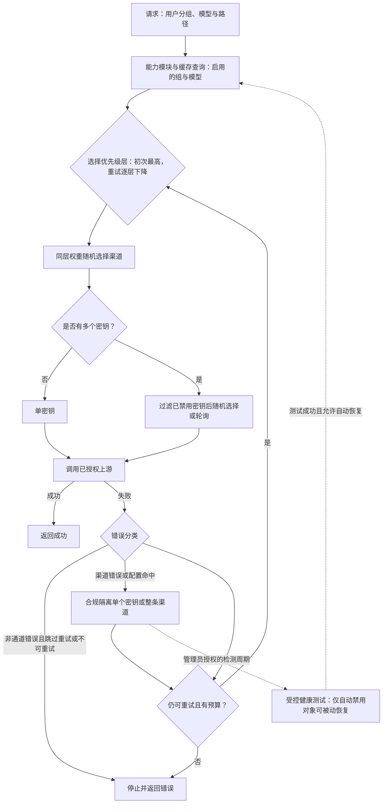

# 通道池路由：把模型请求分解为能力、层级与故障隔离

一个模型名可能同时由多条上游渠道提供，但“都能调用”不等于“可以放进同一个随机池”。渠道所属分组、启用状态和模型能力先决定候选资格；优先级再划分故障转移层；只有同一层内，权重才参与选择。

该网关的可迁移价值不在于代理某一种协议，而在于把路由拆成两级资源池：先选渠道，再在渠道内部选凭据。渠道错误、单个密钥错误与请求本身不可重试的错误因此可以落到不同隔离边界。

**证据范围**：本文以2026-07-23 为来源截断日期，官方说明用于确认产品概念，机制判断固定到`QuantumNous/new-api@1721144221ec5c94dd87891a7ae1bee228e7bb63`。本文不提供规避供应商风控的方法；禁用与恢复只指对已授权凭据的合规隔离、检测和重新纳入。

## 学习问题

1. `Ability`为什么比“渠道支持哪些模型”的配置字段更适合作为请求时索引？
2. 优先级与权重分别控制哪一层决策，为什么不能用权重模拟故障转移？
3. 一次重试如何从当前优先级层转到下一层，它又不保证什么？
4. 多密钥轮询怎样跳过失效凭据，何时会把整条渠道移出能力池？
5. 自动禁用和恢复如何保持合规隔离，而不是演变为绕过上游风控？

## 一页摘要

**已证实事实**：该网关将渠道可服务的`(group, model)`关系展开为`Ability`。启用的能力模块进入候选集；内存缓存按分组和模型维护渠道标识，并跳过非启用渠道。请求路由先查精确模型名，未命中时才尝试规范化模型名。

候选渠道按优先级从高到低分层。初次请求使用最高层，后续可重试轮次使用更低层；同一目标层内再按权重随机选择。选定渠道后，系统才从该渠道的可用密钥中随机选择或顺序轮询。

**个人分析**：这是一条“资格 → 层级 → 分流 → 凭据”的决策链。智能体（Agent）工具网关可以复用该分层，但必须把任务能力、租户授权、数据驻留和副作用等级都放入资格判断，不能只按工具名称建池。

下表回答各配置究竟改变哪一个路由问题：

| 机制| 回答的问题| 状态边界| 不能证明|
| --- | --- | --- | --- |
| 能力模块| 这条渠道能否服务该分组与模型？ | 组、模型、通道、已启用| 上游此刻健康|
| 优先级| 先尝试哪一层？ | 同一候选集的离散层级| 同层流量比例|
| 权重| 同一优先级内选谁？ | 当前进程所见渠道池| 精确长期配额或延迟最优|
| 多密钥模式| 已选渠道内部用哪个密钥？ | 单渠道内的密钥状态与游标| 跨实例全局严格轮询|
| 重试| 失败后是否继续以及进入哪一层？ | 单次请求的有界循环| 恰好一次或副作用安全|
| 禁用与恢复| 哪个故障单元暂时退出或重返候选池？ | 单密钥或整条渠道| 供应商授权已经恢复|

关键判断是：优先级表达故障转移顺序，权重表达同层分流倾向，两者不是可互换的旋钮。

## 事实边界

**已证实事实**：固定提交中的`Ability`主键由组、模型和通道标识组成，同时保存已启用、优先级与权重。渠道创建或更新时会按其分组和模型组合生成能力模块；渠道整体状态变化时，相关能力模块的已启用状态也会更新。

内存缓存路径与直接查库路径并不完全等价。固定提交的内存路径在同优先级内按渠道权重计算随机选择，并对全零或较小权重做平滑；直接查库路径对每条能力模块的配置权重额外加10 后随机。部署是否启用内存缓存会影响精确概率，因而本文只把权重解释为相对选择倾向。

官方渠道文档称多密钥支持轮询和“加权随机”，而固定提交源码中的枚举与实现是`polling`和等概率`random`，未读取每个密钥的权重。版本化实现优先于无固定版本的界面说明；不能据文档名称推导该提交具有密钥级加权算法。

**基于证据的推断**：重试轮次选择的是优先级序号，而非渠道黑名单。一次失败后进入下一优先级层，但当重试序号超过层数时会钳制到最低层；若配置允许更多轮次，最低层可能再次被选择。

**个人分析**：路由成功只说明找到了可调用凭据，不说明响应正确、成本合规或数据可出域。生产设计还需在能力模块之前加入授权、地域、预算与请求类型约束。

  
证据：固定版本、官方概念与差异边界

  - **源码版本：** [`QuantumNous/new-api@1721144221ec5c94dd87891a7ae1bee228e7bb63`](https://github.com/QuantumNous/new-api/tree/1721144221ec5c94dd87891a7ae1bee228e7bb63)，提交时间2026-07-21。
  - **官方说明：** [渠道管理](https://docs.newapi.pro/zh/docs/guide/feature-guide/admin/channel)说明优先级、权重、自动禁用与多密钥；[分组管理](https://docs.newapi.pro/zh/docs/guide/feature-guide/admin/group)说明分组隔离与`auto`分组。
  - **源码锚点：** [`model/ability.go`](https://github.com/QuantumNous/new-api/blob/1721144221ec5c94dd87891a7ae1bee228e7bb63/model/ability.go#L18-L25)、[`constant/multi_key_mode.go`](https://github.com/QuantumNous/new-api/blob/1721144221ec5c94dd87891a7ae1bee228e7bb63/constant/multi_key_mode.go#L3-L8)。
  - **时间边界：** 访问与来源截断日期为2026-07-23。
  - **证明边界：** 在线文档支持产品概念；固定提交支持本文的精确控制流。二者不一致处不合并为虚构能力。

## 架构图

先看两个池如何串联。第一层池以能力模块建立渠道资格，并在优先级层内做权重选择；第二层池只处理已选渠道内部的密钥，单密钥隔离不会立刻淘汰仍有健康密钥的渠道。

一次任务流的关键分叉发生在错误分类之后。隔离负责改变未来候选资格，重试负责决定当前请求是否再走一轮；两者可以同时发生，但含义不同。

### 视觉检查点：资格、选择与恢复

先把选择过程拆成两个池。渠道池负责资格、优先级和权重；密钥池只在已选渠道内部过滤可用凭据。

错误处理也要拆成两个决定：隔离改变未来资格，重试预算只决定当前请求是否继续。

把两者合并成一个“失败就重试”开关，会同时破坏故障隔离和请求预算。

## 控制权与任务流

**说明性场景**：请求携带分组`team-a`与模型`model-x`。能力模块查询得到三条已启用渠道：甲、乙的优先级相同且权重不同，丙位于下一优先级。甲是多密钥渠道，内部有密钥一、密钥二、密钥三，其中密钥二已被自动隔离。

首轮路由只在甲、乙所在的最高优先级层按权重随机，假设选中甲。甲的轮询游标从密钥二开始时会跳过它并选择下一个已启用的密钥三，同时把游标推进到后续位置。这里的“轮询”只描述选择顺序，不承诺并发请求或多实例部署下的全局严格交替。

若密钥三返回被配置为渠道故障的错误，错误处理可把它标为自动禁用。因为密钥一仍启用，甲可以保持渠道级启用；如果最后一个可用密钥也被禁用，甲才转为自动禁用，相关能力模块退出后续候选集。

当前请求是否继续由重试策略单独判定。若错误允许重试且外层循环仍有次数，下一轮按较低优先级索引选择丙，而不是回到甲、乙同层“换一条再试”。只有错误尚未被分类为通道错误时，跳过重试或绑定指定渠道才会在`shouldRetry`的相应分支停止重试；通道错误更早返回真值，但仍受外层重试循环约束，渠道亲和失败的专用停止条件则先于它生效。

该场景只组合固定提交支持的机制，不是事故记录，也不声称每次失败都会命中某个渠道。它揭示的设计判断是：同层负载分配、跨层故障转移和渠道内凭据隔离必须分别建模。

恢复不发生在请求重试路径中。自动测试可在启用自动恢复时检测`auto-disabled`对象；测试无错误后才调用启用逻辑。手工禁用的渠道被自动测试跳过，避免后台任务推翻管理员明确隔离。

## 关键源码导读

最短阅读路径从能力模块的物化开始，再进入渠道池选择，随后查看多密钥取值，最后沿中继错误分支抵达禁用和测试恢复。这样可以区分“谁有资格”“这轮选谁”和“失败后改变什么状态”。

**已证实事实**：`InitChannelCache`只把状态为已启用的渠道放入组与模型索引，并按优先级排序。`GetRandomSatisfiedChannel`先尝试精确模型名，再尝试规范化模型名；它收集离散优先级，以重试作为层级索引，并只在目标层计算权重随机。

`GetNextEnabledKey`在渠道锁内读取密钥状态。随机模式从启用索引中等概率抽取；轮询从保存的游标向后环形扫描，选中后推进游标。没有可用密钥时返回显式渠道错误，不会回退到已经禁用的第一个密钥。

中继在每轮重新选渠道并重新设置请求体，成功立即返回。失败后先记录和处理渠道错误，再由`shouldRetry`按固定顺序判断：渠道亲和失败的停止条件优先；通道错误随后直接允许继续；仅其余错误再检查是否跳过重试、剩余次数、指定渠道和状态码规则。

  
证据：能力模块、渠道选择与请求重试源码接缝

  - [`model/ability.go` 18–25](https://github.com/QuantumNous/new-api/blob/1721144221ec5c94dd87891a7ae1bee228e7bb63/model/ability.go#L18-L25)：能力模块的复合键、启用、优先级与权重。
  - [`model/ability.go` 196–234](https://github.com/QuantumNous/new-api/blob/1721144221ec5c94dd87891a7ae1bee228e7bb63/model/ability.go#L196-L234)：从渠道的组与模型组合生成能力模块。
  - [`model/channel_cache.go` 26–103](https://github.com/QuantumNous/new-api/blob/1721144221ec5c94dd87891a7ae1bee228e7bb63/model/channel_cache.go#L26-L103)：启用渠道的缓存索引、优先级排序与轮询游标保留。
  - [`model/channel_cache.go` 114–208](https://github.com/QuantumNous/new-api/blob/1721144221ec5c94dd87891a7ae1bee228e7bb63/model/channel_cache.go#L114-L208)：模型查找、优先级层与内存路径的权重随机。
  - [`model/ability.go` 63–147](https://github.com/QuantumNous/new-api/blob/1721144221ec5c94dd87891a7ae1bee228e7bb63/model/ability.go#L63-L147)：直接查库路径的优先级与权重选择。
  - [`controller/relay.go` 181–247](https://github.com/QuantumNous/new-api/blob/1721144221ec5c94dd87891a7ae1bee228e7bb63/controller/relay.go#L181-L247)：有界中继循环与每轮错误处理。
  - [`controller/relay.go` 293–355](https://github.com/QuantumNous/new-api/blob/1721144221ec5c94dd87891a7ae1bee228e7bb63/controller/relay.go#L293-L355)：选定渠道、设置上下文与重试判定。
  - **证明边界：** 这些接缝证明该提交的选择顺序，不证明随机分布在任意时间窗口内精确达到配置比例。

多密钥的隔离必须继续读状态写入路径。否则容易误以为任一密钥失败都会禁用整条渠道，或者误以为渠道自动恢复等同于供应商重新授权。

  
证据：多密钥隔离、渠道禁用与受控恢复

  - [`model/channel.go` 199–282](https://github.com/QuantumNous/new-api/blob/1721144221ec5c94dd87891a7ae1bee228e7bb63/model/channel.go#L199-L282)：过滤启用密钥、随机选择、轮询与无可用密钥错误。
  - [`model/channel.go` 647–709](https://github.com/QuantumNous/new-api/blob/1721144221ec5c94dd87891a7ae1bee228e7bb63/model/channel.go#L647-L709)：单密钥状态、禁用原因与全部密钥失效后的渠道级禁用。
  - [`model/channel.go` 712–785](https://github.com/QuantumNous/new-api/blob/1721144221ec5c94dd87891a7ae1bee228e7bb63/model/channel.go#L712-L785)：缓存与数据库状态更新以及能力模块联动。
  - [`service/channel.go` 19–77](https://github.com/QuantumNous/new-api/blob/1721144221ec5c94dd87891a7ae1bee228e7bb63/service/channel.go#L19-L77)：自动禁用、通知与自动启用条件。
  - [`controller/channel-test.go` 903–986](https://github.com/QuantumNous/new-api/blob/1721144221ec5c94dd87891a7ae1bee228e7bb63/controller/channel-test.go#L903-L986)：测试结果触发隔离或恢复。
  - [`controller/channel-test.go` 1018–1029](https://github.com/QuantumNous/new-api/blob/1721144221ec5c94dd87891a7ae1bee228e7bb63/controller/channel-test.go#L1018-L1029)：手工禁用跳过与被动恢复只选自动禁用对象。
  - **合规边界：** 重新启用仅表示平台健康测试通过且本地状态允许恢复；不授权轮换身份、掩盖来源或绕过供应商封禁。

## 架构决策与权衡

**已证实事实**：固定提交将`(group, model, channel ID)`物化为能力模块，并让渠道状态联动能力模块的启停。候选选择先按优先级确定层级，再在同层按权重随机；渠道内则从已启用密钥中选择，单密钥失效与渠道整体禁用分别维护。禁用状态影响后续候选资格，当前请求是否重试由另一段错误处理流程决定。

**个人分析**：基于这些机制，可以把本节的取舍归纳为四个架构决策；“第一个”到“第四个”是本文的分析框架，不是该网关官方给出的决策编号。

第一个决策是物化能力模块，而不是每次解析渠道配置。它把组与模型资格变成直接索引，也让渠道状态变化能统一移出候选池；代价是渠道与能力模块之间存在一致性维护和缓存刷新责任。

第二个决策是优先级先于权重。这样可以把稳定主通道与昂贵备用通道分层，同时让同层渠道分担流量；代价是低优先级容量在高层健康时可能长期闲置，且重试降层会改变价格、延迟或供应商语义。

第三个决策是渠道和密钥两级隔离。单个凭据故障时仍可使用同渠道的其他已授权凭据，减少故障域；代价是需要维护密钥索引、状态、原因、时间和轮询游标，并避免在日志和管理接口中泄露密钥。

第四个决策是把禁用和重试解耦。禁用改变未来流量，重试决定当前请求；这种分离能阻止病态凭据继续进入池，却要求错误分类足够保守。把请求格式错误误判为渠道错误会造成健康容量被隔离，把授权错误误判为瞬时错误则会放大失败。

**基于证据的推断**：下表给出这些机制适用的前置条件；条件与代价是从固定实现推导的部署判断，不是项目对所有场景的保证。

| 决策| 适用条件| 主要收益| 必须接受的代价|
| --- | --- | --- | --- |
| 能力模块物化| 能力可由稳定维度描述| 快速资格查询、统一启停| 派生索引一致性|
| 优先级分层| 备用层确有成本或可靠性差异| 明确故障转移顺序| 备用容量利用率较低|
| 同层权重| 候选功能等价但容量不同| 粗粒度分流| 随机波动与实现差异|
| 多密钥池| 多个凭据属于同一合规主体与用途| 缩小凭据故障域| 状态、审计和密钥治理复杂度|
| 自动恢复| 存在受控、低副作用的健康探针| 缩短人工恢复时间| 探针可能误判，必须保留人工覆盖|

**个人分析**：不能把权重当并发限制。随机选择不会感知实时排队、剩余额度或尾延迟；这些约束需要独立的令牌桶、并发闸门、配额观察和熔断状态。

## 生产化分析

**已证实事实**：固定提交会从渠道的组与模型组合生成能力模块；渠道状态更新会联动能力模块，内存缓存只索引启用渠道，并按组与模型维护候选渠道标识。

**基于证据的推断**：能力模块是数据库派生资格，内存缓存又是第二份运行时索引，因此生产环境需要验证两者的一致性。渠道更新组、模型、优先级、权重或状态后，两份索引应在可接受窗口内收敛；监控需要区分“无能力模块”“能力模块已禁用”“缓存尚未刷新”和“选中后上游失败”。

**个人分析**：路由观测至少记录请求的组、原始模型、规范化模型是否命中、目标优先级、渠道标识、重试序号与结果分类。多密钥只记录不可逆的密钥指纹或索引，不能记录完整凭据；禁用原因也应经过敏感信息裁剪。

权重校验应做分布测试而非单次断言。验证目标是同层候选都能被选中、零权重组合不会崩溃、不同缓存模式的差异已被接受；不要把短窗口随机偏差当故障，也不要承诺固定请求比例。

重试预算必须同时约束次数、截止时间、请求体可重放性与副作用。聊天补全等读取式调用通常能重新发送，但已开始的流、异步任务创建或带外工具调用可能已产生结果；结果不确定时应标记`Unknown`并对账，而不是盲目换渠道。

自动禁用需要单独统计通道错误、跳过重试、状态码规则和关键字规则命中。关键字匹配容易受上游文案变化影响，适合触发隔离与人工检查，不适合推导永久性账号结论。

恢复路径必须是合规控制面。只对平台自动禁用、仍属于当前主体且用途未变的凭据做受控健康测试；供应商明确撤销授权、账号停用、合规审查或人工禁用时，保持隔离并由管理员处理。禁止通过替换身份、轮换来源、隐藏流量或反复试探来规避上游风控。

**基于证据的推断**：固定提交用进程内互斥锁保护单渠道轮询游标和状态映射；该锁不跨实例。多实例共享数据库时，轮询更接近“每实例观察下的尽力顺序”，不能作为全局公平、配额精算或严格一次轮换的基础。

**个人分析**：故障注入应覆盖最高优先级返回可重试错误、同层渠道权重全零、单密钥或全部密钥自动禁用。还应覆盖手工禁用对象进入测试周期，以及响应成功但本地测试失败。每项都分别断言当前请求终态、未来候选集与审计记录。

## 可迁移经验

### 可直接复用的机制

1. 用显式能力模块索引连接租户或分组、能力名、执行通道与启用状态。
2. 先按合规资格过滤，再用优先级表达故障转移层，只在同层做权重分流。
3. 把通道资源池与通道内部凭据池分开，故障状态落在最小可证明的单元。
4. 将隔离、当前请求重试和健康恢复设计成三条独立状态转换。
5. 为手工禁用保留高于自动恢复的控制权，并记录原因、时间和操作者。
6. 在每次重试前重新选择和重新验证资格，同时携带统一预算与截止时间。

### 只能有限类比的部分

1. 模型名是较稳定的能力键；智能体工具还需参数模式、权限、数据域与副作用等级。
2. 渠道权重适合粗粒度分流，不等价于容量感知调度、最小延迟或配额保证。
3. 密钥轮询适合同一合规主体下的合法凭据，不适用于跨账号规避限制。
4. 超文本传输协议（Hypertext Transfer Protocol，HTTP）状态与关键字能辅助错误分类，但智能体工具还需要结构化结果、幂等键和补偿协议。
5. 自动健康测试能检测连通性，不证明内容质量、政策许可或下游业务正确。

### 不应照搬的部分

1. 不要把优先级数字解释为成功概率，也不要用极大权重绕开资格过滤。
2. 不要假设重试必然换到不同渠道；应显式建模已尝试集合或接受实现语义。
3. 不要把随机选择当严格配额，不要把进程内轮询当跨实例全局顺序。
4. 不要对不可重放、已产生副作用或结果未知的调用自动换渠道重试。
5. 不要让自动恢复覆盖手工隔离、供应商撤权或合规冻结。
6. 不要用多密钥、代理或来源切换规避上游封禁、速率限制、身份校验或使用政策。

## 来源

**官方产品说明（已证实事实）**

- [渠道管理](https://docs.newapi.pro/zh/docs/guide/feature-guide/admin/channel)：渠道优先级、同层权重、自动禁用、多密钥与管理操作。访问与截断日期：2026-07-23。
- [分组管理](https://docs.newapi.pro/zh/docs/guide/feature-guide/admin/group)：用户、令牌和渠道分组隔离，以及`auto`分组概念。访问与截断日期：2026-07-23。

**固定上游源码（已证实事实）**

- [`QuantumNous/new-api@1721144221ec5c94dd87891a7ae1bee228e7bb63`](https://github.com/QuantumNous/new-api/tree/1721144221ec5c94dd87891a7ae1bee228e7bb63)：2026-07-23 解析的固定提交；提交时间2026-07-21。
- [`model/ability.go`](https://github.com/QuantumNous/new-api/blob/1721144221ec5c94dd87891a7ae1bee228e7bb63/model/ability.go)与[`model/channel_cache.go`](https://github.com/QuantumNous/new-api/blob/1721144221ec5c94dd87891a7ae1bee228e7bb63/model/channel_cache.go)：能力模块物化、缓存索引、优先级层与权重选择。
- [`service/channel_select.go`](https://github.com/QuantumNous/new-api/blob/1721144221ec5c94dd87891a7ae1bee228e7bb63/service/channel_select.go)与[`controller/relay.go`](https://github.com/QuantumNous/new-api/blob/1721144221ec5c94dd87891a7ae1bee228e7bb63/controller/relay.go)：分组选择、请求循环、错误处理与重试判定。
- [`model/channel.go`](https://github.com/QuantumNous/new-api/blob/1721144221ec5c94dd87891a7ae1bee228e7bb63/model/channel.go)与[`service/channel.go`](https://github.com/QuantumNous/new-api/blob/1721144221ec5c94dd87891a7ae1bee228e7bb63/service/channel.go)：多密钥选择、状态隔离、自动禁用与启用条件。
- [`controller/channel-test.go`](https://github.com/QuantumNous/new-api/blob/1721144221ec5c94dd87891a7ae1bee228e7bb63/controller/channel-test.go)：自动测试、手工禁用边界与被动恢复路径。

**证据边界说明**：`已证实事实`可由官方说明或固定提交定位；`基于证据的推断`从实现控制流推导部署含义；`个人分析`是迁移判断。本文没有虚构客户、事故、指标或供应商保证，也不把平台测试成功解释为供应商授权恢复。
