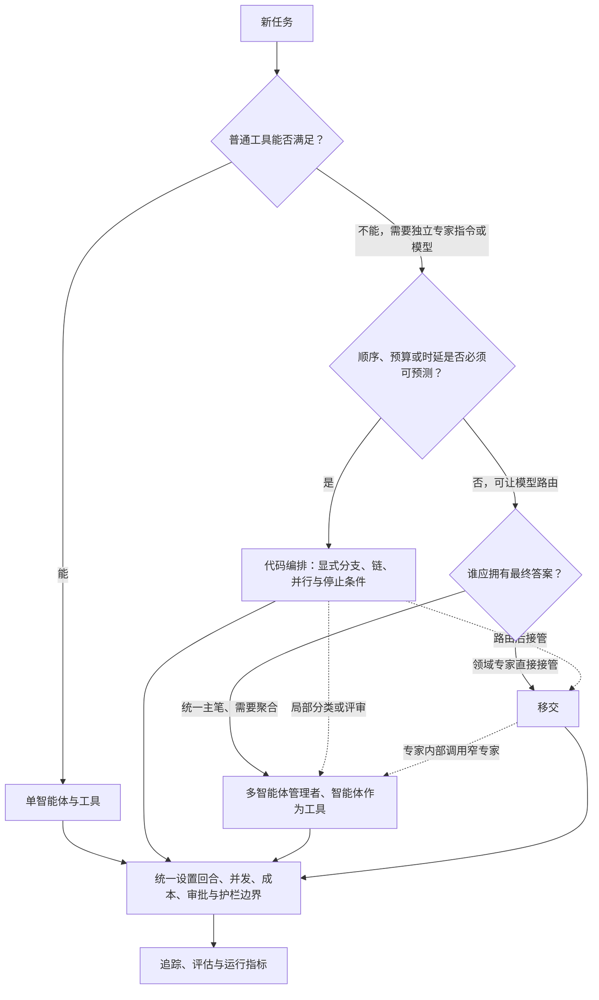

# 小型多智能体系统的控制权模型

同一个专家智能体，可以被管理者当成工具调用，也可以通过移交接管对话。两种写法看起来都像“把任务交给专家”，用户关系和失败后果却完全不同：前者把结果送回父运行，后者移动当前活动智能体。

因此，多智能体模式首先是控制权选择。最终答案由谁写、历史传给谁、谁能继续下一轮、哪一层负责停止和审批，应该先于拓扑和应用程序编程接口（Application Programming Interface，API）的便利性决定。

一个固定的软件开发工具包（Software Development Kit，SDK）提交足以核对活动智能体如何移动，却不足以替应用决定业务后果。版本、文件与符号由证据卡定位；移交、工具副作用、护栏缺口和人工恢复在正文中逐层判断。

## 学习问题

1. 管理者调用专家智能体与移交到专家智能体，在用户可见行为上有什么根本差异？
2. 会话历史、当前活动智能体和最终答案分别由谁拥有，怎样跨调用移动？
3. 哪些决策适合交给模型，哪些应保留在确定性代码、护栏或人工审批边界？
4. 如何限制智能体循环（Agent Loop）、评审循环和并行扇出，避免成本、时延与失败范围失控？
5. 什么时候组合多种模式，什么时候一个智能体加工具反而是更好的架构？

## 一页摘要

先区分“委派一项工作”和“交出对话”。这正是智能体作为工具与移交的分界。

**已证实事实**：智能体作为工具让管理者调用专家智能体的嵌套运行。结果回到父运行，管理者继续持有当前活动智能体的指针并合成最终答案。移交则更新`current_agent`；接收者继续本次运行，并可成为后续用户轮次的起始智能体。

两者都不自动决定跨轮历史存在哪里。应用仍要选择客户端历史、会话、对话或响应续接；`current_agent`、历史持久化与可恢复执行快照不能混为一种“状态”。

**基于证据的推断**：代码编排提供第三种控制配置。它把顺序、分支、并发、停止条件和预算上移到应用层，模型只在被允许的局部做分类、生成或评审。

| 模式| 谁选择下一步| 谁持有活动智能体与对话控制| 谁产出最终答案| 跨轮历史由谁持久化| 主要优势| 主要代价|
| --- | --- | --- | --- | --- | --- | --- |
| 管理者与智能体作为工具| 管理者大语言模型| 父运行中的管理者| 管理者| 应用选择的历史与会话与对话策略；嵌套运行默认不继承| 可聚合多个专家、统一口径和护栏| 管理者多一次合成调用，嵌套运行增加成本|
| 移交| 当前智能体的大语言模型选择目的地| 接收智能体成为`current_agent` | 最后活动的专家智能体| 仍由运行与应用所选策略负责，可共享或过滤历史| 专家提示更聚焦，减少管理者转述| 路由错误更直接，历史与护栏边界更复杂|
| 代码驱动编排| 应用代码；局部可用大语言模型分类| 应用显式指定| 应用指定的最后一步或聚合器| 应用显式选择| 显式边界可提高顺序、预算与停止条件的可预测性| 工作流较僵硬；额外调用和并行仍可能增加成本|

**个人分析**：需要统一主笔时用智能体作为工具；专家应直接接管时才用移交；路径与预算必须可证明时由代码编排。没有独立专业职责时，单智能体加普通工具仍是默认起点。

## 事实边界

事实边界先把三个容易混淆的对象拆开：活动智能体是运行内控制指针，会话与对话是跨轮历史策略，`RunState`是暂停与恢复快照。它们可以协作，但不会自动互相替代。

### 已证实事实

`Agent`由指令、工具、移交等能力组成。移交在模型侧表现为转移工具，但运行器执行后会更新当前智能体；普通工具只把结果追加回原运行。

运行器得到最终输出就结束，遇到移交就更新智能体与输入，遇到工具调用则执行并继续。`max_turns`超限会抛出`MaxTurnsExceeded`；显式传`None`才会取消这项单次运行限制。

`Agent.as_tool()`启动嵌套运行并把结果返回管理者。父运行的会话状态不会自动传给嵌套运行；共享客户端历史需要显式传同一会话，且一次运行应只选择一种状态策略。

移交默认让接收智能体看到此前历史，`input_filter`可以改变转交内容。嵌套历史摘要是选择启用的测试功能，默认关闭；启用后才会使用`handoff_history_mapper`替换规范化历史。

SDK 支持应用维护的输入列表、会话、对话 API 和响应续接四类跨轮策略。官方建议一次对话只选一种，避免重复上下文。

智能体级输入护栏只检查链首，输出护栏只检查链尾。工具护栏只覆盖`function_tool`，不覆盖移交、托管式与内置工具，也不直接包住`Agent.as_tool()`包装器。

需要审批的工具可以暂停运行，以`RunState`持久化后批准或拒绝再恢复。这一中断面可以出现在移交之后，也可以出现在嵌套智能体内；恢复前仍要重新校验权限和副作用状态。

### 基于证据的推断

管理者保持父运行控制，不等于它拥有历史持久化，也不等于专家智能体没有状态。嵌套智能体可有自己的会话、回合上限和追踪记录；区别在于输出回到工具结果通道，最终叙述仍由管理者决定。

移交移动的是运行内控制指针，不一定跨服务或进程。部署边界是另一项架构选择，不能从 API 名称推出。

`max_turns`只约束一次运行器调用，不限制应用`while`、并行扇出、重试（Retry）或多个嵌套智能体的总令牌。生产预算必须覆盖全部层级。

追踪能解释行为，不等于质量已验证。只有把追踪记录与任务评估、路由准确率、完成率、成本和人工升级关联，才能形成发布闭环。

### 个人分析与未知项

SDK 不替应用决定服务等级目标、令牌预算、重试、幂等、租户隔离、数据保留或审批政策。示例证明模式存在，不证明默认值适合生产；把普通函数包装成智能体还会新增模型调用与不确定性。

  
证据：固定版本与官方实现范围

  - **来源截断：** `2026-07-20`
  - **分支：** 核对时为`main`
  - **固定提交：** `openai/openai-agents-python@2fa463571e76dae8ff267622f1018eaf06ffeb9f`
  - **实现入口：** `src/agents/run.py`、`agent.py`、`handoffs/__init__.py`、`run_state.py`
  - **边界：** 固定提交支持本文的运行语义，不证明后续 API、默认行为或部署效果。

  
证据：代码编排、追踪与状态策略的官方覆盖

  - **代码编排示例：** 结构化分支、串行链、评估循环与`asyncio.gather`并行独立任务。
  - **跨轮状态：** `result.to_input_list()` / `to_input_list()`、`session`、`conversation_id`、`previous_response_id`。
  - **移交历史：** `nest_handoff_history`为选择启用的测试功能；启用后才使用`handoff_history_mapper`。
  - **追踪：** 运行器、智能体、生成、函数、护栏与移交跨度；可用`workflow_name`、`trace_id`、`group_id`和元数据关联。
  - **敏感数据：** 模型和函数输入输出可能进入追踪记录，可通过运行配置关闭采集。
  - **边界：** 示例不提供任务级成本上限、业务幂等或质量保证；追踪记录也不替代评估。

## 架构图

先看一次运行器调用内部怎样推进：模型何时继续调用工具，何时结束，以及回合上限究竟约束哪一层。

图中的虚线只框住一次运行。`max_turns`可以终止这次运行器调用，但不会替应用限制外层循环、重试、并行扇出或多个嵌套运行。

再问谁应拥有下一句用户可见答复，以及路径是否必须由代码证明。下图不是 SDK 强制拓扑；虚线表示模式可以组合，不表示控制权会自动返回。

读图后的决策顺序是：

1. 先问普通工具是否足够；若工具只需执行确定性函数或 API，不创建第二个智能体。
2. 若专家确实需要独立指令、模型或输出契约，再看流程是否有严格的成本、时延、顺序或合规边界；有则把主流程写在代码里。
3. 若允许大语言模型路由，再问最终答案由谁负责：需要统一主笔、对比或聚合多个专家，使用智能体作为工具；需要领域专家直接接管后续对话，使用移交。
4. 模式可以组合，但每层都要有自己的回合、并发、成本、审批和失败边界，并由同一条追踪记录与评估体系串起来。

## 控制权与任务流

**说明性场景｜一个支持请求被识别为领域问题，处理过程中可能调用有写副作用的工具。** 该场景只组合 SDK 已支持的路由、嵌套运行、审批和恢复机制，不代表真实客户或事故。

先沿两条路径检查同一个专家智能体的结果去向：左侧是否移动活动智能体，右侧是否把结果送回管理者。

两条路径的分界不是“有没有专家”，而是专家是否成为`current_agent`。移交让专家智能体直接继续对话；智能体作为工具只委派窄任务，最终答复仍由管理者负责。

[智能体循环](/concepts/agt-c-03)提供比较这些运行器回合的计划、行动、观察、评估与终止框架；[多智能体控制权模式](/patterns/agt-p-06)进一步把这里的实现差异抽象为三种控制所有权合同。链接用于比较责任，不表示 SDK 自动实现该通用合同。

如果分诊智能体使用移交，领域专家智能体成为`current_agent`，看到经筛选的历史并直接答复。下一轮是否仍从它开始，取决于应用是否把`result.current_agent`作为起始智能体；控制不会自动回到分诊。

如果分诊智能体把同一专家智能体作为工具调用，嵌套结果回到父运行。管理者可以再调用其他专家并统一口径，最终答案仍由管理者生成；专家智能体不会因为被调用就接管下一轮。

无论采用哪种模式，写工具都应在副作用附近校验参数、权限和幂等键。审批中断后恢复时，旧调用可能已经产生外部效果；`RunState`能保存执行快照，不能证明远端操作未发生。

### 管理者与智能体作为工具

**已证实事实**：管理者的`tools`列表包含由`specialist.as_tool()`生成的工具。管理者大语言模型决定调用哪个专家智能体；嵌套运行器完成后，结果作为工具输出返回父运行；管理者随后继续推理并生成`final_output`。多个翻译专家智能体的官方示例展示了管理者可调用多个工具后统一回答。

控制与状态路径可写成：

`用户输入 → manager 会话 → specialist 工具调用参数 → 独立嵌套运行 → specialist 结果 → manager 会话 → manager 最终答案`

专家智能体通常对用户保持隐藏：它不是后续对话的`current_agent`，只是内部能力。嵌套流式传输和追踪记录可以展示进度，但那是界面选择，不是控制转移。需要父历史时必须显式构建输入或共享合适会话，不能假设自动继承。

### 移交

**已证实事实**：移交发生时，运行器更新当前智能体与输入并继续循环。接收智能体默认看到之前的会话历史；官方路由示例在下一轮把`result.current_agent`作为起始智能体，因此接管可延续到后续用户轮次。最后活动智能体的最终输出成为本次运行结果。

控制与状态路径可写成：

`用户输入 → triage agent → handoff 调用与可选元数据 → 更新 current_agent / 过滤或保留历史 → specialist 直接回答 → 后续轮次继续从该 specialist 开始`

专家智能体从内部候选变成活动智能体。`input_type`只给移交调用增加结构化元数据，不会替换接收智能体的主输入，也不会动态选择目的地。历史裁剪应在`input_filter`或运行配置中完成；移交原因不是上下文隔离。

### 代码驱动编排

**已证实事实**：官方示例用普通代码控制流把多个`Runner.run()`串起来：结构化评估器输出决定是否继续，`while`控制改进循环，`asyncio.gather`并发运行独立候选，再把候选交给选择器。最终答案属于代码明确选定的最后一步或聚合器，而不是由一个隐含的活动智能体自动决定。

**个人分析**：代码外壳适合分类集合稳定、步骤依赖明确、合规顺序不可变的工作流。模型负责理解和生成，代码负责允许的步骤、轮数、并发和失败路径。

显式上限只有真正替代无界路径时，才可能降低平均成本和尾延迟方差。额外候选或并行扇出也会反向增加成本，所以必须用任务级分布实测，不能从“流程写在代码里”直接推导收益。

### 组合模式

一个稳健的组合可以是：代码先执行身份校验与确定性路由；领域智能体通过移交接管用户；领域智能体再把检索、翻译或审阅作为智能体作为工具的窄任务；不可逆工具在执行前触发审批。这里的关键不是“用了三种模式”，而是每次控制权转移都有明确所有者、输入契约、预算与失败返回点。

## 关键源码导读

源码阅读只需要追踪三条线：运行器何时移动`current_agent`，`Agent.as_tool()`如何把结果送回父运行，审批中断如何进入`RunState`。这三条线分别回答接管、委派和恢复。

先读`docs/multi_agent.md`建立分类，再从`src/agents/run.py`跟随最终输出、移交和工具分支。随后对照`agent.py`与`handoffs/__init__.py`；只有需要暂停恢复时才继续到`run_state.py`、护栏和人在回路文档。

读完后应能画出三个对象：`current_agent`是控制指针，对话与会话是历史策略，`RunState`是执行快照。把它们统称为“状态”，会产生移交永久改写会话或共享会话等于最小上下文之类的错误设计。

  
证据：完整源码与示例阅读路径

  1. `docs/multi_agent.md`：大语言模型与代码编排、智能体作为工具与移交分类。
  2. `docs/running_agents.md`、`src/agents/run.py`：智能体循环、`final_output`、移交、工具、`max_turns`与状态策略。
  3. `docs/tools.md`、`src/agents/agent.py`：`Agent.as_tool()`、嵌套状态、结构化输入、流式传输与审批。
  4. `docs/handoffs.md`、`src/agents/handoffs/__init__.py`：`HandoffInputData`、`input_type`、`input_filter`、动态启用与历史嵌套。
  5. `src/agents/run_state.py`与状态文档：输入列表、会话、对话、前一项响应与暂停恢复。
  6. `docs/guardrails.md`、`docs/human_in_the_loop.md`、`docs/tracing.md`：覆盖范围、中断、敏感数据与处理器。
  7. `examples/agent_patterns/agents_as_tools.py`、`routing.py`：结果返回管理者与专家智能体接管。
  8. `examples/agent_patterns/deterministic.py`、`parallelization.py`、`llm_as_a_judge.py`：显式链、扇出与评估循环；不要复制无界`while True`。
  9. `examples/agent_patterns/human_in_the_loop.py`、`agents_as_tools_conditional.py`：动态能力、智能体工具审批与外层恢复。

  - **边界：** 示例证明 SDK 组合方式，不证明生产退出条件、预算或工具副作用已经安全。

## 架构决策与权衡

每个决策都回到同一问题：控制权移动后，谁负责最终答案、历史、预算与失败恢复？

### 最终答案所有权

智能体作为工具适合“一个总编辑、多个研究员”：管理者可以比较、纠错、统一风格和隐藏内部组织变化。代价是专家智能体已经生成内容后，管理者还要重新读取并合成，增加令牌、延迟与信息损失。

移交适合“前台分诊、专家坐席”：专家智能体不必让管理者转述，提示上下文更专一，也更容易维持领域身份。代价是用户体验、输出护栏和错误恢复都跟随最后活动智能体；错误路由会直接把对话交给不合适的专家。

### 模型自治还是代码控制

模型路由适合开放式任务和难以穷举的意图，能在少量代码下获得适应性；但每个决策都受提示、模型版本和上下文影响。代码路由适合有限枚举、严格顺序、固定审批和可计算预算；代价是新分支必须实现、测试和部署。

**基于证据的推断**：常见最佳点是“确定性骨架与局部模型判断”。例如模型输出结构化分类，代码验证枚举后选择智能体；模型生成三个候选，代码限制并行数并交给一次评估器；模型建议执行写操作，代码检查策略并触发人工审批。

### 状态共享还是上下文隔离

完整历史有利于连贯，但会增加令牌、敏感数据暴露和提示污染。智能体作为工具默认不继承父运行状态，天然鼓励窄输入；移交默认携带完整历史，更适合连续对话，但生产中应根据领域最小化。一次运行只选一种跨轮持久化策略，避免客户端历史与服务端续接重复。

### 串行、并行与循环

- 串行链最容易表达依赖与审计，但各步骤时延相加。
- 并行适合真正独立的子任务或多候选择优；必须设置扇出、并发、总截止时间和部分失败策略。
- 评估循环可提高质量；必须设置最大轮数、最低改进幅度、总令牌与费用预算和降级输出。SDK 的`max_turns`不能替代应用循环上限。
- 提供方的并行工具调用与`max_function_tool_concurrency`是不同控制面：前者影响模型一次响应能否发出多个调用；后者只限制**同一个模型回合发出的、本地执行的函数工具调用**。它不限制应用层`asyncio.gather`、多个并行`Runner.run()`或跨运行扇出；这些必须由应用自己的信号量与任务上限、总截止时间和取消策略约束。

### 护栏与审批边界

先检查两条边界是否被误画成一条：上方是 SDK 运行链首与链尾的检查，下方是写副作用发生前的业务行动门。

输入或输出护栏通过，不证明调用者有业务权限，也不证明远端副作用尚未发生。权限、审批、幂等键与外部状态复核仍应靠近写操作，并在恢复执行前重新校验。

智能体输入与输出护栏只覆盖链首与链尾，不能假设每个移交智能体都自动执行两端检查。由`function_tool`创建的函数工具可使用工具护栏做参数与结果校验；这套处理链不覆盖移交调用、托管式与内置工具或`Agent.as_tool()`包装器本身，必须按各自接口补策略或审批。

不可逆、付费、外发或高权限工具应在最接近副作用的位置要求审批。`Agent.as_tool()`本身可要求审批，内部工具还可再次中断；这两层分别控制“是否委派”和“是否行动”。

## 生产化分析

生产检查不应只数智能体和工具调用。首先要能重建控制指针为何移动，再确认副作用是否获权、是否发生，以及失败后由谁接管。

### 可观测性与评估

**已证实事实**：SDK 默认追踪记录可记录智能体、生成、函数、护栏和移交跨度，并能用`group_id`关联同一对话的多个追踪记录。生产命名至少应稳定区分工作流、路由版本和租户与环境；敏感输入输出不应因默认采集而未经审查进入追踪记录。

下表回答追踪记录之外还要测量什么：

| 维度| 指标| 用途|
| --- | --- | --- |
| 路由| 移交与工具智能体选择准确率、回退率、错误专家率| 判断是否值得让大语言模型路由|
| 质量| 任务完成率、结构化校验通过率、人工纠正率、评估分数| 比较模式与提示版本|
| 成本| 每任务模型调用数、令牌、工具费用、嵌套运行占比| 识别管理者重复合成与循环膨胀|
| 时延| 端到端及各跨度的中位数、百分之九十五分位和百分之九十九分位时延、队列与审批等待| 区分模型、工具、并行和人工瓶颈|
| 安全| 护栏触发次数、审批拒绝、越权工具尝试、敏感追踪记录关闭率| 验证策略是否真正执行|

评估应包含单步能力测试、路由数据集和端到端任务。仅评最终文本会掩盖“走错专家但碰巧答对”、不必要工具调用和成本退化；仅看追踪记录则无法判断回答是否有用。发布门禁应同时比较质量、安全、成本和时延基线。

### 失败模式与遏制

移交的失败会改变用户接触的智能体，智能体工具的失败则返回父运行。两者都可能在内部工具处产生副作用，因此遏制点不能只放在链首和链尾。

| 失败模式| 典型表现| 遏制方式|
| --- | --- | --- |
| 管理者忘记调用或过度调用专家| 凭空回答、重复嵌套运行| 明确工具说明、结构化任务、调用计数与评估；必要时改代码路由|
| 移交错路由或来回转移| 专家不匹配、上下文膨胀、回合耗尽| 动态启用候选、记录原因、限制移交次数、提供安全回退智能体|
| 父子运行状态误配| 专家缺上下文或重复上下文| 显式输入契约；每次运行选择一种状态策略；测试多轮恢复|
| 无界评估循环| 成本与时延失控| 最大轮数、总预算、截止时间、无改进退出与可接受降级|
| 并行扇出过大| 限流、下游拥塞、费用尖峰| 应用信号量与任务上限、总截止时间、取消策略与隔离舱；SDK 本地函数工具上限只处理单回合局部并发|
| 护栏覆盖误判| 中间智能体或托管式工具未被检查| 按官方覆盖边界布置函数工具护栏、策略网关与审批|
| 审批恢复失败| 重复副作用、旧定义无法反序列化| 持久化调用标识与幂等键；保存智能体与 SDK 版本；执行前再校验|
| 追踪记录泄露敏感数据| 提示、工具参数或结果进入遥测| 关闭敏感采集、脱敏、自定义处理器、分级保留与访问控制|

### 适用范围

适合多智能体的信号：领域提示明显冲突；专家使用不同模型或输出类型；需要独立评估和演进；一个主笔必须聚合多个并行研究；或用户确实需要从分诊切换到持续服务的领域坐席。

更适合单智能体加工具的信号：只有一个用户角色与答案口径；“专家”只是查数据库或调用 API；任务路径短；延迟与成本预算紧；团队尚无稳定评估；或增加智能体只是在重命名函数。单智能体仍可使用结构化输出、护栏、审批、会话和追踪，不需要为了这些能力引入第二个智能体。

上线前必须回答：最大模型回合、应用循环和移交次数分别是多少？并行扇出与工具并发是多少？谁能看到完整历史？哪些副作用需要人工批准？哪种状态策略是唯一事实源？超时后返回部分结果、回退单智能体还是转人工？这些答案应落入代码与监控，而不只写在提示词中。

## 可迁移经验

迁移这套设计时，复制的是“谁持有控制”的判定方法，不是某个示例拓扑。

### 可直接复用的机制

1. **先决定最终答案所有权。** 统一主笔用智能体作为工具；专家直接接管才用移交。
2. **分开设计三种状态。** `current_agent`、会话与对话与`RunState`分别负责控制、历史和恢复。
3. **用确定性代码包住硬边界。** 身份、许可、预算、最大循环、并发、结构校验和副作用顺序不只靠提示。
4. **在副作用处审批。** 委派审批与行动审批是两条边界；恢复前再次核对幂等键和外部状态。

### 只能有限类比的部分

1. **移交是运行内控制转移。** 它可以映射到组织或服务交接，但 API 本身不证明跨进程部署或永久坐席关系。
2. **智能体工具是嵌套运行。** 窄输入有利于隔离，但独立会话、回合和追踪记录仍需应用显式设计。
3. **代码编排提高显式性。** 它只有在真的限制分支、轮数和并发时才提高可预测性，额外调用仍可能增加尾延迟。
4. **追踪记录与评估相互补充。** 追踪记录解释路径，评估判断质量；两者都不代替业务授权。

### 不应照搬的部分

1. **不要把完整历史默认交给所有智能体。** 移交用过滤器与历史映射器，智能体工具用窄结构化输入传最小必要信息。
2. **不要用`max_turns`代表总预算。** 运行器、嵌套运行、应用循环、重试与扇出必须汇总到任务级上限。
3. **不要假设护栏自动覆盖中间环节。** 移交、托管式工具、内置工具和智能体工具包装器各自补策略。
4. **不要把第二个模型调用当成专业分工。** 没有独立推理职责时删除第二个智能体，保留普通工具。

## 来源

以下均为官方文档或官方上游仓库。访问日期与来源截断日期：**2026-07-20**；仓库链接尽量固定到提交**`2fa463571e76dae8ff267622f1018eaf06ffeb9f`**。

### 主要架构

- [Agent orchestration 官方指南](https://openai.github.io/openai-agents-python/multi_agent/) 与 [固定提交文档](https://github.com/openai/openai-agents-python/blob/2fa463571e76dae8ff267622f1018eaf06ffeb9f/docs/multi_agent.md) — 大语言模型编排、智能体作为工具、移交、代码编排及组合原则。
- [OpenAI Agents SDK 官方仓库](https://github.com/openai/openai-agents-python/tree/2fa463571e76dae8ff267622f1018eaf06ffeb9f) — SDK 定位、核心概念、源码与官方示例入口。
- [Tools / Agents as tools](https://github.com/openai/openai-agents-python/blob/2fa463571e76dae8ff267622f1018eaf06ffeb9f/docs/tools.md#agents-as-tools) — 管理者模式、嵌套运行状态、回合限制、结构化输入、输出提取、流式传输与审批。
- [Handoffs](https://github.com/openai/openai-agents-python/blob/2fa463571e76dae8ff267622f1018eaf06ffeb9f/docs/handoffs.md) — 控制转移、移交元数据、输入过滤、历史传递和护栏边界。

### 源码

- [Running agents](https://github.com/openai/openai-agents-python/blob/2fa463571e76dae8ff267622f1018eaf06ffeb9f/docs/running_agents.md) 与 [`Runner` 源码](https://github.com/openai/openai-agents-python/blob/2fa463571e76dae8ff267622f1018eaf06ffeb9f/src/agents/run.py) — 运行循环、`max_turns`、并发工具执行、状态策略与追踪记录配置。
- [`Agent.as_tool()` 源码](https://github.com/openai/openai-agents-python/blob/2fa463571e76dae8ff267622f1018eaf06ffeb9f/src/agents/agent.py#L508)与 [`Handoff` 源码](https://github.com/openai/openai-agents-python/blob/2fa463571e76dae8ff267622f1018eaf06ffeb9f/src/agents/handoffs/__init__.py#L98) — 两种控制模型的实现入口。
- [Human-in-the-loop](https://github.com/openai/openai-agents-python/blob/2fa463571e76dae8ff267622f1018eaf06ffeb9f/docs/human_in_the_loop.md) 与 [`RunState` 源码](https://github.com/openai/openai-agents-python/blob/2fa463571e76dae8ff267622f1018eaf06ffeb9f/src/agents/run_state.py#L208) — 跨移交与嵌套运行的审批中断、持久化和恢复。

### 补充说明

- [Guardrails](https://github.com/openai/openai-agents-python/blob/2fa463571e76dae8ff267622f1018eaf06ffeb9f/docs/guardrails.md) — 链首输入、链尾输出、函数工具护栏和并行与阻塞执行差异。
- [Tracing](https://github.com/openai/openai-agents-python/blob/2fa463571e76dae8ff267622f1018eaf06ffeb9f/docs/tracing.md) — 默认跨度、对话关联、敏感数据和自定义处理器。
- [Agent patterns 目录](https://github.com/openai/openai-agents-python/tree/2fa463571e76dae8ff267622f1018eaf06ffeb9f/examples/agent_patterns) — [Agents-as-Tools](https://github.com/openai/openai-agents-python/blob/2fa463571e76dae8ff267622f1018eaf06ffeb9f/examples/agent_patterns/agents_as_tools.py)、[Handoff routing](https://github.com/openai/openai-agents-python/blob/2fa463571e76dae8ff267622f1018eaf06ffeb9f/examples/agent_patterns/routing.py)、[deterministic flow](https://github.com/openai/openai-agents-python/blob/2fa463571e76dae8ff267622f1018eaf06ffeb9f/examples/agent_patterns/deterministic.py)、[parallelization](https://github.com/openai/openai-agents-python/blob/2fa463571e76dae8ff267622f1018eaf06ffeb9f/examples/agent_patterns/parallelization.py) 与 [LLM-as-a-judge](https://github.com/openai/openai-agents-python/blob/2fa463571e76dae8ff267622f1018eaf06ffeb9f/examples/agent_patterns/llm_as_a_judge.py) 的可运行示例。

判断一个专家智能体应该“接管”还是“返回结果”，要在它第一次运行前完成。控制权归属一旦清楚，历史裁剪、护栏、审批、预算和恢复位置才有一致答案。
