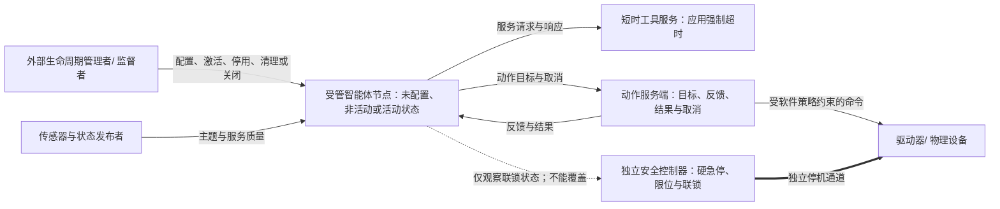

# 物理任务通信语义与受管生命周期

移动机器人还在驶向目标点，调度器却收到撤回任务的请求。此时传感器数据仍要继续流动，配置查询仍要快速返回，长任务则必须报告进度、接受取消并确认真实终态；把三者都当成一种“消息”，会让控制权和失败含义一起消失。

ROS 2用主题、服务、动作分开表达持续数据、短请求响应和长任务。数据分发服务QoS、执行器、回调组与受管节点再约束交付、调度和运行状态。可迁移的判断不是“选一种机器人操作系统接口”，而是先问：谁持有任务状态，谁能请求停止，谁能确认物理效果。

本文只讨论 ROS 2 Jazzy 长期支持发行版（Jazzy Jalisco）的基础概念及固定证据截面，详细标签、提交、文件与符号放在证据卡。动作取消仍是协作请求，活动状态仍不等于获得业务授权；硬急停、独立安全回路、驱动器限位和经过验证的实时控制始终位于智能体推理之外。

## 学习问题

1. 主题、服务与动作如何分别承担持续流、短请求和可观察的长任务？

2. 目标被取消或新目标到来时，谁决定接纳、停止、抢占与终态？

3. QoS 不兼容、截止时间遗漏或存活性已丢失后，通信与设备会自动发生什么？

4. 执行器与回调组能约束哪些并发，又缺少哪些实时保证？

5. 受管节点如何拆开“进程存活”“配置完成”“开始处理”和“业务获权”？

6. 哪些故障交给ROS 2应用恢复，哪些风险必须由独立物理安全链处理？

## 一页摘要

先用一个问题选择接口：接收方需要的是最新数据、一次答复，还是一个有状态且可取消的任务？

**已证实事实**：主题是异步发布与订阅数据流，可有多个发布者与订阅者；服务推荐用于短时请求响应，不提供取消，也不在协议层限制服务端执行时间；动作面向长任务，具备目标、反馈、结果与取消接口。三者不是同一种传输方式的不同命名，而是不同的控制合同。

**基于证据的推断**：对物理智能体，接口合同还要与QoS、调度、生命周期和独立安全链一起设计。任何一层的“成功”都不能越级证明设备已经完成动作。

| 层次| 固定发行版已证实事实| 智能体迁移解释| 不能推出|
| --- | --- | --- | --- |
| 主题| 异步发布与订阅，适合连续数据；同一主题可有多个发布者与订阅者| 传感器、世界状态、心跳和审计事件流| 每条消息必达、全局顺序或业务事务|
| 服务| 推荐用于短时请求与响应；不提供取消，也不保证执行时限| 应用强制超时的查询、幂等配置检查、短工具调用| 长任务、可抢占任务或有物理副作用的恰好一次|
| 动作| 长任务含目标、反馈、结果与取消接口| 规划、导航、操作臂任务和长工具执行| 取消自动完成、抢占自动安全、设备已停止|
| 数据分发服务质量| 端点按请求与提供能力匹配；历史与深度管队列，可靠性、持久性、截止时间与存活性描述不同交付或时序属性| 按数据风险和新鲜度定义契约，并监听不兼容、截止时间遗漏、存活性已丢失事件| “可靠”代表应用正确、截止时间触发停止、存活性代表设备安全|
| 执行器与回调组| 执行器从等待集合取就绪实体；互斥禁止组内并行，可重入允许并行| 隔离控制回调、推理回调和管理回调，显式配置线程与优先级| 先进先出、无优先级反转、允许并行就必然并行|
| 受管节点| 外部管理者请求配置与激活与停用与清理与关闭；转换回调的异常或错误结果由状态机处理| 监督者在资源、策略和联锁校验后才激活智能体| 普通业务回调异常自动触发生命周期转换，或活动状态自动等于有业务权限|

接口名称只解决第一层问题：任务如何被表达。QoS 与执行器决定数据怎样到达、回调何时运行，生命周期决定节点是否参与处理；业务授权与物理安全仍各有自己的裁决者。

## 事实边界

事实范围由四份合同限定：Jazzy 版本、动作取消、QoS 匹配和生命周期状态。任何智能体映射都只能建立在这些合同之上，不能反向扩大ROS 2的物理安全能力。

**已证实事实**：本文只讨论 ROS 2 的固定长期支持发行版。该版本于2024-05-23 发布，支持到2029-05；访问与源码截断日期为2026-07-22。滚动版及其他发行版的新接口或执行器行为不进入本文结论。

动作服务端由应用决定是否接受目标和取消。接受取消只表示服务器会尝试取消；执行代码仍须观察取消状态、停止工作并提交已取消终态。

**基于证据的推断**：抢占因而不是动作自动施加的安全停止。新目标到来时，应用必须选择拒绝、排队、并行，或先取消旧目标；在设备回执确认停稳前，不能把取消请求记成“动作已停止”。

**已证实事实**：数据分发服务质量以请求与提供规则匹配发布与订阅端点。只要任一兼容性策略不满足，端点就不会通信；历史与深度决定本地保留方式和上限，不是业务背压协议。

**个人分析**：ROS 2提供通信、调度与生命周期原语。身份授权、长任务幂等、物理联锁、风险预算、审计和恢复编排仍属于应用与现场安全系统；本文的智能体映射不是ROS 2官方参考实现。

  
证据：固定Jazzy 版本与生命周期文档边界

  - **ROS 2包：** `release-jazzy-20260618`，提交`a38203a7da336eb123122bc241f53e78d2a0284f`

  - **ROS 2 客户端库：** 上述发布的`ros2.repos`固定标签为`28.1.21`，提交为`53cf81e42e6530c2ed7a23489d6640966dccd083`

  - **生命周期规范：** 受管节点设计文档写于2015-06，最后修改于2021-02；本文用同批Jazzy 生命周期接口与实现核对回调与转换接缝。

  - **边界：** 设计文档不是Jazzy 发布产物，固定源码也不支持把结论外推到其他发行版。

## 架构图

图中有三把彼此不能替代的“钥匙”。监督者掌握节点状态转换，动作服务端掌握长任务接纳与终态，安全保障控制器则直接约束设备。确认每把钥匙的作用范围，比追踪某一条消息更重要。

**可访问性说明**：图的`accTitle`和`accDescr`给出等价文本；实线是ROS 2/应用控制流，粗线是绕过智能体的独立安全停机通道，虚线只表示智能体读取安全状态。

一次任务因此会跨过三条不同路径：主题持续送入感知，服务完成短查询，动作持有长任务状态。生命周期只决定智能体节点是否应处理它们，独立安全链则保留最终的物理停止权。

### 视觉检查点：控制合同与真实终态

先沿长任务主链检查控制权。生命周期管理者决定节点是否参与处理，动作服务端管理目标与取消，设备真实状态仍由驱动器回执和安全链确认。

取消路径尤其不能缩写成一个状态位。接受请求后，应用仍要停止命令、等待设备回执，再提交已取消、失败或人工终态。

独立安全控制器仍可绕过这条软件取消链直接约束设备；动作的成功或取消不能替代安全停机证明。

## 控制权与任务流

**说明性场景｜移动机器人运送料箱到工作站。** 这是用已证实接口机制合成的控制流程，不代表真实部署或事故。

1. 外部生命周期管理者请求配置节点。节点加载参数、预分配资源并创建通信实体后进入非活动状态；此时进程已存活、配置已完成，但不应发出受管输出。

2. 监督者校验策略版本、设备健康、权限、资源余量与物理联锁。业务授权是应用状态，不是生命周期状态；校验失败时节点保持非活动状态。

3. 激活成功后，激光雷达、位姿、设备健康与审计事件持续走主题。智能体用服务查询地图或夹具配置，因为应用预期它快速返回，并设置超时；协议本身不限制服务端执行时长。导航与取放则走动作，因为任务要持有目标、反馈、结果与取消状态。

4. 动作服务端接纳“运送料箱”目标后周期发布位置和阶段反馈。执行循环检查资源预算、授权租约、联锁与取消状态，只有真实终态出现后才提交并返回结果。

5. 操作者发出取消请求。服务端可以接受或拒绝；接受后，应用停止生成新命令、撤销可撤销工具，并等待驱动器回执或安全状态，再提交已取消终态。

6. 若新目标此时到来，应用必须按策略拒绝、排队、并行或抢占。涉及同一设备时，应先隔离栅栏旧命令并确认停稳；动作不会自动把新目标变成安全抢占。

7. 如果软件没有及时停下，硬急停或独立安全控制器可绕过智能体直接约束驱动器。机器人操作系统网络恢复、节点重新活动状态或取消被接受，都不能代替经过认证的复位条件。

同一物理任务因而同时使用三种接口，却不能共享同一套完成定义。下表把每种接口的适用任务、附加控制和拒绝条件并列起来。

| 通信选择| 适合的任务| 必须附加的控制| 应拒绝的用法|
| --- | --- | --- | --- |
| 主题| 连续感知、姿态、健康、事件；一对多与多对多流| 模式与版本、QoS 配置档案、时间戳、序号、丢弃与陈旧政策| 需要单次确认、业务事务或可取消长任务|
| 服务| 预期快速完成的查询、计算、幂等配置读取| 应用强制超时、请求标识、重试预算、服务端去重、副作用边界| 预期长时运行、要反馈与取消、设备效果不清楚|
| 动作| 导航、操作臂、长推理和多步工具任务| 目标标识、接纳政策、反馈节奏、取消检查点、终态回执| 无法定义安全取消、无法观察结果、把取消当硬急停|
| 生命周期| 智能体资源准备、启停和故障恢复| 外部管理者、授权门、转换超时、失败回滚、审计| 只靠进程启动就默认执行，或让节点自行扩大权限|

关键判断是：主题、服务与动作解决的是信息和任务表达；生命周期解决的是节点受管状态；设备是否安全停机仍由物理状态与独立安全链确认。

## 关键源码导读

固定源码在这里充当三处接口合同的校验尺：执行器看见什么待处理工作，动作如何完成协作取消，生命周期接受哪些错误信号。源码不能替业务授权、调度实时性或设备停稳背书。

**已证实事实**：执行器通过等待集合等待就绪实体。消息留在中间件层，等待集合对每个队列只暴露一个就绪标志；积压时按就绪实体做轮询，而不是读取完整队列并严格先进先出调度。

可重入回调组允许组内与自身回调并行，互斥禁止组内并行。前者只是许可，后者也只是进程内调度约束；实际并发仍取决于执行器、线程、锁、其他就绪工作与操作系统调度。

**基于证据的推断**：数据分发服务深度、资源限制、回调最坏执行时间和执行器线程要一起做容量规划。只把深度调大可能形成陈旧积压；只换成多线程执行器可能把共享设备句柄变成竞态。

  
证据：执行器与回调组的固定源码接缝

  - [`rclcpp/include/rclcpp/callback_group.hpp`](https://github.com/ros2/rclcpp/blob/53cf81e42e6530c2ed7a23489d6640966dccd083/rclcpp/include/rclcpp/callback_group.hpp)：`CallbackGroupType::Reentrant`与`MutuallyExclusive`的并发合同。

  - [`rclcpp/src/rclcpp/executor.cpp`](https://github.com/ros2/rclcpp/blob/53cf81e42e6530c2ed7a23489d6640966dccd083/rclcpp/src/rclcpp/executor.cpp)：执行器的等待、就绪工作选择与实体执行路径。

  - **版本：** 两个文件均固定于客户端库提交`53cf81e42e6530c2ed7a23489d6640966dccd083`。

  - **边界：** 这些接缝不证明严格先进先出、完整队列可见性、优先级、最坏情况执行时间、跨进程互斥或硬实时。

  
证据：动作取消与终态的固定源码接缝

  - [`rclcpp_action/include/rclcpp_action/server.hpp`](https://github.com/ros2/rclcpp/blob/53cf81e42e6530c2ed7a23489d6640966dccd083/rclcpp_action/include/rclcpp_action/server.hpp)：`handle_goal`、`handle_cancel`与`handle_accepted`由应用提供；接受取消只表示尝试取消。

  - [`rclcpp_action/include/rclcpp_action/server_goal_handle.hpp`](https://github.com/ros2/rclcpp/blob/53cf81e42e6530c2ed7a23489d6640966dccd083/rclcpp_action/include/rclcpp_action/server_goal_handle.hpp)：执行代码用`is_canceling()`观察状态，并以`canceled(result)`提交终态。

  - **边界：** 源码不提供自动线程中断、工具撤销、抢占策略或物理安全停机。

  
证据：生命周期回调与错误路径的固定源码接缝

  - [`rclcpp_lifecycle/.../lifecycle_node_interface.hpp`](https://github.com/ros2/rclcpp/blob/53cf81e42e6530c2ed7a23489d6640966dccd083/rclcpp_lifecycle/include/rclcpp_lifecycle/node_interfaces/lifecycle_node_interface.hpp)：声明`on_configure`、`on_activate`、`on_deactivate`、`on_cleanup`、`on_shutdown`与`on_error`。

  - [`rclcpp_lifecycle/src/lifecycle_node_interface_impl.cpp`](https://github.com/ros2/rclcpp/blob/53cf81e42e6530c2ed7a23489d6640966dccd083/rclcpp_lifecycle/src/lifecycle_node_interface_impl.cpp)与[`lifecycle_node.cpp`](https://github.com/ros2/rclcpp/blob/53cf81e42e6530c2ed7a23489d6640966dccd083/rclcpp_lifecycle/src/lifecycle_node.cpp)：将转换回调异常映射为`CallbackReturn::ERROR`，并暴露转换接缝。

  - **边界：** 这只证明生命周期转换回调的错误处理；普通主题、服务、动作或计时器回调异常不会因此自动触发生命周期转换。

## 架构决策与权衡

选择QoS 时要先声明数据失效条件：可以丢多少、允许多旧、最迟何时到，以及端点不兼容时是否拒绝放行。

| 策略| 精确语义| 常见选择| 风险与控制|
| --- | --- | --- | --- |
| 历史与深度| 保留最后值只保留最近指定数量的样本；深度仅对保留最后值有意义；保留全部受中间件资源限制约束| 高频传感器常用小深度的保留最后值；不可丢审计不要直接假设保留全部足够| 深度太小会丢历史，太大产生陈旧积压；审计另用持久日志|
| 可靠性| 尽力交付可丢；可靠模式重试以保证数据分发服务样本交付| 相机与雷达可容忍新帧覆盖旧帧时选尽力而为；低频控制状态常选可靠模式| 可靠模式会增加等待与带宽，也不保证业务效果；设置超时和限流|
| 持久性| 易失模式不为迟加入者保留；瞬态本地模式由发布者为后加入订阅者保留样本| 配置与静态状态可考虑瞬态本地模式；实时流常用易失模式| 迟到数据可能过期；每条消息带时间戳与版本并拒绝陈旧状态|
| 截止时间| 期望连续样本间的最大间隔，可产生遗漏事件| 控制状态和传感器健康设明确截止时间| 事件只是诊断与策略输入，不会自动停机；安全控制器另行看门狗|
| 存活性与租约| 发布者在租约内表明仍存活；自动或手动按主题| 关键命令发布者可用更严格存活性与租约| 存活不等于回调正常、设备执行或授权有效；联合反馈和设备健康|
| 兼容性| 订阅者请求最低质量，发布者提供最高质量；所有兼容策略都满足才连接| 部署前生成主题与服务与动作QoS 契约并在启动时检查事件| 同名同类型仍可能零数据；观测不兼容QoS 并失败关闭|

可靠模式不是统一答案。高频感知可以让新帧覆盖旧帧，低频控制状态可能更重视交付；每类数据都要明确年龄、丢弃、连接失败与降级政策。

**个人分析**：QoS 配置档案应成为版本化接口合同。它至少列出主题与类型、历史与深度、可靠性与持久性。截止时间、存活性、租约、最大可接受年龄和过载行为也要进入合同。部署前测试兼容性，运行时把不兼容、截止时间遗漏与存活性已丢失变成显式告警。

**调度隔离：哪些回调可以互相等待？** 实时控制回调与模型推理回调不应共享无界执行队列；前者需要独立互斥组、执行器、受控操作系统调度、预分配内存和最坏情况执行时间测量，后者需要并发、处理器、图形处理器、令牌与队列预算。

**个人分析**：需要确定处理顺序时，应评估显式等待集合或更适合实时约束的执行方案。普通执行器、多线程配置或可重入许可都不能单独支持硬实时结论。

**生命周期授权：谁能放行节点？** 外部管理者可以请求配置、激活、停用、清理与关闭。`alive/configured/active/authorized` 必须是四个不同判定，不能由前一个状态自动推出后一个状态。

**已证实事实**：生命周期转换回调抛出异常或报告错误时，状态机进入错误路径。前五类转换错误进入错误处理中；错误处理成功回到未配置，失败则进入已终结。

普通业务回调的超时、异常、QoS 事件与设备告警不会自动触发这条路径。应用必须观测它们，再由监督者按策略请求停用、清理、重新配置或其他恢复。

## 生产化分析

生产控制表不以“节点在线”为中心，而以失效信号能否触发正确控制动作来验收：拒绝新任务、降级通信、停用节点、核对设备，或让独立安全链接管。

**QoS 不兼容或数据失去新鲜度。** 同名同类型的端点仍可能因QoS 不兼容而零数据。运行时要观测不兼容、截止时间遗漏与存活性已丢失，并按数据风险降级、停收目标或请求停用；这些事件本身不会自动急停，也不证明设备故障。

**执行器过载。** 数据分发服务队列年龄、回调时延、丢弃、内存耗尽、动作准入与拒绝与反馈滞后量要共同观测。过载时采用有界保留最后值、按数据类别丢弃、服务应用限时、动作准入与发布限速；禁止无界重试，并为安全回调保留预算。

**服务超时或设备效果未知。** 重试要由请求与目标通用唯一标识、操作标识与命令序列串起。下游幂等性密钥和终端回执也必须保留。未知效果禁止盲重放；同标识应返回既有结果，否则转只读核对或人工处置。

**取消与成功竞争。** 系统只允许提交一个真实终态，并记录请求的、已接受、观测状态、已取消的时间。新目标启动前要隔离栅栏旧命令并确认设备状态；迟到取消应返回已经发生的真实终态。

**生命周期转换或业务回调失败。** 转换回调的错误由生命周期状态机处理；普通主题、服务、动作、计时器回调故障则由应用上报。监督者保留失败节点的诊断状态，再按运行手册请求停用、清理或重新配置。

**权限材料失效。** 安全密钥库把身份与权限信任链分开。安全域带有私钥与证书、签名权限、域治理与证书颁发机构材料；设置`ROS_SECURITY_STRATEGY=Enforce`时，可拒绝权限不允许的主题发布或订阅。

**基于证据的推断**：数据分发服务主题权限仍不足以授权某个动作目标的参数、风险等级或设备范围。应用必须在目标接纳和每次危险命令前校验主体、设备、策略版本、租约、参数包络与联锁；模型不能读取或改写判定所需的密钥和安全策略。

**物理安全触发。** 硬急停、独立安全可编程逻辑控制器与控制器、限位、力矩与速度包络与双通道联锁必须直接约束设备。机器人操作系统恢复前仍需人工或经认证的复位流程；节点存活、活动状态、动作已取消都不是物理复位证据。

  
证据：生产观测、限额与恢复字段

  - **来源锚点：** [QoS settings](https://docs.ros.org/en/jazzy/Concepts/Intermediate/About-Quality-of-Service-Settings.html)、[Executors](https://docs.ros.org/en/jazzy/Concepts/Intermediate/About-Executors.html)与[Access Controls](https://docs.ros.org/en/jazzy/Tutorials/Advanced/Security/Access-Controls.html)支持通信、调度和权限信号；业务预算与设备回执是应用补充。

  - **身份与授权：** 安全域、证书指纹与到期、主体、权限拒绝、目标与设备与工具作用域、策略版本、权限主体租约、激活原因。

  - **资源与背压：** 执行器线程、回调最坏情况执行时间、数据分发服务深度与资源限制、处理器、图形处理器、内存、动作并发、反馈频率、队列与样本时长、回调时延、丢弃、内存耗尽、处理中目标与拒绝。

  - **幂等与取消：** 请求与目标通用唯一标识、操作标识、命令序列、幂等性密钥、基础与结果版本、终端回执、取消各阶段时间、旧命令到达。

  - **QoS 与恢复：** 截止时间未命中、存活性变更、设备反馈年龄、生命周期状态与转换、状态转换耗时、取消时延、恢复次数。

  - **物理状态：** 急停回路、联锁、驱动器故障、真实速度、力矩与位置。

  - **边界：** 字段支持诊断和恢复决策，不把通信事件、进程状态或日志回执升级成物理安全事实。

**个人分析**：演练必须同时穿过通信、调度、取消、生命周期与独立安全链。完整故障清单放在证据卡，避免把主叙事变成测试名录。

  
证据：恢复演练的故障覆盖

  - **机制锚点：** [About Actions](https://docs.ros.org/en/jazzy/Concepts/Basic/About-Actions.html)、[Using Callback Groups](https://docs.ros.org/en/jazzy/How-To-Guides/Using-callback-groups.html)与[Managed nodes design](https://design.ros2.org/articles/node_lifecycle.html)分别界定取消、调度与生命周期机制；故障组合和通过条件属于演练设计。

  - **通信：** QoS 不兼容导致零数据、存活性丢失、数据分发服务参与者重建。

  - **调度与副作用：** 回调组配错导致死锁、执行器过载、服务超时后的重复副作用。

  - **任务与状态：** 取消与成功竞争、旧目标命令迟到、配置与激活失败。

  - **物理边界：** 独立安全回路触发后，验证软件恢复不能绕过复位流程。

  - **边界：** 演练证明恢复路径被执行，不证明未观测故障已经被消除。

恢复验收必须同时证明通信、应用状态、授权与物理状态。只看进程标识、主题恢复或节点活动状态都不足以宣布恢复。

## 可迁移经验

### 可直接复用的机制

满足“持续流、短请求、长任务可被清楚区分”时，可以直接复用这些机制：

1. 用主题、服务、动作分开承载持续流、应用限时的短请求响应和长任务。

2. 把QoS 配置档案作为版本化合同，明确历史与深度、可靠性、持久性、截止时间与存活性。

3. 保存目标标识、反馈、结果、取消状态与设备回执，使长任务可观察、可对账。

4. 用回调组声明组内并发，用执行器、线程和操作系统调度实现并发；控制、推理与管理回调分池。

5. 用受管节点管理资源准备、处理、停止、清理、关闭与错误恢复。

6. 由外部监督者执行转换和恢复，不让智能体把“活着”自行升级成“获准执行”。

7. 在数据分发服务身份与主题权限之上叠加目标、工具与设备授权，默认拒绝超范围操作。

这些机制只适用于能区分状态、终态与控制所有者的任务；否则换接口名称也不会形成可靠合同。

### 只能有限类比的部分

这些类比只在保留ROS 2特有边界时成立：

1. 主题像事件流，但数据分发服务发现、服务质量匹配、实时数据分发和进程内执行不同于普通网页发布订阅。

2. 服务可映射短工具调用，但超时不回滚服务端副作用；有副作用仍需操作标识与幂等实现。

3. 动作可映射长智能体任务，但取消是协作请求；模型、外部工具与设备都要提供取消点或补偿路径。

4. 数据分发服务可靠模式保证的是样本交付层次，不是推理正确、工具恰好一次或物理目标达成。

5. 截止时间与存活性可发现时序或参与者异常，不替代授权撤销、业务服务等级协议或认证安全看门狗。

6. 可重入只允许并行；实际并发取决于执行器、线程、就绪工作、锁与操作系统调度。

7. 活动状态可表示开始处理，却不携带用户、任务、设备与风险授权；应用必须维护独立已授权状态。

类比的停止线是：只借用接口与状态结构，不把数据分发服务、执行器或生命周期当成普通网页消息、事务或权限模型。

### 不应照搬的部分

以下做法在长任务、有副作用或物理风险时应直接禁止：

1. 不要把所有智能体交互都当主题，也不要用长服务执行导航、操作臂或长推理。

2. 不要把取消接纳、客户端超时或抢占请求记录为设备已经停止。

3. 不要假设新目标自动抢占旧目标；拒绝、排队、并行或取消后切换必须由应用策略定义。

4. 不要把可靠模式、瞬态本地模式、截止时间或存活性宣称为事务、持久工作流、物理安全或完整恢复方案。

5. 不要因使用多线程执行器就宣称并行、先进先出或硬实时。

6. 不要把进程存活、节点已配置、生命周期活动状态与业务已授权合并成一个绿色状态。

7. 不要让ROS 2网络、执行器、智能体模型或动作取消取代硬急停、独立安全回路、驱动器限位和认证实时控制器。

任务放行的最低门槛是：错误重试、迟到命令和取消竞态都受到约束，独立安全链、设备回执、授权门与恢复流程均可验证。任何一项缺失，智能体都不应获得物理执行权。

## 来源

以下来源访问于**2026-07-22**。`已证实事实`来自官方文档或固定源码；`基于证据的推断`是对智能体控制边界的迁移；`个人分析`是应用与现场安全系统需要补足的合同。

**主要架构来源**

- [ROS 2 distributions](https://docs.ros.org/en/jazzy/Releases.html)与[Jazzy Jalisco release page](https://docs.ros.org/en/jazzy/Releases/Release-Jazzy-Jalisco.html)：Jazzy 发行于2024-05-23、生命周期结束时间为2029-05，是本文唯一发行版。

- [Interfaces: Topics, Services, Actions](https://docs.ros.org/en/jazzy/Concepts/Basic/Interfaces-Topics-Services-Actions.html)与[About Actions](https://docs.ros.org/en/jazzy/Concepts/Basic/About-Actions.html)：持续数据、短请求响应、长任务、目标与反馈与结果与取消与动作服务端责任。

- [QoS settings](https://docs.ros.org/en/jazzy/Concepts/Intermediate/About-Quality-of-Service-Settings.html)：历史与深度、可靠性、持久性、截止时间、存活性、请求与提供的兼容和QoS 事件。

- [Executors](https://docs.ros.org/en/jazzy/Concepts/Intermediate/About-Executors.html)与[Using Callback Groups](https://docs.ros.org/en/jazzy/How-To-Guides/Using-callback-groups.html)：等待集合、就绪标志、轮询非先进先出、单线程与多线程执行器、互斥与可重入和实时边界。

- [Security keystore](https://docs.ros.org/en/jazzy/Tutorials/Advanced/Security/The-Keystore.html)与[Access Controls](https://docs.ros.org/en/jazzy/Tutorials/Advanced/Security/Access-Controls.html)：数据分发服务身份与权限信任链、安全域、治理、签名权限与主题发布和订阅控制。

**源码**

- [`ros2/ros2` 固定 release](https://github.com/ros2/ros2/releases/tag/release-jazzy-20260618)、[固定源码树](https://github.com/ros2/ros2/tree/a38203a7da336eb123122bc241f53e78d2a0284f)与[依赖清单](https://github.com/ros2/ros2/blob/a38203a7da336eb123122bc241f53e78d2a0284f/ros2.repos)：本文采用的Jazzy 发布包；[rclcpp 固定源码树](https://github.com/ros2/rclcpp/tree/53cf81e42e6530c2ed7a23489d6640966dccd083)与其属于同一发布语境。
- 执行器、动作与生命周期的逐文件源码链接已放入对应证据卡，用于核对实现接缝，不用于证明业务效果。

**补充说明**

- [Managed nodes design](https://design.ros2.org/articles/node_lifecycle.html)：未配置、非活动状态、活动状态、已终结、错误处理中与外部监督进程的职责。

**证据边界说明**：智能体通信映射、业务权限主体、细粒度授权、资源预算、幂等和取消隔离栅栏属于架构推断。独立安全回路、观测字段与恢复运行手册也不是ROS 2的自动保证。

滚动版、其他未固定发行版和未固定分支源码不支持本文结论。采用本文分层设计的代价是更多显式状态、观测与恢复逻辑；只有任务语义、授权和物理停止都能被独立证明时，系统才应继续执行。
