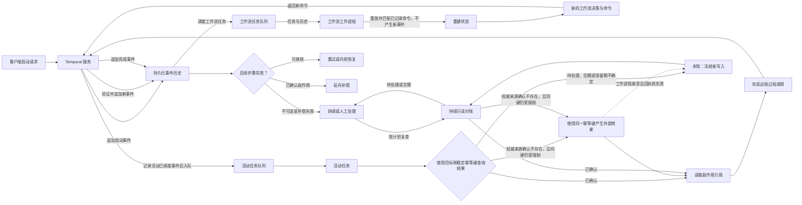

# 持久化执行与长事务：为长时智能体任务建立可恢复边界

付款已经成功，确认邮件尚未发送，执行器却在这两步之间崩溃。重启之后，系统必须回答的不是“任务要不要再跑一次”，而是“哪一段历史可以重放，哪个外部动作绝不能重复”。

Temporal 用事件历史恢复控制状态，长事务用新的业务动作补偿已经提交的步骤。前者解决“编排如何继续”，后者解决“部分成功如何收束”；它们都不会自动把付款、邮件、工单、大语言模型调用或网络写入变成业务上的恰好一次。

本文以 Temporal 官方文档、1987 年的长事务经典论文和固定上游源码为证据，详细版本与文件锚点收进证据卡。工作流重放契约由官方文档支持。快速取消只在本文核对的服务端能力与特定语言工具包版本组合中成立，不能外推到全部工具包或部署。

## 学习问题

1. 事件历史如何恢复工作流状态，确定性重放又限制了哪些代码？
2. 工作流、活动、外部系统与人工分别拥有什么控制权？
3. 为什么活动完成可被重放复用，外部副作用却仍可能发生多次？
4. 超时、重试、取消、对账与长事务补偿应在什么条件下分流？
5. 权限、费用、版本和不可逆动作如何成为显式生产边界？
6. 哪些机制能迁移到长时智能体，哪些类比会制造错误保证？

## 一页摘要

**已证实事实**：Temporal 把工作流的决策记录为有序事件历史。工作进程崩溃后，工作流代码以历史输入和已记录结果重建内存状态；同一历史必须产生相同顺序的命令，否则可能出现非确定性错误。

**已证实事实**：API、大语言模型、数据库和其他外部交互应放入活动。历史已经记录的活动完成结果会在工作流重放时复用；但若外部调用成功、工作进程在完成远程过程调用前崩溃，历史中没有完成事件，后续尝试仍可能再次执行。

**基于证据的推断**：可靠边界不是“所有动作都重放”。工作流重放决策，活动重试执行，外部目标按稳定业务键去重，长事务对已确认的副作用做语义补偿。外部结果为`unknown`时必须冻结新写入，先对账或转人工。

这张表回答“崩溃后每一层究竟负责什么”。

| 层| 保存或执行什么| 恢复动作| 不能保证|
| --- | --- | --- | --- |
| 工作流| 顺序、状态机、定时器、预算、审批、补偿指针| 从事件历史确定性重放| 外部副作用恰好一次|
| 活动| 大语言模型、工具、接口、数据库、文件与网络输入输出| 按超时与重试重新执行，或从心跳详情恢复| 一个尝试已停止、调用只发生一次|
| 外部系统| 付款、邮件、资源、账本等业务事实| 以稳定幂等键查询或返回原结果| 补偿必然可行|
| 长事务与人工| 已确认步骤、补偿顺序、审批与修复| 反向补偿、向前恢复或人工处置| 回到从未发生过的历史|

结论是：Temporal 的耐久性覆盖控制面；业务效果能否安全恢复，仍取决于活动边界、外部幂等契约和补偿设计。

## 事实边界

这一节区分“Temporal 直接保证的机制”与“应用必须补上的业务契约”。

**已证实事实**

- 工作流定义、工作流类型与工作流执行是不同概念。执行通过命令与事件推进；恢复依据是事件历史，而不是工作进程内存快照。
- 相同输入与历史必须产生相同顺序的 Temporal 接口调用。时钟、随机、网络、数据库、大语言模型与工具结果若未通过 Temporal 的重放安全接口或活动记录，就不能直接参与工作流决策；存量历史上的命令变化需要工作流版本控制或补丁机制。
- 活动可执行非确定性代码，参数和结果可进入历史。失败重试默认从头开始；长任务可把安全进度放进心跳详情，供下一个尝试恢复。
- 活动默认有重试策略，工作流执行默认没有。当前文档所列默认退避并不是智能体的费用或风险预算，生产系统仍要限制总时间、尝试次数、令牌、供应商配额和写入次数。
- 任务队列是工作进程主动长轮询的持久路由与负载均衡边界。任务可在工作进程下线时保留，同一队列的任意工作进程都可能接单，多分区也不承诺全局先进先出；因此本地内存不能承担幂等或业务总序。
- 长事务允许已提交子事务释放资源，其他事务可能看到中间结果。`Ci`是对`Ti`的语义修复，不是字节级回滚，也不撤销其他参与者已经观察到的事实。

**基于证据的推断**

- 事件历史是控制面的真相，不是外部业务系统的真相。`ActivityTaskTimedOut`不证明付款未发生，“已请求取消”也不证明远端写入已停止。[MOD-05 概念、逻辑与物理数据模型](/modeling/mod-05)单独建模业务身份与关系约束；它不把本案例示例声称为费用申报模式。
- `Workflow Run ID + Activity ID`能为同一运行的尝试提供稳定身份；跨运行恢复还要使用不随运行改变的业务键。目标系统必须原子地记录键、请求哈希和结果，才能拒绝“同键不同输入”并复用“同键同输入”的原结果。
- 大语言模型调用进入活动只解决确定性重放问题。提示、模型、参数、工具模式、上下文快照和政策版本仍应固定为输入，结果需内容哈希和费用账本；否则重试会放大成本、配额与数据暴露。
- 长事务只应在正向步骤有可对账成功证据后入补偿栈。外部成功与工作流记录成功之间无法仅靠内存标志原子化，必须以目标侧幂等或只读对账处理`unknown`。

**个人分析**

Temporal 不知道退款是否修复了扣款的会计后果，也不知道收件人是否已经看过错误邮件。补偿动作、可补偿时限、审批人、残余风险和不可逆动作都属于应用契约；补偿失败或结果不明必须成为有所有者、服务等级协议和权限门的耐久状态。

原始长事务论文甚至用“发射导弹”说明某些现实动作不可撤销，也指出确定性代码缺陷会让补偿反复失败。它给出的出路是备选补偿实现或人工修复，而不是无限重试同一缺陷。

模型供应商是否支持请求幂等、结果查询与计费去重，也必须逐 API 验证。本地结果表只能抑制已知成功的重复请求，不能消除“供应商已处理、客户端未收到响应”的窗口。

本文只讨论顺序长事务。并行分支必须按依赖图计算补偿偏序，不能把分叉与加入结果随意压成一个全局后进先出栈。

  
证据：固定版本与适用边界

  - **来源截断：** `2026-07-22`
  - **服务端：** `temporalio/temporal@955948007cc6d9d94fa8ef484225954bd9328451`
  - **第一种语言工具包：** `temporalio/sdk-go@3cebc26908119368df3911df6146f756bad3882b`
  - **第二种语言工具包：** `temporalio/sdk-java@6d09a341c14daeddf9b3795cd43721de770fec2c`
  - **边界：** 官方工作流与事件历史文档支持语言级重放契约；固定服务端源码只定位命令、活动状态、重试、计时任务与任务队列接缝。上述两种语言工具包仅核对快速取消回调，不证明其他工具包或版本具有相同行为。

  
证据：当前文档中的默认重试参数

  - **活动：** 默认重试策略的初始间隔为1 秒、系数2.0、最大间隔100 秒、尝试次数不限。
  - **工作流执行：** 默认不重试。
  - **边界：** 这些是来源截断日的文档默认值，不是费用、安全或业务终止保证；显式生产配置优先。

## 架构图

阅读下图时先找三条路径。工作流重放只重建决策，活动重试可能再次触碰外部世界，长事务补偿则创建新的业务事实。

图中的说明性任务流是：

`client start → Service appends start Event → Workflow Task → Worker replays History and matches recorded Commands → new Command → Service appends Event → Activity task → external side effect → worker crash → replay → reconciliation / retry / compensation / manual escalation`

**个人分析**：外部账本只有与真实副作用处于同一原子边界，或由外部 API 原生实现时，才能消除重复效果。先在本地写“即将发送”再调用不支持幂等的邮件 API，仍有双写窗口。

`planned/submitted/confirmed/failed/unknown/compensated`能暴露不确定性，却不会凭空创造外部原子性。

## 控制权与任务流

**说明性场景：付款成功后工作进程崩溃。** 这个场景不声称来自某个真实事故，只用前述机制解释一次恢复。

1. 客户端向 Temporal 服务发出启动请求。服务先把启动事件写入事件历史，再调度工作流任务。

2. 工作流工作进程收到任务与历史后执行重放。它先让已有命令与历史匹配，只把重建状态后的新决策作为新命令返回；服务验证后才追加新事件并派发活动任务。

3. 活动工作进程使用由支付系统强制的稳定幂等键请求扣款。支付成功并返回付款号，但工作进程在向 Temporal 报告完成前崩溃。

4. 新工作流工作进程从历史重建控制状态。由于历史只有“已调度”而没有“已完成”，Temporal 可以按重试策略产生新的活动尝试，但这不授权再次扣款。

5. 新尝试先用同一个目标侧幂等键查询支付系统。`confirmed`返回原付款号；只有权威`not_found`、同键强制仍有效且查询覆盖原请求窗口时，才允许用同一键重试。

6. `pending`、`ambiguous`、最终一致性延迟或幂等记录保留期不确定都保持`unknown`。系统冻结新写入，持续只读对账；无法自动收敛时转人工处理，不能把暂时查不到解释成未发生。

7. 付款确认后工作流才把`effect_ref`与退款补偿入栈，再调度邮件活动。若后续失败，系统按业务条件选择重试、退款补偿或保留付款并人工处理。

这个流程也划清控制权。工作流决定状态、顺序、预算、审批与补偿指针；活动获得网络、大语言模型、数据库和工具能力。外部系统裁定真实业务状态；人工只通过信号与更新等耐久输入改变流程，不直接篡改工作流内部字段。

超时与取消回答的是不同问题：

| 机制| Temporal 语义| 业务边界|
| --- | --- | --- |
| `Schedule-To-Start` | 一次任务等待工作进程的上限；该超时不会因重试策略在同一队列重试| 容量不足不是业务失败，需要备用队列与区域或明确重路由|
| `Start-To-Close` | 单个尝试的上限，可触发后续尝试| 超时不证明旧网络请求已停止，新旧尝试可能并存|
| `Schedule-To-Close` | 活动执行连同全部重试的总上限| 应与服务等级协议、费用、配额和风险预算联动|
| 心跳超时| 长活动的心跳间隔上限；心跳详情可保存安全进度| 心跳不是跨系统提交，也不证明外部状态|
| 取消| 协作式停止请求| 活动可以决定如何响应；取消不是强杀、补偿或外部回滚|
| 重试策略| 活动默认指数退避，可配置最大尝试与不可重试错误| 限流、短暂网络错误、永久输入错误和未知副作用必须分流|

**已证实事实**：官方活动文档把心跳作为通用取消交付基线与回退。

本文固定的服务端与两种语言工具包还有一条更快路径。它要求命名空间与服务端宣告工作进程命令能力，且工作进程注册控制队列。满足条件时，服务端可发送带任务令牌的`CancelActivityCommand`。

该命令可触发本地回调，不必等下一次心跳。它只是版本相关的更快通知路径。

取消只能阻止尚未开始的正向工作，或请求运行中代码协作停止。已经取得`effect_ref`的动作必须进入补偿判断；补偿活动本身也可能超时、重复执行或永久失败，因此同样需要幂等键、独立预算、最小权限和人工终态。

  
证据：活动输入与稳定身份契约

  - **大语言模型活动输入：** `task_id`、`step_id`、业务对象版本、提示与模型与参数与工具模式版本、权限和输入快照哈希。
  - **Temporal 身份：** 活动标识应由稳定步骤键重建，不使用当前时间或随机串；它在一个工作流运行的未结束活动中唯一。
  - **外部身份：** 逻辑组成可写为`tenant + operation + business_object + step_version`；一个具体编码是`tenant_id:business_task_id:step_name:step_version`。相同键与相同输入返回原结果，相同键与不同输入应拒绝冲突。
  - **边界：** `Workflow Run ID + Activity ID`可稳定标识同一运行的重试；跨运行仍需不随运行改变的业务键，且由目标系统强制。

  
证据：快速取消的固定实现条件

  - **服务端条件：** 已开始活动记录`WorkerControlTaskQueue`与时钟后，取消处理可按队列汇集`CancelActivityCommand`并创建工作进程命令任务。
  - **工具包条件：** 固定的第一种语言工具包读取工作进程心跳与命令能力，并把任务令牌映射到活动上下文取消回调；固定的第二种语言工具包仅在`isWorkerCommands()`时启动命令工作进程，并将令牌交给运行上下文。
  - **边界：** 该路径证明“回调可更早触发”，不证明活动被强杀、远端请求停止或副作用回滚。

## 关键源码导读

源码阅读只需要回答四个问题：命令在哪里成为持久状态，活动重试如何转移，任务如何路由，快速取消如何到达运行中的回调。

这些服务端接缝不负责证明业务幂等、补偿正确或工作流 SDK 的语言级解释器行为。

最短路径是先看命令分派与活动可变状态，再看重试计时器和匹配；只有部署依赖快速取消时，才继续核对固定的两种语言工具包。

  
证据：命令与活动持久状态接缝

  - [`workflow_task_completed_handler.go` 275–330](https://github.com/temporalio/temporal/blob/955948007cc6d9d94fa8ef484225954bd9328451/service/history/api/respondworkflowtaskcompleted/workflow_task_completed_handler.go#L275-L330)：`handleCommand`分派活动、计时器、子级工作流、信号、取消与终止等命令。
  - [`workflow_task_completed_handler.go` 467–571](https://github.com/temporalio/temporal/blob/955948007cc6d9d94fa8ef484225954bd9328451/service/history/api/respondworkflowtaskcompleted/workflow_task_completed_handler.go#L467-L571)：校验活动属性、队列和输入，再调用`AddActivityTaskScheduledEvent`；当前重复活动标识会使工作流任务失败。
  - [`mutable_state_impl.go` 4187–4283](https://github.com/temporalio/temporal/blob/955948007cc6d9d94fa8ef484225954bd9328451/service/history/workflow/mutable_state_impl.go#L4187-L4283)：持久化活动标识、已调度事件、队列、四类超时、取消标志、尝试与重试策略。
  - **边界：** 这些锚点证明 Temporal 的持久调度状态，不证明目标服务已经按活动标识去重。

  
证据：重试计时与任务队列接缝

  - [`mutable_state_impl.go` 6758–6853](https://github.com/temporalio/temporal/blob/955948007cc6d9d94fa8ef484225954bd9328451/service/history/workflow/mutable_state_impl.go#L6758-L6853)：`RetryActivity`处理无策略、取消、超时与不可重试故障，再计算退避、增加尝试并生成重试任务。
  - [`retry.go` 70–113](https://github.com/temporalio/temporal/blob/955948007cc6d9d94fa8ef484225954bd9328451/service/history/workflow/retry.go#L70-L113)：`nextBackoffInterval`检查最大尝试、最大间隔与过期时间。
  - [`timer_queue_active_task_executor.go` 527–615](https://github.com/temporalio/temporal/blob/955948007cc6d9d94fa8ef484225954bd9328451/service/history/timer_queue_active_task_executor.go#L527-L615)：重试计时器以标记与尝试与当前状态排除旧任务，再送往匹配。
  - [`matching/handler.go` 175–278](https://github.com/temporalio/temporal/blob/955948007cc6d9d94fa8ef484225954bd9328451/service/matching/handler.go#L175-L278)：工作流与活动任务的添加与长轮询入口。
  - [`matching_engine.go` 583–669](https://github.com/temporalio/temporal/blob/955948007cc6d9d94fa8ef484225954bd9328451/service/matching/matching_engine.go#L583-L669)：任务信息包含命名空间、工作流与运行、已调度事件、过期时间和优先级，并可同步匹配或持久入队。
  - **边界：** 内部任务去重与恢复分发不认证上一个工作进程是否已经完成外部写入。

  
证据：两种语言工具包的取消回调接缝

  - [`workflow_task_completed_handler.go` 670–768](https://github.com/temporalio/temporal/blob/955948007cc6d9d94fa8ef484225954bd9328451/service/history/api/respondworkflowtaskcompleted/workflow_task_completed_handler.go#L670-L768)：取消请求入历史，并在能力条件满足时创建工作进程命令任务。
  - [`sdk-go/internal_worker_heartbeat.go` 88–117、172–185、239–327](https://github.com/temporalio/sdk-go/blob/3cebc26908119368df3911df6146f756bad3882b/internal/internal_worker_heartbeat.go#L88-L117) 与 [`internal_task_handlers.go` 2122–2147、2388–2398](https://github.com/temporalio/sdk-go/blob/3cebc26908119368df3911df6146f756bad3882b/internal/internal_task_handlers.go#L2122-L2147)：固定工具包的能力、控制队列与上下文取消路径。
  - [`sdk-java/WorkerFactory.java` 291–349](https://github.com/temporalio/sdk-java/blob/6d09a341c14daeddf9b3795cd43721de770fec2c/temporal-sdk/src/main/java/io/temporal/worker/WorkerFactory.java#L291-L349)、[`WorkerCommandTaskHandler.java` 28–126](https://github.com/temporalio/sdk-java/blob/6d09a341c14daeddf9b3795cd43721de770fec2c/temporal-sdk/src/main/java/io/temporal/internal/worker/WorkerCommandTaskHandler.java#L28-L126)、[`ActivityExecutionContextFactoryImpl.java` 71–80](https://github.com/temporalio/sdk-java/blob/6d09a341c14daeddf9b3795cd43721de770fec2c/temporal-sdk/src/main/java/io/temporal/internal/activity/ActivityExecutionContextFactoryImpl.java#L71-L80) 与 [`HeartbeatContextImpl.java` 239–247](https://github.com/temporalio/sdk-java/blob/6d09a341c14daeddf9b3795cd43721de770fec2c/temporal-sdk/src/main/java/io/temporal/internal/activity/HeartbeatContextImpl.java#L239-L247)：固定工具包仅在能力门满足时启动命令工作进程，运行上下文最终调用`cancelFromWorkerCommand`请求本地取消。
  - **边界：** 只证明固定提交中的回调路径，不外推到旧版本、其他 SDK 或强制终止。

**基于证据的推断**：服务端的`ActivityId`、`ScheduledEventId`、`Attempt`、`Stamp`和任务令牌适合组成外部请求证据。只有目标服务在同一原子写中检查稳定幂等键，才能抑制重复业务效果。

## 架构决策与权衡

第一个决策是活动粒度。切点应同时满足：一个主要幂等键、一个可判定成功事实、一组可解释超时，以及明确的重试、对账和补偿策略。

| 条件| 建议边界| 代价或停止条件|
| --- | --- | --- |
| 纯状态转移、定时等待、补偿顺序| 工作流| 必须可确定重放，命令变化要版本化|
| 大语言模型、HTTP、数据库、文件、工具调用| 活动| 可重复执行，必须查询或去重外部结果|
| 单个写入有原生幂等 API | 一个窄活动| 核对参数冲突语义与幂等记录保留期|
| 多个写入只有局部事务| 多活动与长事务| 接受中间可见和弱隔离|
| 长任务有安全进度| 心跳上报活动或外部回调与信号| 人工等待不应占住周级尝试|
| 副作用不可查询且不可幂等| 冻结并人工决策| 耐久编排无法补上外部契约缺口|

第二个决策是恢复方向。只有目标系统给出权威`not_found`、同一个稳定幂等键仍受强制，且查询的一致性与保留期覆盖原请求窗口时，才把操作视为“未发生”并重试。

`pending`、`ambiguous`、最终一致性延迟或保留期不确定都属于“可能成功”。此时冻结新写入并持续对账，必要时转人工；已经成功但整体意图无法完成的动作才进入补偿。

业务允许剩余步骤最终完成时可向前恢复，但必须保证代码和输入可用，并设置终止预算。用户撤回、风险越界或流程不可继续时才向后补偿。

第三个决策是补偿是否能自动化。原始长事务的顺序为`T1...Tj,Cj...C1`，但`Ci`只是业务修复。把重试、补偿与未知效果压成一个`failed=true`会在最危险的窗口触发错误动作。每个补偿都需要原`effect_ref`、独立幂等键、前置状态、时窗、最小权限、重试上限与成功证据；若`Cj`永久失败，不能默认跳过它继续`Cj-1`。

**个人分析**：人工介入不是耐久执行失败，而是明确的恢复分支。`needs_reconciliation`、`needs_compensation_approval`、`compensation_failed`应可查询且有所有者与服务等级协议；审批结果作为新历史事件进入工作流，而不是运维人员删除历史或修改内部状态。

这组边界对应[持久智能体与人在回路（Human-in-the-loop）](/patterns/agt-p-08)：历史、检查点、结果对账、人工批准与恢复都要映射到长时智能体。Temporal 提供耐久执行机制，不替代模型评测、业务授权或目标系统幂等。

## 生产化分析

生产检查应从故障动作出发，而不是只看“工作流仍在运行”。

**外部结果未知。** 每个步骤至少区分`not_scheduled`、`running`、`succeeded`、`failed_retryable`、`failed_permanent`、`unknown`、`compensating`、`compensated`、`compensation_failed`。

只有`succeeded + effect_ref`可入补偿栈；`unknown`禁止新写并必须对账。对账活动应只读或使用独立权限，返回`not_found/confirmed/rejected/pending/ambiguous`，不能在查询路径发起第二次写入。

每个已承诺副作用还必须成为整体成功的一部分，或最终抵达`compensated/已批准保留`。这个不变量把“补偿完成”和“经授权接受残余事实”都变成可查询终态。

其中`not_found`只有在来源权威、同一目标侧幂等键仍受强制，且一致性与保留期覆盖原请求窗口时才允许重试。其他无法证明“未发生”的结果继续保持`unknown`，进入定时对账或人工处置。

**外部请求重复。** 原生幂等记录的保留期要长于工作流最长恢复窗口，并返回原请求哈希和资源标识。

没有原生支持时，应改造目标系统使用收件箱、去重表或可查询业务标识。工作进程本地缓存、“成功后再写一行”和消息消费位点都不能替代目标侧原子去重。

**代码升级撞上旧历史。** 工作流代码变化要使用 Temporal 版本机制，并以生产历史做重放测试。活动输入与输出模式要向后兼容，补偿代码保留时间要覆盖最长可补偿任务。

继续为新运行后仍需传递稳定业务键、剩余预算、已成功`effect_ref`与补偿指针，不能只复制对话摘要。

**队列拥塞或供应商故障。** 分离工作流、只读、大语言模型、高风险写入和补偿队列，并分别限制并发、派发速率、供应商配额与租户公平性。

紧急停机应先阻止新的正向副作用，保留只读对账和经批准的补偿通道。停掉全部工作进程可能让业务不一致失去处置能力。

**费用或重试失控。** 主线观测排队时延、尝试分布、超时、每任务费用、`unknown`龄期、补偿成功率与人工队列龄期。完整字段放入下方证据卡。

活动内隐藏重试会与 Temporal 重试形成乘法预算。所有重试必须统一计数，并在工作流中设置总门限。

  
证据：生产观测字段

  - **路由与执行：** 命名空间、任务队列、工作流类型、活动类型、业务租户、任务队列积压、调度到启动的时延、尝试分布、从启动到关闭的时长、心跳超时、不可重试率、工作流任务非确定性。
  - **业务与费用：** 每成功任务的令牌、费用和写次数，`unknown`停留时间，补偿成功率与耗时，人工队列龄期，重复副作用数。
  - **边界：** 指标要同时覆盖控制面健康与外部不确定性；“工作流仍在运行”不等于业务健康。

**权限与敏感数据泄露。** 任务队列不是授权边界；工作进程凭证、命名空间访问、活动参数、租户绑定和目标系统权限必须分别校验。

事件历史会持久化输入、结果和部分失败信息，不应直接保存密钥、完整敏感文档或无界大语言模型上下文。应使用加密载荷与数据转换器、密钥引用、最小化输入和有保留期的外部产物存储区。补偿工作进程的能力应更窄，并经过审批。

**补偿失败或动作不可逆。** 升级包要覆盖身份与状态、代码与政策版本、已完成步骤和`effect_ref`、幂等键、外部查询证据、执行时间线、补偿栈、费用预算、风险和可执行选项。

每项必须有所有者、服务等级协议、允许的信号与更新与双人审批门。不得靠重启工作进程或手动删历史“解决”补偿债务。

  
证据：人工升级包的完整字段

  - **身份与状态：** `workflow_id/run_id`、租户、业务对象、当前状态、代码与政策版本。
  - **执行证据：** 已完成步骤、`effect_ref`、幂等键、外部查询证据、尝试与超时与取消时间线、待补偿栈。
  - **处置约束：** 费用预算、风险、可执行选项、所有者、服务等级协议、允许的信号与更新与双人审批门。
  - **边界：** 证据包支持授权处置，不授权直接删除历史或绕过业务审批。

发布前应注入回执前崩溃、重复重试计时器、大语言模型429/超时、取消延迟、队列无轮询器、补偿永久失败、人工回复重复投递和重放不兼容。

通过条件是每种故障都进入可证明成功、可对账未知或有所有者的人工状态，并验证没有重复扣款、邮件或工单。

## 可迁移经验

### 可直接复用的机制

当任务跨进程、跨天，或需要等待人工与外部回调时，可以迁移以下机制：

1. 用确定性工作流保存状态、顺序、定时、预算与补偿指针，把大语言模型、工具和网络放进活动。
2. 用事件历史重建控制状态，不依赖进程或模型“记得”上一步。
3. 用可重建活动标识、跨运行业务键、输入哈希与`effect_ref`串起所有尝试。
4. 分开建模单尝试、总活动、队列等待与心跳，不用一个“任务超时”覆盖所有故障。
5. 顺序依赖明确且正向结果可对账时，才按`Cj...C1`反向补偿。
6. 不可逆、未知或补偿失败时，把人工决定作为耐久事件，并设置所有者、服务等级协议与权限门。

迁移条件是目标系统能提供稳定身份、查询证据或明确的人工终态；否则只能获得编排耐久性，不能获得副作用安全。

### 只能有限类比的部分

当团队试图把 Temporal 概念类比成数据库或消息语义时，应保留这些限制：

1. 活动是 Temporal 的调度与结果单元，不是外部世界的原子性、一致性、隔离性与持久性事务；它可能部分执行多次。
2. 工作流执行可完成一次，但工作流函数会因重放多次运行；内联副作用会被放大。
3. 任务队列可隔离处理器与容量，但不是业务总序、授权、幂等账本或数据驻留策略。
4. 长事务补偿类似修复，不等于回滚；退款、作废或更正邮件都会留下中间可见事实。
5. 心跳类似检查点，但也只是取消交付基线与回退和进度载体；固定语言工具包的快速回调同样不提供原子提交或强制终止。
6. 大语言模型活动的结果可被历史复用，但费用、配额、数据泄露和后续工具采用使它不能按普通无副作用读取处理。

有限类比成立的条件是只借用控制结构，不把局部机制升级成业务恰好一次、全局隔离或强制取消保证。

### 不应照搬的部分

以下做法在外部副作用、权限或费用重要时应直接禁止：

1. 不要在工作流重放路径调用大语言模型、工具、HTTP、数据库或文件系统。
2. 不要宣称耐久执行提供业务恰好一次，也不要把活动标识当成目标侧幂等已经完成。
3. 不要把超时或取消当成旧执行已终止；外部状态未知时先对账。
4. 不要认为 Temporal 会发明正确补偿；顺序、会计与合规语义、时窗和审批权限都由应用设计。
5. 不要无限重试补偿、永久错误或付费大语言模型；设置总预算、备选补偿和人工修复。
6. 不要在人工处理期保留无主任务或宽权限工作进程；冻结新副作用，只开放对账和经批准的修复能力。
7. 不要把业务秘密与无界上下文直接写入事件历史。

禁止条件很简单：一旦错误重试可能造成重复付款、错误通知、越权写入、无界费用或无法撤销的现实动作，就必须先建立外部幂等、对账、审批和停止边界。

[STY-07 面向服务架构](/styles/sty-07)使用相同的持久编排、结果未知查询与补偿边界来解释企业订单履约；该风格页不把 Temporal 能力当作架构定义，也不把本案例当作生产效果证明。

## 来源

以下来源的访问与截断日期为**2026-07-22**。证据标签中，`已证实事实`只陈述论文、官方文档或固定源码直接支持的行为；`基于证据的推断`用这些机制推导智能体边界；`个人分析`表达官方机制不会自动提供的业务契约。

**主要架构来源**

- [Garcia-Molina & Salem, 《Sagas》（ACM SIGMOD 1987）](https://dl.acm.org/doi/10.1145/38713.38742) — 长事务拆分、子事务交错、`T1...Tj,Cj...C1`、向前与向后恢复、补偿错误与人工修复。
- [Temporal Workflow](https://docs.temporal.io/workflows) 与 [Workflow Definition](https://docs.temporal.io/workflow-definition) — 工作流与执行、确定性命令契约，以及将 API、大语言模型与人工智能、数据库与外部交互放入活动。
- [Temporal Event History](https://docs.temporal.io/encyclopedia/event-history) — 命令、持久事件与崩溃后状态重建。
- [Temporal Activity](https://docs.temporal.io/activities)、[Activity Definition](https://docs.temporal.io/activity-definition) 与 [Activity Execution](https://docs.temporal.io/activity-execution) — 非确定性活动、结果复用、完成远程过程调用前崩溃、幂等键、活动标识与心跳。

**源码**

- [`temporalio/temporal@955948007cc6d9d94fa8ef484225954bd9328451`](https://github.com/temporalio/temporal/tree/955948007cc6d9d94fa8ef484225954bd9328451) — 命令、活动可变状态、重试与计时器与匹配的服务端截面。
- [`temporalio/sdk-go@3cebc26908119368df3911df6146f756bad3882b`](https://github.com/temporalio/sdk-go/tree/3cebc26908119368df3911df6146f756bad3882b) 与 [`temporalio/sdk-java@6d09a341c14daeddf9b3795cd43721de770fec2c`](https://github.com/temporalio/sdk-java/tree/6d09a341c14daeddf9b3795cd43721de770fec2c) — 仅证明工作进程命令能力条件下的快速取消回调，不代表所有 SDK 和版本。

**补充说明**

- [Temporal Retry Policies](https://docs.temporal.io/encyclopedia/retry-policies) 与 [Detecting Activity Failures](https://docs.temporal.io/encyclopedia/detecting-activity-failures) — 默认重试差异、退避、不可重试错误、活动超时、心跳进度与文档基线取消交付。
- [Temporal Task Queues](https://docs.temporal.io/task-queue) 与 [Temporal Service](https://docs.temporal.io/temporal-service) — 主动轮询、持久任务、负载均衡、队列分区与顺序边界与服务组成。

[企业 AI 前线部署交付门禁](/methods/mth-07)把本案例的长流程、重试、补偿和可观测责任作为工程机制参照；本案例不证明 FDE 组织模式或交付结果。

[MOD-06 实体关系模型与关系边界](/modeling/mod-06)进一步说明 Temporal 事件历史是控制面恢复记录，不是带有效期的业务关系历史。
