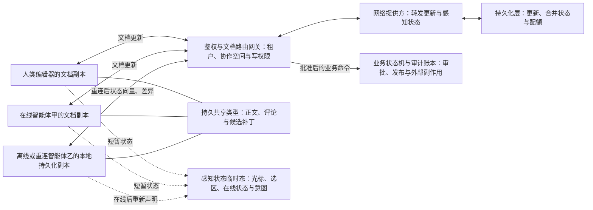

# 协作状态：让人和多个智能体合并共享工作区

两个副本拿到同一组该协作框架更新后可以收敛成相同结构，两个使用者却仍可能对内容含义完全不同意。一个智能体写“风险可接受”，另一个补上“必须法务审批”，CRDT 能保留并排列这些修改，却不会替产品判断它们是否矛盾。

该协作框架适合把协同工作区拆成两条数据通道：共享类型保存可合并的正文、评论和候选补丁，感知状态传播光标、当前关注区和短暂生成状态。权限、事务、语义裁决、审计与外部副作用属于第三条业务控制通道；CRDT 收敛不提供这些保证。

本文以截至2026-07-22 的官方文档和固定源码快照为范围。快照处于14.0.0 候选版本，而固定仓库的支持声明仍指向13.6 系列，因此版本与源码只用于解释机制，不构成选型建议；详细提交摘要、符号和字段进入证据卡。

## 学习问题

1. 共享类型与文档更新能保证什么，普通结构化数据修改为什么不会自动同步？
2. 更新收敛为什么不能推广为权限、事务、语义正确或工具副作用幂等？
3. 状态向量和差异如何让离线副本只交换缺失状态？
4. 持久内容、提供方与感知状态各自拥有哪类状态？
5. 快照、删除集合与垃圾回收为什么不能替代审计和备份？
6. 智能体重连后，谁有权把离线产物提升为正式结果？

## 一页摘要

**已证实事实**：该协作框架共享类型提供数组、映射、文本与可扩展标记语言类数据结构，接入`Y.Doc`后可观察、同步和持久化。修改发生在事务中；显式事务可把多次本地修改合为一次通知和一个更新。普通结构化数据原地修改不会产生该协作框架事件，可能让副本失去同步。

文档变更被编码为`Uint8Array`更新。同一组有效更新可乱序、重复应用，兼容副本收到全部更新后收敛。状态向量表达各客户端的下一预期时钟，`encodeStateAsUpdate`或`diffUpdate`可据此只交换缺失结构。

提供方不属于 CRDT 合并算法。网络提供方转发更新，持久化提供方保存更新；二者可接到同一个`Y.Doc`，离线端先恢复本地内容，重连后再同步缺失变化。感知状态独立于文档，适合在线状态与光标等跨会话无须保留的信息。

**边界。个人分析**：更新的代数性质只属于该协作框架文档集成，不属于模型回答、数据库写入、支付或发信。`Y.Doc.transact`也不是跨系统事务。持久文档保存以后还要审阅的内容，感知状态保存会过期的协作提示；权限、语义校验、审批、幂等副作用账本与审计链必须外置。

| 状态或动作| 建议承载| 能得到的保证| 仍需补齐|
| --- | --- | --- | --- |
| 正文、评论、候选补丁、白板节点| `Y.Text`、`Y.Array`、`Y.Map`、`Y.Xml*` | 有效更新最终送达后的文档收敛| 模式版本、内容校验、权限与语义审阅|
| 光标、选区、当前段落、短暂生成状态| 感知状态| 在线端之间传播、超时离线| 不持久、不作锁；断线后重建|
| 离线草稿| 同一`Y.Doc` + 本地持久化提供方| 本地恢复并在联网后交换缺失更新| 存储配额、数据加密、身份重新认证|
| 审批、付款、发信、发布| 独立业务状态机与幂等账本| 由业务系统定义原子性与去重| 不应由 CRDT 更新代替|

## 事实边界

本案例访问日为2026-07-22。固定源码快照的`package.json`为`14.0.0-rc.24`，而同一快照的`SECURITY.md`仍只把13.6 系列列为受支持版本。这个差异会改变生产选型结论：本文用候选版快照解释当前实现，不建议据此直接采用候选版。

  
证据：固定快照与支持版本边界

- **固定提交：** 当日`git ls-remote https://github.com/yjs/yjs.git HEAD`返回[`9c1994547d7bc86245a21e1a4c8319f056d05ecf`](https://github.com/yjs/yjs/tree/9c1994547d7bc86245a21e1a4c8319f056d05ecf)。
- **提交时间：** 2026-07-18。
- **仓库版本：** `14.0.0-rc.24`。
- **支持声明：** 同快照`SECURITY.md`只列出13.6 系列。
- **边界：** 固定最新提交用于说明源码和内部结构；正式支持版本必须在生产选型时另行核对。

**已证实事实**：INTERNALS.md 把该协作框架核心描述为列表 CRDT。插入内容由`(clientID, clock)`唯一标识，并借助`origin`与`originRight`排列并发插入。映射同键条目以最后插入项为可见值，其余标记删除；删除集合随更新传播，但不记录删除时间或删除者。

**边界。基于证据的推断**：CRDT 的“无合并冲突”只表示算法可以决定结构结果，不表示结果没有产品冲突。比如一个智能体把风险等级改为“低”，另一个同时加入“必须法务审批”；该协作框架能收敛字段和文本，却无法判断二者是否矛盾。需要领域约束、审阅者、规则引擎或审批工作流（Workflow）决定语义。

**已证实事实**：该协作框架不规定网络拓扑。网页套接字同步提供器用中心端点分发更新与感知状态，并可携带认证材料；这是部署接缝，不是自动鉴权。`THREAT_MODEL.md`把对等方认证授权、传输层安全协议（Transport Layer Security，TLS）与安全网页套接字、服务端访问控制和输入校验列为应用责任。拥有写权限的恶意对等方仍可破坏文档。

**个人分析**：最安全的权限粒度通常是文档或文档分区，而不是尝试在服务端解析并过滤任意二进制更新。租户、项目、机密级别和“正式文档与建议稿”应映射为不同协作空间、文档或分叉；只读用户不应获得更新写入口。细粒度字段权限若不可避免，应通过受信应用命令生成更新，或把高敏感字段移出通用 CRDT 文档。

## 架构图

先看三条通道是否被混在一起：文档更新承载持久协同状态，感知状态承载可丢失的在线提示，业务状态机承载授权与不可逆动作。三者即使关联同一个任务，也不能共享同一套一致性承诺。

**已证实事实**：多个提供方可以连接同一个`Y.Doc`。官方示例同时组合网络提供方与`y-indexeddb`持久化提供方；提供方监听`update`事件并通过事务来源避免把刚接收的更新无限回送。感知状态另有编码和应用程序编程接口（Application Programming Interface，API），不支持通过状态向量计算最小差异。

**基于证据的推断**：图中的鉴权网关、业务状态机和审计账本都不是该协作框架内置组件。它们被显式画在 CRDT 数据面之外，是为了阻止“文档已收敛”被误读为“动作已授权、事务已提交、结果已审计”。

**个人分析**：智能体的“我打算改第3 节”只是一条协作提示。它可以减少人和其他智能体的重复劳动，却不能阻止一个掉线或恶意智能体同时写入；真正排他操作需要带租约、服务器时间、隔离栅栏令牌和受信写入口的独立协调机制。感知状态最多显示软占用，不应成为安全或一致性边界。

### 视觉检查点：结构收敛与语义裁决

先追踪更新的作用范围：它从共享类型出发，经提供方传播并在副本中集成。到达“结构收敛”以后，权限和语义问题仍未解决。

第二条路径处理离线副本。重连只恢复缺失结构，不能自动把离线产物提升为正式结果。

CRDT 负责合并，业务工作流负责决定谁可以发布以及发布意味着什么。

## 控制权与任务流

**说明性场景**：一名用户和两个智能体共同修改一份方案，其中一个智能体离线后继续写草稿。这个流程只组合已证实的该协作框架机制与明确标注的应用层设计，不是上游生产事故或用户案例。

一个可恢复的编辑回合可以按以下顺序运行：

1. 受信客户端先认证用户或智能体身份，由服务端依据租户、文档、角色和动作决定能否加入协作空间以及能否写更新。文档标识必须由服务端映射，不能直接相信客户端自报路径。

2. 客户端加载本地持久化提供方，再连接网络提供方。用户界面可以先显示本地已知内容，但在确认远端同步前应标注“本地状态”，高风险提交不得以`synced`布尔值替代业务版本检查。

3. 智能体在感知状态发布短暂`actor`、`focus`、`intent`、`status`与过期信息，例如“正在草拟来源摘要”。这些字段不包含秘密推理、长期凭证或必须审计的批准。

4. 需要保留的草稿文本、评论或候选补丁进入共享类型，并在一个本地事务内成组修改。提供方将产生的更新持久化并转发，重复和乱序投递不要求调用方手工去重。

5. 重连端发送状态向量，远端计算缺失差异；双方应用完整更新集后文档状态收敛。离线期间的旧感知状态不回放，客户端按当前任务重新声明。

6. 语义验证器检查必填字段、引用、状态机前置条件和跨字段约束。冲突内容可以被标记、请求人工审阅或写到建议分叉，不能把 CRDT 的结构结果直接升级为“已批准”。

7. 发布、发信或其他副作用使用独立命令、幂等键和业务账本。只有服务端授权并原子记录命令后才执行；该协作框架事务来源可帮助调试更新来源，但不是经过认证的身份或不可抵赖审计字段。

**已证实事实**：官方感知状态 API 让每个客户端只推进自己的本地状态时钟；状态为`null`表示离线，30 秒未收到更新的远端客户端也会被标记离线，因此客户端需要周期广播。感知状态是无模式的结构化数据对象，字段不标准化。

**基于证据的推断**：智能体在线状态需要应用级生存时间、任务标识和会话实例标识，且所有消费者都应把它视为提示。进程暂停、设备休眠、网络分区和消息延迟都会制造短暂误判；“在线”也不证明该智能体仍拥有任务或有权限写正式文档。

**个人分析**：对长时间离线的智能体，应在重连后先同步、重新读取当前目标和权限，再决定是否保留其候选补丁。盲目继续旧计划虽可在数据层合并，却可能把已撤销要求重新写回。最稳妥的模型是把离线产物作为可审阅提案，并以当前基础与版本与策略重新验证后再提升为正式内容。

## 关键源码导读

最短阅读路径从`Doc`的事务边界进入，再看编码如何应用更新和计算差异，最后用`Snapshot`、`INTERNALS.md`与威胁模型检查恢复和安全边界。它能证明结构怎样合并以及哪些历史可能被垃圾回收；它不能证明合并结果有业务权限或语义正确性。

本节只描述2026-07-22 固定源码快照和同日访问的官方文档。候选版与受支持稳定版的差异仍以“事实边界”中的版本说明为准。

  
证据：文档更新、快照与威胁模型接缝

- **固定提交：** [`9c1994547d7bc86245a21e1a4c8319f056d05ecf`](https://github.com/yjs/yjs/tree/9c1994547d7bc86245a21e1a4c8319f056d05ecf)，提交时间为2026-07-18，`package.json`为`14.0.0-rc.24`。

| 源码或文档接缝| 已证实行为| 边界| 智能体协作含义|
| --- | --- | --- | --- |
| [`src/utils/Doc.js`](https://github.com/yjs/yjs/blob/9c1994547d7bc86245a21e1a4c8319f056d05ecf/src/utils/Doc.js) | `Doc`持有随机客户端标识、共享类型映射、结构存储区、`gc`与`gcFilter`；事务可记录来源| `isLoaded` / `isSynced`依赖提供方实现，不是业务提交证明| 客户端标识不是用户身份；把认证主体和业务版本另存于受信上下文|
| [`src/utils/encoding.js`](https://github.com/yjs/yjs/blob/9c1994547d7bc86245a21e1a4c8319f056d05ecf/src/utils/encoding.js) | `applyUpdate`解码并应用更新；`encodeStateAsUpdate`根据目标状态向量写缺失结构和删除集合；`encodeStateVector`编码本地已知时钟| 差异同步减少传输，不验证业务权限或语义| 重连先算差异，后做模式与政策验证；不要把二进制可应用等同于可接受|
| [`INTERNALS.md`](https://github.com/yjs/yjs/blob/9c1994547d7bc86245a21e1a4c8319f056d05ecf/INTERNALS.md) | 插入以`(clientID, clock)`标识；更新包含新插入项与删除项；状态向量用于计算缺失结构| 文档明确不保存删除者或删除时间，状态向量不追踪业务因果| 审计必须外置；需要知道“谁为何删除”时不能只存最终 Y.Doc |
| [`src/utils/Snapshot.js`](https://github.com/yjs/yjs/blob/9c1994547d7bc86245a21e1a4c8319f056d05ecf/src/utils/Snapshot.js) | 快照由状态向量与删除集合构成；`createDocFromSnapshot`从原文档构造旧状态| 若`originDoc.gc`为真会直接报错，因为旧内容可能已被回收| 版本查看与恢复策略必须预先设计；默认快照不能替代备份|
| [Document Updates](https://docs.yjs.dev/api/document-updates) | 更新具交换律、结合律、幂等性；二进制接口可合并与计算差异| 只合并二进制更新不会垃圾回收删除内容，仍需加载`Y.Doc`缩减| 离线队列可重复送达，但要监控文档增长并安排受控压缩|
| [Awareness](https://docs.yjs.dev/api/about-awareness) | 每客户端的时钟与结构化临时数据，超时可标记离线；通常由提供方维护| 不进入该协作框架文档、无状态向量、字段无模式| 在线状态、意图与正式内容分通道；断线后不回放旧意图|
| [`THREAT_MODEL.md`](https://github.com/yjs/yjs/blob/9c1994547d7bc86245a21e1a4c8319f056d05ecf/THREAT_MODEL.md) | 协议假定协作写入端受信；恶意对等方可写破坏性操作或构造大更新、深层结构造成拒绝服务攻击| 服务端选择性过滤二进制更新不是可靠安全边界| 未受信智能体使用独立建议分叉；先鉴权，再授予整文档写能力|

**边界：** 这些锚点证明更新集成、差异同步、快照与垃圾回收限制和受信对等方假设，不证明提供方自动实施访问控制列表，也不证明业务动作具备事务性。

**已证实事实**：源码默认`gc = true`。INTERNALS.md 说明删除项可丢弃内容或被替换为轻量`GC`对象，快照则需要状态向量与删除集合判断过去可见性。固定`Snapshot.js`明确拒绝从启用垃圾回收的来源文档恢复快照。

**边界。个人分析**：若产品需要随时还原原文、查明删除者并形成法律审计，就要保留受控检查点与备份与不可变审计事件。需要版本回看的文档可禁用垃圾回收，但必须承担增长成本。不能一边回收删除内容，一边假设快照能恢复所有历史。

## 架构决策与权衡

| 决策| 适用条件| 收益| 主要代价、风险与退出信号|
| --- | --- | --- | --- |
| 中心数据库与乐观版本| 主要是表单或离散记录，在线写入，冲突少且业务事务重要| 权限、约束、审计和事务模型直接| 离线与字符级并发体验较弱；同一内容频繁冲突时评估 CRDT |
| 一个 Y.Doc 承载协同内容| 多人与智能体高频编辑同一小到中型内容，允许最终收敛| 本地优先、离线编辑、重复与乱序更新可合并| 权限半径、文档增长、模式迁移与语义冲突治理增加|
| 按租户与项目与文档与敏感级别分区| 权限、生命周期、容量或保留策略不同| 缩小泄露与故障半径，可独立限额和压缩| 跨文档原子修改不存在；需要索引与业务编排|
| 正式文档与建议分叉分离| 未受信用户或智能体只能提交建议| 原文档只接受受信写端，建议可审核后提升| 合并用户体验、引用映射和审核成本增加|
| 持久化内容与感知状态双通道| 需要同时显示协作状态和持久产物| 避免光标、意图污染历史与离线回放| 感知状态可能过期或丢失，不能作为锁或任务真相|
| 保留更新日志并周期检查点| 需要重放、恢复和低延迟同步| 审计接缝与灾备更强，冷启动可控| 日志增长、加密、压缩与垃圾回收策略复杂；日志仍需受信身份元数据|
| 对版本回看文档禁用垃圾回收| 明确需要基于来源文档重建旧快照| 保留恢复旧内容所需结构| 内存和存储持续增长；若只需合规备份，应优先外部检查点|
| CRDT 外置业务状态机| 存在审批、额度、发布或不可逆副作用| 保留原子约束、幂等和可审计授权| 两套状态需关联；若把业务动作塞回文档，立即失去该边界|

**基于证据的推断**：文档分区既是扩展决策，也是权限决策。一个巨型工作空间 Y.Doc 会让任何有写权限的客户端触达更大状态，并让冷启动、差异、观察者和垃圾回收共享同一资源预算。以稳定业务边界拆分文档，再用普通索引或引用关联，通常比在一个二进制更新内做字段级访问控制列表更可控。

**个人分析**：是否采用 CRDT 的判断标准不是“有多个智能体”，而是是否存在同一数据的真实并发编辑、离线要求和可接受的最终一致语义。若任务可以由单一所有者排队执行，或者每个智能体写独立产物再由归并器合并，普通数据库版本控制往往更简单。CRDT 不应成为绕过所有权设计的理由。

## 生产化分析

生产边界应沿着三类失败拆开：CRDT 数据能否解码并收敛、主体是否有权写入、收敛内容是否能成为正式业务结果。只监控“所有副本一致”会漏掉恶意更新、语义矛盾、陈旧离线计划和重复外部动作。

  
证据：生产限额、观测字段与恢复动作

**来源锚点：** [Document Updates](https://docs.yjs.dev/api/document-updates)、[y-websocket](https://docs.yjs.dev/ecosystem/connection-provider/y-websocket)与固定提交的[`THREAT_MODEL.md`](https://github.com/yjs/yjs/blob/9c1994547d7bc86245a21e1a4c8319f056d05ecf/THREAT_MODEL.md)支持同步、服务端接缝和受信写入端边界；审批与业务发布规则是应用补充。

| 生产维度| 最小控制| 可观测信号| 失败处置|
| --- | --- | --- | --- |
| 身份与授权| 安全网页套接字、会话认证、服务端派生租户与文档、协作空间级读写访问控制列表、短期令牌| 主体、租户、文档、动作、允许与拒绝原因、连接实例| 拒绝未授权协作空间；撤销连接与令牌；不要只信客户端标识|
| 文档分区| 按权限、容量、保留期和业务生命周期划界，正式文档与建议分叉分开| 每文档字节、结构数、更新率、活跃连接、权限变更| 隔离热点与异常文档；迁移到新分区；限制跨文档操作|
| 更新接收| 鉴权后才读写；限制单更新与批次大小、频率、嵌套深度、解码处理器和内存| 接收与拒绝字节、应用延迟、异常解码器、重复率、待同步差异| 断开异常客户端、隔离文档、熔断解码；保留取证哈希|
| 持久化与离线| 加密本地与服务端存储、配额、检查点、备份、最长离线窗口| 本地加载时间、远端同步时间、差异大小、队列年龄、恢复成功率| 超限转全量检查点；提示人工审阅陈旧离线草稿|
| 感知状态| 字段白名单、载荷与频率上限、生存时间、敏感信息禁入| 在线数、心跳延迟、过期清理、载荷字节、异常频率| 丢弃超大与高频状态；断线立即显示未知而非锁定|
| 模式演进| 文档内模式版本、兼容读、幂等迁移、单一迁移协调者、回滚检查点| 版本分布、未知字段、迁移耗时与失败、旧客户端写入| 暂停不兼容写端；双读与适配；从检查点恢复|
| 语义质量| 领域验证、引用完整性、审批规则、人工审阅、建议提升流程| 验证失败、矛盾标记、人工覆盖、提案接受率| 保留双方内容并阻止发布；指定所有者或规则裁决|
| 审计| 独立追加日志记录认证主体、时间、文档、更新哈希与大小、模式、命令结果| 缺失审计关联、异常删除、回放差异、日志完整性| 冻结高风险写入、从检查点与日志调查；不可只看最终状态|
| 垃圾回收与容量| 明确`gc`策略、合并与压缩周期、文档大小预算、保留检查点| 墓碑标记与结构增长、合并后字节、内存峰值、冷启动时延| 受控加载 Y.Doc 压缩；拆分或归档文档；避免无限更新日志|
| 外部副作用| 服务端命令、幂等键、隔离栅栏与版本检查、原子业务账本、补偿| 命令状态、重复键、迟到结果、账本与文档关联| 查询真实结果、拒绝旧所有者、补偿或转人工；不重放该协作框架更新触发动作|

**边界：** 表中访问控制列表、审计、模式迁移、幂等账本和资源治理都是应用层控制，不是该协作框架更新的收敛保证。

**安全。已证实事实**：固定威胁模型明确指出未受信对等方不应写原始文档，建议只写独立分叉；选择性过滤二进制更新容易被利用，不是可靠安全边界。它还列出超大更新、深层嵌套和高计算消息导致拒绝服务的风险。网页套接字同步提供器文档只提供可接入认证授权的中心端点，生产实现仍须显式完成这些控制。

**安全。个人分析**：智能体比普通协作者更容易高频、批量地产生结构和文本。除网络层限流外，应为每个主体设置并发文档数、每分钟更新字节、单事务变更量、最大嵌套深度、感知状态刷新率和模型生成预算。异常智能体先降为仅能在分叉中提出建议，不要让一个错误循环把合法 CRDT 更新扩散到所有副本。

**模式演进。基于证据的推断**：共享类型与感知状态都不会替应用强制领域模式。新旧智能体并存时，应保持未知字段可忽略、读路径向后兼容，并把迁移写成可重复执行的受控操作。若多个副本同时运行“把字段甲改名为乙”的破坏性迁移，CRDT 可以合并这些写入，却不保证只有一次迁移或旧客户端不再写字段甲。

**审计。已证实事实**：`INTERNALS.md`明确删除记录不包含删除时间或删除用户。事务来源可随本地更新事件传递，官方文档把它用于识别提供方来源与调试；它不是协议内认证身份。合规审计必须在可信接入层记录已认证主体、策略决定、时间、更新哈希和业务命令结果，并保护日志免受协作者改写。

**可靠性与容量。个人分析**：为每个文档压测冷启动、增量同步、长离线差异、重复更新、断网重连、热点并发和垃圾回收与压缩。灾备演练要从检查点与后续更新恢复到预期状态向量，并单独验证业务账本；只证明所有 Y.Doc 副本相等，不能证明外部动作正确或审计完整。

## 可迁移经验

### 可直接复用的机制

- **持久内容与临时态双通道**：把正文、评论、候选补丁和结构化产物放入共享类型；把光标、选区、短暂在线状态与“正在生成”意图放入感知状态。
- **更新的可重复交付**：网络可以重试（Retry）、乱序和批量传输同一该协作框架文档更新，不必在调用方为更新本身设计严格一次投递；仍需验证来源、大小和文档权限。
- **状态向量差异同步**：重连端先表达自己已知的客户端逻辑时钟，再接收缺失更新，适合人类设备和离线智能体恢复共享草稿。
- **网络与持久化提供方分工**：同一`Y.Doc`可同时接网络与本地持久化，应用不必把离线缓存伪装成另一套业务模型。
- **按权限与容量分文档**：租户、项目、敏感级别和正式与建议状态形成独立协作空间或分叉，避免字段级二进制过滤成为安全幻觉。
- **明确快照与垃圾回收策略**：需要旧状态浏览时预先决定是否禁用垃圾回收、保留多大历史或改用外部检查点；不要事后才发现删除内容已回收。
- **外置可信审计**：接入层把认证主体、策略结果、时间、更新哈希、模式版本和业务命令关联到不可变日志，弥补该协作框架内部不记录删除者与删除时间的边界。

### 只能有限类比的部分

- 人类光标和智能体意图都可以进入感知状态，但智能体的“正在处理”可能持续数分钟并跨进程恢复。感知状态的在线状态与超时只适合用户界面提示，真正任务所有权仍需持久化租约、隔离栅栏令牌或队列协议。
- 文字与白板节点天然适合共享类型；智能体计划、记忆和工具结果往往包含生命周期、权限和来源约束。只有可公开合并的投影进入共享文档，私有推理、凭证和受限数据不得因“协作方便”广播。
- 该协作框架事务可以把一组本地共享类型变更打成一个更新，但智能体工作常跨数据库、模型和外部工具。它只能类比本地批次边界，不能类比端到端原子事务。
- CRDT 能为并发插入选择稳定结构顺序；自然语言段落、方案结论和业务字段仍可能语义矛盾。需要领域验证、审阅与明确决策所有者。
- 状态向量描述文档已知结构，而非任务因果、授权版本或审批链。智能体重连后还要重新加载任务状态、当前策略和权限，不能仅凭差异继续旧动作。

### 不应照搬的部分

- 不要宣称 CRDT 提供认证、授权、字段级访问控制列表、业务事务、恰好一次副作用或语义冲突解决；这些都不属于更新收敛保证。
- 不要把感知状态当分布式锁、任务租约、在线真相或审计记录。它会超时、丢失、重建，且客户端可自行声明字段。
- 不要让未受信或低权限智能体直接写正式 Y.Doc，再试图在服务端过滤二进制更新。使用独立建议分叉，由受信方验证和提升。
- 不要把整个企业工作区塞进一个 Y.Doc。权限、容量、保留期和故障域不同的内容应分区，跨文档一致性由业务编排管理。
- 不要假设保存快照就能恢复任何旧版本。固定源码从快照构造旧文档要求来源文档禁用垃圾回收；备份、审计与保留策略需要独立设计。
- 不要只累计和`mergeUpdates`就认为完成压缩。官方文档说明二进制合并不会垃圾回收已删内容，需要加载`Y.Doc`才能缩减相应状态。
- 不要让旧智能体在长时间离线后无条件回放业务意图。先同步文档、重新鉴权并验证模式与任务版本，把陈旧结果作为提案审阅。

## 来源

**该协作框架官方文档（已证实事实）**

- [Shared Types](https://docs.yjs.dev/getting-started/working-with-shared-types)：共享类型的连接、观察、嵌套、普通结构化数据原地修改风险与事务事件边界。访问与截断日期：2026-07-22。
- [Document Updates](https://docs.yjs.dev/api/document-updates)：二进制更新的交换律、结合律、幂等性，`applyUpdate`、状态向量、差异同步、二进制合并与不执行垃圾回收的边界。访问与截断日期：2026-07-22。
- [Awareness API](https://docs.yjs.dev/api/about-awareness)与[Awareness & Presence](https://docs.yjs.dev/getting-started/adding-awareness)：感知状态位于`y-protocols`、不写入该协作框架文档、每客户端时钟、结构化数据状态、30 秒离线判断和提供方接缝。访问与截断日期：2026-07-22。
- [Offline Support](https://docs.yjs.dev/getting-started/allowing-offline-editing)与[y-indexeddb](https://docs.yjs.dev/ecosystem/database-provider/y-indexeddb)：本地更新持久化、跨会话加载、离线编辑和与网络提供方组合。访问与截断日期：2026-07-22。
- [y-websocket](https://docs.yjs.dev/ecosystem/connection-provider/y-websocket)：中心端点分发更新与感知状态、同步状态、持久化接缝，以及可承载认证授权的服务端边界。访问与截断日期：2026-07-22。

**该协作框架固定上游源码（已证实事实）**

- [yjs/yjs 快照 `9c1994547d7bc86245a21e1a4c8319f056d05ecf`](https://github.com/yjs/yjs/tree/9c1994547d7bc86245a21e1a4c8319f056d05ecf)：2026-07-22 核对的仓库最新提交，提交日期2026-07-18，`package.json`为14.0.0-rc.24。重点读取`src/utils/Doc.js`、`encoding.js`、`Snapshot.js`与`src/utils/transaction-helpers.js`。
- [`INTERNALS.md`](https://github.com/yjs/yjs/blob/9c1994547d7bc86245a21e1a4c8319f056d05ecf/INTERNALS.md)：列表 CRDT、标识、插入顺序、删除集合、事务更新、状态向量、快照与垃圾回收内部边界。
- [`THREAT_MODEL.md`](https://github.com/yjs/yjs/blob/9c1994547d7bc86245a21e1a4c8319f056d05ecf/THREAT_MODEL.md)与[`SECURITY.md`](https://github.com/yjs/yjs/blob/9c1994547d7bc86245a21e1a4c8319f056d05ecf/SECURITY.md)：受信写入端假设、恶意更新与拒绝服务攻击、应用层认证授权责任，以及固定最新提交与受支持稳定版本的区别。

**证据边界（基于证据的推断）**：双通道映射、文档分区、模式发布和审计字段属于架构推断。资源预算、建议分叉提升与外部业务账本也来自威胁模型迁移，而不是该协作框架官方设计。快照之后的最新提交、提供方实现与文档更新不在结论范围内。
