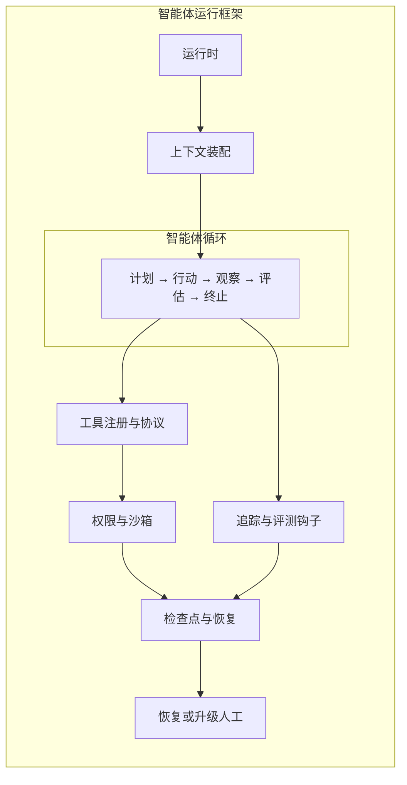

# 智能体运行框架：约束并运行智能体循环

智能体循环会在一次任务中选择下一步动作，但它不能同时成为自己的运行环境（Environment）、权限授予者、恢复记录和质量裁判。智能体运行框架是包住循环的运行时与治理脚手架：**智能体运行框架约束并运行智能体循环；它本身不决定任务**。这个不变量把“模型怎样推进目标”和“系统怎样允许、执行、记录并恢复这次推进”分开。

## 学习问题

- 智能体运行框架必须拥有哪六类责任，哪些仍属于智能体循环？
- 上下文、工具和副作用预算应在哪里强制执行？
- 进程崩溃后，如何从执行检查点（Checkpoint）恢复而不把写操作盲目重放？

## 定义与尺度边界

本文讨论单次或跨多次进程生命周期的任务执行尺度。智能体运行框架接收已确认的目标与策略，装配一次模型调用可见的上下文，把允许的工具暴露给智能体循环，在真实副作用发生前执行权限与隔离沙箱（Sandbox）策略，并保存恢复和评测所需的外部记录。智能体循环在这些边界内执行计划、行动、观察、评估和终止，选择“下一步做什么”。

二者的控制权不能互换。智能体运行框架可以拒绝、限流、暂停或终止一次动作，却不应凭自己的运行机制改写用户目标或替模型选择任务策略；智能体循环可以申请上下文和工具，却不能扩大自己的权限、时间、费用或可见数据。智能体运行框架约束并运行智能体循环；它本身不决定任务。

这里的智能体运行框架是责任边界，不限定为一个进程、容器、软件开发工具包（Software Development Kit，SDK）或托管产品。六项责任可以由应用进程、平台服务、工具网关和持久状态组件共同实现，但每项都必须有唯一可审查的执行点和所有者。

## 核心机制

图示决策为 **Mermaid 图表工具**：它表达一个会随专题继续演进的简单分层流，节点短、连接关系直接，文本差异和维护成本比精确排版更重要。末端分支表示核对后恢复或升级人工，不表示失败动作会被自动重试（Retry）。

这个分层流由以下六行责任合同落地：

| 智能体运行框架责任 | 输入 / 资产 | 强制合同 | 失败时行为 |
| --- | --- | --- | --- |
| 运行时 | 已确认目标、任务状态、终止条件 | 调度模型调用，强制步数、时间、费用与并发上限 | 产出明确失败、预算耗尽或人工中止，不无限续跑 |
| 上下文装配 | 系统指令、任务事实、检索证据、允许的记忆 | 按来源、时效、优先级与词元限额选择；不把模型摘要升级为业务事实 | 缩减、重新检索、追问或拒绝继续，不静默截断关键约束 |
| 工具注册与协议 | 工具模式、版本、参数和结果合同 | 只向智能体循环暴露允许能力，校验参数、超时、结果类型和稳定操作标识 | 返回结构化错误；未知结果进入核对而非假定成功 |
| 权限与沙箱 | 主体身份、资源范围、动作风险与批准 | 在副作用前执行最小权限、网络/文件隔离和人工批准 | 拒绝越权，保留提案与原因，必要时升级人类责任人 |
| 检查点与恢复 | 任务状态、已确认结果、副作用账本、可重放位置 | 在稳定边界提交检查点，把“已请求”与“已生效”分开 | 重建上下文并先核对外部效果；不盲目重试写操作 |
| 追踪与评测钩子 | 模型调用、工具调用、状态转换、评价规则 | 追踪记录发生了什么，评测在指定时点判断质量 | 证据不全时降低置信度、停止自动化或请求独立复核 |

上下文预算与工具预算都由智能体运行框架持有和强制：前者限制一次推理窗口能看见什么，后者限制可调用次数、费用、时延和副作用风险。智能体循环可以根据任务提出使用申请，但不能通过多轮自我提示给自己增额。预算耗尽是显式终止结果，不是让模型“再试一次”的建议。

权限的执行点必须在**工具调用真正执行之前**，位于工具分派与外部环境之间的权限与沙箱边界。仅在系统提示中写“不要删除文件”不是权限控制；智能体运行框架仍需以身份、参数、资源范围和批准令牌校验动作，并在执行后验证观察到的结果。

崩溃恢复需要两个不同事实：检查点说明从哪里继续，副作用账本说明此前请求是否已经产生外部效果。恢复时，智能体运行框架重新装配受限上下文，读取最近已确认检查点，再查询幂等键、外部状态或回执；只有确认未发生时才执行动作，不盲目重试。无法消除不确定性时应暂停并交给人类，而不是把“进程重启成功”当成“任务恢复正确”。

| 智能体运行框架能证明 | 智能体运行框架不能证明 |
| --- | --- |
| 请求经过已声明的运行与权限边界 | 模型选择的动作正确 |
| 上下文和工具消耗受预算约束 | 工具结果天然可信 |
| 可从已确认检查点恢复 | 恢复一定不会重复副作用 |
| 执行链留下可评测追踪 | 一次评测代表生产质量 |

表的左侧也只在配置、执行记录与观察证据一致时成立。智能体运行框架提供可验证条件，不把某个框架名称、日志存在或单次成功升级为安全性（Security）与可靠性证明。

## 常见混淆

### 薄 SDK 反例

设想一个 `run(prompt)` 封装：它只转发模型请求，看到工具调用便直接执行，再把结果追加到内存消息数组。它也许提供重试和漂亮的类型，但没有上下文预算、工具预算、权限执行点、沙箱、持久检查点、外部副作用核对或评测钩子。这样的薄层是有用的 SDK 包装，却不是智能体运行框架，因为进程一崩溃，系统既不知道任务停在哪里，也无法判断最后一次写操作是否已生效。

第二种混淆是把系统提示词当作智能体运行框架。提示词能塑造候选行为，但不能隔离网络、隐藏凭据、强制费用上限或原子提交状态。第三种是把可观测性当作治理：追踪可以揭示越权提案，却不能自行阻止它；真正的护栏（guardrail）必须在执行路径上拥有拒绝权。

第四种是让智能体运行框架兼任任务规划器。面向某一领域的代码可以预先定义工作流（Workflow），也可以为智能体循环提供规划工具；但一旦脚手架自行决定业务目标、分解策略和完成含义，讨论的已不只是通用智能体运行框架责任。应把任务策略单独命名并测试，避免权限拥有者在无显式合同下同时成为目标解释者。

## 说明性场景

一个长时编码任务要在多个进程会话中实现功能。智能体运行框架从用户批准的规格创建任务状态，给当前会话装配未完成项、最近提交、测试命令和精简历史；智能体循环选择一个功能，编辑代码并请求运行测试。工具注册表只暴露工作区内文件操作、版本控制和测试命令，权限与沙箱禁止读取工作区外凭据，并把发布操作留给人工批准。

每次测试通过后，智能体运行框架将提交标识、测试结果和下一步写入检查点。若进程在推送请求超时后崩溃，新运行时不会直接重发：它先从远端分支和稳定操作标识核对推送是否生效，再决定记录成功、补做验证或请求人工处理。追踪保存提示、工具请求、批准、结果和状态转换；评测可以判断测试是否通过，却不能证明需求理解、设计质量或生产安全。

一项长时编码实验记录了初始化会话、增量工作、进度文件与版本历史在跨上下文推进中的一种做法；后续实验又展示了规划者、生成者、评测者和结构化交接，并强调模型变化会让某些脚手架假设过时。另一篇工程文章则报告了将会话日志、智能体运行框架与沙箱解耦以支持独立恢复的具体服务设计。这些都是特定系统和实验的事实，不是本文六项责任合同的完整证明，也不保证相同结构适用于任何任务、模型或风险等级。

## 相邻主题

本文依赖 [AI 智能体系统边界](/concepts/agt-c-01) 中“智能体运行框架包住并约束智能体循环”的共同词汇。[智能体循环](/concepts/agt-c-03)继续说明边界内如何选择动作与终止；[上下文、记忆、状态与检查点](/concepts/agt-c-04)、[工具、沙箱、权限与副作用](/concepts/agt-c-05)和 [追踪、评测与护栏](/concepts/agt-c-06)分别展开三个责任面。

[智能体监督、交接与工具化](/patterns/agt-p-06)会复用工具和控制权合同，[持久智能体与人在回路（Human-in-the-loop）](/patterns/agt-p-08)会复用暂停、批准与恢复合同；[长时编码智能体案例](/cases/long-running-coding-agent)用于检验这些责任是否在真实执行链中有对应证据。它们可以组合或拆分智能体运行框架实现，但不得让智能体循环越过权限、预算、状态和评测边界。

## 来源

- [Effective harnesses for long-running agents](https://www.anthropic.com/engineering/effective-harnesses-for-long-running-agents)（`facts-summary`）：支持其长时编码实验中的初始化会话、增量工作、进度文件、版本历史和跨上下文交接事实；它明确是特定全栈开发实验的一种方案，不建立通用智能体运行框架责任全集。
- [Harness design for long-running application development](https://www.anthropic.com/engineering/harness-design-long-running-apps)（`facts-summary`）：支持其规划者、生成者、评测者、结构化交接、上下文重置/压缩及按模型能力删减脚手架的实验事实；不外推其成本、质量观察或角色划分为普遍结果。
- [Scaling Managed Agents: Decoupling the brain from the hands](https://www.anthropic.com/engineering/managed-agents)（`facts-summary`）：支持其将持久会话日志、智能体运行框架和沙箱拆成接口，以及从日志重建智能体运行框架的已报告服务设计；不把该厂商实现或性能数字当成所有智能体系统的保证。

六项责任表、分层 Mermaid、薄 SDK 反例、预算与权限执行点、恢复规则以及“能证明 / 不能证明”表均为 Tego Arch 架构知识项目的原创架构综合。本站只使用来源中的窄事实摘要，不复制外部文章的原文、代码、图表、实验结构或视觉布局。
