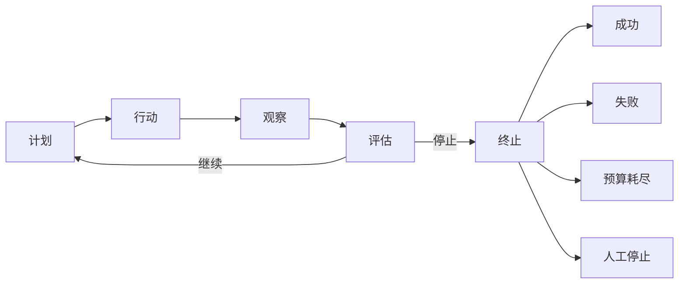

# 智能体循环：让每一步都经过观察和评估

模型说“任务完成了”，不等于系统已经完成任务；工具返回一段文本，也不等于环境真的发生了预期变化。智能体循环把一次开放任务拆成可检查的推进周期：计划、行动、观察、评估、终止。每次行动之后必须回到外部反馈与明确标准，才能继续或停止。

## 学习问题

- 五个阶段各自输入什么、产生什么，为什么行动后不能直接回到计划？
- 模型选择下一步与代码强制预算、权限和人工停止之间如何划界？
- 观察为什么必须是结构化环境反馈，而不是模型对自己输出的复述？
- 哪四种终止结果能替代“直到足够好”的无限循环？

## 定义与尺度边界

本文讨论一个已确认目标在单次任务执行中的控制周期。它依赖 [AI 智能体（Agent）系统边界](/concepts/agt-c-01)对模型、工作流（Workflow）与智能体控制权的划分，也依赖 [智能体运行框架（Agent Harness）](/concepts/agt-c-02)已定义的运行和治理边界。本文只定义循环怎样推进任务，不重新分配智能体运行框架的上下文、工具、权限、恢复和追踪责任。

智能体循环的自治发生在允许的选项之内：**模型选择“下一步做什么”**，例如提出一个假设、选择一次查询或请求一个工具动作；**代码强制执行“还能不能继续”**，例如步数、时限、费用、权限、人工中止和不可逆副作用审批。模型可以建议完成、失败或需要人工处理，但不能自行提高上限、绕过拒绝或把自己的完成声明升级为权威状态。

五个阶段形成一个最小控制词汇，后续八种控制模式可以拆分角色或增加分支，但必须说明这些责任落在哪里：

- 计划（`Plan`）根据目标、显式状态和上一轮观察形成候选下一步。

- 行动（`Act`）提交一次可执行请求。

- 观察（`Observe`）接收环境返回。

- 评估（`Evaluate`）用预先声明的标准判断进展与风险。

- 终止（`Terminate`）把判断固化为明确结果。

## 核心机制

插图判定：**Mermaid 图表工具**。这是一个九个短节点、关系频繁复用且需要文本差异保护的状态流；精确拓扑和低维护成本比手工排版重要。请重点检查两条不变量：行动后只能先观察再评估，任何继续或终止路径都由评估发出。

图中没有从计划、行动或观察直接抵达终止结果的边。即使代码在工具执行期间发现预算耗尽或收到人工停止信号，也应把该事实记录为观察，由评估阶段按确定性优先级处理，再进入终止；这保证追踪中能够回答“基于什么事实停止”，而不是允许模型或工具偷偷改变控制状态。

| 阶段 | 主要输入 | 输出合同 | 关键边界 |
| --- | --- | --- | --- |
| 计划 | 目标、显式任务状态、上一轮观察、允许动作集合 | 一个候选动作及其预期效果 | 计划是可修订假设，不是业务事实，也不授予权限 |
| 行动 | 已选择的候选动作 | 被接受、拒绝或执行的一次动作请求 | 请求必须经过既有智能体运行框架边界；提出动作不等于动作已生效 |
| 观察 | 工具结果、环境状态、拒绝、错误、人工信号 | 可供状态更新和评估的结构化反馈 | 观察是结构化环境反馈，不是模型对自己输出的复述，也不自动等于真相 |
| 评估 | 目标、成功标准、当前状态、观察、代码限制 | 继续或停止决策及理由 | 每条回边和终止边都从这里发出；证据不足不能伪装成成功 |
| 终止 | 评估决策、最终状态、停止原因 | 四种明确终止结果之一 | 终止后不再由模型隐式续跑；恢复或新任务需要新的外部授权 |

观察应至少保留来源、动作或稳定操作标识、状态码、结构化结果或错误类型、时间以及未知结果标记。字段集合由具体工具合同决定，但设计原则不变：把环境返回与模型解释分开。模型可以基于观察形成下一轮计划，系统仍须在需要时通过权威数据源、结果查询或人工复核验证它。

评估同时读取任务标准和代码状态，但二者拥有不同权威性。模型可判断“现有证据是否支持继续检索”“候选答案是否覆盖问题”，代码则先处理人工停止、权限拒绝、硬预算和时限等不可由模型覆盖的信号。只有在这些限制允许继续时，评估才可以回到计划；所有其他路径进入终止。

成功（`success`）表示已满足声明的成功标准并完成必要验证，必须保留通过的标准、最终状态与结果引用。

失败（`failure`）表示已知无法完成，或动作、验证、策略明确失败，必须保留失败分类、最后观察与可恢复性判断。

预算耗尽（`budget exhausted`）表示步数、时间、费用或其他代码上限已到，必须保留被触发的上限、当前消耗和未完成状态。

人工停止（`human stop`）表示人类责任人或外部治理控制要求停止，必须保留停止主体、信号时间与已保存状态。

这四种结果不是质量等级，而是调用者可以处理的控制状态。失败不应吞掉预算耗尽，预算耗尽也不能被模型改写成“再试一次”；人工停止的优先级高于模型继续建议。长期任务若要恢复，应由智能体运行框架读取已保存状态并启动新的受控执行，而不是让已终止循环自行复活。

## 常见混淆

第一种混淆是把内部推理文本直接等同于计划。计划的架构合同是一个可追踪的候选动作、依据和预期效果，不要求暴露或保存模型的私有推理过程。可审计系统记录足以解释控制转移的输入、动作、观察和评价理由，而不是假设更长的推理文本天然更正确。

第二种混淆是让行动结果直接触发下一次行动。例如工具返回“已提交”，循环便立即执行后续写入；若返回其实是排队回执或超时后的未知结果，后续动作会建立在未经核验的假设上。观察与评估不能合并成字符串拼接：先把反馈正规化，再根据权威来源和明确标准决定下一步。

第三种混淆是把循环写成“不断尝试直到足够好”。本文明确**拒绝“直到足够好”的无限循环**：每次执行必须在开始前拥有成功条件、失败条件和代码强制的停止上限。若质量只能主观判断，应设置修订预算、独立评测或人工接受，而不是把终止权留给模型的自我满意度。

{/* terminology-exempt: unknown-english-term | reason: 原始论文的正式方法名必须用于支持边界声明 */}

ReAct 展示模型将推理轨迹与面向环境的动作交错生成，并让后续推理利用环境信息。**该论文证明的是一种提示与交互模式，不是生产运行时保证**：论文中的任务与基准结果不能证明权限隔离、预算强制、副作用幂等、崩溃恢复或人工停止已经由生产系统实现。这些责任仍由智能体运行框架及后续专题中的明确合同承担。

## 说明性场景

一个只读事故诊断任务的目标是判断某次发布后错误率上升的最可能原因。计划先选择查询发布记录，行动请求只读工具，观察返回带来源、时间窗和状态码的结构化记录。评估比较记录与目标，发现时间相关但证据不足，于是回到计划查询对应指标；这个回边来自评估，不是因为工具“看起来有用”便自动连调。

第二次观察显示指标变化与发布一致，但成功标准还要求排除上游依赖。循环继续一次只读查询；若证据满足已声明标准，评估进入终止并输出成功。若查询明确失败则输出失败，若达到查询次数上限则输出预算耗尽，若值班者中途接管则输出人工停止。任何结果都保留当前状态和停止理由，模型不能在终止后自行发起回滚。

这个场景只说明控制周期，不证明诊断结论正确，也不授予变更权限。后续若允许回滚，工具、隔离沙箱（Sandbox）、权限、副作用验证与人工批准仍沿用智能体运行框架及工具安全专题的责任边界。

## 相邻主题

本文消费 [AI 智能体系统边界](/concepts/agt-c-01)的控制权词汇和 [智能体运行框架](/concepts/agt-c-02)的外部约束，不在循环内重定义运行时治理。[上下文、记忆、状态与恢复点](/concepts/agt-c-04)继续拆分循环读写的信息生命周期；[工具、隔离沙箱、权限与副作用](/concepts/agt-c-05)规定行动的执行边界；[追踪、评测与执行约束](/concepts/agt-c-06)区分记录、质量判断和约束执行。

八种模式都复用本文词汇：[工作流与自治智能体](/patterns/agt-p-01)决定是否需要循环，[智能体检索增强生成（Agentic RAG）](/patterns/agt-p-02)用证据充分性终止检索，[规划者—执行者](/patterns/agt-p-03)分离计划与行动，[评估者—优化者（Evaluator-Optimizer）](/patterns/agt-p-04)展开评价回边，[路由与模型分派](/patterns/agt-p-05)选择执行路径，[监督、交接与工具化智能体](/patterns/agt-p-06)移动控制权，[编排者—工作者与扇出/扇入](/patterns/agt-p-07)分解并汇聚动作，[持久智能体与人在回路（Human-in-the-loop）](/patterns/agt-p-08)增加暂停、恢复和人工批准。

[生产事故响应智能体](/cases/production-incident-response-agent)把循环的观察、评估和终止合同放进只读诊断场景：证据不足或动作越权时必须弃权，而不是把模型的完成声明当作事故已解决。

本文属于[概念目录](/concepts)，也是[智能体架构学习路径](/paths/agentic-architecture)的单智能体控制基础。模式可以增加节点和角色，但不能删除评估门、隐藏终止结果，或把代码强制的限制交给模型自行遵守。

## 来源

- [ReAct: Synergizing Reasoning and Acting in Language Models](https://arxiv.org/abs/2210.03629)（`facts-summary`）：支持模型以交错方式生成推理轨迹与任务动作、动作从外部来源或环境取得信息，以及后续推理利用这些信息；不证明本文五阶段运行合同，也不提供生产权限、预算、恢复或终止保证。
- [Building Effective Agents](https://www.anthropic.com/engineering/building-effective-agents)（`facts-summary`）：支持工作流主要沿代码预定路径运行、智能体让模型动态控制过程和工具使用的区分；不建立本文的五阶段拓扑、四种终止结果或代码限制优先级。

五阶段词汇、Mermaid 拓扑、观察字段原则、模型选择与代码强制的分工、四种终止结果及说明性场景，均为 Tego Arch 架构知识项目基于上述窄事实所作的原创综合。本站未复制外部论文或工程文章的原文、示例、图表、布局或实验结构。
