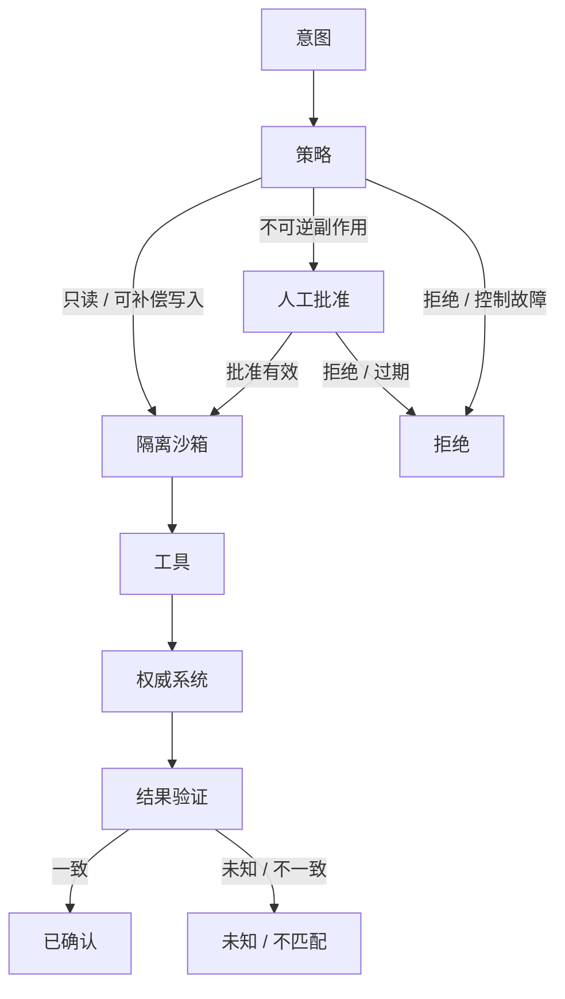

import {handleHorizontalArrowKey} from '@site/src/components/KeyboardScrollableRegion/handleHorizontalArrowKey.mjs';

# 让智能体（Agent）的外部效果经过授权和核验

一个智能体能生成格式正确的工具调用，不代表它有权执行；代码在容器里运行，不代表调用者身份可信；请求超时，也不代表外部世界没有变化。安全动作边界必须把意图、策略、隔离、工具适配、权威系统和结果验证串成不能被模型绕过的执行链。

## 学习问题

- 工具模式、隔离沙箱、权限与副作用分别解决什么问题，为什么不能互相代替？
- 只读、写入和破坏性动作应采用哪些不同的权限、批准、重放和恢复合同？
- 为什么不可逆副作用必须先批准，任何实际效果又必须经过策略、权威系统和结果验证？
- 超时后如何用稳定操作标识、结果查询、补偿和凭据撤销避免盲目重试（Retry）？

## 定义与尺度边界

本文讨论智能体循环（Agent Loop）提出动作后，到外部系统确认结果为止的执行尺度。智能体运行框架（Agent Harness）拥有这条边界：模型只提出意图，代码执行策略与授权，隔离环境收窄可达资源，工具把受检请求转换为外部调用，权威系统决定事实是否改变，验证器再查询和比较预期结果。

**工具**是一个调用合同，包含名称、用途、输入参数、结果形状和错误类别。**工具模式只描述名称、参数与结果合同，不等于授权**。参数通过模式校验，只能证明请求可被解析；它不能证明当前主体可以操作指定租户、资源或环境。

**隔离沙箱**是执行环境边界，限制网络、文件、进程、资源和凭据可见性。**隔离沙箱约束执行环境，不等于主体身份**。两个进程即使处于不同容器，仍可能共享同一高权凭据；反过来，已认证主体也不能因此获得任意网络与文件访问。

**权限**是主体对资源执行动作的可撤销能力。授权必须在实际效果之前检查主体、资源、动作、范围、期限、委派与批准证据，并采用最小权限和默认拒绝。工具注册、提示词约束、模型自述或协议能力协商都不能替代执行点上的授权。

**副作用**是对进程外权威状态产生的可观察变化，例如写文件、创建订单、发布版本、发送消息或删除资源。副作用合同覆盖操作身份、重复执行、查询结果、补偿、人工终态和凭据撤销；“函数返回成功”不是外部效果已确认的充分证据。

模型上下文协议（Model Context Protocol，MCP）可以标准化主机、客户端与服务端之间的能力协商和消息边界，但 **MCP 暴露能力不自动授予安全授权**。服务端公开一个工具，只说明该能力可被发现或调用，不证明调用主体、资源范围、凭据、批准、结果语义与恢复策略已经安全配置。

## 核心机制

插图判定：**Mermaid 图表工具**。这是一个短节点、需频繁演进且必须由文本差异锁定的信任边界流；批准分支和拒绝终态需要精确拓扑，维护成本比精确排版更重要。图中只有不可逆副作用进入人工批准；拒绝路径在产生效果前结束。每条会抵达外部效果终态的路径都依次经过策略、隔离沙箱、工具、权威系统与结果验证。

拒绝是无副作用终态，因此不会为了“走完整流程”而访问权威系统。除此之外，不存在从意图、批准、隔离沙箱或工具直接跳到成功的边；权威系统的回执也必须经过结果验证。策略无匹配、策略求值失败、身份陈旧或批准过期都保持默认拒绝，不能降级到宽权限。

以下矩阵把三类动作的核心语义固定下来。风险仍应结合数据敏感度、故障半径、租户与环境调整，不能只凭工具名称分类。

| 动作级别 | 外部效果 | 权限与批准 | 隔离与凭据 | 重放与核对 | 失败与恢复 |
| --- | --- | --- | --- | --- | --- |
| 只读（`read`） | 不改变权威业务状态；仍可能产生费用、访问审计或敏感数据暴露 | 只发放最小只读范围；无匹配、身份陈旧或策略故障时默认拒绝 | 使用只读凭据，限制网络与文件范围，不把秘密写入提示或日志 | 校验来源、版本和新鲜度；仅对已知无副作用查询做有界重试 | 超时保留未知观察，不升级为已知失败；可重新查询，但不能据空响应断言事实 |
| 写入（`write`） | 创建或修改外部状态；只把存在明确逆向动作的效果视为可补偿 | 校验主体、资源、动作、范围与到期；由风险决定批准，不因工具已注册而放行 | 注入调用所需的窄权限凭据，不暴露平台主凭据，限制目标与出站路径 | 稳定操作标识代表逻辑效果，区别于传输请求标识；以幂等记录和结果查询核对重放 | 超时进入结果未知，先查询权威状态；确认失败才有界重试，确认异常则执行补偿 |
| 破坏性（`destructive`） | 删除、发布或不可逆外部效果，可能没有完整逆向操作 | 在不可逆副作用之前取得人工批准；批准缺失或过期一律拒绝 | 使用一次性或短时凭据，限定单一目标；完成、拒绝或异常后撤销 | 禁止盲目重试；复用稳定操作身份，并以权威回执或结果查询对账 | 结果不明即停止自动化并人工核对；可行时补偿，否则隔离损害、吊销凭据并由责任人决定终态 |

### 身份、执行与结果合同

最小权限不是“选一个低权角色名”，而是把主体、资源、动作、范围、期限和委派路径绑定到本次请求。默认拒绝也不是静默失败：正常拒绝、无匹配、策略故障、身份陈旧和批准过期必须可区分、可追踪并触发相应告警。凭据应按动作即时注入，不进入模型上下文；任务完成、权限变化、人员离岗或检测到异常时必须支持凭据撤销。

隔离应围绕已命名威胁设计。文件写入工具可以只挂载工作区、关闭工作区外路径并限制子进程；生产查询工具可以只访问指定服务和时间窗。隔离缩小可达面，却不能证明授权，也不能替代目标系统的资源级校验。若沙箱和目标系统共同依赖同一平台主凭据，容器边界不会形成独立防御。

结果验证比较预期效果、权威状态和操作记录。验证器至少读取稳定操作标识、目标资源、版本或回执、状态、时间与不确定性；成功必须来自权威查询或可验证回执，不能由模型复述工具文本。结果查询本身应是只读能力，并与写入能力分开授权，避免恢复器为了核对而重新触发效果。

### 超时、幂等与补偿

**超时只说明观察者没有得到结果，不等于已知失败**。外部调用可能在响应丢失前已成功，也可能仍在执行，或在效果前失败。系统应把 `unknown` 作为一等恢复状态：先查询稳定操作标识和目标资源，再决定记录已完成、确认未发生后有界重试、执行补偿或升级人工。

**稳定操作标识代表一次逻辑效果，传输请求标识只代表一次网络尝试**。同一逻辑写入的网络重试必须复用稳定操作标识；每次尝试可有新的传输请求标识用于追踪。若每次超时都生成新的稳定操作标识，目标系统无法识别重放；若永久复用同一标识，又会把新的业务意图误判为旧操作。

幂等约束同一逻辑操作的受保护效果不倍增，不提供任意系统的恰好一次保证，也不解决两个不同命令争夺同一不变量。能原子提交操作记录与效果时，可用唯一约束或条件写选出单一执行者；不能原子耦合时，把稳定身份传到目标侧，保存回执，并提供结果查询、对账与人工终态。

补偿不是数据库回滚的同义词。它是一个新的、受权且可失败的业务动作，例如撤销预订、回滚发布或创建反向记账。补偿仍需自己的稳定操作标识、权限、结果验证和停止条件；不可逆效果没有可信补偿时，应在执行前提高批准强度，并准备隔离、通知、凭据撤销与人工处置。

## 常见混淆

第一种混淆是把工具模式当授权列表。模式让模型和运行时知道参数怎样编码，模型上下文协议或工具注册表让能力可被发现；它们都没有自动回答“这个主体现在能否删除这个生产资源”。授权必须由工具执行路径上的政策决策点和目标系统共同强制。

第二种混淆是把沙箱当身份系统。网络、文件和进程隔离可以限制攻击面，却不知道调用代表哪个租户、审批者或业务所有者。认证也不能反向替代沙箱：知道主体是谁，并不意味着其工具进程应该看见宿主文件、云元数据或平台主凭据。

第三种混淆是把工具成功响应当作权威结果，或把超时当失败后直接重试。排队回执、代理缓存、异步任务和丢失响应都可能让返回与实际状态分离。结果验证必须查询权威系统；未知结果必须暂停自动串联的后续写入。

第四种混淆是把护栏（guardrail）当成完整业务授权。输入、输出或函数工具护栏可以检查内容、参数与策略信号，并在声明范围内触发停止；它们不能凭名称证明资源级权限、人工批准、外部幂等或补偿已经实现。护栏是执行链中的一层，目标系统授权和结果验证仍不可删除。

## 说明性场景

一个生产事故响应智能体先查询发布记录、指标和配置差异。策略只签发限定服务与时间窗的只读凭据，隔离沙箱禁止访问其他租户和工作区外文件。每次查询都记录来源与新鲜度；查询超时只产生未知观察，智能体循环不能据此断言“没有发布”或直接进入回滚。

智能体随后提出回滚。策略把它分类为可能扩大故障半径的破坏性动作，生成包含目标版本、范围、到期和预期效果的批准提案。值班责任人批准后，运行时才签发一次性部署凭据；工具携带稳定回滚操作标识调用部署权威系统。传输请求超时后，系统不再发一笔新回滚，而是用同一稳定操作标识查询部署状态。

若权威系统确认目标版本已生效，验证器继续检查健康信号并记录已确认；若结果不明，自动化停止、撤销部署凭据并升级人工；若部分实例改变，责任人选择继续对账、执行受控补偿或隔离流量。这个场景展示安全合同，不证明任意事故、框架、模型、沙箱或部署平台已经满足它。

## 相邻主题

本文依赖 [AI 智能体系统边界](/concepts/agt-c-01)、[智能体运行框架](/concepts/agt-c-02)和[智能体循环](/concepts/agt-c-03)：模型提出动作，运行框架强制执行边界，循环在结果验证后才能继续。[上下文、记忆、状态与执行检查点（Checkpoint）](/concepts/agt-c-04)为稳定操作身份、未知结果和副作用账本提供显式状态；[追踪、评测与执行约束](/concepts/agt-c-06)继续区分记录、质量判断和拒绝权。

[最小权限、安全默认值与纵深防御](/principles/pr-09)定义授权与凭据生命周期，[幂等与最小协调](/principles/pr-10)定义稳定操作身份、结果查询和未知终态。[持久智能体与人在回路（Human-in-the-loop）](/patterns/agt-p-08)会消费批准、暂停和恢复合同；[长时编码智能体](/cases/long-running-coding-agent)与[生产事故响应智能体](/cases/production-incident-response-agent)分别检验工作区副作用和生产变更边界。本文也是[智能体架构学习路径](/paths/agentic-architecture)的动作安全基础。

## 来源

- [MCP Architecture（2025-06-18 版）](https://modelcontextprotocol.io/specification/2025-06-18/architecture)（`facts-summary`）：支持模型上下文协议的主机、客户端与服务端架构以及能力协商边界；不证明授权、安全性（Security）或生产适用性，也不支持“暴露工具即安全授权”的结论。
- [OpenAI Agents SDK 智能体开发工具包的工具文档](https://github.com/openai/openai-agents-python/blob/2fa463571e76dae8ff267622f1018eaf06ffeb9f/docs/tools.md)（`facts-summary`）：支持固定提交中函数工具的模式与调用形态；不授予业务权限，不证明任意工具结果可信或外部副作用安全。
- [Guardrails](https://github.com/openai/openai-agents-python/blob/2fa463571e76dae8ff267622f1018eaf06ffeb9f/docs/guardrails.md)（`facts-summary`）：支持固定提交所记录的输入、输出与函数工具护栏范围和触发行为；不等于资源级业务授权或副作用批准，也不证明目标系统已实现幂等和补偿。
{/* terminology-exempt: unknown-english-term | reason: 正式论文作者姓氏与 NIST 框架英文简称须用于精确来源边界 */}
- [The Protection of Information in Computer Systems](https://web.mit.edu/Saltzer/www/publications/protection/)（`facts-summary`）：Saltzer 等作者的材料仅支持基于许可的默认值与完成工作所需最低权限；不证明已部署策略确实最小、独立或正确。
- [NIST SP 800-160 Vol. 1 Rev. 1](https://csrc.nist.gov/pubs/sp/800/160/v1/r1/final)（`facts-summary`）：支持生命周期安全工程、验证与风险处置的宽阔方法背景；不规定本文拓扑、动作分级、批准阈值或具体沙箱实现。
- [Making retries safe with idempotent APIs](https://aws.amazon.com/builders-library/making-retries-safe-with-idempotent-APIs/)（`facts-summary`）：支持调用者提供请求身份与语义等价的选定变更接口重试合同；不提供普遍恰好一次执行，也不能让任意外部效果自动具备幂等性。
{/* terminology-exempt: unknown-english-term | reason: NIST 正式框架英文简称须用于精确来源边界 */}
- [AI RMF 1.0](https://www.nist.gov/publications/artificial-intelligence-risk-management-framework-ai-rmf-10)（`facts-summary`）：支持风险、监测、人工监督、恢复与退役机制的方法背景；不规定动作矩阵或批准阈值，也不证明某个智能体系统已经得到治理。

Mermaid 拓扑、三行动矩阵、工具—隔离—授权—效果四分法、稳定操作标识与传输请求标识分工、结果验证顺序、补偿与凭据撤销合同及说明性场景，均为 Tego Arch 架构知识项目基于上述窄事实所作的原创综合。本站未复制来源原文、代码、示例、表格、图示、布局或完整结构。
