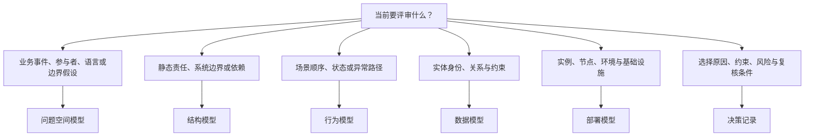

# 建模总览

模型是针对一个评审问题压缩事实的工具，不是越完整越好的系统副本。[建模目录](/modeling)提供各类模型入口；本文先确定要证明什么，再进入 [C4 Context 与 Container](/modeling/mod-02)。

## 学习问题

- 问题空间、结构、行为、数据、部署和决策模型分别回答什么？
- 如何从评审问题选择最小而充分的模型？
- 如何写清一个模型明确没有证明什么？

## 建模目标与输入

输入不是“想画一张架构图”，而是一个可判断的评审问题、目标受众、事实截止时间和可用证据。[质量属性场景](/quality-attributes/qa-01)可把模糊目标改写为可评审刺激、响应和度量。目标是选择最小模型组合，让评审者能指出范围、边界、关系、变化责任与证据缺口。

## 参与者与步骤

问题提出者先写下一句需要判断的话；事实所有者提供代码、运行、数据或决策证据；模型维护者选择视图并声明范围；未参与绘图的评审者尝试复述。先选问题类别，再选模型，再写“本模型不证明”，最后决定是否需要第二种互补模型。

## 模型产物

| 问题类别 | 首选产物 | 主要证明 | 明确不证明 |
| --- | --- | --- | --- |
| 问题空间 | EventStorming、Domain Storytelling、Context Map | 事件、参与者、语言与边界假设 | 软件内部结构已经正确 |
| 结构 | C4 Context、Container、Component | 静态边界、责任与依赖 | 运行顺序和部署拓扑 |
| 行为 | sequence、Dynamic、state machine | 场景顺序、状态转换与异常路径 | 静态所有权或容量 |
| 数据 | 概念、逻辑、物理数据模型与 ER | 身份、关系、约束和实现映射 | 业务流程已经完整 |
| 部署 | C4 Deployment、UML deployment | 实例、节点、环境和基础设施关系 | 容量与故障切换已经验证 |
| 决策 | ADR、约束、风险与质量属性场景 | 选择原因、边界与复核条件 | 运行事实自动与决策一致 |

## 完成判断

模型名称、范围、受众和事实截止时间明确；每个元素能追溯到事实或显式假设；评审者能说明该模型证明什么、没有证明什么，以及下一份证据由谁补充。

## 常见失败

从熟悉的工具反推问题，会让所有问题都变成同一种图。把结构、顺序、部署和决策混在一张图中，会产生无法验证的伪精确。没有事实截止时间的图，也会把历史设计误当作当前运行事实。

## 与其他模型的衔接

[C4 Context 与 Container](/modeling/mod-02)用于系统与容器边界；行为问题要补 Dynamic 或 sequence；部署问题要补 Deployment；决策原因要由 [ADR 生命周期](/methods/mth-03)承担。不同模型共享规范名称，但不能互相冒充证据。

## 完整演练

费用申报系统评审先问“员工、系统和外部银行的边界是否清楚”，因此选择 Context；再问“责任落在哪些可运行或存储单元”，因此选择 Container。审批顺序改用 Dynamic，生产实例映射改用 Deployment，数据身份与约束留给数据模型，选择原因写入 ADR。结果不是一张万能图，而是一组按问题展开的最小证据；同样的选择顺序可用于 [Microsoft multi-agent reference architecture 案例](/cases/microsoft-multi-agent-reference-architecture)，但模型仍需由该系统的事实证据支撑。

## 来源

模型集合与推荐边界依据 [C4 diagrams](https://c4model.com/diagrams)，自描述符号与图例原则依据 [C4 notation](https://c4model.com/diagrams/notation)，跨视图文档一致性参考 [arc42](https://arc42.org/)。本文选择表、决策图和费用申报演练为本站原创。
