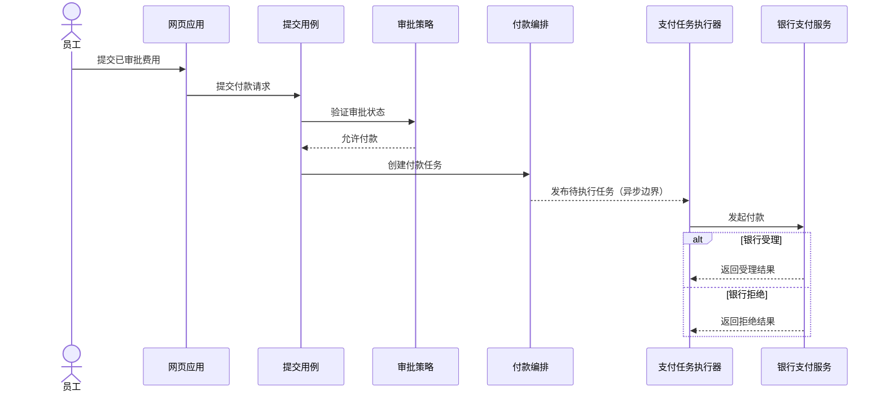

# C4 架构模型组件图、动态图与部署

同一套系统名称可以投影成三个不同证据边界：组件评审容器内部责任，动态图评审一个关键场景的运行时协作，部署评审某个环境中的实例与节点。先从[建模目录](/modeling)进入，用[建模选择总览](/modeling/mod-01)确定问题，再继承 [上下文与容器](/modeling/mod-02)已经审计过的边界和元素名，不为画图另造系统。

## 学习问题

- 何时值得把一个容器展开成组件？
- 如何让动态图只说明一个关键场景，而不是变成请求目录？
- 部署中的部署节点、容器实例与基础设施节点如何分开？
- 三种视图分别明确不证明什么？

## 建模目标与输入

输入包括 MOD-02 已审计的系统与容器边界，以及每个视图各自的一条评审问题和证据。组件需要代码、依赖与变化所有权证据，缺失项必须标为显式假设；动态图需要单一用例、可执行测试与追踪证据；部署需要环境清单、配置与观测，并记录事实截止时间为 2026-07-30。没有明确评审问题或证据边界就不增加视图。

这三个视图必须沿用员工、网页应用、申报应用程序编程接口（Application Programming Interface，API）、申报数据库、支付任务执行器与银行支付服务等固定名称。视图之间共享词汇，不共享证明范围。本文费用申报系统拓扑是教学演练假设，并非经过生产盘点确认的生产拓扑事实。

## 参与者与步骤

系统负责人先确认 MOD-02 边界未变；申报 API 的维护者确认内部责任和接口；业务代表确认“已审批费用付款”这一条场景；运维人员确认生产环境、节点和实例。

1. 只把 `申报 API` 选为组件范围，检查责任、接口与变更所有权是否需要单独评审。
2. 只保留 `提交用例`、`审批策略`、`付款编排`、`持久化端口` 四个内部责任单元，不把类、包或框架目录伪装成架构组件。
3. 选择一次已审批费用付款，按交互先后连接现有元素；不收集所有请求。
4. 命名一个教学演练中的生产环境，分别列出部署节点与容器实例，再核对每个实例来自哪个 MOD-02 容器；数据库部署节点承载申报数据库容器实例。
5. 为每个视图写出“不证明”声明，并让评审者说明还需要哪类运行证据。

## 模型产物

### 组件

组件范围仅限 `申报 API`。内部只有 `提交用例`、`审批策略`、`付款编排` 与 `持久化端口`：提交用例协调一次提交，审批策略判断是否允许付款，付款编排创建待执行任务，持久化端口隔离申报数据库接口。组件是可选视图，只有责任、接口或变更所有权确实需要评审时才创建；如果容器级说明已经足够，就不维护它。组件不证明代码与图一致，也不能替代代码、依赖和所有权检查。

### 动态图：已审批费用付款

动态图只覆盖一个已审批费用进入付款执行的场景，不是请求目录，也不枚举失败、重试（Retry）和补偿的所有分支。

交互顺序仅表达这一次场景的相对先后，不承诺线程、消息协议或耗时。动态图不等于性能报告或生产追踪，也不证明真实调用一定按图发生；性能、追踪与失败证据仍来自运行系统。

### 部署

视图只命名教学演练中的“生产环境”：`员工终端`、`Web 节点`、`API 节点`、`数据库节点` 与 `任务执行节点` 都是部署节点；其中的 `Web 应用实例`、`申报 API 实例`、圆柱形 `申报数据库实例` 与 `支付任务执行器实例` 都是容器实例，数据库部署节点承载申报数据库容器实例。`基础设施节点` 是部署可选类型，本最小教学图未引入对应实例，也不额外添加域名系统或负载均衡器。`银行支付服务` 仍在系统边界之外。不要把演练映射误写成已经盘点确认的生产事实。

部署不证明容量或故障切换能力，也不能仅凭多实例图形声称高可用；容量、故障切换和恢复能力需要配置、测试与生产观测支持。

## 完成判断

组件只展开申报 API，四个责任单元都能用“负责什么、向谁提供什么接口、谁拥有变化”回答；不需要这一层时明确删除。动态图只有一个已审批费用付款场景，参与者名称与 MOD-02 一致。部署明确写出教学演练假设，区分部署节点与容器实例，并说明基础设施节点只是未实例化的可选类型。每个视图都有可复述的“不证明”声明。

## 常见失败

把源代码目录逐个搬进组件会制造代码一致性的假象；把所有 API、异常和重试塞进动态图会让关键评审路径消失；把云区域、主机、容器组、进程、数据库与外部服务画成同层盒子会掩盖部署的实例关系。另一个失败是同时维护三个视图，却没有每个视图各自的评审问题，最终只得到重复且很快过期的清单。

## 与其他模型的衔接

[MOD-02 上下文与容器](/modeling/mod-02)提供本页不可擅自改名的系统边界和可运行单元；组件只在其中展开申报 API。若动态图暴露重试、幂等或补偿风险，应把决策写入架构决策记录（Architecture Decision Record，ADR），并用测试和追踪补证。若部署暴露容量、可用性或恢复问题，应转到相应质量属性（Quality Attribute）场景，而不是继续给图添加未经验证的数字。

[MOD-07 统一建模语言（Unified Modeling Language，UML）选图指南](/modeling/mod-07)从评审问题比较时序图与部署等 UML 视图；本页则继续限定 C4 架构模型动态图与部署的具体观察尺度和证据边界。

同样的三视图分工可用于 [微软多智能体（Agent）参考架构案例](/cases/microsoft-multi-agent-reference-architecture)，但案例中的智能体、运行时与基础设施名称必须来自该系统自己的已审计边界，不能借用费用申报元素。

[arc42 架构文档模板：文档骨架](/modeling/mod-04)把本页的静态、运行与部署证据放回可裁剪的整体文档结构，同时保留各视图“不证明什么”的边界。

## 完整演练

输入是已审计的费用申报系统教学案例：员工通过网页应用提交费用，申报 API 持有业务规则与数据，支付任务执行器调用银行支付服务；评审问题分别是业务变化归属、已审批费用的付款协作、生产实例落点。拓扑细节仍是截至 2026-07-30 的教学演练假设，不代表真实生产环境。

先判断组件是否必要。团队正要拆分审批与付款变更责任，因此只展开申报 API，得到提交用例、审批策略、付款编排、持久化端口四个责任单元。接着只画已审批费用付款：员工提交，提交用例验证审批状态并创建任务，执行器调用银行。最后声明一个教学演练中的生产环境，区分承载节点与网页、API、数据库、执行器容器实例，其中数据库部署节点承载申报数据库容器实例。评审结束时，团队同时记录代码一致性、性能追踪、容量与故障切换都没有被这些图证明。

## 来源

组件的范围、元素、受众与可选性依据 [C4 Model — Component diagram](https://c4model.com/diagrams/component)；单场景运行时协作依据 [C4 Model — Dynamic diagram](https://c4model.com/diagrams/dynamic)；环境、节点与实例区分依据 [C4 Model — Deployment diagram](https://c4model.com/diagrams/deployment)。跨视图命名和文档组织参考 [arc42](https://arc42.org/)。本文的费用申报拆分、序列与文字部署示例均为本站原创。
