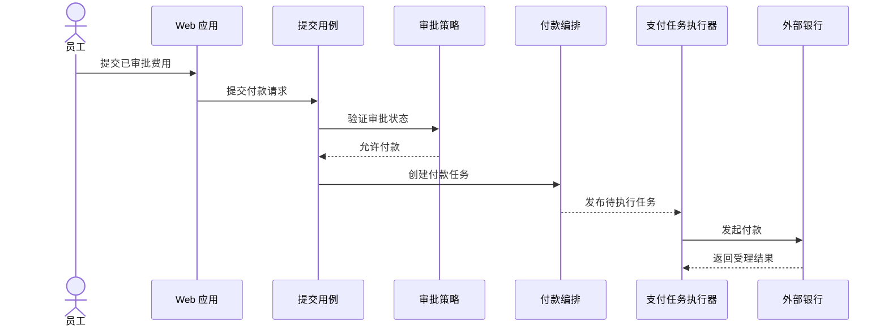

# C4 Component、Dynamic 与 Deployment

同一套系统名称可以投影成三个不同证据边界：Component 评审容器内部责任，Dynamic 评审一个关键场景的运行时协作，Deployment 评审某个环境中的实例与节点。先从[建模目录](/modeling)进入，用[建模选择总览](/modeling/mod-01)确定问题，再继承 [Context 与 Container](/modeling/mod-02)已经审计过的边界和元素名，不为画图另造系统。

## 学习问题

- 何时值得把一个 Container 展开成 Component？
- 如何让 Dynamic 只说明一个关键场景，而不是变成请求目录？
- Deployment 中的部署节点、容器实例与基础设施节点如何分开？
- 三种视图分别明确不证明什么？

## 建模目标与输入

输入只有两部分：MOD-02 已审计的系统与 Container 边界，以及每个视图各自的一条评审问题。Component 问“申报 API 内部谁负责业务变化”；Dynamic 问“已审批费用怎样进入付款执行”；Deployment 问“生产环境中哪些实例运行在哪类节点上”。没有明确评审问题就不增加视图。

这三个视图必须沿用员工、Web 应用、申报 API、申报数据库、支付任务执行器与外部银行等固定名称。视图之间共享词汇，不共享证明范围。

## 参与者与步骤

系统负责人先确认 MOD-02 边界未变；申报 API 的维护者确认内部责任和接口；业务代表确认“已审批费用付款”这一条场景；运维人员确认生产环境、节点和实例。

1. 只把 `申报 API` 选为 Component 范围，检查责任、接口与变更所有权是否需要单独评审。
2. 只保留 `提交用例`、`审批策略`、`付款编排`、`持久化端口` 四个内部责任单元，不把类、包或框架目录伪装成架构组件。
3. 选择一次已审批费用付款，按交互先后连接现有元素；不收集所有请求。
4. 命名一个生产环境，分别列出部署节点、Container 实例和数据库等基础设施节点，再核对每个实例来自哪个 MOD-02 Container。
5. 为每个视图写出“不证明”声明，并让评审者说明还需要哪类运行证据。

## 模型产物

### Component：申报 API 的责任边界

Component 范围仅限 `申报 API`。内部只有 `提交用例`、`审批策略`、`付款编排` 与 `持久化端口`：提交用例协调一次提交，审批策略判断是否允许付款，付款编排创建待执行任务，持久化端口隔离申报数据库接口。Component 是可选视图，只有责任、接口或变更所有权确实需要评审时才创建；如果 Container 级说明已经足够，就不维护它。Component 不证明代码与图一致，也不能替代代码、依赖和所有权检查。

### Dynamic：已审批费用付款

Dynamic 只覆盖一个已审批费用进入付款执行的场景，不是请求目录，也不枚举失败、重试和补偿的所有分支。

渐进编号仅表达这一次场景的相对先后，不承诺线程、消息协议或耗时。Dynamic 不等于性能报告或生产追踪，也不证明真实调用一定按图发生；性能、追踪与失败证据仍来自运行系统。

### Deployment：一个生产环境

Deployment 位置先保留为文字，Task 3 再提供原创资产。视图只命名“生产环境”：部署节点表示承载边界，节点中的 `Web 应用`、`申报 API` 与 `支付任务执行器` 是 Container 实例，托管数据库服务是承载申报数据库的基础设施节点，`外部银行` 仍在系统边界之外。不要把实例、节点和基础设施画成同一种盒子。

Deployment 不证明容量或故障切换能力，也不能仅凭多实例图形声称高可用；容量、故障切换和恢复能力需要配置、测试与生产观测支持。

## 完成判断

Component 只展开申报 API，四个责任单元都能用“负责什么、向谁提供什么接口、谁拥有变化”回答；不需要这一层时明确删除。Dynamic 只有一个已审批费用付款场景，参与者名称与 MOD-02 一致。Deployment 明确写出生产环境，并能区分部署节点、Container 实例与基础设施节点。每个视图都有可复述的“不证明”声明。

## 常见失败

把源代码目录逐个搬进 Component 会制造代码一致性的假象；把所有 API、异常和重试塞进 Dynamic 会让关键评审路径消失；把云区域、主机、Pod、进程、数据库与外部服务画成同层盒子会掩盖 Deployment 的实例关系。另一个失败是同时维护三个视图，却没有每个视图各自的评审问题，最终只得到重复且很快过期的清单。

## 与其他模型的衔接

[MOD-02 Context 与 Container](/modeling/mod-02)提供本页不可擅自改名的系统边界和可运行单元；Component 只在其中展开申报 API。若 Dynamic 暴露重试、幂等或补偿风险，应把决策写入 ADR，并用测试和追踪补证。若 Deployment 暴露容量、可用性或恢复问题，应转到相应质量属性场景，而不是继续给图添加未经验证的数字。

同样的三视图分工可用于 [Microsoft multi-agent reference architecture 案例](/cases/microsoft-multi-agent-reference-architecture)，但案例中的 Agent、运行时与基础设施名称必须来自该系统自己的已审计边界，不能借用费用申报元素。

## 完整演练

输入是已审计的费用申报系统：员工通过 Web 应用提交费用，申报 API 持有业务规则与数据，支付任务执行器调用外部银行；评审问题分别是业务变化归属、已审批费用的付款协作、生产实例落点。

先判断 Component 是否必要。团队正要拆分审批与付款变更责任，因此只展开申报 API，得到提交用例、审批策略、付款编排、持久化端口四个责任单元。接着只画已审批费用付款：员工提交，提交用例验证审批状态并创建任务，执行器调用银行。最后声明一个生产环境，区分承载节点、Web/API/执行器实例、托管数据库基础设施节点。评审结束时，团队同时记录代码一致性、性能追踪、容量与故障切换都没有被这些图证明。

## 来源

Component 的范围、元素、受众与可选性依据 [C4 Component diagram](https://c4model.com/diagrams/component)；单场景运行时协作依据 [C4 Dynamic diagram](https://c4model.com/diagrams/dynamic)；环境、节点与实例区分依据 [C4 Deployment diagram](https://c4model.com/diagrams/deployment)。跨视图命名和文档组织参考 [arc42](https://arc42.org/)。本文的费用申报拆分、序列与文字部署示例均为本站原创。
