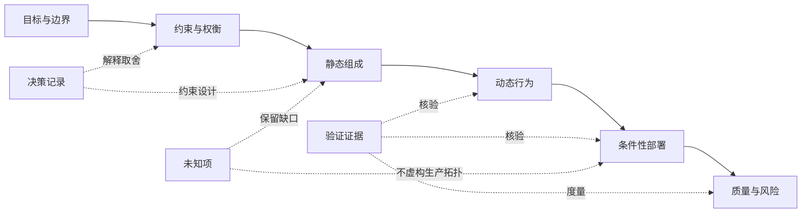

# arc42 文档骨架

arc42 组织架构知识，不替团队创造事实。本文把 [arc42 v9.0 Overview](https://arc42.org/overview) 的十二个问题域映射为本站原创的六单元教学骨架；它不是 arc42 官方模板，也不复制官方字段。先从[建模目录](/modeling)和[建模总览](/modeling/mod-01)确定评审问题，再复用 [C4 Component、Dynamic 与 Deployment](/modeling/mod-03)已经区分的结构、行为和部署证据。

## 学习问题

- 如何裁剪 arc42，而不是为了章节完整度制造内容？
- 如何让 Building Block View 成为静态组成主线，又不混淆运行和部署事实？
- 如何区分案例中的已验证事实、基于证据的推断、本地项目决策和未知项？
- 如何把质量场景、ADR、风险和验证证据接回文档骨架？

## 建模目标与输入

输入包括评审问题、干系人、业务目标、约束、现有模型、决策记录、运行证据和事实截止时间。本文以 [Microsoft 多智能体参考架构案例](/cases/microsoft-multi-agent-reference-architecture)为端到端载体，只使用其固定提交公开材料。费用申报系统只通过 [Context/Container](/modeling/mod-02)和 MOD-03 回看视图分工，不与 Microsoft 案例事实混写。

每条陈述先分类：**已验证事实**来自公开文本或图；**基于证据的推断**由公开材料合理推出但未被直接陈述；**本地项目决策**是本站为了教学选择的裁剪和验收标准；**未知项**是生产拓扑、容量、恢复目标或组织所有权等尚无证据的内容。未知不等于失败，伪造完整才是失败。

## 参与者与步骤

业务和产品负责人确认目标与边界，架构负责人组织静态和动态证据，开发与运维人员核验实现和运行事实，决策责任人批准取舍，未参与编写的评审者检查未知项是否被隐藏。

1. 先记录目标、干系人和系统上下文，再筛出真正塑造架构的约束。
2. 写出总策略和关键决策，把事实、推断与本地决定分栏。
3. 以 Building Block View 为静态主线，只分解到能回答责任、接口和所有权问题的层级。
4. 选择少量关键运行场景，说明责任交接、失败和恢复，不把调用顺序塞进静态结构。
5. 只记录有证据的部署节点和实例；Microsoft 材料没有证明的生产拓扑保持未知。
6. 写出可度量质量场景、风险和术语，再检查每项能否回到结构、运行、部署、决策或验证证据。

## 模型产物

arc42 v9.0 仍以十二个问题域组织内容。下面的六单元只是本站原创教学投影，可以按评审需要继续裁剪。

| 本站原创单元 | 对应 arc42 v9 问题域 | 核心问题 | 最小证据与产物 | 明确不证明 |
| --- | --- | --- | --- | --- |
| 目标与边界 | 1 Introduction and Goals；3 Context and Scope | 为什么建、为谁建、边界在哪里 | 目标、干系人、质量目标、业务与技术上下文 | 内部结构或运行顺序已经正确 |
| 约束与权衡 | 2 Architecture Constraints；4 Solution Strategy；9 Architecture Decisions | 哪些条件不可改变，采用什么总策略，为什么取舍 | 约束、总策略、ADR 与复核条件 | 决策已经被正确实现 |
| 静态组成 | 5 Building Block View；8 Cross-cutting Concepts 的结构部分 | 责任单元、接口和依赖如何分层 | Building Block 分解、职责、接口、所有权 | 真实调用顺序或部署实例 |
| 动态行为 | 6 Runtime View；8 Cross-cutting Concepts 的运行部分 | 关键场景如何跨边界执行 | 场景顺序、状态、失败与恢复 | 性能或生产追踪已经达标 |
| 条件性部署 | 7 Deployment View | 软件实例在什么已知环境运行 | 经验证的节点、实例和环境映射 | 容量、容灾或故障切换有效 |
| 质量、风险与词汇 | 10 Quality Requirements；11 Risks and Technical Debt；12 Glossary | 如何度量成败、最大风险是什么、术语是否一致 | 质量场景、风险与债务、统一词汇 | 风险已经被处置或质量已经达成 |

Building Block View 是本文核心主线中的静态组成视图。Microsoft 公开材料明确给出 Orchestrator、Specialized Agents 和 Agent Registry 等构件，这是**已验证事实**；把分散职责重组为控制、执行、数据与保障平面，是**基于证据的推断**；选择只展开控制平面，是**本地项目决策**；真实团队所有权仍是**未知项**。

静态组成不自动证明运行顺序，运行场景不自动证明部署事实，决策记录不自动证明实现符合预期。arc42 不替代 ADR、质量场景、风险分析或运行证据；它只让这些产物能被找到、复核和共同演进。

## 完成判断

六单元能覆盖当前评审所需的十二个问题域，但没有为未使用章节填充空话；Building Block 的每个元素有责任和证据分类；关键运行场景与静态组成名称一致；部署未知项没有被虚构拓扑、容量或故障切换填满；至少一个质量场景能回链到决策、验证和风险。

评审者还应能指出哪些内容被裁剪、为什么裁剪、由什么事件触发补写。文档完整度不是停止条件，足以支持当前决定且未知项有负责人和复核触发才是。

## 常见失败

最常见的失败是复制十二章标题后逐项填空，把“暂无证据”改写成模糊愿景。另一个失败是把组件、运行步骤和部署节点放进同一层清单，导致 Building Block 无法表达稳定责任。只记录决定而没有 ADR 状态与替代关系，只记录质量口号而没有度量，或只画部署图却没有环境盘点，都会切断证据链。

不要从 Microsoft 参考架构图推断其生产区域、实例数、容量或故障切换。公开材料未证明的生产拓扑必须保留为未知；本文不虚构拓扑、容量或故障切换来满足模板完整度。

## 与其他模型的衔接

[建模总览](/modeling/mod-01)负责从问题选择模型，[MOD-03](/modeling/mod-03)提供结构、行为和部署的证明边界。[ADR 生命周期](/methods/mth-03)维护决策状态与替代关系，[从需求到演进的架构闭环](/methods/mth-06)把质量、风险、实现和运行反馈接回文档。Microsoft 案例提供公开事实，但不能替代项目自己的生产盘点。

MOD-13 将承担持续建模与漂移治理，但 MOD-13 尚未发布；本页只记录未来交接方向，不创建失效链接或 `adjacent_topics`。费用申报示例继续以 [MOD-02](/modeling/mod-02) 的图为权威，不进入本文 Microsoft 案例的事实清单。

## 完整演练

目标是把 Microsoft 多智能体参考架构整理成一次可评审知识包。目标与边界记录“企业治理下的多智能体职责分工”；约束与权衡记录中央编排、注册准入和策略执行；静态组成以 Orchestrator、Registry、Specialized Agents、Memory 与保障能力为 Building Blocks；动态行为选择一次请求分类、路由、专业 Agent 执行和结果聚合；部署因缺少公开生产盘点而保留未知。

质量场景采用本站教学验收标准：

- **来源：** 架构评审者；
- **刺激：** 请求追踪一次跨多个 Agent 的业务流程；
- **环境：** 参考实现的正常运行演练；
- **制品：** 编排、Agent 间消息和遥测链路；
- **响应：** 关联关键步骤并定位失败责任边界；
- **度量：** 演练选定的全部关键步骤都有一致关联标识，故障步骤能在 10 分钟内定位。

这个度量是本站教学验收标准，不是 Microsoft 的生产承诺。若观测材料只能证明应采集动作、工具调用和响应模式，却没有给出本项目的关联标识实现，记录为**基于证据的推断**与**未知项**；不得把建议写成已经通过的运行事实。

## 来源

十二个问题域和裁剪原则依据 [arc42 v9 Overview](https://arc42.org/overview)，静态分解依据 [Building Block View](https://docs.arc42.org/section-5/)，质量概览与详细场景依据 [Quality Requirements](https://docs.arc42.org/section-10/)，版本依据固定提交中的 [v9.0 version record](https://github.com/arc42/arc42-template/blob/8dff0d9b1f9640684df8c3bbcdc2ee45f989ca0f/EN/version.properties)。案例事实依据 Microsoft 固定提交中的 [Reference Architecture](https://github.com/microsoft/multi-agent-reference-architecture/blob/ed3613b54b46b595dd223aaff8772def376a8c37/docs/reference-architecture/Reference-Architecture.md)、[Building Blocks](https://github.com/microsoft/multi-agent-reference-architecture/blob/ed3613b54b46b595dd223aaff8772def376a8c37/docs/building-blocks/Building-Blocks.md)与 [Observability](https://github.com/microsoft/multi-agent-reference-architecture/blob/ed3613b54b46b595dd223aaff8772def376a8c37/docs/observability/Observability.md)。六单元结构、映射、Mermaid 和演练为本站原创。
