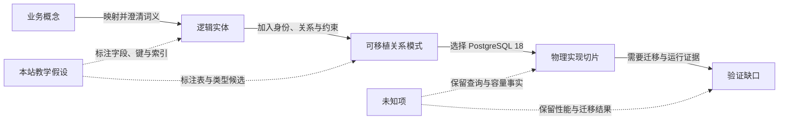

# 概念、逻辑与物理数据模型

数据模型不是一次把业务词汇翻译成 SQL，而是逐层增加决定。本文沿用[建模目录](/modeling)与[建模总览](/modeling/mod-01)的选择方法，以同一个费用申报系统贯穿概念模型、逻辑模型、可移植关系模式和 PostgreSQL 18 物理实现切片。

## 学习问题

- 如何从业务概念逐步加入身份、关系、约束和平台决定，而不把不同层次混成一张表？
- 逻辑模型与可移植关系模式各自证明什么，又明确不证明什么？
- PostgreSQL 18 的约束、类型和索引候选应怎样标注证据边界？
- 如何让未知的查询分布、容量和迁移结果保持可见？

## 建模目标与输入

[MOD-02 Context/Container](/modeling/mod-02)只为本文提供费用申报系统的边界和词汇：员工提交申报，系统组织审批，并向银行支付服务发起付款。MOD-02 的图仍是系统边界与“银行支付服务”名称的权威；本文出现的实体、字段、键、约束、类型选择、关系模式和索引均是本站原创的教学假设，不是 MOD-02 已经证明的事实，也不是某个真实组织的生产设计。

输入包括业务词汇、身份需求、金额与币种语义、关系基数、唯一性、不变量、主要查询假设、目标 DBMS 版本和仍待验证的容量事实。先标出事实、教学决定与未知项，再从业务概念逐层细化，避免以现有数据库倒推业务含义。

## 参与者与步骤

业务负责人确认术语、身份和不变量；数据建模者维护层次间映射；应用开发者核对写入与查询需求；数据库工程师评估 PostgreSQL 约束、类型和访问路径；独立评审者检查每层是否越界声称了性能或生产就绪。

1. 先识别员工、费用申报、审批和付款四类业务概念，不引入表、键或 DBMS。
2. 为逻辑实体加入稳定身份、属性、关系基数、金额与币种语义、唯一性和业务约束，但不选择 DBMS。
3. 把逻辑实体映射为可移植关系模式，记录表、PK/FK、唯一性、类型族和索引候选。
4. 选择 PostgreSQL 18 后，把约束类别、具体类型选择和索引类别作为物理实现切片。
5. 把查询分布、基数、写入成本、容量、迁移安全和实测性能留在验证缺口中，不用模型图替代证据。

## 模型产物

四层产物共享同一业务问题，但后层只能增加可追踪的决定，不能改写前层词义。

| 层次 | 回答的问题 | 费用申报示例 | 新增决定 | 明确不证明 |
| --- | --- | --- | --- | --- |
| 概念模型 | 业务中有哪些事物与词义 | 员工、费用申报、审批、付款 | 概念边界与业务关系 | 实体键、基数、表结构或流程顺序 |
| 逻辑模型 | 实体如何识别、关联并受约束 | Employee、ExpenseClaim、Approval、PaymentInstruction | 唯一标识、属性、关系、基数与业务约束 | SQL 表已设计或查询性能达标 |
| 可移植关系模式 | 逻辑实体如何映射为关系结构 | employee、expense_claim、approval、payment_instruction | 表、PK/FK、唯一性、类型族和索引候选 | 严格意义上的 DBMS 物理模型或可部署 schema |
| PostgreSQL 18 物理实现切片 | 平台如何落实约束与访问路径 | PostgreSQL 约束、类型与索引类别 | 实际约束类别、类型选择和索引候选 | 完整生产 DDL、容量、迁移安全或性能结果 |

概念模型只包含员工、费用申报、审批和付款概念及其业务词义，不包含表或键。逻辑模型为 Employee、ExpenseClaim、Approval 和 PaymentInstruction 加入稳定身份、属性、关系基数、币种与金额语义、唯一性和业务约束，但不选择数据库管理系统。例如，一份申报属于一名员工，一次审批针对一份申报；金额必须与明确币种一起解释，付款指令的幂等业务标识必须唯一。

可移植关系模式把四个逻辑实体映射为 `employee`、`expense_claim`、`approval` 和 `payment_instruction`。它可以表达主键、外键、唯一性、非空性、类型族和索引候选，但可移植关系模式不是严格意义上的完整物理模型，更不是普遍接受或已经验证的 PDM。

PostgreSQL 18 物理实现切片讨论 PK、FK、UNIQUE、CHECK、NOT NULL、类型选择和索引候选，不给出完整 DDL。其中，费用申报约束、类型选择和索引候选均是本站原创的教学决定；PostgreSQL 18 官方文档只支持相应约束与索引机制行为，不支持费用申报领域规则。稳定标识可选择适合边界的标量类型；金额使用避免二进制浮点误差且明确精度的数值类型，是本站教学决定和待验证要求，不是 Constraints 或 Indexes 文档对本领域的结论；状态和币种是否使用文本、受约束域或引用表，也需要随演进和治理要求决定。面向员工与状态的申报检索、待处理审批和付款幂等查找可以提出索引候选，但索引候选不证明性能：仍需查询分布、数据基数、写入成本和测量结果。

图中的箭头表示层次间映射或新增决定，不表示运行时序。

## 完成判断

四层使用相同业务词汇且每项新增决定能回到上一层；概念层没有表和键，逻辑层没有 DBMS 选择；关系模式明确标注为可移植映射；PostgreSQL 18 切片覆盖 PK、FK、UNIQUE、CHECK、NOT NULL、类型选择和索引候选，同时明确它不是生产 schema，也不是可部署 schema。

评审者还应能指出哪些字段、键、费用申报约束、类型选择和索引候选来自本站原创教学假设，哪些 PostgreSQL 机制行为由官方文档支持，以及哪些查询分布、基数、写入成本、容量、迁移和性能结果仍未知。官方文档不支持本文的费用申报领域规则；缺少这些运行证据时，停止于“候选”而不是宣称模型完成。

## 常见失败

第一种失败是把概念名词直接写成表名，再把表结构称为概念模型。第二种是把带 PK/FK 的通用关系模式称为“完整物理模型”，隐藏 DBMS 类型、约束语义、访问路径、存储和部署决定。第三种是看到索引候选就宣称查询性能达标，没有核对查询分布、基数、写放大和测量结果。

不要把 PostgreSQL 示例扩张为完整生产数据库：本文没有给出容量、分区、迁移顺序、回滚、权限、备份恢复或性能基线。它不是生产 schema，也不是可部署 schema。

## 与其他模型的衔接

[MOD-04 arc42 文档骨架](/modeling/mod-04)可以把本页的层次、假设与验证缺口纳入架构证据；[Persistence Ignorance](/principles/pr-13)帮助区分领域含义与关系、PostgreSQL 实现决定。[Temporal Saga 与持久执行案例](/cases/temporal-saga-durable-execution)中的 Temporal Event History 是控制面恢复记录，不是业务账本，也不是本文的关系模式；业务身份和关系约束仍需单独建模。

MOD-06 尚未发布；未来由它继续承接 ER、基数与历史细节，本文不创建尚未有效的链接。

## 完整演练

费用申报系统先把“员工提交费用申报，审批后向银行支付服务发起付款”写成概念关系。此时只讨论词义：审批是对申报的业务判断，付款是被批准申报触发的业务意图，不讨论字段或调用顺序。

逻辑层为 Employee、ExpenseClaim、Approval 和 PaymentInstruction 指定稳定身份。ExpenseClaim 关联一名 Employee，并携带金额、币种、发生日期和状态；Approval 关联一份 ExpenseClaim，并记录审批者、结论和决定时间；PaymentInstruction 关联已获准付款的申报，并用唯一业务键避免重复发起。约束包括金额必须大于零、币种必须明确、同一审批步骤不得重复决定，以及付款只针对满足批准条件的申报。这里仍不选择 DBMS。

关系模式将它们映射为 `employee`、`expense_claim`、`approval`、`payment_instruction`，用 PK 表达行身份，用 FK 表达归属与引用，用 UNIQUE 表达幂等键和步骤唯一性，用 NOT NULL 与类型族表达最低数据完整性。PostgreSQL 18 切片再考虑数值精度、时间类型、CHECK、外键动作和 B-tree 等索引候选。是否采用复合、部分或覆盖索引，必须基于真实查询和写入测量；是否安全上线，还必须验证迁移、锁、回填、回滚和恢复。

## 来源

概念、逻辑和物理层次的产品方法边界参考 SAP® PowerDesigner® 软件的官方文档 [Getting Started with Data Modeling — SAP PowerDesigner 16.7 SP10](https://help.sap.com/docs/SAP_POWERDESIGNER/856348b84a7c479489d5172a630f014d/c7c2bf926e1b1014a7c7c75eb751dd6e.html)与 [Physical Data Models — SAP PowerDesigner 16.7 SP10](https://help.sap.com/docs/SAP_POWERDESIGNER/856348b84a7c479489d5172a630f014d/c7c2e0646e1b1014b15599cfaffb4f4a.html)；DBMS 无关的逻辑实体、标识、关系和约束参考 IBM® InfoSphere® Data Architect 软件的官方文档 [Logical Data Models — IBM InfoSphere Data Architect 9.1.1](https://www.ibm.com/docs/en/ida/9.1.1?topic=modeling-logical-data-models)。PostgreSQL 18 实现边界依据官方 [Constraints](https://www.postgresql.org/docs/18/ddl-constraints.html)与 [Indexes](https://www.postgresql.org/docs/18/indexes.html)文档。本文不复用来源图表、表格或章节结构；四层费用申报示例、映射表、关系图和全部具体模式决定均为本站原创教学表达，不把任何产品方法表述为普遍标准。

SAP 和 SAP PowerDesigner 是 SAP SE 或其关联公司在德国及其他国家/地区的商标或注册商标。

IBM 和 InfoSphere 是 International Business Machines Corporation 在美国和/或其他国家/地区的商标或注册商标。
