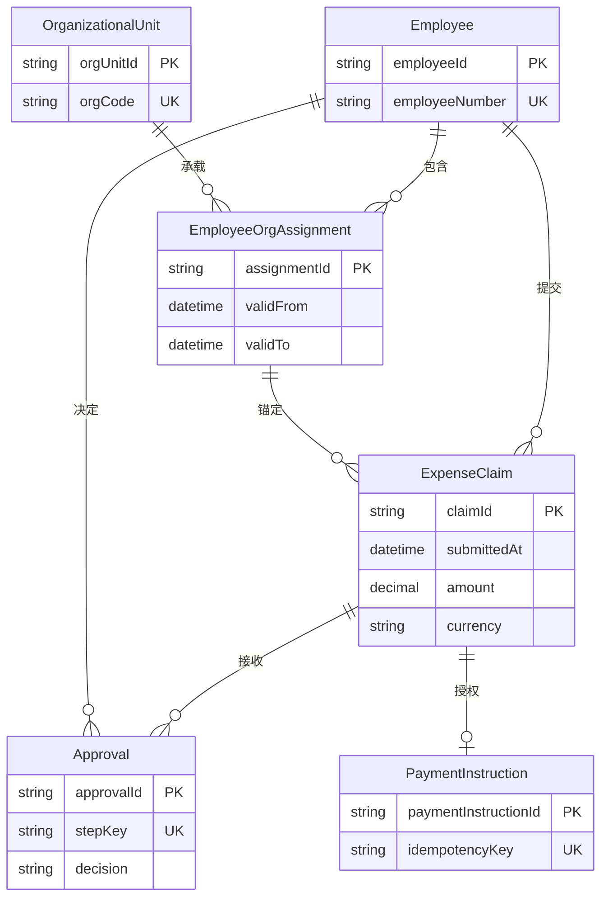

import {handleHorizontalArrowKey} from '@site/src/components/KeyboardScrollableRegion/handleHorizontalArrowKey.mjs';

# 实体关系模型与关系边界

## 学习问题

- 稳定技术身份与员工号、组织代码等业务唯一键有什么不同？
- 什么应当作为实体、属性、值对象或关联实体？
- 关系两端的下界和上界如何用生命周期反例验证？
- 实体关系图能表达哪些结构约束，哪些不变量必须留在图外？
- 当前状态、有效期历史、审计记录和事件日志分别回答什么问题？

## 建模目标与输入

[MOD-02 C4 架构模型（C4 Model） 系统上下文图与容器](/modeling/mod-02)只提供费用申报系统的权威边界与 `银行支付服务` 名称；它不证明本页的数据设计。[MOD-05 概念、逻辑与物理数据模型](/modeling/mod-05)提供 `Employee`、`ExpenseClaim`、`Approval` 和 `PaymentInstruction` 四个起始逻辑实体。本页的六实体模型、字段、基数、半开区间和不变量都是本站原创的教学决定，不是已被证明的生产事实。

其他输入包括业务词汇、身份与唯一性规则、实体生命周期、关系两端的最小与最大数量、时间语义、历史查询与修正要求，以及数据保留、审计、迁移和完整性要求。未知的生产基数、并发冲突、查询分布、保留期、迁移方案与性能结果仍是验证缺口。

## 参与者与步骤

业务负责人确认词义、生命周期和不变量；领域或数据建模者维护实体、身份与关系；应用开发者核对写入与查询场景；数据库工程师评估后续约束机制；独立评审者使用反例检查图内与图外边界。

1. 固定业务词义与费用申报问题边界。
2. 以属性改变后仍能指向同一业务对象的稳定身份识别实体，而不是从现有表名开始。
3. 用独立生命周期、身份和自身属性判断实体边界。
4. 为每条关系确认两端的最小与最大数量，再用尚未创建、已关闭和重复发生等生命周期反例验证。
5. 把多对多或拥有属性、历史与独立约束的关系提升为关联实体。
6. 把图无法表达或证明的唯一性、时间、跨实体与状态约束移入约束表。
7. 用有效期关联实体保留主要组织归属历史。
8. 把数据库执行、并发、迁移、容量与性能留给后续验证。

## 模型产物

图中连线只表达结构关联与基数，不表达审批、付款或调用的运行顺序。`PK` 与 `UK` 是帮助识别身份和业务唯一性的教学标签，不是可部署约束；该图也不能证明图外不变量已成立。

六个实体分别用 `employeeId`、`orgUnitId`、`assignmentId`、`claimId`、`approvalId` 和 `paymentInstructionId` 保持稳定指向。稳定技术身份与员工号、组织代码、审批步骤唯一性和付款幂等键明确不同：后者可能改变、复用或只在特定作用域中唯一，技术身份也不能自动证明这些业务唯一性。

| 类别 | 判断问题 | 费用申报示例 | 边界 |
| --- | --- | --- | --- |
| 实体 | 是否需要稳定身份并跨属性变化持续追踪 | `Employee`、`ExpenseClaim`、`Approval`、`PaymentInstruction`、`OrganizationalUnit` | 技术身份不替代业务唯一性 |
| 属性 | 是否只描述所属实体且无需独立生命周期 | `ExpenseClaim` 的金额、币种、`submittedAt` | 金额必须与币种共同解释 |
| 值对象 | 是否由一组值定义并可整体替换 | 金额与币种组成的 `Money` 语义 | 本文不规定代码实现或数据库类型 |
| 关联实体 | 关系是否拥有属性、历史或独立约束 | `EmployeeOrgAssignment` | 普通连线无法保存 `validFrom`、`validTo` 和不重叠规则 |

这些分类由当前费用申报语境决定，不是对所有系统都固定的答案。基数同时包含关系两端的下界和上界，不能只写“一对多”；每项教学基数都必须通过业务规则与生命周期反例验证。

| 规则 | 实体关系图 | 主要表达位置 | 仍需验证 |
| --- | --- | --- | --- |
| 结构关系与普通基数 | 可表达 | 关系端点与可选性 | 生命周期反例和真实业务规则 |
| 业务唯一性 | 只能标注候选 | 约束规则与后续模式 | 作用域、复用和并发冲突 |
| 时间区间有效性与不重叠 | 不可完整表达 | 有效期规则与数据库候选机制 | 修正、回填和并发写入 |
| 跨实体一致性 | 不可证明 | 申报员工与历史归属一致性规则 | 事务边界和失败恢复 |
| 状态前置条件 | 不可证明 | 付款只针对满足批准条件的申报 | 状态机、竞争和补偿 |
| 并发、迁移与性能 | 不可证明 | 实现与运行验证 | 数据分布、锁、回滚和测量结果 |

`EmployeeOrgAssignment` 使用半开区间 `[validFrom, validTo)` 表示业务有效时间：`validTo` 为空表示该归属仍有效；非空 `validTo` 必须晚于 `validFrom`；同一员工的主要组织归属有效期不得重叠；申报提交时间必须落在引用归属的有效期内；申报员工必须与引用归属中的员工一致；转组织时通过关闭旧区间并增加新记录保留历史，不静默覆盖。

当前状态回答“现在是什么”；有效期关系回答“某个业务时间段内是什么”；审计记录回答“谁在何时修改了记录”；事件日志记录发生过的事件。四者是不同的证据类型，不能互相替代。本页不是双时态数据库设计，也不采用事件溯源。

## 完成判断

完成意味六个实体均有可解释的稳定身份，七条关系的两端下界与上界均已写明，而且 `EmployeeOrgAssignment` 的独立存在由关系属性、有效期历史和不重叠约束共同支持。评审者还应能复述半开区间语义，区分当前状态、有效期历史、审计记录和事件日志，并指出哪些是本站教学假设、哪些仍是未知项。

本页不是完整数据定义语言，不是可部署模式，不包含完整双时态数据库设计，也不是事件溯源实现。缺少生产基数、并发冲突、查询分布、保留、迁移与性能证据时，应停在“待验证”而不是宣称生产就绪。

## 常见失败

常见身份失败是把显示名称、员工号或组织代码当作永不变的实体身份，或者以为有了技术标识符就已证明业务唯一性。常见关系失败是只写“一对多”却忽略零、一等下界，或把带属性和历史的关系藏在普通连线中。

常见时间失败是根据员工的当前组织归属重算旧申报，或把审计字段、事件日志与 Temporal 工作流平台事件历史记录当作业务关系历史。常见证据失败是认为实体关系图已经证明时间不重叠、状态前置条件或并发安全，甚至把逻辑实体关系图直接称为生产模式。

## 与其他模型的衔接

[建模目录](/modeling)提供各类模型入口；[MOD-01 建模总览](/modeling/mod-01)负责按评审问题选择模型；[MOD-05 概念、逻辑与物理数据模型](/modeling/mod-05)为本页提供四个核心逻辑实体；[MOD-07 统一建模语言（Unified Modeling Language，UML）选图指南](/modeling/mod-07)进一步区分 UML 类的静态职责视角与本页的数据关系边界；[PR-13 持久化无知（Persistence Ignorance）](/principles/pr-13)帮助区分领域含义与持久化机制。[Temporal 补偿事务与持久执行案例](/cases/temporal-saga-durable-execution)中的事件历史记录是控制面恢复记录，不是费用申报的业务关系历史。MOD-08 尚未发布，将来可用状态机补充批准与付款前置条件；本页不创建尚未有效的链接。

## 完整演练

员工 `E` 先在组织 `A` 拥有一条主要归属 `A1`，其业务有效期是 `[2026-01-01, 2026-07-01)`。`E` 在 `2026-06-20` 提交费用申报 `C1`；`C1` 同时引用 `E` 和提交当时有效的 `A1`，因此它的历史组织语义不需依赖 `E` 的当前归属。

审批人对 `C1` 作出决定时，`Approval` 使用自己的稳定身份，并把“同一申报的审批步骤不得重复”保留为图外业务唯一性。满足批准条件后，`PaymentInstruction` 使用独立身份表示付款意图，并用业务幂等键防止重复发起；这些状态和唯一性规则不由连线自动保证。

`E` 在 `2026-07-01` 转入组织 `B`。模型关闭 `A1` 的旧区间，并为组织 `B` 增加从 `2026-07-01` 开始的新归属 `B1`。旧申报 `C1` 仍引用组织 `A` 的历史归属 `A1`，不能因 `E` 当前属于组织 `B` 而被改写。如果历史归属需要纠正，必须明确纠正和回填策略，本页不假定静默覆盖。

这个演练中，`A1`/`B1` 的区间是业务有效时间，记录实际写入或修改的时间是另一个问题，操作人与修改原因属于审计信息，已发生事件属于事件记录。保存其中一类证据不等于已保存其余证据。

## 来源

数据库管理系统无关的逻辑实体、标识、关系和约束参考国际商业机器公司的数据架构师软件官方文档 [Logical Data Models — IBM InfoSphere Data Architect 9.1.1](https://www.ibm.com/docs/en/ida/9.1.1?topic=modeling-logical-data-models)。[Entity Relationship Diagrams — Mermaid 11.16.0](https://github.com/mermaid-js/mermaid/blob/mermaid%4011.16.0/packages/mermaid/src/docs/syntax/entityRelationshipDiagram.md)锁定本页使用的 `erDiagram` 实体、属性、关系标记、标签、基数与可选性语法；Mermaid 图表工具 11.16.0 语法是渲染工具能力，不作为实体关系理论标准。[PostgreSQL 18 — Constraints](https://www.postgresql.org/docs/18/ddl-constraints.html)只支持约束机制行为，[PostgreSQL 18 — Range Types](https://www.postgresql.org/docs/18/rangetypes.html)只支持区间边界与排斥约束机制行为。

这些官方文档只支持工具、方法或机制的能力边界，不支持本页的费用申报领域规则、半开区间选择、不重叠规则、迁移安全或性能结论。

六实体费用申报模型、七条关系及基数、半开有效期选择、跨实体约束、Mermaid 图、两张表和完整演练都是本站原创的教学表达，未复制来源图表、截图、章节结构或长段文字。

国际商业机器公司及其数据架构师软件名称是该公司在美国及其他国家和地区的商标或注册商标。
