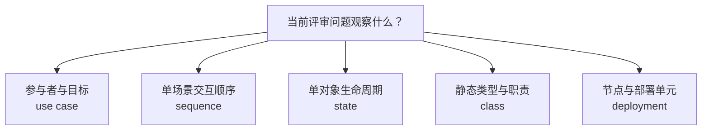

import {handleHorizontalArrowKey} from '@site/src/components/KeyboardScrollableRegion/handleHorizontalArrowKey.mjs';

# UML 选图指南

## 学习问题

- 如何从当前评审问题出发，在 use case、sequence、state、class 与 deployment 中选择最小而充分的 UML 视图？
- 五类图各自观察什么对象和时间尺度？
- 图中元素能够支持哪些判断，又明确不能证明哪些事实？
- 哪些结论必须由代码、运行、部署或业务证据补足？
- 什么时候才需要第二个互补模型？

这里的目标不是背诵 UML 图形清单，而是把每张图当成一次有边界的证据陈述。

## 建模目标与输入

[MOD-02 C4 Context 与 Container](/modeling/mod-02)中的名称和系统边界是本文的权威输入；本文的选图矩阵、问题、场景细节和预期判断都是本站原创的教学假设，不代表现有系统已经如此实现或验证。

开始前收集评审问题、受众、事实截止时间、系统边界、单个场景、业务概念、目标部署环境和已有证据。授权规则、并发行为、实际部署库存、容量、容灾、运行时延和状态覆盖如果没有可核对的材料，就继续标为验证缺口。

## 参与者与步骤

问题提出者负责给出需要决定的事项；业务或领域负责人核对目标和词义；应用开发者核对交互与类型职责；平台或运维负责人核对环境和运行节点；模型维护者记录假设；未参与绘图的评审者复述结论和缺口。

1. 把“画一张 UML 图”改写成一句可判断的评审问题。
2. 确定观察对象是参与者目标、单场景交互、对象生命周期、静态类型还是运行节点。
3. 选择最小而充分的图，不因工具熟悉度默认选择 class。
4. 为图中每个关键元素写出事实来源、截止时间或显式假设。
5. 写出该图明确不能证明的内容，并列出补充证据。
6. 请未参与绘图的评审者复述预期判断和证据缺口。
7. 只有剩余问题需要不同观察对象时，才增加第二个模型。

## 模型产物

问题不清楚时返回澄清，而不是先画图。只有存在另一个仍未回答、且观察单元不同的评审问题时，才增加第二张图。

| 图 | 观察对象 | 主要证明 | 明确不证明 | 补充证据 |
| --- | --- | --- | --- | --- |
| use case | 参与者与目标 | 参与者、目标、系统边界和外部交互范围 | 操作顺序、内部组件、授权已经正确 | 业务规则与授权测试 |
| sequence | 单场景交互顺序 | 消息顺序、参与者、同步点、分支与异常路径 | 性能时限、并发安全、所有状态都被覆盖 | 追踪、负载与并发测试 |
| state | 单对象生命周期 | 状态、事件、守卫、转换和终态 | 跨对象原子性、组件所有权、分布式一致性 | 事务、故障与恢复测试 |
| class | 静态类型与职责 | 类型、职责、关联、多重性和泛化 | 运行时顺序、数据库 schema、对象数量和生命周期事实 | 代码、数据模型与运行检查 |
| deployment | 节点与部署单元 | 节点、执行环境、部署单元和通信路径 | 实际库存、容量、故障切换和安全控制已经验证 | 资产、容量、演练与安全证据 |

表中的“主要证明”只表示该种视图适合支持的结构化判断，并不把图本身提升为生产事实。每个关键元素仍须能追溯到输入事实或显式假设。

## 完成判断

当读者能从一句评审问题选择一类图、说明选择理由、指出它不能证明的内容，并为关键元素给出事实来源或显式假设时，本轮建模才算完成。评审记录还必须包含事实截止时间和仍需补充的证据。

没有明确问题的图只是插图；没有证据边界的图容易制造过度结论；没有截止时间的部署或运行事实无法判断是否仍然有效。这三种情况都不能进入完成状态。

## 常见失败

- 默认画 class diagram，把熟悉的工具误当成问题分类。
- 用 sequence 表示静态所有权，或把消息顺序误读为性能时限、全局并发顺序和事务保证。
- 用 state 图暗示跨对象原子性或分布式一致性。
- 把 UML class 当成 ER 实体、逻辑数据模型或物理数据库表；UML class 不是这些数据产物的替代物。
- 用 deployment 图声称实际库存、容量、故障切换或安全控制已经验证。
- 把五类视图混进一张万能图，使观察对象、证据边界和评审结论都无法复述。

## 与其他模型的衔接

[MOD-01 模型选择总览](/modeling/mod-01)提供从问题到模型的总入口；[MOD-03 C4 Dynamic 与 Deployment](/modeling/mod-03)用于比较单场景协作和部署实例边界；[MOD-06 ER 模型与关系边界](/modeling/mod-06)帮助区分 UML class 与数据模型；[MOD-08 状态机建模](/modeling/mod-08)继续展开单对象生命周期、转换证据与禁止推断边界。

[Temporal Saga 与持久执行案例](/cases/temporal-saga-durable-execution)进一步说明：行为顺序、对象状态与运行证据应分层评审，不能由一张图互相代证。返回[建模目录](/modeling)可以继续选择其他观察尺度。

## 完整演练

以下五条记录共享费用申报背景，但各自回答一个独立问题。实际评审只选择当前问题需要的最小子集；五条记录共同出现是为了比较，不是规定必须维护五张图。

### use case：参与者与目标

**评审问题：** 员工、审批人和财务人员分别为了什么目标使用费用申报系统？

**输入事实：** 采用 MOD-02 的费用申报系统边界与员工名称；审批人和财务人员是本站原创的教学假设。把提交申报、作出审批决定和处理付款作为待核对目标。

**预期判断：** 选择 use case，评审参与者、业务目标、系统边界与外部交互范围是否完整且用词一致。

**证据缺口：** 角色是否有权执行操作、授权冲突如何处理以及业务规则是否落实，仍需权限策略、业务规则和授权测试证明。

### sequence：审批到付款意图

**评审问题：** 已提交申报如何经过审批并形成付款意图？

**输入事实：** 单个教学场景从已提交申报开始，审批人作出决定，系统在批准分支形成付款意图；一个必要的拒绝分支也应显式出现。

**预期判断：** 选择 sequence，评审场景参与者、消息相对顺序、同步点、批准分支和拒绝分支是否支持这一次交互说明。

**证据缺口：** 延迟目标、并发提交、消息重试和事务边界仍需运行追踪、负载、并发与故障测试证明。

### state：申报生命周期

**评审问题：** 一份申报允许经历哪些状态变化？

**输入事实：** 以单份申报为观察单位，记录当前已知状态、触发事件、守卫、转换和终态；不把其他对象的变化合并进同一生命周期。

**预期判断：** 选择 state，评审申报能否从允许的事件和守卫到达合法状态，并识别不允许的转换。

**证据缺口：** 跨对象原子性、故障恢复和分布式一致性仍需事务与运行证据；完整终态、超时、取消、补偿和人工终态不在本页展开。

### class：静态职责

**评审问题：** 申报、审批和付款意图的静态职责如何关联？

**输入事实：** 复用 MOD-06 的 `ExpenseClaim`、`Approval` 和 `PaymentInstruction` 概念名称，但只把它们当作候选类型及静态职责输入。

**预期判断：** 选择 class，评审类型职责、关联、多重性和必要泛化是否足以表达静态协作结构；UML class 不是 ER 实体，也不是数据库表。

**证据缺口：** 运行时创建数量、生命周期事实、持久化 schema 和具体代码归属仍需代码、数据模型与运行检查证明。

### deployment：指定环境中的运行位置

**评审问题：** 费用申报 Web 应用、申报 API、支付任务执行器、申报数据库和银行支付服务在指定环境中如何部署？

**输入事实：** 采用 MOD-02 的系统边界和银行支付服务权威名称，把指定环境、节点、执行环境、部署单元与通信路径作为待核对输入。

**预期判断：** 选择 deployment，评审各软件实例运行位置、节点边界和必要通信路径是否清晰，并与 MOD-03 的部署观察尺度保持一致。

**证据缺口：** 实际资产库存、容量余量、故障切换结果、网络策略和安全控制仍需资产系统、容量数据、演练记录与安全证据证明。

## 来源

- [OMG Unified Modeling Language 2.5.1](https://www.omg.org/spec/UML/2.5.1)只支持 UML 2.5.1 的图名与标准语义范围；它不支持本文的费用领域示例、选图流程、生产事实，也不证明实现行为。
- [C4 Dynamic diagram](https://c4model.com/diagrams/dynamic)只支持场景级运行协作及其克制使用；它不提供生产追踪或性能证据。
- [C4 Deployment diagram](https://c4model.com/diagrams/deployment)只支持指定环境中的部署节点、基础设施节点、软件系统实例与 Container 实例范围；它不证明生产库存、容量、故障切换或运行健康。
- [Applying UML and Patterns, 3rd edition](https://www.pearson.com/en-us/subject-catalog/p/Larman-Applying-UML-and-Patterns-An-Introduction-to-Object-Oriented-Analysis-and-Design-and-Iterative-Development-3rd-Edition/P200000000422/9780131489066)只支持该书的书目出处及其与 UML、对象设计的历史语境；本文不复制书中的 POS 案例、图、表、示例或扩展措辞。

本文的费用申报选择流、证据表和演练记录均为原创教学内容，不引用、改编或复制任何来源图表。
