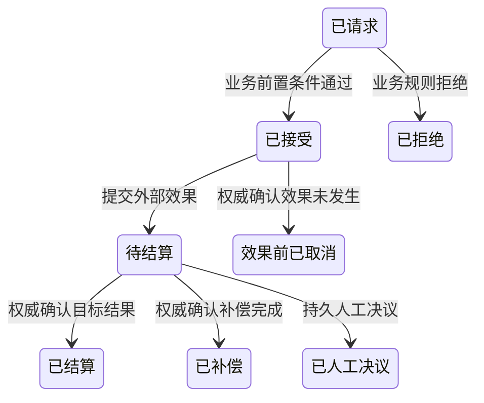
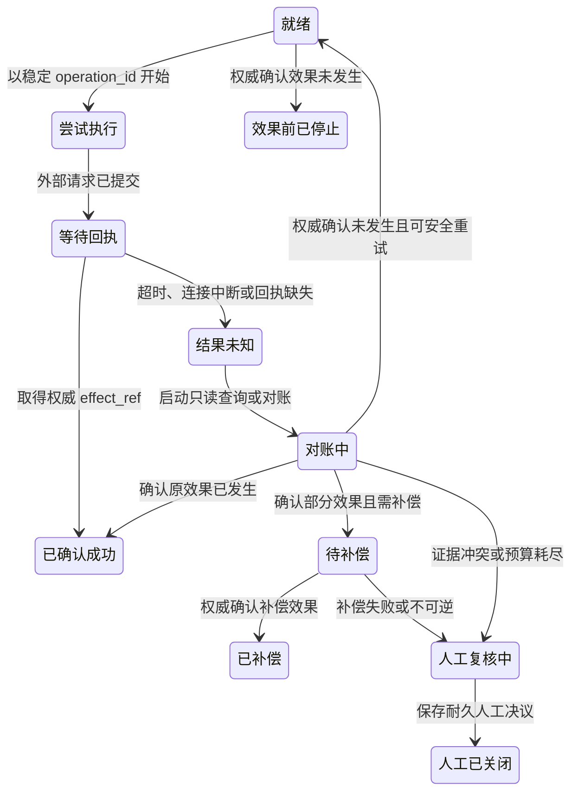

import {handleHorizontalArrowKey} from '@site/src/components/KeyboardScrollableRegion/handleHorizontalArrowKey.mjs';

# 状态机建模

## 学习问题

- 为什么长时运行业务要分开业务意图状态和执行恢复状态？
- 超时、取消请求、补偿请求和人工关闭各能证明什么？
- 哪些转换必须由外部回执、对账结果或持久人工决议支撑？
- 什么时候可以重试（Retry），什么时候必须补偿或转人工？

## 建模目标与输入

{/* terminology-exempt: unknown-english-term | reason: 引用原题、产品专名、主题标识或固定内容合同按原样保留 */}
本文承接 [MOD-07 统一建模语言（Unified Modeling Language，UML）选图指南](/modeling/mod-07)的证据边界：状态图用于评审单个观察对象的状态、事件、守卫和转换，不单独证明跨系统外部效果。教学场景是一笔跨边界长时转账：系统接受转账意图，提交外部扣款与入账动作，可能在取得结果前超时，然后通过只读查询、受控重试、补偿或人工决议收敛。

{/* terminology-exempt: unknown-english-term | reason: 引用原题、产品专名、主题标识或固定内容合同按原样保留 */}
参与者、状态名、转换、时间预算、补偿条件和人工决议字段都是本站原创教学设定，不代表现有生产系统或 Temporal 默认实现。输入至少包括稳定 `transfer_id`、每个外部效果的 `operation_id`、目标系统 `effect_ref`、证据截止时间、负责人与可核对的权威记录。

## 两类状态与权威记录

业务意图状态机记录转账请求在业务上已接受、已拒绝、待结算、已结算、效果前取消、已补偿或已人工决议的稳定事实。执行与恢复状态机只记录一次外部操作的控制过程，例如尝试、等待回执、未知、对账、补偿和人工处理。

两台状态机通过持久的 `transfer_id`、`operation_id`、`effect_ref`、截止时间和决议记录关联。外部业务系统与对账记录才能裁定扣款或入账是否发生；图、工作流（Workflow）历史、客户端超时和本地日志都不能单独代替该事实。

## 模型产物

第一张图的观察对象是单个转账业务意图，事实截止时间为本次评审记录所标注的时刻。

该图不证明外部调用顺序、重试次数、对账方法或实时生产状态。

第二张图的观察对象是一个稳定 `operation_id` 对应的执行与恢复过程，事实截止时间与同一评审记录一致。

该图只表达控制过程，不能从 `confirmed_success`、`compensated` 或 `manual_closed` 的内存值单独推导业务终态。

## 转换合同

每条转换至少记录当前状态、事件、守卫、动作、下一状态、权威证据、幂等身份、截止时间和负责人。下表是两台状态机的映射合同，不把控制状态当作业务事实。

| 触发 | 业务状态变化 | 执行状态变化 | 所需权威证据 | 禁止推断 |
| --- | --- | --- | --- | --- |
| 接受请求 | `requested` → `accepted` | 创建 `ready` | 已通过业务前置条件的持久接受记录 | 接受记录不证明外部效果已发生 |
| 提交外部效果 | `accepted` → `settlement_pending` | `ready` → `attempting` → `awaiting_receipt` | 稳定 `operation_id`、提交记录与外部回执查询键 | 本地提交成功不证明转账已结算 |
| 执行超时 | 保持 `settlement_pending` | `awaiting_receipt` → `unknown` | 超时记录、原 `operation_id` 与证据截止时间 | 超时不证明业务失败或外部效果未发生 |
| 效果前取消 | `accepted` → `cancelled_before_effect` | `ready` → `stopped_before_effect` | 权威未找到证据与流程停止记录 | 只有取消意图不证明效果从未发生 |
| 未知结果后取消 | 保持 `settlement_pending` | `unknown` → `reconciling` | 取消请求、外部只读查询与 `effect_ref` 核对结果 | 取消请求不等于已经取消 |
| 确认部分效果后补偿 | `settlement_pending` → `compensated` | `reconciling` → `compensation_pending` → `compensated` | 正向 `effect_ref`、补偿 `operation_id` 与补偿回执 | 补偿是新效果，不是把历史回滚成从未发生 |
| 证据无法收敛后人工决议 | `settlement_pending` → `manually_resolved` | `manual_review` → `manual_closed` | `disposition`：`confirmed-settled` 表示权威证据确认预期结算结果；`confirmed-compensated` 表示权威证据同时确认正向效果与对应补偿；`accepted-residual-risk` 表示有权限的负责人明确接受尚未解决的残余风险；并持久保存 `decision_ref`、决策人、时间与残余风险 | `manual_closed` 不能在缺少业务决议时被当作业务终态 |

## 超时、取消与补偿

调用超时只说明观察者没有按时得到结果，不能单独证明业务失败或外部效果未发生。

取消是事件和意图，不等于已经取消；执行已提交或结果未知时必须先对账。

只有权威未找到且原稳定 operation_id 仍然有效时，才允许重试外部写入。

补偿创建新的业务事实，不是把历史回滚成从未发生。

补偿必须拥有自己的 operation_id、预算和对账路径，并且也可能超时、重复或失败。

人工终态必须保存可审计的处置、decision_ref、决策人、时间和残余风险，不能用通用闭合隐藏未知结果。其中，`confirmed-settled` 表示权威证据确认预期结算结果；`confirmed-compensated` 表示权威证据同时确认正向效果与对应补偿；`accepted-residual-risk` 表示有权限的负责人明确接受尚未解决的残余风险。

两台状态机只通过持久记录关联，任何一台都不能从另一台的内存状态推导外部事实。

## 完成判断

当两类状态的观察对象、全部合法状态和转换、权威证据、幂等身份、截止时间、负责人与非证明边界均可复述时，模型才完成。每个业务终态必须能追溯到外部权威证据或有权限的持久人工决议。

一次超时、一条本地日志、一个内存枚举或一个取消请求都不能让 `settlement_pending` 直接进入 `rejected`、`cancelled_before_effect` 或其他业务终态。

## 常见失败

- 用一组“成功、失败、处理中”同时表示业务事实和执行尝试，造成状态笛卡尔积和责任混淆。
- 将超时写成失败，随后在原效果可能已发生时盲目重试。
- 把取消请求直接存为已取消，不核对已提交或未知效果。
- 把补偿当作数据删除或历史回卷，不为补偿本身建立身份、预算和对账。
- 只写通用 `closed`，没有 `disposition`、`decision_ref`、决策人、时间和残余风险。
{/* terminology-exempt: unknown-english-term | reason: 引用原题、产品专名、主题标识或固定内容合同按原样保留 */}
- 将 Temporal 工作流历史或图中状态当作外部扣款与入账的权威证据。

## 与其他模型的衔接

{/* terminology-exempt: unknown-english-term | reason: 引用原题、产品专名、主题标识或固定内容合同按原样保留 */}
{/* terminology-exempt: unknown-english-term | reason: 引用原题、产品专名、主题标识或固定内容合同按原样保留 */}
{/* terminology-exempt: unknown-english-term | reason: 引用原题、产品专名、主题标识或固定内容合同按原样保留 */}
[MOD-07 UML 选图指南](/modeling/mod-07)定义单对象生命周期的建模边界；[PR-10 幂等性与最小协调](/principles/pr-10)约束稳定操作身份、未知结果和安全重试；[QA-02 可靠性、可用性与可恢复性](/quality-attributes/qa-02)用可执行证据检验超时、重试、补偿和人工收敛。

{/* terminology-exempt: unknown-english-term | reason: 引用原题、产品专名、主题标识或固定内容合同按原样保留 */}
{/* terminology-exempt: unknown-english-term | reason: 引用原题、产品专名、主题标识或固定内容合同按原样保留 */}
{/* terminology-exempt: unknown-english-term | reason: 引用原题、产品专名、主题标识或固定内容合同按原样保留 */}
[Temporal Saga 与持久执行案例](/cases/temporal-saga-durable-execution)提供工作流、活动、重试、超时与补偿的实例边界。Temporal 机制不定义本文的业务状态或补偿政策。返回[建模目录](/modeling)可继续选择其他观察尺度；[MOD-09 事件风暴工作坊建模](/modeling/mod-09)把未知支付结果、对账与人工决议的证据语义带入协作工作坊，但不会据此宣布正式边界。

{/* terminology-exempt: unknown-english-term | reason: 引用原题、产品专名、主题标识或固定内容合同按原样保留 */}
[MOD-10 领域叙事（Domain Storytelling）](/modeling/mod-10)中发现的一个重要的领域故事变体，可以用本文细化状态、终态与恢复语义；故事本身不证明这些语义已经完整或可执行。

{/* terminology-exempt: unknown-english-term | reason: 引用原题、产品专名、主题标识或固定内容合同按原样保留 */}
[MOD-11 领域驱动设计上下文映射（DDD Context Map）](/modeling/mod-11)：状态、不变量和恢复规则的独立变化可以验证候选边界，但状态机不等于上下文映射。

## 完整演练

1. 转账请求以稳定 `transfer_id` 登记为 `requested`；业务前置条件通过后写入持久接受记录，进入 `accepted`，并为外部执行创建 `ready`。
2. 执行器使用稳定 `operation_id` 从 `ready` 进入 `attempting`，提交外部效果后进入 `awaiting_receipt`；业务意图同时从 `accepted` 进入 `settlement_pending`。
3. 外部调用超时，执行状态进入 `unknown`，业务状态保持 `settlement_pending`；处理器不创建新操作身份，而是用原 `operation_id` 进入 `reconciling`。
4. 对账取得外部 `effect_ref`，确认部分正向效果已发生，因政策要求进入 `compensation_pending`，并为补偿创建独立 `operation_id`。
5. 若权威回执确认补偿成功，执行状态进入 `compensated`，业务状态也依据正向与补偿两组证据进入 `compensated`，同时保留完整历史。
6. 若补偿超时、证据冲突或不可逆动作使证据无法收敛，执行状态进入 `manual_review`。有权限的决策人保存 `disposition`、`decision_ref`、时间和残余风险：`confirmed-settled` 表示权威证据确认预期结算结果；`confirmed-compensated` 表示权威证据同时确认正向效果与对应补偿；`accepted-residual-risk` 表示有权限的负责人明确接受尚未解决的残余风险。执行状态随后进入 `manual_closed`，业务状态与同一决议记录配对后进入 `manually_resolved`。

演练不设定虚构的生产时延、金额、容量或成功率，它只检查状态、转换、证据与禁止推断是否完整。

## 来源

{/* terminology-exempt: bare-english-term | reason: 引用原题、产品专名、主题标识或固定内容合同按原样保留 */}
{/* terminology-exempt: unknown-english-term | reason: 引用原题、产品专名、主题标识或固定内容合同按原样保留 */}
- [Unified Modeling Language 2.5.1, Object Management Group](https://www.omg.org/spec/UML/2.5.1)：仅支持 UML 2.5.1 的图名称与标准语义范围；不支持领域示例、本地建模工作流、生产事实，也不能据此声称图证明了实现行为。本文还不以该标准定义转账状态政策或补偿政策。
{/* terminology-exempt: bare-english-term | reason: 引用原题、产品专名、主题标识或固定内容合同按原样保留 */}
{/* terminology-exempt: unknown-english-term | reason: 引用原题、产品专名、主题标识或固定内容合同按原样保留 */}
- [Temporal Workflow](https://docs.temporal.io/workflows)：仅支持已记录页面与版本中的 Temporal Workflow 文档语义；不证明未记录行为或其他版本的行为。
{/* terminology-exempt: unknown-english-term | reason: 引用原题、产品专名、主题标识或固定内容合同按原样保留 */}
- [Temporal Activity](https://docs.temporal.io/activities)：仅支持已记录页面与版本中的 Temporal 活动文档语义；不证明未记录行为或其他版本的行为。
{/* terminology-exempt: unknown-english-term | reason: 引用原题、产品专名、主题标识或固定内容合同按原样保留 */}
- [Temporal Retry Policies](https://docs.temporal.io/encyclopedia/retry-policies)：仅支持已记录页面与版本中的 Temporal 重试策略文档语义；不证明未记录行为或其他版本的行为。
{/* terminology-exempt: unknown-english-term | reason: 引用原题、产品专名、主题标识或固定内容合同按原样保留 */}
{/* terminology-exempt: unknown-english-term | reason: 引用原题、产品专名、主题标识或固定内容合同按原样保留 */}
{/* terminology-exempt: unknown-english-term | reason: 引用原题、产品专名、主题标识或固定内容合同按原样保留 */}
- [Sagas, Garcia-Molina and Salem](https://dl.acm.org/doi/10.1145/38713.38742)：提供 Sagas 的原始方法与历史模型；没有独立证据时，不确立其对现代实现的适用性。

两张状态图、映射表、状态名与转账演练均为本站原创教学内容，不复制来源图表或示例流程。
