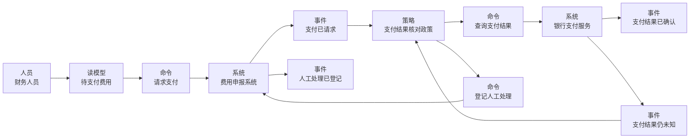

import {handleHorizontalArrowKey} from '@site/src/components/KeyboardScrollableRegion/handleHorizontalArrowKey.mjs';

# 事件风暴工作坊建模

## 学习问题

- 怎样从参与者讲述中提取已经发生的领域事件，而不是先画系统或服务？
- 全景如何保留热点与未知项，过程建模如何连接人员、读模型、命令、系统、事件与策略？
- 哪些观察只能形成候选边界假设，不能直接宣布限界上下文、团队或服务？
- 支付超时、人工登记与外部权威结果之间应保持什么证据边界？

## 建模目标与输入

本文承接 [MOD-02 C4 架构模型（C4 Model）](/modeling/mod-02)中的名称与系统权威：教学范围内的本地系统称为“费用申报系统”，外部支付能力称为“银行支付服务”，不能为了贴纸排列临时改名。场景沿用 [MOD-05 概念、逻辑与物理数据模型](/modeling/mod-05)的费用申报过程，并采用 [MOD-08 状态机建模](/modeling/mod-08)的支付结果证据边界：本地请求、超时或人工处理记录都不能代替银行支付服务回执或查询结果。

开始前按以下完整输入合同留下可见记录：

- 记录要探索的业务问题与时间范围。
- 列出已知参与者、外部系统和权威记录。
- 确认 MOD-02 权威边界，并保留“银行支付服务”的权威名称。
- 汇集可用的访谈、流程、事故、政策和术语证据。
- 标明未知项、争议项和不能在本次工作坊决定的事项。
- 约定预期获得的模型、热点清单，以及每项后续验证的具名责任人。

输入不要求完整需求或既定服务划分。已有组织图、系统图和流程只能作为讨论证据，不能预先决定泳道或候选边界。本文的费用流程、贴纸内容和候选关系均为原创教学设定，不代表现有生产系统。

## 参与者与步骤

邀请提交人、审批人、财务人员、支付集成维护者和异常处理人员共同还原事实。其中既要有熟悉业务日常的领域人员，也要有能追问规则与异常的软件人员；主持人负责维持节奏并记录争议，但不替参与者消除分歧。工作坊固定执行八步：

1. 说明业务问题、时间范围、权威边界和非目标。
2. 参与者先独立写出过去时领域事件，再按业务时间线排列。
3. 补充事件来源、参与者、外部系统、关键事件候选、热点和未知项。
4. 共同走查，合并同义词，同时保留真实分歧。
5. 选择“费用已审批到支付结果已确认”的高风险片段。
6. 用人员、读模型、命令、系统、策略和事件建立过程模型。
7. 回到热点，将事项记录为已回答、待验证或超出本轮范围。
8. 把边界信号写入候选边界台账，给出替代解释、所需证据和处置。

全景是发现全局叙事、关键转折、热点和未知项的工作坊格式。过程建模是围绕一个具体流程连接人员、读模型、命令、系统、事件与策略的工作坊格式。软件设计是在更窄范围内探索实现协作与设计选择的工作坊格式。三者服务于不同讨论尺度，不是正式层级，也不会自动把上一轮贴纸变成下一轮架构决定。

## 模型产物

第一项产物是全景事件时间线。表中的“关键转折候选”只用于选择后续讨论焦点；“热点”记录分歧，“未知项”保留尚未取得的证据。

| 领域事件 | 事件来源或权威记录 | 关键转折候选 | 热点 | 未知项 |
| --- | --- | --- | --- | --- |
| 费用已提交 | 费用申报记录 | 否：仍处于申报准备阶段 | 票据或政策信息可能不完整 | 由谁确认补件完成 |
| 费用已审批 | 审批决定记录 | 是：进入财务复核 | 加签、越级与撤回规则存在分歧 | 审批撤回后哪些事实仍然有效 |
| 财务复核已完成 | 财务复核记录 | 是：费用具备支付条件 | 财务政策与审批结论可能冲突 | 冲突时由哪条记录裁定 |
| 支付已请求 | 费用申报系统的支付请求记录 | 是：进入外部效果阶段 | 重复请求、超时与幂等身份 | 银行支付服务是否已经接受请求 |
| 支付结果已确认 | 银行支付服务回执与本地核对记录 | 是：正常路径收束 | 外部回执与费用申报的身份映射 | 该确认是否已经满足业务终态条件 |
| 支付结果仍未知 | 超时记录与缺失回执证据 | 是：进入异常恢复 | 重试（Retry）、取消与对账顺序 | 外部支付效果是否已经发生 |
| 支付对账已完成 | 银行支付服务查询结果与对账记录 | 是：重新获得权威结果 | 回执、查询与本地记录可能冲突 | 冲突记录的更正由谁批准 |
| 人工处理已登记 | 持久人工处理记录 | 是：进入人工收敛路径 | 处理负责人、证据和处置 | 谁有权限确认最终业务结论 |

第二项产物是从“支付已请求”开始的过程模型。每个节点都保留语法类型与业务标签，便于评审者区分人、读取视图、意图、事实、系统和政策。图只能表达工作坊中讨论的关系，不能证明运行时顺序、同步或异步协议、事务边界、服务边界或组织负责人。

图后的解释边界相同：它不能证明运行时顺序、同步或异步协议、事务边界、服务边界或组织负责人。尤其是“支付结果仍未知”表示证据尚未收敛，不是失败事实；“人工处理已登记”只证明持久处理记录存在，不证明支付成功、失败或未发生。

第三项产物把观察信号转成可反驳的候选边界假设。每行同时保存替代解释、仍需证据与当前处置，避免把一次工作坊的直觉升级为正式架构结论。

| 观察到的信号 | 候选边界假设 | 替代解释 | 仍需的证据 | 当前处置 |
| --- | --- | --- | --- | --- |
| 审批与支付使用不同结果语言 | 审批判断与支付执行可能属于不同业务边界 | 它们也可能只是同一费用生命周期的不同阶段 | 术语负责人、规则变更历史与跨阶段不变量 | 交给 MOD-11 |
| 银行支付服务具有独立契约与变更节奏 | 外部支付集成需要明确的翻译与隔离边界 | 它也可能只是技术适配器，而非新的业务边界 | 契约所有权、版本策略、失败语义与变更记录 | 下一轮验证 |
| 费用申报记录与支付结果由不同权威记录裁定 | 申报事实与支付结果可能需要分离的权威边界 | 它们也可能是同一边界内的权威记录与投影视图 | 数据负责人、更正规则、审计责任与一致性需求 | 保留假设 |
| 人工处理跨越财务判断与技术排障 | 异常处理可能形成独立协作能力 | 它也可能只是低频运营升级路径 | 发生频率、稳定规则、持久负责人与独立目标 | 不作为边界证据 |
| 审批政策与支付核对政策的变化节奏不同 | 两类政策可能需要分别演进 | 它们也可能由同一负责人通过配置独立调整 | 变更历史、发布耦合、规则负责人与共同不变量 | 下一轮验证 |

## 完成判断

教学工作坊只有在以下退出条件全部满足时才可结束：

- 时间范围、参与者和权威记录可见。
- 全景事件以过去时表达，并能完成一次端到端共同走查。
- 每个关键事件候选、热点和未知项都有记录，不强行消除分歧。
- 选中的高风险片段已建立可解释的过程模型。
- 候选边界台账包含替代解释、待补证据和责任明确的下一步。
- 与 MOD-02、MOD-05、MOD-08 和后续 MOD-11 的交接边界写清。
- 所有参与者理解共享模型是当前证据的共同视图，而不是生产事实或架构批准。

完成判断还必须保留以下非证明规则：

关键事件不等于限界上下文。

泳道不等于团队、系统或服务。

热点不等于待办项、服务或已批准决策。

人员不等于长期负责人。

工作坊排列顺序不等于运行时调用顺序。

一次事件风暴工作坊不能单独确认正式边界，候选关系仍须在 MOD-11 或等价架构活动中验证。

## 常见失败

- 先画已有系统、团队或服务，再把事件塞进既定边框，使讨论无法发现语言和权威记录的冲突。
- 把“支付超时”直接改写成“支付已失败”，丢失外部效果仍未知这一关键热点。
- 将审批记录、支付请求记录或人工处理记录当作银行支付结果的证据。
- 只记录候选边界，不记录替代解释、反证条件和下一步取证负责人。
- 把关键事件、泳道、热点或人员分别等同于限界上下文、团队、服务、待办或长期负责人。
- 把贴纸的从左到右排列解释成同步调用链、事务范围或部署拓扑。

## 与其他模型的衔接

[MOD-01 架构视图与视点](/modeling/mod-01)提供按关切选择表达方式的基础；[MOD-02 C4 架构模型](/modeling/mod-02)约束系统名称和范围；[MOD-05 概念、逻辑与物理数据模型](/modeling/mod-05)提供费用申报的数据场景；[MOD-08 状态机建模](/modeling/mod-08)约束未知支付结果、对账与人工决议的证据语义。

[MOD-10 领域叙事（Domain Storytelling）](/modeling/mod-10)与事件风暴可以组合，但不是替代关系，两种协作方法之间没有严格的元素映射。

[Temporal 工作流平台补偿事务与持久执行案例](/cases/temporal-saga-durable-execution)可用于检验长时流程中的超时、重试、补偿和人工收敛，但其运行机制不会替本文决定业务边界。候选关系需在 [MOD-11 领域驱动设计（Domain-Driven Design，DDD）上下文映射建模](/modeling/mod-11)或等价架构活动中结合术语负责人、规则变更、权威记录和组织协作证据继续验证。事件风暴的泳道、热点与边界信号不能直接生成上下文。

返回[建模目录](/modeling)可继续选择其他建模观察尺度。

## 完整演练

1. 参与者先从“费用已提交”开始，用过去时补齐审批、财务复核、支付请求、支付确认、结果未知、支付对账与人工登记，不写“支付中”这类含混状态。
2. 团队为每个事件指定来源或权威记录。审批决定只裁定审批，财务复核记录只裁定复核；支付结果必须来自银行支付服务回执或查询结果与本地核对记录。
3. 参与者标出关键事件候选、热点和未知项。超时后的“支付结果仍未知”保留为事实与调查入口，不改写成支付失败。
4. 围绕支付流程建立过程模型：财务人员读取待支付费用，请求费用申报系统支付；支付请求触发核对政策，政策查询银行支付服务，再按权威结果记录确认、未知或人工处理路径。
5. 团队逐条检查图的非证明边界，不从排列推导调用协议、事务、服务或组织责任，也不从人工登记推导支付结果。
6. 最后把语言差异、外部契约、权威记录、人工协作和政策节奏写成五条候选边界记录；为每条补上替代解释、证据缺口和处置，再将需要正式验证的关系交给后续架构活动。

## 来源

- [EventStorming](https://www.avanscoperta.it/en/eventstorming/)：支持三种工作坊格式、协作目的与经审查的产物词汇；不证明本站边界、团队、服务或生产行为。
- [Collaborative Process Modelling with EventStorming](https://medium.com/@ziobrando/collaborative-process-modelling-with-eventstorming-17ed363650c0)：支持过程建模工作坊格式中的人员、系统、命令、策略、读模型与事件语法；不定义本文的费用申报案例或架构。
- [Pivotal Events](https://www.avanscoperta.it/en/eventstorming/pivotal-events/)：支持关键事件、时间线与泳道的讨论信号；不把关键事件或泳道变成上下文、团队、系统或服务。
- [Context Mapping](https://www.avanscoperta.it/en/context-mapping/)：支持边界指标并非绝对可靠、仍需架构判断的提醒；不批准本文的候选边界。
- [Chaotic Exploration](https://www.eventstorming.com/patterns/chaotic-exploration/)：支持先独立探索事件、再协作整理的方法；不许可复制其文字、示例、图、模板或布局。

本文的表格、Mermaid 图表工具生成的图、费用流程、候选边界与演练均为本站原创教学内容；来源只支持方法背景，不证明运行时实现或正式组织边界。
