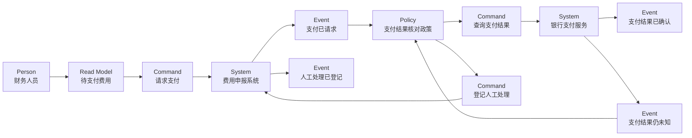

import {handleHorizontalArrowKey} from '@site/src/components/KeyboardScrollableRegion/handleHorizontalArrowKey.mjs';

# EventStorming 工作坊建模

## 学习问题

- 怎样从参与者讲述中提取已经发生的领域事件，而不是先画系统或服务？
- Big Picture 如何保留热点与未知项，Process Modelling 如何连接 Person、Read Model、Command、System、Event 与 Policy？
- 哪些观察只能形成候选边界假设，不能直接宣布 Bounded Context、团队或服务？
- 支付超时、人工登记与外部权威结果之间应保持什么证据边界？

## 建模目标与输入

本文承接 [MOD-02 C4 模型](/modeling/mod-02)中的名称与系统权威：教学范围内的本地系统称为“费用申报系统”，外部支付能力称为“银行支付服务”，不能为了贴纸排列临时改名。场景沿用 [MOD-05 概念、逻辑与物理数据模型](/modeling/mod-05)的费用申报过程，并采用 [MOD-08 状态机建模](/modeling/mod-08)的支付结果证据边界：本地请求、超时或人工处理记录都不能代替银行支付服务回执或查询结果。

工作坊输入至少包括业务参与者、现有术语、关键时间线、费用申报与审批记录、财务复核记录、支付请求、银行回执或查询结果、人工处理记录，以及每项争议的 owner 与事实截止时间。本文的费用流程、贴纸内容和候选关系均为原创教学设定，不代表现有生产系统。

## 参与者与步骤

邀请提交人、审批人、财务人员、支付集成维护者和异常处理人员共同还原事实。主持人先让参与者用过去时写出已经发生的领域事件，再按业务叙事排列；随后标注事件来源、pivotal event 候选、hotspot 和未知项，明确哪些说法缺少权威证据。

Big Picture 是发现全局叙事、关键转折、热点和未知项的工作坊格式。Process Modelling 是围绕一个具体流程连接 Person、Read Model、Command、System、Event 与 Policy 的工作坊格式。Software Design 是在更窄范围内探索实现协作与设计选择的工作坊格式。三者服务于不同讨论尺度，不是正式层级，也不会自动把上一轮贴纸变成下一轮架构决定。

## 模型产物

第一项产物是 Big Picture 事件时间线。表中的“关键转折候选”只用于选择后续讨论焦点；“热点”记录分歧，“未知项”保留尚未取得的证据。

| 领域事件 | 事件来源或权威记录 | 关键转折候选 | 热点 | 未知项 |
| --- | --- | --- | --- | --- |
| 费用已提交 | 费用申报记录 | 否：仍处于申报准备阶段 | 票据或政策信息可能不完整 | 由谁确认补件完成 |
| 费用已审批 | 审批决定记录 | 是：进入财务复核 | 加签、越级与撤回规则存在分歧 | 审批撤回后哪些事实仍然有效 |
| 财务复核已完成 | 财务复核记录 | 是：费用具备支付条件 | 财务政策与审批结论可能冲突 | 冲突时由哪条记录裁定 |
| 支付已请求 | 费用申报系统的支付请求记录 | 是：进入外部效果阶段 | 重复请求、超时与幂等身份 | 银行支付服务是否已经接受请求 |
| 支付结果已确认 | 银行支付服务回执与本地核对记录 | 是：正常路径收束 | 外部回执与费用申报的身份映射 | 该确认是否已经满足业务终态条件 |
| 支付结果仍未知 | 超时记录与缺失回执证据 | 是：进入异常恢复 | 重试、取消与对账顺序 | 外部支付效果是否已经发生 |
| 支付对账已完成 | 银行支付服务查询结果与对账记录 | 是：重新获得权威结果 | 回执、查询与本地记录可能冲突 | 冲突记录的更正由谁批准 |
| 人工处理已登记 | 持久人工处理记录 | 是：进入人工收敛路径 | 处理 owner、证据和 disposition | 谁有权限确认最终业务结论 |

第二项产物是从“支付已请求”开始的 Process Model。每个节点都保留语法类型与业务标签，便于评审者区分人、读取视图、意图、事实、系统和政策。图只能表达工作坊中讨论的关系，不能证明运行时顺序、同步或异步协议、事务边界、服务边界或组织 owner。

图后的解释边界相同：它不能证明运行时顺序、同步或异步协议、事务边界、服务边界或组织 owner。尤其是“支付结果仍未知”表示证据尚未收敛，不是失败事实；“人工处理已登记”只证明持久处理记录存在，不证明支付成功、失败或未发生。

第三项产物把观察信号转成可反驳的候选边界假设。每行同时保存替代解释、仍需证据与当前处置，避免把一次工作坊的直觉升级为正式架构结论。

| 观察到的信号 | 候选边界假设 | 替代解释 | 仍需的证据 | 当前处置 |
| --- | --- | --- | --- | --- |
| 审批与支付使用不同结果语言 | 审批判断与支付执行可能属于不同业务边界 | 它们也可能只是同一费用生命周期的不同阶段 | 术语 owner、规则变更历史与跨阶段不变量 | 交给 MOD-11 |
| 银行支付服务具有独立契约与变更节奏 | 外部支付集成需要明确的翻译与隔离边界 | 它也可能只是技术适配器，而非新的业务边界 | 契约所有权、版本策略、失败语义与变更记录 | 下一轮验证 |
| 费用申报记录与支付结果由不同权威记录裁定 | 申报事实与支付结果可能需要分离的权威边界 | 它们也可能是同一边界内的权威记录与投影视图 | 数据 owner、更正规则、审计责任与一致性需求 | 保留假设 |
| 人工处理跨越财务判断与技术排障 | 异常处理可能形成独立协作能力 | 它也可能只是低频运营升级路径 | 发生频率、稳定规则、持久 owner 与独立目标 | 不作为边界证据 |
| 审批政策与支付核对政策的变化节奏不同 | 两类政策可能需要分别演进 | 它们也可能由同一 owner 通过配置独立调整 | 变更历史、发布耦合、规则 owner 与共同不变量 | 下一轮验证 |

## 完成判断

工作坊产物完成时，参与者能够逐项复述事件的过去时名称、事件来源、热点、未知项和证据 owner；Process Model 的每个节点具有明确类型；每个候选边界都有替代解释、待取证项和闭集处置。还必须明确以下非证明规则：

pivotal event 不等于 Bounded Context。

swimlane 不等于团队、系统或服务。

hotspot 不等于 backlog item、服务或已批准决策。

Person 不等于长期 owner。

工作坊排列顺序不等于运行时调用顺序。

一次 EventStorming 工作坊不能单独确认正式边界，候选关系仍须在 MOD-11 或等价架构活动中验证。

## 常见失败

- 先画已有系统、团队或服务，再把事件塞进既定边框，使讨论无法发现语言和权威记录的冲突。
- 把“支付超时”直接改写成“支付已失败”，丢失外部效果仍未知这一关键热点。
- 将审批记录、支付请求记录或人工处理记录当作银行支付结果的证据。
- 只记录候选边界，不记录替代解释、反证条件和下一步取证 owner。
- 把 pivotal event、swimlane、hotspot 或 Person 分别等同于 Bounded Context、团队、服务、backlog 或长期 owner。
- 把贴纸的从左到右排列解释成同步调用链、事务范围或部署拓扑。

## 与其他模型的衔接

[MOD-01 架构视图与视点](/modeling/mod-01)提供按关切选择表达方式的基础；[MOD-02 C4 模型](/modeling/mod-02)约束系统名称和范围；[MOD-05 概念、逻辑与物理数据模型](/modeling/mod-05)提供费用申报的数据场景；[MOD-08 状态机建模](/modeling/mod-08)约束未知支付结果、对账与人工决议的证据语义。

[Temporal Saga 与持久执行案例](/cases/temporal-saga-durable-execution)可用于检验长时流程中的超时、重试、补偿和人工收敛，但其运行机制不会替本文决定业务边界。候选关系需在 MOD-11 或等价架构活动中结合术语 owner、规则变更、权威记录和组织协作证据继续验证。

## 完整演练

1. 参与者先从“费用已提交”开始，用过去时补齐审批、财务复核、支付请求、支付确认、结果未知、支付对账与人工登记，不写“支付中”这类含混状态。
2. 团队为每个事件指定来源或权威记录。审批决定只裁定审批，财务复核记录只裁定复核；支付结果必须来自银行支付服务回执或查询结果与本地核对记录。
3. 参与者标出 pivotal event 候选、hotspot 和未知项。超时后的“支付结果仍未知”保留为事实与调查入口，不改写成支付失败。
4. 围绕支付流程建立 Process Model：财务人员读取待支付费用，请求费用申报系统支付；支付请求触发核对政策，政策查询银行支付服务，再按权威结果记录确认、未知或人工处理路径。
5. 团队逐条检查图的非证明边界，不从排列推导调用协议、事务、服务或组织责任，也不从人工登记推导支付结果。
6. 最后把语言差异、外部契约、权威记录、人工协作和政策节奏写成五条候选边界记录；为每条补上替代解释、证据缺口和处置，再将需要正式验证的关系交给后续架构活动。

## 来源

- [EventStorming](https://www.eventstorming.com/)：用于核对 EventStorming 方法的公开入口；不支持本文的费用领域事实、贴纸内容或边界结论。
- [Introducing EventStorming, Alberto Brandolini](https://leanpub.com/introducing_eventstorming)：用于核对 Big Picture、Process Modelling、Software Design 等工作坊格式及其常用语法背景；本文不复制书中图表或案例，也不把方法说明当作生产证据。

本文的表格、Mermaid 图、费用流程、候选边界与演练均为本站原创教学内容；来源只支持方法背景，不证明运行时实现或正式组织边界。
