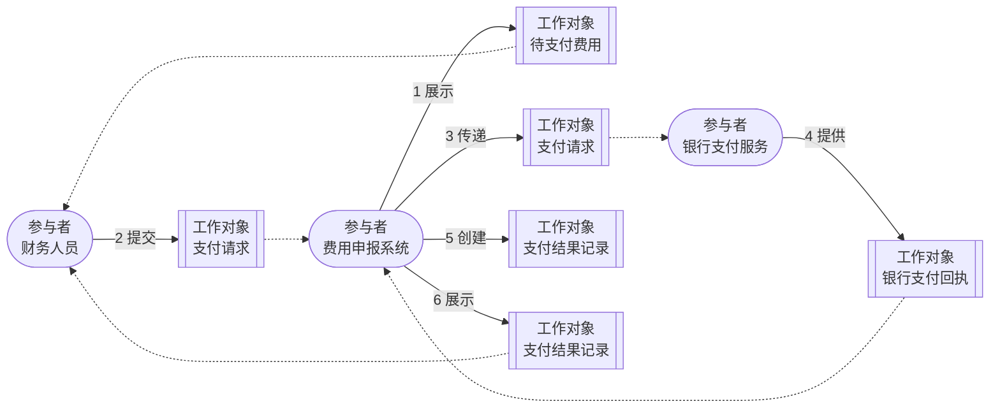

import {handleHorizontalArrowKey} from '@site/src/components/KeyboardScrollableRegion/handleHorizontalArrowKey.mjs';

# 领域叙事协作建模

## 学习问题

- 如何选择故事的粒度、现状/目标状态与纯粹/数字化范围，又如何先完成典型路径、将重要变体分离为新的领域故事？
- 怎样让领域专家用具体业务语言讲清“谁对什么做了什么，并与谁协作”？
- 参与者、工作对象、活动、序号与注释分别记录什么，又不能证明什么？
- 怎样把银行支付服务的外部权威证据保留在故事中，而不把本地记录误当成支付结果？
- 领域叙事与流程图、用例、事件风暴各自适合回答什么问题？

## 建模目标与输入

本文只建立单一且有限、数字化、现状、典型/80% 的费用支付故事：财务人员从费用申报系统查看待支付费用，提交支付请求，系统把请求传递给银行支付服务，并依据可核验的银行回执创建和展示支付结果记录。这个窄范围不讨论异常恢复、循环、合规分支或未来流程。

参与者包括真正执行日常支付工作的领域专家、提供系统与技术上下文的信息技术专家，以及引导叙述、绘制与复述的主持人。

输入应包含一个真实但已脱敏的典型实例，并明确粒度、现状/目标状态、纯粹/数字化、开始点、典型路径结束条件、非目标、已知分歧与假设，以及重要变体另建领域故事的规则。参与者可以带来操作说明、页面、请求记录与回执样例，但这些材料只是澄清叙述的证据，不能预先决定故事句子。

本文承接 [MOD-02 C4 架构模型（C4 Model）](/modeling/mod-02)的名称与系统权威：本地软件参与者始终称为“费用申报系统”，外部软件参与者始终称为“银行支付服务”。它也承接 [MOD-08 状态机建模](/modeling/mod-08)的结果证据边界：本地支付请求、传递记录和支付结果记录都不能代替银行支付服务回执。

## 元素选择与证据边界

参与者是故事中主动执行活动的人、群体或软件系统；同一参与者在图中只声明一次。软件参与者仍只是业务叙事中的参与者，不自动成为服务、部署单元或真实接口。

工作对象是参与者创建、处理、传递或查看的业务对象。每条活动使用独立的工作对象实例，即使业务类别相同，也保留当句的对象状态与协作者；因此两个“支付请求”和两个“支付结果记录”不会在图中合并。

活动是从主体参与者发出的、使用领域动词命名的箭头。序号只把具体故事的句子排成可复述顺序。注释用于保留变体、假设、错误可能性和需要澄清的术语，而不把它们伪装成已经实现的行为。

故事句子的证据说明必须区分意图、传递、本地记录和外部权威结果。尤其是第 4 句的银行支付回执是本故事支付结果的外部权威证据；第 5、6 句只能表示费用申报系统据此形成并展示本地记录。

## 核心产物

先把领域专家讲述记录成六句可朗读的故事。表格保留每句的主体、动词、工作对象、可选协作者和证据边界。

| 序号 | 主体参与者 | 活动 | 工作对象 | 协作参与者 | 证据说明 |
| --- | --- | --- | --- | --- | --- |
| 1 | 费用申报系统 | 展示 | 待支付费用 | 财务人员 | 费用申报系统中的待支付费用视图；不证明银行已经接受请求 |
| 2 | 财务人员 | 提交 | 支付请求 | 费用申报系统 | 本地支付请求记录；只证明财务人员表达了支付意图 |
| 3 | 费用申报系统 | 传递 | 支付请求 | 银行支付服务 | 请求传递记录；不证明支付已经发生或成功 |
| 4 | 银行支付服务 | 提供 | 银行支付回执 | 费用申报系统 | 银行支付服务回执；是本故事支付结果的外部权威证据 |
| 5 | 费用申报系统 | 创建 | 支付结果记录 | — | 依据银行支付回执创建的本地记录；不能反向替代银行回执 |
| 6 | 费用申报系统 | 展示 | 支付结果记录 | 财务人员 | 向财务人员展示的本地结果；结论仍由银行回执支撑 |

同一组句子可画成领域故事。实线箭头表达带序号的活动，点线只连接该句的协作参与者；第 5 句只有主体参与者和工作对象，因此没有协作者边。

最后用同一证据问题比较四种模型。比较的目的不是选出万能工具，而是阻止团队把一种产物的语法和结论偷换成另一种。

| 模型 | 主要问题 | 典型输入 | 核心产物 | 适合发现什么 | 明确不证明什么 |
| --- | --- | --- | --- | --- | --- |
| 领域叙事 | 一个具体业务场景中，谁对什么做了什么并与谁协作 | 领域专家讲述、业务语言、具体实例与范围决定 | 带参与者、工作对象、活动、序号与注释的领域故事 | 共同语言、参与者协作、工作对象、遗漏、分歧与重要变体 | 完整分支、正式需求、应用程序编程接口（Application Programming Interface，API）、事务、服务边界或组织设计 |
| 流程图 | 活动、判断、分支与路径如何连接 | 已识别的活动、条件、入口、出口与规则 | 活动节点、判断与有向路径 | 路径遗漏、分支、循环、顺序与规则缺口 | 参与者已经共享领域语言或系统实现满足流程 |
| 用例 | 参与者为实现目标如何与系统交互 | 参与者目标、系统范围、前后条件及主与替代流程 | 用例、参与者、前后条件与场景描述 | 系统责任、目标、交互边界与需求场景 | 参与者、工作对象、活动与用例元素存在一一映射 |
| 事件风暴 | 领域中发生了什么，哪里存在热点、未知项和边界线索 | 领域事件、参与者叙述、政策、系统、事故与术语证据 | 过去时事件时间线、过程模型、热点与候选假设 | 事件语言、业务转折、政策、未知项和候选边界信号 | 与领域叙事等价或可按元素严格互换 |

## 完成判断

完成的故事应当能由领域专家按 1 到 6 逐句复述，所有参与者、工作对象和活动都使用参与者认可的领域语言。图、句子表和口头叙述应一致；权威名称、典型范围以及每条注释的后续处置应可见。

还必须逐条保留以下非证明规则：

参与者不等于团队、长期负责人、服务或部署单元。

软件参与者不证明真实 API、契约、协议、服务级别协议或安全责任。

工作对象不等于数据库表、聚合、数据负责人或权威存储。

活动箭头不等于同步调用、消息、事务或网络连接。

序号不等于完整时序、并发语义或性能保证。

注释不等于已经实现的分支、错误处理或正式需求。

一张典型领域故事不证明全部异常、循环、合规路径或流程完备性。

一次工作坊不单独确认正式系统边界、限界上下文或组织结构。

## 常见失败

- 用“处理”“操作”之类抽象词替代领域动词，导致参与者无法判断真实行为。
- 把两条活动使用的同类工作对象合并，使对象状态与协作参与者变得含混。
- 将费用申报系统的请求或结果记录当作银行已经接受请求或支付成功的证据。
- 为典型故事塞入所有异常、判断与循环，使一次复述无法完成，也掩盖重要替代情形。
- 把软件参与者、活动箭头或序号直接翻译成服务、调用和运行时顺序。
- 主持人替领域专家选择术语，或在工作坊后独自“整理”掉现场分歧。

## 与其他模型的衔接

[MOD-01 架构视图与视点](/modeling/mod-01)帮助团队按关切选择模型；[MOD-02 C4 架构模型](/modeling/mod-02)提供系统范围和权威名称；[MOD-08 状态机建模](/modeling/mod-08)约束支付结果仍未知时的证据与恢复语义；[MOD-09 事件风暴](/modeling/mod-09)可探索更宽的事件时间线、热点和候选边界信号。

领域故事中发现的语言分歧、权威记录冲突和协作变化只能作为后续输入。正式系统边界与限界上下文仍需交给 [MOD-11 领域驱动设计上下文映射（DDD Context Map）](/modeling/mod-11)或等价架构活动验证；参与者与工作对象不能直接生成上下文。

[Temporal 工作流平台补偿事务与持久执行案例](/cases/temporal-saga-durable-execution)可用于进一步检验超时、重试（Retry）、补偿与人工收敛，但该案例的运行机制不为领域故事补充正式执行语义。

返回[建模目录](/modeling)可按新的问题选择下一种模型。

## 完整演练

1. 主持人说明场景、粒度、现状、数字化、权威名称和非目标。
2. 领域专家从一个具体费用支付实例开始，用自己的领域语言回答“接下来发生什么”。
3. 主持人逐句画出参与者、工作对象、活动和序号，并当场朗读。
4. 参与者即时纠正术语、遗漏、顺序和工作对象，不用抽象词掩盖真实分歧。
5. 团队先完成典型路径；小差异写入注释，重要替代情形另建领域故事。
6. 全体从第一句开始复述，检查明显错误、遗漏和领域专家是否认可。
7. 团队复查注释，为每个分歧或变体确定澄清方式、后续故事或其他模型。

如果费用申报系统未取得可核验的银行回执，则停止典型故事，将“支付结果仍未知”保留为注释，并依据 MOD-08 另建异常故事。

## 来源

- [Domain Storytelling Quick-Start Guide](https://domainstorytelling.org/quick-start-guide)：支持参与者、工作对象、活动、序号、注释、范围选择、典型场景、参与式工作坊与复述检查；不使领域故事成为完整需求、可执行流程或架构证明。
- [Domain Storytelling](https://domainstorytelling.org/)：支持通过领域语言、活动与工作对象建立共享理解的方法目的；不证明本文的系统边界或生产行为。
- [Requirements](https://domainstorytelling.org/requirements)：支持在保留场景上下文的前提下把领域故事衔接到需求与用户故事；不表示领域叙事与用例或用户故事等价。
- [How to Model Repeating Activities](https://domainstorytelling.org/articles/how-to-model-loops/)（斯特凡·霍费尔）：支持用具体实例、注释与分组表达重复活动的选择；不赋予领域故事正式循环、分支或执行语义。

本文的费用支付故事、表格、Mermaid 图表工具生成的图、比较与演练均为本站原创教学内容。外部来源只支持方法背景，不证明系统边界、运行时机制、组织责任或支付结果。
