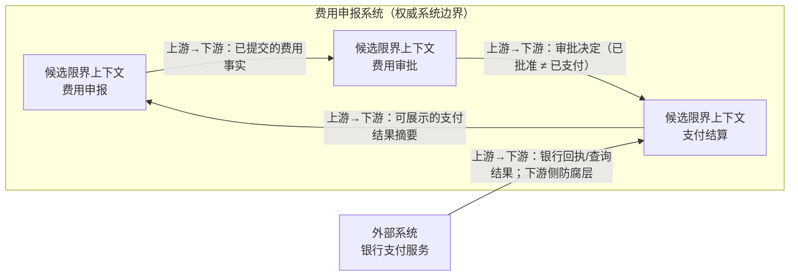

import {handleHorizontalArrowKey} from '@site/src/components/KeyboardScrollableRegion/handleHorizontalArrowKey.mjs';

# 领域驱动设计上下文映射

## 学习问题

- 怎样用语言、独立规则、业务权威和协作变化提出限界上下文候选，而不是照搬现有模块？
- 怎样逐条判断上游与下游角色与翻译责任，同时避免把箭头误读成运行时调用？
- 怎样保留反证、备选划分、责任类型与下一项证据，使上下文映射可以被复查？
- 怎样承接银行支付结果的外部证据边界，而不让本地支付结算成为银行结果权威？

## 建模目标与输入

本文在 [MOD-02 C4 架构模型（C4 Model）](/modeling/mod-02)确定的名称与系统边界内工作：本地权威系统名称是“费用申报系统”，银行支付服务位于该系统之外。上下文映射的目标不是宣布最终拆分，而是把候选边界、关系角色、翻译责任与待验证证据放在同一张可复述的地图上。

输入来自 [MOD-09 事件风暴](/modeling/mod-09)发现的事件、术语热点与边界信号，以及 [MOD-10 领域叙事（Domain Storytelling）](/modeling/mod-10)发现的工作对象、协作变化和语言分歧。[MOD-08 状态机建模](/modeling/mod-08)补充支付结果未知与银行证据边界。现有服务、模块、表结构、仓库和团队图只能作为待核对材料，不能直接决定候选。

## 边界候选与证据规则

候选首先要有可观察的本地语言与独立规则，再说明它对哪些业务事实具有权威、哪些事实明确不归它判断。支持证据必须能追溯到建模活动或真实案例；反证或备选必须允许合并、拆分或否决，而不是只为既定结构辩护。

业务权威描述“哪种业务判断由哪套模型作出”，不是代码或存储归属。支付结算可以把银行回执与查询结果翻译成自己的执行语义和展示摘要，但外部支付是否发生仍由可核验的银行证据支撑。

限界上下文不等于子域、系统、服务、模块、数据库、仓库、部署单元或团队。

上下文与团队不存在自动的一对一关系。

业务权威不等于数据库、存储位置或组织所有权。

银行支付服务是外部系统，不是本地限界上下文。

三个候选都可能在后续证据下合并、拆分或被否决。

## 核心产物

第一张表把候选与其证据、反证和下一项验证并列，避免候选名称脱离语言、规则和权威判断。

| 候选上下文 | 本地语言 | 独立规则 | 业务权威 | 支持证据 | 反证或备选 | 下一项验证与责任类型 |
| --- | --- | --- | --- | --- | --- | --- |
| 费用申报 | 费用、凭证、提交、补正、申请人 | 费用完整性、凭证要求、提交与补正条件 | 已提交且可供后续判断的费用事实；不含审批决定与支付结果 | MOD-09 的费用提交事件与术语热点；MOD-10 的待支付费用与支付请求协作 | 若提交与审批规则长期共同变化，可与费用审批合并 | 核对规则变更历史与术语冲突；费用业务领域专家 |
| 费用审批 | 审批决定、审批理由、权限、政策适用 | 审批层级、额度、拒绝与重新审批 | 审批决定及其依据；已批准 ≠ 已支付 | MOD-09 发现审批与支付使用不同结果语言 | 若决定与支付只是同一规则生命周期，可与支付结算合并 | 核对政策变更与跨阶段不变量；审批政策责任人 |
| 支付结算 | 支付请求、银行回执、结果未知、查询、对账 | 结果确认、未知保持、重查与对账收敛 | 本地支付执行语义与可展示摘要；银行结果仍以外部回执或查询为证 | MOD-08 的结果未知边界；MOD-10 的银行回执权威与本地展示协作 | 对账若有独立语言与变化节奏可继续拆分，否则保留本候选 | 核对回执、查询、对账案例与契约；支付或对账责任人、外部集成契约责任人 |

图只表达费用申报系统边界、三个本地候选、一个外部系统以及四条逐关系判定的模型影响方向。

上游与下游是逐条关系判定的角色，同一个上下文可以在不同关系中承担不同角色。箭头只为表达模型影响与集成责任而从上游指向下游；它不描述数据包、控制流或组织层级。已批准 ≠ 已支付。支付结算翻译银行证据，但不成为外部支付结果权威。

图中的箭头不等于应用程序编程接口（Application Programming Interface，API）、调用、事件、事务、协议、网络方向或执行顺序。

上游与下游关系不等于组织权力、价值高低或数据包方向。

防腐层标签不证明实现已经存在。

第二张表逐条记录交换事实、下游侧翻译或适配责任、适合参与验证的责任类型，以及当前刻意不作出的实现结论。

| 上游 | 下游 | 交换事实 | 翻译或适配责任 | 契约责任类型 | 当前不证明什么 | 下一项验证与责任类型 |
| --- | --- | --- | --- | --- | --- | --- |
| 费用申报 | 费用审批 | 已提交的费用事实 | 费用审批按审批语言解释输入，不反向改写申报事实 | 审批政策责任人 | 不证明 API、事件、事务或服务调用 | 核对字段含义与拒绝、补正规则；费用领域专家、审批政策责任人 |
| 费用审批 | 支付结算 | 审批决定 | 支付结算把已批准解释为可进入支付判断，不解释为已支付 | 审批政策责任人、支付或对账责任人 | 不证明同步调用、消息格式或执行顺序 | 核对撤回、过期与重复决定；审批政策责任人 |
| 银行支付服务 | 支付结算 | 银行回执或查询结果 | 支付结算以下游侧防腐层转换外部语义并保留可核验原始证据 | 外部集成契约责任人 | 不证明防腐层实现、银行开放主机服务、发布语言、协议或服务级别协议已存在 | 核对回执状态、未知值与查询语义；外部集成契约责任人 |
| 支付结算 | 费用申报 | 可展示的支付结果摘要 | 费用申报只转换展示语言，不成为银行结果或支付执行状态权威 | 费用业务领域专家、支付或对账责任人 | 不证明共享数据库、反向写入或数据所有权 | 核对展示词汇与证据追溯；费用业务领域专家 |

## 完成判断

完成检查必须覆盖证据、备选、责任类型、下一项证据，并能在不带运行时解释重放整张图：

- 每个候选都记录本地语言、独立规则、业务权威、支持证据、反证或备选以及下一项验证责任；
- 每条关系都记录上游/下游角色、交换事实、翻译责任、契约责任、非证明边界和下一项验证；
- 参与者能在不使用 API、调用链或组织权力解释的情况下复述四条箭头；
- 银行支付服务保持外部系统身份，支付结算的防腐层责任与银行结果权威不混淆；
- MOD-09、MOD-10 的线索被明确接受、否决或保留为待验证项；
- 所有未决项都有责任类型、下一项证据和复查条件；
- 所有人理解三块都是候选，不是已批准的系统、服务、数据库、团队或部署划分；
- 与 MOD-01、MOD-02、MOD-05、MOD-08、MOD-09、MOD-10 和后续 MOD-12 的交接边界清楚。

## 常见失败

- 直接沿用组织图、代码仓库或数据库，把已有结构重命名为限界上下文。
- 只收集支持证据，不写反证、备选划分、下一项证据和复查条件。
- 把每条上下游箭头读成固定的请求方向、时间顺序或上下级关系。
- 给全部边界贴满关系模式标签，却没有逐条说明翻译问题与证据。
- 把本地支付记录、审批决定或展示摘要当作银行支付结果。
- 用某个交付团队替代业务、政策、对账与外部契约等责任类型。

## 与其他模型的衔接

[MOD-01 架构视图与视点](/modeling/mod-01)解释为何上下文映射只回答特定关切；[MOD-02 C4 架构模型](/modeling/mod-02)给出费用申报系统与银行支付服务的名称和系统范围。[MOD-05 数据模型](/modeling/mod-05)可在候选稳定后检验概念、逻辑与物理数据责任，不能反向用表结构决定边界。

[MOD-08 状态机建模](/modeling/mod-08)约束未知支付结果与证据收敛；[MOD-09 事件风暴](/modeling/mod-09)提供事件、政策、热点和候选边界线索；[MOD-10 领域叙事](/modeling/mod-10)提供具体场景中的语言、工作对象与协作变化。[MOD-12 架构图审阅清单](/modeling/mod-12)只能接收这里仍标为候选、且带有非证明边界的产物，并保留“候选上下文不是组件分解”这一交接约束。

[Temporal 工作流平台补偿事务与持久执行案例](/cases/temporal-saga-durable-execution)提供运行时异常案例。Temporal 补偿事务案例可检验超时、重试（Retry）、补偿与人工收敛，但不能确定候选上下文。

返回[建模目录](/modeling)可根据下一项证据选择合适模型。

## 完整演练

1. 复述 MOD-02 权威系统边界，明确银行支付服务位于系统外。
2. 从 MOD-09 与 MOD-10 收集语言、规则、权威记录和协作变化线索，不按现有模块分组。
3. 提出三个候选上下文，并为每个候选填写支持证据、反证和备选划分。
4. 为四条关系逐条判断上游与下游，写清交换的业务事实，不画运行时调用链。
5. 只在银行边界标注下游防腐层，说明翻译内容和未被证明的模式。
6. 为每个未决边界和关系登记责任类型、下一项证据与复查条件。
7. 从系统边界到四条关系完整复述，确认候选、权威和非证明规则没有相互矛盾。

演练结束后，用完成检查逐项回放；任何无法说明证据、反证、责任类型或下一项验证的边界与关系，都继续保留为未决假设。

## 来源

- [Bounded Context](https://martinfowler.com/bliki/BoundedContext.html)：支持语言与模型边界以及显式上下文映射关系；不证明本文候选边界、服务、团队或运行时设计。
- [Context Mapping](https://github.com/ddd-crew/context-mapping/tree/970c1ff3a61f7aa8b61b789b697c05bc585f614d)：支持围绕具体问题绘制小型上下文映射、逐关系判断上游与下游及关系模式的存在；不复用其速查表或在线白板资产，也不替本文选择关系模式。
- [Anti-Corruption Layer](https://contextmapper.org/docs/anticorruption-layer/)：支持防腐层作为下游翻译与隔离责任；不证明银行边界已有防腐层、开放主机服务、发布语言、协议或部署实现。
- [Context Mapping](https://www.avanscoperta.it/en/context-mapping/)：支持边界指标并非绝对、仍需架构判断；不批准本文候选边界。

本文的三个候选、两张表、上下文映射图、演练与完成检查均为本站原创教学内容。来源只支持方法背景，费用申报系统的边界、语言、业务权威和关系仍需由列出的下一项证据验证。
