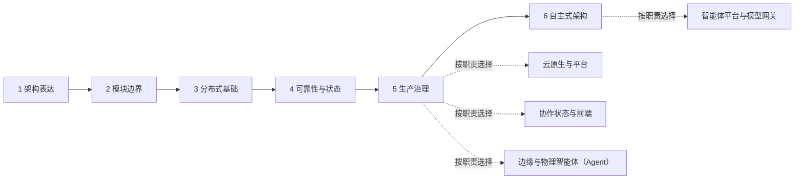

import TopicIndex from '@site/src/components/TopicIndex';

# 软件架构学习路线

这条路线写给已经做过软件开发、但架构知识仍然零散的工程师。它不从编程语言、版本控制或超文本传输协议（Hypertext Transfer Protocol，HTTP）基础开始，也不要求把所有外部链接依次读完；路线负责说明知识依赖和学习边界，外部资料负责建立通用概念，本站案例负责把概念放回真实系统验证。

每个阶段都以可观察的检查点结束。已经能够独立完成检查点的读者，可以跳过该阶段的“必读起点”，直接阅读不熟悉的案例或进入下一阶段。遇到陌生术语时再使用“查漏补缺”，只有工作需要采用该机制时才进入“深入拓展”。

## 六阶段主干

1. [架构思维与表达](/paths/architecture-thinking)：从约束、质量属性（Quality Attribute）、C4 架构模型（C4 Model）与架构决策记录（Architecture Decision Record，ADR）建立共同语言；保留一张上下文图和一条架构决策记录。
2. [模块边界与应用架构](/paths/module-boundaries)：用变化原因、所有权和依赖方向判断模块边界；保留一张标明所有权与依赖方向的模块图。
3. [分布式系统基础](/paths/distributed-systems)：识别跨进程状态中的超时、重复、乱序与部分完成；保留一份跨服务失败窗口轨迹。
4. [可靠性与状态管理](/paths/reliability-state)：把重试（Retry）、幂等、取消、预算与人工接管组织成恢复协议；保留一个长时任务状态机。
5. [扩展、隔离与生产治理](/paths/production-governance)：把容量、隔离、降级、安全、成本和可观测性纳入正常控制路径；保留一份隔离与降级工作表。
6. [智能体式架构专项](/paths/agentic-architecture)：比较控制权、状态、权限与恢复边界，而不是只比较智能体数量；保留一份控制、状态、权限与恢复对照表。

## 按职责选择专题

- [云原生与平台](/paths/cloud-native-platform)：面向容器化、服务与网络、扩缩容、发布、可观测性、服务级别目标、声明式交付、基础设施即代码和安全。
- [协作状态与前端](/paths/collaborative-state-frontend)：面向共享状态、语义冲突、业务所有权与运行时组合。
- [边缘与物理智能体](/paths/edge-physical-agents)：面向断网自治、通信语义、生命周期、实时性与独立安全链。
- [智能体平台与模型网关](/paths/agent-platform-gateway)：面向能力路由、租户隔离、身份权限、成本、评估与可观测性。

## 路线主题清单

<TopicIndex type="path" />

## 保留这些实践产出

- 上下文图与架构决策记录
- 带所有权和依赖方向的模块图
- 跨服务失败窗口轨迹
- 长时任务状态机
- 隔离与降级工作表
- 智能体式控制、状态、权限与恢复对照表

不要用“看完多少链接”衡量进度。每完成一个阶段，就用本站案例反问：它解决了什么约束，代价是什么，迁移到自己的系统时哪项前提并不成立。

外部资料会持续变化；本页核查截至 `2026-07-23`，上游变化时请回到官方来源确认。
