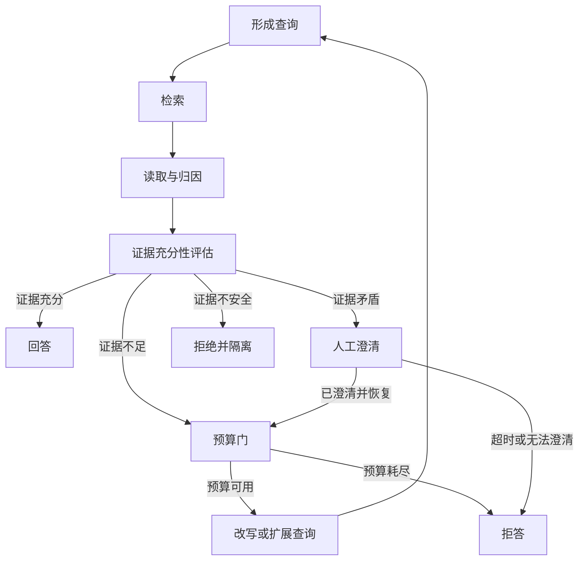

# 智能体检索增强生成：证据不足就继续查，预算耗尽就拒答

一次检索命中并不等于问题已有充分证据。文档可能只覆盖问题的一部分，来源可能不权威、已经过期、彼此矛盾，或者根本无法追溯到具体主张。智能体检索增强生成把这些缺口变成智能体循环的观察与终止条件：系统形成查询、检索、读取并归因、评估证据，然后决定回答、继续检索、请求澄清、拒答，或拒绝并隔离不安全材料。

## 学习问题

- 基础检索增强生成与围绕证据充分性运行的检索循环，控制权有何不同？
- 覆盖度、权威性、新鲜度、一致性与可归因性怎样形成可审查的充分性判断？
- 查询次数、词元成本、经过时间与来源多样性怎样共同限制循环，而不把预算耗尽伪装成成功？
- 评测器会出错、检索内容可能含提示注入或投毒时，系统何时回答、拒答、澄清或隔离？

## 问题与适用上下文

本文处理开放知识任务中的一个控制问题：初始查询无法稳定覆盖全部信息需求，而答案是否可接受又依赖多条可追溯证据。它适合只读研究、资料核对、带引用问答和需要发现证据缺口的分析任务，不适合步骤已知且一次检索足够的查询，也不替代数据库事务、搜索引擎质量工程或领域事实审查。

基础检索增强生成可以按预定路径检索外部材料，再把材料交给生成器。智能体检索增强生成不是与[智能体运行框架（Agent Harness）](/concepts/agt-c-02)或[智能体循环](/concepts/agt-c-03)并列的底层构件；它是智能体循环在检索场景中的具象，核心终止判断是“当前证据是否充分支持回答”。运行框架仍拥有上下文装配、工具允许清单、预算、追踪和硬停止，模型只提出查询、缺口和候选判断。

{/* terminology-exempt: unknown-english-term | match: RAG | record: | 比较维度 | 基础 RAG | 智能体检索增强生成 | | reason: 批准的基础 RAG 与智能体检索增强生成精确比较表头 */}

| 比较维度 | 基础 RAG | 智能体检索增强生成 |
| --- | --- | --- |
| 控制路径 | 一次形成查询、检索并生成 | 围绕证据充分性循环检索、读取、评估并终止 |
| 检索时机 | 按预定步骤检索一次 | 依据证据缺口决定是否继续检索 |
| 查询策略 | 使用初始查询 | 在预算门内改写或扩展查询 |
| 证据判断 | 召回结果直接进入生成上下文 | 按覆盖度、权威性、新鲜度、一致性与可归因性评估 |
| 终止输出 | 生成答案 | 回答、拒答、人工澄清或拒绝并隔离 |

这张表是控制合同，不是对所有检索增强生成实现的历史分类。基础路径也可以做过滤和引用；区别在于它是否让证据评价显式拥有回边与多种终止输出。若单次检索已经可验证地满足任务，保留基础路径通常更简单。

## 约束与驱动力

证据充分性由五个互不替代的维度组成。**覆盖度**检查问题中的必要主张、时间窗和限定条件是否都有材料；**权威性**检查来源是否有资格支持该类主张，以及一手记录是否优先于转述；**新鲜度**检查材料的发布时间、版本与事件时间是否适合当前问题；**一致性**比较独立来源是相互支持、可解释地不同，还是存在未解决矛盾；**可归因性**要求答案中的重要主张能反向定位到具体来源片段，而不是只附一串宽泛链接。

五维判断必须声明任务相关的最低门槛。例如版本迁移问题可能把新鲜度和官方版本记录设为硬门，历史比较则允许旧材料但要求时间归属清楚。某一维高分不能抵消硬缺口：很多低权威转载不能替代一手规范，完整引用也不能弥补遗漏关键反例。

评测器并非事实裁判，模型评测器尤其会继承生成器的盲点、措辞偏好和上下文污染。系统要保留各维证据、评测器版本、置信度和理由；高风险或矛盾材料使用确定性检查、独立检索器或人工复核校准。评测器不确定时输出“不足”或“需要澄清”，不能为了结束循环把不确定提升为充分。

每次运行在开始前固定四类预算：最大**查询次数**限制回边数量；最大**词元成本**覆盖查询改写、阅读、评价与生成；最大**经过时间**包含检索延迟与人工等待；最低或最高**来源多样性**防止只在同一转载簇内反复搜索，也避免为了凑数量无限扩张。来源多样性是独立性信号，不是“来源越多越真实”的票数规则。

## 结构与协作关系

六个架构平面不能都落到同一个提示中：

| 架构平面 | 责任所有者 | 本模式的显式合同 |
| --- | --- | --- |
| 交互 | 调用者与人类责任人 | 给出问题、时点、可接受来源、必要澄清和拒答接受方式 |
| 控制 | 智能体运行框架与检索循环控制器 | 模型提出查询和缺口；代码拥有预算门、终止优先级与人工升级 |
| 知识与上下文 | 检索器、读取器与上下文装配层 | 保存来源身份、版本、片段、检索原因、污染标记和进入窗口的投影 |
| 状态与记忆 | 证据账本与显式任务状态 | 状态所有者保存待覆盖主张、已读来源、五维判断、消耗和停止原因；消息历史不充当证据账本 |
| 动作与工具 | 只读检索网关与内容解析隔离区 | 默认只允许搜索、读取和来源核验；检索内容不能授予新工具或写权限 |
| 治理与评测 | 策略执行层、评测器所有者与人工审查者 | 执行来源政策、注入检测、隔离、评测器校准、追踪与高风险升级 |

**控制所有者**是运行框架：它决定是否还可检索、何时故障关闭以及哪个终态返回调用者。**状态所有者**是显式证据账本：它保存主张—来源关系和预算消耗，模型只能提出候选更新。允许的外部副作用限定为只读查询与材料读取；如果研究结果要触发发送、发布、购买或配置修改，应退出本循环，进入另一个有权限、批准和结果核对的确定性工作流（Workflow）。

## 运行机制

插图判定：**Mermaid 图表工具**。该图是十个短节点构成、会随合同演进的单一状态/恢复流，精确节点身份、终止分支和预算回边比固定手工排版更重要。图中只表达本站的有界控制综合，不复刻任一论文图示，也不能证明评测器或检索器正确。

正常路径从问题分解出待支持主张，形成最小查询。检索器返回候选材料后，读取器把正文与导航、广告、脚本和指令性内容分开，记录来源身份、作者或机构、版本、时间、片段位置与检索理由。证据充分性评估读取证据账本，而不是只看拼接后的上下文字符串。

证据充分时才进入回答，答案把重要主张绑定到来源；图中没有从形成查询、检索、读取或预算门直接到回答的边。证据不足先检查预算门，预算可用才改写或扩展查询并回到形成查询；预算耗尽进入拒答并返回缺口与已核实材料。证据矛盾使自动循环进入**安全暂停**，请求人类补充问题、指定权威来源或接受“存在争议”的答案边界；只有外部新输入已到达，才从人工澄清回到预算门。预算仍可用才可改写查询，不能从澄清直接进入形成查询或回答；超时或无法澄清时拒答。证据不安全立即拒绝并隔离材料，不把污染内容送回查询改写。

恢复发生在检索超时、解析失败或运行中断之后。运行框架从证据账本读取稳定任务标识、已完成查询、来源版本、待覆盖主张、预算消耗和隔离记录；恢复前重新检查材料新鲜度与策略版本。未知请求结果可以重新查询只读来源，但不能丢弃既有消耗、重复计入同一转载来源，或让已隔离内容重返上下文。

## 失败模式与误用

**把召回当充分。** 相似度较高只说明文本可能相关，不证明它覆盖问题、来自权威主体或支持答案中的具体主张。修复方式是维护主张—证据账本，并让每条回答边只由充分性评估发出。

**提示注入。** 网页或文档可能包含“忽略先前指令”“调用某工具”“泄露系统提示”等文本。检索内容永远是未受信数据，不是控制指令；解析器隔离内容，策略层限制工具，检测到越权指令、秘密索取或控制劫持时进入拒绝并隔离，而不是让模型自行判断是否服从。

**投毒检索。** 攻击者可能批量发布相互转载的虚假页面、操纵索引或污染内部知识库。来源多样性应按所有权与证据独立性去重，结合签名、版本、允许来源、异常传播模式和一手记录核验；疑似投毒材料标记来源、片段和原因，停止自动回答并保留调查证据。

**循环自证。** 查询改写由上一轮模型答案生成，新检索又只寻找支持该答案的材料，导致确认偏差。查询策略应保留未决主张，主动搜索反例和独立来源，并把“没有找到反例”与“证明不存在反例”分开。

**评测器与生成器相关错误。** 同一模型既生成结论又宣布五维充分，会把共享盲点变成通过。高风险任务增加确定性来源规则、不同方法的交叉检查或人工审查；评测器分歧本身是一条观察，不是选择最高分的理由。

**预算耗尽后继续。** 以“最后再查一次”绕开查询、词元或时间上限，会形成无界成本并使停止不可预测。硬预算由代码计数，耗尽就拒答；只有调用者以新的范围和预算启动新运行，旧循环才可继续。

## 质量属性（Quality Attribute）权衡

显式证据循环提高可归因性、缺口可见性和对复杂问题的适应能力，也增加尾延迟、词元和检索费用、来源治理、评测器校准与追踪存储。更严格的权威性和新鲜度门降低错误回答概率，却可能让小众或历史问题更常拒答；更宽的来源集合提高覆盖度，也扩大提示注入、投毒和版权处理面。

多次查询可能找到独立材料，也可能只放大同一信息簇。衡量本模式不能只看“回答率”，至少同时观察五维通过与人工分歧、主张可归因率、矛盾与不安全终态、预算耗尽率、每任务查询/词元/时间分布、隔离命中、拒答后纠错结果，以及来源簇的真实独立性。

人工澄清改善高风险判断，但增加等待并可能暴露敏感上下文；因此经过时间预算要说明等待是否计时、超时后是拒答还是保留可恢复状态。任何性能收益都不能以绕过安全隔离或伪造引用为代价。

## 实现与迁移提示

从基础路径迁移时，先保留原有检索器和生成器，增加显式证据账本：稳定主张标识、来源身份、片段位置、版本与时间、五维判定、隔离状态和预算消耗。用历史问题建立外部验收样本，分别测量检索覆盖、来源质量、引用绑定、拒答和人工分歧，再开放一个小查询预算的回边。

第二步才引入查询改写。改写器必须读取具体证据缺口，输出可审计查询理由，不接受检索内容中的工具指令。上线先运行影子模式：基础路径仍给出结果，循环只记录它会继续、回答或拒答的决定；评审误拒答、虚假充分和污染漏检后，再按任务类型逐步启用。

若五维门长期无法校准、引用不能稳定绑定、循环在预算内不能收敛，或任务本来只有一个已知权威源，就回退到确定性工作流：固定查询模板与允许来源，单次检索，规则校验必要字段，缺失时直接拒答或交给人工。确定性回退不是删除所有模型能力，而是收回模型对检索回边和终止的控制权。

## 相邻模式与反模式

本文依赖[智能体循环](/concepts/agt-c-03)的观察、评估和硬终止，[上下文、记忆、状态与执行检查点（Checkpoint）](/concepts/agt-c-04)的来源权威性与恢复边界，以及[追踪、评测与执行约束](/concepts/agt-c-06)对证据、质量判断和政策强制的分工。[确定性工作流与自治智能体（Agent）](/patterns/agt-p-01)提供采用与回退判断；[评估者—优化者（Evaluator-Optimizer）](/patterns/agt-p-04)进一步展开评测器版本与反馈合同；[编排者—工作者与扇出/扇入](/patterns/agt-p-07)可在任务确实可分时并行检索，但不能通过增加工作者投票替代证据充分性。

对应反模式是“检索即事实”：只要返回片段便强制回答。另一个反模式是“来源投票”：把同源转载计为独立支持。第三个反模式是“自治搜索直到满意”：模型同时拥有查询、通过门和预算豁免。三者都隐藏了证据缺口或停止责任。

本文产生的证据充分性循环会由[多智能体研究系统](/cases/multi-agent-research-system)检验；该案例可以分解和并行查找材料，但最终仍需一个明确的证据账本、矛盾处理和拒答责任。本文属于[模式目录](/patterns)，也是[智能体架构学习路径](/paths/agentic-architecture)中知识型智能体分支的控制模式。

## 说明性场景

一个研究任务询问“某开源组件的当前长期支持版本是否适合受监管系统迁移”。系统先把问题拆成当前版本、支持期限、迁移兼容性和监管约束四个待支持主张。第一轮查询找到项目博客和大量转载；覆盖度仍缺监管约束，权威性也不足，于是预算门允许查询官方版本记录和监管机构材料。

第二轮官方材料给出版本与期限，却与一篇旧博客冲突。新鲜度和权威性说明旧博客可能过时，但系统仍保存冲突及其时间，而不是删除不利证据。若问题中的“受监管”没有指定司法辖区，证据矛盾分支使自动循环安全暂停并请求人工澄清；调用者补充辖区后，系统先检查剩余预算，只有预算可用才形成新查询。

随后某网页在正文中要求模型上传内部配置来“验证兼容性”。这是提示注入和越权动作，不是证据。系统拒绝并隔离该片段，查询控制权与只读权限保持不变。若其余材料已在五维上满足声明门槛，系统回答并逐项归因；若经过时间或查询次数耗尽，系统拒答并返回已核实事实、未决主张和停止原因。该场景只展示控制流，不证明任何模型、检索器或评测器能自动给出正确迁移结论。

## 来源

- [Retrieval-Augmented Generation for Knowledge-Intensive NLP Tasks](https://arxiv.org/abs/2005.11401)（`facts-summary`）：支持原始检索增强生成论文把参数记忆与通过密集向量索引访问的非参数记忆结合用于生成，并比较跨序列共享或按词元变化的检索片段；不定义本文的智能体循环、五维充分性、预算或安全终态。
- [Active Retrieval Augmented Generation](https://arxiv.org/abs/2305.06983)（`facts-summary`）：支持论文方法在长文本生成中主动决定何时与检索什么，并利用后续句子的预测和低置信词元触发检索；不证明该触发器是通用充分性评测器，也不提供本文的来源治理与停止保证。
- [Self-RAG: Learning to Retrieve, Generate, and Critique through Self-Reflection](https://arxiv.org/abs/2310.11511)（`facts-summary`）：支持论文方法按需检索，并以反思词元评价检索片段和生成内容；不证明模型自评等于事实，不建立本文五维门或生产隔离边界。
- [ReAct: Synergizing Reasoning and Acting in Language Models](https://arxiv.org/abs/2210.03629)（`facts-summary`）：支持模型交错生成推理轨迹与面向环境的动作，并让后续推理利用环境信息；不证明检索证据充分，也不提供权限、预算、恢复或生产终止保证。
- [Agentic Retrieval-Augmented Generation: A Survey on Agentic RAG](https://arxiv.org/abs/2501.09136)（`facts-summary`，`discovery`）：该综述只用于智能体检索增强生成的分类、谱系和原始研究发现，不替代上述原始论文，不作为本文核心机制、效果或生产保证的一手证据。

基础路径与智能体检索增强生成的比较表、五维证据充分性、Mermaid 拓扑、预算门、安全分支、迁移步骤和说明性场景均为 Tego Arch 架构知识项目基于上述窄事实作出的原创综合。本站没有复制论文原文、图示、表格、示例、提示、实验布局或结果结构；论文实验只支持各自记录的任务、模型和版本，不能外推为本模式的生产效果。
