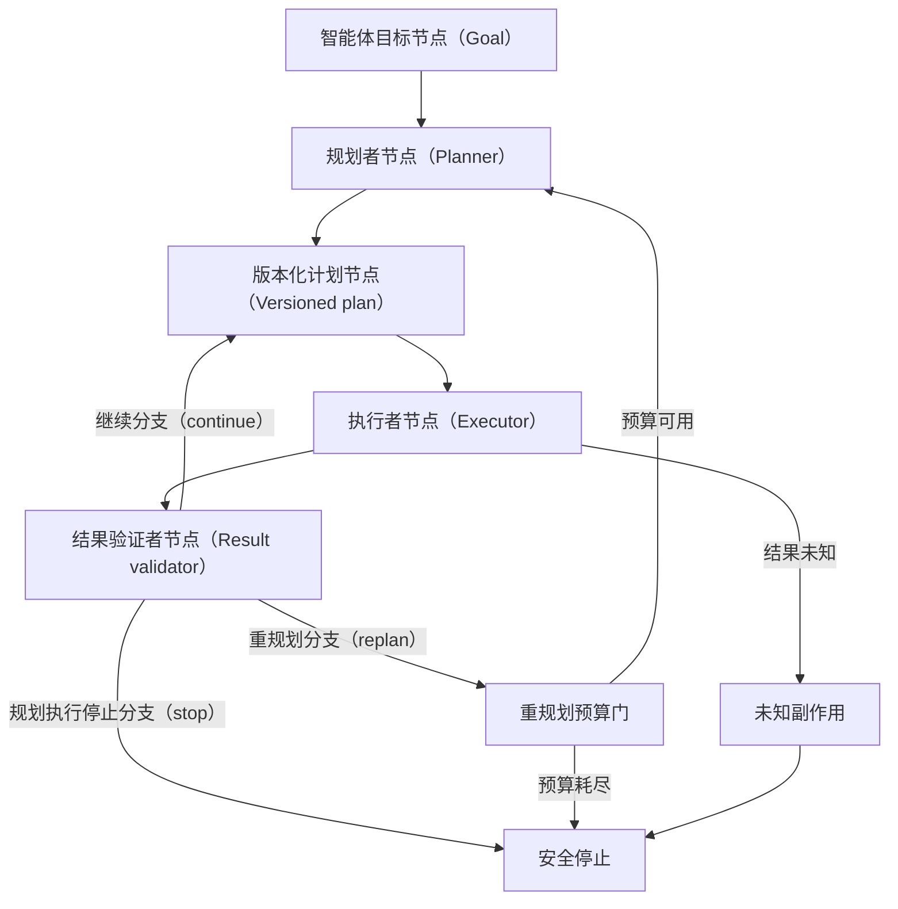

# 规划者–执行者：计划可以改，任务真相不能由计划改写

当智能体（Agent）任务的下一步需要推理，但工具执行又必须受权限、前置条件和结果核验约束时，可以把“提出步骤”与“产生外部效果”分开。规划者生成一个有界的版本化计划；执行者只领取当前版本中通过校验的一步；结果验证者把结构化观察同权威任务状态比较，再决定继续、重规划或停止。

## 学习问题

- 规划者、执行者与结果验证者分别拥有什么控制权，最终终止责任属于谁？
- 为什么计划不是权威任务状态，计划版本如何防止旧步骤在新事实下继续执行？
- 如何用有界计划规模、步骤前置条件、最小权限和观察模式限制开放任务？
- 执行结果未知、计划过时或重规划预算耗尽时，系统如何故障关闭并恢复？

## 问题与适用上下文

本文处理一种控制分离：目标可表达、结果可外部验证，但达到目标的中间步骤不能在运行前完整枚举。例如编码任务会依据测试失败选择下一处修改，事故诊断会依据只读观察更新假设。若步骤始终已知，普通确定性工作流（Workflow）更简单；若结果也无法验证，增加规划循环只会让不可知的执行链更长。

规划者拥有**候选分解权**，可以提出步骤、依赖、预期观察和重新评估点；它不拥有业务事实，也不直接调用产生副作用的工具。执行者拥有**受限执行权**，只能在工具允许清单、临时凭证、批准范围和当前计划版本内执行单步。结果验证者拥有**分支建议权**，但硬预算、权限拒绝、未知副作用停止和最终终止责任由确定性循环控制器拥有。

计划不是权威任务状态，也不等于任务真相。计划描述“打算做什么”；权威任务状态记录“外部系统确认发生了什么”。模型写下“文件已更新”“工单已关闭”或“部署成功”不能让这些事实成立。状态所有者只能接受来自版本控制、测试系统、工单系统或其他权威接口的已验证观察。

本模式不要求规划者和执行者必须是两个模型、两个进程或两个智能体。它是一种责任合同：同一模型可在不同受控阶段承担两个角色，确定性代码也可以承担执行者。两家机构的工程材料各自描述了工作流、智能体及常见组合方式，但其分类不是行业标准；本文的版本、预算和故障关闭合同是本站的架构综合。

## 约束与驱动力

采用本模式前先固定七个约束：

1. **有界计划规模：** 每个计划限制最大步骤数、嵌套深度和总估算成本。规划者不能用无限拆分绕过执行预算；过大的目标先请求缩小范围或交给人工分解。
2. **步骤前置条件：** 每一步声明所需计划版本、权威状态版本、输入证据、批准、工具能力、只读或写入级别，以及执行前必须重新查询的条件。前置条件不满足就不执行。
3. **执行者最小权限：** 执行者只获得当前一步所需工具、资源范围和短时凭证。规划文本不能创建权限，检索内容也不能扩大工具集合。
4. **观察模式：** 每次执行返回结构化观察，至少包含任务标识、计划版本、步骤标识、操作标识、开始与结束时间、结果状态、权威回读证据、错误类别及副作用确定性。
5. **陈旧计划检测：** 执行前比较计划所依赖的权威状态版本、策略版本、资源版本和批准有效期。任何变化都使当前步骤失效，并进入重规划或安全停止。
6. **重规划预算：** 预先限制重规划次数、累计步骤、模型与工具费用、经过时间和相同失败重复次数。重规划不能重置已经消耗的全局预算。
7. **未知副作用故障关闭：** 写操作超时、连接中断或回执矛盾时，结果是“未知”，不是“失败可重试（Retry）”。未知副作用必须停止自动执行，先用稳定操作标识查询权威结果，再由人工或补偿流程决定后续动作。

这些约束使规划者可以适应新观察，却不能改写硬边界。若业务需要让模型同时改变权限、预算和验收标准，应先拆分策略与批准流程，而不是把它称为“更自治的规划”。

## 结构与协作关系

六个架构平面的责任如下：

| 架构平面 | 责任所有者 | 本模式的显式合同 |
| --- | --- | --- |
| 交互 | 目标提出者与人类责任人 | 给出目标、不可违反约束、可接受终态和高风险批准；接受完成、拒绝或需人工处理的结果 |
| 控制 | 确定性循环控制器 | 验证计划版本和前置条件，授予单步执行，记账预算，并拥有继续、重规划、停止转移与终止责任 |
| 知识与上下文 | 上下文装配层 | 为规划者提供目标、当前权威状态投影、工具模式和历史观察；不把计划摘要当作事实 |
| 状态与记忆 | 权威任务存储与外部业务系统 | 保存目标版本、计划版本、步骤状态、操作标识、批准、观察和停止原因；以条件写入防止旧版本覆盖新事实 |
| 动作与工具 | 工具网关与执行者 | 按单步最小权限执行，写前校验、写后回读；不解释计划为新增权限 |
| 治理与评测 | 策略层、结果验证者与人类责任人 | 执行策略门、质量标准、追踪、预算、人工升级和未知副作用处置 |

控制所有者不是规划模型，而是确定性循环控制器；状态所有者不是对话历史，而是显式任务存储和权威外部系统。规划者提出计划版本 `plan_version`，状态存储通过比较并交换或等价的条件更新接受它。执行者领取 `(task_id, plan_version, step_id, operation_id)`，因此旧工作者即使迟到，也不能把结果写入当前计划。

允许的副作用按步骤授予。只读观察可在资源与速率边界内自动执行；可逆写操作还需要稳定操作标识、批准和结果回读；不可逆或高影响动作进入确定性批准工作流。协议或工具描述只表达调用形态，不能证明调用方拥有权限、操作幂等或状态一致。

## 运行机制

插图判定：**Mermaid 图表工具**。该图只有八个短节点，表达一个会随合同迭代的状态流；稳定节点身份、三种分支与安全终态比固定坐标更重要。图是本站的原创控制综合，不复制外部图示，也不证明任何规划模型会产生正确计划。

正常路径分为五步：

1. 循环控制器把目标、硬约束、当前权威状态版本、允许工具模式和剩余总预算交给规划者。
2. 规划者输出版本化计划。每一步具有稳定标识、目的、前置条件、所需能力、预期观察、验证方法和失败分类；计划长度不得超过有界计划规模。
3. 控制器重新读取权威状态并执行陈旧计划检测。只有当前计划版本、前置条件、权限、批准和预算同时有效，才把一条步骤交给执行者。
4. 执行者使用最小权限调用工具，把返回值规范化为观察模式；写操作随后用权威查询确认“已发生、未发生或未知”，不能仅凭调用异常推断未发生。
5. 结果验证者将观察与步骤预期及总体目标比较。继续分支回到同一版本化计划领取下一步；重规划分支先经过重规划预算门，预算可用才产生新版本；停止分支、预算耗尽或未知副作用都汇聚到安全停止。

继续不允许直接从验证者跳到执行者，因为下一步仍需重新读取版本和前置条件。重规划不能直接回到规划者，因为必须先扣除重规划预算。停止是成功、不可满足、策略拒绝或需要人工处置等终止类别的共同控制点；安全停止记录具体原因，而不是把所有终态伪装成成功。

失败与恢复由同一份显式状态合同连接：恢复时，控制器读取最后提交的任务状态、当前计划版本、已完成步骤、未决操作标识和预算账本。已确认完成的步骤不重放；确认未发生且仍满足前置条件的步骤可继续；结果未知的写步骤保持停止，先查权威系统。恢复从状态事实重新验证计划，不从模型最后一段自然语言继续。

## 失败模式与误用

**计划充当任务真相。** 规划者把“部署”写进计划，系统便标记已部署。修复方式是把计划与任务状态分表或分类型保存，只有权威回读证据能推进事实状态。

**计划膨胀。** 规划者一次生成数十个未来步骤，早期观察变化后其余步骤全部陈旧。限制有界计划规模，只规划可验证的近期窗口；计划窗口变短会增加规划开销，却降低陈旧面。

**执行者权限过宽。** 为了减少授权调用，执行者获得整个任务生命周期的管理员凭证。任何注入或错误计划都会放大影响。改用每步能力令牌、资源范围、短时凭证与工具参数模式，规划者无权修改它们。

**无结构观察。** 执行者只返回一段“看起来成功”的文本，验证者无法区分工具回执、模型解释和权威事实。观察模式必须保留原始结果引用、状态枚举、错误分类和副作用确定性；自然语言摘要只是投影。

**陈旧步骤迟到。** 新计划已经取代旧计划，旧工作者仍提交结果。每次领取与提交都携带计划版本和步骤标识，状态存储拒绝旧版本写入；若外部副作用已经发生，则进入补偿或人工处置，不能靠拒绝本地写入假装它没发生。

**无限重规划。** 同一错误触发“换一种方案”直到成本耗尽。重规划预算累计计数，并对相同错误指纹设上限；超限进入安全停止，返回最后可信状态和未满足约束。

**未知副作用后重试。** 写操作超时便按“失败”再次执行，可能造成重复付款、重复通知或重复变更。未知副作用停止自动路径并故障关闭；仅当权威查询确认未发生且稳定操作标识仍有效时，才可由受控恢复流程重试。

## 质量属性（Quality Attribute）权衡

规划与执行分离提高可审计性、权限隔离、安全性（Security）和对新观察的适应能力。版本化计划让每次变更有原因，结构化观察让验证与恢复可重复，单步授权降低错误计划的影响半径。代价是更多模型调用、状态写入、版本冲突、尾延迟和运行治理。

较短计划窗口减少陈旧步骤，却增加规划频率；较严格前置条件提高安全性，却可能因外部状态短暂不可用而停止；独立结果验证降低规划者自证风险，却仍可能与规划模型共享盲点。高风险任务应增加确定性回读、领域规则或人工复核，不能把另一个模型的同意当作事实。

评测至少观察：计划一次通过率、平均计划长度、前置条件拒绝率、陈旧计划命中、继续/重规划/停止分布、每任务重规划次数、同错重复、未知副作用终态、恢复成功与重复动作、权限拒绝、目标验收与人工分歧。只提高任务完成率而隐藏停止、成本和误操作，不构成质量提升。

## 实现与迁移提示

从确定性工作流迁移时，先保持执行路径不变，只让规划者以影子模式提出下一步，与现有分支比较。建立显式任务状态、版本化计划模式和观察模式，再让控制器选择一个只读、可验证、低影响步骤采用模型计划。此阶段执行者仍是确定性工具适配层。

第二步引入单步授权和结果验证。计划每次只覆盖小窗口，所有写操作保持原有批准与回读。收集陈旧检测、重规划原因和停止数据后，才扩大任务类型或计划窗口。不要同时引入多智能体、长期运行和高风险写权限，否则无法定位收益与故障来源。

固定提交的软件开发工具包（Software Development Kit，SDK）示例来自 OpenAI Agents SDK 智能体开发工具包的 `deterministic.py`，展示了一个实现中如何由代码串联不同智能体步骤，因此这里只把它当作**实现证据**。该示例不能证明生产可靠性、权限隔离、状态一致性、恢复能力或部署适用性；本文也不从示例外推框架具备未展示的生产能力。

若计划经常被前置条件拒绝、结果验证无法稳定区分完成与未知、重规划在预算内不收敛，或步骤本来就能预先枚举，应退回确定性工作流：代码拥有顺序和分支，模型只承担一次候选生成或分类，高风险动作继续由批准门控制。保留状态、观察和回读能力，因为它们同样改善确定性流程。

## 相邻模式与反模式

本文依赖[智能体循环（Agent Loop）](/concepts/agt-c-03)的计划、行动、观察、评估与硬终止合同。[确定性工作流与自治智能体](/patterns/agt-p-01)帮助判断是否值得引入模型选步；[评估者–优化者](/patterns/agt-p-04)针对候选内容的反馈修订，而本文针对任务步骤与外部状态；[路由与模型驱动分发](/patterns/agt-p-05)可选择执行能力，但不能接管计划版本和任务真相。

[编排者–工作者与扇出/扇入](/patterns/agt-p-07)可并行执行独立步骤，前提是每个工作项继承版本、预算和汇聚合同。[持久智能体与人工介入](/patterns/agt-p-08)进一步处理跨进程等待、检查点和批准。并行或持久化不会自动修复错误计划，只会扩大计划合同的重要性。

对应反模式包括“计划即事实”“万能执行者”“模型宣布成功”和“失败就重新规划”。它们分别隐藏状态权威、权限边界、结果验证和预算。另一个反模式是把规划者与执行者部署成两个服务便宣称职责已分离；如果两者共享管理员凭证、可任意写任务状态且没有版本门，部署拓扑并未形成控制隔离。

本文的计划版本与执行范围将由[长时编码智能体](/cases/long-running-coding-agent)检验；未知副作用停止和人工处置将由[生产事故响应智能体](/cases/production-incident-response-agent)检验。两篇案例只能验证其说明性约束，不能把一次成功运行外推为生产保证。本文属于[模式目录](/patterns)，并位于[智能体架构学习路径](/paths/agentic-architecture)的控制模式阶段。

## 说明性场景

一个编码智能体收到“升级依赖并保持测试通过”的目标。权威任务状态保存仓库提交、依赖锁文件摘要和基线测试结果。规划者生成 `plan-1`：读取兼容说明、修改一个依赖、运行聚焦测试、再运行全量测试。计划共四步，每一步都有前置提交、允许路径、只读或写入能力和预期观察。

执行者领取修改步骤前发现仓库提交已经由人工更新。陈旧计划检测拒绝执行，结果验证者选择 `replan`。重规划预算还有一次，于是规划者基于新提交生成 `plan-2`；旧计划的迟到结果不能写入当前状态。执行者只获得工作树内指定文件的写权限，不能推送远程仓库或修改发布配置。

聚焦测试通过后，结果验证者选择 `continue`，控制器重新检查 `plan-2` 和全量测试前置条件，再执行下一步。若测试服务超时，这是只读观察失败，可以在剩余工具预算内重试；若“创建发布标签”调用超时且权威服务无法确认标签是否已创建，就属于未知副作用。系统立即停止，不自动重试，把操作标识、请求和最后可信提交交给人工核对。

该场景展示版本、最小权限、观察和停止如何协作，不证明模型能正确规划依赖升级，也不证明固定 SDK 示例具备这些生产合同。若历史数据表明多数升级都遵循同一可枚举步骤，团队应把稳定部分收回确定性工作流，只在异常诊断阶段保留有界规划。

## 来源

- [Building Effective Agents](https://www.anthropic.com/engineering/building-effective-agents)（`facts-summary`）：支持该机构公开材料对工作流与智能体的区分，以及其描述的规划者–工作者、编排等组合方式；不建立本文的计划版本、状态权威、权限、重规划预算或生产保证。
- [A Practical Guide to Building Agents](https://openai.com/business/guides-and-resources/a-practical-guide-to-building-ai-agents/)（`facts-summary`）：支持 OpenAI 公司公开指南对模型控制、工具选择、循环、退出条件与渐进采用的描述；不证明特定实现可靠，也不提供本文的陈旧计划检测和未知副作用处置合同。
- [deterministic flow](https://github.com/openai/openai-agents-python/blob/2fa463571e76dae8ff267622f1018eaf06ffeb9f/examples/agent_patterns/deterministic.py)（`facts-summary`，`implementation`）：固定在记录提交的实现示例展示代码按确定顺序串联智能体步骤；只作为实现证据，不证明运行时保证、部署适用性或本文的生产控制能力。

本文的角色边界、版本化计划模式、Mermaid 拓扑、七项约束、恢复合同、迁移步骤与说明性场景均为 Tego Arch 架构知识项目的原创综合。本站没有复制来源的原文、代码、示例、结构、分类布局或图示；两家厂商的模式分类不是行业标准，示例也不能外推为生产能力。
