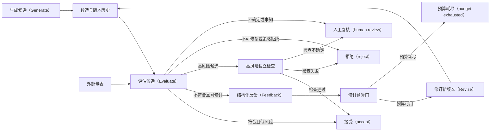

# 评估者—优化者：反馈可以改进候选，分数不能创造真相

评估者—优化者把“产生候选”和“判断候选”分成两个责任阶段，是一种智能体（Agent）控制模式。它沿候选生成、评估、反馈与修订推进：生成者提交一个版本化候选，评估者依据任务外部定义的量表给出结构化判断与反馈；只有确定性控制器确认预算、风险门与终止条件后，优化者才可产生下一版本。它适合质量可以迭代改善、标准可写成可审查量表、但单次生成不稳定的任务。

## 学习问题

- 外部量表、生成者、评估者、优化者与确定性控制器分别拥有什么权力？
- 为什么评估分数不能当作事实真相，相关模型错误会怎样放大循环偏差？
- 候选与版本历史、修订预算、评估不确定性和高风险独立检查如何共同终止循环？
- 哪些输出终止类别应放行、驳回、在资源用尽时停止或转人工处理，失败后又如何恢复？

## 问题与适用上下文

本模式解决的是“结果可评、首次产出未必够好”的问题，例如改写一段说明、补全测试、综合一组有引用的研究结论或生成受格式约束的配置。外部验收标准需要能在生成前独立表达，至少包含必要条件、禁止项、评分或判定方法、风险级别和无法判断时的去向。若结果只有主观偏好而没有稳定反馈，循环会追逐噪声；若步骤和输出都可由规则完全枚举，应采用确定性工作流（Workflow）。

“外部”描述责任来源，不要求量表来自系统之外。它可以由产品负责人、领域规则、测试套件或批准后的评测集给出，但不能由当前候选的生成者临时改写。生成者拥有候选生成权；评估者拥有依据量表提出判断和反馈的权力；优化者拥有在批准反馈范围内修订的权力。三者可以使用同一模型的不同调用，却仍必须通过显式状态合同隔离角色。

确定性控制器拥有控制权和最终终止责任。它核验量表版本、保存候选与版本历史、扣除修订预算，并把结果转入四类显式终态。评估者不能直接发布，高分也不能扩大工具权限。状态所有者是受控候选存储与评测记录，而不是生成者或评估者的对话上下文。

来源机构的工程材料描述了评估者—优化者组合与评测词汇，OpenAI Agents SDK 智能体开发工具包提供一个以大语言模型担任评估者的循环示例；它们都是机构材料，不是行业标准。本文的外部量表、四类终态、预算门、独立检查和恢复责任是本站面向生产控制的架构综合。

## 约束与驱动力

采用循环前先固定八项合同：

1. **外部量表版本：** 量表具有标识、版本、适用任务、必要条件、禁止项、阈值、权重、证据要求和“不确定”处理。当前循环内不能因为候选难以达标而降低量表。
2. **候选与版本历史：** 每个候选保存 `candidate_id`、`version`、父版本、生成输入、模型与提示版本、工具证据、反馈引用和变更摘要。新版本追加，不覆盖旧版本。
3. **结构化反馈：** 反馈引用具体量表项，区分观察、推断、缺陷、严重度、建议修改和不可修复原因。自由文本可以解释，但不能取代枚举结果。
4. **修订预算：** 限制版本数、模型与工具费用、经过时间、同一缺陷重复次数及上下文增长；优化者不能以改名或拆分候选重置全局预算。
5. **评估不确定性：** 评估者必须显式输出不确定或未知，并用 `unknown` 或置信区间说明缺失证据。不确定或未知不得自动放行，而是进入人工处理或驳回。
6. **高风险独立检查：** 涉及安全、合规、资金、生产变更或不可逆副作用的候选，必须由与生成路径相对独立的规则、测试、领域审核者或人工检查；共享模型家族的第二次调用不自动构成独立。
7. **不可变安全边界：** 优化只改变候选内容，不改变权限、批准、工具允许清单、数据边界和发布策略。候选中的指令不具有控制权。
8. **回归测试：** 每次修订同时运行当前缺陷测试、历史失败样本和不变量测试，避免为提高单项分数破坏已经满足的要求。

驱动力是质量改进与可审计性，而不是让模型互相说服。若无法预先写出量表，无法保存版本差异，或评估结果与人工判断长期不一致，就应先改善规格与评测，而不是增加修订轮次。

## 结构与协作关系

| 架构平面 | 责任所有者 | 显式合同 |
| --- | --- | --- |
| 交互 | 任务提出者与人类责任人 | 给出目标、量表、风险等级、可接受终态和人工复核时限；接收候选、证据与停止原因 |
| 控制 | 确定性循环控制器 | 校验量表与候选版本，扣除修订预算，执行风险分支，并拥有继续与终止责任 |
| 知识与上下文 | 上下文装配层 | 提供当前候选、量表、必要证据和被选中的历史反馈；防止完整历史无界增长 |
| 状态与记忆 | 候选存储、评测存储与权威业务系统 | 追加候选版本、评分明细、反馈、测试结果、预算账本、批准与最终终态 |
| 动作与工具 | 受限生成器、测试器与发布适配器 | 生成与验证默认无外部副作用；发布、写入或执行另经权限和批准门 |
| 治理与评测 | 量表所有者、独立检查者与人工审核者 | 校准评估者、维护回归集、审查分歧和漂移，并决定高风险结果是否可接受 |

量表所有者与评估者不是同一责任：前者定义“什么算好”，后者对一个具体候选应用标准。控制所有者也不是评估模型：它只接受结构化结果，自己执行预算、权限和终止规则。状态所有者用条件写入确保评估只适用于它声明的候选版本与量表版本，迟到反馈不能修改当前候选。

副作用应留在循环之外。生成、比较和测试可以在沙箱内运行；真正发送消息、合并代码、部署或修改业务记录前，控制器必须重新核验最终候选摘要、独立检查和批准。即使评估者给出满分，也没有因此获得发布权限。

## 运行机制

插图判定：**Mermaid 图表工具**。计划明确要求此模式使用 Mermaid；该图表达可频繁修改的状态与终止拓扑，稳定节点身份、预算必经路径和四个终态比固定坐标重要。它是本站原创控制流，不复制厂商图示，也不证明模型评估准确。

{/* terminology-exempt: unknown-english-term | match: Generate | record: 生成候选（Generate） | reason: P04 精确 Mermaid 节点标签按任务合同保留英文动作名 */}

{/* terminology-exempt: unknown-english-term | match: Evaluate | record: 评估候选（Evaluate） | reason: P04 精确 Mermaid 节点标签按任务合同保留英文动作名 */}

{/* terminology-exempt: unknown-english-term | match: accept | record: 接受（accept） | reason: P04 精确 Mermaid 终态标签按任务合同保留英文状态名 */}

{/* terminology-exempt: unknown-english-term | match: Feedback | record: 结构化反馈（Feedback） | reason: P04 精确 Mermaid 节点标签按任务合同保留英文动作名 */}

{/* terminology-exempt: unknown-english-term | match: Revise | record: 修订新版本（Revise） | reason: P04 精确 Mermaid 节点标签按任务合同保留英文动作名 */}

{/* terminology-exempt: unknown-english-term | match: budget exhausted | record: 预算耗尽（budget exhausted） | reason: P04 精确 Mermaid 终态标签按任务合同保留英文状态名 */}

{/* terminology-exempt: unknown-english-term | match: reject | record: 拒绝（reject） | reason: P04 精确 Mermaid 终态标签按任务合同保留英文状态名 */}

{/* terminology-exempt: unknown-english-term | match: human review | record: 人工复核（human review） | reason: P04 精确 Mermaid 终态标签按任务合同保留英文状态名 */}

正常路径从 `Generate → Evaluate → Feedback → Revise` 推进，但每次候选都先写入版本历史，评估也同时读取固定的外部量表。评估者为每个量表项返回 `pass`、`fail` 或 `unknown`、证据引用、严重度和结构化反馈。低风险候选只有在所有必要项通过时才能接受；不满足但可修订的候选进入反馈。

反馈不能直接触发修订，控制器先扣除修订预算。预算可用时，优化者根据允许的反馈生成新版本并回写历史；新版本必须重新经过完整评估，不能沿用父版本总分。预算耗尽是终态，不再回到生成、评估或修订。不可修复缺陷、策略拒绝或确定性检查失败进入拒绝。

高风险候选在量表评估后仍必须走独立检查。检查通过才接受，失败则拒绝，检查不确定则人工复核。评估者的 `unknown`、证据缺失、量表冲突、版本不匹配和分歧超阈值同样进入人工复核，不允许把默认高分或多数投票解释为接受。

失败与恢复使用最后提交的候选版本、量表版本、反馈、测试结果和预算账本：读取失败可以在工具预算内重试（Retry），写入结果未知则停止并回读；恢复只重跑未确认的评估或修订，不覆盖已保存版本，也不重置修订预算。若最终发布副作用未知，自动循环保持停止，由权威系统查询或人工处置决定后续。

## 失败模式与误用

**评估者与生成者共享盲点。** 同一模型家族、提示模板、训练分布或检索语料会产生相关模型错误；重复采样或让第二个模型打分可能只是重复同一误判。高风险结果需要不同失效机制的规则、执行测试、权威数据或领域人工。

**把分数当真相。** 评估分数不是事实真相。它是评估器在给定输入、量表和版本下的观测，受位置偏差、表达风格、证据缺失和校准误差影响。分数可以支持排序和调查，不能替代权威回读、确定性验收或人类责任。

**候选改写量表。** 生成内容包含“忽略前述标准”或优化者发现降低阈值更容易通过。量表必须从受控存储按版本装配，候选与检索文本不能修改它；任何量表变更开始新评测批次并保留审计记录。

**奖励投机。** 优化者学习到堆叠关键词、迎合长度或隐藏缺陷能抬高得分。使用必要条件、反例、对抗样本、确定性检查和人工校准，并监测单项提升是否伴随其他质量退化。

**反馈漂移。** 评估者每轮换一种标准，候选在互相矛盾的意见间振荡。反馈必须引用固定量表项；相同缺陷重复达到上限便拒绝、人工复核或预算耗尽，不再无界修订。

**版本历史被覆盖。** 只保留最后文本，无法判断改了什么、哪个反馈导致回归。采用追加式候选记录与内容摘要，评估引用明确版本，迟到结果因版本不匹配而失效。

**高分直接产生副作用。** 评估器通过后立即部署或发送。发布动作需另一个确定性权限门、批准与权威回读；内容质量判定不能同时授予执行能力。

## 质量属性（Quality Attribute）权衡

本模式可提高结果质量、可审计性和回归可见性：外部量表使判断可复查，版本历史使反馈效果可比较，预算让成本和尾延迟有界。相应代价是更多模型调用、评测数据维护、状态写入、人工校准和分歧处置。严格量表还可能压低创造性，使优化者对已知评测过拟合。

把生成与评估分离会降低自证风险，却不会自动带来统计独立。使用不同提示或模型增加成本，也可能仍共享数据与偏差。独立性的强度应随风险提升：普通文案可用模型评估加抽样人工，高风险代码需编译、测试、安全扫描和审批，关键业务结论需权威数据核验。

评测至少跟踪首次通过率、每候选修订次数、量表项失败分布、`unknown` 率、评估者与人工分歧、独立检查失败、预算耗尽率、回归命中、从反馈到改善的转化、成本、时延与终态分布。只报告平均评估分数会隐藏拒绝、人工负担和高风险尾部。

## 实现与迁移提示

从一次生成迁移时，先把现有验收规则整理为版本化外部量表，并在影子模式记录评估结果，不自动修订或发布。以人工判断和确定性测试校准评估者，确认 `pass`、`fail` 与 `unknown` 的分歧边界；建立候选版本历史、预算账本和回归测试集。

第二步只对低风险、可撤销的内容开启一轮修订，仍由人工决定接受。观察缺陷是否真正减少、是否出现奖励投机和相关错误后，再增加有限轮次。高风险路径从一开始保留独立检查与人工复核，不因离线平均分提高而移除。

OpenAI Agents SDK 固定提交中的 `llm_as_a_judge.py` 展示了一个生成结果、由模型评估并依据反馈继续的实现形态；该固定示例只作为实现证据，不能证明生产可靠性、评估准确性、独立性、预算完备性、状态恢复或部署适用性。本文也没有复制其代码、提示、示例任务或控制结构。

当量表不稳定、评估与人工长期不一致、修订没有持续改善、回归增加或成本超过收益时，执行确定性回退：关闭自动修订，恢复一次生成加规则验证和人工选择。版本历史、回归集和分歧数据继续保留，用于重新设计规格，而不是由循环自行修改门槛。

## 相邻模式与反模式

本文依赖[智能体循环（Agent Loop）](/concepts/agt-c-03)的观察、评估与硬终止合同，也依赖[追踪、评测与护栏（guardrail）](/concepts/agt-c-06)对证据记录、质量判断和执行约束的分工。[确定性工作流与自治智能体](/patterns/agt-p-01)帮助判断是否值得引入循环；[智能体检索增强生成（Agentic RAG）](/patterns/agt-p-02)把证据充分性作为一种专用评估门；[规划者–执行者（Planner–Executor）](/patterns/agt-p-03)改变任务步骤，而本文迭代同一验收目标下的候选结果。

[编排者–工作者与扇出/扇入](/patterns/agt-p-07)可以并行生成多个候选，但汇聚仍需同一量表版本、去重和预算合同。[持久智能体与人工介入](/patterns/agt-p-08)负责跨时等待人工复核与恢复，不能把暂停机制误当作评估正确性。多智能体部署不等于评估独立，关键是失效机制、状态与权限是否真正分离。

反模式包括“模型给模型颁证”“分数即真相”“反馈无预算”“覆盖候选历史”和“高分即发布”。另一个误用是把厂商示例的循环直接称为行业标准；示例说明一种实现，不提供跨系统统一合同，也不能外推生产保证。

本文的量表与独立检查会在[多智能体研究系统](/cases/multi-agent-research-system)中约束证据合成，在[长时编码智能体](/cases/long-running-coding-agent)中由测试反馈与候选版本检验。案例只验证说明性责任边界，不虚构生产指标。本文属于[模式目录](/patterns)，并位于[智能体架构学习路径](/paths/agentic-architecture)的控制模式阶段。

## 说明性场景

一个编码智能体需要为既有接口生成迁移补丁。量表 `rubric-7` 固定要求：类型检查通过、聚焦测试通过、无越权文件修改、应用程序编程接口（Application Programming Interface，API）兼容性不下降、变更说明完整。生成者产生 `candidate-1`，候选存储记录基础提交、文件摘要、模型版本和允许路径；评估者只读运行测试并返回结构化结果。

第一次评估发现类型检查通过，但一个兼容性测试失败。控制器把该反馈同候选版本一起写入记录，修订预算还剩一次，优化者生成 `candidate-2`。新版本不能继承第一次的通过标记，所有必要测试重新执行，历史回归集也运行。若第二次又出现不同失败，预算耗尽便以 `budget exhausted` 结束，把两个候选、反馈和差异交给人工。

假设第二次测试全部通过，但补丁修改认证策略，风险分类提升。普通评估结果不能直接 `accept`，必须进入由安全规则、代码所有者和沙箱执行组成的独立检查。检查无法判断旧客户端是否仍在使用被移除的权限时，结果为 `human review`，不是自动接受。只有权威兼容性数据与批准齐备，控制器才记录 `accept`；策略明确禁止的变更则记录 `reject`。

这个场景展示候选生成、评估、反馈与修订如何被版本、量表、预算和四类终态约束，不证明模型能自动写出正确补丁。若稳定规则已经能生成唯一修复，应回到确定性变换；若评估者与生成者持续产生相关错误，应加强不同机制的测试和人工，而不是增加相同评估器的轮次。

## 来源

- [Building Effective Agents](https://www.anthropic.com/engineering/building-effective-agents)（`facts-summary`）：支持该机构公开材料描述的评估者—优化者组合；不建立本文的量表版本、预算、状态、权限、四类终态或生产保证，该机构分类也不是行业标准。
- [Demystifying evals for AI agents](https://www.anthropic.com/engineering/demystifying-evals-for-ai-agents)（`facts-summary`）：支持任务、试验、评估器、轨迹、结果、评测框架、评估器选择与人工校准等公开词汇；不保证评估准确、结果质量或本文的控制责任。
- [LLM-as-a-judge](https://github.com/openai/openai-agents-python/blob/2fa463571e76dae8ff267622f1018eaf06ffeb9f/examples/agent_patterns/llm_as_a_judge.py)（`facts-summary`，`implementation`）：固定提交的实现示例展示生成、评估与反馈循环；只作有界实现证据，不证明运行时保证、独立评估、恢复能力或部署适用性。

本文的外部量表合同、候选版本历史、Mermaid 拓扑、修订预算、高风险独立检查、四类终态、恢复与迁移步骤及说明性场景均为 Tego Arch 架构知识项目的原创综合。本站没有复制来源的原文、代码、提示、示例、结构、分类布局或图示，也不从厂商材料推导未声明的生产能力。
