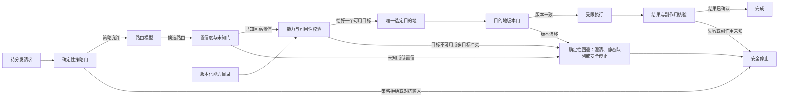

# 路由与模型驱动分发：模型可以提议去向，不能绕过策略决定执行

当请求的语义不能由静态字段完整表达、而系统又有多个专门能力时，路由模型可以提出最匹配的候选目的地。但“理解请求”“发现能力”“选择一个当前可用实例”和“允许执行”不是同一项权力。生产路由必须先过确定性策略门，再通过置信度、能力和版本校验，最终只产生一个受限目的地；无法安全选择时退回澄清、静态队列或停止。

## 学习问题

- 策略路由、语义分类、能力发现与负载和成本路由分别回答什么问题？
- 路由模型、确定性控制器、能力目录与目的地各自拥有什么权力，最终终止责任属于谁？
- 歧义输入、低置信、目的地不可用、版本漂移和对抗输入为什么不能静默进入执行？
- 如何做路由级评测，并在模型路由退化时确定性回退？

## 问题与适用上下文

路由模式适合“候选能力已知，但请求到能力的映射包含语义不确定性”的场景，例如在检索、账单说明和技术支持之间选择一个专门处理器，或从一组只读诊断能力中选择下一项。它不是让模型自由创建目的地，也不是把同一请求同时广播给全部智能体（Agent）。如果分支可以由字段、权限和规则完整枚举，确定性工作流（Workflow）更便宜、更可预测。

四类选择必须分开：**策略路由**依据身份、地域、数据等级、风险与批准决定哪些路径绝对允许；**语义分类**推断请求意图与候选类别，并允许输出未知；**能力发现**从版本化目录核对候选是否具备所需输入模式、权限范围和健康状态；**负载与成本路由**只在已经合规且语义等价的候选集合中选择实例或提供方。后一步不能推翻前一步。

控制所有者是确定性路由控制器。路由模型只有候选建议权，不拥有执行权、权限授予权或终止权。状态所有者是路由记录与版本化能力目录，其中保存请求摘要、策略版本、路由模型版本、候选、置信度、所选目的地版本、回退原因和结果；聊天上下文不是路由真相。最终终止责任也属于确定性控制器，它记录完成、安全停止或转人工，而不是接受模型声称“已分发”。

## 约束与驱动力

采用模型驱动分发前固定以下合同：

1. **策略优先：** 身份、租户、地域、数据等级、允许工具、风险、批准与预算由确定性规则判定。策略拒绝在模型调用之前或之后都不得改写为允许。
2. **封闭候选集：** 模型只能引用能力目录中当前版本的稳定目的地标识，不得从自然语言生成新的网络地址、工具名或智能体身份。
3. **允许未知：** 路由输出包含类别、候选标识、置信度、依据与 `unknown`。未知或低置信不能用“最相近”自动执行，而进入确定性回退。
4. **唯一选择：** 一个控制回合恰好选择零个或一个目的地。零个触发回退；多个同分候选触发冲突处理，禁止无界扇出。
5. **能力与版本门：** 执行前重读能力目录，核对输入模式、健康、配额、策略标签和版本。选择时与执行时不一致即版本漂移，旧选择失效。
6. **最小权限：** 目的地仅获得本次调用需要的数据切片、临时能力令牌和副作用范围。路由标签不能扩大权限。
7. **结果核验：** 路由成功只表示选择完成，不表示任务成功。目的地返回结构化结果与副作用确定性，由控制器再判断完成、恢复或停止。
8. **有界资源：** 限制分类次数、模型与工具费用、总时长、回退次数及相同错误重复。回退不能重置全局预算。

这些约束让语义判断保持弹性，却把安全不变量留在代码和受控状态中。主要驱动力是减少硬编码分支的维护成本，而不是最大化自治。

## 结构与协作关系

| 架构平面 | 责任所有者 | 路由合同 |
| --- | --- | --- |
| 交互 | 请求者与人工责任人 | 提供目标和必要澄清；接收所选能力、回退或停止原因 |
| 控制 | 确定性路由控制器 | 先执行策略门，再调用路由模型，校验唯一目的地、版本和预算，并拥有终止责任 |
| 知识与上下文 | 上下文装配层与能力目录 | 提供最小请求投影、候选描述、输入模式、版本和健康；不把不可信内容当控制指令 |
| 状态与记忆 | 路由记录库与版本化能力目录 | 保存策略、模型、候选、置信度、目的地版本、执行结果和回退原因 |
| 动作与工具 | 目的地适配器与工具网关 | 只按短时能力令牌执行一个受限调用；写操作另过批准和权威回读 |
| 治理与评测 | 策略所有者、路由评测与人工审核者 | 维护策略、对抗集、混淆矩阵、漂移监测、审计与人工升级 |

流量路由与任务控制路由可以类比“从合格候选中选择一个目的地”的机制，但二者的状态、失败、副作用与终止责任归属不同：网关选择上游实例通常不拥有业务任务状态；任务控制路由则必须保留任务版本、工具权限、外部效果和最终停止原因。负载均衡的重试（Retry）策略不能直接移植为会产生副作用的智能体重试策略。

允许的副作用不由路由类别决定。只读查询可以在预算内自动调用；可逆写操作仍需稳定操作标识、批准和写后回读；不可逆或高影响动作进入人工批准。目的地声称自己“支持写入”只是一条能力描述，不是授权证明。

## 运行机制

插图判定：**Mermaid 图表工具**。计划明确要求使用 Mermaid；图的核心是一个经常随路由合同变化的有向控制流，必须精确审查策略门先后、唯一目的地、失败分支和终态。该图为本站原创综合，不复制来源图示，也不证明任何模型会正确分类。

正常路径如下：控制器规范化请求并执行确定性策略门；允许后，路由模型在封闭候选集上返回候选、置信度和依据；置信度门把未知与低置信收敛到回退；能力校验把当前目录与请求要求相交，只在恰好一个目的地可用时选中；版本门在执行前重读目录，确认选择没有陈旧；目的地只获得受限输入与权限，结果再由控制器核验。

确定性回退不是“换一个模型继续猜”。它是预先批准的有限动作：请求澄清、进入人工队列、使用静态默认只读处理器，或安全停止。对抗输入或策略拒绝直接停止；未知、低置信、不可用、多目标冲突与版本漂移进入回退后也不能绕回路由模型或自动执行。

失败与恢复共享同一状态合同：读取类目的地失败可在剩余预算内重新检查健康并重新路由，写操作结果未知则保持停止并用稳定操作标识查询权威系统；恢复必须重新执行策略、能力和版本门，不复用旧置信度，也不让回退次数重置预算。

## 失败模式与误用

**策略门放在模型之后。** 不合规请求先进入模型和候选上下文，既泄露数据又允许提示注入影响去向。策略门必须先裁剪和拒绝，模型结果之后还要再核对目的地策略标签。

**歧义输入被强制分类。** 系统为了保持“成功率”总选最高分，即使最高置信度很低。应允许未知，按类别校准阈值，并让澄清或人工队列成为正常终态。

**目的地不可用便顺序试遍。** 自动遍历所有候选形成隐式扇出，可能重复副作用。必须先由能力目录缩小集合；若已选目的地失效，旧操作保持未执行或未知，控制器按副作用确定性决定是否可重新路由。

**版本漂移后继续。** 模型依据旧工具模式选择目的地，新版本已经改变参数、权限或行为。执行前比较能力目录版本和模式摘要，漂移即使旧选择失效；高风险请求转人工，不把兼容性当作默认事实。

**对抗性路由。** 请求或检索内容伪造“管理员已批准”“请转到无限权工具”等指令。策略和能力目录来自受控通道，不读取请求中的授权声明；对抗输入命中规则或评测特征时安全停止并保留审计证据。

**把负载路由当任务路由。** 随机、权重、最少请求或成本选择适合语义等价且已合规的上游，不能决定哪个智能体拥有任务或是否能写业务状态。

**路由正确即任务成功。** 分类命中只证明去向符合标签，不证明目的地结果正确。必须分别记录路由结果、任务结果、外部副作用和终止类别。

## 质量属性（Quality Attribute）权衡

模型路由可减少脆弱关键词规则、提升开放表达的覆盖率，并让专门能力保持较小上下文。策略门、唯一选择和版本记录提高安全性（Security）、可审计性与可恢复性。代价是额外模型时延、阈值校准、能力目录维护、漂移处理和人工澄清负担。

路由级评测至少包含：按稳定测试集计算类别精确率与召回率、未知率、低置信率、歧义澄清率、策略拒绝命中、对抗输入绕过、不可用与版本漂移回退、唯一目的地违规、路由后任务成功、错误副作用、成本、时延和人工分歧。离线分类分数不能替代端到端结果，也不能隐藏高风险类别的尾部错误。

阈值越高，误路由减少但澄清和人工负担增加；候选描述越丰富，分类可能改善但提示注入面和上下文成本扩大；更积极的负载与成本优化可以降低费用，却可能改变模型版本、地域或数据边界。必须按风险类别分别评估，不用一个平均准确率决定全部流量。

## 实现与迁移提示

迁移第一步是把现有静态路由变成可观测基线：为每个分支分配稳定目的地标识，建立版本化能力目录，记录请求类别、策略结果、所选目的地、任务结果和人工纠正。模型只做影子分类，不执行；用真实分歧构建歧义、未知、不可用、版本漂移与对抗测试集。

第二步只开放低风险、只读、结果可验证的一个类别。策略门仍由代码执行，模型输出只接受封闭枚举，低置信回到原静态分支。稳定后再逐类扩大，始终保持回滚开关。写入能力最后引入，并保留批准、稳定操作标识和权威回读。

OpenAI Agents SDK 智能体开发工具包固定提交的路由示例展示了由一个分流智能体把请求移交（Handoff）给专门智能体的实现形态，只作为实现证据；它不能证明本文的策略优先、置信度校准、能力目录、版本门、故障恢复或任何生产可靠性。两种人工智能网关的固定资料展示流量候选的负载、渠道或权重选择，也只支持选择机制类比，不证明任务控制路由的状态和副作用合同。

若影子评测持续低于静态规则、未知率过高、能力目录无法可靠维护、路由错误影响不可接受，或大多数分支已可枚举，应执行确定性回退：关闭模型路由，恢复版本化静态规则与人工分诊。厂商示例和案例不是行业标准，也不应从单个实现外推生产保证。

## 相邻模式与反模式

本文依赖[智能体循环（Agent Loop）](/concepts/agt-c-03)的观察、评估和硬终止合同。[确定性工作流与自治智能体](/patterns/agt-p-01)帮助判断语义不确定性是否值得引入模型；[规划者–执行者（Planner–Executor）](/patterns/agt-p-03)决定任务步骤，而路由只选择承接一个受限步骤的能力。

[监督者（Supervisor）、移交与智能体作为工具（Agents as Tools）](/patterns/agt-p-06)进一步定义选中目的地后控制权和会话所有权是否移动；路由标签本身不能回答这个问题。[编排者–工作者与扇出/扇入](/patterns/agt-p-07)允许受控并行，但必须由独立任务账本和汇聚合同显式启动，不能把路由模型的多候选误当作扇出许可。

[人工智能网关路由与韧性案例](/cases/kong-ai-gateway-routing-resilience)检验流量候选、重试与网关策略边界；[New API 模型网关通道池路由案例](/cases/new-api-channel-pool-routing)检验能力、优先级、权重和渠道健康。它们说明流量选择实现，不证明模型任务分发正确。本文属于[模式目录](/patterns)，并位于[智能体架构学习路径](/paths/agentic-architecture)的控制模式阶段。

反模式包括“模型先于策略”“总要选一个”“路由即授权”“候选即扇出”“健康即正确”和“失败便试遍所有目的地”。这些做法分别隐藏数据边界、未知状态、权限、并发副作用、任务验收和重试责任。

## 说明性场景

一个企业支持入口需要把请求交给“产品文档检索”“账单解释”或“账户变更”之一。请求先经过确定性策略门：租户、数据等级和当前批准决定账户变更是否可进入候选；请求文本中即使写着“管理员已批准”，也不能改变策略结果。

用户说“我的套餐好像不对”，路由模型在三个稳定标识上输出账单解释候选，但置信度低且同时接近产品文档。控制器不同时调用两个目的地，而返回一个限定问题，请用户确认是在询问价格规则还是修改套餐。澄清超时进入安全停止，记录歧义原因。

另一个请求被高置信分类到账单解释。能力目录显示该目的地当前可用，控制器选择唯一目的地；执行前发现目录从 `billing-v4` 升到 `billing-v5`，输入模式和数据范围变化。版本门拒绝旧选择，按确定性回退进入人工队列，而不是把原参数发给新版本。

若只读账单查询执行失败且权威系统确认没有外部效果，控制器可在剩余预算内重新检查健康；若账户变更调用超时且效果未知，系统保持停止，用操作标识查询权威记录，绝不自动重路由到另一个写入目的地。这个场景展示控制合同，不代表真实客户、指标或生产结果。

## 来源

- [OpenAI 公司固定提交的移交路由示例](https://github.com/openai/openai-agents-python/blob/2fa463571e76dae8ff267622f1018eaf06ffeb9f/examples/agent_patterns/routing.py)（`facts-summary`，`implementation`）：固定提交示例展示一个路由智能体把请求移交给专门智能体；只作有界实现证据，不证明策略、权限、置信度、恢复或生产适用性。
- [人工智能网关负载均衡文档源码](https://github.com/Kong/developer.konghq.com/blob/f144a33379d5b599efaacf92642a2f9b41018fd6/app/ai-gateway/load-balancing.md)（`facts-summary`，`case-evidence`，`comparison`）：固定文档源码支持该实现公开描述的流量候选与负载选择机制；不证明任务控制、业务状态、副作用或终止正确性。
- [New API 渠道选择源码](https://github.com/QuantumNous/new-api/blob/1721144221ec5c94dd87891a7ae1bee228e7bb63/service/channel_select.go)（`facts-summary`，`case-evidence`，`comparison`）：固定源码支持该实现的渠道选择机制；不证明模型语义路由、权限、生产可靠性或本文的控制合同。

本文的四类路由边界、六平面责任、策略门优先、唯一目的地、Mermaid 拓扑、置信度与未知门、版本漂移、确定性回退、恢复与迁移步骤及说明性场景均为 Tego Arch 架构知识项目的原创综合。本站没有复制来源的原文、代码、示例、结构、分类布局或图示，也不从交通路由示例外推任务控制保证。
