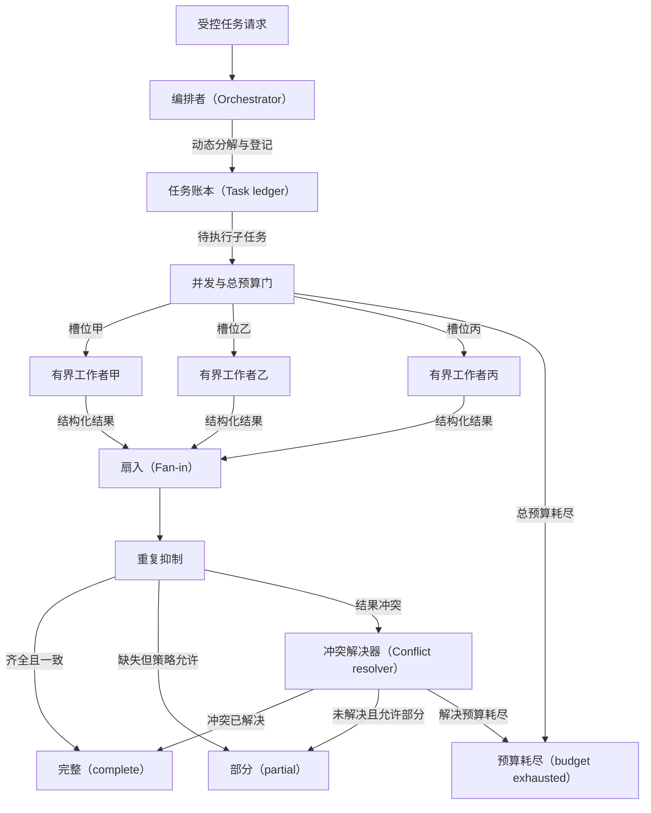

# 编排者–工作者与扇出/扇入：并行不是无界广播

当一个请求只能在运行时才知道要拆成哪些子任务，而且子任务可以独立推进时，编排者–工作者模式让一个控制所有者动态分解、受控扇出，再把结构化结果扇入并解决冲突。模式的价值不在“同时调用多个智能体（Agent）”，而在于让分解、调度、状态、资源、汇聚和停止都有可审计合同。

## 学习问题

- 动态任务分解与预先写死的静态并行有什么根本差异，何时不该引入编排者？
- 编排者、任务账本、工作者、扇入器与冲突解决器分别拥有什么权力？
- 稳定任务标识、并发预算、隔离工作者上下文、重复抑制和部分结果策略如何组成运行合同？
- 取消、超时、重复结果、相互矛盾的结果与未知副作用如何终止和恢复？

## 问题与适用上下文

本模式解决的是**运行时才暴露任务结构**的问题。编排者根据当前请求、策略和观察动态决定子任务数量、边界与依赖；工作者只处理被分配的有界子任务；扇入阶段按稳定任务标识核对覆盖度、去重、验证并合成。研究问题可能在阅读首批证据后出现新的独立检索方向，代码库分析可能先识别组件再生成不同检查项，这些都是动态分解的候选。

动态任务分解不等于静态并行。若步骤、数量和依赖在部署前已经确定，例如同时读取三个固定数据源或并行运行已知测试套件，使用确定性工作流（Workflow）、固定并发池和普通聚合器更便宜、更容易预测。只有当运行时语义判断确实改变子任务集合，且并行收益高于分解与汇聚成本时，才需要模型参与编排。

编排者拥有全局控制权：产生有界子任务、登记任务、核发并发槽位、传播取消并决定何时扇入。它不拥有事实真相，也不能仅凭工作者自报便发布结果。状态所有者是持久任务账本与结果存储，而不是编排者的对话上下文。任务账本保存稳定任务标识、父任务、输入摘要、依赖、状态、尝试、租约、预算、权限、结果摘要和终态。工作者只能提交结构化候选结果，扇入器核对齐备性，冲突解决器按预定规则提出决议，最终终止责任仍属于确定性控制器。

{/* terminology-exempt: unknown-english-term | reason: 审查要求读者可见正文明确保留 Anthropic 正式机构身份 */}

Anthropic 公司的官方工程材料分别描述了并行化与编排者–工作者：前者适合可独立拆开的已知子任务，后者由中央模型动态拆分任务并综合结果；这只是该公司的模式描述，不是行业标准。本文的任务账本、并发门、三类终态、取消与副作用恢复是面向生产控制的原创架构综合。

## 约束与驱动力

采用扇出前固定以下合同：

1. **稳定任务标识：** 每个子任务使用由运行标识、规范化意图、输入版本和分解版本导出的 `task_id`。重试（Retry）沿用同一逻辑标识并增加尝试号；重新表述不能获得新身份来绕过预算。
2. **有界分解：** 限制最大子任务数、分解深度、每层新增任务数和允许的依赖形态。工作者不得自行递归创建未登记的工作者；新发现只能作为提案返回编排者。
3. **并发预算：** 同时限制活动槽位、模型和工具费用、令牌、经过时间、重试次数及总工作量。并发预算控制瞬时压力，总预算控制整个运行；释放槽位不会返还已经消耗的总预算。
4. **隔离工作者上下文：** 工作者只收到目标、最小证据、输入模式、权限、截止时间和返回模式，不默认看到完整会话、其他工作者的草稿或秘密。上下文以任务账本中的版本摘要为准。
5. **结构化结果：** 返回 `task_id`、尝试号、状态、结果、证据、置信说明、错误、外部操作标识和消耗。缺少任务身份或模式不匹配的结果不能进入扇入。
6. **重复抑制：** 接受结果前按任务标识、尝试号与内容摘要去重。重复投递不重复计入覆盖度，也不能重复触发发布、写入或后续任务。
7. **部分结果策略：** 启动前声明哪些子任务必要、最低覆盖、等待截止时间、缺失项的可见标记，以及 `partial` 能否面向读者发布。不能在失败后临时降低完整标准。
8. **冲突解决：** 预先定义权威来源优先级、证据新鲜度、确定性校验、投票适用边界和转人工条件。多数一致不自动证明事实正确。
9. **取消传播：** 父任务取消、预算耗尽或安全拒绝时，控制器停止新派发，撤销队列项，向活动工作者发送取消信号，并等待有限清理期；迟到结果标记为取消后到达，不能重新打开终态。
10. **副作用边界：** 并行工作者默认只读或在隔离环境生成候选。必须写外部系统时，以稳定操作标识、幂等门、批准和权威回读把动作串行化；扇入成功不等于副作用成功。

驱动力是缩短可独立工作的关键路径并扩大探索覆盖，而不是最大化工作者数量。若子任务共享大量可变状态、频繁互相等待、需要同一写锁，或结果无法独立验证，并行只会把协调成本与冲突放大。

## 结构与协作关系

| 架构平面 | 责任所有者 | 显式合同 |
| --- | --- | --- |
| 交互 | 请求者与人类责任人 | 声明目标、最低完整度、截止时间、风险和允许的部分终态；接收结果、缺口和停止原因 |
| 控制 | 确定性运行控制器与编排者 | 控制器执行预算、权限和终止；编排者只能在边界内提议分解与调度 |
| 知识与上下文 | 上下文装配层 | 按子任务提供最小输入与证据版本，隔离其他工作者草稿和不必要秘密 |
| 状态与记忆 | 任务账本、结果存储与权威业务系统 | 保存任务图、租约、尝试、消耗、结果、取消、冲突决议与最终状态 |
| 动作与工具 | 沙箱工作者与受控工具适配器 | 并发读取或生成候选；外部写入另经幂等、批准和回读门 |
| 治理与评测 | 策略所有者、质量评估者与操作员 | 限制扇出，审查冲突与部分发布，评测覆盖、重复、成本、尾延迟和错误副作用 |

控制与状态必须分离。编排者可以读取任务账本的投影并提出下一批子任务，却不能把聊天记录当作已经提交的状态；工作者的“已完成”只有在结果存储条件写入成功、模式验证通过后才成立。租约过期允许重派，但旧尝试随后到达时由重复抑制拒绝。

副作用责任也不能被扇出稀释。每个外部动作仍要有明确发起者、批准者、操作标识和权威状态。多个工作者需要修改同一对象时，应返回补丁或意图，由单一提交者串行验证与提交；若必须并发写，需使用业务系统提供的并发控制与补偿，而不是依赖自然语言协商。

## 运行机制

插图判定：**Mermaid 图表工具**。既定计划指定它表达动态分解、三个有界工作者、扇入和冲突分支；这些短节点与频繁变化的控制拓扑更需要可审查文本差异，而不是固定坐标。图为本站原创，不复制来源图示。

{/* terminology-exempt: unknown-english-term | match: Orchestrator | record: 编排者（Orchestrator） | reason: P07 精确 Mermaid 节点标签按任务合同保留英文名称 */}

{/* terminology-exempt: unknown-english-term | match: Task ledger | record: 任务账本（Task ledger） | reason: P07 精确 Mermaid 节点标签按任务合同保留英文名称 */}

{/* terminology-exempt: unknown-english-term | match: Fan-in | record: 扇入（Fan-in） | reason: P07 精确 Mermaid 节点标签按任务合同保留英文名称 */}

{/* terminology-exempt: unknown-english-term | match: Conflict resolver | record: 冲突解决器（Conflict resolver） | reason: P07 精确 Mermaid 节点标签按任务合同保留英文名称 */}

{/* terminology-exempt: unknown-english-term | match: complete | record: 完整（complete） | reason: P07 精确 Mermaid 终态标签按任务合同保留英文状态名 */}

{/* terminology-exempt: unknown-english-term | match: partial | record: 部分（partial） | reason: P07 精确 Mermaid 终态标签按任务合同保留英文状态名 */}

{/* terminology-exempt: unknown-english-term | match: budget exhausted | record: 预算耗尽（budget exhausted） | reason: P07 精确 Mermaid 终态标签按任务合同保留英文状态名 */}

正常路径从受控请求进入编排者。编排者先产生候选任务图，确定性控制器校验数量、依赖、权限和预算后，才把带稳定任务标识的记录写入任务账本。并发门最多核发图示的三个槽位；三名有界工作者代表并发上限，不表示生产规模建议，也不表示实际任务一定需要三个工作者。

工作者完成后只把结构化结果交给扇入器。扇入器按任务账本中的必要集合和截止时间建立屏障，重复抑制随后排除重试、重复消息和迟到旧尝试。结果齐全且一致进入 `complete`；必要结果缺失、但启动前的部分结果策略允许发布时进入 `partial`，并明确缺口；预算门或冲突解决预算用尽进入 `budget exhausted`。

冲突结果不由最后到达者覆盖。冲突解决器读取证据来源、版本、新鲜度和确定性验证结果；可以解决时形成带依据的单一结果，不能解决但允许部分发布时保留分歧，否则等待人工或按预算终止。图只画三个公开终态；需要人工处理的运行在本文合同中仍记录为带停止原因的 `partial`，不会伪装为完整。

取消传播与图中同一控制链工作：控制器冻结任务账本、停止新槽位、取消排队与活动任务、等待有限清理，再对已确认结果执行一次扇入。取消后晚到的结果只进入审计，不改变终态。若某工作者外部写入的结果未知，控制器立即停止相关重试与后续扇出，用操作标识查询权威系统；无法判定便保持部分或预算耗尽并转人工。

失败与恢复共用已经提交的任务账本：读取失败可在剩余预算内续租或重派，写入结果未知时不得自动重试；恢复只重建未确认的子任务与扇入屏障，不重置总预算，也不覆盖已经确认的外部状态。

## 失败模式与误用

**把广播当扇出。** 把同一完整请求发给任意数量工作者，没有独立子任务、身份或预算。结果只是昂贵的重复采样。应先登记互相独立且可验收的子任务，再核发有限槽位。

**工作者递归繁殖。** 每个工作者又自由创建子工作者，使数量与深度指数增长。工作者只能返回新任务提案，编排者在同一全局预算和深度上限内批准或拒绝。

**共享完整上下文。** 所有工作者看到全部会话和彼此草稿，造成秘密泄漏、提示注入扩散、相关错误与上下文成本膨胀。按子任务装配最小上下文；共享事实从版本化权威存储读取。

**先到先得。** 首个结果直接完成父任务，迟到结果无法核对必要覆盖。任务账本必须声明必要集合和屏障；低延迟只能在预先批准的部分结果策略下换取完整性。

**重复完成被重复计数。** 租约过期后重派，旧工作者与新工作者都返回，聚合器误以为覆盖两个子任务。按稳定任务标识与尝试号重复抑制，只接受一个被提交结果。

**多数票掩盖冲突。** 多个工作者共享模型、数据或提示时，错误高度相关。数量优势不等于独立证据；冲突解决必须检查来源、版本和可验证事实，高风险分歧转人工。

**取消只改父状态。** 父任务显示已取消，子任务仍调用工具并写外部系统。取消必须传播到队列、租约、工作者和工具适配器；对不能撤销的动作记录操作标识并回读结果。

**失败后重新分解。** 编排者换个说法生成新任务标识，绕过重试和费用上限。恢复沿用运行标识、分解版本和逻辑任务标识；只有输入或已批准计划实质变化才创建新版本。

## 质量属性（Quality Attribute）权衡

适当扇出可以降低独立子任务的墙钟时间、扩大证据覆盖，并用任务账本提高可观测性与恢复能力。相应代价是更多模型与工具调用、排队和扇入开销、尾延迟、状态写放大、冲突处理及更大的攻击与副作用表面。最慢必要子任务决定完整结果时延，因此平均工作者延迟不能代表用户体验。

并发度越高，吞吐未必越好。上游限流、共享索引、锁竞争和上下文装配会让收益递减，并放大突发负载。隔离上下文降低泄漏和成本，却可能移除解决任务所需的跨域信息；解决方式是由编排者显式生成依赖与最小共享事实，不是恢复完整广播。

评测至少记录每运行子任务数和深度、活动并发、队列等待、完整与部分比例、缺失必要项、重复抑制、租约重派、冲突率与解决方式、取消传播时间、预算耗尽、每个终态的成本和尾延迟，以及错误或未知副作用。还应比较静态串行、静态并行和动态编排的同一任务集；只报告某个演示“更快”不能外推生产规模、可靠性或成本优势。

## 实现与迁移提示

迁移从静态串行基线开始：先为现有步骤分配稳定任务标识和结构化结果模式，建立任务账本，并记录耗时、错误、依赖和副作用。随后把已经明确独立、只读且可验证的步骤放入固定并发池；这一阶段仍是静态并行，不需要模型分解。

第二步让编排者在影子模式提出动态子任务，但不执行。比较它与人工或既有流程的遗漏、重复、依赖错误和预算估计；只有通过任务模式和有界性检查的提案才进入小流量、最多三个工作者的只读执行。先验证任务身份、隔离上下文、重复抑制、部分结果和取消，再扩大任务类型，不因离线覆盖率提高而自动增加并发。

Microsoft 公司固定提交的构件文档把编排器、专业智能体和注册表作为参考架构构件；AWS 命令行智能体编排器（CLI Agent Orchestrator，CAO）的固定说明文件（README）展示监督者（Supervisor）向隔离终端会话中的工作进程（worker）分配工作的实现形态。它们提供架构或实现证据，不证明本文的任务账本、恰好一次处理、冲突正确性、生产可靠性或规模。仓库示例中的工作者数量也不能用来推断生产容量。

若运行时分解长期与固定模板一致、扇入等待抵消并行收益、冲突与人工负担过高、上游不能承受并发，或状态与取消合同无法可靠实现，应执行确定性回退：关闭模型分解，把已经验证的任务图固化为静态并行工作流；更高风险时退回串行执行和人工验收。保留任务账本与结构化结果，它们对确定性实现同样有价值。

## 相邻模式与反模式

本文依赖[智能体循环（Agent Loop）](/concepts/agt-c-03)的观察、评估和硬终止合同，也依赖[上下文、记忆、状态与检查点](/concepts/agt-c-04)对工作者输入、任务账本和恢复点的区分。[确定性工作流与自治智能体](/patterns/agt-p-01)先判断是否需要模型控制，[路由与模型驱动分发](/patterns/agt-p-05)只选择一个目的地；两者都不能把候选集合隐式广播。[规划者–执行者（Planner–Executor）](/patterns/agt-p-03)强调计划版本与单步执行；本模式进一步处理多个动态子任务的并发调度与结果汇聚。

[智能体检索增强生成（Agentic RAG）](/patterns/agt-p-02)可以把独立证据缺口转为子任务，但证据充分性仍由检索合同判断。[评估者—优化者（Evaluator-Optimizer）](/patterns/agt-p-04)可以判断汇聚候选是否符合外部量表，却不能替代任务覆盖、去重与冲突合同。[监督者、移交（Handoff）与智能体作为工具（Agents as Tools）](/patterns/agt-p-06)回答控制权和会话归谁；编排者–工作者通常由编排者保留父任务控制，但工作者仍可被实现为受限工具调用或独立进程。[持久智能体与人工介入](/patterns/agt-p-08)负责跨时等待与恢复，不会自动修复错误分解。

[AWS 命令行智能体编排器案例](/cases/aws-cli-agent-orchestrator)检验工作进程分配、终端隔离、取消与恢复边界；[Microsoft 多智能体参考架构案例](/cases/microsoft-multi-agent-reference-architecture)检验中央编排、注册与治理构件。[多智能体研究系统](/cases/multi-agent-research-system)将在后续案例任务中检验并行检索和证据合成；当前保留该批准路由，不用占位文章冒充已经验证。

反模式包括“广播即分解”“工作者自我复制”“共享全部上下文”“结果最后写入者获胜”“多数票即真相”“父任务取消但子任务继续”和“失败即换标识重来”。这些做法分别破坏资源、隔离、状态、证据、终止和恢复责任。

## 说明性场景

一个研究助手需要回答某项技术选择在安全、可靠性和运维三个维度的边界。编排者读取已批准的输出模式，动态登记 `run-42/security`、`run-42/reliability` 和 `run-42/operations` 三个逻辑子任务；任务账本记录输入来源版本、必要性、只读权限、截止时间和每项费用上限。并发门恰好核发三个槽位，工作者只收到各自维度的最小问题与同一来源截点。

安全工作者因读取超时被重派。旧尝试稍后也返回，扇入器按任务标识和尝试号只接受已经提交的新结果，旧结果进入审计而不增加覆盖度。运维工作者在截止时间前没有可归因证据；部分结果策略规定三个维度均为必要，因此此时不能标记 `complete`。

安全与可靠性工作者对同一机制的故障边界给出冲突结论。冲突解决器先核对二者引用的版本，发现安全工作者使用较新的权威文档，确定性版本规则可以解决冲突；若两份同版本材料仍相互矛盾，系统保留分歧并标记 `partial` 交给人工。若解决冲突时总预算耗尽，则以 `budget exhausted` 结束，不再创建第四名工作者。

若请求者中途取消，控制器停止新派发并向三个工作者传播取消。任何尚未完成的只读调用在有限清理期后终止；迟到结果不重启任务。这个场景只说明运行合同，不代表真实客户、指标或生产吞吐，也不证明三名工作者比一个工作者更好。

## 来源

{/* terminology-exempt: unknown-english-term | reason: 审查要求来源项明确保留 Anthropic 正式机构身份 */}

- Anthropic 公司：[Building Effective Agents](https://www.anthropic.com/engineering/building-effective-agents)（`facts-summary`，`definition`，`method`）：支持该公司公开区分并行化与编排者–工作者模式及其动态分解描述；不建立本文的任务账本、预算、权限、三类终态或生产保证，该分类不是行业标准。
- [Microsoft 多智能体参考架构构件文档](https://github.com/microsoft/multi-agent-reference-architecture/blob/ed3613b54b46b595dd223aaff8772def376a8c37/docs/building-blocks/Building-Blocks.md)（`facts-summary`，`case-evidence`，`comparison`）：固定提交材料支持编排器、专业智能体和注册表的构件边界；不证明运行时行为、结果正确性或本文的汇聚合同。
- [AWS 命令行智能体编排器固定说明文件（README）](https://github.com/awslabs/cli-agent-orchestrator/blob/bae80071a17e001380367c461b32d64bc6b54433/README.md)（`facts-summary`，`case-evidence`，`implementation`）：固定提交说明监督者–工作进程与隔离终端会话的实现形态；只作有界实现证据，不能证明生产规模、可靠性、恰好一次、冲突解决或部署适用性。

本文的动态分解与静态并行边界、稳定任务标识、任务账本、三个有界工作者 Mermaid 拓扑、并发预算、隔离上下文、重复抑制、部分结果、冲突、取消、副作用、终止、恢复、迁移和确定性回退均为 Tego Arch 架构知识项目的原创综合。本站没有复制来源原文、代码、示例、结构、分类布局或图示，也不从厂商示例外推生产规模与结果。
