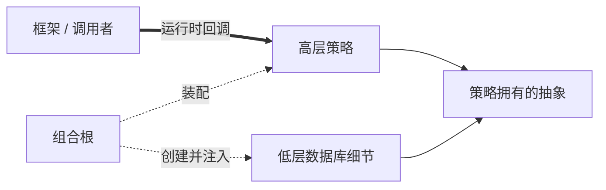

# 依赖倒置、控制反转与依赖注入

依赖倒置（DIP）约束策略与细节的源代码依赖方向；控制反转（IoC）描述运行控制权由应用代码转交框架、容器或调用者；依赖注入（DI）是把依赖提供给对象或模块的装配技术。可从[原则目录](/principles)继续浏览。三者可能一起出现，但不是同义词。

## 学习问题

- DIP、IoC 和 DI 分别约束哪一条关系？
- 为什么使用接口或 DI 容器不等于符合 DIP？
- 没有容器时能否进行依赖注入或控制反转？
- 哪些简单对象适合直接构造而不是抽象和注入？

## 要保护的性质

**来源事实：** Robert C. Martin 的 DIP 论述要求高层政策不依赖低层细节，二者依赖抽象；Fowler 的文章区分 IoC 容器、Dependency Injection 与 Service Locator。**推断：** 评审必须分别画出编译时依赖、运行时调用和对象创建，不能看到构造器注入就推定业务政策已经摆脱基础设施细节。

要保护的是策略独立性：核心规则可以在不理解数据库 SDK、网络客户端或框架生命周期的情况下表达和验证。IoC 与 DI 可以帮助实现这一点，却也可能只改变控制和装配而没有改变依赖方向。

## 冲突与适用上下文

抽象能隔离高波动细节，却引入接口命名、装配和导航成本。对稳定、无副作用、没有替换需求的值对象或标准库，直接构造通常更清楚。若为每个类都创建只有一个实现的接口和容器绑定，系统只是增加间接层，并未保护真实变化。

框架回调能统一生命周期和扩展点，却让应用受框架控制协议约束。DI 容器减少手工装配，但隐藏的作用域、反射注册和运行时解析会把错误推迟到启动甚至请求阶段。应根据变化、生命周期和验证需求选择机制。

## 机制

以下 Mermaid 是本站原创三边图。实线表示源代码依赖，粗箭头表示运行控制，虚线表示对象装配；三条边必须分别审查。

**本站分析：** DIP 成立的关键是抽象由策略需求塑造，低层细节实现该抽象；IoC 发生在框架决定何时调用策略；DI 发生在组合根把具体依赖交给策略。手写 `new Policy(new SqlAdapter())` 已是构造器注入，不需要容器；框架调用一个函数是 IoC，也不一定涉及 DI。

## 误用与反原则

最常见反例是“每个类一个接口”：若接口照抄供应商 SDK，核心策略仍使用供应商概念，源代码箭头虽然经过接口，语义依赖并未倒置。另一个误用是服务定位器；业务代码主动向全局容器查询依赖，使真实输入和生命周期隐藏在方法签名之外。

把 DI 容器当作测试能力来源也不可靠。测试所需的是可替换的明确依赖，而不是容器本身。若对象只有纯值依赖且构造稳定，直接构造比注册、扫描和运行时解析更安全，不应为形式一致强行注入。

## 适用尺度

函数可通过参数接收策略；对象可通过构造器接收协作者；模块可由组合根连接端口与适配器；服务可让领域政策不依赖传输和持久化 SDK。规模越大，越要明确抽象所有者和生命周期，避免中央容器成为隐式全局状态。

插件平台和框架天然使用 IoC，但扩展协议应保持最小且版本化。小型脚本或一次性迁移工具若没有长期替换点，可以直接依赖具体库，并在边界处限制影响，而不是构造完整容器体系。

## 相邻原则

[信息隐藏与封装](/principles/pr-01)决定哪些低层决策不应泄漏给策略；[组合优于继承](/principles/pr-05)说明 DI 常用的对象组合为何能让策略独立替换；[Fail Fast、Fail Safe 与 Graceful Degradation](/principles/pr-07)把故障策略放在拥有正确控制权的边界；[为演化设计](/principles/pr-08)利用依赖方向在迁移期间替换政策与实现。DIP 约束依赖方向，组合承担运行时组装，故障与演化原则再约束边界如何响应失败和变化，四者不能互相替代。

## 说明性场景

说明性场景：账单政策需要保存结果。方案 A 在政策类中直接调用云数据库 SDK；方案 B 由政策定义 `InvoiceStore.save(invoice)`，基础设施适配器实现它，组合根显式构造二者。

选择 B 的依据不是“方便 mock”，而是账单政策和数据库供应商具有不同变化原因。应用启动器控制对象创建（DI），Web 框架控制何时调用处理器（IoC），数据库适配器依赖政策抽象（DIP）。若工具只是一次性导入固定数据库，方案 A 可能更简单。[OpenAI Agents SDK 案例](/cases/openai-agents-sdk)可继续检查框架回调、扩展点和应用政策之间的控制边界。

## 来源

DIP 的政策—细节依赖方向依据 [Robert C. Martin 的 Dependency Inversion Principle](https://web.archive.org/web/20110714224327/http://www.objectmentor.com/resources/articles/dip.pdf)；IoC、DI 与 Service Locator 的术语边界用 [Martin Fowler 的文章](https://martinfowler.com/articles/injection.html)交叉核验。本文不复用原图、代码或章节结构，三边图与场景均为本站原创。
