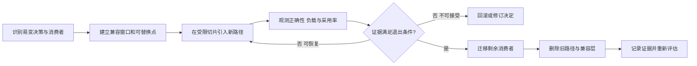

# 为演化设计

演化设计保护的是通过有证据、有边界、可回退的步骤改变系统的能力，而不是预先造出一个能容纳所有未来的通用框架。它把易变决策、受影响消费者、兼容窗口、迁移信号和旧路径退出条件放在同一闭环中。可从[原则目录](/principles)继续浏览。

## 学习问题

- 哪些变化需要兼容窗口，窗口保护哪些生产者和消费者？
- 可替换点怎样对应一个已识别的易变决策？
- 旧、新路径的遥测必须分别回答哪些问题？
- 何时可以删除旧路径与临时兼容层？

## 要保护的性质

**来源事实：** [Parallel Change](https://martinfowler.com/bliki/ParallelChange.html)把并行变更描述为 expand、migrate、contract 三个阶段，使消费者可在兼容窗口内迁移；[Google AIP-180](https://google.aip.dev/180)在其适用的 API 上下文中把向后兼容区分为源代码、线协议和语义行为。**推断：** 演化能力来自明确的消费者、短期双路径、可区分的证据与最终收缩，而不是来自组件数量或抽象层数。

兼容窗口保护正在迁移的生产者与消费者，但会带来双路径一致性、测试、发布和认知成本。expand/migrate/contract 创建的是临时兼容窗口，不是永久双支持；窗口从建立时就需要所有者、预算和可测量退出条件。

## 冲突与适用上下文

直接替换可以减少临时机制，却把发布、数据和消费者协调集中到一次不可逆事件；并行迁移降低单次风险，却增加兼容层携带成本。选择取决于消费者数量、独立发布能力、状态迁移、回滚可行性和错误影响，而不是“渐进”天然优于所有其他方案。

[Building Evolutionary Architectures 第二版资料](https://www.oreilly.com/library/view/building-evolutionary-architectures/9781492097532/)提供持续变化与适应度治理的背景；[Martin Fowler 关于计划式与演化式设计的文章](https://martinfowler.com/articles/designDead.html)提供其历史语境。两者不证明架构会自行涌现：团队仍要识别易变决策、设计迁移边界并验证结果。

## 机制

以下 Mermaid 是本站原创迁移闭环。它从明确变化所有者开始，以删除旧路径和重新评估结束；如果无法回滚，也必须在扩大切片前修订决定。

可替换接缝必须围绕一个已识别的易变决策，例如分片路由规则、协议编码或定价政策；没有易变点的间接层只是额外导航。先在受限租户、cell、流量比例或消费者集合中引入新路径，再用遥测分别辨识旧、新路径的正确性、负载和采用率，不能只看聚合成功率。

旧路径删除需要明确所有者和可测量退出条件，例如“所有已登记消费者连续两个发布周期不再调用旧版本，旧路径错误预算未被占用，回滚材料已归档”。达标后迁移剩余消费者、删除兼容层并记录证据；未达标则扩展观测、修订决定或回滚，而不是把临时双路径留成永久架构。

**本站分析：** 兼容性、切片和遥测组成一个控制回路：兼容窗口降低协调风险，切片限制错误半径，分路径信号支持扩大或回退，退出条件偿还兼容成本。任一环缺失，所谓“渐进迁移”都可能退化为无法判断完成度的长期并存。

## 误用与反原则

微服务、插件、功能开关和间接层不会自动产生可演化性。若没有已识别的易变决策、消费者清单、分路径证据与删除责任，它们只是增加部署、版本或认知成本。为假想未来构造通用扩展框架，也不应被称为演化设计。

兼容不等于永久支持每一种历史行为；在适用的 API 上下文中，应分别检查源代码、线协议和语义行为，并明确哪些消费者处于窗口内。一次性切换全部生产者、消费者和数据的“大爆炸替换”不是渐进迁移，即使事后保留了一个回滚开关。

## 适用尺度

模块尺度可通过函数或接口接缝替换算法；进程尺度可并行读取旧、新数据模型；服务尺度要管理协议、线格式、语义和独立发布消费者；平台尺度还要控制多租户切片、版本窗口和团队所有权。尺度越大，兼容成本、观测要求与退出授权越高。

封闭系统中若生产者与消费者可原子发布、无持久状态且回滚简单，短暂维护双路径可能不适用；直接替换可以更清楚。跨团队 API、长生命周期数据或不可协调客户端则通常需要显式窗口，不能假设一次发布覆盖全部消费者。

## 相邻原则

[信息隐藏与封装](/principles/pr-01)把易变决策留在明确所有者后面；[依赖倒置、控制反转与依赖注入](/principles/pr-04)让政策与细节的依赖方向支持迁移期间替换实现；[组合优于继承](/principles/pr-05)提供可替换的组合接缝；[KISS、YAGNI 与 DRY 的张力](/principles/pr-06)限制无证据的预建扩展点。[幂等与最小协调](/principles/pr-10)要求兼容迁移与重试保持稳定操作身份和显式 unknown 结果；[Open/Closed 与 Interface Segregation](/principles/pr-12)要求扩展点具备当前变化证据、兼容窗口与退役路径。[ADR 生命周期](/methods/mth-03)记录决定的复核与替代，[架构适应度函数](/methods/mth-04)把正确性、负载、采用率与退出条件变成持续证据。

[Conway 定律与团队边界](/principles/pr-15)覆盖组织迁移如何改变责任与交付边界。

[分类边界与纠错](/principles/pr-17)防止迁移模式被误归类为原则。

## 说明性场景

在 [AWS Cell Architecture + Shuffle Sharding 案例](/cases/aws-cell-shuffle-sharding)中，团队准备替换租户到 cell 的路由规则。旧、新规则先封装在同一明确接缝后，仅对一小组可回退租户启用新路径；遥测按规则版本分别记录路由正确性、各 cell 负载、回退率和租户采用率。

当已登记租户全部迁移、分布约束连续满足约定窗口且旧规则调用量归零后，路由所有者删除旧路径与兼容配置，并在 ADR 中记录替代证据。若新规则造成热点或跨 cell 误路由，就回退该切片并修订决定，而不是继续扩大流量。这是渐进迁移，不是一次性替换整个路由平面。

## 来源

并行变更的 expand/migrate/contract 机制依据 [Danilo Sato 的 Parallel Change](https://martinfowler.com/bliki/ParallelChange.html)；适用 API 上下文中的源代码、线协议与语义兼容依据 [Google AIP-180](https://google.aip.dev/180)；演化式架构与持续治理背景参考 [Building Evolutionary Architectures 第二版](https://www.oreilly.com/library/view/building-evolutionary-architectures/9781492097532/)；计划式与演化式设计的历史讨论参考 [Is Design Dead?](https://martinfowler.com/articles/designDead.html)。本文只做事实摘要，不复用来源的图、示例或书籍结构；迁移图、场景和中文论证均为原创。
