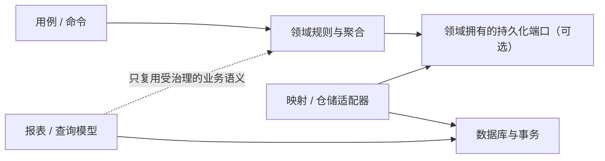

# 持久化无知

持久化无知让领域决策独立于持久化机制，而不是假装数据库不存在。它要求团队说明哪些规则属于领域、哪些事实必须为事务或查询显式让路。可从[原则目录](/principles)继续浏览。

## 学习问题

- 领域决策应与哪些映射和存储机制保持独立？
- 聚合边界与事务边界何时一致，何时需要显式协调？
- 身份、延迟加载、并发、批处理与查询形状泄漏到领域模型时应如何判断？
- 何时持久化感知优化比继续维持纯粹抽象更诚实？

## 要保护的性质

**来源事实：** 吉米·尼尔松的领域驱动设计（Domain-Driven Design，DDD）实践材料把持久化无知放在领域模型与持久化方案的分离语境中；微软的 DDD 指南也把领域模型与基础设施持久化层分开，并讨论仓储、聚合与事务。**推断：** 持久化无知要保护的是领域决策独立于持久化机制，使定价、资格、状态转换等规则不由对象关系映射应用程序编程接口（Application Programming Interface，API）、表结构或供应商查询语言塑形。这项原则不等于忽略存储行为。

被保护的独立性有边界。唯一性、并发冲突、原子提交和容量限制可能影响业务结果，不能因为数据库属于基础设施就从领域语言中删掉。应隐藏偶然机制，保留会改变决策结果的事实。

## 冲突与适用上下文

对象模型越少理解存储细节，规则越容易单独推理；但映射层可能承担额外转换、跟踪和查询成本。身份、延迟加载、并发、批处理与查询形状都可能泄漏：有的只是适配器细节，有的却直接改变一致性、延迟或资源预算。

**本站分析：** 对结算报表采用一套说明性测量协议：团队先在有代表性的工作负载下记录查询次数、第 95 百分位延迟、峰值内存和数据库负载，再与事先约定的服务级别目标和资源阈值比较。只有观察到逐聚合装载造成 `N+1`，且至少一项指标超过阈值时，才选择显式的持久化感知优化，例如专用投影或批量查询；领域写模型继续承载结算不变量。若未超过阈值，则保留简单读取路径。这个协议说明如何用测量证据做决策，不声称本站或上述来源已经测得任何具体结果；采用优化后，投影字段、查询计划、容量回归测试和回退条件都需要具名所有者。

## 机制

先把领域规则、映射/仓储、事务与查询模型分别列出，再用本站原创决策矩阵记录允许泄漏的事实。

| 决策位置 | 责任所有者 | 必须保持独立的领域决策 | 允许显式泄漏的存储事实 | 事务/查询代价 | 选择 |
| --- | --- | --- | --- | --- | --- |
| 订单聚合 | 领域团队 | 可售规则、价格约束、状态转换 | 稳定身份与并发版本 | 单聚合事务；冲突需重试（Retry） | 领域对象保持存储 API 无关 |
| 映射适配器 | 基础设施团队 | 不重新解释业务不变量 | 列名、索引、序列化与对象关系映射跟踪 | 映射维护与批处理调优 | 映射留在领域边界之外 |
| 应用服务 | 应用团队 | 跨聚合流程的政策顺序 | 事务范围、幂等键与提交结果 | 协调或补偿成本 | 显式编排，不伪装单聚合原子性 |
| 报表查询模型 | 数据产品团队 | 指标定义与访问政策 | 联接、索引、分区与投影形状 | 陈旧度、查询计划与回填 | 允许绕过领域写模型 |

领域规则与映射、仓储应分工，但仓储是可选抽象，不是每个模型的必备层。聚合决定事务边界候选，却不保证所有业务流程都能落入一个数据库事务。报表或查询模型不必经过领域模型；它们可以直接投影，只要指标语义、权限和新鲜度仍被治理。

**本站分析：** 图中的端口是否采用仓储取决于替换与测试价值。对象关系映射不是必需机制；直接结构化查询语言、事件日志或文档存储都能在边界清楚时实现同一目标。注解是否可接受也取决于上下文：不改变领域语言且不绑死行为的轻量映射注解，可能比一套重复映射更便宜。

## 误用与反原则

第一种失败模式是把持久化无知解释成“领域代码永远不谈身份和并发”，结果同一订单被静默覆盖。第二种是为了纯粹模型建立通用仓储，屏蔽了分页、批量和查询限制，最终在生产中制造 `N+1`。第三种是把所有读取强迫经过聚合，令报表为无关不变量支付装载成本。

持久化无知不要求对象关系映射，仓储是可选的，也不要求在所有上下文禁止持久化注解。数据库与事务成本仍然存在，不会因为端口命名更漂亮而消失。不采用复杂隔离层的条件包括一次性迁移、存储就是产品契约的分析工具，或实测显示映射成本高于可预见变化风险；此时应把持久化感知范围限制在明确边界。

## 适用尺度

值对象通常最容易完全独立；聚合需要承认身份、版本和原子边界；应用服务负责跨聚合事务或补偿；查询侧可以按消费形状建立独立模型。服务尺度还要加入连接池、锁、分区和恢复目标等运行成本。

小型增删改查系统若领域规则很少，可直接在应用边界使用数据库模型，不必制造领域层。规则密集、存储技术易变或需要离线验证时，独立领域模型的收益更高，但仍须用查询数、延迟、冲突率与映射维护量复核。

## 相邻原则

[单一职责与关注点分离](/principles/pr-03)区分领域政策与持久化责任的变化所有者；[依赖倒置、控制反转与依赖注入](/principles/pr-04)让领域所需端口决定依赖方向，却不决定一定使用仓储；[命令查询分离、命令查询职责分离（Command Query Responsibility Segregation，CQRS）与读写分离](/principles/pr-11)允许读取模型按查询形状分离，而不把持久化关注塞回同一领域模型。[MOD-05 概念、逻辑与物理数据模型](/modeling/mod-05)进一步把领域含义与关系模式、PostgreSQL 数据库实现决定分层；[MOD-06 实体关系模型与关系边界](/modeling/mod-06)说明实体关系语义仍与数据库约束、区间类型等持久化机制保持区分。

## 说明性场景

在 [Temporal 工作流平台补偿事务与持久执行案例](/cases/temporal-saga-durable-execution)中，转账资格、补偿条件和人工决议属于领域政策；工作流（Workflow）历史、活动重试记录和可见性查询属于持久执行机制。领域政策不应调用存储软件开发工具包（Software Development Kit，SDK），但必须承认“结果未知”“已提交”和“补偿不可用”会改变决策。

查询团队可以直接从受治理的历史投影生成对账视图，不必重建每个聚合。若测得投影延迟超过恢复目标，则把检查点、批量与索引作为显式查询责任，而不是污染转账规则。

## 来源

持久化无知的历史与领域模型语境依据 [Applying Domain-Driven Design and Patterns: With Examples in C# and .NET](https://www.informit.com/store/applying-domain-driven-design-and-patterns-with-examples-9780321268204)；领域模型与基础设施持久化分离依据 [Design a DDD-oriented microservice](https://learn.microsoft.com/en-us/dotnet/architecture/microservices/microservice-ddd-cqrs-patterns/ddd-oriented-microservice)；仓储、聚合与事务实现边界用 [Design the infrastructure persistence layer](https://learn.microsoft.com/en-us/dotnet/architecture/microservices/microservice-ddd-cqrs-patterns/infrastructure-persistence-layer-design)交叉核验。本文不复用来源图表、代码或章节结构；矩阵、关系图、测量决策协议与中文论证均为本站原创表达，其中测量协议是说明性分析框架，不代表来源或本站已有实测结果。
