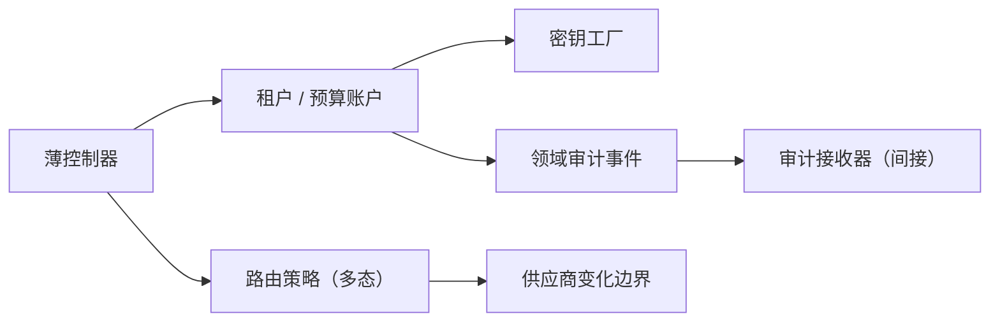

# 通用职责分配软件模式（General Responsibility Assignment Software Patterns，GRASP）

通用职责分配软件模式是一组相互制衡的责任分配启发式，用于回答“谁知道、谁创建、谁协调、谁吸收变化”。它不是把九个名称逐一套进类图的清单。可从[原则目录](/principles)继续浏览。

## 学习问题

- 一项责任应优先交给掌握信息的对象，还是交给更内聚的协作者？
- 创建、协调、变化与基础设施责任如何使用不同证据？
- 两条 GRASP 启发式相互拉扯时，最终所有者如何说明？
- 何时增加间接层能保护变化，何时只是增加导航成本？

## 要保护的性质

**来源事实：** 克雷格·拉尔曼在《应用统一建模语言（Unified Modeling Language，UML）与模式》中以 GRASP 讨论对象设计与责任分配，并把多条模式作为协作判断工具。**推断：** GRASP 应被使用为责任分配决策系统，不是模式名称目录；每项责任都要有候选所有者、冲突启发式和可验证结果。

要保护的是可解释的协作：知道某项政策所需信息在哪里、创建所需数据由谁拥有、用例入口由谁协调，以及变化从哪里被隔离。结果应同时接受内聚、耦合、可测试性和运行责任检验。

## 冲突与适用上下文

启发式会发生冲突或相互拉扯。掌握信息的对象若再承担外部输入输出，可能降低高内聚；为了低耦合新建纯虚构，则增加类型、装配与运行成本。多态能吸收稳定变化，却可能在变化证据不足时提前固定扩展协议；间接也有版本、追踪与故障定位成本。

因此不存在“永远选择信息专家”或“所有入口都交给控制器”的排序。最终责任需要结合变化历史、事务边界、团队所有权和可观察指标。简单、同生命周期的协作不适用额外中介；一次性流程也可由薄应用函数直接协调。

## 机制

九个互相作用的提问依次是信息专家、创建者、控制器、低耦合、高内聚、多态、纯虚构、间接和受保护变化；它们共同覆盖信息、创建、协调、变化与基础设施责任，而不是各自生成一个类。

| 待分配责任 | 候选所有者 | 首要 GRASP 提问 | 拉扯它的其他启发式 | 失败模式 | 最终证据 |
| --- | --- | --- | --- | --- | --- |
| 信息：计算租户剩余额度 | `BudgetAccount`、应用程序编程接口（Application Programming Interface，API）控制器 | 信息专家：谁拥有额度、消费与保留量 | 高内聚要求计算留在账户；控制器只协调 | 控制器读取字段并复制公式，形成上帝对象 | 规则测试只依赖账户状态，公式变化不触及入口 |
| 创建：建立带作用域的虚拟密钥 | `Tenant`、`KeyFactory` | 创建者：谁持有创建所需租户与策略数据 | 低耦合倾向 `Tenant`；纯虚构倾向工厂以隔离密码材料 | 实体直接依赖密钥软件开发工具包（Software Development Kit，SDK），领域与基础设施耦合 | 选择 `KeyFactory` 生成材料、`Tenant` 批准策略；两位所有者的冲突以安全边界解决 |
| 协调：处理“签发并登记密钥”用例 | `KeyIssueController`、`Tenant` | 控制器：谁代表系统事件 | 高内聚要求控制器保持薄；信息专家把规则推回领域 | 控制器变成上帝对象，包揽预算、授权、审计 | 控制器只排序调用和映射结果，政策测试不经超文本传输协议（Hypertext Transfer Protocol，HTTP） |
| 变化：选择供应商路由 | `RoutePolicy`、各供应商客户端 | 多态：谁根据类型承担变化行为 | 受保护变化要求先有变化证据；低耦合限制调用方认知 | 为假想供应商建立空接口，或在控制器堆条件分支 | 三个已上线供应商具有独立回退规则，策略契约有兼容测试 |
| 基础设施：写入审计事件 | 领域对象、`AuditSink` | 纯虚构：是否需要非领域对象保持内聚 | 间接隔离传输协议；信息专家仍拥有事件语义 | 数据对象因持有字段就负责网络发送，误被当作信息专家 | 领域产生语义事件，`AuditSink` 负责传输；失败率与队列积压可观测 |

至少两行存在明确拉扯：密钥创建在创建者与纯虚构之间拆开“批准”和“材料生成”；审计在信息专家与间接之间拆开“事件语义”和“传输”。选择的不是折中命名，而是不同责任的可测试所有权。

**本站分析：** 受保护变化必须由变化证据驱动；只有供应商规则已独立变化，才值得用多态保护。纯虚构和间接解决的是领域对象不该承担的基础设施责任，不是让每次调用都穿过一层代理。

## 误用与反原则

控制器不是上帝对象。它代表系统事件并协调用例，不拥有所有业务判断。信息专家不是数据持有者，也不等于数据对象：拥有字段但不了解政策、权限或生命周期的数据传输对象，不会因此成为正确责任所有者。

失败模式还包括按九个名称制造九层对象、为单一稳定实现预建多态、让间接隐藏错误，以及用低耦合为跨边界全局状态辩护。不采用额外抽象的条件是责任简单、变化证据不足且现有所有者保持内聚；此时直接协作比模式仪式更清楚。

## 适用尺度

对象尺度用信息专家与创建者放置局部规则和创建；用例尺度用控制器保持入口薄；模块尺度用内聚与耦合评估传播；系统边界用多态、受保护变化与间接隔离已证实的外部变化。

尺度越大，越要加入运行成本：中介队列的延迟、工厂的密钥托管、策略分派的遥测以及跨团队契约版本都需要所有者。GRASP 能帮助说明分配理由，不能替代容量、安全或事务验证。

## 相邻原则

[高内聚与低耦合](/principles/pr-02)提供责任选择后的评价标准；[单一职责与关注点分离](/principles/pr-03)识别变化由哪个责任主体发起；[依赖倒置、控制反转与依赖注入](/principles/pr-04)约束选定责任之间的依赖方向；[开闭原则（Open/Closed Principle）与接口隔离原则（Interface Segregation Principle）](/principles/pr-12)要求扩展协议围绕已有变化且保持消费方内聚。GRASP 决定协作责任放在哪里，这些原则再检验边界是否稳定、必要且可承担。

[康威定律与团队边界](/principles/pr-15)把责任分配规模化到团队层面的分工。

[分类边界与纠错](/principles/pr-17)确立 GRASP 的主类别。

## 说明性场景

在 [大语言模型网关虚拟密钥治理案例](/cases/litellm-virtual-keys-governance)中，租户账户掌握预算与作用域政策，适合作为信息专家；签发入口只做控制器；密钥材料由隔离密码设施的纯虚构创建；供应商路由在已有多供应商差异时用多态与受保护变化管理。

若把所有责任交给 `VirtualKeyManager`，它会同时读数据、计算预算、选路由、发密钥、写审计，短期调用少，长期却让安全、财务与平台变化聚集。拆分后的证据是每项政策有独立测试和所有者，同时入口仍只有一次清晰协调。

## 来源

九项 GRASP 启发式及其对象设计语境依据 [Applying UML and Patterns: An Introduction to Object-Oriented Analysis and Design and Iterative Development, 3rd edition](https://www.pearson.com/en-us/subject-catalog/p/Larman-Applying-UML-and-Patterns-An-Introduction-to-Object-Oriented-Analysis-and-Design-and-Iterative-Development-3rd-Edition/P200000000422/9780131489066)，出版与作者背景用 [Book Applying UML and Patterns](https://www.craiglarman.com/wiki/index.php?title=Book_Applying_UML_and_Patterns)交叉核验。本文不复用原书案例、图表或章节结构；责任矩阵、密钥治理示例、关系图与中文论证均为原创。
