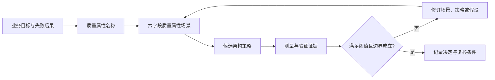

# 质量属性总览

“系统要可靠、快速、易维护”看似完整，实际仍不能决定架构：这些名称没有说明谁在何种运行条件下触发什么，也没有给出可验证的系统行为。质量模型适合建立共同词汇；架构工作还必须把词汇落到业务后果、场景和证据。

[质量属性目录](/quality-attributes)提供各专题入口。本文给出从模型到场景的边界；[架构重要需求（Architecturally Significant Requirement，ASR）](/concepts/fnd-02)解释什么要求足以塑造架构。

## 学习问题

- 质量模型、质量属性场景与架构策略分别回答什么问题？
- 为什么质量属性名称不能直接决定优先级或实现？
- 如何把业务后果转换成可测量的行为边界？
- 多个质量属性冲突时，应保留哪些证据与复核条件？

## 定义与业务目标

**证据事实：** [ISO/IEC 25010:2023](https://www.iso.org/standard/78176.html)提供产品质量模型的命名与索引边界。本文只引用其公开工作页来识别标准与版本，不复制标准中的分类体系，也不把分类顺序解释为业务优先级。

**证据事实：** 卡内基梅隆大学软件工程研究所的 [Quality Attributes](https://www.sei.cmu.edu/library/quality-attributes/)把质量属性与软件架构推理联系起来，并呈现一套 1995 年的历史方法材料。它支持“属性需要结合架构语境讨论”的学习用途，不是当前标准、通用属性全集，也不能证明某项策略已经满足目标。

**本站分析：** 质量属性是对系统表现或演化特性的关注维度；业务目标说明为什么该维度重要。团队应先写清失败后果、责任与约束，再选取属性名称。模型负责提醒和对齐词汇，不能替代上下文中的优先级判断。

## 质量属性场景

属性名称必须进入质量属性场景字段，才会成为可评审输入。这里先说明六个字段的职责；质量属性场景写法专题再给出完整写法。

### 场景来源（Source）

谁或什么产生触发事件，例如用户、外部系统、时钟或设备。它不等于接收该事件的系统。

### 触发刺激（Stimulus）

发生了什么事件、条件或变化。刺激描述事实，不预先塞入团队偏好的实现。

### 运行环境（Environment）

刺激发生时系统处于什么运行条件，例如正常、峰值、降级或恢复中。缺少环境会让同一阈值失去解释。

### 受影响对象（Artifact）

哪个系统、组件、数据或流程受到刺激。对象边界决定状态和行为责任落在哪里。

### 系统响应（Response）

系统观察到刺激后应产生什么行为或状态变化。响应表达结果，不把某个候选策略冒充唯一答案。

### 响应度量（Response Measure）

用什么信号和阈值判断响应是否可接受。度量必须能追溯到业务承诺或风险容忍度。

六字段应嵌入从业务目标到验证证据的完整链。先看本站原创插图中的虚线边界：上方模型只提供属性索引，下方镜头用于补充架构评审关注点，两者都不能替业务场景排列优先级。

*图：质量模型帮助命名关注点；业务后果、场景与证据才决定优先级。*

插图只负责定向，不复刻国际标准的分类表，也不把本站镜头冒充标准内容。本站定义的精确表示如下，它保留从业务目标到验证证据的确定关系和判断门槛。

结论是：模型到策略之间不能跳过场景，策略到接受之间不能跳过证据。场景的六字段写法见[质量属性场景](/quality-attributes/qa-01)；可靠性和性能专题分别继续检查[故障恢复边界](/quality-attributes/qa-02)与[负载和饱和边界](/quality-attributes/qa-03)。

## 架构策略

策略是为了产生场景响应而选择的结构或运行机制，例如隔离、冗余、限流、缓存或可替换模块。相同策略可能改善一个属性却损害另一个属性：重试（Retry）可能提高瞬时故障下的成功率，也可能放大延迟、负载与副作用风险。

**基于证据的推断：** 因为属性目标依赖场景，策略只能相对特定刺激、环境、对象和阈值进行评价。策略名称不是合规证明，也不是跨系统可复制的保证；团队仍需记录状态所有权、失败路径和停止条件。

## 测量信号与阈值

测量信号回答“系统实际发生了什么”，阈值回答“何时足以接受或必须干预”。信号可以包括时延分位数、失败率、恢复时间、数据损失窗口或变更交付时间，但选择必须对应场景中的响应度量。

阈值应追溯到用户承诺、任务损失、法规、预算或已批准的风险容忍度。没有这种依据时，数值只能标记为待验证假设；监控面板上的默认值不能自动升级为架构要求。

## 权衡与失败模式

质量属性之间常有真实代价。更强隔离会增加容量与运维成本，更严格一致性可能增加延迟，更高可修改性可能引入额外边界与理解成本。决策必须说明改善了哪个场景、牺牲了什么、谁接受代价，以及何时复核。

失败模式之一是按模型名称平均分配关注度，因为这会隐藏业务后果差异，导致团队为低影响目标过度设计，却没有保护真正关键的路径。另一个反例是从“需要可靠性”直接跳到多副本：没有刺激、环境、响应和度量，副本可能复制错误状态，也可能增加结果未知与恢复复杂度。不要把该国际标准当作优先级表，不应把 1995 年的软件工程研究所材料当作当前标准，更不可把策略清单当作满足目标的证据。若系统规模很小、变更可独立回退且失败后果有限，不适用完整的属性建模仪式；仍应保留关键边界，但可以采用更轻量的场景与决定记录。

## 相邻质量属性

[质量属性场景写法](/quality-attributes/qa-01)把模型词汇变成六字段场景；[可靠性、可用性与可恢复性](/quality-attributes/qa-02)聚焦故障、失效、恢复与数据边界；[性能、延迟、吞吐与容量](/quality-attributes/qa-03)聚焦工作负载、延迟、吞吐和容量。三者与本页构成“命名边界 → 可测场景 → 专项推理”的相邻图，而不是互相替代的分类表。

[微软多智能体（Agent）参考架构案例](/cases/microsoft-multi-agent-reference-architecture)可用于观察治理、身份、网络与可观测性约束如何同时改变多个质量目标；案例中的机制不能脱离其云平台与版本语境直接照搬。

## 说明性场景

**说明性场景：** 一个订单平台提出“促销期间要高性能且可靠”。团队先记录失败后果：已确认订单不可丢失，支付结果未知必须可核对；再用质量属性场景写法专题的六字段结构描述峰值刺激、运行环境、订单路径、响应和阈值。候选策略随后才进入比较，并以延迟分位数、拒绝量、未知结果数和恢复时间验证。

**本站分析：** 若证据显示扩容降低了排队却放大下游支付过载，团队应修订策略或阈值，而不是宣布“性能已优化”。该场景只演示推理顺序，不代表真实用户、生产经验、通用流量倍数或上游保证。

## 来源

- [ISO/IEC 25010:2023](https://www.iso.org/standard/78176.html)：只用于标准名称、版本和质量模型的索引边界；不复制专有分类内容，不推导业务优先级。
- [SEI — Quality Attributes](https://www.sei.cmu.edu/library/quality-attributes/)：用于质量属性与架构推理的历史定义和学习背景；仅作原创事实摘要，不视为当前标准或效果证明。
