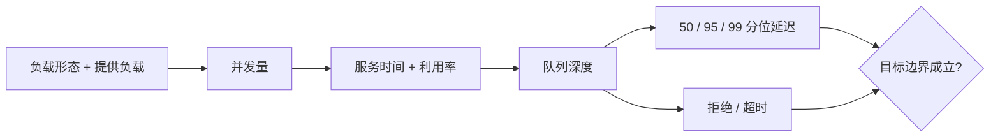

# 性能、延迟、吞吐与容量

平均延迟下降，不代表高峰用户更快；吞吐上升，也可能只是队列持续增长。性能目标必须同时描述工作负载、并发量、服务时间、延迟分布、吞吐、资源利用率和拒绝边界。

本文承接[质量属性（Quality Attribute）目录](/quality-attributes)中的[质量属性总览](/quality-attributes/qa-00)，并与[可靠性、可用性与可恢复性](/quality-attributes/qa-02)连接：当队列、资源或依赖进入饱和，性能问题会转化为超时、拒绝和级联失效。

## 学习问题

- 为什么平均延迟会隐藏尾部，而 `p50`/`p95`/`p99` 应与负载一起读？
- 吞吐 不说明 提供负载 时会遗漏什么？
- 并发量、服务时间、利用率 与 队列深度 如何共同解释饱和？
- 容量 为什么是有边界的运行包络，而不是单次 基准测试 最大值？

## 定义与业务目标

延迟描述一次工作从规定起点到终点经历的时间，服务时间 是资源实际处理该工作的时间，排队时间则来自等待。吞吐 表示单位时间完成量，提供负载 表示进入系统或试图进入系统的负载；两者不同，拒绝或排队时尤其不能混用。

平均（平均）会把少量极慢请求摊平，从而隐藏尾部（尾部）风险。`p50`、`p95`、`p99` 分别说明不同分位位置的观测值，但必须同时声明窗口、请求类型、成功/失败口径和 负载形态。

容量 是在给定资源、数据、依赖、错误率和延迟目标下可持续运行的边界或运行包络，并非一次 基准测试 测得的最大值。业务目标应说明高峰形态、允许排队、允许拒绝和降级顺序。

## 质量属性场景

以下质量属性场景字段是本站原创性能场景。数值仅作说明，实际目标必须由业务需求和测试证据批准。

### 来源（Source）

营销活动调度器与外部客户端共同产生请求负载，容量控制器观测资源和队列。

### 刺激（Stimulus）

十分钟内 提供负载 从每秒 800 个读取请求上升到每秒 2,000 个，并伴随 200 个并发写入。

### 环境（Environment）

正常三副本部署，数据集为当前规划规模，下游库存服务处于已批准配额内，缓存命中率不作为固定前提。

### 对象（Artifact）

商品查询入口、工作队列、应用实例、缓存、数据库连接池与库存依赖。

### 响应（Response）

系统在目标范围内完成工作；接近饱和时限制低优先级请求、保持队列有界，并向调用方明确返回可重试（Retry）或不可重试的拒绝。

### 响应度量（Response Measure）

说明性目标为读取 吞吐 每秒至少 1,800，`p50` 不高于 80 `ms`、`p95` 不高于 180 `ms`、`p99` 不高于 400 `ms`；关键资源 利用率 低于批准上限，队列深度 不持续增长，拒绝 可归因且不超过业务预算。

先看本站原创的说明性模型：请求负载沿并发、服务时间和队列进入容量膝点；到达吞吐平台时，还要同时检查尾延迟与独立的拒绝分支。

*图：容量边界不是平均延迟；平台、`p99`、队列和拒绝必须在同一负载窗口观察。*

图不设定阈值，也不声称过载必然使吞吐崩溃。本站原创信号图继续保留精确因果检查顺序：

结论是：任何单项“更快”指标都不足以界定容量；输入、内部状态和输出必须在同一窗口关联。

## 架构策略

有界队列、准入控制、负载削减、优先级、缓存、批处理、分区和扩容分别改变等待、资源或依赖压力。[站点可靠性工程书籍关于处理过载的章节](https://sre.google/sre-book/handling-overload/)提供有语境的过载、配额和任务保护指导；它不提供通用 `QPS`/`CPU` 公式或供应商的当前政策。

**基于证据的推断：** 扩容只有在瓶颈可并行、状态和依赖配额允许时才增加 容量。若数据库连接池或单分区已饱和，增加调用方实例可能提高 并发量，却只会加深 队列 和尾延迟。

## 测量信号与阈值

[站点可靠性工程书籍关于监控分布式系统的章节](https://sre.google/sre-book/monitoring-distributed-systems/)支持从症状和资源信号区分告警与调试线索。本文据此要求至少同时观察提供负载、完成吞吐、成功与错误、`p50`/`p95`/`p99`、服务时间、并发量、利用率、队列深度、超时和拒绝。

采样与聚合必须保留请求类别和窗口。平均值不能替代分位数，分位数也不能说明被拒绝或根本未进入统计的请求；容量评审还要记录资源配置、数据规模、依赖配额和测试持续时间。

## 权衡与失败模式

更深队列可以吸收短突发，却会增加等待并延迟失败；缓存降低部分 服务时间，却引入一致性、失效和热点风险；更激进的重试可能提高单请求成功机会，却放大 提供负载。容量余量提高韧性，也带来成本。

失败模式是只报告 吞吐，因为没有 提供负载 就无法判断系统是完成了全部请求、拒绝了请求，还是把工作留在持续增长的 队列 中。另一个反例是只看 平均 延迟，它会隐藏 尾部，导致 `p99` 已不可接受时仍宣称性能正常。不要把一次短 基准测试 的最大值称为 容量，不应在依赖配额、数据规模和错误预算未知时外推生产能力，也不可用无限队列掩盖 饱和。对于低频离线任务，交互延迟分位数可能不适用，但仍需用完成期限、积压和资源边界定义性能。

## 相邻质量属性

[质量属性总览](/quality-attributes/qa-00)限定模型与证据边界，[可靠性、可用性与可恢复性](/quality-attributes/qa-02)说明过载如何变成失效和恢复问题，[可扩展性与弹性](/quality-attributes/qa-04)进一步检查增加或释放容量的控制边界。性能策略还会影响成本、一致性和可修改性，不能只以单一延迟指标排序。

[卡夫卡消费者组案例](/cases/apache-kafka-consumer-groups)可用于检查分区、积压和再均衡；[持久对象与运行时案例](/cases/cloudflare-durable-objects-workerd)可用于检查状态位置与请求串行化。案例机制必须回到本系统的工作负载和容量包络验证。

## 说明性场景

**说明性场景：** 若压测观察到 吞吐 稳定在每秒 1,800，但 提供负载 已达到每秒 2,000，队列深度 每分钟增长且 `p99` 超过目标，就不能把 1,800 称为可持续 容量。团队应确认瓶颈、限制准入并持续测试，直到队列在目标窗口内回落且拒绝符合预算。

**本站分析：** 只有当资源配置、数据规模、依赖配额、请求混合和持续时间保持在声明边界内，测试结果才能支持该运行包络。场景与数值为原创说明，不代表来源给出的通用阈值、真实生产基准或效果保证。

## 来源

- [处理过载](https://sre.google/sre-book/handling-overload/)：用于过载、准入、配额与任务保护的事实摘要；不作为通用容量公式。
- [监控分布式系统](https://sre.google/sre-book/monitoring-distributed-systems/)：用于监控与告警方法边界；不规定通用仪表盘或阈值。
- 卡内基梅隆大学软件工程研究所的 [Quality Attributes](https://www.sei.cmu.edu/library/quality-attributes/)：用于质量属性与架构推理的历史定义背景；不视为当前标准或性能保证。

成本效率与可持续性也会约束本页的容量、变化或运行决策，参见[成本效率与可持续性](/quality-attributes/qa-10)。
