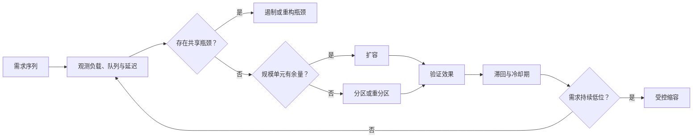

# 可扩展性、弹性与扩缩容

实例数能够自动变化，不代表系统能够随负载扩展。可扩展性来自状态、工作和瓶颈能否被拆分；弹性只是依据观测信号及时改变已存在的容量。

本文位于[质量属性（Quality Attribute）目录](/quality-attributes)，承接[性能、延迟、吞吐与容量](/quality-attributes/qa-03)，把需求、容量、规模单元、控制延迟和重分区放进同一场景。

## 学习问题

- 可扩展性、弹性与容量分别回答什么问题？
- 规模单元为什么必须包含一起增长的依赖？
- 扩容与缩容如何避免抖动（Jitter）和过早回收？
- 何时必须重分区，而不是继续增加无效副本？

## 定义与业务目标

**来源事实：** [微软良好架构的扩缩容与分区指南](https://learn.microsoft.com/en-us/azure/well-architected/performance-efficiency/scale-partition)把规模单元定义为按比例一起扩展的一组资源。它还明确：基础设施副本增加不等于应用能利用副本。

[谷歌云的弹性指南](https://docs.cloud.google.com/architecture/framework/performance-optimization/elasticity)强调按需求动态增减资源以及扩缩动作的时间滞后。

本文把可扩展性定义为在声明的需求范围内通过增加或重组资源维持目标的能力；弹性是按需求变化及时取得和释放容量；容量是特定资源、数据、依赖与目标下的运行边界。本站分析认为，规模单元应覆盖共同增长的计算、队列、连接、存储和配额，否则“增加一个实例”只是局部动作。

业务目标要同时说明需求序列、允许等待、成本预算、扩缩完成时间、分区迁移风险和降级顺序。弹性既不会创造架构上的可扩展性，也不保证吞吐随资源线性增长。

## 质量属性场景

以下需求序列与容量表是本站原创说明，不是供应商阈值或生产基准。各质量属性场景字段如下。

| 窗口 | 需求形态 | 当前规模单元 | 需要验证的容量边界 |
| --- | --- | --- | --- |
| 基线 | 稳定基线 | 2 组 | 队列可回落、依赖有余量 |
| 突发 | 突发上升 | 2→4 组 | 扩容延迟期间仍有界 |
| 高位 | 持续高位 | 4 组或新分区 | 单分区与共享依赖未饱和 |
| 回落 | 需求回落 | 4→2 组 | 冷却后缩容不破坏在途工作 |

### 来源（Source）

客户端与批任务共同产生需求。

### 刺激（Stimulus）

需求从稳定基线进入突发并持续。

### 环境（Environment）

系统使用分区数据、共享数据库配额和有界队列。

### 对象（Artifact）

入口、工作实例、队列、分区和依赖构成被观察对象。

### 响应（Response）

系统扩容，必要时重分区，并在需求回落后受控缩容。

### 响应度量（Response Measure）

完成吞吐、尾延迟、队列趋势、扩缩完成时间、分区偏斜、错误和成本均在批准边界内。

## 架构策略

先观察需求、完成吞吐、队列和依赖余量，再决定扩容。先看本站原创插图中的分叉：扩展单元可以进入受控扩缩或分区重排，单例瓶颈与共享依赖则形成独立上限。

*图：扩缩控制只能调整已有容量；共享瓶颈、观察延迟与重分区风险仍需独立验证。*

插图只负责定向，不证明自动扩缩已经满足需求、吞吐线性增长或重分区成功。以下本站原创控制环保留瓶颈、分区、观察延迟和冷却期的精确关系：

观察延迟意味着扩容信号到新容量可用之间仍需缓冲。滞回用不同的扩容与缩容条件减少反复抖动，冷却期给动作留下可验证窗口；两者都不应被写成通用数值。

若共享数据库、锁或单例已是瓶颈，继续加调用方实例会放大并发与排队。若单分区达到边界，则要先评估重分区的数据搬迁和一致性风险。

## 测量信号与阈值

至少关联输入需求、完成吞吐、`p95`/`p99`、队列深度、实例与规模单元数、扩缩时间、冷却状态和分区热度。还要关联依赖配额、错误和成本。阈值必须来自业务预算与压测证据，不能从云服务默认值外推。

验证重点不是“控制器执行成功”，而是动作后队列是否回落、尾延迟是否恢复、依赖是否仍有余量。分区动作还需检查数据完整性、路由收敛与回滚能力。

## 权衡与失败模式

预留容量缩短响应时间但增加成本；更敏感的扩容提高及时性却可能因噪声频繁动作；缩容更快可以节省资源，却会终止在途工作或让缓存与连接反复重建。分区提高并行边界，同时引入数据偏斜、跨分区查询和迁移复杂度。

失败模式是把 `CPU` 使用率下降当作扩容有效，因为队列可能转移到数据库或单分区，最终导致吞吐不变而尾延迟升高。另一个反例是缩容与扩容共用一个瞬时阈值，造成反复抖动和容量反复不可用。不要在状态无法迁移、依赖配额未知或动作无法回滚时自动重分区；对于固定规模、短生命周期且人工配置足够的内部任务，不适用复杂弹性控制环，但仍需声明容量边界。

## 相邻质量属性

[性能与容量](/quality-attributes/qa-03)提供负载和饱和测量；[可维护性](/quality-attributes/qa-06)约束扩缩策略变更的影响半径；[兼容性](/quality-attributes/qa-07)约束新旧分区路由与客户端迁移；[可运维性](/quality-attributes/qa-08)要求扩缩动作可诊断、可停止并验证用户恢复。

[单元化与洗牌分片案例](/cases/aws-cell-shuffle-sharding)可检查故障域和规模单元。[持久对象与运行时案例](/cases/cloudflare-durable-objects-workerd)可检查状态位置与单键串行边界。案例机制不能替代当前系统的容量测试。

## 说明性场景

**说明性场景：** 需求从基线窗口进入突发窗口后，控制器看到队列持续上升并启动扩容。新实例就绪后吞吐未提高，数据库连接等待却继续增长，因此控制环进入瓶颈分支而不是再次扩容；若随后证据表明单个租户分区过热，团队再评估重分区和回滚。

**本站分析：** 只有在动作效果、冷却期、依赖余量与分区完整性均得到验证后，才能宣称场景在该边界内可扩展。弹性动作本身不证明需求已满足，也不保证线性吞吐或重分区成功。

## 来源

- [微软良好架构的扩缩容与分区指南](https://learn.microsoft.com/en-us/azure/well-architected/performance-efficiency/scale-partition)：用于规模单元、扩缩与分区事实摘要；不作为通用性能保证。
- [谷歌云架构框架弹性指南](https://docs.cloud.google.com/architecture/framework/performance-optimization/elasticity)：用于弹性与需求适配的比较和实现背景；不作为本站控制阈值。
- [软件架构学习资源索引](https://github.com/mehdihadeli/awesome-software-architecture)：仅作学习导航，不能支持本文事实或实现结论。

成本效率与可持续性也会约束本页的容量、变化、或运行决策，参见[成本效率与可持续性](/quality-attributes/qa-10)。
