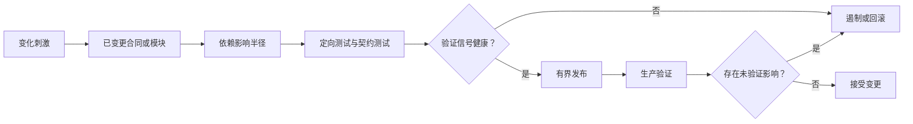

# 可维护性、可修改性与可测试性

测试全部通过，只能说明已执行的检查没有发现问题；它不能说明变化容易理解、影响范围完整，或生产行为安全。本文位于[质量属性（Quality Attribute）目录](/quality-attributes)，用一个有边界的变化场景验证可维护性。

## 学习问题

- 可维护性、可修改性与可测试性如何区分？
- 一次合同变化的影响半径应怎样显式列出？
- 契约测试与运行验证分别证明什么？
- 回滚和遏制为什么属于变化场景？

## 定义与业务目标

**来源事实：** [Maintainability](https://www.sei.cmu.edu/library/maintainability/)报告提供以质量属性场景分析维护需求、架构机制和风险的方法。[ISO/IEC 25010:2023](https://www.iso.org/standard/78176.html)提供产品质量模型中的可维护性定义背景。

本文把可维护性作为在预期变化与支持任务下维持有效工作的总体能力。可修改性聚焦以受控成本完成指定修改，可测试性聚焦建立故障与符合性证据的难易。本站分析认为三者相互支持但不能互相替代：容易测试的紧耦合系统仍可能难改，模块很小也不自动代表变化安全。

## 质量属性场景

本站原创变化场景使用六个质量属性场景字段，并把验证与回退纳入响应：

| 字段 | 本场景 |
| --- | --- |
| 来源 | 产品规则负责人 |
| 刺激 | 为订单折扣合同增加可选资格字段 |
| 环境 | 新旧调用方并存、正常发布窗口 |
| 对象 | 应用程序编程接口（Application Programming Interface，API）合同、规则模块、订单适配器、审计事件 |
| 响应 | 识别影响模块，兼容实现，运行契约测试并灰度验证 |
| 响应度量 | 变更集中在批准模块；未知影响为零；可回滚且旧调用方继续工作 |

受影响模块清单至少覆盖合同定义、生成客户端、规则执行、持久化、事件与观测。影响半径不是文件计数，而是可能改变的依赖、状态、权限和业务语义集合。

### 来源（Source）

产品规则负责人提出变化。

### 刺激（Stimulus）

为订单折扣合同增加可选资格字段。

### 环境（Environment）

新旧调用方并存于正常发布窗口。

### 对象（Artifact）

API 合同、规则模块、订单适配器与审计事件受到检查。

### 响应（Response）

团队识别影响模块、保持兼容实现、运行合同测试并灰度验证。

### 响应度量（Response Measure）

变更集中在批准模块，未知影响为零，回滚可执行且旧调用方继续工作。

## 架构策略

先从已变更合同建立依赖图，再用契约测试锁定新旧消费者的可观察行为。先看本站原创插图中的证据门：定向测试之后仍要跨过运行验证，任何未验证影响都不能被绿色测试吞掉。

*图：测试通过与生产验证是两道不同证据门；未验证影响必须进入遏制或回滚分支。*

插图不提供通用覆盖率门槛，也不声称模块更小就自动可维护。以下本站原创流程精确区分依赖半径、测试、运行验证和遏制：

信息隐藏、稳定接口、依赖方向和替换缝可以缩小变化传播，但也会增加适配层与治理成本。契约测试验证边界形状与选定行为，运行信号验证真实流量、状态和依赖；任一缺失都不能完成场景。

## 测量信号与阈值

记录已触及模块、受影响消费者、合同测试矩阵、构建与部署时长、回归失败、运行错误、旧客户端成功率、回滚时间和未验证影响。阈值应绑定具体变化类型，例如“所有已登记消费者均有合同结果”，而不是一个通用覆盖率百分比。

测试覆盖率只能描述被工具计量的代码执行比例。它既不能证明断言正确，也不能证明依赖清单完整。单独的覆盖率百分比既不证明可维护性，也不证明可安全修改。

## 权衡与失败模式

更细模块可以隔离部分变化，却增加跨边界协调、版本和观测成本；更多测试提高回归信心，却延长反馈并可能固化实现细节；共享合同减少重复，但错误变更会扩大影响半径。回滚提高恢复能力，也要求数据库和事件变化保持可逆或可兼容。

失败模式是只根据覆盖率批准发布，因为遗漏的消费者和语义变化不在分母中，最终导致测试绿色而旧调用方失败。另一个反例是把“只改一个模块”当作影响半径很小，却没有检查生成代码、缓存键、事件或权限。不要在不可逆迁移、未知消费者或无运行验证信号时直接删除旧合同；对于一次性、隔离且无外部消费者的脚本，不适用完整合同矩阵，但仍需保留失败和恢复证据。

## 相邻质量属性

[可扩展性与弹性](/quality-attributes/qa-04)说明扩缩和分区策略本身会成为变化对象；[兼容性与版本迁移](/quality-attributes/qa-07)提供新旧合同并存的检查层次。

[微前端案例](/cases/micro-frontends-single-spa)可检查团队和前端边界，[智能体（Agent）软件开发工具包（Software Development Kit，SDK）案例](/cases/openai-agents-sdk)可检查管理器、移交（Handoff）与工具合同。案例不能证明当前系统的变化成本。

## 说明性场景

**说明性场景：** 团队为折扣请求增加可选字段，依赖图显示 API、生成客户端、规则模块和审计事件受影响。合同测试覆盖旧客户端缺省行为与新客户端字段行为，灰度后运行信号却显示一个离线消费者拒绝新事件；发布因此遏制到旧事件形状，并在消费者迁移后重试（Retry）。

**本站分析：** 该场景证明维护判断必须串起变化来源、影响模块、验证信号和回滚。测试通过是必要证据之一，不是安全修改的结论。

## 来源

- [Maintainability](https://www.sei.cmu.edu/library/maintainability/)：用于定义、场景方法与架构分析边界。
- [ISO/IEC 25010:2023](https://www.iso.org/standard/78176.html)：用于质量模型定义与比较；不复制标准正文。
- [Awesome Software Architecture](https://github.com/mehdihadeli/awesome-software-architecture)：仅作学习导航，不支持事实、覆盖率阈值或效果结论。

成本效率与可持续性也会约束本页的容量、变化、或运行决策，参见[成本效率与可持续性](/quality-attributes/qa-10)。
