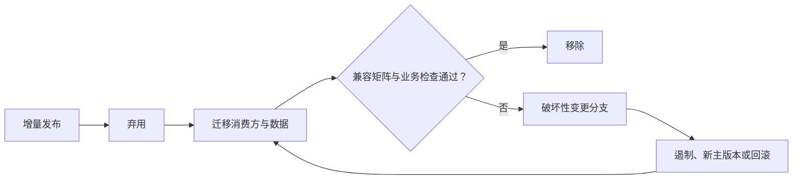

# 兼容性、互操作与版本迁移

两个系统都通过接口描述校验，仍可能对金额、缺省值或错误恢复作出不同解释。本文位于[质量属性（Quality Attribute）目录](/quality-attributes)：兼容性必须同时检查源码、传输表示与语义；互操作还要验证协议任务是否产生可接受的业务结果。

## 学习问题

- 源码、传输表示与语义兼容分别会怎样失效？
- 协议互操作与业务兼容有何区别？
- 增量发布、弃用、迁移、移除如何形成受控版本流？
- 为什么相同接口描述或版本标签仍不能保证语义互通？

## 定义与业务目标

**来源事实：** [向后兼容指南](https://google.aip.dev/180)明确区分源码、传输表示与语义兼容，并说明兼容判断不是所有变化的完整清单。[接口版本指南](https://google.aip.dev/185)提供版本并存与弃用期指导。[开放式接口描述规范](https://spec.openapis.org/oas/v3.1.1.html)定义超文本传输协议（Hypertext Transfer Protocol，HTTP）应用程序编程接口（Application Programming Interface，API）的语言无关描述格式。

兼容性关注新旧参与方组合是否保持声明的合同；互操作关注独立系统能否通过协议交换信息并完成约定行为。本站分析把业务兼容作为额外边界：协议消息可解析不代表金额、权限、幂等或终态含义一致。

## 质量属性场景

本站原创矩阵要求新旧提供方与消费方在三层分别验证。以下质量属性场景字段与矩阵共同构成验证边界：

| 组合 | 源码 | 传输表示 | 语义 |
| --- | --- | --- | --- |
| 旧消费方 → 新提供方 | 旧客户端仍可构建运行 | 旧字段可序列化与解析 | 缺省值和结果含义不变 |
| 新消费方 → 旧提供方 | 新能力可降级或受阻 | 未知字段处理已声明 | 不把缺失能力误判为成功 |
| 新消费方 → 新提供方 | 新合同可使用 | 新字段往返一致 | 新行为满足业务规则 |
| 旧消费方 → 旧提供方 | 基线可复现 | 基线编码稳定 | 基线语义作为比较证据 |

### 来源（Source）

应用程序编程接口所有者发起合同变化。

### 刺激（Stimulus）

增加字段并准备移除旧字段。

### 环境（Environment）

新旧客户端与服务端同时存在。

### 对象（Artifact）

软件开发工具包（Software Development Kit，SDK）、接口描述、传输载荷、业务规则和迁移状态共同受影响。

### 响应（Response）

系统依次增量发布、弃用、迁移，最后才移除。

### 响应度量（Response Measure）

兼容矩阵通过、旧流量满足移除条件、语义差异已批准且迁移可回退。

## 架构策略

先看本站原创插图中的三层检查与右侧版本流：源码、传输表示、语义分别验证旧端与新端，互操作边界另查协议和行为；迁移失败则进入破坏性变更分支。

*图：接口形状相同不等于语义兼容；移除旧版本前还要验证互操作行为与迁移证据。*

插图不把共享接口描述、传输方式或版本标签当成语义兼容保证。迁移按以下本站原创状态流推进，任何阶段失败都回到可兼容状态：

先以增量变化保持旧方工作，再用观测确认消费者迁移；弃用只是通知和约束，不能替代迁移证据；移除必须等待旧流量、数据和回退边界满足。协议互操作测试检查握手、序列化、错误和任务状态，业务兼容测试另查权限、单位、幂等与终态。

## 测量信号与阈值

至少记录各矩阵组合的构建结果、请求/响应解码、未知字段、缺省行为、错误映射、旧版本流量、弃用告警、业务不变量与回滚时间。[接口描述规范版本索引](https://spec.openapis.org/oas/)可用于核对已发布版本和模式迭代，但模式不能捕获所有规范违反，更不能验证业务语义。

阈值应是“所有登记组合和关键不变量通过、旧使用量满足移除条件”，而不是“版本号相同”。接口描述符合性或版本匹配都不保证语义互操作。

## 权衡与失败模式

长期并行版本降低迁移风险，却增加实现、测试和安全维护成本；宽容读取改善传输表示演进，却可能掩盖拼写错误或未知语义；快速移除减少遗留，却会中断不可见消费者。新主版本给出清晰边界，也需要数据、路由和支持策略。

失败模式是只比较接口描述形状，因为双方可能对缺省金额单位或空值含义理解不同，导致协议成功而业务错误。另一个反例是看到旧版本请求下降就移除字段，却没有检查批任务、缓存数据和回滚客户端。不要在消费者清单未知、语义差异未批准或回退不可用时移除；对于完全同构、同部署且强制同步升级的内部模块，不适用长期并行版本，但仍需验证迁移时序。

## 相邻质量属性

[可扩展性](/quality-attributes/qa-04)涉及新旧分区路由与规模单位，[安全性（Security）与隐私（Privacy）](/quality-attributes/qa-05)约束身份、授权和数据目的在版本迁移中的连续性，[可维护性](/quality-attributes/qa-06)约束合同变化的影响半径和验证。

[智能体（Agent）开发工具包与智能体间协议（Agent2Agent Protocol，A2A）案例](/cases/google-adk-a2a)可检查跨运行时任务互操作，[微前端案例](/cases/micro-frontends-single-spa)可检查独立发布边界。案例中的协议或版本不等于当前系统的业务兼容证明。

## 说明性场景

**说明性场景：** 服务端增量增加 `currency`，旧客户端继续省略该字段。传输表示测试通过，但新服务端把缺省解释为账户币种，旧服务端仍解释为固定币种；团队因此在语义层判定失败，停止移除，增加显式迁移和业务不变量检查。

**本站分析：** 该场景说明可解析只是中间证据。只有源码、传输表示、语义和协议/业务两类检查都在声明边界内成立，版本迁移才能继续。

## 来源

- [OpenAPI Specification v3.1.1](https://spec.openapis.org/oas/v3.1.1.html)：用于接口描述定义与版本事实；不作为实现或业务语义保证。
- [OpenAPI Specification versions and schema iterations](https://spec.openapis.org/oas/)：用于学习已发布版本与模式边界。
- [AIP-180: Backwards compatibility](https://google.aip.dev/180)：用于三类兼容性的定义与方法。
- [AIP-185: API Versioning](https://google.aip.dev/185)：用于版本、弃用和迁移学习。
- [Awesome Software Architecture](https://github.com/mehdihadeli/awesome-software-architecture)：仅作学习导航，不支持兼容性事实或效果结论。
