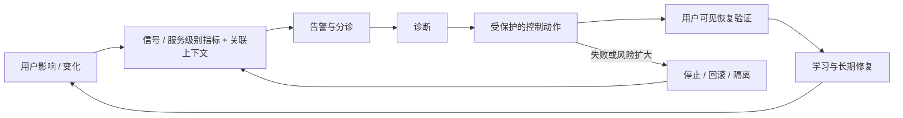

# 可运维性、可观测性与事件闭环

有遥测、有仪表盘、有服务级别目标面板，仍可能没人能安全地停止错误发布、判断用户是否恢复，或把临时修复交给长期负责人。可观测性帮助从系统输出推断内部状态；可运维性还要求人和自动化能够在压力下采取受控动作并验证结果。

本文位于[质量属性（Quality Attribute）目录](/quality-attributes)，承接[可靠性与恢复](/quality-attributes/qa-02)和[可扩展性与弹性](/quality-attributes/qa-04)，给出从用户影响到学习的有界运行闭环。

## 学习问题

- 监控、可观测性与可运维性分别解决什么问题？
- 信号如何携带版本、配置、区域和请求关联上下文？
- 谁负责值守、指挥、操作、沟通、恢复验证和长期修复？
- 自动化动作为什么仍需要停止、回滚与审计边界？

## 定义与业务目标

**来源事实：** [Observability Primer](https://opentelemetry.io/docs/concepts/observability-primer/)解释遥测与可观测性概念；[Chapter 6 - Monitoring Distributed Systems](https://sre.google/sre-book/monitoring-distributed-systems/)提供有年代语境的监控和告警指导；[Chapter 14 - Managing Incidents](https://sre.google/sre-book/managing-incidents/)描述事件响应中的明确职责。本站只做原创摘要，不改编其图表或正文。

| 能力 | 回答的问题 | 典型证据 | 不足以证明 |
| --- | --- | --- | --- |
| 监控 | 已知条件是否发生 | 指标、事件、探测与告警 | 未知故障可诊断 |
| 可观测性 | 能否从输出解释内部状态 | 可关联的遥测与查询 | 有人能安全恢复 |
| 可运维性 | 能否采取受控动作并验证用户恢复 | 权限、手册、回滚、沟通、恢复证据 | 永不故障 |

**本站定义：** 可运维性是在声明的人员、权限、时间和依赖边界内，识别影响、诊断原因、执行可停止或回滚的动作、验证用户可见恢复并完成学习的能力。它不要求小团队把每种职责分配给不同的人，但要求当班时明确谁承担哪顶“帽子”，并避免同一人未经复核同时做不可逆操作和宣告恢复。

遥测不能证明系统可运维，自动化也不能证明故障一定恢复；两者都必须进入有责任、停止和验证门的控制环。

## 质量属性场景

下表是本站原创六个质量属性场景字段；版本、配置、区域和请求关联是定位条件，不是供应商通用字段。

| 字段 | 场景 |
| --- | --- |
| 来源 | 新版本发布与区域依赖抖动（Jitter） |
| 刺激 | 部分请求错误率和完成延迟上升 |
| 环境 | 多区域、灰度配置、队列积压，值守人员可用 |
| 对象 | 服务版本、配置版本、区域、请求标识、追踪与控制面 |
| 响应 | 告警分诊，关联变化，受控回滚或隔离，验证用户恢复并沟通 |
| 响应度量 | 影响范围、动作审批、恢复时间、用户成功和后续负责人均可核对 |

### 来源（Source）

新版本发布与区域依赖抖动。

### 刺激（Stimulus）

部分请求错误率和完成延迟上升。

### 环境（Environment）

多区域、灰度配置、队列积压，值守人员可用。

### 对象（Artifact）

服务版本、配置版本、区域、请求标识、追踪与控制面。

### 响应（Response）

系统触发告警分诊、关联变化、受控回滚或隔离，并验证用户恢复与沟通。

### 响应度量（Response Measure）

影响范围、动作审批、恢复时间、用户成功和后续负责人均可核对。

证据要把同一请求的版本、配置、区域、租户或主体与请求/追踪关联连起来。只有全局错误率而没有变化上下文，会把诊断变成猜测。

## 架构策略

闭环顺序固定为：用户影响与变化 → 信号/服务级别指标和关联上下文 → 告警与分诊 → 诊断 → 受控动作 → 用户可见恢复验证 → 学习。

先看本站原创插图中的主闭环、停止分支与责任带：受控动作之后仍需跨过用户可见恢复验证，失败或风险扩大时进入停止、回滚与审计；独立降级访问路径避免主要故障域同时切断操作能力。

*图：遥测和自动化只有进入有责任、停止、回滚、审计与用户恢复验证的闭环，才形成可运维证据。*

插图不把遥测、服务级别目标面板或自动化当作恢复保证。以下本站原创流程图把闭环的每一跳、失败返回、停止点与学习回路固定下来：

控制动作必须绑定权限、前置检查、超时、停止条件、回滚和审计。还要保留独立于主要故障域的降级访问路径；否则控制面、身份或文档与业务一起失效时，值守者看得到告警却做不了动作。

值班人员负责接收和初步分诊，事件指挥维护优先级与决策节奏，运行操作执行受控变更。沟通负责人同步用户和相关方，服务负责人验证业务恢复，长期负责人关闭根因和系统性动作。小团队可以由同一人分时承担多项职责，但交接点、权限与复核仍要可见。

## 测量信号与阈值

至少采集用户成功、错误预算相关服务级别指标、排队和饱和、版本、配置、区域、依赖，以及请求或追踪标识。还要记录告警与确认时间、控制动作、回滚结果、沟通时间和用户可见恢复证据。

所谓“指标/日志/追踪三大支柱”是常见组织方式，不是完整性证明；业务事件、配置和剖析等信号也可能必要。

阈值来自用户影响和运行预算。告警应导向具体分诊责任，恢复门则要观察真实用户路径或等价业务探测；“进程恢复”和“服务级别目标面板转绿”都不能单独宣告恢复。

## 权衡与失败模式

更多遥测提高诊断可能性，却增加成本、隐私（Privacy）风险和关联噪声；更积极的自动化缩短动作时间，却可能在错误假设下扩大影响；更严格的审批减少误操作，却延长紧急恢复。可运维性设计要把这些代价与故障后果匹配。

失败模式是把遥测覆盖率当成可运维性，因为值守者可能缺少权限、降级入口或回滚路径，最终导致“看见但无法控制”。另一个反例是自动化检测到异常后反复重启，因为动作没有冷却、停止和用户恢复验证，造成更长中断。仪表盘、服务级别目标面板、“三大支柱”与自动化都不证明可运维性；当系统没有长期运行责任、失败后可直接废弃且无用户影响时，可简化事件组织，但仍需定义终止和数据处理。

## 相邻质量属性

[可靠性](/quality-attributes/qa-02)定义失效与恢复证据，[可扩展性](/quality-attributes/qa-04)提供容量控制环。

[安全性（Security）与隐私（Privacy）](/quality-attributes/qa-05)约束遥测数据和运行权限，[安全保障（Safety）](/quality-attributes/qa-09)要求物理风险动作具有更严格的安全边界。

[单元化与洗牌分片案例](/cases/aws-cell-shuffle-sharding)可检查隔离后的诊断范围；[智能体（Agent）软件开发工具包（Software Development Kit，SDK）案例](/cases/openai-agents-sdk)可检查任务、工具和追踪边界。案例中的信号不证明目标系统可恢复。

## 说明性场景

**说明性场景：** 灰度区域出现用户完成率下降。值班人员用请求标识关联到版本、配置和区域，事件指挥冻结后续发布，运行操作执行有审计的回滚；沟通负责人同步影响，服务负责人通过用户可见路径确认恢复，长期负责人接管配置验证缺口。若回滚扩大错误，动作立即停止并隔离该区域。

**基于证据的推断：** 这条闭环能证明声明事件中责任、控制和恢复证据被串联，不能证明遥测已覆盖未知故障，也不保证自动化一定恢复服务。

## 来源

- [Observability Primer](https://opentelemetry.io/docs/concepts/observability-primer/)：用于可观测性和遥测概念；本站使用原创解释，不复制其图。
- [Chapter 6 - Monitoring Distributed Systems](https://sre.google/sre-book/monitoring-distributed-systems/)：用于监控与告警的事实摘要；不作为通用阈值或当前供应商政策。
- [Chapter 14 - Managing Incidents](https://sre.google/sre-book/managing-incidents/)：用于事件职责与流程学习；不翻译或改编其图文。
- [Awesome Software Architecture](https://github.com/mehdihadeli/awesome-software-architecture)：仅作架构学习导航，不支持事实、实现、运行或效果结论。

成本效率与可持续性也会约束本页的容量、变化、或运行决策，参见[成本效率与可持续性](/quality-attributes/qa-10)。
