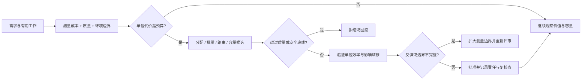

# 成本效率与可持续性

便宜不等于高效，资源利用率高也不等于可持续。架构需要先定义有用工作、服务边界、成本归属和环境约束，再判断某项优化是否真的减少了单位代价而没有转移风险。

本文位于[质量属性目录](/quality-attributes)，承接[质量属性场景写法](/quality-attributes/qa-01)，并连接性能、弹性、可维护性和可运维性。FinOps 的[单位经济性](https://www.finops.org/framework/)用于成本与业务价值的边界；Green Software Foundation 的[Software Carbon Intensity](https://sci.greensoftware.foundation/)用于软件碳强度测量边界。它们都不替代本地业务、供应商和生命周期数据。

## 学习问题

- 成本、成本效率、单位经济性和可持续性分别保护什么？
- 如何避免把共享基础设施费用错误归给单个团队或请求？
- 什么时候减少计算量会损害可靠性、延迟或可维护性？
- 如何识别效率优化造成的反弹效应和影响转移？

## 定义与业务目标

**来源事实：** FinOps 把成本与使用量放回业务价值、分配和决策上下文；SCI 将软件碳强度表达为给定功能单位对应的运营与 embodied emissions 估算。本站分析据此把成本效率定义为在明确服务质量和风险约束下，用更少的可归属资源完成同等或更多有用工作；可持续性则还要考虑能源、碳、硬件生命周期、用水或其他明确的环境边界。

| 目标 | 要先说明 | 不能直接推出 |
| --- | --- | --- |
| 财务成本 | 账单范围、归属规则、时间窗口、承诺和汇率 | 低账单即高价值 |
| 成本效率 | 有用工作分母、质量门槛、容量与故障预算 | 高利用率即没有浪费 |
| 可持续性 | 生命周期边界、排放因子、硬件和地域假设 | 一个碳数字代表全部环境影响 |

业务目标应同时给出质量底线、预算窗口、价值分母、责任人和重新评估条件。若只是一次性开发者环境或没有可观察的使用量与质量信号，不应伪装成精确的单位经济性结论。

## 质量属性场景

以下是本站原创场景，不是供应商阈值或普适基准。

| 字段 | 场景 |
| --- | --- |
| Source | 产品流量、批处理任务和容量控制器 |
| Stimulus | 需求增长，同时单位成本和尾延迟接近各自预算 |
| Environment | 多租户共享资源、部分预留容量、跨区域部署和可选模型 |
| Artifact | 路由、队列、存储、计算、账单分配与质量信号 |
| Response | 在不越过可靠性、延迟和安全底线时调整容量、路由或工作量 |
| Response measure | 有用工作完成量、单位成本、p95/p99、错误、容量余量和声明环境指标均在批准边界内 |

### Source

产品请求、后台任务和周期性报表共同产生可计量需求。

### Stimulus

需求变化使单位成本上升，或优化动作改变了质量信号。

### Environment

系统存在共享租户、异步队列、数据保留、跨区域流量与资源承诺。

### Artifact

调用链、模型/服务路由、计算和存储资源、成本分配账本、质量与环境测量。

### Response

系统限制无价值工作，调整批量、缓存、容量或路由，并保留回滚与审计路径。

### Response measure

单位有用工作成本、质量门槛、资源利用、排队、故障、碳估算和分配覆盖率满足显式目标。

## 架构策略

成本优化必须先画出“价值—成本—质量—环境”的边界。本站原创分配表把动作与可能转移的代价放在一起：

*图：减少资源不等于减少总影响；每个优化动作都要经过质量门槛、分配覆盖和生命周期边界验证。*

不要只减少实例数；先去除无价值重试、重复序列化、过度保留和不必要的高规格资源，再验证质量。共享平台需要把成本分为直接成本、共享成本和未分配成本，并公开分配假设。缓存、批处理、低碳地域、较低规格和异步化都可能降低某个指标，却增加陈旧读、等待、迁移、排放转移或运维复杂度。

## 测量信号与阈值

至少记录有用工作分母、直接与共享成本、分配覆盖率、请求量、成功量、单位成本、p95/p99、错误、队列、容量余量、重试、数据保留，以及声明边界内的能耗或碳估算。阈值必须来自业务预算、质量场景、供应商账单和可复查测量，不能从单次账单或默认排放因子外推。

成本效率的证据需要回答“完成了什么工作、支付了什么代价、质量是否保持”；可持续性证据还要回答“测量了哪些生命周期阶段、使用了什么因子、哪些影响被排除”。如果分母变化、流量转移、质量下降或反弹效应未被观察，结论只能是局部优化观察。

## 权衡与失败模式

更高的预留容量减少扩容延迟，却增加闲置成本；更激进的批处理降低单位成本，却增加排队和失败重做；更短的保留期减少存储与潜在环境负担，却可能损害审计和恢复；低碳地域可能增加网络延迟、数据驻留和跨区域传输。提高利用率也可能减少故障余量，让峰值恢复更慢。

失败模式是把云账单下降当作成本效率，把 CPU 利用率当作可持续性，或把模型换小后增加重试和人工处理却仍宣布节省。另一个失败模式是把排放从计算转移到网络、硬件或用户设备。对于没有业务价值分母、质量预算、稳定测量边界或可归属账本的探索性任务，不适用精确单位经济性门槛；应先建立测量和停止条件。

## 相邻质量属性

[QA-03 性能与容量](/quality-attributes/qa-03)说明单位成本不能牺牲尾延迟和容量边界；[QA-04 可扩展性与弹性](/quality-attributes/qa-04)说明扩缩动作的闲置、迁移和共享瓶颈代价；[QA-06 可维护性](/quality-attributes/qa-06)提醒短期省钱可能增加未来变更成本；[QA-08 可运维性](/quality-attributes/qa-08)要求成本异常和优化动作可诊断、可停止、可回滚。

[LiteLLM Virtual Keys 治理](/cases/litellm-virtual-keys-governance)可检查配额、预算和成本归属边界；[AWS Cell 与 Shuffle Sharding](/cases/aws-cell-shuffle-sharding)可检查隔离带来的容量余量与运维成本。案例不能证明其他系统的单位效率或环境效果。

## 说明性场景

**说明性场景：** 某多租户报表服务发现单位报表成本上升。团队先按租户、查询类型和共享资源分配账单，发现重复重试与过长保留贡献主要成本；去除重复工作后 p95 保持在预算内，但缩短保留期会损害审计，因此只对可重建中间结果执行。随后再测量跨区域传输和容量余量，确认没有把成本或环境影响转移到另一层。

**本站分析：** 只有价值分母、质量底线、成本归属和声明的环境边界同时有证据时，才能称为局部成本效率改善；它不自动证明整个系统更可持续。

## 来源

- [FinOps Framework](https://www.finops.org/framework/)：用于成本可见性、分配、单位经济性和价值决策的事实与方法边界；不作为任何组织的财务承诺。
- [Software Carbon Intensity Specification](https://sci.greensoftware.foundation/)：用于软件碳强度的测量边界和生命周期思考；不把单次 SCI 结果当作全部环境影响或跨供应商保证。
- [Awesome Software Architecture](https://github.com/mehdihadeli/awesome-software-architecture)：仅作架构学习导航，不支持事实、实现或效果结论。
